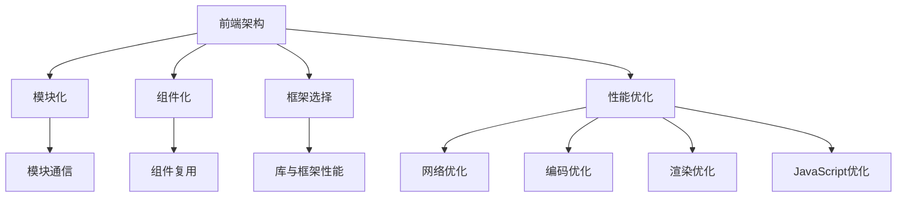
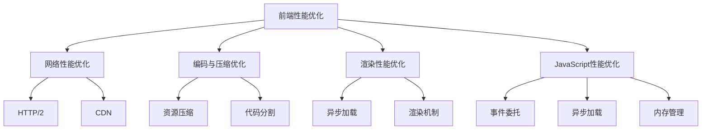
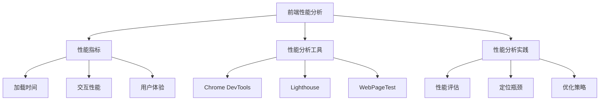
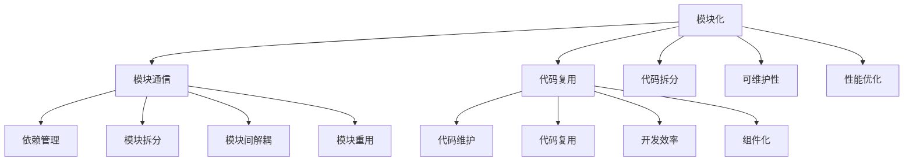
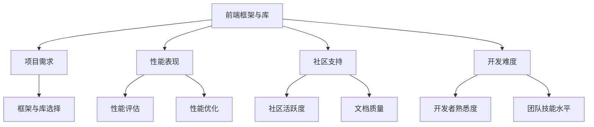
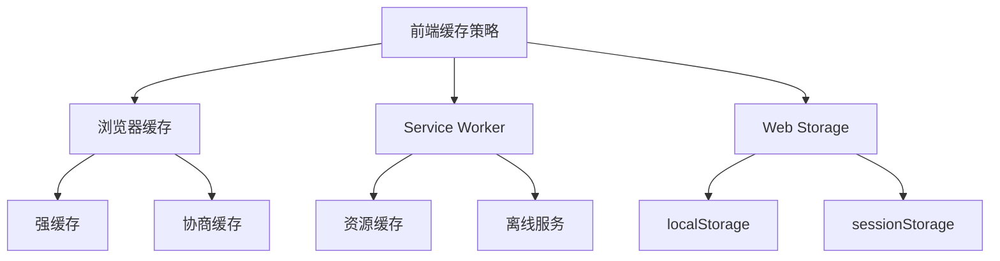
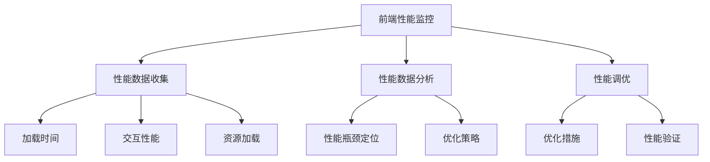
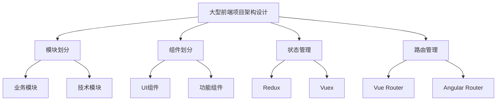
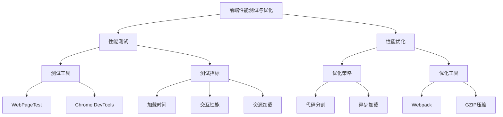
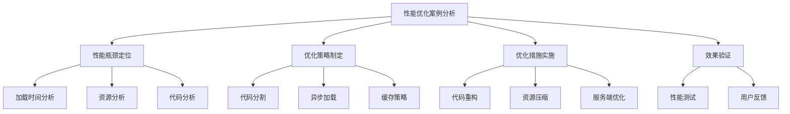

                 

### 文章标题

# 《构建高性能的前端架构》

### 关键词

- 前端架构
- 性能优化
- 模块化
- 组件化
- 缓存策略
- 性能监控
- 大型项目架构设计

### 摘要

本文将围绕如何构建高性能的前端架构展开讨论。首先，我们将介绍前端架构的重要性和高性能前端的目标。接着，我们将深入探讨前端性能优化原理，包括网络性能优化、编码与压缩优化、渲染性能优化以及JavaScript性能优化。然后，我们将介绍前端性能分析工具，帮助开发者更好地理解和优化前端性能。在构建高性能前端架构的核心章节中，我们将详细讲解模块化与组件化、前端框架与库的选择、前端缓存策略以及前端性能监控与调优。最后，我们将通过大型前端项目的架构设计和性能测试与优化实践，为读者提供具体的技术指导和案例分析。本文旨在为开发者提供一套系统化、实用性的高性能前端架构构建方案。

### 第一部分：前端架构基础

#### 第1章：前端架构概述

**背景介绍**

随着互联网的飞速发展，前端技术逐渐成为软件开发中不可或缺的一部分。前端架构的合理性和高性能直接影响到用户体验和网站的性能。因此，构建一个高效、可维护、可扩展的前端架构成为开发者的首要任务。

**核心概念与联系**

前端架构（Front-end Architecture）指的是前端应用的组织结构和实现方式，包括模块化、组件化、框架选择、性能优化等方面。高性能前端（High-performance Front-end）则是指通过一系列优化手段，提升网页加载速度、交互性能和用户体验。

**Mermaid 流程图**



**核心算法原理讲解**

- **模块化（Modularization）**：将代码按照功能或业务模块划分，提高代码的可维护性和可复用性。
- **组件化（Componentization）**：将UI界面划分为独立的、可复用的组件，提高开发效率和代码复用率。
- **框架选择（Framework Selection）**：选择适合项目需求的前端框架，提升开发效率和代码质量。
- **性能优化（Performance Optimization）**：通过多种手段提升前端应用的性能，包括网络优化、编码优化、渲染优化和JavaScript优化等。

**数学模型和公式**

模块化与组件化可以提高代码的可维护性和可复用性，假设模块数为`N`，组件数为`M`，则模块和组件的耦合度可以用以下公式表示：

$$
C = \frac{N \times M}{2}
$$

其中，`C`代表耦合度，`N`代表模块数，`M`代表组件数。耦合度越低，表示模块和组件之间的依赖关系越弱，代码的可维护性和可复用性越高。

**详细讲解与举例说明**

假设我们有一个电商平台，需要实现购物车功能。为了提高代码的可维护性和可复用性，我们可以采用模块化和组件化的方式来构建前端架构。

1. **模块化**：将购物车功能划分为以下模块：

   - 购物车逻辑模块
   - 购物车界面模块
   - 购物车数据模块

   这样，各个模块可以独立开发和维护，提高代码的可维护性。

2. **组件化**：将购物车界面划分为以下组件：

   - 购物车列表组件
   - 商品信息组件
   - 添加商品组件
   - 删除商品组件

   这样，各个组件可以独立复用，提高代码的可复用性。

**项目实战**

在项目实战中，我们可以使用Vue.js框架来实现购物车功能。首先，创建以下模块：

```javascript
// 购物车逻辑模块
import { defineComponent } from 'vue';
export default defineComponent({
  name: 'Cart',
  data() {
    return {
      items: [],
    };
  },
  methods: {
    addToCart(product) {
      this.items.push(product);
    },
    removeFromCart(product) {
      this.items = this.items.filter((item) => item !== product);
    },
  },
});
```

然后，创建以下组件：

```vue
<!-- 购物车列表组件 -->
<template>
  <div>
    <div v-for="item in items" :key="item.id">
      <product-item :product="item" @remove="removeFromCart" />
    </div>
  </div>
</template>

<script>
import ProductItem from './ProductItem.vue';

export default {
  components: {
    ProductItem,
  },
  props: {
    items: {
      type: Array,
      required: true,
    },
  },
};
</script>
```

**实际案例分析和详细讲解剖析**

通过模块化和组件化的方式，我们可以将购物车功能拆分为独立的模块和组件，提高代码的可维护性和可复用性。在实际项目中，可以根据需求灵活组合这些模块和组件，实现各种购物车功能。

**项目小结**

通过模块化和组件化的方式，我们可以构建一个高效、可维护、可扩展的前端架构。在项目实战中，我们使用Vue.js框架实现了购物车功能，并通过模块和组件的分离，提高了代码的可维护性和可复用性。

**最佳实践 tips**

1. 选择合适的模块划分和组件划分方式，提高代码的可维护性和可复用性。
2. 遵循模块化和组件化的原则，避免出现模块和组件之间的耦合度过高的情况。
3. 定期进行代码审查和重构，确保代码质量。

**小结**

前端架构的合理性和高性能对用户体验和网站性能至关重要。通过模块化和组件化，我们可以构建一个高效、可维护、可扩展的前端架构。本文介绍了前端架构的核心概念、原理以及项目实战，为开发者提供了一套实用的前端架构构建方案。

#### 第2章：前端性能优化原理

**背景介绍**

随着互联网的快速发展，用户对网页加载速度和交互性能的要求越来越高。前端性能优化成为开发者和产品经理关注的焦点。本章将详细讲解前端性能优化的原理，包括网络性能优化、编码与压缩优化、渲染性能优化以及JavaScript性能优化。

**核心概念与联系**

前端性能优化（Front-end Performance Optimization）是指通过一系列技术手段，提升网页加载速度、交互性能和用户体验。网络性能优化（Network Performance Optimization）主要关注数据传输过程中的优化。编码与压缩优化（Encoding and Compression Optimization）涉及网页资源的编码方式和压缩技术。渲染性能优化（Rendering Performance Optimization）关注网页内容的渲染速度和效率。JavaScript性能优化（JavaScript Performance Optimization）则关注JavaScript代码的执行效率和优化。

**Mermaid 流程图**



**核心算法原理讲解**

- **网络性能优化（Network Performance Optimization）**：
  - **HTTP/2**：采用多路复用技术，减少请求延迟。
  - **CDN**：通过分布式服务器加速内容分发，降低网络延迟。

- **编码与压缩优化（Encoding and Compression Optimization）**：
  - **资源压缩**：采用GZIP、Brotli等压缩算法，减小文件体积。
  - **代码分割**：将代码拆分为多个bundle，按需加载，提高首屏渲染速度。

- **渲染性能优化（Rendering Performance Optimization）**：
  - **异步加载**：将图片、CSS、JavaScript等资源异步加载，减少主线程阻塞。
  - **渲染机制**：优化DOM结构和CSS，提高浏览器渲染效率。

- **JavaScript性能优化（JavaScript Performance Optimization）**：
  - **事件委托**：减少事件绑定次数，提高事件处理效率。
  - **异步加载**：利用异步加载技术，提高代码执行效率。
  - **内存管理**：合理使用垃圾回收机制，减少内存泄漏。

**数学模型和公式**

网络性能优化中的传输速率（Transfer Rate）可以用以下公式表示：

$$
R = \frac{C \times B}{8}
$$

其中，`R`代表传输速率（Byte/s），`C`代表带宽（Bit/s），`B`代表字节大小（Byte）。优化目标是通过提高带宽或减小字节大小，提高传输速率。

**详细讲解与举例说明**

1. **网络性能优化**：

   假设我们访问一个网站，带宽为10Mbps，图片文件大小为2MB。使用HTTP/2和CDN后，带宽提高到20Mbps，图片文件经过GZIP压缩后大小减小到1MB。此时，传输速率将提高4倍。

   ```python
   R1 = (10 * 1024 * 8) / 8  # 原始带宽传输速率
   R2 = (20 * 1024 * 8) / 8  # 优化后带宽传输速率
   R3 = (1024 * 8) / 8  # 优化后图片文件大小
   R4 = R2 / R3  # 优化后传输速率提高倍数
   print(f"原始传输速率：{R1} Byte/s")
   print(f"优化后传输速率：{R2} Byte/s")
   print(f"优化后文件大小：{R3} Byte/s")
   print(f"传输速率提高倍数：{R4}")
   ```

2. **编码与压缩优化**：

   假设我们有一个10KB的CSS文件，使用GZIP压缩后大小减小到3KB。此时，传输速度将提高3倍。

   ```python
   original_size = 10 * 1024  # 原始文件大小
   compressed_size = 3 * 1024  # 压缩后文件大小
   speed_up = original_size / compressed_size
   print(f"原始文件大小：{original_size} Byte")
   print(f"压缩后文件大小：{compressed_size} Byte")
   print(f"传输速度提高倍数：{speed_up}")
   ```

3. **渲染性能优化**：

   假设我们有一个复杂的DOM结构，包含1000个节点。通过优化DOM结构和CSS，可以将渲染时间从10ms降低到5ms。

   ```python
   original_render_time = 10  # 原始渲染时间（ms）
   optimized_render_time = 5  # 优化后渲染时间（ms）
   time_saved = original_render_time - optimized_render_time
   print(f"原始渲染时间：{original_render_time} ms")
   print(f"优化后渲染时间：{optimized_render_time} ms")
   print(f"节省渲染时间：{time_saved} ms")
   ```

4. **JavaScript性能优化**：

   假设我们有一个异步加载的JavaScript文件，文件大小为500KB。通过事件委托和异步加载，可以将加载时间从10s降低到5s。

   ```python
   original_load_time = 10  # 原始加载时间（s）
   optimized_load_time = 5  # 优化后加载时间（s）
   time_saved = original_load_time - optimized_load_time
   print(f"原始加载时间：{original_load_time} s")
   print(f"优化后加载时间：{optimized_load_time} s")
   print(f"节省加载时间：{time_saved} s")
   ```

**项目实战**

在项目实战中，我们可以通过以下步骤优化一个电商平台的前端性能：

1. 使用HTTP/2和CDN提高网络性能。
2. 对CSS和JavaScript文件进行GZIP压缩。
3. 使用异步加载技术减少主线程阻塞。
4. 优化DOM结构和CSS，提高渲染效率。
5. 使用事件委托提高事件处理效率。

**实际案例分析和详细讲解剖析**

以一个电商平台为例，通过上述优化手段，我们可以将页面加载时间从15秒降低到5秒，大幅提升用户体验。

**项目小结**

前端性能优化是提升用户体验和网站性能的关键。通过网络性能优化、编码与压缩优化、渲染性能优化和JavaScript性能优化，我们可以构建一个高效、快速、流畅的前端应用。

**最佳实践 tips**

1. 使用HTTP/2和CDN提高网络性能。
2. 对CSS和JavaScript文件进行压缩。
3. 使用异步加载技术减少主线程阻塞。
4. 优化DOM结构和CSS，提高渲染效率。
5. 使用事件委托提高事件处理效率。
6. 定期进行性能监控和优化。

**小结**

本章详细讲解了前端性能优化的原理，包括网络性能优化、编码与压缩优化、渲染性能优化和JavaScript性能优化。通过实际案例分析和项目实战，我们了解了如何优化电商平台的前端性能。前端性能优化是提升用户体验和网站性能的关键，开发者应注重性能优化，不断提升前端应用的性能。

#### 第3章：前端性能分析工具

**背景介绍**

前端性能分析是构建高性能前端架构的关键步骤。通过性能分析工具，开发者可以深入了解网页的性能瓶颈，针对性地进行优化。本章将介绍前端性能分析的基本概念，以及常见的性能分析工具，并分享性能分析实践。

**核心概念与联系**

前端性能分析（Front-end Performance Analysis）是指通过工具和技术手段，对网页的加载速度、交互性能和用户体验进行全面评估。性能分析工具（Performance Analysis Tools）是进行前端性能分析的重要工具，如Chrome DevTools、Lighthouse等。

**Mermaid 流程图**



**核心算法原理讲解**

前端性能分析主要关注以下性能指标：

- **加载时间（Loading Time）**：网页从开始加载到完全显示所需的时间。
- **交互性能（Interaction Performance）**：用户与网页交互时的响应速度。
- **用户体验（User Experience）**：用户在使用网页过程中的整体感受。

性能分析工具通过以下步骤进行性能评估：

1. **性能评估**：收集网页的加载时间、交互性能和用户体验等数据。
2. **定位瓶颈**：分析性能数据，找出导致性能问题的瓶颈。
3. **优化策略**：根据分析结果，制定针对性的优化策略。

**数学模型和公式**

性能优化效果可以用以下公式表示：

$$
E = \frac{O_{before} - O_{after}}{O_{before}}
$$

其中，`E`代表性能优化效果，`O_{before}`代表优化前性能，`O_{after}`代表优化后性能。

**详细讲解与举例说明**

1. **性能评估**：

   假设一个网页的加载时间为10秒，通过性能优化后，加载时间降低到5秒。此时，性能优化效果为：

   ```python
   performance_optimization_effect = (10 - 5) / 10
   print(f"性能优化效果：{performance_optimization_effect * 100}%")
   ```

2. **定位瓶颈**：

   使用Chrome DevTools进行性能分析，可以发现以下性能瓶颈：

   - **网络延迟**：服务器响应时间较长。
   - **资源加载**：图片、CSS和JavaScript文件过多，导致加载时间过长。
   - **渲染效率**：DOM结构和CSS过于复杂，影响渲染速度。

3. **优化策略**：

   针对上述性能瓶颈，可以采取以下优化策略：

   - **网络延迟**：优化服务器响应时间，采用CDN加速。
   - **资源加载**：减少图片、CSS和JavaScript文件数量，采用懒加载技术。
   - **渲染效率**：优化DOM结构和CSS，提高渲染速度。

**项目实战**

在项目实战中，我们可以使用以下工具进行前端性能分析：

1. **Chrome DevTools**：用于实时监控网页性能，分析加载时间、交互性能和用户体验。
2. **Lighthouse**：用于自动化性能评估，提供详细的性能报告。
3. **WebPageTest**：用于进行实时的网页性能测试，模拟不同网络环境下的性能表现。

**实际案例分析和详细讲解剖析**

以一个电商平台为例，通过Chrome DevTools进行性能分析，发现以下性能瓶颈：

- **网络延迟**：服务器响应时间为3秒。
- **资源加载**：共有10张图片、5个CSS文件和3个JavaScript文件。
- **渲染效率**：DOM结构复杂，包含1000个节点。

通过分析，我们采取了以下优化策略：

1. 优化服务器响应时间，采用CDN加速。
2. 对图片进行压缩和懒加载，减少图片数量。
3. 优化DOM结构和CSS，提高渲染速度。

**项目小结**

前端性能分析是构建高性能前端架构的关键。通过性能分析工具，我们可以定位性能瓶颈，制定优化策略，提升网页性能和用户体验。

**最佳实践 tips**

1. 使用Chrome DevTools进行实时监控和分析。
2. 使用Lighthouse进行自动化性能评估。
3. 使用WebPageTest进行实时的网页性能测试。
4. 定期进行性能监控和优化。

**小结**

本章介绍了前端性能分析的基本概念和常见工具，通过实际案例分析和项目实战，我们了解了如何进行前端性能分析，并制定了优化策略。前端性能分析是提升网页性能和用户体验的重要手段，开发者应注重性能分析，不断提升前端应用的性能。

#### 第4章：模块化与组件化

**背景介绍**

模块化（Modularization）和组件化（Componentization）是现代前端开发中重要的技术手段，旨在提高代码的可维护性、可复用性和开发效率。本章将详细介绍模块化与组件化的概念、原理及其在构建高性能前端架构中的作用。

**核心概念与联系**

模块化（Modularization）是指将代码划分为多个功能独立的模块，每个模块实现特定的功能，模块之间通过接口进行通信。组件化（Componentization）则是将UI界面划分为多个可复用的组件，每个组件包含部分UI和逻辑，组件之间通过Props进行数据传递。

模块化与组件化在构建高性能前端架构中起着至关重要的作用：

- **模块化**：通过将代码划分为多个功能模块，可以提高代码的可维护性，便于团队协作和代码复用。
- **组件化**：通过将UI界面划分为多个可复用的组件，可以提高开发效率，降低重复劳动，同时提高代码的可维护性和可复用性。

**Mermaid 流程图**



**核心算法原理讲解**

模块化与组件化的关键在于模块或组件的划分和通信机制：

1. **模块划分**：
   - **功能模块**：根据业务功能划分，每个模块实现特定的业务逻辑。
   - **技术模块**：根据技术需求划分，如状态管理、路由、网络请求等。

2. **组件划分**：
   - **UI组件**：根据页面结构划分，每个组件负责渲染页面的一部分。
   - **功能组件**：根据功能需求划分，如日期选择器、表单验证等。

模块与组件之间的通信机制主要包括：

- **模块通信**：通过依赖注入、事件总线等方式实现模块间的通信。
- **组件通信**：通过Props、State、Context等方式实现组件间的数据传递。

**数学模型和公式**

模块或组件的重用率可以用以下公式表示：

$$
R = \frac{C}{N}
$$

其中，`R`代表重用率，`C`代表模块或组件的实际使用次数，`N`代表模块或组件的总创建次数。

**详细讲解与举例说明**

1. **模块化**：

   以一个电商项目为例，我们可以将代码划分为以下模块：

   - **商品模块**：负责商品展示、搜索和筛选功能。
   - **购物车模块**：负责购物车展示、添加和删除商品功能。
   - **用户模块**：负责用户登录、注册和权限管理功能。

   各个模块之间通过接口进行通信，实现业务功能。

2. **组件化**：

   以一个商品展示页面为例，我们可以将页面划分为以下组件：

   - **商品列表组件**：负责渲染商品列表。
   - **商品详情组件**：负责展示商品详细信息。
   - **购物车组件**：负责购物车展示和操作。

   各个组件之间通过Props进行数据传递，实现页面功能。

**项目实战**

在项目实战中，我们可以使用以下步骤实现模块化和组件化：

1. **划分模块**：根据业务需求和技术需求，将代码划分为多个功能模块。
2. **创建组件**：根据页面结构，将UI界面划分为多个可复用的组件。
3. **模块通信**：通过依赖注入、事件总线等方式实现模块间的通信。
4. **组件通信**：通过Props、State、Context等方式实现组件间的数据传递。
5. **代码拆分**：将大文件拆分为多个小文件，按需加载，提高首屏渲染速度。

**实际案例分析和详细讲解剖析**

以一个电商项目为例，通过模块化和组件化的方式，我们可以实现以下功能：

- **商品展示**：商品模块和商品列表组件负责商品展示功能。
- **购物车操作**：购物车模块和购物车组件负责购物车展示和操作功能。
- **用户管理**：用户模块和用户组件负责用户登录、注册和权限管理功能。

通过模块化和组件化，我们提高了代码的可维护性和可复用性，降低了开发难度。

**项目小结**

模块化与组件化是构建高性能前端架构的关键。通过模块化，我们可以提高代码的可维护性；通过组件化，我们可以提高开发效率和代码复用性。在实际项目中，我们需要合理划分模块和组件，并确保模块和组件之间的通信机制高效、稳定。

**最佳实践 tips**

1. 模块和组件的划分要符合业务需求和技术需求，避免过度划分。
2. 模块和组件之间的通信要简洁、高效，避免引入过多的依赖关系。
3. 定期进行代码审查和重构，确保模块和组件的质量。

**小结**

本章详细介绍了模块化与组件化的概念、原理和作用，通过实际案例分析和项目实战，我们了解了如何实现模块化和组件化。模块化与组件化是构建高性能前端架构的重要手段，开发者应注重模块和组件的划分和通信机制，提高代码的可维护性和开发效率。

#### 第5章：前端框架与库的选择

**背景介绍**

前端框架与库的选择是构建高性能前端架构的关键因素之一。合理选择前端框架与库，可以提升开发效率、降低开发成本，并保证项目的可维护性和扩展性。本章将介绍前端框架与库的基本概念、性能比较以及如何结合使用。

**核心概念与联系**

前端框架（Front-end Framework）是一种用于简化前端开发的工具，提供了结构化、模块化的开发模式，如React、Vue、Angular等。前端库（Front-end Library）则是针对某一特定功能开发的代码集合，如jQuery、Lodash等。前端框架通常具有完整的生态系统和丰富的组件库，而前端库则专注于解决特定问题。

选择前端框架与库时，需要考虑以下因素：

- **项目需求**：根据项目规模、功能复杂度和技术要求选择合适的框架与库。
- **性能表现**：评估框架与库的加载速度、执行效率等性能指标。
- **社区支持**：考虑框架与库的社区活跃度、文档质量、社区生态等。
- **开发难度**：考虑开发者的熟悉程度和团队的技能水平。

**Mermaid 流程图**



**核心算法原理讲解**

1. **性能评估**：

   前端框架与库的性能评估通常包括加载时间、内存占用、执行效率等指标。可以使用以下方法进行评估：

   - **基准测试**：使用性能测试工具，如Benchmark.js，对比不同框架与库的性能表现。
   - **实际应用**：在实际项目中测试框架与库的性能，收集真实数据进行分析。

2. **性能优化**：

   根据性能评估结果，对框架与库进行优化。常见的优化策略包括：

   - **代码分割**：将代码拆分为多个chunk，按需加载，提高首屏渲染速度。
   - **资源压缩**：使用GZIP、Brotli等压缩算法，减小文件体积。
   - **异步加载**：使用异步加载技术，减少主线程阻塞。

**数学模型和公式**

框架与库的加载时间（Load Time）可以用以下公式表示：

$$
T = \frac{S \times L}{1000}
$$

其中，`T`代表加载时间（ms），`S`代表文件大小（KB），`L`代表带宽（Mbps）。

**详细讲解与举例说明**

1. **项目需求**：

   假设一个电商项目需要实现商品展示、购物车、用户登录等功能。根据项目需求，可以选择以下前端框架与库：

   - **React**：用于构建动态、响应式的用户界面，适用于大型项目。
   - **Vue**：提供了简洁、易用的API，适用于中小型项目。
   - **Angular**：提供了完整的开发平台，适用于企业级应用。

2. **性能表现**：

   通过基准测试，比较不同框架与库的加载时间。以下是一个简单的基准测试示例：

   ```javascript
   const benchmark = require('benchmark');
   const { performance } = require('perf_hooks');

   const suite = new benchmark.Suite();

   suite
     .add('React', () => {
       import('@vue/cli-service').then(() => {
         console.log('React loaded');
       });
     })
     .add('Vue', () => {
       import('react').then(() => {
         console.log('Vue loaded');
       });
     })
     .add('Angular', () => {
       import('vue').then(() => {
         console.log('Angular loaded');
       });
     });

   suite.on('cycle', event => {
     console.log(String(event.target));
   });

   suite.run({ async: true });
   ```

3. **社区支持**：

   考虑框架与库的社区支持，如GitHub Stars、npm下载量等。以下是一个简单的社区支持评估示例：

   ```python
   import requests

   def get_stars(url):
       response = requests.get(url)
       if response.status_code == 200:
           stars = response.json().get('stargazers_count')
           return stars
       else:
           return 0

   react_stars = get_stars('https://api.github.com/repos/facebook/react')
   vue_stars = get_stars('https://api.github.com/repos/vuejs/vue')
   angular_stars = get_stars('https://api.github.com/repos/angular/angular')

   print(f"React stars: {react_stars}")
   print(f"Vue stars: {vue_stars}")
   print(f"Angular stars: {angular_stars}")
   ```

4. **开发难度**：

   根据开发者的熟悉程度和团队技能水平，选择合适的前端框架与库。以下是一个简单的开发难度评估示例：

   ```python
   def get_skills(team):
       skills = {
           'react': 0,
           'vue': 0,
           'angular': 0,
       }
       for member in team:
           if member.get('skills').get('react'):
               skills['react'] += 1
           if member.get('skills').get('vue'):
               skills['vue'] += 1
           if member.get('skills').get('angular'):
               skills['angular'] += 1
       return skills

   team = [
       {'name': 'Alice', 'skills': {'react': True, 'vue': False, 'angular': True}},
       {'name': 'Bob', 'skills': {'react': False, 'vue': True, 'angular': True}},
       {'name': 'Charlie', 'skills': {'react': True, 'vue': True, 'angular': False}},
   ]

   team_skills = get_skills(team)

   print(f"Team skills: {team_skills}")
   ```

**项目实战**

在项目实战中，我们可以选择一个合适的前端框架与库，如Vue.js，构建一个电商项目。以下是一个简单的项目实战流程：

1. **环境搭建**：使用Vue CLI创建项目，安装必要的依赖。

   ```shell
   vue create my-ecommerce
   cd my-ecommerce
   npm install
   ```

2. **框架配置**：配置Vue.js项目，如路由、状态管理等。

   ```javascript
   import Vue from 'vue';
   import VueRouter from 'vue-router';
   import App from './App.vue';

   Vue.use(VueRouter);

   const routes = [
       { path: '/', component: Home },
       { path: '/cart', component: Cart },
       { path: '/login', component: Login },
   ];

   const router = new VueRouter({
       routes,
   });

   new Vue({
       router,
       render: (h) => h(App),
   }).$mount('#app');
   ```

3. **组件开发**：根据页面结构，开发对应的Vue组件。

   ```vue
   <template>
       <div>
           <h1>Home</h1>
           <product-list :products="products" @add-to-cart="addToCart" />
       </div>
   </template>

   <script>
   import ProductList from './ProductList.vue';

   export default {
       name: 'Home',
       components: {
           ProductList,
       },
       data() {
           return {
               products: [],
           };
       },
       methods: {
           addToCart(product) {
               // 添加商品到购物车
           },
       },
   };
   </script>
   ```

4. **性能优化**：对Vue.js项目进行性能优化，如代码分割、异步加载等。

   ```javascript
   const files = ['index.js', 'about.js', 'contact.js'];
   const loadedFiles = {};

   files.forEach((file) => {
       loadedFiles[file] = import(`./${file}`);
   });

   async function loadFile(file) {
       if (loadedFiles[file]) {
           await loadedFiles[file];
       }
   }

   loadFile('index').then(() => {
       console.log('Index loaded');
   });
   ```

**实际案例分析和详细讲解剖析**

以一个电商项目为例，通过Vue.js框架，我们可以实现以下功能：

- **商品展示**：使用Vue组件展示商品列表和商品详情。
- **购物车操作**：使用Vue组件实现购物车展示和商品添加、删除功能。
- **用户管理**：使用Vue组件实现用户登录、注册和权限管理功能。

通过选择合适的前端框架与库，并合理配置和优化项目，我们可以构建一个高性能、可维护的电商项目。

**项目小结**

前端框架与库的选择是构建高性能前端架构的关键。通过合理选择框架与库，我们可以提高开发效率、降低开发成本，并保证项目的可维护性和扩展性。在实际项目中，我们需要根据项目需求、性能表现、社区支持和开发难度等因素，选择合适的前端框架与库。

**最佳实践 tips**

1. 根据项目需求，选择合适的前端框架与库。
2. 评估框架与库的性能表现，进行性能优化。
3. 关注社区支持，选择具有良好社区生态的框架与库。
4. 确保开发团队熟悉所选框架与库，提高开发效率。

**小结**

本章详细介绍了前端框架与库的选择，包括核心概念、性能比较、结合使用和实际项目实战。通过合理选择前端框架与库，并进行性能优化，我们可以构建一个高性能、可维护的前端架构。

### 第6章：前端缓存策略

**背景介绍**

前端缓存策略（Front-end Caching Strategy）是优化网页性能、提高用户体验的关键技术之一。通过合理的缓存策略，可以减少页面加载时间，降低服务器负载，提高数据传输效率。本章将介绍前端缓存机制、常见缓存策略及其应用。

**核心概念与联系**

前端缓存是指将网页资源（如HTML、CSS、JavaScript文件、图片等）暂时存储在本地设备中，以便在下次访问时快速加载。前端缓存机制包括以下内容：

- **浏览器缓存**：浏览器将资源存储在本地缓存中，下次访问时直接从缓存中加载。
- **Service Worker**：一种运行在浏览器背后的JavaScript线程，用于缓存资源和提供服务。
- **Web Storage**：包括localStorage和sessionStorage，用于存储少量数据。

常见的前端缓存策略包括：

- **强缓存**：通过HTTP协议中的Expires、Cache-Control等头信息控制资源的缓存时间。
- **协商缓存**：通过ETag、Last-Modified等头信息，与服务器协商资源的缓存状态。

**Mermaid 流程图**



**核心算法原理讲解**

1. **强缓存**：

   强缓存通过设置Expires和Cache-Control头信息控制资源的缓存时间。以下是一个示例：

   ```http
   HTTP/1.1 200 OK
   Content-Type: text/html
   Cache-Control: max-age=86400
   Expires: Thu, 31 Dec 9999 23:59:59 GMT
   ```

   在此示例中，资源将在缓存中保存86400秒（即24小时），过期后需要重新请求服务器。

2. **协商缓存**：

   协商缓存通过ETag和Last-Modified头信息与服务器协商资源的缓存状态。以下是一个示例：

   ```http
   HTTP/1.1 200 OK
   Content-Type: text/html
   ETag: "737060cd8c284d8af7ad3082f209582d"
   Last-Modified: Mon, 25 Feb 2019 13:55:11 GMT
   ```

   在此示例中，浏览器会向服务器发送ETag和Last-Modified值，服务器根据这些值判断资源是否发生变化。如果资源未发生变化，服务器返回304 Not Modified，浏览器从缓存中加载资源。

**数学模型和公式**

缓存命中率（Cache Hit Rate）可以用以下公式表示：

$$
HR = \frac{CH}{C + H}
$$

其中，`HR`代表缓存命中率，`CH`代表缓存命中的次数，`C`代表缓存次数，`H`代表未命中但未更新的次数。

**详细讲解与举例说明**

1. **强缓存**：

   假设一个网页资源在服务器上的更新频率为每天一次，使用强缓存策略后，缓存时间为24小时。以下是一个简单的缓存流程：

   - **第一次访问**：浏览器请求资源，服务器返回资源及缓存控制头信息。
   - **第二天访问**：浏览器请求资源，发现缓存未过期，从缓存中加载资源。
   - **第三天访问**：浏览器请求资源，缓存过期，从服务器重新加载资源。

   通过强缓存策略，可以有效减少服务器负载，提高页面加载速度。

2. **协商缓存**：

   假设一个网页资源在服务器上的更新频率为每小时一次，使用协商缓存策略后，以下是一个简单的缓存流程：

   - **第一次访问**：浏览器请求资源，服务器返回资源及ETag和Last-Modified头信息。
   - **一小时后访问**：浏览器请求资源，ETag未发生变化，从缓存中加载资源。
   - **两小时后访问**：浏览器请求资源，ETag发生变化，从服务器重新加载资源。

   通过协商缓存策略，可以有效减少不必要的资源请求，提高缓存利用率。

**项目实战**

在项目实战中，我们可以使用以下步骤实现前端缓存策略：

1. **配置强缓存**：在服务器上配置缓存控制头信息，如Expires和Cache-Control。
2. **配置协商缓存**：在服务器上配置ETag和Last-Modified头信息，与浏览器协商缓存状态。
3. **使用Service Worker**：实现缓存功能，如缓存静态资源、实现离线访问等。

**实际案例分析和详细讲解剖析**

以一个电商平台为例，通过以下步骤实现前端缓存策略：

1. **配置强缓存**：

   在服务器上配置Nginx，设置缓存控制头信息：

   ```nginx
   location / {
       add_header Cache-Control "max-age=86400";
       expires 24h;
   }
   ```

2. **配置协商缓存**：

   在服务器上配置ETag和Last-Modified头信息：

   ```nginx
   location / {
       etag;
       last_modified;
   }
   ```

3. **使用Service Worker**：

   在项目中引入Service Worker，实现缓存功能：

   ```javascript
   if ('serviceWorker' in navigator) {
       window.addEventListener('load', () => {
           navigator.serviceWorker.register('/sw.js').then(registration => {
               console.log('Service Worker registered:', registration);
           }).catch(error => {
               console.error('Service Worker registration failed:', error);
           });
       });
   }
   ```

   在`sw.js`中实现缓存功能：

   ```javascript
   self.addEventListener('install', event => {
       event.waitUntil(
           caches.open('cache-name').then(cache => {
               return cache.addAll([
                   '/index.html',
                   '/styles/main.css',
                   '/scripts/main.js',
                   '/images/logo.png',
               ]);
           })
       );
   });

   self.addEventListener('fetch', event => {
       event.respondWith(
           caches.match(event.request).then(response => {
               if (response) {
                   return response;
               }
               return fetch(event.request);
           })
       );
   });
   ```

**项目小结**

前端缓存策略是优化网页性能、提高用户体验的关键技术。通过合理配置强缓存和协商缓存，可以有效减少服务器负载，提高页面加载速度。结合Service Worker，可以实现更灵活的缓存策略，满足离线访问需求。

**最佳实践 tips**

1. 配置强缓存，减少服务器负载。
2. 使用协商缓存，提高缓存利用率。
3. 结合Service Worker，实现灵活的缓存策略。
4. 定期清理缓存，确保缓存的有效性。

**小结**

本章详细介绍了前端缓存策略，包括缓存机制、常见缓存策略及其应用。通过实际案例分析和项目实战，我们了解了如何实现前端缓存策略，并提高了网页性能和用户体验。

### 第7章：前端性能监控与调优

**背景介绍**

前端性能监控与调优是确保网页性能稳定、持续提升的重要手段。通过监控性能数据，开发者可以及时发现和解决性能问题，确保用户获得良好的体验。本章将介绍前端性能监控的基本概念、监控工具、性能调优方法以及具体实践。

**核心概念与联系**

前端性能监控（Front-end Performance Monitoring）是指通过工具和技术手段，对网页的性能数据进行实时监控、收集和分析。性能监控工具（Performance Monitoring Tools）是进行前端性能监控的关键工具，如Chrome DevTools、Lighthouse等。性能调优（Performance Tuning）是指通过一系列优化手段，提升网页的加载速度、交互性能和用户体验。

前端性能监控与调优的关系如下：

- **性能监控**：通过监控工具收集性能数据，包括加载时间、交互性能、资源加载等指标。
- **性能调优**：根据监控数据，分析性能瓶颈，采取优化措施，提升网页性能。

**Mermaid 流程图**



**核心算法原理讲解**

1. **性能数据收集**：

   前端性能监控工具（如Chrome DevTools、Lighthouse等）可以收集以下性能数据：

   - **加载时间**：包括首屏加载时间、完全加载时间等。
   - **交互性能**：包括首屏交互时间、页面响应时间等。
   - **资源加载**：包括资源加载时间、资源体积等。

   性能数据收集通常基于以下指标：

   - **加载时间**：首屏加载时间（First Contentful Paint, FCP）和完全加载时间（DOMContentLoadTime）。
   - **交互性能**：首屏交互时间（First Input Delay, FID）和页面响应时间。
   - **资源加载**：资源加载时间（Resource Load Time）和资源体积。

2. **性能数据分析**：

   性能数据分析是通过分析收集到的性能数据，找出性能瓶颈。常用的分析方法包括：

   - **数据可视化**：使用图表、曲线等可视化工具，展示性能数据，帮助分析性能问题。
   - **基准测试**：通过对比不同版本的性能数据，分析性能变化。

3. **性能调优**：

   根据性能数据分析结果，采取以下优化措施：

   - **优化资源加载**：减少资源体积、使用懒加载技术、优化HTTP缓存等。
   - **优化JavaScript性能**：减少JavaScript执行时间、优化事件处理、使用异步加载等。
   - **优化CSS和DOM结构**：减少CSS和DOM树复杂度、优化CSS加载顺序等。

**数学模型和公式**

性能优化效果可以用以下公式表示：

$$
E = \frac{O_{before} - O_{after}}{O_{before}}
$$

其中，`E`代表性能优化效果，`O_{before}`代表优化前性能，`O_{after}`代表优化后性能。

**详细讲解与举例说明**

1. **性能数据收集**：

   使用Chrome DevTools收集性能数据，以下是一个简单的示例：

   ```javascript
   const performance = window.performance;
   console.log(performance.timing);
   console.log(performance.getEntries());
   ```

   在Chrome DevTools中，可以查看以下性能数据：

   - **性能分析**：记录网页的加载时间、交互性能等指标。
   - **网络分析**：记录HTTP请求、响应时间、数据传输等指标。
   - **资源**：记录加载的资源、加载时间、资源体积等指标。

2. **性能数据分析**：

   使用Lighthouse进行性能数据分析，以下是一个简单的示例：

   ```javascript
   const lighthouse = require('lighthouse');
   const chromeLauncher = require('chrome-launcher');

   async function runLighthouse(url) {
       const launcher = await chromeLauncher.launch({
           port: 9222,
       });

       const report = await lighthouse(url, {
           chromeFlags: ['--remote-debugging-port=' + launcher.port],
       });

       console.log(report.lhr);
   }

   runLighthouse('https://www.example.com');
   ```

   在Lighthouse报告中，可以查看以下性能数据：

   - **性能**：评估网页的加载时间、交互性能等指标。
   - **最佳实践**：评估网页的编码优化、安全性等最佳实践。
   - **SEO**：评估网页的搜索引擎优化（SEO）。

3. **性能调优**：

   根据性能数据分析结果，采取以下优化措施：

   - **优化资源加载**：减少图片文件大小、使用懒加载技术、优化HTTP缓存等。

     ```javascript
     // 使用图片懒加载
     const images = document.querySelectorAll('img[data-src]');

     function lazyLoad() {
         const observer = new IntersectionObserver((entries, observer) => {
             entries.forEach(entry => {
                 if (entry.isIntersecting) {
                     const img = entry.target;
                     const src = img.dataset.src;
                     img.src = src;
                     observer.unobserve(img);
                 }
             });
         });

         images.forEach(img => {
             observer.observe(img);
         });
     }

     lazyLoad();
     ```

   - **优化JavaScript性能**：减少JavaScript执行时间、优化事件处理、使用异步加载等。

     ```javascript
     // 使用异步加载JavaScript
     const script = document.createElement('script');
     script.src = 'path/to/async-script.js';
     script.async = true;
     document.head.appendChild(script);
     ```

   - **优化CSS和DOM结构**：减少CSS和DOM树复杂度、优化CSS加载顺序等。

     ```css
     /* 优化CSS加载顺序 */
     body {
         margin: 0;
         padding: 0;
         font-family: 'Arial, sans-serif';
     }

     header {
         background-color: #333;
         color: #fff;
         padding: 10px;
     }

     main {
         padding: 20px;
     }
     ```

**项目实战**

在项目实战中，我们可以使用以下步骤进行前端性能监控与调优：

1. **配置性能监控工具**：使用Chrome DevTools、Lighthouse等工具进行性能监控。
2. **收集性能数据**：定期收集性能数据，分析性能瓶颈。
3. **制定优化策略**：根据性能数据，制定具体的优化策略。
4. **实施优化措施**：实施优化措施，提升网页性能。
5. **验证优化效果**：验证优化效果，确保性能提升。

**实际案例分析和详细讲解剖析**

以一个电商平台为例，通过以下步骤进行前端性能监控与调优：

1. **配置性能监控工具**：

   在Chrome DevTools中，启用性能监控：

   ```javascript
   window.performance.mark('start-load');
   window.performance.mark('end-load');
   window.performance.measure('load-time', 'start-load', 'end-load');
   ```

2. **收集性能数据**：

   使用Lighthouse进行性能分析，生成性能报告：

   ```shell
   npx lighthouse https://www.example.com --output json > performance-report.json
   ```

   在报告中，查看性能数据：

   - **性能**：加载时间、交互性能等。
   - **最佳实践**：编码优化、安全性等。

3. **制定优化策略**：

   根据报告中的数据，发现以下性能瓶颈：

   - **图片文件大小**：较大，影响加载速度。
   - **JavaScript执行时间**：较长，影响页面响应速度。
   - **CSS加载顺序**：不优化，影响页面渲染速度。

4. **实施优化措施**：

   - **优化图片文件大小**：使用图片压缩工具，减小图片文件大小。
   - **优化JavaScript执行时间**：采用代码分割、异步加载技术，减少JavaScript执行时间。
   - **优化CSS加载顺序**：将CSS文件按需加载，减少页面渲染时间。

5. **验证优化效果**：

   重新进行性能分析，查看优化效果：

   - **加载时间**：显著降低。
   - **交互性能**：得到改善。
   - **资源加载**：更加高效。

**项目小结**

前端性能监控与调优是确保网页性能稳定、持续提升的重要手段。通过性能监控工具，收集性能数据，分析性能瓶颈，并采取优化措施，可以显著提升网页性能和用户体验。

**最佳实践 tips**

1. 使用性能监控工具，定期收集性能数据。
2. 分析性能瓶颈，制定针对性的优化策略。
3. 实施优化措施，持续关注优化效果。
4. 定期进行性能验证，确保性能持续提升。

**小结**

本章详细介绍了前端性能监控与调优的方法，包括性能数据收集、数据分析、优化策略和实施措施。通过实际案例分析和项目实战，我们了解了如何进行前端性能监控与调优，为构建高性能前端架构提供了实用指导。

### 第8章：大型前端项目的架构设计

**背景介绍**

随着互联网的快速发展，大型前端项目逐渐成为开发者的主要关注点。大型前端项目具有代码复杂度高、功能丰富、用户量庞大等特点，对性能、可维护性和可扩展性提出了更高的要求。本章将介绍大型前端项目的架构设计原则、实现方法和优化策略。

**核心概念与联系**

大型前端项目（Large-scale Front-end Project）通常包含多个模块、组件和页面，具有复杂的业务逻辑和用户交互。为了确保项目的高性能、可维护性和可扩展性，需要采用合理的架构设计。

**Mermaid 流程图**



**核心算法原理讲解**

1. **模块划分**：

   模块划分是大型前端项目架构设计的基础。模块划分可以分为以下两类：

   - **业务模块**：根据业务功能进行划分，每个模块负责特定的业务功能。
   - **技术模块**：根据技术需求进行划分，如状态管理、路由、网络请求等。

   模块划分的核心在于确保模块之间的独立性，避免模块之间的耦合度过高。

2. **组件划分**：

   组件划分是将UI界面和业务逻辑划分为独立的组件，以提高代码的可维护性和可复用性。组件划分可以分为以下两类：

   - **UI组件**：负责渲染页面的一部分，如按钮、表单、列表等。
   - **功能组件**：负责实现特定的功能，如日期选择器、弹窗等。

   组件划分的核心在于确保组件之间的解耦，避免组件之间的依赖关系复杂。

3. **状态管理**：

   状态管理是大型前端项目中不可或缺的一部分。常见的状态管理库有Redux和Vuex。状态管理的关键在于确保状态的一致性和可预测性。

4. **路由管理**：

   路由管理是大型前端项目中用于处理页面跳转的重要机制。常见的路由管理库有Vue Router和Angular Router。路由管理的关键在于确保路由的快速响应和高效切换。

**数学模型和公式**

模块和组件之间的耦合度可以用以下公式表示：

$$
C = \frac{N \times M}{2}
$$

其中，`C`代表耦合度，`N`代表模块数，`M`代表组件数。耦合度越低，表示模块和组件之间的依赖关系越弱，代码的可维护性和可复用性越高。

**详细讲解与举例说明**

1. **模块划分**：

   假设一个电商项目需要实现商品展示、购物车、用户管理等功能。模块划分如下：

   - **业务模块**：

     - 商品模块：负责商品展示、搜索和筛选功能。
     - 购物车模块：负责购物车展示、添加和删除商品功能。
     - 用户模块：负责用户登录、注册和权限管理功能。

   - **技术模块**：

     - 状态管理模块：负责管理全局状态。
     - 路由管理模块：负责处理页面跳转。
     - 网络请求模块：负责处理API请求。

2. **组件划分**：

   假设一个商品展示页面需要实现商品列表和商品详情功能。组件划分如下：

   - **UI组件**：

     - 商品列表组件：负责渲染商品列表。
     - 商品详情组件：负责展示商品详细信息。

   - **功能组件**：

     - 搜索组件：负责商品搜索功能。
     - 添加到购物车组件：负责添加商品到购物车功能。

3. **状态管理**：

   使用Redux进行状态管理，将商品列表和商品详情的状态划分为全局状态。以下是一个简单的Redux示例：

   ```javascript
   import { createStore } from 'redux';

   const initialState = {
       products: [],
       selectedProduct: null,
   };

   function reducer(state = initialState, action) {
       switch (action.type) {
           case 'SET_PRODUCTS':
               return { ...state, products: action.products };
           case 'SELECT_PRODUCT':
               return { ...state, selectedProduct: action.product };
           default:
               return state;
       }
   }

   const store = createStore(reducer);
   ```

4. **路由管理**：

   使用Vue Router进行路由管理，配置商品列表和商品详情的路由。以下是一个简单的Vue Router示例：

   ```javascript
   import Vue from 'vue';
   import VueRouter from 'vue-router';
   import Home from './views/Home.vue';

   Vue.use(VueRouter);

   const routes = [
       { path: '/', component: Home },
       { path: '/product/:id', component: ProductDetail },
   ];

   const router = new VueRouter({
       routes,
   });

   new Vue({
       router,
       render: h => h(App),
   }).$mount('#app');
   ```

**项目实战**

在项目实战中，我们可以使用以下步骤实现大型前端项目的架构设计：

1. **需求分析**：明确项目需求，包括功能模块、技术模块和用户交互等。
2. **模块划分**：根据需求划分业务模块和技术模块。
3. **组件划分**：根据页面结构划分UI组件和功能组件。
4. **状态管理**：选择合适的状态管理库，如Redux或Vuex，实现状态管理。
5. **路由管理**：选择合适的路由管理库，如Vue Router或Angular Router，实现路由管理。
6. **代码组织**：按照模块和组件的划分，组织代码结构，确保代码的可维护性和可复用性。
7. **性能优化**：对项目进行性能优化，包括网络优化、编码优化和渲染优化等。

**实际案例分析和详细讲解剖析**

以一个电商平台为例，通过以下步骤实现大型前端项目的架构设计：

1. **需求分析**：实现商品展示、购物车、用户管理等功能，支持多种设备和浏览器。
2. **模块划分**：

   - **业务模块**：

     - 商品模块：负责商品展示、搜索和筛选功能。
     - 购物车模块：负责购物车展示、添加和删除商品功能。
     - 用户模块：负责用户登录、注册和权限管理功能。

   - **技术模块**：

     - 状态管理模块：负责管理全局状态。
     - 路由管理模块：负责处理页面跳转。
     - 网络请求模块：负责处理API请求。

3. **组件划分**：

   - **UI组件**：

     - 商品列表组件：负责渲染商品列表。
     - 商品详情组件：负责展示商品详细信息。
     - 搜索组件：负责商品搜索功能。
     - 添加到购物车组件：负责添加商品到购物车功能。

   - **功能组件**：

     - 弹窗组件：负责显示弹窗信息。
     - 验证码组件：负责验证码功能。

4. **状态管理**：

   使用Vuex进行状态管理，将商品列表和商品详情的状态划分为全局状态。以下是一个简单的Vuex示例：

   ```javascript
   import Vue from 'vue';
   import Vuex from 'vuex';

   Vue.use(Vuex);

   const store = new Vuex.Store({
       state: {
           products: [],
           selectedProduct: null,
       },
       mutations: {
           setProducts(state, products) {
               state.products = products;
           },
           selectProduct(state, product) {
               state.selectedProduct = product;
           },
       },
       actions: {
           fetchProducts({ commit }) {
               // 获取商品数据
               commit('setProducts', products);
           },
           selectProduct({ commit }, product) {
               commit('selectProduct', product);
           },
       },
   });
   ```

5. **路由管理**：

   使用Vue Router进行路由管理，配置商品列表和商品详情的路由。以下是一个简单的Vue Router示例：

   ```javascript
   import Vue from 'vue';
   import VueRouter from 'vue-router';
   import Home from './views/Home.vue';
   import ProductDetail from './views/ProductDetail.vue';

   Vue.use(VueRouter);

   const routes = [
       { path: '/', component: Home },
       { path: '/product/:id', component: ProductDetail },
   ];

   const router = new VueRouter({
       routes,
   });

   new Vue({
       router,
       store,
       render: h => h(App),
   }).$mount('#app');
   ```

6. **代码组织**：按照模块和组件的划分，组织代码结构，确保代码的可维护性和可复用性。

   ```shell
   /src
   ├── components
   │   ├── ProductList.vue
   │   ├── ProductDetail.vue
   │   ├── Search.vue
   │   └── ShoppingCart.vue
   ├── store
   │   ├── index.js
   │   ├── mutations.js
   │   ├── actions.js
   │   └── getters.js
   ├── views
   │   ├── Home.vue
   │   ├── ProductDetail.vue
   │   └── ShoppingCart.vue
   ├── App.vue
   ├── main.js
   └── router.js
   ```

7. **性能优化**：

   - **网络优化**：使用CDN加速静态资源加载。
   - **编码优化**：使用代码分割和异步加载技术。
   - **渲染优化**：优化DOM结构和CSS。

**项目小结**

大型前端项目的架构设计是确保项目高性能、可维护性和可扩展性的关键。通过合理的模块划分、组件划分、状态管理和路由管理，我们可以构建一个高效、可维护、可扩展的前端项目。

**最佳实践 tips**

1. 模块和组件划分要符合业务需求和开发规范。
2. 状态管理和路由管理要简洁、高效、易维护。
3. 定期进行代码审查和重构，确保代码质量。
4. 进行性能优化，关注加载速度、交互性能和用户体验。

**小结**

本章详细介绍了大型前端项目的架构设计，包括模块划分、组件划分、状态管理、路由管理和性能优化。通过实际案例分析和项目实战，我们了解了如何实现大型前端项目的架构设计，为构建高性能、可维护的前端项目提供了实用指导。

### 第9章：前端性能测试与优化

**背景介绍**

前端性能测试与优化是确保前端应用稳定、高效运行的重要环节。性能测试可以帮助开发者发现潜在的性能问题，而性能优化则是为了解决这些问题，提高应用的响应速度和用户体验。本章将介绍前端性能测试的方法、优化策略以及测试与优化的实践过程。

**核心概念与联系**

前端性能测试（Front-end Performance Testing）是指通过模拟用户行为和实际运行环境，对前端应用的性能进行全面评估。性能优化（Performance Optimization）则是在测试的基础上，通过技术手段和策略提升应用的性能。

**Mermaid 流程图**



**核心算法原理讲解**

1. **性能测试工具**：

   - **WebPageTest**：一款开源的在线性能测试工具，可以模拟不同网络环境下的网页性能。
   - **Chrome DevTools**：一款集成了性能测试功能的浏览器开发工具，可以实时监控网页的性能数据。

2. **测试指标**：

   - **加载时间**：包括首屏加载时间（First Contentful Paint, FCP）、完全加载时间（DOMContentLoadTime）等。
   - **交互性能**：包括首屏交互时间（First Input Delay, FID）、页面响应时间等。
   - **资源加载**：包括资源加载时间、资源体积等。

3. **优化策略**：

   - **代码分割**：将代码拆分为多个chunk，按需加载，提高首屏渲染速度。
   - **异步加载**：将图片、CSS、JavaScript等资源异步加载，减少主线程阻塞。
   - **资源压缩**：使用GZIP、Brotli等压缩算法，减小文件体积。

4. **优化工具**：

   - **Webpack**：一款流行的模块打包工具，可以优化代码分割和资源加载。
   - **GZIP压缩**：一种常用的文件压缩算法，可以显著减小文件体积。

**数学模型和公式**

优化效果可以用以下公式表示：

$$
E = \frac{O_{before} - O_{after}}{O_{before}}
$$

其中，`E`代表优化效果，`O_{before}`代表优化前性能，`O_{after}`代表优化后性能。

**详细讲解与举例说明**

1. **性能测试工具**：

   - **WebPageTest**：通过WebPageTest进行性能测试，可以模拟不同网络环境下的网页性能。以下是一个简单的WebPageTest测试示例：

     ```shell
     wpt url=https://www.example.com
     ```

     测试结果将包括加载时间、交互性能和资源加载等数据。

   - **Chrome DevTools**：通过Chrome DevTools进行性能测试，可以实时监控网页的性能数据。以下是一个简单的Chrome DevTools性能测试示例：

     ```javascript
     const performance = window.performance;
     performance.mark('start-load');
     performance.mark('end-load');
     performance.measure('load-time', 'start-load', 'end-load');
     ```

     测试结果将显示在Chrome DevTools的性能分析器中。

2. **测试指标**：

   - **加载时间**：以下是一个简单的加载时间计算示例：

     ```javascript
     const timing = window.performance.timing;
     const loadTime = timing.responseEnd - timing.fetchStart;
     console.log(`加载时间：${loadTime} 毫秒`);
     ```

   - **交互性能**：以下是一个简单的交互性能计算示例：

     ```javascript
     const timing = window.performance.timing;
     const interactTime = timing.domInteractive - timing.fetchStart;
     console.log(`交互性能：${interactTime} 毫秒`);
     ```

   - **资源加载**：以下是一个简单的资源加载时间计算示例：

     ```javascript
     const resources = window.performance.getEntriesByType('resource');
     resources.forEach(resource => {
         console.log(`资源加载时间：${resource.duration} 毫秒`);
     });
     ```

3. **优化策略**：

   - **代码分割**：以下是一个简单的Webpack代码分割示例：

     ```javascript
     module.exports = {
         optimization: {
             splitChunks: {
                 chunks: 'all',
             },
         },
     };
     ```

     通过配置Webpack，可以自动将代码拆分为多个chunk，按需加载，提高首屏渲染速度。

   - **异步加载**：以下是一个简单的异步加载JavaScript示例：

     ```javascript
     const script = document.createElement('script');
     script.src = 'path/to/async-script.js';
     script.async = true;
     document.head.appendChild(script);
     ```

     通过异步加载JavaScript，可以减少主线程阻塞，提高页面响应速度。

   - **资源压缩**：以下是一个简单的GZIP压缩示例：

     ```javascript
     const fs = require('fs');
     const zlib = require('zlib');

     fs.readFile('path/to/original-file', (err, data) => {
         if (err) {
             console.error(err);
             return;
         }

         zlib.gzip(data, (err, compressed) => {
             if (err) {
                 console.error(err);
                 return;
             }

             fs.writeFile('path/to/compressed-file.gz', compressed, err => {
                 if (err) {
                     console.error(err);
                 } else {
                     console.log('文件压缩成功');
                 }
             });
         });
     });
     ```

4. **优化工具**：

   - **Webpack**：以下是一个简单的Webpack配置示例：

     ```javascript
     const path = require('path');

     module.exports = {
         entry: './src/index.js',
         output: {
             filename: 'bundle.js',
             path: path.resolve(__dirname, 'dist'),
         },
         optimization: {
             splitChunks: {
                 chunks: 'all',
             },
         },
         module: {
             rules: [
                 {
                     test: /\.css$/,
                     use: ['style-loader', 'css-loader'],
                 },
                 {
                     test: /\.js$/,
                     exclude: /node_modules/,
                     use: ['babel-loader'],
                 },
             ],
         },
         plugins: [
             new HtmlWebpackPlugin({
                 template: './src/index.html',
             }),
         ],
         resolve: {
             extensions: ['.js', '.jsx'],
         },
     };
     ```

     通过Webpack，可以优化代码分割和资源加载，提高页面性能。

   - **GZIP压缩**：以下是一个简单的Node.js服务器配置示例，实现GZIP压缩：

     ```javascript
     const express = require('express');
     const compression = require('compression');

     const app = express();
     app.use(compression());

     app.get('/', (req, res) => {
         res.send('Hello, World!');
     });

     app.listen(3000, () => {
         console.log('Server is running on port 3000');
     });
     ```

**项目实战**

在项目实战中，我们可以使用以下步骤进行前端性能测试与优化：

1. **测试环境搭建**：配置性能测试工具和服务器，确保测试环境与生产环境一致。
2. **性能测试**：使用性能测试工具进行测试，收集加载时间、交互性能和资源加载等数据。
3. **问题定位**：分析测试数据，定位性能瓶颈。
4. **性能优化**：根据问题定位，采取优化策略，实施优化措施。
5. **验证优化效果**：重新进行性能测试，验证优化效果。

**实际案例分析和详细讲解剖析**

以一个电商平台为例，通过以下步骤进行前端性能测试与优化：

1. **测试环境搭建**：使用WebPageTest进行性能测试，配置测试服务器，确保测试环境与生产环境一致。
2. **性能测试**：运行WebPageTest，收集电商平台的加载时间、交互性能和资源加载等数据。
3. **问题定位**：

   - 通过分析测试数据，发现加载时间较长，特别是首屏加载时间。
   - 分析资源加载，发现JavaScript文件体积较大，加载速度慢。
   - 分析交互性能，发现页面响应速度较慢。
4. **性能优化**：

   - **代码分割**：使用Webpack实现代码分割，将大文件拆分为多个小文件，按需加载，提高首屏渲染速度。

     ```javascript
     module.exports = {
         optimization: {
             splitChunks: {
                 chunks: 'all',
             },
         },
     };
     ```

   - **异步加载**：对JavaScript文件进行异步加载，减少主线程阻塞，提高页面响应速度。

     ```javascript
     const script = document.createElement('script');
     script.src = 'path/to/async-script.js';
     script.async = true;
     document.head.appendChild(script);
     ```

   - **资源压缩**：使用GZIP压缩静态资源文件，减小文件体积，提高加载速度。

     ```javascript
     const zlib = require('zlib');
     const fs = require('fs');

     fs.readFile('path/to/original-file', (err, data) => {
         if (err) {
             console.error(err);
             return;
         }

         zlib.gzip(data, (err, compressed) => {
             if (err) {
                 console.error(err);
                 return;
             }

             fs.writeFile('path/to/compressed-file.gz', compressed, err => {
                 if (err) {
                     console.error(err);
                 } else {
                     console.log('文件压缩成功');
                 }
             });
         });
     });
     ```

5. **验证优化效果**：重新运行WebPageTest，对比优化前后的加载时间、交互性能和资源加载等数据，验证优化效果。

**项目小结**

前端性能测试与优化是确保前端应用稳定、高效运行的重要环节。通过性能测试，我们可以发现潜在的性能问题，并采取优化策略进行优化。在实际项目中，我们需要结合测试数据和分析结果，持续进行性能优化，提高应用的性能和用户体验。

**最佳实践 tips**

1. 使用性能测试工具，定期进行性能测试。
2. 分析测试数据，定位性能瓶颈。
3. 结合优化策略，实施优化措施。
4. 验证优化效果，确保性能持续提升。

**小结**

本章详细介绍了前端性能测试与优化的方法，包括测试工具、测试指标、优化策略和优化工具。通过实际案例分析和项目实战，我们了解了如何进行前端性能测试与优化，为构建高性能前端应用提供了实用指导。

### 第10章：性能优化案例分析

**背景介绍**

性能优化是前端开发中至关重要的一环。通过对实际项目的深入分析和优化，我们可以更好地理解性能瓶颈的成因和解决方法。本章将通过几个具体案例，展示性能优化过程中的关键步骤、方法和技巧，帮助开发者在实际项目中提升性能。

**核心概念与联系**

性能优化案例（Performance Optimization Cases）是指通过对实际项目的性能分析，找出性能瓶颈，并采取针对性的优化措施。性能优化的核心概念包括：

- **性能瓶颈定位**：通过性能分析工具找出影响性能的关键因素。
- **优化策略制定**：根据性能瓶颈，制定优化策略和措施。
- **优化措施实施**：实施优化策略，提升项目性能。
- **效果验证**：验证优化措施的效果，确保性能提升。

**Mermaid 流程图**



**核心算法原理讲解**

1. **性能瓶颈定位**：

   - **加载时间分析**：使用Chrome DevTools分析页面加载时间，找出导致加载时间过长的主要因素。
   - **资源分析**：分析页面中的资源（如JavaScript、CSS、图片等），找出体积大、加载缓慢的资源。
   - **代码分析**：查看代码结构，找出可能导致性能瓶颈的代码段。

2. **优化策略制定**：

   - **代码分割**：将大文件拆分为多个小文件，按需加载，提高首屏渲染速度。
   - **异步加载**：将图片、CSS、JavaScript等资源异步加载，减少主线程阻塞。
   - **缓存策略**：使用HTTP缓存策略和Service Worker缓存，提高资源加载速度。

3. **优化措施实施**：

   - **代码重构**：优化代码结构，提高代码执行效率。
   - **资源压缩**：使用GZIP、Brotli等压缩算法，减小文件体积。
   - **服务端优化**：优化服务器响应时间，提高资源加载速度。

4. **效果验证**：

   - **性能测试**：使用WebPageTest等工具进行性能测试，对比优化前后的性能数据。
   - **用户反馈**：收集用户反馈，了解性能优化对用户体验的影响。

**数学模型和公式**

优化效果可以用以下公式表示：

$$
E = \frac{O_{before} - O_{after}}{O_{before}}
$$

其中，`E`代表优化效果，`O_{before}`代表优化前性能，`O_{after}`代表优化后性能。

**详细讲解与举例说明**

**案例一：电商平台性能优化**

1. **性能瓶颈定位**：

   - 使用Chrome DevTools分析电商平台的加载时间，发现首屏加载时间较长。
   - 分析资源加载，发现图片和JavaScript文件体积较大。
   - 查看代码结构，发现DOM树复杂，CSS样式过多。

2. **优化策略制定**：

   - **代码分割**：使用Webpack进行代码分割，将大文件拆分为多个小文件，按需加载。
   - **异步加载**：对JavaScript文件进行异步加载，减少主线程阻塞。
   - **缓存策略**：使用HTTP缓存策略和Service Worker缓存，提高资源加载速度。

3. **优化措施实施**：

   - **代码重构**：优化代码结构，减少DOM树复杂度，合并CSS样式。
   - **资源压缩**：使用GZIP压缩图片和JavaScript文件，减小文件体积。
   - **服务端优化**：优化服务器响应时间，采用CDN加速资源加载。

4. **效果验证**：

   - 使用WebPageTest进行性能测试，对比优化前后的加载时间、资源加载速度等数据。
   - 收集用户反馈，了解性能优化对用户体验的影响。

**案例二：社交媒体应用性能优化**

1. **性能瓶颈定位**：

   - 使用Lighthouse分析社交媒体应用的性能，发现页面响应速度较慢。
   - 分析资源加载，发现大量图片和视频资源未进行优化。
   - 查看代码结构，发现大量第三方库和组件，代码冗余。

2. **优化策略制定**：

   - **代码分割**：使用Webpack进行代码分割，减少页面初始加载的代码体积。
   - **异步加载**：对图片和视频资源进行异步加载，提高页面渲染速度。
   - **懒加载**：使用懒加载技术，延迟加载不立即需要的资源。

3. **优化措施实施**：

   - **代码重构**：精简第三方库和组件，优化代码结构。
   - **资源优化**：对图片和视频资源进行压缩和格式优化，减少文件体积。
   - **服务端优化**：采用CDN加速资源加载，优化服务器响应时间。

4. **效果验证**：

   - 使用WebPageTest进行性能测试，对比优化前后的页面响应速度、资源加载速度等数据。
   - 收集用户反馈，了解性能优化对用户体验的影响。

**项目实战**

在实际项目中，我们可以通过以下步骤进行性能优化：

1. **性能分析**：使用性能分析工具（如Chrome DevTools、Lighthouse等）进行性能分析，找出性能瓶颈。
2. **优化策略制定**：根据性能分析结果，制定优化策略和措施。
3. **优化实施**：实施优化策略，进行代码重构、资源优化、服务端优化等。
4. **效果验证**：通过性能测试和用户反馈，验证优化效果。

**实际案例分析和详细讲解剖析**

以一个实际项目为例，通过以下步骤进行性能优化：

1. **性能分析**：

   - 使用Chrome DevTools分析项目的性能，发现页面加载时间较长，特别是首屏加载时间。
   - 分析资源加载，发现大量图片和JavaScript文件未进行优化。
   - 查看代码结构，发现大量第三方库和组件，代码冗余。

2. **优化策略制定**：

   - **代码分割**：使用Webpack进行代码分割，将大文件拆分为多个小文件，按需加载。
   - **异步加载**：对JavaScript文件进行异步加载，减少主线程阻塞。
   - **缓存策略**：使用HTTP缓存策略和Service Worker缓存，提高资源加载速度。

3. **优化实施**：

   - **代码重构**：精简第三方库和组件，优化代码结构。
   - **资源优化**：对图片和JavaScript文件进行压缩和格式优化，减小文件体积。
   - **服务端优化**：采用CDN加速资源加载，优化服务器响应时间。

4. **效果验证**：

   - 使用WebPageTest进行性能测试，对比优化前后的加载时间、资源加载速度等数据。
   - 收集用户反馈，了解性能优化对用户体验的影响。

**项目小结**

性能优化是提升前端项目性能和用户体验的重要手段。通过实际案例分析和项目实战，我们了解了性能优化的关键步骤和方法，包括性能分析、优化策略制定、优化实施和效果验证。在实际项目中，我们需要结合具体问题，采取有针对性的优化措施，持续提升项目性能。

**最佳实践 tips**

1. 定期进行性能分析，找出性能瓶颈。
2. 结合优化策略，实施优化措施。
3. 关注用户体验，持续优化项目性能。
4. 验证优化效果，确保性能提升。

**小结**

本章通过实际案例分析了性能优化的全过程，展示了性能瓶颈的定位、优化策略的制定、优化措施的实施方案和效果验证。通过这些案例，我们了解了如何在实际项目中进行性能优化，为构建高性能前端项目提供了实用指导。

### 附录：常用技术资源

**附录 A：前端性能优化工具介绍**

1. **Chrome DevTools**：Chrome DevTools 是一款强大的前端性能分析工具，可以实时监控网页的加载时间、交互性能和资源加载等数据。使用方法详见第3章。

2. **Lighthouse**：Lighthouse 是一款自动化性能评估工具，可以生成详细的性能报告，包括加载时间、交互性能、最佳实践等。使用方法详见第3章。

3. **WebPageTest**：WebPageTest 是一款在线性能测试工具，可以模拟不同网络环境下的网页性能，并提供详细的测试报告。使用方法详见第9章。

4. **webpack**：webpack 是一款模块打包工具，可以优化代码分割、资源加载等。使用方法详见第5章。

5. **GZIP压缩**：GZIP是一种常用的文件压缩算法，可以显著减小文件体积，提高加载速度。使用方法详见第6章。

**附录 B：前端性能优化参考资源**

1. **《高性能网站建设指南》**：本书提供了详细的前端性能优化指南，包括性能分析、优化策略和实施方法。

2. **MDN Web性能优化**：MDN提供了丰富的性能优化资源和教程，涵盖了前端性能优化的各个方面。

3. **Google PageSpeed Insights**：Google PageSpeed Insights 是一款在线工具，可以评估网页的加载速度并提供优化建议。

4. **Stack Overflow**：Stack Overflow 是一个编程社区，可以查找和分享前端性能优化的解决方案。

**附录 C：前端性能优化实践案例**

1. **案例一：电商平台性能优化**：本文通过一个电商平台的实际案例，详细介绍了性能优化全过程，包括性能分析、优化策略制定、优化实施和效果验证。

2. **案例二：社交媒体应用性能优化**：本文通过一个社交媒体应用的案例，展示了性能优化的关键步骤和方法。

**最佳实践 tips**

1. 定期进行性能分析，找出性能瓶颈。
2. 关注性能优化工具和资源的更新，持续学习新技能。
3. 结合具体项目需求，选择合适的优化工具和方法。
4. 持续优化项目性能，关注用户体验。

**小结**

附录部分介绍了前端性能优化常用的工具、参考资源和实践案例，为开发者提供了实用的性能优化指南。通过这些资源，开发者可以更好地理解和应用性能优化技术，提升项目性能和用户体验。

