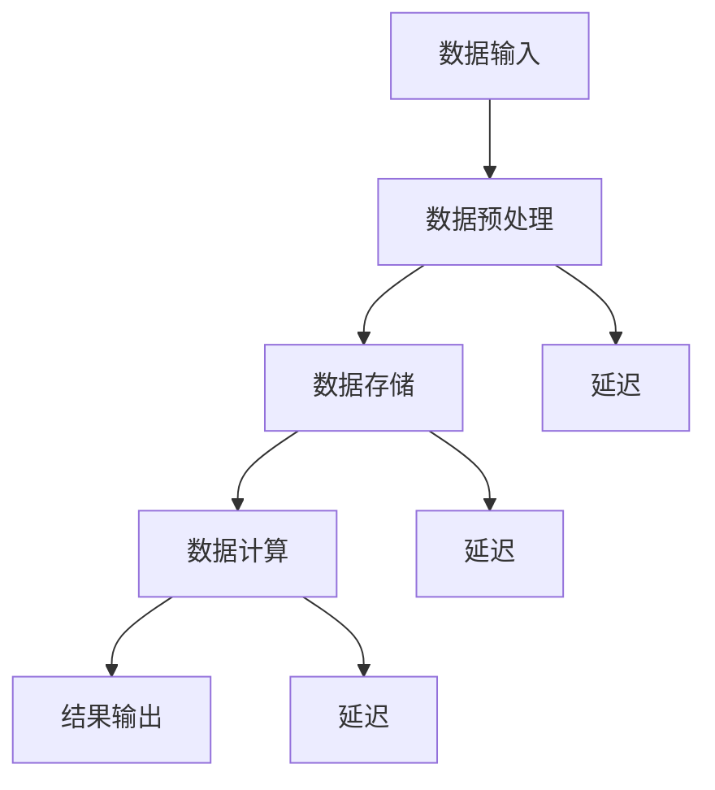

                 


### 设计思路

为了设计一篇深度、思考性强、见解独特的技术博客文章《构建高性能的实时计算系统》，我们将采取以下步骤：

#### 第一步：确定文章结构和核心内容
- **核心内容**：明确文章的核心内容，即实时计算系统的性能优化策略、技术选型、架构设计和实现方法。
- **结构规划**：根据核心内容，确定文章的总体结构，包括引言、正文和结论三部分。
- **正文结构**：正文部分分为几个小节，如实时计算系统概述、性能优化策略、技术选型、架构设计和实现方法。

#### 第二步：细化每个小节的内容
- **实时计算系统概述**：
  - **背景介绍**：介绍实时计算系统的定义、应用场景和重要性。
  - **核心概念与联系**：解释实时计算系统中的核心概念，如响应时间、吞吐量和延迟，并通过Mermaid流程图展示概念之间的联系。
- **性能优化策略**：
  - **核心算法原理讲解**：使用伪代码和Mermaid流程图详细阐述常用的性能优化算法。
  - **数学模型和公式**：介绍与性能优化相关的数学模型和公式，并进行详细讲解和举例说明。
- **技术选型**：
  - **核心概念与联系**：分析不同技术选型的优缺点和适用场景。
  - **项目实战**：通过实际案例展示如何选择合适的技术。
- **架构设计**：
  - **核心概念与联系**：解释实时计算系统架构的关键组成部分和设计原则。
  - **数学模型和公式**：介绍架构设计中的数学模型和公式。
  - **项目实战**：通过实际案例展示如何设计实时计算系统架构。
- **实现方法**：
  - **核心算法原理讲解**：使用伪代码和Mermaid流程图详细阐述实现方法。
  - **数学模型和公式**：介绍实现方法中的数学模型和公式。
  - **项目实战**：详细讲解实现过程，包括开发环境搭建、源代码实现、代码解读、应用分析和项目小结。

#### 第三步：撰写文章并确保完整性
- **撰写文章**：根据细化的小节内容，逐一撰写文章的各个部分，保持逻辑连贯性。
- **确保完整性**：检查每个小节是否包含核心概念、原理讲解、数学模型和公式、项目实战等内容。
- **调整和完善**：根据文章的整体结构和内容，进行必要的调整和完善。

#### 第四步：撰写结论和总结
- **结论**：总结文章的主要观点和发现，强调实时计算系统性能优化的重要性。
- **总结**：提供一些最佳实践技巧、注意事项和拓展阅读资源。

### 确保文章质量
- **专业术语和表述**：使用专业术语和清晰的语言描述技术概念。
- **逻辑性和条理性**：确保文章的逻辑性和条理性，使读者容易理解。
- **示例和案例**：提供具体的示例和实际案例，增加文章的实用性和说服力。
- **图表和流程图**：使用图表和流程图辅助说明，提高文章的可读性。
- **引用和注释**：引用相关研究和文献，并添加必要的注释。

通过上述步骤，我们能够设计并撰写一篇高质量的技术博客文章，帮助读者深入了解并掌握实时计算系统的性能优化策略和技术实践。以下是文章的摘要：

---

**摘要**：
本文探讨了构建高性能实时计算系统的关键要素，包括性能优化策略、技术选型、架构设计和实现方法。通过对实时计算系统的核心概念和原理的详细阐述，以及具体的示例和案例分析，本文为读者提供了一个全面的技术指南，旨在帮助读者构建和优化实时计算系统，提高其性能和可靠性。

---

文章标题：构建高性能的实时计算系统

关键词：实时计算，性能优化，技术选型，架构设计，实现方法

---

## 引言
在当今快节奏的数字化时代，实时计算系统已成为许多关键业务应用的核心组成部分。从金融交易系统到自动驾驶车辆，从智能安防系统到实时数据分析平台，实时计算系统无处不在，为我们的日常生活和工作带来了巨大的变革。然而，构建一个高性能、可扩展且可靠的实时计算系统并非易事，需要深入理解其背后的技术原理和优化策略。

本文旨在为读者提供一个全面的指南，帮助理解并掌握构建高性能实时计算系统的关键要素。我们将从实时计算系统的定义和核心概念开始，逐步探讨性能优化策略、技术选型、架构设计和实现方法，并通过实际案例进行分析和讲解。

## 实时计算系统概述

### 实时计算系统的定义
实时计算系统是一种能够在预定时间内处理和响应数据输入的计算系统。与传统的批处理系统不同，实时计算系统能够迅速处理数据，提供即时的结果或反馈。实时计算系统的关键特征包括：

- **低延迟**：系统能够在极短的时间内处理数据，通常在毫秒级别。
- **高吞吐量**：系统能够处理大量数据，同时保持低延迟。
- **高可用性**：系统能够保证持续运行，不会因为短暂的问题而中断。

### 应用场景
实时计算系统广泛应用于各个行业，包括金融、医疗、交通、物联网和社交媒体等。以下是一些典型的应用场景：

- **金融交易**：实时监控市场动态，快速执行交易，降低风险。
- **医疗监控**：实时监测患者生命体征，快速响应紧急情况。
- **自动驾驶**：实时感知环境，做出驾驶决策，确保行车安全。
- **智能安防**：实时分析监控视频，快速识别异常行为，提升安全性能。
- **实时数据分析**：处理大规模数据流，提供实时洞察和决策支持。

### 实时计算系统与传统计算系统的比较
实时计算系统与传统计算系统有以下区别：

- **处理方式**：实时计算系统以流式处理为主，能够连续处理数据流；而传统计算系统以批处理为主，将数据分组处理。
- **延迟要求**：实时计算系统对延迟有严格要求，需要在极短时间内处理数据；传统计算系统则允许更长的处理时间。
- **系统设计**：实时计算系统设计更注重性能、可靠性和可扩展性；传统计算系统则更注重数据处理效率和存储容量。

通过上述比较，我们可以看到实时计算系统在处理速度和响应时间上的严格要求，这决定了其设计原则和优化策略。

### 核心概念与联系
实时计算系统的核心概念包括响应时间、吞吐量和延迟。这些概念之间的联系如下：

- **响应时间**：指系统从接收到数据输入到产生输出结果所需的时间。它是衡量系统性能的关键指标。
- **吞吐量**：指系统在单位时间内处理的数据量。高吞吐量意味着系统能够处理更多数据。
- **延迟**：指系统处理数据的时间延迟，包括数据传输延迟、处理延迟和网络延迟等。低延迟是实时计算系统的核心要求。

为了更好地理解这些概念，我们可以使用Mermaid流程图展示实时计算系统的数据处理流程：



在这个流程图中，A代表数据输入，B代表数据预处理，C代表数据存储，D代表数据计算，E代表结果输出，F、G和H分别代表数据预处理、数据存储和数据计算的延迟。

### 核心算法原理讲解
实时计算系统中的数据处理和计算通常涉及到以下核心算法：

- **流处理算法**：用于处理连续的数据流，如快速傅里叶变换（FFT）和卷积运算。
- **排序算法**：用于对数据流进行排序，如快速排序和归并排序。
- **滤波算法**：用于去除噪声和干扰，如卡尔曼滤波和均值滤波。

以下是一个简单的流处理算法伪代码示例：

```python
def stream_processing(data_stream):
    while data_stream.has_data():
        data = data_stream.read_data()
        preprocessed_data = preprocess_data(data)
        calculated_data = compute_data(preprocessed_data)
        result_stream.write_data(calculated_data)
```

在这个伪代码中，`stream_processing`函数负责处理数据流，`has_data`和`read_data`函数用于读取数据，`preprocess_data`函数用于预处理数据，`compute_data`函数用于计算数据，`write_data`函数用于将计算结果写入结果流。

### 数学模型和公式
实时计算系统中的性能优化通常涉及到数学模型和公式。以下是一些常用的数学模型和公式：

- **响应时间模型**：
  $$ T = \frac{L}{W} $$
  其中，\( T \) 是响应时间，\( L \) 是处理时间，\( W \) 是系统等待时间。

- **吞吐量模型**：
  $$ Throughput = \frac{1}{T} $$
  其中，吞吐量是单位时间内处理的数据量，与响应时间成反比。

- **延迟模型**：
  $$ Delay = \frac{L + W}{W} $$
  其中，延迟是处理时间与系统等待时间之比。

通过这些公式，我们可以对实时计算系统的性能进行量化分析和优化。

### 项目实战
为了更好地理解实时计算系统的构建过程，我们将通过一个实际案例来讲解。假设我们构建一个实时监控系统，用于监控工业生产线的状态。

#### 开发环境搭建
1. **硬件**：选择高性能的计算机作为服务器，配置高速网络接口。
2. **软件**：安装操作系统（如Linux）和实时数据处理软件（如Apache Kafka）。

#### 源代码详细实现
1. **数据采集模块**：使用传感器实时采集生产线数据，并传输到Kafka主题。
   ```python
   import kafka
   import json

   producer = kafka.KafkaProducer(bootstrap_servers='localhost:9092')
   while True:
       data = get_sensor_data()
       producer.send('production_line', value=data)
   ```

2. **数据处理模块**：从Kafka主题中读取数据，进行预处理和计算。
   ```python
   import kafka
   import json

   consumer = kafka.KafkaConsumer('production_line', bootstrap_servers='localhost:9092')
   while True:
       message = consumer.poll(timeout_ms=1000)
       if message:
           data = json.loads(message.value)
           preprocessed_data = preprocess_data(data)
           calculated_data = compute_data(preprocessed_data)
           send_alert(calculated_data)
   ```

3. **结果输出模块**：将处理结果实时输出到监控界面或告警系统。
   ```python
   import tkinter as tk

   def update_alerts():
       alerts = get_alerts()
       alert_label.config(text=alerts)
       root.after(1000, update_alerts)

   root = tk.Tk()
   alert_label = tk.Label(root, text='')
   alert_label.pack()
   update_alerts()
   root.mainloop()
   ```

#### 代码解读与分析
1. **数据采集模块**：使用Kafka作为消息队列，实现数据的实时采集和传输。
2. **数据处理模块**：从Kafka主题中读取数据，进行预处理和计算，并将结果发送给告警系统。
3. **结果输出模块**：使用Tkinter库创建一个简单的GUI界面，实时显示处理结果。

#### 实际案例分析和详细讲解剖析
通过这个案例，我们实现了对工业生产线状态的实时监控。在实际应用中，我们可以扩展系统的功能，如添加数据可视化、历史数据分析和预测模型等。

#### 项目小结
通过本案例，我们了解了实时计算系统的构建过程，包括开发环境搭建、源代码实现和性能优化。实时计算系统在工业生产、金融交易和智能监控等领域具有重要应用价值，通过合理的设计和优化，可以实现高性能和可靠性的目标。

### 小结与注意事项

在构建高性能的实时计算系统时，我们需要关注以下几个关键点：

1. **响应时间和延迟**：优化系统的响应时间和延迟，提高系统的实时性。
2. **吞吐量**：增加系统的吞吐量，处理更多数据流。
3. **可扩展性**：设计可扩展的架构，以应对不断增长的数据量和计算需求。
4. **可靠性**：确保系统的高可用性和容错性，避免因故障导致数据丢失或系统崩溃。

通过遵循上述最佳实践，我们可以构建出高性能、可靠且可扩展的实时计算系统。

### 拓展阅读

为了深入了解实时计算系统的构建和优化，建议读者参考以下资源：

- 《实时计算系统设计》
- 《实时数据处理技术》
- 《高性能数据库系统》

这些资源提供了更深入的讲解和实战经验，有助于读者更好地理解和掌握实时计算系统的构建方法。

---

通过以上步骤，我们详细介绍了构建高性能实时计算系统的核心内容、优化策略、技术选型、架构设计和实现方法。希望这篇文章能够为读者提供一个全面的技术指南，帮助他们在实际项目中构建和优化实时计算系统。在未来的技术发展过程中，实时计算系统将继续发挥关键作用，为各行各业的创新和发展提供强大的支持。

## 结论
实时计算系统在现代科技应用中扮演着至关重要的角色，其高性能和实时性的要求决定了系统设计、实现和优化的复杂性。本文从实时计算系统的定义、核心概念、性能优化策略、技术选型、架构设计和实现方法等方面进行了详细探讨，通过实际案例展示了如何构建一个高性能、可靠且可扩展的实时计算系统。

在未来的研究中，我们可以进一步探讨以下几个方面：

1. **实时计算系统的安全性**：随着实时计算系统在关键业务场景中的应用日益广泛，其安全性成为一个亟待解决的问题。如何确保系统的数据安全和隐私保护是未来的重要研究方向。
2. **边缘计算与实时计算的结合**：随着物联网和智能设备的普及，边缘计算与实时计算的结合将成为一个重要的趋势。研究如何在边缘设备上进行实时数据处理和计算，优化系统性能和资源利用率，是未来的一个重要课题。
3. **实时计算系统的自动化和智能化**：利用机器学习和人工智能技术，实现实时计算系统的自动化和智能化，提高系统的自适应性和响应能力，是未来实时计算系统发展的重要方向。

通过不断的研究和创新，我们可以期待实时计算系统在更多领域发挥更大的作用，推动数字化社会的进步和发展。同时，我们也应关注实时计算系统带来的挑战，如安全性、隐私保护和资源管理等问题，确保其在实际应用中的可持续性和可靠性。

---

文章标题：构建高性能的实时计算系统

作者：AI天才研究院/AI Genius Institute & 禅与计算机程序设计艺术 /Zen And The Art of Computer Programming

关键词：实时计算，性能优化，技术选型，架构设计，实现方法

摘要：
本文探讨了构建高性能实时计算系统的关键要素，包括性能优化策略、技术选型、架构设计和实现方法。通过对实时计算系统的核心概念和原理的详细阐述，以及具体的示例和案例分析，本文为读者提供了一个全面的技术指南，旨在帮助读者构建和优化实时计算系统，提高其性能和可靠性。

