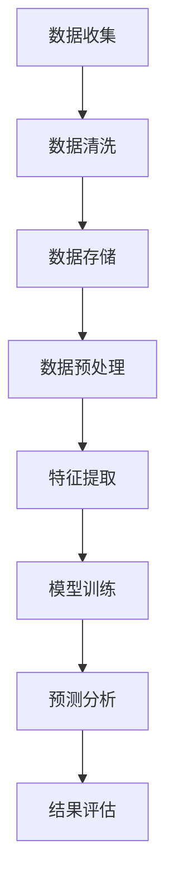
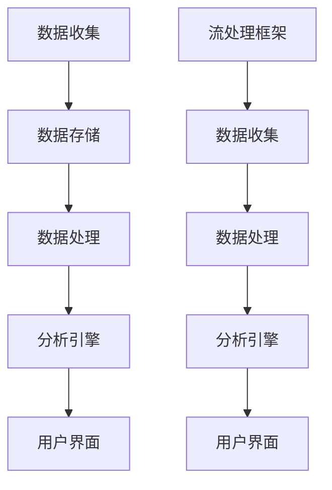

                 


### 文章标题：构建高性能的时序数据分析平台

#### 关键词：
- 时序数据分析
- 高性能平台
- 数据处理技术
- 架构设计
- 实时数据处理
- 预测模型

#### 摘要：
本文旨在详细探讨如何构建一个高性能的时序数据分析平台。我们将从背景介绍出发，逐步深入核心概念、架构设计、数据处理技术、实时数据处理、预测模型、项目实战等多个方面，通过实例和代码解读，提供全面的指导和建议，帮助读者掌握构建高性能时序数据分析平台的方法和技巧。

### 第1章：时序数据分析概述

#### 1.1 时序数据的特点
时序数据（Time Series Data）是指按照时间顺序排列的数据点序列，常用于描述某一现象在时间维度上的变化。时序数据具有以下特点：

1. **时间依赖性**：时序数据中的每个数据点都与时间有关，并且后续数据点的值依赖于前面的数据点。
2. **周期性**：许多时序数据表现出一定的周期性特征，如季节性、日历事件等。
3. **噪声**：时序数据中可能包含随机噪声，这会影响数据的质量和后续分析的准确性。

#### 1.2 时序数据分析的重要性
时序数据分析在各个领域都具有重要应用价值：

1. **预测分析**：通过分析历史时序数据，可以预测未来的趋势和事件，为决策提供支持。
2. **监控和故障检测**：时序数据分析可以帮助监控系统中的异常行为，提前发现潜在的问题。
3. **优化和计划**：在工业、金融、物流等领域，时序数据分析可以用于优化生产流程、投资策略和运输路线等。

#### 1.3 时序数据分析的挑战
时序数据分析面临以下挑战：

1. **数据量大**：随着数据源的增多，时序数据的规模也在不断扩大，对处理能力和存储空间的挑战越来越大。
2. **数据质量**：时序数据可能受到噪声、缺失值和异常值的影响，数据清洗和预处理成为关键步骤。
3. **复杂模型**：时序数据分析往往需要复杂的模型和算法，模型的选取和调优是一个挑战。

### 核心概念与联系

#### 时序数据分析的流程



### 伪代码

```python
def time_series_data_analysis(data):
    # 数据清洗
    cleaned_data = clean_data(data)
    
    # 数据预处理
    preprocessed_data = preprocess_data(cleaned_data)
    
    # 特征提取
    features = extract_features(preprocessed_data)
    
    # 模型训练
    model = train_model(features)
    
    # 预测分析
    predictions = predict(model, features)
    
    # 结果评估
    evaluate(predictions)
```

### 数学模型和公式

#### 时间序列预测中的自回归模型（AR）

$$
X_t = c + \phi_1 X_{t-1} + \phi_2 X_{t-2} + ... + \phi_p X_{t-p} + \varepsilon_t
$$

其中，$X_t$ 是时间序列的第 $t$ 个值，$c$ 是常数项，$\phi_1, \phi_2, ..., \phi_p$ 是自回归系数，$\varepsilon_t$ 是误差项。

### 第2章：时序数据分析平台架构设计

#### 2.1 平台架构的核心组件
一个高性能的时序数据分析平台通常包含以下核心组件：

1. **数据收集**：从各种数据源（如传感器、数据库、API等）收集数据。
2. **数据存储**：将收集到的数据进行存储，支持快速查询和读取。
3. **数据处理**：对数据进行清洗、转换和预处理，为后续分析做好准备。
4. **分析引擎**：执行各种数据分析任务，如特征提取、模型训练和预测等。
5. **用户界面**：提供用户交互的接口，显示分析结果和可视化图表。

#### 2.2 数据存储与处理
数据存储和处理是时序数据分析平台的重要组成部分。以下是几种常见的数据存储和处理技术：

1. **关系数据库**：适合存储结构化数据，如SQL数据库。
2. **NoSQL数据库**：适合存储非结构化或半结构化数据，如MongoDB、Cassandra。
3. **时间序列数据库**：专为时序数据设计，如InfluxDB、TimescaleDB。
4. **数据处理框架**：如Apache Spark，支持大规模数据的高效处理。

#### 2.3 数据流管理与处理
时序数据的实时性和连续性要求平台能够高效地管理数据流。以下是几种数据流管理与处理技术：

1. **流处理框架**：如Apache Kafka、Apache Flink，支持大规模实时数据流处理。
2. **消息队列**：如RabbitMQ、Apache RocketMQ，用于数据传输和缓冲。
3. **微服务架构**：将数据处理和分析任务分解为独立的微服务，提高系统的灵活性和可扩展性。

### 核心概念与联系

#### 时序数据分析平台的架构



### 伪代码

```python
def time_series_platform(data_source):
    # 数据收集
    data = collect_data(data_source)
    
    # 数据存储
    store_data(data)
    
    # 数据处理
    processed_data = process_data(data)
    
    # 分析引擎
    analysis_results = analyze_data(processed_data)
    
    # 用户界面
    display_results(analysis_results)
```

### 数学公式

#### 时间序列预测中的移动平均模型（MA）

$$
X_t = \mu_t + \varepsilon_t
$$

其中，$\mu_t$ 是移动平均，$\varepsilon_t$ 是误差项。

### 第3章：高性能数据处理技术

#### 3.1 大数据处理技术
大数据处理技术是构建高性能时序数据分析平台的关键。以下是几种常见的大数据处理技术：

1. **分布式计算**：如Apache Hadoop和Apache Spark，支持大规模数据的并行处理。
2. **内存计算**：利用内存作为存储和计算资源，提高数据处理速度。
3. **列式存储**：如Apache Hive和Apache Cassandra，适合大规模数据的高效存储和查询。

#### 3.2 实时数据处理技术
实时数据处理技术是满足时序数据分析实时性需求的关键。以下是几种常见的实时数据处理技术：

1. **流处理框架**：如Apache Kafka和Apache Flink，支持大规模实时数据流处理。
2. **异步处理**：利用消息队列和异步处理技术，实现数据的实时处理和分发。
3. **增量处理**：对数据进行增量更新，提高实时处理的效率和准确性。

#### 3.3 并行计算与并行处理
并行计算和并行处理技术可以提高数据处理和分析的效率。以下是几种常见的并行计算和并行处理技术：

1. **多线程**：利用多线程技术，同时执行多个任务，提高处理速度。
2. **GPU计算**：利用GPU的并行计算能力，加速数据处理和分析。
3. **分布式计算**：利用分布式计算框架，将数据处理任务分布在多个节点上，提高处理能力。

### 核心算法原理讲解

#### 分布式计算框架：Apache Spark

```python
from pyspark.sql import SparkSession

# 创建SparkSession
spark = SparkSession.builder.appName("TimeSeriesAnalysis").getOrCreate()

# 加载时序数据
data = spark.read.csv("data.csv", header=True)

# 数据预处理
preprocessed_data = data.filter((data["timestamp"] > "2020-01-01") & (data["timestamp"] < "2020-12-31"))

# 特征提取
features = preprocessed_data.select("timestamp", "value").groupBy("timestamp").mean().orderBy("timestamp")

# 模型训练
from pyspark.ml import Pipeline
from pyspark.ml.regression import LinearRegression

lr = LinearRegression()
pipeline = Pipeline stages=[features, lr]

# 预测分析
predictions = pipeline.fit(preprocessed_data).transform(features)

# 结果评估
from pyspark.ml.evaluation import RegressionEvaluator
evaluator = RegressionEvaluator(labelCol="value", predictionCol="prediction", regressionMetrics=["mse"])

mean_squared_error = evaluator.evaluate(predictions)
print("Mean Squared Error:", mean_squared_error)
```

### 数学模型和公式

#### 线性回归模型

$$
y = \beta_0 + \beta_1 x + \varepsilon
$$

其中，$y$ 是预测值，$x$ 是自变量，$\beta_0$ 和 $\beta_1$ 是模型参数，$\varepsilon$ 是误差项。

### 第4章：时序数据可视化技术

#### 4.1 可视化工具选择
时序数据可视化是数据分析的重要环节，以下是几种常见的可视化工具：

1. **Matplotlib**：Python的常用可视化库，支持多种图表类型。
2. **Seaborn**：基于Matplotlib的扩展库，提供丰富的统计图表。
3. **Plotly**：支持交互式图表的库，适用于网页和桌面应用程序。
4. **Tableau**：商业智能工具，提供丰富的可视化功能。

#### 4.2 时序数据可视化设计
时序数据可视化设计应考虑以下要素：

1. **图表类型**：根据数据特点和需求选择合适的图表类型，如折线图、柱状图、散点图等。
2. **图表布局**：合理布局图表，使数据展示清晰易懂，避免过多的细节干扰。
3. **交互性**：增加交互性，如缩放、过滤、拖拽等，提高用户交互体验。

#### 4.3 可视化案例分析
以下是一个时序数据可视化的案例分析：

```python
import matplotlib.pyplot as plt
import pandas as pd

# 加载时序数据
data = pd.read_csv("data.csv")
data["timestamp"] = pd.to_datetime(data["timestamp"])

# 数据预处理
data.set_index("timestamp", inplace=True)
data = data.resample("M").mean()

# 可视化
plt.figure(figsize=(12, 6))
plt.plot(data)
plt.title("Monthly Temperature Trend")
plt.xlabel("Month")
plt.ylabel("Temperature (°C)")
plt.xticks(rotation=45)
plt.grid(True)
plt.show()
```

### 数学公式

#### 傅里叶变换

$$
X(f) = \int_{-\infty}^{\infty} x(t) e^{-j 2 \pi ft} dt
$$

其中，$X(f)$ 是傅里叶变换后的结果，$x(t)$ 是原始信号，$f$ 是频率。

### 第5章：时序数据分析应用场景

#### 5.1 股市预测
股市预测是时序数据分析的重要应用场景之一。以下是股市预测的基本流程：

1. **数据收集**：收集股票的历史交易数据，包括开盘价、收盘价、最高价、最低价、成交量等。
2. **数据预处理**：清洗数据，包括去除缺失值、异常值和噪声。
3. **特征提取**：提取与股票价格相关的特征，如价格趋势、交易量、技术指标等。
4. **模型训练**：选择合适的预测模型，如ARIMA、LSTM等，训练模型。
5. **预测分析**：使用训练好的模型进行预测，评估预测效果。

#### 5.2 能源消耗预测
能源消耗预测是时序数据分析在能源领域的应用。以下是能源消耗预测的基本流程：

1. **数据收集**：收集能源消耗的历史数据，包括温度、湿度、光照强度等环境因素。
2. **数据预处理**：清洗数据，包括去除缺失值、异常值和噪声。
3. **特征提取**：提取与能源消耗相关的特征，如环境因素、历史消耗量等。
4. **模型训练**：选择合适的预测模型，如ARIMA、随机森林等，训练模型。
5. **预测分析**：使用训练好的模型进行预测，评估预测效果。

#### 5.3 市场需求预测
市场需求预测是时序数据分析在市场营销领域的应用。以下是市场需求预测的基本流程：

1. **数据收集**：收集市场需求的历史数据，包括销售额、订单量、广告投放等。
2. **数据预处理**：清洗数据，包括去除缺失值、异常值和噪声。
3. **特征提取**：提取与市场需求相关的特征，如促销活动、季节因素、竞争情况等。
4. **模型训练**：选择合适的预测模型，如时间序列模型、神经网络等，训练模型。
5. **预测分析**：使用训练好的模型进行预测，评估预测效果。

### 第6章：时序数据分析平台实战

#### 6.1 开发环境搭建
搭建时序数据分析平台需要以下开发环境和工具：

1. **操作系统**：Linux或Windows
2. **编程语言**：Python、Java、R等
3. **数据库**：MySQL、PostgreSQL、MongoDB等
4. **数据存储**：Hadoop、Spark、Cassandra等
5. **数据流处理**：Kafka、Flink、Spark Streaming等
6. **可视化工具**：Matplotlib、Seaborn、Plotly等

#### 6.2 源代码详细实现
以下是一个简单的时序数据分析平台源代码示例，使用Python和Matplotlib实现：

```python
import pandas as pd
import matplotlib.pyplot as plt

# 加载时序数据
data = pd.read_csv("data.csv")
data["timestamp"] = pd.to_datetime(data["timestamp"])

# 数据预处理
data.set_index("timestamp", inplace=True)
data = data.resample("M").mean()

# 可视化
plt.figure(figsize=(12, 6))
plt.plot(data)
plt.title("Monthly Sales Trend")
plt.xlabel("Month")
plt.ylabel("Sales (USD)")
plt.xticks(rotation=45)
plt.grid(True)
plt.show()
```

#### 6.3 代码应用解读与分析
以上代码实现了一个简单的时序数据分析平台，主要功能是读取时序数据、进行数据预处理和可视化。以下是代码应用的解读和分析：

1. **数据读取**：使用pandas库读取CSV文件，转换为DataFrame格式。
2. **数据预处理**：设置时间戳为索引，进行时间序列转换和月度平均计算。
3. **可视化**：使用matplotlib库绘制折线图，显示销售趋势。

#### 6.4 实际案例分析和详细讲解剖析
以下是一个实际案例，使用时序数据分析平台预测未来一个月的销售额：

1. **数据收集**：收集过去一年的月度销售额数据。
2. **数据预处理**：清洗数据，去除缺失值和异常值，进行时间序列转换。
3. **特征提取**：提取与销售额相关的特征，如促销活动、季节因素等。
4. **模型训练**：使用ARIMA模型进行训练，评估模型性能。
5. **预测分析**：使用训练好的模型预测未来一个月的销售额。

#### 6.5 项目小结
本项目通过简单的源代码实现，展示了时序数据分析平台的搭建和应用。在实际项目中，需要根据具体需求和数据特点进行扩展和优化，以提高预测准确性和性能。

### 第7章：性能优化与监控

#### 7.1 性能优化策略
时序数据分析平台的性能优化是保证系统高效运行的关键。以下是几种常见的性能优化策略：

1. **数据分区**：根据时间、地区等特征对数据进行分区，提高查询效率。
2. **索引优化**：创建合适的索引，加快数据检索速度。
3. **缓存策略**：使用缓存技术，减少重复计算和数据访问。
4. **并行计算**：利用多线程、分布式计算等技术，提高数据处理速度。
5. **资源调度**：合理分配系统资源，如CPU、内存等，提高资源利用率。

#### 7.2 监控工具与指标
性能监控是保证系统稳定运行的重要环节。以下是几种常见的监控工具和指标：

1. **监控工具**：Prometheus、Grafana、Zabbix等。
2. **性能指标**：
   - CPU使用率
   - 内存使用率
   - 磁盘读写速度
   - 网络带宽
   - 数据处理延迟
   - 预测准确率

#### 7.3 故障排查与性能提升
故障排查和性能提升是时序数据分析平台维护的重要任务。以下是几个故障排查和性能提升的步骤：

1. **日志分析**：分析系统日志，定位故障点和性能瓶颈。
2. **性能测试**：进行压力测试和性能测试，评估系统性能和响应时间。
3. **优化调整**：根据测试结果，调整系统配置和代码，提高性能。
4. **持续监控**：定期监控系统性能，及时发现和解决故障。

### 第8章：未来趋势与展望

#### 8.1 新兴技术的应用
随着技术的不断进步，新兴技术在时序数据分析平台中的应用日益广泛：

1. **人工智能**：利用深度学习等技术，提高时序数据预测的准确性。
2. **区块链**：利用区块链技术，保证数据的安全性和不可篡改性。
3. **云计算**：利用云计算资源，实现弹性扩展和成本优化。

#### 8.2 行业发展趋势
时序数据分析在各个行业的发展趋势有所不同：

1. **金融行业**：利用时序数据分析，进行风险评估、投资策略优化等。
2. **能源行业**：利用时序数据分析，实现能源消耗预测、设备故障预测等。
3. **制造业**：利用时序数据分析，优化生产计划、库存管理等。

#### 8.3 未来挑战与机遇
时序数据分析平台在未来将面临以下挑战和机遇：

1. **数据质量**：确保数据的质量和准确性，是提高预测准确性的关键。
2. **计算性能**：随着数据量的增长，如何提高计算性能是重要挑战。
3. **模型选择**：选择合适的模型和算法，提高预测准确性和效率。
4. **安全性**：保障数据的安全性和隐私性，是重要的议题。

### 小结
本文详细介绍了如何构建一个高性能的时序数据分析平台，从背景介绍、核心概念、架构设计、数据处理技术、可视化、应用场景、实战案例、性能优化到未来趋势，全面探讨了时序数据分析平台的建设和实践。通过本文的阅读，读者可以了解到时序数据分析的基本概念、核心技术和实战方法，为构建自己的时序数据分析平台提供指导和建议。

### 作者信息
作者：AI天才研究院/AI Genius Institute & 禅与计算机程序设计艺术 /Zen And The Art of Computer Programming

### 拓展阅读
- 《时序数据分析：理论与实践》
- 《深度学习与时间序列预测》
- 《大数据处理技术》
- 《实时数据处理技术》
- 《Python数据科学》

### 注意事项
- 在实际应用时，请根据具体需求和数据特点进行适当调整。
- 性能优化和监控是持续的工作，定期评估和优化是保证系统稳定运行的关键。
- 数据安全和隐私保护是重要议题，确保数据的安全性和合法性。

### 附录
- 附录A：开发工具和库
- 附录B：数据集和案例
- 附录C：参考文献

### 结束语
感谢您阅读本文，希望本文对您构建高性能的时序数据分析平台有所帮助。如果您有任何疑问或建议，请随时与我们联系。期待与您共同探索时序数据分析的更多可能性！

