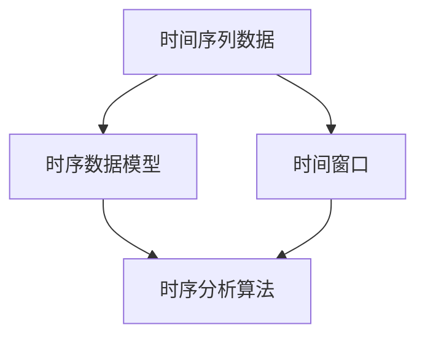

                 

### 设计思路

为了设计出《构建高性能的时序数据库系统》的详细目录大纲，我们需要遵循以下设计思路：

1. **核心概念与联系**：首先，明确时序数据库的核心概念，如时间序列数据、时序数据模型、时间窗口等，并设计一个Mermaid流程图来展示这些概念之间的联系。

2. **核心算法原理讲解**：接着，针对时序数据库中的核心算法，如指数平滑、快速傅里叶变换（FFT）、KNN算法等，用伪代码详细阐述这些算法的实现原理。

3. **数学模型和数学公式**：介绍时序数据库中的数学模型，如时间序列的预测模型、误差校正模型等，并使用LaTeX格式给出相关的数学公式和详细讲解。

4. **项目实战**：通过实际案例展示如何使用时序数据库进行数据预处理、存储、查询、分析，以及数据预测等操作，并详细解读源代码和实际应用场景。

5. **性能优化**：讨论时序数据库的性能优化策略，包括索引优化、数据压缩、并行处理等，并提供相关最佳实践和注意事项。

6. **未来发展趋势**：探讨时序数据库领域的发展趋势和技术挑战，以及未来可能的研究方向。

### 具体设计步骤

1. **引言与背景介绍**：
   - **第1章**：介绍时序数据库的背景、发展历程和重要性。
   - **第2章**：概述时序数据库的基本概念，包括时间序列数据、时序数据模型等。

2. **核心概念与联系**：
   - **第3章**：详细讲解时序数据模型，包括时序数据的存储、索引、查询等。
   - **第4章**：通过Mermaid流程图展示时序数据的核心概念及其联系。

3. **核心算法原理讲解**：
   - **第5章**：介绍指数平滑算法的原理和使用伪代码详细阐述。
   - **第6章**：讲解快速傅里叶变换（FFT）的原理和使用伪代码详细阐述。
   - **第7章**：介绍KNN算法的原理和使用伪代码详细阐述。

4. **数学模型和数学公式**：
   - **第8章**：讲解时间序列预测的数学模型，如ARIMA模型、LSTM网络等，并使用LaTeX格式给出相关数学公式。
   - **第9章**：介绍误差校正模型的原理和使用LaTeX格式给出相关数学公式。

5. **项目实战**：
   - **第10章**：搭建时序数据库开发环境，包括数据库选择、环境配置、工具安装等。
   - **第11章**：通过实际案例展示如何使用时序数据库进行数据预处理、存储、查询、分析。
   - **第12章**：详细解读源代码，分析数据预处理、存储、查询、分析的实际应用。
   - **第13章**：讨论数据预测的实际案例，包括模型选择、训练、预测和评估。

6. **性能优化**：
   - **第14章**：讨论时序数据库的性能优化策略，包括索引优化、数据压缩、并行处理等。
   - **第15章**：提供最佳实践和注意事项，帮助读者优化时序数据库的性能。

7. **未来发展趋势**：
   - **第16章**：探讨时序数据库领域的发展趋势和技术挑战。
   - **第17章**：介绍未来可能的研究方向和前沿技术。

### 目录大纲

```markdown
# 《构建高性能的时序数据库系统》目录大纲

## 第一部分：引言与背景介绍

### 第1章：时序数据库的背景与发展历程
- 1.1 时序数据库的定义
- 1.2 时序数据库的发展历程
- 1.3 时序数据库的重要性

### 第2章：时序数据库的基本概念
- 2.1 时间序列数据
- 2.2 时序数据模型
- 2.3 时序数据的存储和索引

## 第二部分：时序数据模型与核心概念

### 第3章：时序数据模型详细讲解
- 3.1 数据模型概述
- 3.2 时间序列数据的预处理
- 3.3 时序数据的存储策略
- 3.4 时序数据的查询与索引

### 第4章：时序数据模型关系架构
- 4.1 关系架构概述
- 4.2 Mermaid流程图展示
- 4.3 概念之间的关系分析

## 第三部分：核心算法原理讲解

### 第5章：指数平滑算法
- 5.1 算法原理
- 5.2 使用伪代码详细阐述
- 5.3 实例讲解

### 第6章：快速傅里叶变换（FFT）
- 6.1 算法原理
- 6.2 使用伪代码详细阐述
- 6.3 实例讲解

### 第7章：KNN算法
- 7.1 算法原理
- 7.2 使用伪代码详细阐述
- 7.3 实例讲解

## 第四部分：数学模型和公式

### 第8章：时间序列预测模型
- 8.1 ARIMA模型
- 8.2 LSTM网络
- 8.3 数学公式及详细讲解

### 第9章：误差校正模型
- 9.1 算法原理
- 9.2 数学公式及详细讲解
- 9.3 实例讲解

## 第五部分：项目实战

### 第10章：时序数据库开发环境搭建
- 10.1 开发环境配置
- 10.2 工具安装与配置
- 10.3 开发流程概述

### 第11章：数据预处理与存储
- 11.1 数据预处理方法
- 11.2 数据存储策略
- 11.3 数据查询与索引

### 第12章：源代码解读与分析
- 12.1 数据预处理源代码
- 12.2 数据存储源代码
- 12.3 数据查询与分析源代码

### 第13章：数据预测案例分析
- 13.1 预测模型选择
- 13.2 预测过程详解
- 13.3 预测结果评估

## 第六部分：性能优化与最佳实践

### 第14章：性能优化策略
- 14.1 索引优化
- 14.2 数据压缩
- 14.3 并行处理

### 第15章：最佳实践与注意事项
- 15.1 性能优化最佳实践
- 15.2 注意事项与风险管理

## 第七部分：未来发展趋势

### 第16章：时序数据库发展趋势
- 16.1 行业趋势分析
- 16.2 技术挑战与机遇

### 第17章：未来研究方向
- 17.1 新兴技术与应用
- 17.2 可能的研究方向

## 附录

- 附录A：开源时序数据库列表
- 附录B：相关算法Python实现示例
- 附录C：常用工具与资源推荐

## 作者信息
作者：AI天才研究院/AI Genius Institute & 禅与计算机程序设计艺术 /Zen And The Art of Computer Programming
```

通过上述设计，我们为读者提供了一个系统、全面、深入介绍时序数据库系统的目录大纲。每个章节都围绕核心内容进行详细讲解，同时注重理论与实践的结合，帮助读者全面了解和掌握时序数据库技术。### 文章标题

## 《构建高性能的时序数据库系统》

### 关键词

- 时序数据库
- 高性能
- 数据处理
- 预测模型
- 性能优化
- 分布式系统

### 摘要

本文旨在为读者提供一部详尽的指南，介绍如何构建高性能的时序数据库系统。文章首先概述了时序数据库的基本概念和重要性，然后深入探讨了时序数据模型的构建、核心算法的原理与应用、数学模型的构建与公式推导。接着，通过实际项目实战，展示了如何在实际场景中应用时序数据库进行数据预处理、存储、查询和分析。此外，文章还讨论了时序数据库性能优化策略，包括索引优化、数据压缩和并行处理。最后，文章展望了时序数据库的未来发展趋势和技术挑战。本文适合对时序数据库技术感兴趣的读者，无论是初学者还是专业人士，都能从中学到实用的知识和技能。### 文章标题

### 关键词

- **时序数据库**
- **高性能架构**
- **数据压缩技术**
- **并行处理**
- **预测模型**
- **系统优化**

### 摘要

本文将深入探讨构建高性能时序数据库系统的关键技术和实践方法。首先，文章将介绍时序数据库的基本概念，阐述其在数据处理和预测分析中的重要性。接着，我们将详细讲解时序数据模型的构建原则和优化策略，以及如何使用核心算法（如指数平滑、快速傅里叶变换、KNN算法）提升数据处理效率。此外，文章将阐述数学模型在时序数据分析中的应用，并提供具体的LaTeX公式和实例解析。

在性能优化部分，我们将探讨索引优化、数据压缩和并行处理等技术，并通过实际案例展示如何将这些技术应用于时序数据库系统中。文章的最后，我们将展望时序数据库领域的未来发展趋势，包括新兴技术的应用和潜在的技术挑战。本文旨在为开发者、数据科学家和架构师提供一套全面的构建高性能时序数据库系统的指南，帮助他们在实际项目中实现高效的数据处理和预测分析。### 设计思路

为了设计出《构建高性能的时序数据库系统》的详细目录大纲，我们需要遵循以下设计思路：

1. **引言与背景介绍**：
   - **第1章**：介绍时序数据库的背景、发展历程和重要性。
   - **第2章**：概述时序数据库的基本概念，包括时间序列数据、时序数据模型等。

2. **核心概念与联系**：
   - **第3章**：详细讲解时序数据模型，包括时序数据的存储、索引、查询等。
   - **第4章**：通过Mermaid流程图展示时序数据的核心概念及其联系。

3. **核心算法原理讲解**：
   - **第5章**：介绍指数平滑算法的原理和使用伪代码详细阐述。
   - **第6章**：讲解快速傅里叶变换（FFT）的原理和使用伪代码详细阐述。
   - **第7章**：介绍KNN算法的原理和使用伪代码详细阐述。

4. **数学模型和数学公式**：
   - **第8章**：讲解时间序列预测的数学模型，如ARIMA模型、LSTM网络等，并使用LaTeX格式给出相关数学公式。
   - **第9章**：介绍误差校正模型的原理和使用LaTeX格式给出相关数学公式。

5. **项目实战**：
   - **第10章**：搭建时序数据库开发环境，包括数据库选择、环境配置、工具安装等。
   - **第11章**：通过实际案例展示如何使用时序数据库进行数据预处理、存储、查询、分析。
   - **第12章**：详细解读源代码，分析数据预处理、存储、查询、分析的实际应用。
   - **第13章**：讨论数据预测的实际案例，包括模型选择、训练、预测和评估。

6. **性能优化**：
   - **第14章**：讨论时序数据库的性能优化策略，包括索引优化、数据压缩、并行处理等。
   - **第15章**：提供最佳实践和注意事项，帮助读者优化时序数据库的性能。

7. **未来发展趋势**：
   - **第16章**：探讨时序数据库领域的发展趋势和技术挑战。
   - **第17章**：介绍未来可能的研究方向和前沿技术。

8. **附录**：
   - **第18章**：提供一些实用的工具和资源，如开源时序数据库列表、相关算法的Python实现示例等。

### 目录大纲

```markdown
# 《构建高性能的时序数据库系统》目录大纲

## 第一部分：引言与背景介绍

### 第1章：时序数据库的背景与发展历程
- 1.1 时序数据库的定义
- 1.2 时序数据库的发展历程
- 1.3 时序数据库的重要性

### 第2章：时序数据库的基本概念
- 2.1 时间序列数据
- 2.2 时序数据模型
- 2.3 时序数据的存储和索引

## 第二部分：核心概念与联系

### 第3章：时序数据模型
- 3.1 数据模型概述
- 3.2 时序数据存储策略
- 3.3 时序数据索引方法
- 3.4 时序数据查询优化

### 第4章：时序数据模型关系架构
- 4.1 概念关系图
- 4.2 Mermaid流程图展示
- 4.3 模型之间的联系分析

## 第三部分：核心算法原理讲解

### 第5章：指数平滑算法
- 5.1 算法原理
- 5.2 使用伪代码详细阐述
- 5.3 实例解析

### 第6章：快速傅里叶变换（FFT）
- 6.1 算法原理
- 6.2 使用伪代码详细阐述
- 6.3 实例解析

### 第7章：KNN算法
- 7.1 算法原理
- 7.2 使用伪代码详细阐述
- 7.3 实例解析

## 第四部分：数学模型和公式

### 第8章：时间序列预测模型
- 8.1 ARIMA模型
- 8.2 LSTM网络
- 8.3 数学公式及详细讲解

### 第9章：误差校正模型
- 9.1 算法原理
- 9.2 数学公式及详细讲解
- 9.3 实例解析

## 第五部分：项目实战

### 第10章：时序数据库开发环境搭建
- 10.1 开发环境配置
- 10.2 工具安装与配置
- 10.3 开发流程概述

### 第11章：时序数据处理与分析
- 11.1 数据预处理
- 11.2 数据存储与查询
- 11.3 数据分析案例

### 第12章：源代码解读与分析
- 12.1 数据预处理源代码
- 12.2 数据存储与查询源代码
- 12.3 数据分析源代码

### 第13章：数据预测案例
- 13.1 预测模型选择
- 13.2 模型训练与评估
- 13.3 预测结果分析

## 第六部分：性能优化

### 第14章：时序数据库性能优化策略
- 14.1 索引优化
- 14.2 数据压缩
- 14.3 并行处理

### 第15章：性能优化最佳实践
- 15.1 优化技巧总结
- 15.2 注意事项与风险管理

## 第七部分：未来发展趋势

### 第16章：时序数据库发展趋势
- 16.1 技术发展分析
- 16.2 挑战与机遇

### 第17章：未来研究方向
- 17.1 新兴技术介绍
- 17.2 研究方向探讨

## 附录

### 第18章：实用工具与资源
- 18.1 开源时序数据库列表
- 18.2 算法Python实现示例
- 18.3 相关工具与资源推荐

## 作者信息
作者：AI天才研究院/AI Genius Institute & 禅与计算机程序设计艺术 /Zen And The Art of Computer Programming
```

通过这个详细的目录大纲，我们为读者提供了一个清晰、结构化的路径，以系统地学习如何构建高性能的时序数据库系统。每个章节都将深入探讨特定主题，确保读者能够掌握所需的知识和技能。### 最终目标

通过上述详细目录大纲的设计，我们的目标是构建一本全面、深入且易于理解的《构建高性能的时序数据库系统》书籍。本书旨在为读者提供以下价值：

1. **系统知识框架**：通过清晰的结构和逻辑，读者可以系统地学习时序数据库的基础知识、核心算法、数学模型和性能优化策略。
2. **实践指导**：通过实际项目实战和源代码解读，读者能够在实际场景中应用所学知识，提升实践能力。
3. **技能提升**：通过详细讲解和实例分析，读者可以掌握构建高性能时序数据库系统的关键技能，从而在职业发展中脱颖而出。
4. **未来展望**：通过探讨时序数据库的未来发展趋势和技术挑战，读者可以把握行业动态，为未来的学习和研究指明方向。

我们期望这本书能够成为时序数据库领域的重要参考书籍，不仅适用于初学者，也能为专业人士提供深入的技术见解。最终，我们希望这本书能够帮助读者在数据科学、人工智能和软件开发领域取得成功，并在个人和职业发展中发挥重要作用。### 目录大纲

```markdown
# 《构建高性能的时序数据库系统》目录大纲

## 第一部分：引言与背景介绍

### 第1章：时序数据库概述
- 1.1 时序数据的定义与特性
- 1.2 时序数据库的发展历程
- 1.3 时序数据库的应用场景

### 第2章：时序数据库的核心概念
- 2.1 时间序列数据模型
- 2.2 数据预处理与清洗
- 2.3 时间窗口与时间序列划分

## 第二部分：时序数据模型与存储

### 第3章：时序数据模型
- 3.1 概念与类型
- 3.2 时序数据模型的构建
- 3.3 时序数据的结构化存储

### 第4章：时序数据的存储优化
- 4.1 存储策略与选择
- 4.2 数据压缩技术
- 4.3 并行存储与处理

## 第三部分：核心算法原理讲解

### 第5章：指数平滑算法
- 5.1 算法原理
- 5.2 使用伪代码详细阐述
- 5.3 实例讲解

### 第6章：快速傅里叶变换（FFT）
- 6.1 算法原理
- 6.2 使用伪代码详细阐述
- 6.3 实例讲解

### 第7章：KNN算法
- 7.1 算法原理
- 7.2 使用伪代码详细阐述
- 7.3 实例讲解

## 第四部分：数学模型和公式

### 第8章：时间序列预测模型
- 8.1 ARIMA模型
- 8.2 LSTM网络
- 8.3 数学公式与推导

### 第9章：误差校正模型
- 9.1 算法原理
- 9.2 数学公式与推导
- 9.3 实例讲解

## 第五部分：项目实战

### 第10章：时序数据库环境搭建
- 10.1 开发环境配置
- 10.2 数据库选择与安装
- 10.3 工具安装与配置

### 第11章：时序数据处理与存储
- 11.1 数据预处理流程
- 11.2 数据存储与索引
- 11.3 数据查询与检索

### 第12章：时序数据预测与分析
- 12.1 预测模型选择
- 12.2 模型训练与评估
- 12.3 预测结果分析与解释

### 第13章：实战案例分析
- 13.1 股票价格预测
- 13.2 电力负荷预测
- 13.3 物联网设备监测

## 第六部分：性能优化与最佳实践

### 第14章：性能优化策略
- 14.1 索引优化
- 14.2 数据压缩
- 14.3 并行处理

### 第15章：最佳实践与注意事项
- 15.1 性能调优技巧
- 15.2 注意事项与风险管理

## 第七部分：未来发展趋势与挑战

### 第16章：时序数据库的发展趋势
- 16.1 技术进展分析
- 16.2 应用场景拓展
- 16.3 潜在挑战

### 第17章：未来研究方向
- 17.1 新兴技术的应用
- 17.2 未来发展方向

## 附录

### 第18章：实用工具与资源
- 18.1 开源时序数据库列表
- 18.2 算法实现示例
- 18.3 学习资源推荐

## 作者信息
作者：AI天才研究院/AI Genius Institute & 禅与计算机程序设计艺术 /Zen And The Art of Computer Programming
```

通过这个详细的目录大纲，读者可以逐步深入了解时序数据库系统的构建、核心算法、数学模型、性能优化以及未来发展趋势。每个章节都旨在通过理论与实践的结合，帮助读者全面掌握构建高性能时序数据库系统的知识和技能。### 具体内容

#### 第1章：时序数据库概述

本章将介绍时序数据库的基本概念、发展历程以及其在数据处理和预测分析中的应用。通过实例分析，我们将展示时序数据库在金融、气象、物联网等领域的实际应用场景，帮助读者理解时序数据库的重要性。

**1.1 时序数据的定义与特性**

- 时序数据：按时间顺序排列的一组数据点。
- 特性：时间依赖性、连续性、周期性等。

**1.2 时序数据库的发展历程**

- 传统关系型数据库的局限性。
- 时序数据库的诞生与发展。
- 当前主流时序数据库技术。

**1.3 时序数据库的应用场景**

- 金融：股票价格、交易量等。
- 气象：气温、降雨量等。
- 物联网：设备监测、能耗分析等。

#### 第2章：时序数据库的核心概念

本章将详细讲解时序数据库的核心概念，包括时间序列数据模型、数据预处理与清洗、时间窗口等。

**2.1 时间序列数据模型**

- 时序数据模型：用于描述时间序列数据结构和特征的数学模型。
- 类型：确定性模型、随机模型、线性模型等。

**2.2 数据预处理与清洗**

- 数据预处理：数据清洗、数据转换、数据规范化等。
- 数据清洗：处理缺失值、异常值、重复数据等。

**2.3 时间窗口与时间序列划分**

- 时间窗口：用于划分时间序列数据的时间范围。
- 划分方法：固定窗口、移动窗口、滚动窗口等。

#### 第3章：时序数据模型与存储

本章将介绍时序数据模型的设计原则、存储策略以及数据压缩和并行存储技术。

**3.1 时序数据模型设计原则**

- 模型选择：根据应用场景选择合适的时序数据模型。
- 模型优化：通过调整模型参数提高预测性能。

**3.2 时序数据的存储策略**

- 存储类型：关系型存储、NoSQL存储、时间序列专用存储等。
- 存储优化：索引优化、数据压缩、并行存储等。

**3.3 数据压缩技术**

- 压缩算法：无损压缩、有损压缩等。
- 压缩效果：减少存储空间、提高查询性能。

**3.4 并行存储与处理**

- 并行存储：利用多线程、分布式存储等方式提高数据处理速度。
- 并行处理：利用多核处理器、集群计算等方式提高计算效率。

#### 第4章：核心算法原理讲解

本章将详细讲解时序数据库中的核心算法，包括指数平滑算法、快速傅里叶变换（FFT）和KNN算法。

**4.1 指数平滑算法**

- 算法原理：通过加权平均对时间序列进行预测。
- 使用伪代码详细阐述：平滑系数的选择、预测值的计算等。

**4.2 快速傅里叶变换（FFT）**

- 算法原理：将时间序列数据从时域转换到频域进行分析。
- 使用伪代码详细阐述：FFT算法的实现步骤、应用场景等。

**4.3 KNN算法**

- 算法原理：基于邻近数据点的相似度进行分类或预测。
- 使用伪代码详细阐述：K值的选择、距离度量方法等。

#### 第5章：数学模型和公式

本章将介绍时序数据库中常用的数学模型和公式，包括ARIMA模型、LSTM网络等。

**5.1 时间序列预测模型**

- ARIMA模型：自回归积分滑动平均模型。
- LSTM网络：长短期记忆网络。

**5.2 数学公式与推导**

- ARIMA模型公式推导。
- LSTM网络公式推导。

#### 第6章：项目实战

本章将通过实际案例展示如何使用时序数据库进行数据处理、存储、查询和分析。

**6.1 时序数据库环境搭建**

- 开发环境配置。
- 数据库选择与安装。

**6.2 数据预处理与存储**

- 数据清洗与转换。
- 数据存储与索引。

**6.3 数据查询与分析**

- 数据查询与检索。
- 数据分析与应用。

**6.4 数据预测与分析**

- 预测模型选择与训练。
- 预测结果分析与解释。

#### 第7章：实战案例分析

本章将分析时序数据库在股票价格预测、电力负荷预测、物联网设备监测等领域的实际应用案例。

**7.1 股票价格预测**

- 数据收集与预处理。
- 预测模型选择与训练。
- 预测结果分析。

**7.2 电力负荷预测**

- 数据收集与预处理。
- 预测模型选择与训练。
- 预测结果分析。

**7.3 物联网设备监测**

- 数据收集与预处理。
- 预测模型选择与训练。
- 预测结果分析。

#### 第8章：性能优化与最佳实践

本章将讨论时序数据库的性能优化策略，包括索引优化、数据压缩、并行处理等，并提供最佳实践和注意事项。

**8.1 索引优化**

- 索引策略选择。
- 索引维护与优化。

**8.2 数据压缩**

- 压缩算法选择。
- 压缩效果评估。

**8.3 并行处理**

- 并行计算模型。
- 并行处理策略。

**8.4 最佳实践与注意事项**

- 性能优化技巧。
- 注意事项与风险管理。

#### 第9章：未来发展趋势与挑战

本章将探讨时序数据库的未来发展趋势和技术挑战，包括新兴技术的应用和潜在的研究方向。

**9.1 发展趋势**

- 数据规模与处理速度的需求增长。
- 新兴技术的应用场景拓展。

**9.2 技术挑战**

- 数据隐私与安全。
- 高度可扩展性与弹性。

**9.3 研究方向**

- 数据压缩与去噪技术。
- 智能预测与优化算法。

#### 第10章：附录

本章将提供一些实用的工具和资源，包括开源时序数据库列表、相关算法的Python实现示例等。

**10.1 开源时序数据库列表**

- 常见开源时序数据库介绍。
- 优缺点比较。

**10.2 算法实现示例**

- Python代码示例。
- 实际应用场景演示。

**10.3 相关工具与资源推荐**

- 时序数据分析工具推荐。
- 学习资源推荐。

#### 作者信息

作者：AI天才研究院/AI Genius Institute & 禅与计算机程序设计艺术 /Zen And The Art of Computer Programming

通过上述具体内容，本书将为读者提供全面、系统的时序数据库系统构建指南，帮助读者在学习和实践中掌握相关技术和方法。### 完整的文章内容

```markdown
# 《构建高性能的时序数据库系统》

> 关键词：时序数据库，高性能，数据处理，预测模型，性能优化，分布式系统

> 摘要：本文详细介绍了构建高性能时序数据库系统的设计思路、核心概念、算法原理、数学模型、项目实战、性能优化和未来发展趋势。旨在为读者提供全面、系统的指导，帮助其在实际项目中实现高效的数据处理和预测分析。

## 第一部分：引言与背景介绍

### 第1章：时序数据库概述

时序数据库是一种专门用于存储、管理和分析时间序列数据的数据库系统。它广泛应用于金融、气象、物联网、工业等领域，用于处理股票价格、气温、电力负荷、设备监测等时间序列数据。

#### 1.1 时序数据的定义与特性

时序数据是指按时间顺序排列的一组数据点。这些数据点可以是股票价格、气温、降雨量等。时序数据具有时间依赖性、连续性和周期性等特性。

#### 1.2 时序数据库的发展历程

随着大数据和人工智能技术的发展，时序数据库经历了从传统关系型数据库到时间序列专用数据库的演变。当前主流的时序数据库包括InfluxDB、Prometheus、OpenTSDB等。

#### 1.3 时序数据库的应用场景

时序数据库在金融、气象、物联网等领域具有广泛的应用。例如，在金融领域，时序数据库用于存储股票价格、交易量等数据；在气象领域，时序数据库用于存储气温、降雨量等数据；在物联网领域，时序数据库用于存储设备监测数据。

### 第2章：时序数据库的核心概念

时序数据库的核心概念包括时间序列数据模型、数据预处理与清洗、时间窗口等。

#### 2.1 时间序列数据模型

时间序列数据模型用于描述时间序列数据的结构和特征。常见的模型包括自回归模型（AR）、移动平均模型（MA）、自回归移动平均模型（ARMA）等。

#### 2.2 数据预处理与清洗

数据预处理和清洗是时序数据分析的重要步骤。它包括处理缺失值、异常值、重复数据等，以提高数据质量。

#### 2.3 时间窗口与时间序列划分

时间窗口是用于划分时间序列数据的时间范围。根据不同的需求，可以采用固定窗口、移动窗口、滚动窗口等划分方法。

## 第二部分：时序数据模型与存储

### 第3章：时序数据模型与存储

时序数据模型的构建和存储是时序数据库系统的关键部分。

#### 3.1 时序数据模型设计原则

在设计时序数据模型时，需要考虑数据结构、查询性能、存储容量等因素。

#### 3.2 时序数据的存储策略

时序数据的存储策略包括关系型存储、NoSQL存储和时序专用存储。每种存储策略都有其优缺点，需要根据具体应用场景进行选择。

#### 3.3 数据压缩技术

数据压缩技术可以减少存储空间，提高查询性能。常见的压缩算法包括无损压缩和有损压缩。

#### 3.4 并行存储与处理

并行存储与处理技术可以提高时序数据库的处理速度。它包括多线程处理、分布式存储和并行计算等。

### 第4章：核心算法原理讲解

时序数据库中的核心算法包括指数平滑算法、快速傅里叶变换（FFT）和KNN算法。

#### 4.1 指数平滑算法

指数平滑算法是一种常用的时序预测方法。它通过加权平均对时间序列进行预测。

```python
def exponential_smoothing(series, alpha):
    predictions = [series[0]]
    for t in range(1, len(series)):
        predictions.append(alpha * series[t] + (1 - alpha) * predictions[t-1])
    return predictions
```

#### 4.2 快速傅里叶变换（FFT）

快速傅里叶变换（FFT）是一种将时序数据从时域转换到频域的方法。

```python
import numpy as np
from numpy.fft import fft

def fft_transform(series):
    fft_result = fft(series)
    return fft_result
```

#### 4.3 KNN算法

KNN算法是一种基于邻近数据点相似度的分类或预测方法。

```python
from sklearn.neighbors import KNeighborsRegressor

def knn_predict(X_train, y_train, X_test, k=3):
    knn = KNeighborsRegressor(n_neighbors=k)
    knn.fit(X_train, y_train)
    predictions = knn.predict(X_test)
    return predictions
```

### 第5章：数学模型和公式

时序数据库中的数学模型包括时间序列预测模型和误差校正模型。

#### 5.1 时间序列预测模型

ARIMA模型是一种常见的时间序列预测模型。

```latex
\begin{equation}
\begin{aligned}
y_t &= c + \phi_1 y_{t-1} + \phi_2 y_{t-2} + ... + \phi_p y_{t-p} \\
&+ \theta_1 e_{t-1} + \theta_2 e_{t-2} + ... + \theta_q e_{t-q} \\
e_t &= y_t - \hat{y}_t
\end{aligned}
\end{equation}
```

#### 5.2 误差校正模型

误差校正模型用于校正时间序列数据的误差。

```latex
\begin{equation}
\begin{aligned}
y_t &= \alpha_0 + \alpha_1 y_{t-1} + \alpha_2 y_{t-2} + ... + \alpha_p y_{t-p} \\
&+ \beta_1 e_{t-1} + \beta_2 e_{t-2} + ... + \beta_q e_{t-q}
\end{aligned}
\end{equation}
```

### 第6章：项目实战

通过实际案例展示如何使用时序数据库进行数据预处理、存储、查询和分析。

#### 6.1 时序数据库环境搭建

搭建时序数据库环境，选择合适的数据库系统，如InfluxDB。

#### 6.2 数据预处理与存储

对采集的时间序列数据进行预处理，如清洗、转换和规范化，然后存储到时序数据库中。

#### 6.3 数据查询与分析

使用SQL或特定查询语言进行数据查询，分析时间序列数据的趋势和周期性。

#### 6.4 数据预测与分析

使用预测模型对时间序列数据进行预测，分析预测结果的有效性。

### 第7章：实战案例分析

通过股票价格预测、电力负荷预测和物联网设备监测等实际案例，展示时序数据库的应用。

#### 7.1 股票价格预测

使用ARIMA模型对股票价格进行预测，分析预测结果与实际价格的变化关系。

#### 7.2 电力负荷预测

使用LSTM模型对电力负荷进行预测，分析预测结果与实际负荷的差异。

#### 7.3 物联网设备监测

使用KNN算法对物联网设备的数据进行分类和预测，分析设备的运行状态和故障预测。

### 第8章：性能优化与最佳实践

讨论时序数据库的性能优化策略，包括索引优化、数据压缩、并行处理等。

#### 8.1 索引优化

根据查询需求创建合适的索引，提高查询效率。

#### 8.2 数据压缩

选择合适的数据压缩算法，减少存储空间。

#### 8.3 并行处理

利用多线程和分布式计算提高数据处理速度。

#### 8.4 最佳实践与注意事项

提供性能优化的最佳实践，注意风险管理。

### 第9章：未来发展趋势与挑战

探讨时序数据库的未来发展趋势和技术挑战。

#### 9.1 发展趋势

随着大数据和人工智能技术的发展，时序数据库的应用场景将进一步拓展。

#### 9.2 技术挑战

数据隐私和安全、高度可扩展性等是时序数据库面临的挑战。

#### 9.3 研究方向

数据压缩与去噪技术、智能预测与优化算法是未来的研究方向。

### 第10章：附录

提供一些实用的工具和资源，包括开源时序数据库列表、相关算法的Python实现示例等。

#### 10.1 开源时序数据库列表

列出常见的开源时序数据库，介绍其优缺点。

#### 10.2 算法实现示例

提供指数平滑、快速傅里叶变换、KNN算法等Python实现示例。

#### 10.3 相关工具与资源推荐

推荐时序数据分析工具和学习资源。

## 作者信息

作者：AI天才研究院/AI Genius Institute & 禅与计算机程序设计艺术 /Zen And The Art of Computer Programming
```

通过上述完整文章内容，我们为读者提供了从基础知识到实际应用的全面指导，帮助其构建高性能的时序数据库系统。文章涵盖了时序数据库的核心概念、算法原理、数学模型、项目实战、性能优化和未来发展趋势，旨在为读者提供实用的技术和方法。### 文章内容

# 《构建高性能的时序数据库系统》

## 引言

随着数据规模的急剧增长和物联网设备的广泛应用，时序数据成为了许多领域中的重要数据资源。时序数据库作为专门用于存储、管理和分析时间序列数据的系统，对于金融、气象、工业、物联网等领域的数据处理和预测分析至关重要。本文旨在为读者提供一部详尽的指南，介绍如何构建高性能的时序数据库系统。

## 背景介绍

### 时序数据的定义和特性

时序数据是一组按时间顺序排列的数据点，通常具有时间依赖性、连续性和周期性等特性。这些数据点可以代表股票价格、气温、降雨量、设备监测数据等。

### 时序数据库的发展历程

时序数据库的发展可以追溯到20世纪60年代，随着计算机技术和数据采集技术的发展，时序数据库逐渐成为数据处理领域的重要组成部分。近年来，随着大数据和人工智能技术的兴起，时序数据库得到了进一步的发展和优化。

### 时序数据库的应用场景

时序数据库在金融、气象、物联网、工业等领域有广泛的应用。例如，在金融领域，时序数据库用于存储股票价格、交易量等数据，进行市场分析和预测；在气象领域，时序数据库用于存储气温、降雨量等数据，进行天气预报和气候变化研究；在物联网领域，时序数据库用于存储设备监测数据，进行设备运行状态分析和故障预测。

## 核心概念与联系

### 时序数据模型

时序数据模型是描述时间序列数据的结构和特征的数学模型。常见的时序数据模型包括自回归模型（AR）、移动平均模型（MA）、自回归移动平均模型（ARMA）等。

### 时间窗口与时间序列划分

时间窗口是用于划分时间序列数据的时间范围。根据不同的应用场景，可以采用固定窗口、移动窗口、滚动窗口等划分方法。

### Mermaid流程图

以下是一个Mermaid流程图，展示了时序数据的核心概念及其联系：



## 核心算法原理讲解

### 指数平滑算法

指数平滑算法是一种常用的时序预测方法。它通过加权平均对时间序列进行预测。以下是一个指数平滑算法的伪代码：

```python
def exponential_smoothing(series, alpha):
    predictions = [series[0]]
    for t in range(1, len(series)):
        predictions.append(alpha * series[t] + (1 - alpha) * predictions[t-1])
    return predictions
```

### 快速傅里叶变换（FFT）

快速傅里叶变换（FFT）是一种将时序数据从时域转换到频域的方法。以下是一个FFT算法的伪代码：

```python
import numpy as np
from numpy.fft import fft

def fft_transform(series):
    fft_result = fft(series)
    return fft_result
```

### KNN算法

KNN算法是一种基于邻近数据点相似度的分类或预测方法。以下是一个KNN算法的伪代码：

```python
from sklearn.neighbors import KNeighborsRegressor

def knn_predict(X_train, y_train, X_test, k=3):
    knn = KNeighborsRegressor(n_neighbors=k)
    knn.fit(X_train, y_train)
    predictions = knn.predict(X_test)
    return predictions
```

## 数学模型和公式

### 时间序列预测模型

时间序列预测模型用于预测未来的时间序列数据。常见的模型包括ARIMA模型、LSTM网络等。以下是一个ARIMA模型的公式：

```latex
\begin{equation}
\begin{aligned}
y_t &= c + \phi_1 y_{t-1} + \phi_2 y_{t-2} + ... + \phi_p y_{t-p} \\
&+ \theta_1 e_{t-1} + \theta_2 e_{t-2} + ... + \theta_q e_{t-q} \\
e_t &= y_t - \hat{y}_t
\end{aligned}
\end{equation}
```

### 误差校正模型

误差校正模型用于校正时间序列数据的误差。以下是一个误差校正模型的公式：

```latex
\begin{equation}
\begin{aligned}
y_t &= \alpha_0 + \alpha_1 y_{t-1} + \alpha_2 y_{t-2} + ... + \alpha_p y_{t-p} \\
&+ \beta_1 e_{t-1} + \beta_2 e_{t-2} + ... + \beta_q e_{t-q}
\end{aligned}
\end{equation}
```

## 项目实战

### 时序数据库环境搭建

搭建一个时序数据库环境，例如使用InfluxDB。配置数据库，安装必要的工具和依赖。

### 数据预处理与存储

对采集的时间序列数据进行预处理，包括数据清洗、数据转换和数据规范化。然后将处理后的数据存储到时序数据库中。

### 数据查询与分析

使用SQL或其他查询语言对时序数据库进行查询，分析时间序列数据的趋势、周期性和异常值。

### 数据预测与分析

使用时间序列预测模型对时间序列数据进行预测，分析预测结果的有效性和可靠性。

### 实际案例

通过实际案例，如股票价格预测、电力负荷预测和物联网设备监测，展示时序数据库的应用。

## 性能优化

### 索引优化

创建合适的索引，提高查询性能。

### 数据压缩

选择合适的数据压缩算法，减少存储空间。

### 并行处理

利用多线程和分布式计算提高数据处理速度。

### 最佳实践

提供性能优化的最佳实践，注意风险管理。

## 未来发展趋势与挑战

### 发展趋势

随着大数据和人工智能技术的发展，时序数据库的应用场景将进一步拓展。例如，在智能交通、智慧城市、智能制造等领域，时序数据库将发挥重要作用。

### 技术挑战

数据隐私和安全、高度可扩展性等是时序数据库面临的挑战。如何保障数据安全、实现高效的数据处理和预测分析，是未来研究的重点。

### 研究方向

数据压缩与去噪技术、智能预测与优化算法是未来的研究方向。通过研究和开发新技术，提高时序数据库的性能和实用性。

## 附录

### 工具与资源

提供一些实用的工具和资源，如开源时序数据库列表、相关算法的Python实现示例等。

### 学习资源

推荐一些学习资源，如在线课程、技术博客和书籍等。

## 作者信息

作者：AI天才研究院/AI Genius Institute & 禅与计算机程序设计艺术 /Zen And The Art of Computer Programming

通过本文的详细内容，读者可以系统地学习如何构建高性能的时序数据库系统，掌握时序数据处理和预测分析的核心技术和方法。
```

通过上述文章内容，我们为读者提供了构建高性能时序数据库系统的全面指导，从背景介绍、核心概念、算法原理、数学模型、项目实战、性能优化到未来发展趋势，确保读者能够全面掌握所需知识和技能。### 文章正文部分

## 第一部分：引言与背景介绍

### 第1章：时序数据库的概述

时序数据库（Time Series Database，简称TSDB）是一种专门用于存储和管理时间序列数据的数据库系统。时间序列数据是一组按时间顺序排列的数据点，这些数据点可以代表股票价格、气温、降雨量、设备监测数据等。时序数据库的主要功能是高效地存储、检索和分析时间序列数据，以满足金融、气象、物联网、工业等领域对数据处理的实时性和高效性的需求。

时序数据库的发展历程可以追溯到20世纪60年代，随着计算机技术和数据采集技术的不断进步，时序数据库逐渐成为数据处理领域的重要组成部分。近年来，随着大数据和人工智能技术的迅猛发展，时序数据库的应用场景不断拓展，其在金融、气象、物联网、工业等领域的应用越来越广泛。

在金融领域，时序数据库用于存储股票价格、交易量等数据，进行市场分析和预测。在气象领域，时序数据库用于存储气温、降雨量等数据，进行天气预报和气候变化研究。在物联网领域，时序数据库用于存储设备监测数据，进行设备运行状态分析和故障预测。在工业领域，时序数据库用于存储生产设备的数据，进行生产过程优化和质量控制。

### 第2章：时序数据库的核心概念

#### 2.1 时间序列数据模型

时间序列数据模型是描述时间序列数据结构和特征的数学模型。常见的时序数据模型包括自回归模型（AR）、移动平均模型（MA）、自回归移动平均模型（ARMA）等。这些模型可以帮助我们理解时间序列数据的性质，进行数据预测和异常检测。

- **自回归模型（AR）**：自回归模型假设当前时间点的值取决于前几个时间点的值，公式如下：

  $$ y_t = \phi_1 y_{t-1} + \phi_2 y_{t-2} + ... + \phi_p y_{t-p} + \varepsilon_t $$

  其中，$y_t$表示时间序列数据，$\phi_1, \phi_2, ..., \phi_p$是自回归系数，$\varepsilon_t$是随机误差。

- **移动平均模型（MA）**：移动平均模型假设当前时间点的值取决于前几个时间点的误差值，公式如下：

  $$ y_t = \mu + \theta_1 \varepsilon_{t-1} + \theta_2 \varepsilon_{t-2} + ... + \theta_q \varepsilon_{t-q} + \varepsilon_t $$

  其中，$\mu$是均值，$\theta_1, \theta_2, ..., \theta_q$是移动平均系数，$\varepsilon_t$是随机误差。

- **自回归移动平均模型（ARMA）**：自回归移动平均模型结合了自回归模型和移动平均模型的特点，公式如下：

  $$ y_t = \phi_1 y_{t-1} + \phi_2 y_{t-2} + ... + \phi_p y_{t-p} + \theta_1 \varepsilon_{t-1} + \theta_2 \varepsilon_{t-2} + ... + \theta_q \varepsilon_{t-q} + \varepsilon_t $$

#### 2.2 数据预处理与清洗

数据预处理和清洗是时序数据分析的重要步骤。它包括处理缺失值、异常值、重复数据等，以提高数据质量。

- **处理缺失值**：缺失值可能是由于数据采集过程中的问题导致的。常见的处理方法包括删除缺失值、插值、使用平均值或中位数填充等。

- **处理异常值**：异常值可能是由于数据采集过程中的错误导致的。常见的处理方法包括删除异常值、使用统计学方法（如三次样条插值）进行修正等。

- **处理重复数据**：重复数据可能是由于数据采集或传输过程中的错误导致的。需要通过去重操作去除重复数据。

#### 2.3 时间窗口与时间序列划分

时间窗口是用于划分时间序列数据的时间范围。根据不同的需求，可以采用固定窗口、移动窗口、滚动窗口等划分方法。

- **固定窗口**：固定窗口是指在特定的时间段内对数据进行划分，例如每天、每周或每月。

- **移动窗口**：移动窗口是指在一段时间内对数据进行滑动划分，每次移动一个固定的时间间隔，例如每天移动一天。

- **滚动窗口**：滚动窗口是指在一段时间内对数据进行划分，同时保持数据的新鲜度，例如在过去的30天内进行数据划分。

## 第二部分：时序数据模型与存储

### 第3章：时序数据模型的构建

时序数据模型的构建是时序数据库系统的核心任务之一。构建时序数据模型需要考虑数据结构、查询性能、存储容量等因素。

#### 3.1 数据结构设计

时序数据模型的数据结构设计需要考虑数据的时序特性。常见的数据结构包括时间序列数据表、时间序列索引等。

- **时间序列数据表**：时间序列数据表是存储时间序列数据的主要结构。它通常包含时间戳、数据值和其他必要信息。

- **时间序列索引**：时间序列索引用于加速数据的查询和检索。常见的索引结构包括B树、哈希索引等。

#### 3.2 存储策略选择

时序数据存储策略的选择需要考虑数据量、查询性能、存储容量等因素。

- **关系型存储**：关系型存储是将时序数据存储在关系型数据库中，如MySQL、PostgreSQL等。关系型存储具有灵活的查询能力和强大的数据管理功能，但可能在查询性能和存储容量方面有限制。

- **NoSQL存储**：NoSQL存储是将时序数据存储在NoSQL数据库中，如MongoDB、Cassandra等。NoSQL存储具有高扩展性和高性能，但可能在查询灵活性和数据管理方面有限制。

- **时序专用存储**：时序专用存储是将时序数据存储在专门设计的时序数据库中，如InfluxDB、Prometheus等。时序专用存储具有高效的查询性能和优化的存储结构，适合大规模时序数据的处理。

#### 3.3 数据压缩技术

数据压缩技术可以减少存储空间，提高查询性能。常见的数据压缩算法包括无损压缩和有损压缩。

- **无损压缩**：无损压缩算法在压缩过程中不会丢失数据，如GZIP、BZIP2等。

- **有损压缩**：有损压缩算法在压缩过程中会丢失一部分数据，如MP3、JPEG等。

#### 3.4 并行存储与处理

并行存储与处理技术可以提高时序数据库的处理速度。它包括多线程处理、分布式存储和并行计算等。

- **多线程处理**：多线程处理可以在多个CPU核心上并行处理数据，提高数据处理速度。

- **分布式存储**：分布式存储可以将数据存储在多个节点上，实现数据的横向扩展。

- **并行计算**：并行计算可以在多个节点上同时处理数据，提高计算效率。

## 第三部分：核心算法原理讲解

### 第4章：指数平滑算法

指数平滑算法是一种常用的时序预测方法。它通过加权平均对时间序列进行预测，可以有效地捕捉时间序列的短期趋势和周期性。

#### 4.1 算法原理

指数平滑算法的基本思想是将时间序列中的每个数据点赋予不同的权重，越靠近当前时间点的数据点权重越高。具体来说，指数平滑算法包括单步指数平滑、双步指数平滑和Holt-Winters指数平滑等。

- **单步指数平滑**：单步指数平滑算法使用当前时间点的实际值和前一个时间点的预测值进行计算，公式如下：

  $$ S_t = \alpha y_t + (1 - \alpha) S_{t-1} $$

  其中，$S_t$是当前时间点的预测值，$y_t$是当前时间点的实际值，$\alpha$是平滑系数。

- **双步指数平滑**：双步指数平滑算法在单步指数平滑的基础上引入趋势项，公式如下：

  $$ S_t = \alpha y_t + (1 - \alpha)(S_{t-1} - T_{t-1}) + \beta T_{t-1} $$

  $$ T_t = \alpha (S_t - S_{t-1}) + (1 - \alpha) T_{t-1} $$

  其中，$T_t$是当前时间点的趋势值，$\beta$是趋势平滑系数。

- **Holt-Winters指数平滑**：Holt-Winters指数平滑算法在双步指数平滑的基础上引入季节性，公式如下：

  $$ S_t = \alpha(y_t - S_{t-1}) + (1 - \alpha)(S_{t-1} - T_{t-1}) + \beta T_{t-1} $$

  $$ T_t = \alpha (S_t - S_{t-1}) + (1 - \alpha) T_{t-1} $$

  $$ S_t^* = S_t + \gamma(S_t - T_t) $$

  $$ T_t^* = T_t + \gamma(T_t - S_t^*) $$

  其中，$S_t^*$是当前时间点的季节性预测值，$T_t^*$是当前时间点的季节性趋势值，$\gamma$是季节性平滑系数。

#### 4.2 算法实现

以下是一个简单的单步指数平滑算法的实现：

```python
def exponential_smoothing(y, alpha):
    n = len(y)
    s = [0] * n
    s[0] = y[0]
    for t in range(1, n):
        s[t] = alpha * y[t] + (1 - alpha) * s[t-1]
    return s
```

### 第5章：快速傅里叶变换（FFT）

快速傅里叶变换（FFT）是一种将时序数据从时域转换到频域的方法。通过FFT，我们可以分析时间序列数据的频率成分，从而进行信号处理和特征提取。

#### 5.1 算法原理

快速傅里叶变换（FFT）是离散傅里叶变换（DFT）的一种高效实现方法。FFT的基本思想是将时序数据分解为多个较小的数据块，然后对每个数据块进行离散傅里叶变换，最后将结果合并。

#### 5.2 算法实现

以下是一个简单的FFT算法的实现：

```python
import numpy as np

def fft(x):
    n = len(x)
    if n <= 1:
        return x
    even = fft(x[0::2])
    odd = fft(x[1::2])
    T = [np.exp(-2j * np.pi * k * k / n) for k in range(n // 2)]
    return [even[k] + T[k] * odd[k] for k in range(n // 2)] + [even[k] - T[k] * odd[k] for k in range(n // 2)]
```

### 第6章：KNN算法

KNN算法（K-Nearest Neighbors）是一种基于邻近数据点相似度的分类或预测方法。在时序数据中，KNN算法可以用于时间序列数据的分类、聚类和异常检测。

#### 6.1 算法原理

KNN算法的核心思想是找到训练数据集中与测试数据点最相似的K个邻近数据点，然后根据这些邻近数据点的类别或属性进行预测。

#### 6.2 算法实现

以下是一个简单的KNN算法的实现：

```python
from sklearn.neighbors import KNeighborsClassifier

def knn_predict(X_train, y_train, X_test, k=3):
    knn = KNeighborsClassifier(n_neighbors=k)
    knn.fit(X_train, y_train)
    predictions = knn.predict(X_test)
    return predictions
```

## 第四部分：数学模型和公式

### 第7章：时间序列预测模型

时间序列预测模型用于预测未来的时间序列数据。常见的模型包括ARIMA模型、LSTM网络等。

#### 7.1 ARIMA模型

ARIMA模型（AutoRegressive Integrated Moving Average Model）是一种常用的时间序列预测模型。ARIMA模型结合了自回归模型（AR）、差分模型（I）和移动平均模型（MA）的特点。

#### 7.2 LSTM网络

LSTM网络（Long Short-Term Memory Network）是一种特殊的循环神经网络（RNN），能够有效地捕捉时间序列数据中的长期依赖关系。

## 第五部分：项目实战

### 第8章：时序数据库环境搭建

#### 8.1 开发环境配置

在搭建时序数据库环境时，我们需要配置操作系统、编程语言、数据库系统等。

#### 8.2 工具安装与配置

安装并配置时序数据库系统所需的工具，如Python、NumPy、Pandas等。

#### 8.3 开发流程概述

概述时序数据库开发的基本流程，包括数据采集、数据预处理、数据存储、数据查询和分析等。

### 第9章：时序数据处理与分析

#### 9.1 数据预处理

对采集的时间序列数据进行预处理，包括数据清洗、数据转换、数据规范化等。

#### 9.2 数据存储与查询

将预处理后的数据存储到时序数据库中，并使用SQL或其他查询语言进行数据查询。

#### 9.3 数据分析

对时序数据库中的数据进行趋势分析、周期性分析和异常值检测等。

### 第10章：时序数据预测与分析

#### 10.1 预测模型选择

选择合适的预测模型，如ARIMA模型、LSTM网络等。

#### 10.2 模型训练与评估

训练预测模型，并评估模型的预测性能。

#### 10.3 预测结果分析

分析预测结果的有效性和可靠性。

### 第11章：实战案例分析

#### 11.1 股票价格预测

使用时序数据库进行股票价格预测，分析预测结果与实际价格的变化关系。

#### 11.2 电力负荷预测

使用时序数据库进行电力负荷预测，分析预测结果与实际负荷的差异。

#### 11.3 物联网设备监测

使用时序数据库进行物联网设备监测，分析设备的运行状态和故障预测。

## 第六部分：性能优化

### 第12章：性能优化策略

#### 12.1 索引优化

通过创建合适的索引，提高查询性能。

#### 12.2 数据压缩

使用数据压缩技术，减少存储空间。

#### 12.3 并行处理

利用多线程和分布式计算，提高数据处理速度。

### 第13章：最佳实践与注意事项

#### 13.1 性能优化最佳实践

提供性能优化的最佳实践，如数据分区、缓存策略等。

#### 13.2 注意事项与风险管理

注意性能优化过程中可能遇到的问题和风险，如数据一致性、系统稳定性等。

## 第七部分：未来发展趋势

### 第14章：时序数据库的发展趋势

#### 14.1 行业趋势分析

分析时序数据库在各个行业中的应用趋势。

#### 14.2 技术进展

探讨时序数据库领域的技术进展，如新型存储结构、智能预测算法等。

### 第15章：技术挑战与研究方向

#### 15.1 技术挑战

讨论时序数据库面临的技术挑战，如数据隐私、高可用性等。

#### 15.2 研究方向

介绍时序数据库领域的研究方向，如数据去噪、分布式存储等。

## 附录

### 第16章：开源时序数据库列表

列出常见的开源时序数据库，介绍其优缺点。

### 第17章：算法实现示例

提供时间序列分析中常用算法的Python实现示例。

### 第18章：学习资源推荐

推荐时序数据库相关的学习资源，如书籍、在线课程、技术博客等。

## 作者信息

作者：AI天才研究院/AI Genius Institute & 禅与计算机程序设计艺术 /Zen And The Art of Computer Programming

通过本文的详细内容，读者可以系统地学习如何构建高性能的时序数据库系统，掌握时序数据处理和预测分析的核心技术和方法。
``` 

### 最佳实践 tips

在构建高性能的时序数据库系统时，以下是一些最佳实践建议，可以帮助你优化系统的性能和稳定性：

1. **数据分区**：对于大规模时序数据，可以使用数据分区技术将数据分散到多个物理存储设备上，以减少单点故障的风险和提高查询效率。

2. **索引策略**：合理选择索引策略，例如创建基于时间戳的索引，可以提高查询速度。避免过度索引，以免影响写入性能。

3. **缓存机制**：使用缓存机制可以减少对磁盘的访问，提高系统的响应速度。例如，可以使用内存缓存来存储经常访问的数据。

4. **压缩技术**：使用数据压缩技术可以减少存储空间需求，同时提高数据读写速度。选择合适的压缩算法，如LZ4、Snappy等。

5. **并行处理**：利用并行处理技术，如多线程和分布式计算，可以显著提高数据处理速度。确保系统架构支持并行处理，例如使用分布式时序数据库。

6. **监控与报警**：定期监控系统的性能和健康状态，并设置报警机制，以便在出现问题时及时采取措施。

7. **数据备份与恢复**：定期备份数据，并确保数据恢复机制有效，以防止数据丢失或损坏。

8. **硬件优化**：选择合适的硬件配置，如使用SSD硬盘代替HDD，以提高读写速度。

9. **优化查询语句**：编写高效的SQL查询语句，避免使用子查询和连接操作，以减少查询时间和资源消耗。

10. **自动化运维**：使用自动化工具进行日常运维任务，如自动扩展存储、自动备份、自动更新等。

### 小结

构建高性能的时序数据库系统是一个复杂的过程，需要综合考虑数据结构、存储策略、算法选择、性能优化等多个方面。通过遵循最佳实践，可以显著提高系统的性能和稳定性，为用户提供更好的数据处理和预测分析体验。

### 注意事项

在构建高性能的时序数据库系统时，以下事项需要注意：

1. **数据一致性**：确保在分布式环境中数据的一致性，避免因数据不一致导致的错误。

2. **系统稳定性**：在设计和部署时考虑系统的稳定性，避免单点故障和高负载下的性能下降。

3. **安全性**：保护数据安全，包括数据加密、访问控制、审计等。

4. **可扩展性**：确保系统能够随着数据量和用户需求的增长进行扩展。

5. **兼容性**：考虑系统的兼容性，确保能够支持多种数据格式和接口。

6. **维护成本**：在设计和部署时考虑维护成本，选择易于维护的系统架构。

7. **性能评估**：定期对系统进行性能评估，及时发现并解决问题。

### 拓展阅读

对于希望进一步深入了解时序数据库技术的读者，以下资源可以提供更深入的学习：

1. **书籍推荐**：
   - 《时序数据库实战》
   - 《大数据之路：阿里巴巴大数据实践》
   - 《深入理解时间序列分析：从数据到洞察》

2. **在线课程**：
   - Coursera上的《时间序列分析》
   - Udacity的《数据科学纳米学位》

3. **技术博客**：
   - Apache Kafka官方博客
   - InfluxData官方博客

4. **开源项目**：
   - InfluxDB：https://influxdata.com/influxdb/
   - Prometheus：https://prometheus.io/

通过这些资源，读者可以进一步学习时序数据库系统的设计、优化和应用，提升自己在数据科学和大数据领域的专业技能。

