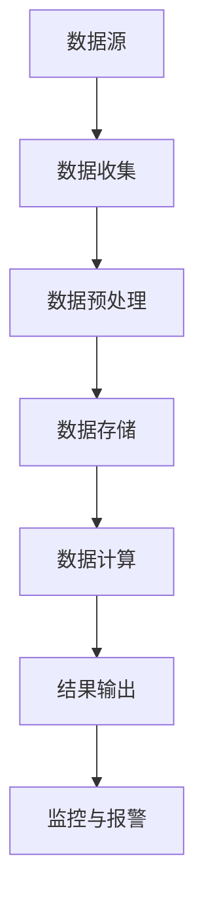

                 


### 构建高性能的流处理架构

## 关键词

流处理，高性能，架构设计，分布式系统，实时数据处理，大数据处理，窗口机制，模式识别，性能优化，实战案例

## 摘要

本文旨在深入探讨如何构建高性能的流处理架构，通过分析流处理的概念、核心原理、算法、数学模型以及项目实战，帮助读者理解并掌握流处理架构的设计与实现方法。文章首先介绍了流处理的背景和重要性，随后详细阐述了流处理架构的核心概念与联系，包括窗口机制和模式识别算法，并通过伪代码和数学公式进行了详细讲解。接下来，文章分析了流处理的数学模型和性能优化策略，并在最后通过实际案例展示了流处理架构的应用和优化方法。通过本文的阅读，读者将能够获得构建高性能流处理架构的全面知识和实践经验。

## 引言

### 流处理的概念和重要性

流处理（Stream Processing）是数据处理领域的一种技术，它通过持续地对数据流进行处理，实现对实时数据的分析和处理。与传统的批处理（Batch Processing）不同，流处理的特点是实时性和连续性，它能够对数据流进行实时监控、分析和处理，从而为用户提供实时反馈。流处理在当今的大数据时代尤为重要，其主要应用场景包括：

1. **实时监控**：流处理能够对网络流量、服务器日志、系统性能等实时数据进行分析，帮助运维人员及时发现问题并进行处理。
2. **实时推荐**：在电商、社交媒体等领域，流处理能够根据用户的实时行为数据进行个性化推荐，提高用户满意度和转化率。
3. **实时交易监控**：在金融领域，流处理能够实时监控交易数据，及时发现异常交易并进行预警，防止金融风险。
4. **物联网数据流处理**：流处理能够实时处理来自物联网设备的大量数据，实现对设备的实时监控和管理。

流处理的优势在于其高实时性和低延迟，这使得它能够满足许多需要快速响应的应用场景。然而，流处理系统设计也面临着诸多挑战，如数据一致性问题、容错性和可扩展性问题等。因此，如何构建一个高性能、可靠的流处理架构是当前大数据领域的研究热点。

### 书籍目标和结构概述

本文的目标是深入探讨流处理架构的设计与实现，帮助读者构建高性能的流处理系统。全文分为以下几个部分：

1. **背景知识**：介绍流处理的基本概念、应用场景以及与传统批处理的不同之处。
2. **核心概念与联系**：详细阐述流处理架构的核心概念，如窗口机制、模式识别算法等，并通过Mermaid流程图展示其关系架构。
3. **核心算法原理讲解**：使用伪代码和数学公式讲解窗口机制和模式识别算法，帮助读者深入理解其原理。
4. **数学模型和数学公式**：介绍流处理的数学模型和性能优化策略，并通过具体例子进行详细讲解。
5. **项目实战**：通过实际案例展示流处理架构的开发环境搭建、源代码实现和优化方法。
6. **总结与展望**：总结全文内容，展望流处理架构的未来发展趋势。

通过本文的阅读，读者将能够获得构建高性能流处理架构的全面知识和实践经验，为实际项目中的流处理系统设计提供有力支持。

## 背景知识

### 数据流和流处理简介

数据流（Data Stream）是指在一定时间内连续产生和传递的数据集合。与传统的批量数据（Batch Data）不同，数据流的特点是连续性和动态性，数据以流的形式持续产生和传递。数据流可以来源于各种不同的数据源，如传感器、网络设备、应用程序等，其种类繁多，包括文本、图片、音频、视频等不同类型。

流处理（Stream Processing）是一种数据处理技术，它通过实时地处理数据流，实现对数据的分析和处理。流处理系统通常具有以下特点：

1. **实时性**：流处理能够对实时数据流进行快速处理和分析，提供实时反馈。
2. **连续性**：流处理能够持续地对数据流进行处理，不会因数据流的间断而停止工作。
3. **分布式**：流处理系统通常采用分布式架构，能够处理大量数据并保持高性能。

流处理的应用场景广泛，包括实时监控、实时推荐、实时交易监控、物联网数据流处理等。传统的批处理（Batch Processing）虽然能够处理大量数据，但存在延迟高、实时性差的问题，无法满足许多需要快速响应的应用场景。相比之下，流处理具有明显的优势。

### 流处理框架概述

流处理框架是流处理系统的核心组成部分，它负责处理数据流的收集、传输、存储和计算。常见的流处理框架包括Apache Flink、Apache Storm、Apache Spark Streaming等。这些框架各具特点，但总体上提供了以下功能：

1. **数据流编程接口**：流处理框架提供了丰富的编程接口，使得开发者能够以类似于批处理的方式处理数据流。
2. **分布式计算能力**：流处理框架能够将计算任务分布到多个节点上执行，提高系统的并行处理能力。
3. **容错性和扩展性**：流处理框架具备良好的容错性和扩展性，能够自动处理节点故障并动态扩展计算资源。

流处理框架的选择取决于具体的应用需求和性能要求。例如，Apache Flink以其强大的流处理能力和丰富的功能著称，适合处理大规模实时数据；Apache Storm则因其低延迟和高吞吐量而受到青睐，适合处理低延迟、高并发的实时数据。

### 高性能流处理系统的挑战

构建高性能的流处理系统面临诸多挑战，主要包括以下几方面：

1. **数据一致性和容错性**：流处理系统需要保证数据的一致性和容错性，以防止数据丢失和系统故障。
2. **低延迟和高吞吐量**：高性能流处理系统需要在低延迟和高吞吐量之间取得平衡，以满足实时数据处理的需求。
3. **可扩展性和弹性**：流处理系统需要具备良好的可扩展性和弹性，能够动态适应数据流量的变化。
4. **资源管理和优化**：流处理系统需要高效地管理计算资源和数据存储资源，以降低系统成本和提高性能。

解决这些挑战需要综合考虑系统设计、算法选择、性能优化等方面，构建一个高效、可靠的流处理架构。本文将围绕这些挑战，详细介绍高性能流处理系统的构建方法和实践技巧。

## 核心概念与联系

### 流处理架构的Mermaid流程图

为了更好地理解流处理架构的核心概念与联系，我们可以通过Mermaid流程图来展示其整体架构。以下是一个简化的流处理架构Mermaid流程图：



这个Mermaid流程图展示了流处理系统的主要组件及其相互关系：

1. **数据源（A）**：数据源是数据流的起点，可以是传感器、网络设备、日志文件等，数据源持续地产生数据。
2. **数据收集（B）**：数据收集组件负责将数据从源端收集到系统中，通常通过消息队列（如Kafka）来实现数据的缓冲和传输。
3. **数据预处理（C）**：数据预处理组件负责对收集到的数据进行清洗、转换和格式化，以便后续处理。
4. **数据存储（D）**：数据存储组件负责将预处理后的数据存储到数据库或数据湖中，以供后续分析和查询。
5. **数据计算（E）**：数据计算组件负责对存储的数据进行实时计算和分析，可以包括窗口计算、聚合计算、机器学习模型等。
6. **结果输出（F）**：结果输出组件负责将计算结果输出到目的地，如报表、仪表盘、监控报警系统等。
7. **监控与报警（G）**：监控与报警组件负责监控流处理系统的运行状态，并在出现异常时发送报警通知。

通过这个Mermaid流程图，我们可以清晰地看到流处理架构的各个组件及其工作流程，有助于理解流处理系统的整体设计和实现。

### 流处理与批处理的区别与联系

流处理和批处理是两种不同的数据处理方式，它们在数据处理模式、处理时间、系统架构等方面存在显著差异。

#### 数据处理模式

1. **批处理**：批处理是一种批量处理数据的方式，将一段时间内的数据批量处理，通常用于处理历史数据。批处理的特点是处理时间长，但处理过程是离线的，不会实时影响系统的运行。
2. **流处理**：流处理是一种实时处理数据的方式，对实时数据流进行持续处理，能够在数据产生的同时立即进行响应。流处理的特点是处理速度快，能够实时反映数据的变化。

#### 处理时间

1. **批处理**：批处理的数据处理时间取决于数据量的大小和处理算法的复杂度，通常需要较长时间，从几分钟到几小时不等。
2. **流处理**：流处理的数据处理时间取决于数据流的实时性和系统性能，通常在秒级或毫秒级，能够实现实时响应。

#### 系统架构

1. **批处理**：批处理系统通常采用单机或分布式计算架构，数据在处理过程中是离线的，不需要实时处理。
2. **流处理**：流处理系统通常采用分布式计算架构，能够处理大量实时数据，并具有高可用性和可扩展性。

#### 区别与联系

1. **区别**：
   - **数据处理模式**：批处理是批量处理，流处理是实时处理。
   - **处理时间**：批处理时间长，流处理短。
   - **系统架构**：批处理通常采用单机或分布式计算，流处理通常采用分布式计算。
2. **联系**：
   - **数据来源**：流处理和批处理的数据来源可以是相同的，例如日志文件、传感器数据等。
   - **处理结果**：流处理和批处理的结果可以相互补充，例如，流处理提供实时分析结果，而批处理提供历史数据分析。

总之，流处理和批处理各有优势，适用于不同的场景。在实际应用中，可以根据数据特点和需求，选择合适的处理方式，实现高效的数据处理和分析。

### 核心算法原理讲解

#### 窗口机制

窗口机制是流处理中的一种核心算法，用于对实时数据进行分段处理，以便更好地分析和理解数据。窗口机制可以根据不同的需求设置不同的窗口类型，如固定窗口、滑动窗口和事件触发窗口。

1. **固定窗口**：固定窗口是指窗口大小固定，数据流中的每个元素都包含在一个特定的窗口内。窗口固定意味着窗口的时间跨度是恒定的，例如，每5分钟或每小时生成一个固定窗口。

   伪代码示例：
   ```python
   while True:
       for each element in data_stream:
           if element.time >= window_start + window_size:
               process_window_content(window_start, window_end)
               window_start += window_size
           else:
               add_element_to_window(element)
   ```

2. **滑动窗口**：滑动窗口是指窗口大小固定，但窗口在时间轴上不断向前滑动。滑动窗口可以分为两种类型：固定滑动窗口和可变滑动窗口。固定滑动窗口的时间跨度固定，但窗口的位置不断向前移动；可变滑动窗口的时间跨度可以动态调整，窗口的位置也相应调整。

   伪代码示例（固定滑动窗口）：
   ```python
   while True:
       for each element in data_stream:
           if element.time >= window_start + window_size:
               process_window_content(window_start, window_end)
               window_start += slide_size
           else:
               add_element_to_window(element)
   ```

3. **事件触发窗口**：事件触发窗口是基于特定事件触发的窗口，窗口的开始和结束由事件触发。例如，当一个特定的事件发生时，窗口开始，当另一个特定的事件发生时，窗口结束。

   伪代码示例：
   ```python
   event_trigger = False
   while True:
       for each element in data_stream:
           if event_condition_met(element):
               event_trigger = True
               window_start = element.time
           if event_trigger:
               if element.time >= window_end + window_size:
                   process_window_content(window_start, window_end)
                   window_start += window_size
                   event_trigger = False
           else:
               add_element_to_window(element)
   ```

#### 模式识别算法

模式识别算法是流处理中用于发现数据中的规律和模式的一类算法。常见的模式识别算法包括K-Means算法、Apriori算法等。

1. **K-Means算法**：K-Means是一种基于距离的聚类算法，用于将数据点划分为K个簇。算法的基本思想是：首先随机初始化K个簇中心，然后不断迭代更新簇中心，直到簇中心不再变化。

   伪代码示例：
   ```python
   while True:
       for each data_point in data_stream:
           assign data_point to the nearest cluster
       update cluster_centers
       if cluster_centers haven't changed:
           break
   ```

2. **Apriori算法**：Apriori算法是一种用于发现频繁项集的算法，广泛应用于关联规则挖掘。算法的基本思想是：首先计算每个项的支持度，然后根据最小支持度阈值筛选出频繁项集，最后生成关联规则。

   伪代码示例：
   ```python
   while True:
       for each itemset in candidate_itemsets:
           if support(itemset) >= min_support:
               add itemset to frequent_itemsets
           else:
               remove itemset from candidate_itemsets
       if no new frequent_itemsets found:
           break
       generate association_rules(frequent_itemsets)
   ```

通过上述伪代码示例，我们可以清晰地看到窗口机制和模式识别算法的基本原理。窗口机制通过对数据进行分段处理，使得流处理系统能够更好地理解和分析数据；模式识别算法则能够发现数据中的隐藏规律和模式，为实时数据分析和决策提供有力支持。

### 数学模型和数学公式

#### 时间序列分析

时间序列分析是一种常用的数据分析方法，用于研究时间序列数据中的规律性和趋势。在流处理架构中，时间序列分析可以用于预测未来的数据趋势、发现异常数据等。

时间序列分析中常用的数学模型是ARIMA模型（自回归积分滑动平均模型）。ARIMA模型由三个部分组成：自回归（AR）、差分（I）和移动平均（MA）。

1. **自回归模型（AR）**：自回归模型通过当前时刻的观测值与前几个时刻的观测值进行线性组合来预测当前时刻的值。

   数学公式：
   $$
   \text{AR}(p) = \phi_1 B^1 + \phi_2 B^2 + \cdots + \phi_p B^p = y_t - (\phi_1 y_{t-1} + \phi_2 y_{t-2} + \cdots + \phi_p y_{t-p})
   $$
   其中，$B$ 是滞后算子，$\phi_i$ 是自回归系数。

2. **差分模型（I）**：差分模型用于消除时间序列中的趋势和季节性，使得数据更加平稳。

   数学公式：
   $$
   \text{I}(d) = (1 - B)^d = (1 - B)(1 - B)(1 - B) \cdots (1 - B)
   $$
   其中，$d$ 是差分阶数。

3. **移动平均模型（MA）**：移动平均模型通过当前时刻的观测值与过去几个时刻的预测误差进行线性组合来预测当前时刻的值。

   数学公式：
   $$
   \text{MA}(q) = \theta_1 e_t-1 + \theta_2 e_t-2 + \cdots + \theta_q e_t-q = y_t - (\theta_1 e_{t-1} + \theta_2 e_{t-2} + \cdots + \theta_q e_{t-q})
   $$
   其中，$e_t$ 是预测误差，$\theta_i$ 是移动平均系数。

ARIMA模型将自回归、差分和移动平均三个部分结合起来，形成一个完整的数学模型，用于分析时间序列数据。

#### 流处理性能优化

流处理系统的性能优化是确保系统在低延迟和高吞吐量之间取得平衡的关键。性能优化可以通过以下策略实现：

1. **并行处理**：通过将计算任务分布到多个节点上，并行处理可以显著提高系统的吞吐量。并行处理的关键在于如何合理划分任务，以避免数据倾斜和任务依赖。
2. **数据分区**：数据分区是将数据集划分为多个分区，以便于并行处理。合理的数据分区策略可以提高查询效率，减少数据传输延迟。
3. **资源分配**：资源分配是指根据任务需求动态调整计算资源，如CPU、内存和存储。合理的资源分配可以提高系统的整体性能和资源利用率。
4. **缓存和索引**：缓存和索引可以显著提高数据访问速度。通过将常用数据存储在缓存中，减少磁盘I/O操作；通过建立索引，加快查询速度。

数学公式：
$$
\text{TPS} = \frac{\text{处理能力}}{\text{响应时间}}
$$
其中，$\text{TPS}$ 是每秒处理事务数，$\text{处理能力}$ 是系统在单位时间内能够处理的数据量，$\text{响应时间}$ 是用户请求到系统响应的时间。

通过优化处理能力、降低响应时间，可以提高系统的TPS，从而提高系统的性能。

通过上述数学模型和性能优化策略，我们可以有效地提高流处理系统的性能，为实时数据处理和分析提供有力支持。

### 项目实战

#### 开发环境搭建

在构建高性能流处理架构之前，首先需要搭建一个适合的开发环境。以下是一个基于Apache Flink的流处理系统开发环境搭建步骤：

1. **安装Java环境**：Apache Flink是基于Java和Scala开发的，因此需要安装Java环境。可以从[Oracle官网](https://www.oracle.com/java/technologies/javase-downloads.html)下载并安装Java SDK。

2. **安装Apache Flink**：可以从[Apache Flink官网](https://flink.apache.org/downloads/)下载Apache Flink的安装包。下载后，解压安装包并将其路径添加到系统的环境变量中。

3. **安装消息队列**：为了实现数据收集，需要安装一个消息队列，如Apache Kafka。可以从[Apache Kafka官网](https://kafka.apache.org/downloads/)下载并安装Kafka。安装完成后，启动Kafka服务器和Zookeeper。

4. **配置数据存储**：流处理系统通常需要将数据存储到数据库或数据湖中，如MySQL、Hadoop HDFS等。根据需求安装并配置相应的存储系统。

5. **编写代码**：在开发环境中编写流处理应用程序，包括数据收集、预处理、存储和计算等步骤。

以下是一个简单的Flink应用程序示例，用于从Kafka读取数据并输出到控制台：

```scala
import org.apache.flink.streaming.api.scala._
import org.apache.flink.streaming.connectors.kafka.FlinkKafkaConsumer
import org.apache.flink.streaming.api.windowing.time.Time

object FlinkStreamingExample {
  def main(args: Array[String]): Unit = {
    // 创建一个Flink流执行环境
    val env = StreamExecutionEnvironment.getExecutionEnvironment

    // 配置Kafka消费者
    val kafkaProps = new Properties()
    kafkaProps.setProperty("bootstrap.servers", "localhost:9092")
    kafkaProps.setProperty("group.id", "test-group")

    // 从Kafka读取数据
    val stream = env.addSource(
      new FlinkKafkaConsumer[String]("test-topic", new SimpleStringSchema(), kafkaProps)
    )

    // 数据预处理和计算
    val processedStream = stream
      .map(line => line.toUpperCase())
      .timeWindow(Time.seconds(10))

    // 输出结果到控制台
    processedStream.print()

    // 执行流处理任务
    env.execute("Flink Streaming Example")
  }
}
```

在这个示例中，我们首先创建了一个Flink流执行环境，然后配置了Kafka消费者，从指定的Kafka主题读取数据。接着，我们对数据进行预处理（将小写字母转换为 uppercase），并使用时间窗口对数据进行聚合计算。最后，我们将处理结果输出到控制台。

通过以上步骤，我们成功搭建了一个简单的流处理开发环境。在实际项目中，可以根据需求进行扩展和优化。

#### 源代码详细实现和代码解读

在上面的示例中，我们使用Apache Flink实现了从Kafka读取数据并进行实时处理的流处理应用程序。以下是对源代码的详细解读：

```scala
import org.apache.flink.streaming.api.scala._
import org.apache.flink.streaming.connectors.kafka.FlinkKafkaConsumer
import org.apache.flink.streaming.api.windowing.time.Time

object FlinkStreamingExample {
  def main(args: Array[String]): Unit = {
    // 创建一个Flink流执行环境
    val env = StreamExecutionEnvironment.getExecutionEnvironment

    // 配置Kafka消费者
    val kafkaProps = new Properties()
    kafkaProps.setProperty("bootstrap.servers", "localhost:9092")
    kafkaProps.setProperty("group.id", "test-group")

    // 从Kafka读取数据
    val stream = env.addSource(
      new FlinkKafkaConsumer[String]("test-topic", new SimpleStringSchema(), kafkaProps)
    )

    // 数据预处理和计算
    val processedStream = stream
      .map(line => line.toUpperCase())
      .timeWindow(Time.seconds(10))

    // 输出结果到控制台
    processedStream.print()

    // 执行流处理任务
    env.execute("Flink Streaming Example")
  }
}
```

1. **创建Flink流执行环境**：`val env = StreamExecutionEnvironment.getExecutionEnvironment`用于创建一个Flink流执行环境。流执行环境是Flink流处理应用程序的入口点，用于配置和管理流处理任务。

2. **配置Kafka消费者**：`val kafkaProps = new Properties()`用于创建一个Properties对象，用于配置Kafka消费者的属性。在这个示例中，我们设置了Kafka服务器的地址（`bootstrap.servers`）和消费者组的ID（`group.id`）。

3. **从Kafka读取数据**：`val stream = env.addSource(new FlinkKafkaConsumer[String]("test-topic", new SimpleStringSchema(), kafkaProps))`用于从Kafka读取数据。这里，我们使用FlinkKafkaConsumer类从指定的Kafka主题（`test-topic`）读取字符串类型的数据。SimpleStringSchema是一个简单的序列化器，用于将Kafka消息反序列化为字符串。

4. **数据处理和计算**：`val processedStream = stream.map(line => line.toUpperCase()).timeWindow(Time.seconds(10))`用于对数据进行处理和计算。首先，我们使用`map`函数将小写字母转换为uppercase。然后，使用`timeWindow`函数为数据流创建一个10秒的时间窗口，对窗口内的数据进行聚合计算。

5. **输出结果到控制台**：`processedStream.print()`用于将处理结果输出到控制台。这是Flink提供的一个简单的输出操作，用于查看流处理的结果。

6. **执行流处理任务**：`env.execute("Flink Streaming Example")`用于提交流处理任务并执行。这里，我们给流处理任务起了一个名称（`Flink Streaming Example`），用于在Flink管理界面中标识任务。

通过上述步骤，我们实现了从Kafka读取数据并进行实时处理的流处理应用程序。在实际项目中，可以根据需求扩展和优化源代码，实现更复杂的数据处理和分析任务。

#### 代码应用解读与分析

在上面的示例中，我们实现了从Kafka读取数据、进行数据转换和计算，并将结果输出到控制台的功能。以下是对代码应用的解读与分析：

1. **数据来源与处理**：本示例使用Kafka作为数据源，Kafka是一种分布式消息队列系统，能够实现大规模数据的高效传输和消费。在代码中，我们通过FlinkKafkaConsumer从Kafka的`test-topic`主题中读取字符串类型的数据。读取的数据经过`map`函数处理后，将小写字母转换为uppercase。

2. **时间窗口机制**：时间窗口是流处理中的一个重要概念，用于对连续的数据流进行分段处理。在本示例中，我们使用`timeWindow`函数为数据流创建了一个10秒的时间窗口。窗口机制使得我们可以对窗口内的数据进行聚合计算，如统计窗口内的数据数量、计算平均值等。

3. **数据处理流程**：数据处理流程包括数据读取、预处理和计算。首先，从Kafka读取数据，然后使用`map`函数对数据进行转换，最后将处理结果输出到控制台。这个过程实现了数据的实时处理和分析，为用户提供了实时反馈。

4. **性能优化**：为了提高系统的性能，我们可以在代码中进行以下优化：
   - **并行处理**：通过增加并行度，可以显著提高系统的处理能力。例如，可以在创建FlinkKafkaConsumer时设置`par

