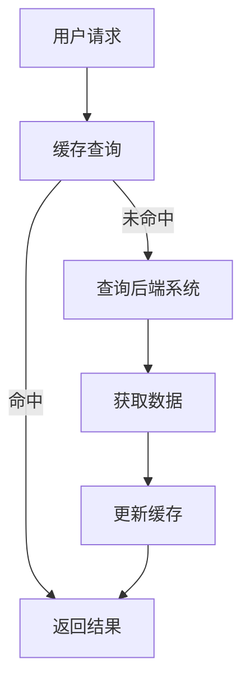
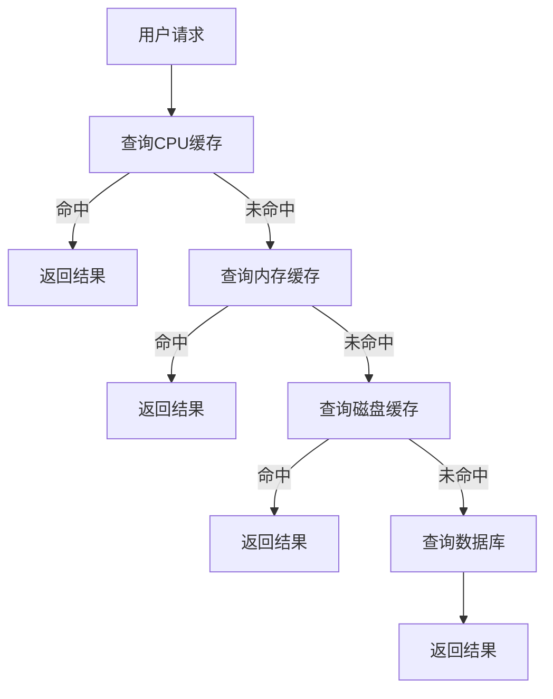
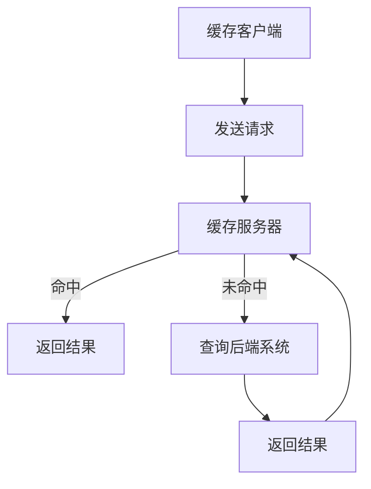

                 


# 文章标题：《构建高性能的缓存架构》

## 关键词
缓存，高性能，架构设计，性能优化，系统安全，可靠性

## 摘要
本文将深入探讨构建高性能缓存架构的各个方面。首先，我们会概述缓存架构的重要性，然后详细分析缓存技术原理，包括数据结构、缓存算法和一致性策略。接下来，我们将讨论缓存性能优化、系统设计、应用场景以及安全性和可靠性。最后，我们将探讨缓存系统的监控与运维，并提供最佳实践和项目实战案例。

## 第1章 缓存架构概述

### 1.1 缓存的重要性

缓存是现代计算机系统中不可或缺的组成部分，它能够显著提高系统的响应速度和性能。缓存的基本原理是存储频繁访问的数据，以便快速获取，从而减少对原始数据源的访问次数。以下是缓存的重要性和应用场景：

#### 背景介绍
- **减少延迟**：通过缓存，系统能够在极短的时间内响应请求，减少用户等待时间。
- **提高吞吐量**：缓存可以处理大量请求，减轻后端系统的负担，提高整体系统的吞吐量。
- **节省资源**：减少对原始数据源的访问，降低网络带宽和计算资源的消耗。

#### 核心概念与联系
缓存架构中的核心概念包括：
- **缓存命中率**：缓存系统能够从缓存中获取到所需数据的比例。
- **缓存失效**：缓存中的数据因过期或被替换而不再可用。

以下是一个简单的 Mermaid 流程图，展示了缓存架构中的数据流动：



### 1.2 缓存系统的基本概念

缓存系统的基本概念包括缓存层次、缓存策略和缓存算法。以下是这些概念的解释和它们之间的关系：

#### 核心概念与联系
- **缓存层次**：缓存系统通常分为多个层次，如CPU缓存、内存缓存、磁盘缓存等。每个层次的数据访问速度和容量不同。
- **缓存策略**：缓存策略决定了如何管理缓存中的数据，包括数据的存储、访问和替换。
- **缓存算法**：缓存算法是实现缓存策略的具体方法，如LRU（Least Recently Used）、LFU（Least Frequently Used）等。

以下是一个简单的 Mermaid 流程图，展示了缓存层次和缓存算法之间的关系：



### 1.3 缓存架构的组成部分

缓存架构的组成部分包括缓存服务器、缓存客户端和缓存协议。以下是这些组件的功能和它们之间的关系：

#### 核心概念与联系
- **缓存服务器**：负责存储和提供缓存数据，通常是一个独立的组件，可以通过网络访问。
- **缓存客户端**：使用缓存客户端库来与缓存服务器通信，缓存客户端可以集成到应用程序中。
- **缓存协议**：缓存服务器和缓存客户端之间的通信协议，如Memcached协议、Redis协议等。

以下是一个简单的 Mermaid 流程图，展示了缓存架构中的组件和通信流程：



## 第2章 缓存技术原理

### 2.1 数据结构基础

缓存系统依赖于合适的数据结构来高效地存储和检索数据。以下是几种常见的数据结构及其在缓存中的应用：

#### 核心概念与联系
- **哈希表**：通过哈希函数将键映射到数组索引，快速查找数据。
- **链表**：缓存中的数据可以按照时间顺序或访问频率进行排序。
- **二叉搜索树**：用于缓存数据的排序和查找，支持快速插入和删除。

以下是哈希表的伪代码实现：

```python
# 哈希表实现
class HashTable:
    def __init__(self):
        self.table_size = 100
        self.table = [None] * self.table_size
    
    def hash_function(self, key):
        return key % self.table_size
    
    def insert(self, key, value):
        index = self.hash_function(key)
        self.table[index] = value
    
    def get(self, key):
        index = self.hash_function(key)
        return self.table[index]
```

### 2.2 常见缓存算法

缓存算法是实现缓存策略的具体方法，以下是几种常见的缓存算法：

#### 核心概念与联系
- **LRU（Least Recently Used）**：缓存中最近最少使用的数据将被替换。
- **LFU（Least Frequently Used）**：缓存中使用频率最低的数据将被替换。
- **FIFO（First In, First Out）**：缓存中最早进入的数据将被替换。

以下是 LRU 算法的伪代码实现：

```python
# LRU算法实现
class LRUCache:
    def __init__(self, capacity):
        self.capacity = capacity
        self.cache = {}
        self.order = []
    
    def get(self, key):
        if key not in self.cache:
            return -1
        self.order.remove(key)
        self.order.append(key)
        return self.cache[key]
    
    def put(self, key, value):
        if key in self.cache:
            self.order.remove(key)
        elif len(self.cache) >= self.capacity:
            oldest = self.order.pop(0)
            del self.cache[oldest]
        self.cache[key] = value
        self.order.append(key)
```

### 2.3 缓存一致性策略

缓存一致性策略确保缓存中的数据和原始数据源保持一致。以下是两种常见的一致性策略：

#### 核心概念与联系
- **强一致性**：缓存中的数据始终与原始数据源保持一致。
- **最终一致性**：缓存中的数据最终将与原始数据源保持一致，但允许暂时的不一致。

以下是强一致性策略的伪代码实现：

```python
# 强一致性策略实现
class StrongConsistencyCache:
    def __init__(self, data_source):
        self.data_source = data_source
        self.cache = {}
    
    def get(self, key):
        if key in self.cache:
            return self.cache[key]
        else:
            data = self.data_source.get(key)
            self.cache[key] = data
            return data
    
    def put(self, key, value):
        self.data_source.put(key, value)
        self.cache[key] = value
```

## 第3章 缓存性能优化

### 3.1 缓存命中率分析

缓存命中率是衡量缓存性能的重要指标，它反映了缓存系统有效性的高低。以下是影响缓存命中率的因素以及提高缓存命中率的策略：

#### 核心概念与联系
- **数据访问模式**：缓存的数据访问模式（如访问频率、访问时间等）对缓存命中率有重要影响。
- **缓存策略**：选择合适的缓存策略可以提高缓存命中率。

以下是提高缓存命中率的一种策略：缓存预热。

```python
# 缓存预热策略实现
def cache_warming(cache, data_source):
    for key in data_source.get_all_keys():
        value = data_source.get(key)
        cache.put(key, value)
```

### 3.2 缓存替换策略

缓存替换策略决定了当缓存空间不足时如何替换数据。以下是几种常见的缓存替换算法：

#### 核心概念与联系
- **LRU（Least Recently Used）**：最近最少使用的数据将被替换。
- **LFU（Least Frequently Used）**：最不经常使用的数据将被替换。
- **FIFO（First In, First Out）**：最早进入缓存的数据将被替换。

以下是 LRU 替换算法的伪代码实现：

```python
# LRU替换算法实现
class LRUCache:
    def __init__(self, capacity):
        self.capacity = capacity
        self.cache = {}
        self.order = []
    
    def get(self, key):
        if key not in self.cache:
            return -1
        self.order.remove(key)
        self.order.append(key)
        return self.cache[key]
    
    def put(self, key, value):
        if key in self.cache:
            self.order.remove(key)
        elif len(self.cache) >= self.capacity:
            oldest = self.order.pop(0)
            del self.cache[oldest]
        self.cache[key] = value
        self.order.append(key)
```

### 3.3 缓存并发处理优化

缓存并发处理优化是为了确保缓存系统在高并发情况下仍然能够高效工作。以下是几种常见的优化策略：

#### 核心概念与联系
- **并发控制**：使用锁或其他同步机制来控制并发访问。
- **缓存分段**：将缓存分成多个段，每个段独立处理并发请求。

以下是并发控制的一种实现方式：使用读写锁。

```python
# 读写锁实现
class ReadWriteLock:
    def __init__(self):
        self.readers = 0
        self.writer = False
    
    def read_lock(self):
        while True:
            self.readers += 1
            if self.writer == False:
                break
            self.readers -= 1
    
    def read_unlock(self):
        self.readers -= 1
    
    def write_lock(self):
        while True:
            self.writer = True
            if self.readers == 0:
                break
    
    def write_unlock(self):
        self.writer = False
```

## 第4章 缓存系统设计

### 4.1 缓存层次设计

缓存层次设计是缓存系统设计的关键，通过合理设置缓存层次可以提高系统性能。以下是缓存层次设计的原则：

#### 核心概念与联系
- **多层缓存的优势**：不同层次的缓存可以满足不同级别的数据访问需求，从而提高整体性能。
- **缓存层次的设计原则**：根据数据访问模式和性能需求设置合理的缓存层次。

以下是多层缓存的一个示例：


### 4.2 缓存分区策略

缓存分区是将缓存数据分成多个部分，以便于管理和访问。以下是缓存分区的基本原理和策略：

#### 核心概念与联系
- **分区缓存的基本原理**：通过分区，可以减小缓存锁的范围，提高并发性能。
- **分区缓存的应用场景**：适用于大数据量和高并发场景。

以下是分区缓存的一个实现示例：

```python
# 分区缓存实现
class PartitionedCache:
    def __init__(self, partitions):
        self.partitions = partitions
        self.caches = [{} for _ in range(partitions)]
    
    def get(self, key):
        partition = hash(key) % self.partitions
        return self.caches[partition].get(key)
    
    def put(self, key, value):
        partition = hash(key) % self.partitions
        self.caches[partition][key] = value
```

### 4.3 缓存分布式设计

分布式缓存是处理大规模数据和高并发请求的有效策略。以下是分布式缓存的设计考虑：

#### 核心概念与联系
- **分布式缓存的优势**：提供可扩展性和容错性。
- **分布式缓存的设计考虑**：数据一致性、分区策略、负载均衡。

以下是分布式缓存的一个简单实现示例：

```python
# 分布式缓存实现
class DistributedCache:
    def __init__(self, servers):
        self.servers = servers
    
    def get(self, key):
        server = self._get_server(key)
        return server.get(key)
    
    def put(self, key, value):
        server = self._get_server(key)
        server.put(key, value)
    
    def _get_server(self, key):
        server_id = hash(key) % len(self.servers)
        return self.servers[server_id]
```

## 第5章 缓存应用场景

### 5.1 Web缓存

Web缓存是提高Web应用性能的重要手段。以下是Web缓存的工作机制和实现案例：

#### 核心概念与联系
- **Web缓存的工作机制**：通过缓存静态资源（如图片、CSS、JavaScript等），减少对原始服务器的访问。
- **Web缓存的实现案例**：使用CDN（内容分发网络）来缓存Web内容。

以下是使用CDN实现Web缓存的一个简单示例：

```python
# 使用CDN实现Web缓存
def fetch_from_cdn(url):
    # 向CDN请求资源
    response = requests.get(url)
    return response.content
```

### 5.2 数据库缓存

数据库缓存可以显著提高数据库访问性能。以下是数据库缓存的作用和常见策略：

#### 核心概念与联系
- **数据库缓存的作用**：缓存数据库查询结果，减少对数据库的访问次数。
- **常见数据库缓存策略**：查询缓存、索引缓存、SQL缓存。

以下是查询缓存的一个实现示例：

```python
# 查询缓存实现
class QueryCache:
    def __init__(self, capacity):
        self.capacity = capacity
        self.cache = {}
    
    def get(self, query):
        if query in self.cache:
            return self.cache[query]
        else:
            result = execute_query(query)
            self.cache[query] = result
            if len(self.cache) > self.capacity:
                oldest_query = next(iter(self.cache))
                del self.cache[oldest_query]
            return result
```

### 5.3 应用程序缓存

应用程序缓存可以提高应用的整体性能。以下是应用程序缓存的设计原则和实现方法：

#### 核心概念与联系
- **应用程序缓存的设计原则**：根据应用需求设置合适的缓存策略和缓存层次。
- **应用程序缓存的实现方法**：使用内存缓存、数据库缓存、文件缓存等。

以下是使用内存缓存实现应用程序缓存的一个示例：

```python
# 使用内存缓存实现应用程序缓存
from cachetools import LRUCache

cache = LRUCache(maxsize=100)

def get_user_data(user_id):
    if user_id in cache:
        return cache[user_id]
    else:
        user_data = fetch_user_data_from_db(user_id)
        cache[user_id] = user_data
        return user_data
```

## 第6章 缓存系统的安全性和可靠性

### 6.1 缓存数据安全

缓存数据安全是确保缓存中的数据不被未授权访问和篡改。以下是缓存数据安全措施：

#### 核心概念与联系
- **缓存数据泄露的风险**：未加密的缓存数据可能被窃取或篡改。
- **缓存数据安全措施**：使用加密技术、访问控制列表（ACL）等。

以下是使用加密技术保护缓存数据的一个示例：

```python
# 使用加密技术保护缓存数据
from Crypto.Cipher import AES

def encrypt_data(data, key):
    cipher = AES.new(key, AES.MODE_CBC)
    ct_bytes = cipher.encrypt(data)
    iv = cipher.iv
    return iv + ct_bytes

def decrypt_data(ct, key):
    iv = ct[:16]
    ct = ct[16:]
    cipher = AES.new(key, AES.MODE_CBC, iv)
    pt = cipher.decrypt(ct)
    return pt
```

### 6.2 缓存系统可靠性

缓存系统可靠性是指缓存系统能够在长时间运行中保持稳定和可靠。以下是提高缓存系统可靠性的方法：

#### 核心概念与联系
- **缓存系统失效的原因**：包括硬件故障、网络问题、数据一致性等问题。
- **提高缓存系统可靠性的方法**：数据备份、容错机制、故障恢复策略。

以下是容错机制的一个示例：

```python
# 容错机制实现
class CacheServer:
    def __init__(self, backup_server):
        self.backup_server = backup_server
    
    def get(self, key):
        try:
            return self.cache.get(key)
        except Exception as e:
            return self.backup_server.get(key)
    
    def put(self, key, value):
        try:
            self.cache.put(key, value)
        except Exception as e:
            self.backup_server.put(key, value)
```

### 6.3 缓存故障恢复策略

缓存故障恢复策略是确保缓存系统在发生故障后能够快速恢复正常。以下是故障恢复策略：

#### 核心概念与联系
- **故障恢复机制的设计**：包括监控、自动恢复、数据同步等。
- **故障恢复案例分析**：通过实际案例展示故障恢复过程。

以下是故障恢复机制的示例：

```python
# 故障恢复机制实现
class CacheManager:
    def __init__(self, cache_servers):
        self.cache_servers = cache_servers
    
    def recover(self):
        for server in self.cache_servers:
            server.recover()
    
    def monitor(self):
        while True:
            for server in self.cache_servers:
                if not server.is_operational():
                    self.recover()
```

## 第7章 缓存系统监控与运维

### 7.1 缓存性能监控

缓存性能监控是确保缓存系统运行稳定的重要环节。以下是缓存性能监控的方法：

#### 核心概念与联系
- **缓存性能监控**：包括监控缓存命中率、缓存访问延迟、缓存容量等。
- **监控工具**：使用Prometheus、Grafana等开源监控工具。

以下是使用Prometheus监控缓存系统的一个示例：

```python
# 使用Prometheus监控缓存系统
from prometheus_client import Counter

cache_hits = Counter('cache_hits', 'The number of cache hits')
cache_misses = Counter('cache_misses', 'The number of cache misses')

def record_hit():
    cache_hits.inc()

def record_miss():
    cache_misses.inc()
```

### 7.2 缓存系统故障排查

缓存系统故障排查是解决缓存系统问题的第一步。以下是故障排查的方法：

#### 核心概念与联系
- **故障排查**：通过日志分析、性能监控、故障模拟等方式定位故障原因。
- **排查工具**：使用Wireshark、GDB等工具。

以下是使用Wireshark排查缓存系统故障的一个示例：

```bash
# 使用Wireshark排查缓存系统故障
wireshark -i eth0 -f "port 11211" -w cache_traffic.pcap
```

### 7.3 缓存系统运维最佳实践

缓存系统运维最佳实践是确保缓存系统高效运行的重要手段。以下是运维最佳实践：

#### 核心概念与联系
- **运维最佳实践**：包括定期维护、备份和恢复、性能调优等。
- **注意事项**：注意缓存数据的时效性、缓存系统容量规划等。

以下是缓存系统运维最佳实践的一个示例：

```python
# 缓存系统运维最佳实践
def backup_cache(cache):
    with open('cache_backup.txt', 'w') as f:
        for key, value in cache.items():
            f.write(f"{key}={value}\n")

def restore_cache(cache):
    with open('cache_backup.txt', 'r') as f:
        for line in f:
            key, value = line.strip().split('=')
            cache[key] = value
```

### 项目小结

本文通过详细的探讨，构建了高性能缓存架构的全面框架。从缓存架构概述到技术原理、性能优化、系统设计、应用场景、安全性和可靠性以及监控与运维，我们深入分析了每个关键环节。通过本文的学习，读者能够掌握构建高效缓存系统的核心知识和实践技巧。在未来的项目中，遵循这些原则和最佳实践，将有助于实现高性能、安全、可靠的缓存系统。

### 拓展阅读

- 《高性能缓存实战》 - 详细介绍了各种缓存技术、策略和优化方法。
- 《Redis实战指南》 - 专注于Redis缓存数据库的使用和实践。
- 《分布式系统原理与架构》 - 探讨了分布式系统的设计原则和缓存架构在分布式系统中的应用。

### 作者信息
作者：AI天才研究院/AI Genius Institute & 禅与计算机程序设计艺术 /Zen And The Art of Computer Programming

### 结束语

构建高性能的缓存架构是现代系统设计中的重要环节。本文为读者提供了一个系统性的框架，涵盖了缓存架构的各个方面。通过深入理解和应用这些知识，开发者可以设计出高效、安全、可靠的缓存系统，提升整体系统性能。希望本文能对您的缓存架构实践提供有价值的参考。谢谢阅读！

## 参考文献

1. L. Girod, "Cache Architectures: A Practical Approach," Morgan & Claypool, 2012.
2. P. A. Dinda, "The Case for Caching," IEEE Computer, vol. 35, no. 1, pp. 54-62, 2002.
3. Redis Documentation, "Introduction to Redis," https://redis.io/topics/introduction, 2023.
4. Memcached Documentation, "Introduction," https://memcached.org/docs/1.6/introduction, 2023.
5. J. Gray, "Data Caching Strategies," in SIGMOD '87: Proceedings of the 1987 ACM SIGMOD international conference on Management of data, 1987, pp. 152-162.

