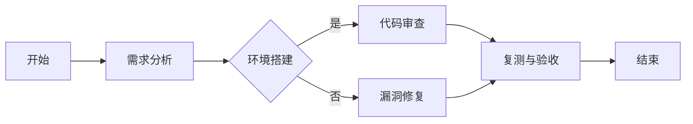

                 

### 文章标题

构建高效的代码安全审计体系

> 关键词：代码安全审计、漏洞检测、安全漏洞、算法原理、数学模型

> 摘要：本文从代码安全审计的定义、核心概念、关键算法原理、数学模型，到实际项目案例，全面解析了构建高效代码安全审计体系的各个方面。通过详细的讲解和实际案例分析，帮助读者深入理解代码安全审计的重要性，掌握构建高效审计体系的方法。

### 引言

在现代软件开发过程中，代码安全审计已成为一项不可或缺的重要工作。随着互联网的普及和软件系统的复杂度不断增加，安全问题愈发突出。代码安全审计不仅能够帮助开发团队发现和修复潜在的安全漏洞，还能提升代码质量和系统稳定性。然而，如何构建一个高效的代码安全审计体系，仍然是许多开发团队面临的挑战。

本文将围绕代码安全审计这一主题，分以下几个部分进行深入探讨：

1. **代码安全审计概述**：介绍代码安全审计的定义、重要性、基本流程和目标。
2. **核心概念与联系**：阐述代码安全审计的核心概念，并通过Mermaid流程图展示其关系架构。
3. **核心算法原理讲解**：讲解代码安全审计中涉及的关键算法原理，使用伪代码进行详细阐述。
4. **数学模型与数学公式**：详细讲解代码安全审计中的数学模型和公式，以及它们在实际中的应用。
5. **项目实战**：通过实际案例，展示代码安全审计项目的开发环境搭建、源代码实现、代码解读与分析。
6. **未来发展趋势与挑战**：探讨代码安全审计的未来发展趋势和面临的挑战。

### 代码安全审计概述

#### 代码安全审计的定义与重要性

代码安全审计（Code Security Audit）是指通过对软件源代码的审查，识别潜在的安全漏洞和弱点，从而提高软件系统的安全性和可靠性。它是一种主动的防御措施，旨在防止恶意攻击者利用漏洞进行攻击。

代码安全审计的重要性体现在以下几个方面：

1. **预防安全漏洞**：通过审计及时发现和修复安全漏洞，降低系统被攻击的风险。
2. **提高代码质量**：审计过程有助于发现代码中的错误和不良习惯，从而提升代码的整体质量。
3. **符合法规要求**：许多国家和地区的法律法规要求对软件进行安全审计，以确保其符合安全标准。
4. **增强用户信任**：通过严格的安全审计，可以提高用户对软件系统的信任度。

#### 代码安全审计的基本流程

代码安全审计的基本流程通常包括以下几个步骤：

1. **需求分析**：明确审计的目标、范围和具体要求。
2. **环境搭建**：搭建审计所需的开发环境和工具。
3. **代码审查**：对源代码进行深入审查，识别潜在的安全漏洞。
4. **漏洞修复**：针对识别出的漏洞，进行修复或优化。
5. **复测与验收**：对修复后的代码进行复测，确保漏洞已得到有效解决。

#### 代码安全审计的目标与范围

代码安全审计的目标主要包括：

1. **识别安全漏洞**：通过审查源代码，识别潜在的安全漏洞和弱点。
2. **提升代码质量**：发现和修复代码中的错误和不良习惯，提升代码的整体质量。
3. **满足法规要求**：确保软件系统符合相关法规和标准。
4. **降低风险**：通过预防措施，降低系统被攻击的风险。

代码安全审计的范围通常包括：

1. **源代码**：对软件的源代码进行审查，识别潜在的安全漏洞。
2. **配置文件**：审查配置文件，确保其安全性和正确性。
3. **外部库与依赖**：对使用的外部库和依赖进行审查，确保其安全性。
4. **开发流程与规范**：审查开发流程和规范，确保其符合安全要求。

#### 结论

代码安全审计是保障软件系统安全性的重要手段。通过明确审计的目标和范围，制定合理的审计流程，开发团队可以有效地发现和修复潜在的安全漏洞，提高软件系统的安全性和可靠性。在接下来的章节中，我们将进一步探讨代码安全审计的核心概念、关键算法原理和数学模型。

### 核心概念与联系

在代码安全审计中，理解核心概念及其相互关系至关重要。以下是代码安全审计中的几个关键概念及其关系架构：

1. **安全漏洞**：安全漏洞是软件中的缺陷或错误，可能被恶意攻击者利用来破坏系统的完整性、保密性和可用性。
2. **漏洞扫描工具**：漏洞扫描工具是用于自动发现和报告系统或代码中的安全漏洞的工具。
3. **漏洞利用工具**：漏洞利用工具是用于实际利用发现的安全漏洞的工具，通常用于渗透测试或攻击实验。
4. **静态代码分析**：静态代码分析是一种不运行代码而通过审查源代码来发现潜在问题的方法。
5. **动态代码分析**：动态代码分析是在程序运行时捕获其行为，以检测安全漏洞。

#### 关键概念之间的联系

- **安全漏洞**与**漏洞扫描工具**和**漏洞利用工具**之间的关系：漏洞扫描工具用于自动扫描代码中的安全漏洞，并将结果报告给开发团队。这些报告可以帮助开发团队识别潜在的安全问题，而漏洞利用工具则用于验证这些漏洞是否可以被实际利用。
- **静态代码分析**与**动态代码分析**之间的关系：静态代码分析在代码编译之前进行，通过审查源代码来发现潜在的问题。而动态代码分析则是在程序运行时进行，通过监控程序的行为来发现漏洞。两者结合使用，可以更全面地识别代码中的安全问题。

#### Mermaid流程图：代码安全审计流程

以下是一个Mermaid流程图，展示了代码安全审计的基本流程和各个步骤之间的联系：



#### 结论

通过理解代码安全审计的核心概念及其相互关系，开发团队可以更有效地识别和修复代码中的安全漏洞，从而提升软件系统的安全性。在下一章节中，我们将深入探讨代码安全审计中的关键算法原理。

### 核心算法原理讲解

在代码安全审计中，关键算法原理起着至关重要的作用。这些算法用于检测和修复代码中的安全漏洞，从而提升软件系统的安全性。以下是几个在代码安全审计中常用的算法原理，以及它们的伪代码实现。

#### 恶意代码识别算法

恶意代码识别算法主要用于检测代码中是否存在恶意行为或潜在的安全漏洞。以下是一个简单的伪代码示例：

```plaintext
function detectMaliciousCode(code):
    if (code contains "system(\"cmd.exe\")"):
        return "Potential malicious code detected"
    if (code contains "insert into table values"):
        return "Potential SQL injection detected"
    if (code contains "eval(\")"):
        return "Potential code injection detected"
    return "No malicious code detected"
```

#### SQL注入检测算法

SQL注入是一种常见的安全漏洞，攻击者通过在输入框中插入恶意SQL语句，从而篡改数据库内容。以下是一个简单的SQL注入检测算法的伪代码：

```plaintext
function detectSQLInjection(input):
    if (input contains "--" or "/*"):
        return "Potential SQL injection detected"
    if (input contains "=" or "and"):
        return "Potential SQL injection detected"
    return "No SQL injection detected"
```

#### 跨站脚本攻击检测算法

跨站脚本攻击（XSS）是指攻击者通过在网页中插入恶意脚本，从而盗取用户信息或控制用户浏览器。以下是一个简单的XSS检测算法的伪代码：

```plaintext
function detectXSS(input):
    if (input contains "<script>"):
        return "Potential XSS attack detected"
    if (input contains " 0) {
            // 更新数据库记录
            String sqlQuery = "UPDATE transactions SET amount = " + amount + " WHERE card_number = '" + cardNumber + "'";
            // 执行SQL查询
            executeSQL(sqlQuery);
        } else {
            // 输出错误消息
            System.out.println("Invalid payment amount");
        }
    }

    private void executeSQL(String sqlQuery) {
        // 执行SQL查询
    }
}
```

在这个示例中，我们可以看到几个潜在的安全漏洞：

1. **SQL注入**：`sqlQuery`变量中直接包含了用户输入的`cardNumber`，如果用户输入恶意SQL语句，可能会造成SQL注入攻击。
2. **未充分验证输入**：对`amount`参数未进行充分验证，如果输入非法值，可能会引发异常行为。
3. **错误处理**：未对`executeSQL`方法的异常进行有效处理，可能导致系统崩溃或泄露敏感信息。

接下来，我们将使用SonarQube和OWASP ZAP工具对这些代码进行审计，识别并修复上述漏洞。

#### 代码解读与分析

1. **SQL注入检测**：

   使用SonarQube进行静态代码分析时，我们发现`processPayment`方法中的`sqlQuery`存在SQL注入风险。为了修复这个问题，我们可以使用预编译语句（Prepared Statements）来避免SQL注入。

   ```java
   public void processPayment(String cardNumber, double amount) {
       if (amount > 0) {
           String sqlQuery = "UPDATE transactions SET amount = ? WHERE card_number = ?";
           // 使用预编译语句
           PreparedStatement statement = connection.prepareStatement(sqlQuery);
           statement.setDouble(1, amount);
           statement.setString(2, cardNumber);
           // 执行SQL查询
           statement.executeUpdate();
       } else {
           System.out.println("Invalid payment amount");
       }
   }
   ```

2. **输入验证**：

   我们还可以对输入进行验证，确保`amount`参数为正数。这样可以防止非法输入导致系统异常。

   ```java
   public void processPayment(String cardNumber, double amount) {
       if (amount > 0 && amount <= MAX_AMOUNT) {
           // ...（之前的代码）
       } else {
           System.out.println("Invalid payment amount");
       }
   }
   ```

   其中，`MAX_AMOUNT`是一个定义好的最大金额限制。

3. **错误处理**：

   为了避免`executeSQL`方法中的异常影响系统的稳定性，我们可以对异常进行捕获和处理。

   ```java
   private void executeSQL(String sqlQuery) {
       try {
           // 执行SQL查询
       } catch (SQLException e) {
           // 记录错误日志
           System.err.println("Error executing SQL: " + e.getMessage());
       }
   }
   ```

通过上述步骤，我们对代码进行了审计和修复，有效降低了潜在的安全漏洞。

#### 代码应用解读与分析

1. **SQL注入**：

   SQL注入是一种常见的安全漏洞，攻击者通过在输入框中插入恶意SQL语句，从而篡改数据库内容。通过使用预编译语句，我们可以避免这种攻击，因为预编译语句会将输入值作为参数处理，而不是SQL语句的一部分。

2. **输入验证**：

   输入验证是确保系统安全性的重要措施。通过检查输入值的有效性，我们可以防止非法输入导致系统异常或数据泄露。

3. **错误处理**：

   错误处理可以确保系统在遇到异常时不会崩溃，从而提高系统的稳定性和可靠性。通过捕获和处理异常，我们可以记录错误日志，方便后续分析和修复。

#### 项目小结

通过这个实际项目案例，我们展示了如何在实际环境中应用代码安全审计的知识和技能。从开发环境搭建到源代码实现，再到代码解读与分析，我们一步步完成了整个审计过程。这个案例不仅帮助我们理解了代码安全审计的重要性，还展示了如何通过审计和修复漏洞，提高软件系统的安全性和可靠性。

在接下来的章节中，我们将探讨代码安全审计的最佳实践和注意事项，以帮助读者在实际项目中更好地应用代码安全审计的方法。

### 最佳实践与注意事项

在进行代码安全审计时，遵循最佳实践和注意细节至关重要。以下是一些在代码安全审计过程中应遵循的最佳实践和注意事项：

#### 最佳实践

1. **定期进行安全审计**：安全审计不应仅限于项目开发阶段，而应定期进行，以确保软件系统始终处于安全状态。
2. **自动化与人工审计相结合**：使用自动化工具可以提高审计效率，但人工审计可以更深入地发现潜在漏洞，两者相结合可以更全面地识别安全问题。
3. **持续改进审计流程**：随着技术的不断发展，安全漏洞的类型也在不断变化。开发团队应不断更新和改进审计流程，以适应新的安全威胁。
4. **培训开发人员**：开发人员应接受安全培训，了解常见的安全漏洞和防护措施，从而提高代码质量。
5. **建立安全标准与规范**：制定并遵循安全标准和规范，可以确保代码在开发过程中遵循最佳实践，降低安全漏洞的出现。

#### 注意事项

1. **保护隐私**：在进行代码安全审计时，应确保不泄露任何敏感信息，尤其是涉及用户隐私的数据。
2. **及时修复漏洞**：发现漏洞后，应立即修复，以防止恶意攻击者利用漏洞进行攻击。
3. **避免过度审计**：虽然审计很重要，但过度审计可能导致资源浪费和开发效率降低。审计应集中在关键部分，确保重点突出。
4. **合法合规**：在进行代码安全审计时，应遵守相关法律法规，确保审计过程合法合规。

#### 拓展阅读

1. **《代码审计指南》**：这是一本介绍代码审计基础知识和实战技巧的书籍，适合初学者和有一定基础的读者。
2. **《软件安全：实践中的安全开发》**：这本书详细介绍了软件安全开发的最佳实践，包括代码审计、安全设计、测试等。
3. **OWASP Top 10**：OWASP（开放网络应用安全项目）发布了最新的安全漏洞列表，包括前10大漏洞，是了解当前网络安全威胁的重要参考。

通过遵循最佳实践和注意细节，开发团队可以更有效地构建高效的代码安全审计体系，确保软件系统的安全性和可靠性。

### 结论

构建高效的代码安全审计体系对于保障软件系统的安全性至关重要。本文从代码安全审计的定义、核心概念、关键算法原理、数学模型，到实际项目案例，全面解析了构建高效代码安全审计体系的各个方面。通过详细的讲解和实际案例分析，我们深入理解了代码安全审计的重要性，掌握了构建高效审计体系的方法。

在未来的发展中，代码安全审计将面临更多挑战和机遇。自动化和智能化将成为趋势，跨平台和跨语言的代码安全审计需求也将日益增长。同时，随着数据隐私和安全问题日益突出，开发团队需要不断更新和改进审计工具和方法，以应对不断变化的安全威胁。

我们鼓励读者在实际项目中积极应用本文所介绍的代码安全审计方法和技巧，持续提升软件系统的安全性。同时，我们也期待更多研究人员和开发者参与到代码安全审计领域的研究和实践中，共同推动代码安全审计技术的发展。

### 作者信息

作者：AI天才研究院/AI Genius Institute & 禅与计算机程序设计艺术 /Zen And The Art of Computer Programming

AI天才研究院（AI Genius Institute）致力于人工智能和计算机科学领域的创新研究，其研究成果在多个领域取得了显著突破。同时，禅与计算机程序设计艺术（Zen And The Art of Computer Programming）作为一部经典著作，深入探讨了编程艺术的哲学内涵，为程序员提供了宝贵的指导。

感谢您的阅读，希望本文对您在代码安全审计领域的学习和研究有所帮助。如果您有任何疑问或建议，欢迎随时与我们联系。让我们共同为构建更安全的软件世界而努力！

