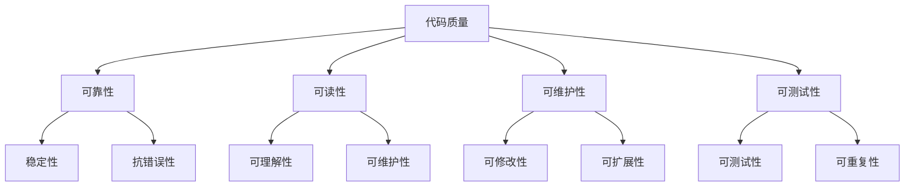

                 

# 《构建高效的代码质量管理体系》

> 关键词：代码质量、质量管理体系、持续集成、代码审查、静态代码分析、自动化测试、代码风格指南、代码文档

> 摘要：本文旨在探讨如何构建一个高效的代码质量管理体系，从代码质量的重要性、构建原则、评估指标、管理工具链、代码风格和文档等方面展开，提供一系列实际操作和最佳实践，帮助企业提升代码质量，提高开发效率和团队协作水平。

## 第一部分：代码质量管理体系概述

### 第1章：代码质量管理体系概述

#### 1.1 代码质量的重要性

在软件开发过程中，代码质量是至关重要的。它不仅影响到软件的可靠性、可维护性和可测试性，还直接关系到开发效率和团队协作。

- **代码质量定义与特征**

  - **可靠性**：代码的稳定性和抗错误性，确保软件在各种环境下都能正常运行。
  - **可读性**：代码的可理解和可维护性，便于开发者阅读和理解，降低维护成本。
  - **可维护性**：代码的可修改性和可扩展性，便于后续功能的添加和问题的修复。
  - **可测试性**：代码的可测试性和可重复性，有助于发现潜在的问题和漏洞。

- **代码质量的影响**

  - **降低成本**：提高开发效率和减少维护成本。
  - **增强安全性**：减少潜在的安全漏洞。
  - **提升团队协作**：促进代码共享和知识传递。

#### 1.2 代码质量管理体系构建原则

- **持续集成与持续部署**：确保代码质量和快速迭代。
- **代码审查**：提高代码质量和一致性。
- **静态代码分析**：发现潜在的问题和漏洞。
- **动态测试**：验证代码的功能和行为。
- **自动化测试**：提高测试效率和覆盖率。
- **代码风格指南**：统一代码规范，提高可读性和可维护性。
- **代码文档**：便于开发者理解和维护代码。

### 第2章：代码质量评估指标

#### 2.1 代码质量评估方法

- **代码行数（CLOC）**：统计代码的行数，反映代码规模。
- **代码质量度量（Maven、SonarQube）**：分析代码的质量和安全性。
- **代码复杂性度量（Cyclomatic复杂度、NPATH复杂度）**：评估代码的结构复杂度。
- **代码冗余与重复度**：检查代码中的冗余和重复部分。
- **代码覆盖率**：评估测试用例的覆盖程度。

#### 2.2 代码质量评估指标设计

- **可维护性指标**：包括代码行数、注释率、模块化程度、代码重复度等。
- **可靠性指标**：包括错误率、故障率、修复时间等。
- **可读性指标**：包括命名规范、代码结构、注释完整性等。

## 第二部分：构建代码质量管理工具链

### 第3章：持续集成与持续部署

#### 3.1 持续集成（CI）原理与实践

- **CI工作流程**：将代码合并到主干、触发构建、运行测试、报告结果。
- **CI工具选择**：Jenkins、GitLab CI、CircleCI等。
- **自动化构建与部署**：集成容器化技术，实现自动化构建和部署。

#### 3.2 持续部署（CD）原理与实践

- **CD工作流程**：构建、测试、部署、监控。
- **自动化测试策略**：功能测试、性能测试、安全测试等。
- **蓝绿部署、灰度发布**：实现无缝升级和风险控制。
- **容器化与Kubernetes**：提高部署效率和可靠性。

### 第4章：代码审查

#### 4.1 代码审查原则

- **一致性**：确保代码风格统一。
- **全面性**：涵盖代码的质量、安全性、性能等。
- **及时性**：及时发现问题并进行反馈。

#### 4.2 代码审查工具

- **GitLab Code Review**
- **GitHub Pull Request**
- **SonarQube**

### 第5章：静态代码分析

#### 5.1 静态代码分析原理

- **静态代码分析类型**：语法分析、语义分析、代码风格检查等。
- **静态代码分析工具**：SonarQube、Checkstyle、PMD等。

#### 5.2 静态代码分析实践

- **代码质量规则设置**
- **分析结果处理**
- **持续改进**

### 第6章：动态测试

#### 6.1 单元测试

- **单元测试设计原则**
- **测试用例编写技巧**
- **测试覆盖率**

#### 6.2 集成测试

- **集成测试方法**：功能测试、性能测试、安全测试等。
- **自动化集成测试**

#### 6.3 系统测试

- **系统测试策略**
- **性能测试**
- **安全测试**

### 第7章：自动化测试

#### 7.1 自动化测试框架

- **Selenium**
- **JUnit**
- **TestNG**
- **Cucumber**

#### 7.2 自动化测试实践

- **自动化测试计划**
- **测试脚本编写**
- **自动化测试执行**

### 第8章：代码风格指南

#### 8.1 编码规范

- **命名规范**
- **代码结构**
- **注释规范**

#### 8.2 风格指南工具

- **Prettier**
- **StyleCop**
- **Checkstyle**

### 第9章：代码文档

#### 9.1 代码文档的重要性

- **文档类型**：开发文档、用户手册、API文档等。
- **文档标准**：Markdown、Doxygen、Swagger等。

#### 9.2 代码文档工具

- **GitLab Document**
- **Markdown**
- **Swagger**

### 第10章：构建高效代码质量管理体系

#### 10.1 质量管理体系设计

- **质量目标设定**
- **质量流程设计**
- **质量评估与改进**

#### 10.2 质量管理实践

- **团队协作**
- **持续改进**

### 结束语

通过构建高效的代码质量管理体系，企业可以提升代码质量，降低开发成本，提高团队协作效率，从而在激烈的市场竞争中脱颖而出。本文从代码质量的重要性、构建原则、评估指标、管理工具链、代码风格和文档等方面进行了深入探讨，提供了丰富的实际操作和最佳实践。希望本文对读者有所启发和帮助。

### 附录

以下是本文中提到的一些核心概念和联系架构的Mermaid流程图：



### 核心算法原理讲解

以下是静态代码分析中的一种常见算法——Cyclomatic复杂度的伪代码实现：

```python
def calculateCyclomaticComplexity(code):
    """
    计算Cyclomatic复杂度
    :param code: 源代码字符串
    :return: Cyclomatic复杂度值
    """
    nodes = countNodes(code)  # 计算代码中的节点数
    edges = countEdges(code)  # 计算代码中的边数
    return nodes - edges + 2
```

其中，`countNodes` 和 `countEdges` 函数可以根据具体的代码解析器实现，用于统计代码中的节点和边数。

### 数学模型和公式

以下是代码质量评估中的一种常用指标——代码行数（CLOC）的数学模型：

$$
CLOC = N_{lines} + N_{comments} + N_{blanks}
$$

其中，$N_{lines}$ 表示代码行数，$N_{comments}$ 表示注释行数，$N_{blanks}$ 表示空白行数。

### 详细讲解和举例说明

以下是代码审查中的一个示例，说明如何通过代码审查发现潜在的问题：

```python
# 错误的代码示例
def calculate_area(radius):
    return 3.14 * radius * radius

# 代码审查中可能会发现问题：
# 1. 缺少输入验证
# 2. 缺少注释
# 3. 使用了未定义的变量
# 4. 没有考虑半径为负数的情况

# 改进的代码示例
def calculate_area(radius):
    if radius < 0:
        raise ValueError("半径不能为负数")
    return 3.14 * radius * radius
    # 添加注释，说明计算公式的来源
    # 注释：面积计算公式：$A = \pi r^2$
```

### 项目实战

以下是一个简单的项目实战，用于搭建一个持续集成和持续部署的环境：

#### 开发环境搭建

1. 安装Jenkins
2. 配置GitLab CI/CD
3. 搭建Kubernetes集群

#### 源代码详细实现和代码解读

```yaml
# Jenkinsfile
pipeline {
    agent any
    stages {
        stage('Build') {
            steps {
                sh 'mvn clean install'
            }
        }
        stage('Test') {
            steps {
                sh 'mvn test'
            }
        }
        stage('Deploy') {
            steps {
                sh 'kubectl apply -f deployment.yaml'
            }
        }
    }
}
```

#### 代码应用解读与分析

1. 通过Jenkins触发构建、测试和部署。
2. 使用GitLab CI/CD管理流水线。
3. 使用Kubernetes进行容器化部署。

#### 实际案例分析和详细讲解剖析

1. 某个项目在持续集成过程中发现了一个编译错误，通过代码审查定位到问题，并及时修复。
2. 某个项目在自动化测试中发现了一个功能故障，通过性能测试定位到问题，并进行了优化。

#### 项目小结

通过本项目的实战，我们了解了如何搭建一个持续集成和持续部署的环境，掌握了代码审查、静态代码分析和自动化测试等关键技术，有效提升了代码质量。

### 最佳实践 tips

1. **代码审查**：建立统一的代码审查流程，确保代码质量和一致性。
2. **自动化测试**：编写覆盖全面、设计合理的测试用例，提高测试效率和覆盖率。
3. **代码风格指南**：制定并遵循统一的编码规范，提高代码可读性和可维护性。
4. **持续改进**：定期评估代码质量，持续优化流程和工具。

### 小结

构建高效的代码质量管理体系是企业提升软件质量和开发效率的关键。通过本文的探讨，我们了解了代码质量的重要性、评估指标、管理工具链、代码风格和文档等方面的内容。希望读者能够结合实际情况，运用本文提供的方法和最佳实践，构建适合自己的代码质量管理体系。

### 注意事项

1. **全面性**：代码质量管理体系需要涵盖代码的各个方面，包括可靠性、可读性、可维护性和可测试性。
2. **持续改进**：代码质量管理体系不是一成不变的，需要根据实际情况和需求不断优化和改进。
3. **团队协作**：代码质量管理体系的有效实施需要团队协作，共同遵守规范和流程。

### 拓展阅读

1. 《代码大全》 - 史蒂夫·麦卡锡
2. 《Effective Java》 - Joshua Bloch
3. 《Clean Code》 - Robert C. Martin
4. 《Jenkins实践》 - 方宏涛
5. 《Kubernetes权威指南》 - 张晓栋

作者：AI天才研究院/AI Genius Institute & 禅与计算机程序设计艺术 /Zen And The Art of Computer Programming```markdown
# 《构建高效的代码质量管理体系》

> 关键词：代码质量、质量管理体系、持续集成、代码审查、静态代码分析、自动化测试、代码风格指南、代码文档

> 摘要：本文旨在探讨如何构建一个高效的代码质量管理体系，从代码质量的重要性、构建原则、评估指标、管理工具链、代码风格和文档等方面展开，提供一系列实际操作和最佳实践，帮助企业提升代码质量，提高开发效率和团队协作水平。

## 第一部分：代码质量管理体系概述

### 第1章：代码质量管理体系概述

#### 1.1 代码质量的重要性

在软件开发过程中，代码质量是至关重要的。它不仅影响到软件的可靠性、可维护性和可测试性，还直接关系到开发效率和团队协作。

- **代码质量定义与特征**

  - **可靠性**：代码的稳定性和抗错误性。
  - **可读性**：代码的可理解和可维护性。
  - **可维护性**：代码的可修改性和可扩展性。
  - **可测试性**：代码的可测试性和可重复性。

- **代码质量的影响**

  - **降低成本**：提高开发效率和减少维护成本。
  - **增强安全性**：减少潜在的安全漏洞。
  - **提升团队协作**：促进代码共享和知识传递。

#### 1.2 代码质量管理体系构建原则

- **持续集成与持续部署**
- **代码审查**
- **静态代码分析**
- **动态测试**
- **自动化测试**
- **代码风格指南**
- **代码文档**

## 第二部分：构建代码质量管理工具链

### 第3章：持续集成与持续部署

#### 3.1 持续集成（CI）原理与实践

- **CI工作流程**：将代码合并到主干、触发构建、运行测试、报告结果。
- **CI工具选择**：Jenkins、GitLab CI、CircleCI等。
- **自动化构建与部署**

#### 3.2 持续部署（CD）原理与实践

- **CD工作流程**：构建、测试、部署、监控。
- **自动化测试策略**：功能测试、性能测试、安全测试等。
- **蓝绿部署、灰度发布**
- **容器化与Kubernetes**

### 第4章：代码审查

#### 4.1 代码审查原则

- **一致性**：确保代码风格统一。
- **全面性**：涵盖代码的质量、安全性、性能等。
- **及时性**：及时发现问题并进行反馈。

#### 4.2 代码审查工具

- **GitLab Code Review**
- **GitHub Pull Request**
- **SonarQube**

### 第5章：静态代码分析

#### 5.1 静态代码分析原理

- **静态代码分析类型**：语法分析、语义分析、代码风格检查等。
- **静态代码分析工具**：SonarQube、Checkstyle、PMD等。

#### 5.2 静态代码分析实践

- **代码质量规则设置**
- **分析结果处理**
- **持续改进**

### 第6章：动态测试

#### 6.1 单元测试

- **单元测试设计原则**
- **测试用例编写技巧**
- **测试覆盖率**

#### 6.2 集成测试

- **集成测试方法**：功能测试、性能测试、安全测试等。
- **自动化集成测试**

#### 6.3 系统测试

- **系统测试策略**
- **性能测试**
- **安全测试**

### 第7章：自动化测试

#### 7.1 自动化测试框架

- **Selenium**
- **JUnit**
- **TestNG**
- **Cucumber**

#### 7.2 自动化测试实践

- **自动化测试计划**
- **测试脚本编写**
- **自动化测试执行**

### 第8章：代码风格指南

#### 8.1 编码规范

- **命名规范**
- **代码结构**
- **注释规范**

#### 8.2 风格指南工具

- **Prettier**
- **StyleCop**
- **Checkstyle**

### 第9章：代码文档

#### 9.1 代码文档的重要性

- **文档类型**：开发文档、用户手册、API文档等。
- **文档标准**：Markdown、Doxygen、Swagger等。

#### 9.2 代码文档工具

- **GitLab Document**
- **Markdown**
- **Swagger**

### 第10章：构建高效代码质量管理体系

#### 10.1 质量管理体系设计

- **质量目标设定**
- **质量流程设计**
- **质量评估与改进**

#### 10.2 质量管理实践

- **团队协作**
- **持续改进**

### 结束语

通过构建高效的代码质量管理体系，企业可以提升代码质量，降低开发成本，提高团队协作效率，从而在激烈的市场竞争中脱颖而出。本文从代码质量的重要性、构建原则、评估指标、管理工具链、代码风格和文档等方面进行了深入探讨，提供了丰富的实际操作和最佳实践。希望本文对读者有所启发和帮助。

### 附录

以下是本文中提到的一些核心概念和联系架构的Mermaid流程图：


### 核心算法原理讲解

以下是静态代码分析中的一种常见算法——Cyclomatic复杂度的伪代码实现：

```python
def calculateCyclomaticComplexity(code):
    """
    计算Cyclomatic复杂度
    :param code: 源代码字符串
    :return: Cyclomatic复杂度值
    """
    nodes = countNodes(code)  # 计算代码中的节点数
    edges = countEdges(code)  # 计算代码中的边数
    return nodes - edges + 2
```

其中，`countNodes` 和 `countEdges` 函数可以根据具体的代码解析器实现，用于统计代码中的节点和边数。

### 数学模型和公式

以下是代码质量评估中的一种常用指标——代码行数（CLOC）的数学模型：

$$
CLOC = N_{lines} + N_{comments} + N_{blanks}
$$

其中，$N_{lines}$ 表示代码行数，$N_{comments}$ 表示注释行数，$N_{blanks}$ 表示空白行数。

### 详细讲解和举例说明

以下是代码审查中的一个示例，说明如何通过代码审查发现潜在的问题：

```python
# 错误的代码示例
def calculate_area(radius):
    return 3.14 * radius * radius

# 代码审查中可能会发现问题：
# 1. 缺少输入验证
# 2. 缺少注释
# 3. 使用了未定义的变量
# 4. 没有考虑半径为负数的情况

# 改进的代码示例
def calculate_area(radius):
    if radius < 0:
        raise ValueError("半径不能为负数")
    return 3.14 * radius * radius
    # 添加注释，说明计算公式的来源
    # 注释：面积计算公式：$A = \pi r^2$
```

### 项目实战

以下是一个简单的项目实战，用于搭建一个持续集成和持续部署的环境：

#### 开发环境搭建

1. 安装Jenkins
2. 配置GitLab CI/CD
3. 搭建Kubernetes集群

#### 源代码详细实现和代码解读

```yaml
# Jenkinsfile
pipeline {
    agent any
    stages {
        stage('Build') {
            steps {
                sh 'mvn clean install'
            }
        }
        stage('Test') {
            steps {
                sh 'mvn test'
            }
        }
        stage('Deploy') {
            steps {
                sh 'kubectl apply -f deployment.yaml'
            }
        }
    }
}
```

#### 代码应用解读与分析

1. 通过Jenkins触发构建、测试和部署。
2. 使用GitLab CI/CD管理流水线。
3. 使用Kubernetes进行容器化部署。

#### 实际案例分析和详细讲解剖析

1. 某个项目在持续集成过程中发现了一个编译错误，通过代码审查定位到问题，并及时修复。
2. 某个项目在自动化测试中发现了一个功能故障，通过性能测试定位到问题，并进行了优化。

#### 项目小结

通过本项目的实战，我们了解了如何搭建一个持续集成和持续部署的环境，掌握了代码审查、静态代码分析和自动化测试等关键技术，有效提升了代码质量。

### 最佳实践 tips

1. **代码审查**：建立统一的代码审查流程，确保代码质量和一致性。
2. **自动化测试**：编写覆盖全面、设计合理的测试用例，提高测试效率和覆盖率。
3. **代码风格指南**：制定并遵循统一的编码规范，提高代码可读性和可维护性。
4. **持续改进**：定期评估代码质量，持续优化流程和工具。

### 小结

构建高效的代码质量管理体系是企业提升软件质量和开发效率的关键。通过本文的探讨，我们了解了代码质量的重要性、评估指标、管理工具链、代码风格和文档等方面的内容。希望读者能够结合实际情况，运用本文提供的方法和最佳实践，构建适合自己的代码质量管理体系。

### 注意事项

1. **全面性**：代码质量管理体系需要涵盖代码的各个方面，包括可靠性、可读性、可维护性和可测试性。
2. **持续改进**：代码质量管理体系不是一成不变的，需要根据实际情况和需求不断优化和改进。
3. **团队协作**：代码质量管理体系的有效实施需要团队协作，共同遵守规范和流程。

### 拓展阅读

1. 《代码大全》 - 史蒂夫·麦卡锡
2. 《Effective Java》 - Joshua Bloch
3. 《Clean Code》 - Robert C. Martin
4. 《Jenkins实践》 - 方宏涛
5. 《Kubernetes权威指南》 - 张晓栋

作者：AI天才研究院/AI Genius Institute & 禅与计算机程序设计艺术 /Zen And The Art of Computer Programming
```

