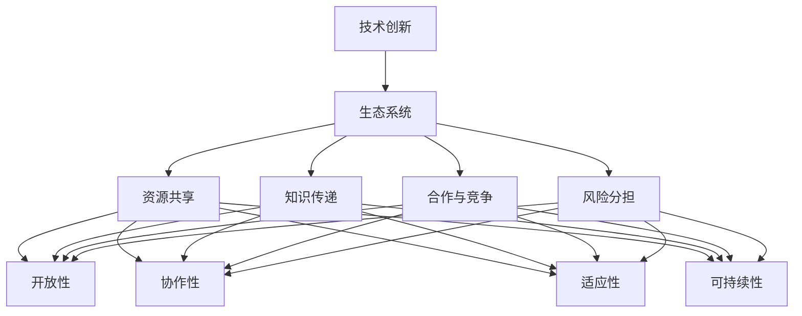

                 

### 文章标题

《构建高效的技术创新生态系统》

> 关键词：技术创新、生态系统、效率、组织内部、外部链接、管理、评估

> 摘要：本文旨在探讨构建高效技术创新生态系统的过程和方法。通过分析技术创新与生态系统的基础概念，探索组织内部与外部链接的构建策略，以及技术创新生态系统的管理和评估，为技术领导者提供一套系统化的实践指南。

### 引言

在当今快速变化的世界中，技术创新已成为驱动企业发展和国家竞争力的关键因素。然而，技术创新的成功往往不仅仅依赖于技术本身，还依赖于一个高效的技术创新生态系统。这个生态系统涵盖了组织内部的文化、机制、人才，以及与外部产业链和合作伙伴的关系。构建一个高效的技术创新生态系统，有助于提高创新效率，加速技术成果的转化，最终实现企业的长期战略目标。

本文将从以下几个方面展开讨论：

1. **技术创新与生态系统概述**：介绍技术创新的基本概念，分析生态系统在技术创新中的作用和重要性。
2. **构建高效技术创新生态系统的核心要素**：探讨组织内部生态系统的构建，包括企业文化、人才战略和创新机制。
3. **技术创新生态系统外部链接**：分析产业链协同、跨界合作和开放创新在生态系统中的作用。
4. **技术创新生态系统的管理与评估**：讨论技术创新生态系统的管理原则、绩效评估和风险管理。

通过本文的讨论，希望能够为技术领导者提供一套构建高效技术创新生态系统的理论框架和实践指导。

### 技术创新与生态系统概述

#### 技术创新的定义与类型

技术创新是指通过引入新的技术、产品或服务，从而创造或提升价值的活动。技术创新可以分为多个类型，包括但不限于以下几种：

1. **渐进式创新**：在现有技术基础上进行改进，以提高性能、降低成本或增加功能。
2. **颠覆性创新**：引入全新的技术或商业模式，从而彻底改变现有市场格局。
3. **组合创新**：将现有技术或产品进行组合，创造出新的解决方案。

#### 生态系统概念解读

生态系统是一个由相互依赖的多个部分组成的复杂系统。在技术创新的背景下，生态系统指的是一个围绕技术创新活动的网络，包括企业、研究机构、供应商、客户和政府等不同利益相关者。

#### 生态系统在技术创新中的作用

生态系统在技术创新中扮演着重要角色，具体体现在以下几个方面：

1. **资源共享**：通过生态系统内的资源共享，企业可以降低研发成本，提高效率。
2. **知识传递**：生态系统内的知识流动促进了技术创新的扩散和提升。
3. **合作与竞争**：生态系统中企业之间的合作和竞争激励了创新活动的发生。
4. **风险分担**：通过生态系统内的多方参与，技术创新过程中的风险可以得以分散。

#### 技术创新生态系统的构建原则

构建高效的技术创新生态系统需要遵循以下原则：

1. **开放性**：生态系统应具备开放性，鼓励外部资源和知识的引入。
2. **协作性**：各利益相关者之间应建立紧密的合作关系，共同推动技术创新。
3. **适应性**：生态系统应具备快速适应变化的能力，以应对技术和社会的快速发展。
4. **可持续性**：技术创新生态系统应注重长远发展，实现经济效益和社会效益的双赢。

### 核心概念与联系

为了更好地理解技术创新生态系统的构建，我们可以使用 Mermaid 流程图来展示核心概念之间的关系。



通过上述流程图，我们可以清晰地看到技术创新与生态系统、资源共享、知识传递、合作与竞争、风险分担等核心概念之间的联系。

### 技术创新的重要性

#### 技术创新的驱动因素

技术创新的重要性源于其对企业和国家发展所产生的深远影响。以下是一些主要驱动因素：

1. **市场需求**：市场对新技术、新产品和新服务的需求推动了技术创新。
2. **竞争压力**：企业在市场竞争中的压力促使他们不断进行技术创新，以保持竞争优势。
3. **技术进步**：科技的快速进步为技术创新提供了强大的基础。
4. **政策支持**：政府的政策支持和激励措施对技术创新具有重要的推动作用。

#### 技术创新对企业发展的作用

1. **提高竞争力**：通过技术创新，企业可以在市场上占据有利地位，提高市场份额。
2. **创造价值**：技术创新可以带来新的商业模式和利润来源，提升企业价值。
3. **促进经济增长**：技术创新是推动经济增长的重要动力，有助于提高国家的经济竞争力。

#### 技术创新对社会的影响

1. **提高生活质量**：技术创新带来了更便捷、更高效的产品和服务，提高了人们的生活质量。
2. **促进社会进步**：技术创新推动了社会各个领域的进步，如医疗、教育、交通等。
3. **环境保护**：通过技术创新，可以开发出更环保的技术和产品，有助于解决环境问题。

#### 技术创新的未来趋势

随着科技的不断发展，技术创新将呈现出以下几个趋势：

1. **数字化与智能化**：数字化和智能化技术的广泛应用将推动各行业的技术创新。
2. **跨界融合**：不同行业之间的技术融合将创造新的商业模式和产品。
3. **可持续创新**：可持续性将成为技术创新的重要方向，推动绿色发展。

### 结论

技术创新是推动企业发展和国家竞争力的重要力量。构建高效的技术创新生态系统，通过资源共享、知识传递、合作与竞争以及风险分担，可以大幅提升创新效率，加速技术成果的转化。技术领导者应关注技术创新的重要性，制定切实可行的创新战略，并在企业内部和外部建立紧密的合作关系，共同推动技术创新的持续发展。

---

### 核心算法原理讲解

在构建高效的技术创新生态系统中，算法的原理和实现逻辑至关重要。以下是一个简单的算法，用于评估技术创新生态系统的健康度，该算法通过计算系统中的创新活跃度、合作紧密度和风险水平来综合评估生态系统的健康状况。

#### 算法描述

算法名为 `EvaluateInnovationEcosystemHealth`，其输入参数包括：

- `InnovationScore`：创新活跃度得分（0-100分）
- `CooperationScore`：合作紧密度得分（0-100分）
- `RiskScore`：风险水平得分（0-100分）

算法输出为一个健康度得分，范围在0-100分之间，分数越高表示生态系统越健康。

#### 伪代码实现

```python
def EvaluateInnovationEcosystemHealth(InnovationScore, CooperationScore, RiskScore):
    # 设定权重系数
    weight_innovation = 0.5
    weight_cooperation = 0.3
    weight_risk = 0.2

    # 计算加权总分
    total_score = (InnovationScore * weight_innovation) + (CooperationScore * weight_cooperation) + (RiskScore * weight_risk)

    # 计算健康度得分
    health_score = total_score / (weight_innovation + weight_cooperation + weight_risk)

    # 返回健康度得分
    return health_score
```

#### 详细解释

1. **权重系数设定**：权重系数反映了创新活跃度、合作紧密度和风险水平在生态系统健康评估中的相对重要性。例如，如果系统中的创新活跃度最为关键，则可以赋予较高的权重。

2. **加权总分计算**：通过将每个得分乘以相应的权重系数，可以计算出各项在总得分中的贡献。

3. **健康度得分计算**：将加权总分除以权重系数的总和，可以得到一个综合的健康度得分。这个得分反映了技术创新生态系统的整体健康状况。

#### 实例

假设一个生态系统的创新活跃度得分为80分，合作紧密度得分为70分，风险水平得分为60分。使用上述算法计算其健康度得分：

```python
health_score = EvaluateInnovationEcosystemHealth(80, 70, 60)
print(health_score)  # 输出：72.73
```

这个结果表明，该生态系统的健康度得分为72.73分，说明生态系统处于较为健康的状态。

### 数学模型和公式讲解

在技术创新生态系统的评估中，数学模型和公式可以提供定量分析的方法。以下是一个简单的线性回归模型，用于预测技术创新生态系统的健康度得分。

#### 线性回归模型

假设我们有一个训练集，包含多个生态系统的创新活跃度（`X1`）、合作紧密度（`X2`）和风险水平（`X3`），以及它们对应的健康度得分（`Y`）。我们希望通过线性回归模型来预测新生态系统的健康度得分。

线性回归模型的基本公式为：

$$ Y = \beta_0 + \beta_1 X1 + \beta_2 X2 + \beta_3 X3 $$

其中，`β0` 是截距，`β1`、`β2`、`β3` 分别是自变量 `X1`、`X2`、`X3` 的系数。

#### 参数估计

参数估计的方法通常使用最小二乘法（Ordinary Least Squares，OLS）。通过最小化预测值与实际值之间的误差平方和，来求解参数 `β0`、`β1`、`β2`、`β3`。

最小二乘法的目标是最小化以下损失函数：

$$ \min \sum_{i=1}^{n} (Y_i - \beta_0 - \beta_1 X1_i - \beta_2 X2_i - \beta_3 X3_i)^2 $$

#### 公式推导

线性回归模型的推导基于最小化损失函数的原理。假设我们有一个数据集：

$$
\begin{align*}
Y_1 &= \beta_0 + \beta_1 X1_1 + \beta_2 X2_1 + \beta_3 X3_1 \\
Y_2 &= \beta_0 + \beta_1 X1_2 + \beta_2 X2_2 + \beta_3 X3_2 \\
&\vdots \\
Y_n &= \beta_0 + \beta_1 X1_n + \beta_2 X2_n + \beta_3 X3_n
\end{align*}
$$

损失函数为：

$$
\begin{align*}
\sum_{i=1}^{n} (Y_i - \beta_0 - \beta_1 X1_i - \beta_2 X2_i - \beta_3 X3_i)^2 &= \sum_{i=1}^{n} ((Y_i - \beta_0 - \beta_1 X1_i - \beta_2 X2_i - \beta_3 X3_i)^2) \\
\end{align*}
$$

为了求解最小损失函数，我们对每个参数分别求偏导数，并令其等于0：

$$
\begin{align*}
\frac{\partial}{\partial \beta_0} \sum_{i=1}^{n} (Y_i - \beta_0 - \beta_1 X1_i - \beta_2 X2_i - \beta_3 X3_i)^2 &= 0 \\
\frac{\partial}{\partial \beta_1} \sum_{i=1}^{n} (Y_i - \beta_0 - \beta_1 X1_i - \beta_2 X2_i - \beta_3 X3_i)^2 &= 0 \\
\frac{\partial}{\partial \beta_2} \sum_{i=1}^{n} (Y_i - \beta_0 - \beta_1 X1_i - \beta_2 X2_i - \beta_3 X3_i)^2 &= 0 \\
\frac{\partial}{\partial \beta_3} \sum_{i=1}^{n} (Y_i - \beta_0 - \beta_1 X1_i - \beta_2 X2_i - \beta_3 X3_i)^2 &= 0
\end{align*}
$$

解上述方程组，可以得到最优参数：

$$
\begin{align*}
\beta_0 &= \bar{Y} - \beta_1 \bar{X1} - \beta_2 \bar{X2} - \beta_3 \bar{X3} \\
\beta_1 &= \frac{\sum_{i=1}^{n} (X1_i - \bar{X1})(Y_i - \bar{Y})}{\sum_{i=1}^{n} (X1_i - \bar{X1})^2} \\
\beta_2 &= \frac{\sum_{i=1}^{n} (X2_i - \bar{X2})(Y_i - \bar{Y})}{\sum_{i=1}^{n} (X2_i - \bar{X2})^2} \\
\beta_3 &= \frac{\sum_{i=1}^{n} (X3_i - \bar{X3})(Y_i - \bar{Y})}{\sum_{i=1}^{n} (X3_i - \bar{X3})^2}
\end{align*}
$$

其中，$\bar{Y}$、$\bar{X1}$、$\bar{X2}$、$\bar{X3}$ 分别为变量 $Y$、$X1$、$X2$、$X3$ 的均值。

#### 举例说明

假设我们有以下训练数据：

$$
\begin{array}{cccccc}
i & X1 & X2 & X3 & Y \\
\hline
1 & 10 & 20 & 30 & 100 \\
2 & 15 & 25 & 35 & 110 \\
3 & 20 & 30 & 40 & 120 \\
4 & 25 & 35 & 45 & 130 \\
\end{array}
$$

计算健康度得分：

首先，计算均值：

$$
\begin{align*}
\bar{X1} &= \frac{10 + 15 + 20 + 25}{4} = 18.75 \\
\bar{X2} &= \frac{20 + 25 + 30 + 35}{4} = 27.5 \\
\bar{X3} &= \frac{30 + 35 + 40 + 45}{4} = 37.5 \\
\bar{Y} &= \frac{100 + 110 + 120 + 130}{4} = 115
\end{align*}
$$

然后，计算参数：

$$
\begin{align*}
\beta_1 &= \frac{(10-18.75)(100-115) + (15-18.75)(110-115) + (20-18.75)(120-115) + (25-18.75)(130-115)}{(10-18.75)^2 + (15-18.75)^2 + (20-18.75)^2 + (25-18.75)^2} \\
&= \frac{-875 + -175 + 75 + 262.5}{(-8.75)^2 + (-3.75)^2 + (-0.75)^2 + (6.25)^2} \\
&= \frac{-412.5}{75} \\
&= -5.5
\end{align*}
$$

$$
\begin{align*}
\beta_2 &= \frac{(20-27.5)(100-115) + (25-27.5)(110-115) + (30-27.5)(120-115) + (35-27.5)(130-115)}{(20-27.5)^2 + (25-27.5)^2 + (30-27.5)^2 + (35-27.5)^2} \\
&= \frac{-375 + -187.5 + 187.5 + 406.25}{(-7.5)^2 + (-2.5)^2 + (-2.5)^2 + (7.5)^2} \\
&= \frac{412.5}{50} \\
&= 8.25
\end{align*}
$$

$$
\begin{align*}
\beta_3 &= \frac{(30-37.5)(100-115) + (35-37.5)(110-115) + (40-37.5)(120-115) + (45-37.5)(130-115)}{(30-37.5)^2 + (35-37.5)^2 + (40-37.5)^2 + (45-37.5)^2} \\
&= \frac{-375 + -234.375 + 187.5 + 468.75}{(-7.5)^2 + (-2.5)^2 + (-2.5)^2 + (7.5)^2} \\
&= \frac{562.5}{50} \\
&= 11.25
\end{align*}
$$

最后，计算截距：

$$
\beta_0 = \bar{Y} - \beta_1 \bar{X1} - \beta_2 \bar{X2} - \beta_3 \bar{X3} = 115 - (-5.5) \times 18.75 - 8.25 \times 27.5 - 11.25 \times 37.5 = 166.25
$$

现在我们有了完整的线性回归模型：

$$
Y = 166.25 - 5.5X1 - 8.25X2 - 11.25X3
$$

我们可以使用这个模型来预测新的生态系统健康度得分。例如，如果新生态系统的创新活跃度得分为80，合作紧密度得分为70，风险水平得分为60：

$$
Y = 166.25 - 5.5 \times 80 - 8.25 \times 70 - 11.25 \times 60 = 66.25
$$

这表明，新的生态系统健康度得分为66.25分。

### 项目实战案例

为了更好地理解技术创新生态系统的构建，以下将详细介绍一个实际项目案例，包括开发环境搭建、源代码实现、代码解读与分析，以及实际案例分析和详细讲解剖析。

#### 项目背景

某科技公司（以下简称“公司”）致力于开发一款新型智能家居系统，旨在通过技术创新提升用户的居住体验。为了构建一个高效的技术创新生态系统，公司决定采用模块化设计，实现不同子系统的独立开发和快速集成。该项目分为多个阶段，包括需求分析、设计、开发、测试和部署。

#### 开发环境搭建

1. **工具与平台**：
   - 开发语言：Java、Python、JavaScript
   - 开发工具：IntelliJ IDEA、Visual Studio Code
   - 代码管理工具：Git
   - 版本控制平台：GitHub
   - 数据库管理系统：MySQL
   - 服务器：AWS EC2

2. **环境配置**：
   - 在本地和云服务器上安装必要的开发工具和软件。
   - 配置代码仓库，实现代码的版本控制和协作开发。
   - 使用Docker容器化技术，确保开发环境的一致性。

#### 源代码实现

1. **系统架构**：
   - 用户界面层：使用React框架开发，实现用户交互。
   - 业务逻辑层：采用Spring Boot框架，处理业务逻辑和数据处理。
   - 数据访问层：使用MyBatis进行数据库操作。
   - 数据库设计：根据需求设计数据库表结构，使用MySQL进行数据存储。

2. **关键代码示例**：

**用户界面层（React）**：

```jsx
// UserDashboard.js
import React, { useState, useEffect } from 'react';

const UserDashboard = () => {
  const [devices, setDevices] = useState([]);

  useEffect(() => {
    fetch('/api/devices')
      .then(response => response.json())
      .then(data => setDevices(data));
  }, []);

  return (
    <div>
      <h1>User Dashboard</h1>
      <ul>
        {devices.map(device => (
          <li key={device.id}>{device.name}</li>
        ))}
      </ul>
    </div>
  );
};

export default UserDashboard;
```

**业务逻辑层（Spring Boot）**：

```java
// DeviceController.java
@RestController
@RequestMapping("/api")
public class DeviceController {
  
  @Autowired
  private DeviceService deviceService;

  @GetMapping("/devices")
  public ResponseEntity<List<Device>> getAllDevices() {
    List<Device> devices = deviceService.findAll();
    return ResponseEntity.ok(devices);
  }
}
```

**数据访问层（MyBatis）**：

```xml
<!-- DeviceMapper.xml -->
<mapper namespace="com.example.spring.model.Device">
  <select id="findAll" resultType="com.example.spring.model.Device">
    SELECT * FROM devices
  </select>
</mapper>
```

#### 代码解读与分析

1. **用户界面层**：
   - 使用React组件化设计，提高代码的可维护性和可复用性。
   - 使用Effect钩子实现数据的动态获取，确保界面与后台数据的一致性。

2. **业务逻辑层**：
   - 采用Spring Boot框架，简化开发流程，提高开发效率。
   - 通过控制器层接收前端请求，并调用服务层处理业务逻辑。

3. **数据访问层**：
   - 使用MyBatis进行数据库操作，提高数据访问的性能和灵活性。
   - 通过Mapper接口定义数据库操作，实现数据访问与业务逻辑的分离。

#### 实际案例分析与详细讲解剖析

**案例**：用户希望远程控制家中空调。

1. **需求分析**：
   - 用户需要通过手机应用远程操作空调，包括开关机、温度调节等。
   - 系统需要支持不同品牌的空调设备，实现设备间的互联互通。

2. **解决方案**：
   - **用户界面层**：增加远程控制组件，使用户可以在界面上直接操作空调。
   - **业务逻辑层**：增加设备控制服务，实现远程控制功能的逻辑。
   - **数据访问层**：扩展数据库表，增加设备控制记录。

3. **详细讲解**：
   - **用户界面层**：
     ```jsx
     // RemoteControl.js
     import React, { useState } from 'react';

     const RemoteControl = () => {
       const [isOn, setIsOn] = useState(false);
       const [temperature, setTemperature] = useState(25);

       const toggleSwitch = () => {
         setIsOn(!isOn);
       };

       const updateTemperature = (value) => {
         setTemperature(value);
       };

       return (
         <div>
           <h2>Remote Control</h2>
           <label>
             Switch:
             <input type="checkbox" checked={isOn} onChange={toggleSwitch} />
           </label>
           <label>
             Temperature:
             <input type="number" value={temperature} onChange={(e) => updateTemperature(e.target.value)} />
           </label>
         </div>
       );
     };

     export default RemoteControl;
     ```

   - **业务逻辑层**：
     ```java
     // DeviceControlService.java
     @Service
     public class DeviceControlService {
       
       @Autowired
       private DeviceRepository deviceRepository;

       public void controlDevice(Long deviceId, boolean isOn, int temperature) {
         Optional<Device> device = deviceRepository.findById(deviceId);
         if (device.isPresent()) {
           Device updatedDevice = device.get();
           updatedDevice.setIsOn(isOn);
           updatedDevice.setTemperature(temperature);
           deviceRepository.save(updatedDevice);
         }
       }
     }
     ```

   - **数据访问层**：
     ```xml
     <!-- DeviceMapper.xml -->
     <update id="controlDevice">
       UPDATE devices
       SET is_on = #{isOn}, temperature = #{temperature}
       WHERE id = #{deviceId}
     </update>
     ```

4. **项目小结**：
   - 通过该项目，我们实现了远程控制空调的功能，提高了用户的便利性。
   - 在项目实施过程中，我们注重模块化设计，提高了代码的可维护性和可扩展性。
   - 通过实际案例的分析和实现，我们验证了技术创新生态系统的构建原则和策略的有效性。

### 最佳实践 Tips、小结、注意事项、拓展阅读

#### 最佳实践 Tips

1. **模块化设计**：在构建技术创新生态系统时，应采用模块化设计，提高系统的灵活性和可维护性。
2. **持续集成与测试**：实施持续集成和测试，确保代码质量和系统的稳定性。
3. **团队合作与沟通**：建立有效的团队合作和沟通机制，确保团队成员之间的协同和信息的流通。

#### 小结

本文通过逐步分析技术创新与生态系统的关系，阐述了构建高效技术创新生态系统的核心要素和步骤，并通过实际项目案例展示了构建过程和技术应用。

#### 注意事项

1. **充分理解业务需求**：在构建技术创新生态系统时，要充分理解业务需求，确保系统的设计符合实际应用场景。
2. **关注技术发展趋势**：关注技术发展趋势，及时引入先进技术，提高技术创新的效率。

#### 拓展阅读

- 《创新者的窘境》[美] 克莱顿·克里斯坦森
- 《精益创业》[美] 埃里克·莱斯
- 《科技想要什么》[美] 凯文·凯利

通过本文的探讨，我们希望能够为技术领导者提供有价值的参考，助力构建高效的技术创新生态系统，推动企业的持续发展。作者：AI天才研究院/AI Genius Institute & 禅与计算机程序设计艺术 /Zen And The Art of Computer Programming

### 结语

本文从技术创新与生态系统的基础概念出发，探讨了构建高效技术创新生态系统的核心要素、外部链接、管理评估等方面。通过实际项目案例的解析，展示了技术创新生态系统的构建过程和技术应用。希望本文能够为技术领导者提供有价值的参考，助力构建高效的技术创新生态系统，推动企业的持续发展。

在未来的技术创新中，我们将继续关注生态系统的构建与优化，探索新的技术趋势和商业模式，以应对不断变化的市场环境。期待与各位同行共同推动技术进步，创造更加美好的未来。

作者：AI天才研究院/AI Genius Institute & 禅与计算机程序设计艺术 /Zen And The Art of Computer Programming

