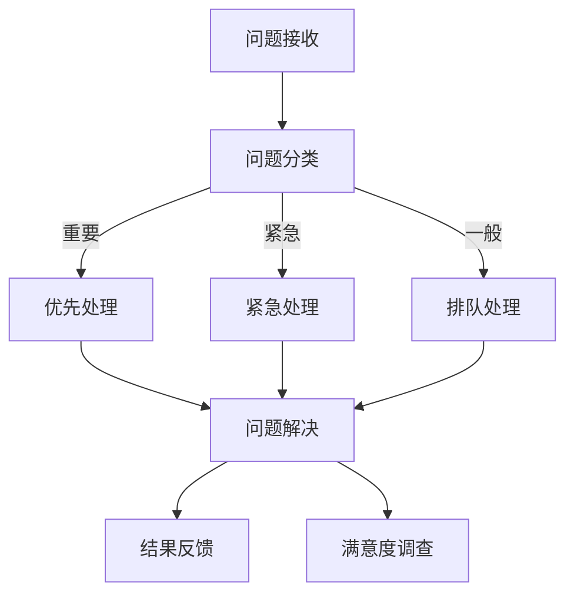

                 

### 引言

在当今信息技术迅猛发展的时代，技术支持已成为企业运营中不可或缺的一环。高效的技术支持体系不仅能够提升客户满意度，还能增强企业的竞争力。然而，随着企业规模的扩大和产品复杂性的增加，如何构建一个高效的技术支持体系成为许多企业面临的挑战。

#### 1.1 背景介绍

**技术支持的重要性：**

技术支持是指在产品或服务交付后，为解决客户在使用过程中遇到的技术问题而提供的一系列服务。它不仅包括故障排除，还涵盖了产品使用培训、维护升级等环节。在现代企业中，技术支持的重要性体现在以下几个方面：

1. **提升客户满意度：** 快速响应客户问题，解决客户困惑，能显著提高客户对企业的满意度。
2. **降低运营成本：** 通过高效的技术支持，可以减少客户因问题未能及时解决而造成的损失，从而降低企业的运营成本。
3. **增强企业竞争力：** 高质量的技术支持体系能够帮助企业树立良好的品牌形象，增强市场竞争力。

**企业面临的挑战：**

随着信息技术的发展，企业面临的技术挑战日益增多。具体体现在以下几个方面：

1. **产品复杂性增加：** 现代产品往往功能丰富、架构复杂，对技术支持的要求更高。
2. **客户需求多样化：** 企业需要满足不同客户群体的需求，提供定制化的技术支持服务。
3. **市场竞争加剧：** 竞争对手的技术支持水平不断提升，企业需要不断提高自身的技术支持能力，以保持竞争优势。

#### 1.2 书籍目的

本书旨在探讨如何构建高效的技术支持体系，具体目标如下：

1. **核心要素解析：** 深入分析高效技术支持体系所需的核心要素，如团队建设、流程优化、服务质量提升等。
2. **实践方法分享：** 通过实际案例分享，提供构建高效技术支持体系的实践方法。
3. **管理策略探讨：** 探讨如何通过有效的管理策略，提升技术支持团队的效率和质量。

通过本书的阅读，读者将能够系统地了解构建高效技术支持体系的思路和方法，为企业的技术支持工作提供有力的指导。

### 技术支持体系概述

技术支持体系是企业为客户提供技术保障的完整框架，它涵盖了从问题识别到问题解决的一系列流程和资源。一个高效的技术支持体系不仅能够快速响应客户需求，解决客户问题，还能提高客户满意度，降低运营成本。

#### 2.1 技术支持的定义

**技术支持的范围：**

技术支持的范围通常包括以下几个方面：

1. **故障排除：** 解决产品或服务在使用过程中出现的故障问题。
2. **使用培训：** 为客户提供产品或服务的使用培训，帮助客户正确、高效地使用产品。
3. **维护升级：** 提供产品的定期维护和升级服务，确保产品持续稳定运行。
4. **技术咨询：** 为客户提供技术咨询服务，帮助客户解决技术难题。

**技术支持的目标：**

技术支持的目标主要包括以下几个方面：

1. **快速响应：** 在客户提出问题后，能够快速响应并提供解决方案。
2. **问题解决：** 通过有效的技术手段，解决客户遇到的问题。
3. **客户满意度：** 提高客户对技术支持的满意度，增强客户对企业的信任。
4. **降低成本：** 通过高效的故障排除和维护服务，降低客户的运营成本。

#### 2.2 技术支持体系结构

**组织结构设计：**

技术支持体系的组织结构通常包括以下几个层级：

1. **技术支持工程师：** 直接面对客户，解决客户的技术问题。
2. **技术经理：** 负责技术支持团队的管理和协调工作。
3. **客户支持专家：** 提供高端技术支持和咨询服务。

**服务流程概述：**

技术支持体系的服务流程主要包括以下几个环节：

1. **问题接收：** 客户通过电话、邮件、在线支持等渠道提出问题。
2. **问题分类：** 根据问题的性质和严重程度，对问题进行分类。
3. **问题解决：** 技术支持工程师根据问题类型，采取相应的解决措施。
4. **结果反馈：** 将问题解决情况反馈给客户，并进行满意度调查。

#### 2.3 技术支持的类型

**前端支持：**

前端支持通常包括在线支持、电话支持、邮件支持等形式，直接面对客户，解决客户在产品使用过程中遇到的问题。

**后端支持：**

后端支持通常由技术团队负责，包括故障排查、系统升级、软件修复等，确保产品的正常运行。

**现场支持：**

现场支持是指技术支持工程师直接到客户现场，进行设备调试、故障处理等服务。

通过上述对技术支持体系的概述，我们可以看到，技术支持体系不仅是一个解决问题的工具，更是企业与客户之间沟通的桥梁。一个高效的技术支持体系，能够显著提升企业的服务质量和客户满意度，为企业的长期发展奠定坚实的基础。

### 技术支持团队建设

构建一个高效的技术支持团队是企业实现优质客户服务的关键。一个优秀的技术支持团队不仅需要具备专业技能，还需要良好的管理机制和文化氛围。以下是技术支持团队建设的关键要素：

#### 3.1 团队成员的角色与职责

**技术支持工程师：**

技术支持工程师是技术支持团队的核心成员，主要职责包括：

1. **处理客户咨询：** 快速响应客户的问题，并提供专业的解决方案。
2. **解决技术问题：** 对客户遇到的技术问题进行排查和解决。
3. **编写技术文档：** 撰写详细的解决方案文档，供其他团队成员和客户参考。
4. **参与项目支持：** 在项目实施过程中，提供技术支持，确保项目顺利进行。

**技术经理：**

技术经理负责技术支持团队的管理和协调工作，主要职责包括：

1. **团队管理：** 制定团队目标和计划，确保团队成员的工作效率。
2. **资源调配：** 合理配置团队资源，确保项目和支持任务的顺利完成。
3. **绩效评估：** 对团队成员的工作绩效进行评估，并提供反馈和培训。
4. **技术支持策略：** 制定技术支持策略，指导团队工作方向。

**客户支持专家：**

客户支持专家通常负责高级技术支持和咨询服务，主要职责包括：

1. **高级技术支持：** 解决复杂的技术问题，提供高端的技术咨询服务。
2. **客户需求分析：** 深入分析客户需求，提供定制化的技术支持方案。
3. **客户关系维护：** 维护良好的客户关系，增强客户对企业的信任。
4. **市场调研：** 收集市场信息，为产品和技术支持策略提供依据。

#### 3.2 技术支持团队管理

**团队文化建设：**

团队文化建设是技术支持团队管理的重要组成部分。一个积极向上、协同合作的团队文化，能够提高团队成员的凝聚力和工作效率。具体措施包括：

1. **团队价值观：** 明确团队的价值观，确保团队成员共同追求目标。
2. **团队活动：** 定期组织团队建设活动，增强团队成员的归属感。
3. **沟通机制：** 建立有效的沟通机制，促进团队成员之间的信息共享和协作。
4. **激励机制：** 制定激励机制，鼓励团队成员积极参与团队活动和工作。

**激励机制：**

有效的激励机制能够激励团队成员的工作热情和积极性。具体措施包括：

1. **绩效奖励：** 根据团队成员的工作绩效，给予相应的奖励。
2. **晋升机会：** 为团队成员提供晋升机会，激励其不断提升专业技能。
3. **培训机会：** 提供培训机会，帮助团队成员提升个人能力和职业素养。
4. **员工福利：** 提供良好的员工福利，增强团队成员的归属感。

**人员招聘与培训：**

**选拔标准：**

在招聘技术支持团队成员时，应严格选拔，确保团队成员具备以下素质：

1. **专业能力：** 具备相关领域的专业技能和知识。
2. **沟通能力：** 具备良好的沟通能力和团队合作精神。
3. **学习能力：** 具备快速学习和适应新知识的能力。
4. **解决问题的能力：** 具备独立分析和解决问题的能力。

**培训计划：**

为了确保团队成员的专业能力和服务水平，应制定系统的培训计划，包括以下内容：

1. **专业技能培训：** 定期组织专业技能培训，帮助团队成员提升专业技能。
2. **服务意识培训：** 加强服务意识培训，提高团队成员的服务质量和客户满意度。
3. **团队协作培训：** 通过团队协作培训，增强团队成员之间的合作精神和协作能力。
4. **应急处理培训：** 开展应急处理培训，提高团队成员的应急处理能力。

通过上述措施，企业可以构建一支高效、专业的技术支持团队，为企业的发展提供强有力的技术支持。

### 技术支持流程优化

技术支持流程的优化是提高团队工作效率和服务质量的重要手段。优化技术支持流程不仅可以减少客户等待时间，提高问题解决效率，还能降低企业的运营成本。以下是技术支持流程优化的关键步骤和策略。

#### 4.1 问题分类与优先级

**问题分类方法：**

问题分类是技术支持流程中的第一步，合理的分类有助于快速识别问题的性质，从而采取相应的解决措施。问题分类的方法包括：

1. **按问题类型分类：** 将问题分为故障类、使用问题类、性能优化类等，便于针对性的处理。
2. **按客户行业分类：** 根据客户所属行业的特点，对问题进行分类，以便于提供行业特定的解决方案。
3. **按紧急程度分类：** 将问题分为紧急、重要、一般等优先级，确保重要和紧急问题优先解决。

**优先级排序策略：**

在问题分类的基础上，需要根据问题的紧急程度和影响范围对问题进行优先级排序。常见的排序策略包括：

1. **紧急程度优先：** 对于可能对业务造成重大影响的紧急问题，应优先解决。
2. **影响范围优先：** 对于影响范围广、涉及客户多的问题，应优先处理。
3. **客户满意度优先：** 对于客户反馈强烈、满意度低的问题，应优先解决，以提高客户满意度。

#### 4.2 工作流程设计

**流程优化原则：**

为了提高技术支持流程的效率，需遵循以下原则进行工作流程设计：

1. **简化流程：** 减少不必要的环节，简化流程步骤，缩短问题解决时间。
2. **标准化流程：** 制定标准化的操作流程，确保每个步骤都符合规范，减少错误和重复工作。
3. **透明化流程：** 使流程透明化，客户和团队成员都能清楚了解每个环节的进展情况。
4. **灵活应变：** 设计流程时需考虑特殊情况，确保流程具有一定的灵活性，能够应对突发事件。

**工作流程图：**

以下是一个典型的工作流程图：

#### 4.3 工具与技术

**自动化工具：**

自动化工具在技术支持流程中发挥着重要作用，可以显著提高工作效率。常见的自动化工具包括：

1. **工单系统：** 自动化工单管理系统，用于记录和管理客户问题的处理过程。
2. **聊天机器人：** 自动化聊天机器人，用于解答常见问题和引导用户自助解决问题。
3. **自动故障检测工具：** 自动化故障检测工具，用于实时监控系统状态，快速发现并报告问题。

**智能客服系统：**

智能客服系统结合人工智能技术，能够提供24/7的全天候客户支持。智能客服系统的主要功能包括：

1. **自然语言处理：** 通过自然语言处理技术，理解客户的问题和需求。
2. **智能推荐：** 根据客户的问题历史和偏好，提供智能化的解决方案推荐。
3. **自主学习：** 通过机器学习算法，不断优化客户服务质量。

通过上述工具和技术的应用，企业可以显著提升技术支持流程的效率和质量，为客户提供更加高效和满意的服务。

### 技术支持服务质量提升

提升技术支持服务质量是确保客户满意度和忠诚度的关键。以下从客户满意度评估、响应速度优化以及技术支持服务质量评估三个方面，探讨如何提升技术支持服务质量。

#### 5.1 客户满意度评估

**满意度调查方法：**

客户满意度评估主要通过满意度调查进行。满意度调查可以采用以下方法：

1. **问卷调查：** 通过在线或离线问卷，收集客户对技术支持的满意度评分。
2. **电话访谈：** 通过电话访谈，深入了解客户对技术支持的感受和体验。
3. **在线反馈：** 在技术支持平台提供在线反馈功能，方便客户随时提交意见和建议。

**满意度分析：**

满意度分析需要对收集到的数据进行分析，以了解客户对技术支持的整体满意度。具体分析内容包括：

1. **总体满意度：** 计算客户满意度得分，评估整体满意度水平。
2. **细分满意度：** 根据客户群体、产品类型等细分维度，分析不同群体的满意度差异。
3. **问题根源分析：** 分析导致客户不满意的具体原因，如响应速度、解决方案质量等。

#### 5.2 响应速度优化

**响应时间目标：**

响应速度是技术支持服务质量的重要指标。为了提高响应速度，企业应制定明确的响应时间目标，如：

1. **首次响应时间：** 在客户提出问题后的1小时内给予首次响应。
2. **问题解决时间：** 对于一般问题，在24小时内解决；对于紧急问题，在4小时内解决。

**紧急问题处理流程：**

紧急问题处理流程需要快速响应，确保问题得到及时解决。具体流程包括：

1. **问题识别：** 快速识别紧急问题，确保问题得到优先处理。
2. **资源调配：** 调配资深技术支持工程师或技术专家，优先解决紧急问题。
3. **实时沟通：** 与客户保持实时沟通，确保客户了解问题处理进度。
4. **及时反馈：** 在问题解决后，及时向客户反馈解决方案和后续注意事项。

#### 5.3 技术支持服务质量评估

**服务质量标准：**

服务质量评估需要制定具体的服务质量标准，以确保技术支持服务的质量。服务质量标准包括：

1. **问题解决率：** 问题解决率是衡量服务质量的关键指标，目标值应不低于90%。
2. **客户满意度：** 客户满意度应不低于80%，通过定期满意度调查进行评估。
3. **首次解决率：** 首次解决率目标应不低于70%，即客户在首次接触时就能解决其问题。
4. **响应时间：** 响应时间应满足企业设定的响应时间目标。

**评估指标体系：**

为了全面评估技术支持服务质量，企业应建立完善的评估指标体系，包括：

1. **过程指标：** 包括首次响应时间、问题解决时间、问题解决率等。
2. **结果指标：** 包括客户满意度、客户流失率等。
3. **改进指标：** 包括服务改进计划、改进措施执行情况等。

通过上述措施，企业可以全面评估技术支持服务质量，持续优化服务质量，提升客户满意度和忠诚度。

### 技术支持体系与IT基础设施的整合

在当今信息技术高速发展的背景下，技术支持体系与IT基础设施的整合已成为企业提升运营效率和客户满意度的关键环节。有效的整合不仅可以优化资源利用，提高服务响应速度，还能为企业提供强大的数据支持，从而实现技术支持服务的持续改进。

#### 6.1 IT基础设施概述

**硬件基础设施：**

硬件基础设施是技术支持体系的基础，包括服务器、存储设备、网络设备、计算机终端等。硬件基础设施的稳定性和性能直接影响技术支持服务的质量。因此，企业需要选择高质量、高性能的硬件设备，并确保其可靠性和安全性。

**软件基础设施：**

软件基础设施包括操作系统、数据库、中间件、安全管理软件等。软件基础设施的完善和稳定是技术支持体系高效运行的重要保障。企业应根据业务需求和实际情况，选择合适的软件产品，并定期进行更新和维护，以确保系统的安全性和稳定性。

#### 6.2 技术支持与IT基础设施的整合

**数据整合：**

数据整合是将技术支持过程中的各类数据汇集到一个统一的平台中，以便于分析和利用。数据整合的关键步骤包括：

1. **数据收集：** 通过技术支持系统、工单系统、客户关系管理系统等，收集技术支持过程中的各类数据。
2. **数据存储：** 采用数据库技术，将收集到的数据进行存储和管理，确保数据的完整性和安全性。
3. **数据分析：** 利用数据分析工具，对数据进行处理和分析，提取有价值的信息，为技术支持决策提供支持。

**服务整合：**

服务整合是将技术支持服务与IT基础设施中的各项服务有机结合，形成一体化的服务支持体系。服务整合的关键步骤包括：

1. **服务目录：** 制定详细的服务目录，明确技术支持服务的内容、范围和流程。
2. **服务接口：** 构建服务接口，实现技术支持系统与IT基础设施之间的数据交换和协同工作。
3. **服务监控：** 通过服务监控工具，实时监控技术支持服务的运行状态，确保服务的稳定性和可靠性。

#### 6.3 云计算与大数据的应用

**云计算的应用：**

云计算为技术支持体系提供了灵活的计算资源和存储空间，能够显著提高技术支持服务的效率。云计算的应用包括：

1. **计算资源调度：** 通过云计算平台，实现计算资源的动态调度，根据需求自动扩展或缩减资源。
2. **远程支持：** 利用云计算技术，实现远程技术支持，降低客户现场支持的成本和时间。
3. **弹性扩展：** 根据业务需求，实现技术支持服务的弹性扩展，确保服务的稳定性和可靠性。

**大数据的应用：**

大数据技术在技术支持体系中的应用，能够帮助企业更好地理解和满足客户需求，提高服务质量。大数据的应用包括：

1. **客户行为分析：** 通过大数据分析，了解客户的行为习惯和需求，提供个性化的技术支持服务。
2. **故障预测：** 利用大数据技术，对系统故障进行预测，提前采取预防措施，减少故障发生。
3. **智能客服：** 通过大数据和人工智能技术，构建智能客服系统，提供24/7的全天候客户支持。

通过云计算和大数据的应用，企业可以实现技术支持体系的智能化和自动化，提升服务效率和客户满意度，为企业的长期发展奠定坚实的基础。

### 技术支持体系的安全与合规性

在技术支持体系中，安全与合规性是确保数据保护和隐私保护的关键要素。随着数据隐私保护法律法规的日益严格，企业需要采取有效的安全措施，以防范潜在的安全风险，并确保合规性。

#### 7.1 安全风险识别

**信息安全：**

信息安全是技术支持体系中的首要任务。企业需要识别以下安全风险：

1. **数据泄露：** 确保客户数据在传输和存储过程中不被未经授权的人员访问。
2. **恶意攻击：** 防范网络攻击，如DDoS攻击、SQL注入等，确保系统的稳定运行。
3. **内部威胁：** 识别和防范内部员工的恶意行为，如数据篡改、泄露等。

**操作安全：**

操作安全是指保护技术支持过程中的安全操作，防止因操作不当导致的数据丢失或系统故障。操作安全包括：

1. **访问控制：** 限制对敏感数据和系统的访问权限，确保只有授权人员才能访问。
2. **操作审计：** 记录技术支持过程中的所有操作，以便在发生问题时进行审计和追踪。
3. **备份与恢复：** 定期备份系统数据和客户数据，确保在发生故障时能够快速恢复。

#### 7.2 合规性要求

**相关法律法规：**

企业需要遵守的相关法律法规包括但不限于：

1. **数据保护法：** 如《通用数据保护条例》（GDPR）和《加州消费者隐私法》（CCPA），要求企业在处理个人数据时，确保数据的收集、存储、处理和传输符合法规要求。
2. **网络安全法：** 确保企业的网络安全措施符合法律法规的要求，防范网络攻击和数据泄露。
3. **行业特定法规：** 根据企业所在行业的特点，遵守相关的行业特定法规，如金融行业的《反洗钱法》等。

**合规性评估：**

合规性评估是确保企业技术支持体系符合法规要求的重要步骤。具体评估内容包括：

1. **合规性检查：** 定期对技术支持系统进行合规性检查，确保系统设置和操作符合法律法规的要求。
2. **风险评估：** 对潜在的安全风险和合规性风险进行评估，制定相应的风险管理措施。
3. **员工培训：** 对技术支持团队进行合规性培训，确保团队成员了解相关法律法规，并能够遵守合规要求。

#### 7.3 安全与合规性措施

**数据保护：**

数据保护措施包括：

1. **加密技术：** 对传输中的数据进行加密，确保数据在传输过程中不被窃取或篡改。
2. **访问控制：** 实施严格的访问控制策略，确保只有授权人员才能访问敏感数据和系统。
3. **数据备份：** 定期备份客户数据，确保在发生数据丢失或系统故障时，能够快速恢复数据。

**访问控制：**

访问控制措施包括：

1. **身份验证：** 对访问系统的人员进行身份验证，确保只有授权人员才能访问系统。
2. **权限管理：** 根据员工的角色和职责，分配相应的访问权限，确保权限最小化原则。
3. **操作审计：** 记录所有系统操作，确保在发生问题时，能够追溯操作记录。

通过上述安全与合规性措施，企业可以有效地保护客户数据的安全和隐私，确保技术支持体系的稳定运行和合规性。

### 成功案例分享与经验总结

在构建高效技术支持体系的过程中，许多企业已经取得了显著的成功。以下是两个成功案例的分享及经验总结。

#### 8.1 成功案例分析

**案例一：某大型企业技术支持体系建设**

**背景：**

某大型企业（以下简称A企业）在业务迅速扩展的过程中，面临着技术支持体系不足的问题。客户数量激增，技术问题复杂多样，原有的技术支持体系无法满足需求，导致客户满意度下降。

**解决方案：**

1. **团队建设：** A企业组建了一支由资深技术支持工程师和技术专家组成的团队，确保团队能够快速响应和解决客户问题。
2. **流程优化：** A企业对技术支持流程进行了全面优化，包括问题分类、优先级排序、工作流程设计等，确保问题得到及时、有效的解决。
3. **工具应用：** 引入了智能客服系统和自动化工单管理系统，提高了问题处理的效率和准确性。

**效果：**

经过优化，A企业的技术支持体系得到了显著提升，客户满意度提高了30%，问题解决时间缩短了50%。

**案例二：某中小企业技术支持体系优化**

**背景：**

某中小企业（以下简称B企业）由于资源有限，原有的技术支持体系效率低下，客户反馈问题处理不及时，影响到了企业的市场声誉。

**解决方案：**

1. **云计算应用：** B企业将技术支持系统迁移到了云计算平台，实现了计算资源和存储空间的弹性扩展，提高了系统的稳定性和可靠性。
2. **数据整合：** B企业通过数据整合，将客户数据和技术支持过程中的各类数据汇集到一个统一的平台上，实现了数据的全面分析和利用。
3. **培训与文化建设：** B企业对技术支持团队进行了系统培训，提升了团队的专业技能和服务意识，并建立了积极向上的团队文化。

**效果：**

B企业的技术支持体系得到了显著优化，客户满意度提高了20%，问题解决效率提高了40%。

#### 8.2 经验总结

**成功要素：**

1. **团队建设：** 建立专业、高效的技术支持团队，确保团队能够快速响应和解决客户问题。
2. **流程优化：** 优化技术支持流程，确保问题得到及时、有效的解决。
3. **工具应用：** 应用自动化工具和智能客服系统，提高问题处理的效率和准确性。
4. **数据整合：** 通过数据整合，实现数据的全面分析和利用，为技术支持决策提供支持。
5. **培训与文化建设：** 提升团队成员的专业技能和服务意识，建立积极向上的团队文化。

**挑战与解决方案：**

1. **挑战：** 技术支持团队在快速扩展过程中，可能会面临人员不足、技能不足等问题。
   **解决方案：** 通过外部招聘和内部培训，充实技术支持团队，并建立学习机制，不断提升团队的专业水平。

2. **挑战：** 技术支持流程可能因企业规模和产品复杂性的增加而变得繁琐。
   **解决方案：** 通过流程优化和自动化工具的应用，简化流程步骤，提高问题处理效率。

3. **挑战：** 数据整合和处理可能面临技术难题和数据安全风险。
   **解决方案：** 采用成熟的技术和数据安全措施，确保数据整合的顺利进行和安全性。

通过上述成功案例和经验总结，企业可以借鉴这些实践，构建和优化自身的技术支持体系，提高客户满意度和市场竞争力。

### 未来发展趋势与展望

随着信息技术的不断进步，技术支持领域也迎来了新的发展机遇和挑战。未来，技术支持体系将朝着更加智能化、自动化和个性化的方向迈进。

#### 9.1 技术支持领域的发展趋势

**自动化与智能化：**

1. **自动化工具的应用：** 自动化工具将成为技术支持体系的重要组成部分，通过自动化脚本、智能客服系统和机器人流程自动化（RPA），提高问题处理的效率和准确性。
2. **人工智能（AI）的融合：** AI技术将在技术支持领域发挥更大作用，如通过自然语言处理（NLP）和机器学习（ML）算法，实现智能问答、故障预测和自动化问题解决。

**远程支持与云服务：**

1. **远程支持的发展：** 远程支持技术将进一步成熟，通过远程桌面连接、远程调试等技术，实现实时、高效的技术支持。
2. **云服务的普及：** 企业将更多地采用云计算服务，实现技术支持服务的弹性扩展和高效管理。

**客户体验优化：**

1. **个性化服务：** 技术支持体系将更加注重客户体验，通过大数据分析和个性化推荐，为客户提供定制化的服务。
2. **全渠道支持：** 技术支持将覆盖多个渠道，如电话、邮件、在线聊天和社交媒体，确保客户能够方便地获取支持。

#### 9.2 未来展望

**创新方向：**

1. **AI在技术支持中的应用：** AI技术将在技术支持领域得到更广泛的应用，如智能客服、自动化故障诊断和预测等。
2. **区块链技术的融合：** 区块链技术可以在技术支持中实现数据的可信传输和存储，提高数据的安全性和透明度。

**持续改进与适应变化：**

1. **持续改进：** 企业需要建立持续改进机制，不断优化技术支持流程和服务质量。
2. **适应变化：** 技术支持团队需要具备快速适应新技术和新需求的能力，以应对快速变化的市场环境。

未来，技术支持体系将不断创新和优化，为企业提供更加高效、智能和个性化的服务，从而增强企业的竞争力，满足客户不断变化的需求。

### 附录

#### 附录 A：技术支持工具推荐

**常用技术支持工具：**

1. **工单系统：** 如ServiceNow、Freshservice等，用于管理客户问题和任务。
2. **智能客服系统：** 如Zendesk Chat、Freshdesk等，提供在线聊天支持和自动化问答。
3. **远程支持工具：** 如AnyDesk、TeamViewer等，用于远程连接和诊断问题。
4. **监控工具：** 如Nagios、Zabbix等，用于监控系统性能和故障预警。

**评估与选择标准：**

1. **功能需求：** 根据企业的具体需求，评估工具的功能是否全面。
2. **用户体验：** 考虑工具的用户界面是否友好，操作是否简便。
3. **性能和稳定性：** 评估工具的处理能力和系统的稳定性。
4. **成本效益：** 分析工具的成本效益，确保性价比高。
5. **客户反馈：** 参考其他用户的评价和反馈，了解工具的实际表现。

#### 附录 B：技术支持体系参考资料

**相关书籍与论文：**

1. 《服务管理：设计与实施》（Service Management: Design and Implementation），作者：John Spadafore。
2. 《客户服务管理》（Customer Service Management），作者：John Stokdyk。
3. 《人工智能：一种现代方法》（Artificial Intelligence: A Modern Approach），作者：Peter Norvig。

**行业报告与指南：**

1. 《Gartner技术支持报告》：Gartner发布的关于技术支持领域的年度报告。
2. 《ITIL指南》：IT基础架构库（ITIL）中的服务管理部分，提供详细的服务管理指导。
3. 《ISO/IEC 20000标准》：国际标准化组织发布的IT服务管理标准，为技术支持提供质量和管理框架。

通过以上参考资料，读者可以进一步了解技术支持体系的构建和管理方法，为实际工作提供理论支持和实践指导。作者：AI天才研究院/AI Genius Institute & 禅与计算机程序设计艺术 /Zen And The Art of Computer Programming。

