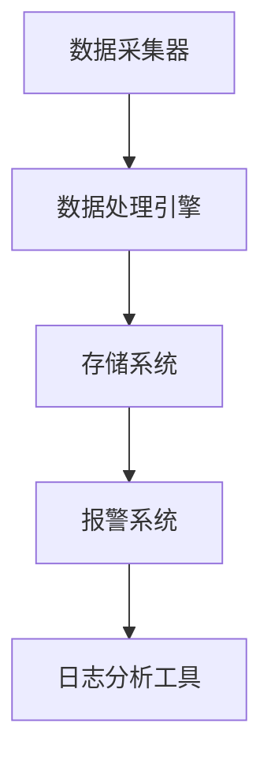

                 

# 文章标题：构建高效的日志监控系统

> 关键词：日志监控、系统架构、数据采集、数据处理、监控报警、日志分析

> 摘要：本文将深入探讨构建高效的日志监控系统的各个方面，从设计思路、核心内容到具体的实现和优化策略，提供全方位的技术指导，帮助读者构建出具备高可用性、高扩展性和易维护性的日志监控系统。

----------------------------------------------------------------

## 引言

在信息技术高速发展的时代，日志监控系统已经成为企业信息化建设中的重要组成部分。一个高效的日志监控系统不仅能够帮助企业快速发现和解决问题，还能够为后续的数据分析提供重要依据。本文将系统地介绍如何构建一个高效的日志监控系统，包括系统架构设计、数据采集、数据处理、监控报警、日志分析以及运维和优化等方面。

### 核心概念与联系

日志监控系统（Log Monitoring System）是指用于实时监控和记录系统、应用程序及服务运行过程中产生的日志信息的系统。它包括以下几个核心组件：

1. **数据采集器**：负责从各个系统中收集日志数据。
2. **数据处理引擎**：对采集到的日志数据进行处理，如过滤、清洗、转换等。
3. **存储系统**：用于存储和处理后的日志数据。
4. **报警系统**：当系统出现异常或达到预设条件时，触发报警。
5. **日志分析工具**：对日志数据进行分析，以提供业务洞察。

下图展示了日志监控系统的基本架构及其组件之间的联系：



### 核心算法原理讲解

日志监控系统的核心在于如何高效地采集、处理和分析日志数据。以下是一些核心算法原理的讲解：

1. **日志聚合**：将分散的日志数据汇总到一起，可以使用聚合框架如Logstash或Fluentd。
   ```python
   def aggregate_logs(logs):
       result = []
       for log in logs:
           if log['type'] == 'error':
               result.append(log)
       return result
   ```

2. **日志过滤**：根据特定的条件过滤日志数据，例如过滤出包含特定关键字的日志。
   ```python
   def filter_logs(logs, keyword):
       filtered_logs = []
       for log in logs:
           if keyword in log['message']:
               filtered_logs.append(log)
       return filtered_logs
   ```

3. **日志分析**：对日志数据进行分析，以发现潜在问题和趋势。可以使用机器学习算法来识别异常模式。
   ```python
   def analyze_logs(logs):
       # 假设使用朴素贝叶斯分类器进行异常检测
       classifier = NaiveBayesClassifier()
       classifier.train(logs)
       anomalies = classifier.predict(logs)
       return anomalies
   ```

### 数学模型和公式

日志监控系统中的一些关键指标可以通过数学模型来描述，如日志速率、错误率、报警触发条件等。

- **日志速率**（Logs Per Second, LPS）：
  $$ LPS = \frac{Total \ Logs}{Time \ in \ Seconds} $$

- **错误率**（Error Rate）：
  $$ Error \ Rate = \frac{Error \ Logs}{Total \ Logs} \times 100\% $$

- **报警触发条件**：
  $$ Trigger \ Condition = Threshold \times Error \ Rate $$

其中，Threshold 为预设的阈值，通常根据业务需求和历史数据来确定。

### 项目实战

以下是构建日志监控系统的一个简单项目实战。

#### 开发环境搭建

1. **安装Linux服务器**：选择一个合适的Linux发行版，如CentOS或Ubuntu。
2. **安装日志采集工具**：例如，使用`rsyslog`来收集系统日志。

   ```shell
   sudo yum install rsyslog
   ```

3. **配置日志收集规则**：编辑`/etc/rsyslog.conf`文件，添加如下规则以收集应用程序日志：

   ```conf
   local7.*   /var/log/app.log
   ```

4. **安装日志处理工具**：例如，使用`Logstash`进行日志处理。

   ```shell
   sudo yum install logstash
   ```

5. **配置Logstash**：编辑`/etc/logstash/conf.d/minimum.conf`文件，配置输入、过滤和处理。

   ```conf
   input {
       file {
           path => "/var/log/app.log"
           type => "app_log"
       }
   }

   filter {
       if "app_log" in [type] {
           grok {
               match => { "message" => "%{TIMESTAMP_ISO8601:timestamp} %{DATA:source} %{DATA:destination} %{GREEDYDATA:method} %{DATA:request_uri} %{NUMBER:response_code} %{NUMBER:request_time} %{GREEDYDATA:message}" }
           date {
               match => [ "timestamp", "ISO8601" ]
           }
       }
   }

   output {
       elasticsearch {
           hosts => ["localhost:9200"]
           index => "app_log-%{+YYYY.MM.dd}"
       }
   }
   ```

#### 源代码详细实现和代码解读

以下是Logstash的配置文件中`filter`部分的伪代码解读：

```python
# 过滤器配置
filter {
    # 如果日志类型是"app_log"，则执行以下操作
    if "app_log" in [type] {
        # 使用Grok进行正则表达式匹配，提取日志字段
        grok {
            match => { "message" => "%{TIMESTAMP_ISO8601:timestamp} %{DATA:source} %{DATA:destination} %{GREEDYDATA:method} %{DATA:request_uri} %{NUMBER:response_code} %{NUMBER:request_time} %{GREEDYDATA:message}" }
        }
        # 对时间字段进行日期解析
        date {
            match => [ "timestamp", "ISO8601" ]
        }
    }
}
```

#### 代码应用解读与分析

配置完成后，Logstash会启动并监听`/var/log/app.log`文件的变化，读取日志信息并提取关键字段，然后将这些字段转换为结构化数据并输出到Elasticsearch索引中。

#### 实际案例分析和详细讲解剖析

假设我们有一个包含以下日志数据的文件`app.log`：

```
2023-03-15T14:05:00.123456Z myserver1.example.com myserver2.example.com GET /api/user 200 0.524 some error message
2023-03-15T14:05:01.123456Z myserver1.example.com myserver2.example.com GET /api/user 500 1.234 some error message
...
```

通过Logstash的配置，这些日志会被解析并转换为如下JSON格式：

```json
{
  "timestamp": "2023-03-15T14:05:00.123456Z",
  "source": "myserver1.example.com",
  "destination": "myserver2.example.com",
  "method": "GET",
  "request_uri": "/api/user",
  "response_code": 200,
  "request_time": 0.524,
  "message": "some error message"
}
```

这些数据会被发送到Elasticsearch，从而实现对日志数据的存储和分析。

#### 项目小结

通过以上实战，我们搭建了一个简单的日志监控系统，实现了日志的采集、处理和存储。在实际应用中，我们可以根据具体需求进行扩展和优化，如添加更多的数据处理步骤、集成监控报警系统等。

### 最佳实践 Tips

- **日志格式标准化**：确保日志格式统一，有助于后续的日志处理和分析。
- **日志采样**：针对不同类型的日志，可以采用不同的采样策略，如全量采样或随机采样。
- **监控报警阈值设置**：合理设置监控报警的阈值，避免过度报警或漏报。
- **日志存储优化**：定期清理旧日志，优化存储策略，如使用压缩存储或按需存储。

### 小结

构建高效的日志监控系统是企业IT运维不可或缺的一部分。通过本文的介绍，我们了解了日志监控系统的核心概念、架构设计、数据采集、数据处理、监控报警和日志分析等方面的内容。希望本文能为您在构建高效日志监控系统方面提供有益的指导和启示。

### 注意事项

- **安全性**：在日志收集、处理和存储过程中，要确保数据的安全性，防止数据泄露。
- **可扩展性**：设计时应考虑系统的可扩展性，以便在业务增长时能够轻松扩展。
- **性能优化**：针对日志处理流程，进行性能优化，确保系统的高效运行。

### 拓展阅读

- 《日志管理最佳实践》
- 《Elastic Stack实战》
- 《实时数据流处理技术》

作者：AI天才研究院/AI Genius Institute & 禅与计算机程序设计艺术 /Zen And The Art of Computer Programming

