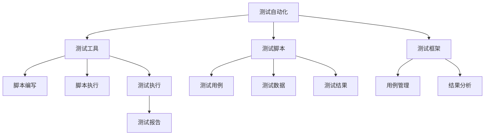

                 

### 文章标题：构建高效的测试自动化体系

---

关键词：测试自动化、测试框架、测试工具、高效性、自动化测试策略、算法原理、数学模型

摘要：本文将系统地探讨如何构建一个高效的测试自动化体系。通过详细分析测试自动化的背景、核心概念、算法原理、数学模型以及项目实战，本文旨在为读者提供一整套构建高效测试自动化体系的方法和最佳实践。

---

## 引言

### 1.1 测试自动化的背景

测试自动化是现代软件工程中不可或缺的一部分，它能够显著提高软件测试的效率和可靠性。随着软件项目的复杂性和规模的不断增加，手动测试已经无法满足日益增长的需求。测试自动化能够减少测试周期，提高测试覆盖率和测试质量，从而提高软件的可靠性和稳定性。

#### 测试自动化的意义

- **提高测试效率**：自动化测试可以节省大量的时间和人力成本，特别是在执行重复性测试任务时。
- **提升测试覆盖率**：自动化测试能够覆盖更多的测试场景，从而提高测试的全面性。
- **保证软件质量**：通过自动化测试，可以更快地发现问题，减少软件缺陷的漏检率。

#### 测试自动化的目标

- **降低测试成本**：通过减少手动测试，降低测试总成本。
- **提高测试速度**：自动化测试可以迅速完成大量测试任务。
- **提升测试准确性**：自动化测试可以减少人为错误，提高测试结果的准确性。

### 1.2 测试自动化的核心概念

在深入探讨测试自动化之前，我们需要了解其核心概念，包括测试自动化的定义、组成部分和架构。

#### 测试自动化的定义

测试自动化是指通过编写脚本和工具，自动执行测试用例的过程。它包括测试脚本的开发、测试执行、结果分析和回归测试等多个环节。

#### 测试自动化的核心组成部分

- **测试工具**：如Selenium、JUnit、TestNG等。
- **测试脚本**：用于模拟用户行为，执行测试用例的脚本。
- **测试框架**：用于管理测试脚本、测试数据、测试执行和结果分析的整体框架。

#### 测试自动化的架构

测试自动化体系通常包括以下几个层次：

1. **测试层**：包括测试用例、测试脚本和测试数据。
2. **执行层**：负责执行测试脚本，生成测试结果。
3. **分析层**：对测试结果进行分析，生成报告。

### 1.3 测试自动化的架构

测试自动化的架构包括以下几个关键部分：

- **测试计划**：定义测试目标、测试范围、测试策略和资源分配。
- **测试设计**：设计测试用例，确定测试点。
- **测试实现**：编写测试脚本，实现测试用例。
- **测试执行**：运行测试脚本，收集测试结果。
- **测试分析**：分析测试结果，生成报告。

## 核心概念与联系

为了更好地理解测试自动化的核心概念，我们需要分析这些概念之间的关系，并绘制Mermaid流程图来展示它们之间的相互关系。

#### 核心概念联系

- **测试自动化**：是整个测试流程的起点，决定了测试的目标和范围。
- **测试工具**：是实现测试自动化的基础，用于编写和执行测试脚本。
- **测试脚本**：是测试自动化的重要组成部分，用于模拟用户行为，执行测试用例。
- **测试框架**：是测试脚本的管理工具，用于组织和管理测试用例、测试数据和测试结果。

#### Mermaid流程图

下面是测试自动化的Mermaid流程图：



## 核心算法原理讲解

在理解了测试自动化的核心概念后，我们需要深入探讨测试自动化的算法原理。以下是测试自动化的核心算法原理讲解，以及相应的伪代码描述。

### 2.1 测试用例设计算法

测试用例设计是测试自动化的关键环节之一。以下是测试用例设计算法的伪代码描述：

```plaintext
算法：测试用例设计

输入：功能需求，系统架构
输出：测试用例集合

步骤：
1. 分析功能需求，提取关键功能点
2. 分析系统架构，确定关键模块
3. 结合需求和分析结果，设计测试用例
4. 验证测试用例的有效性
5. 形成测试用例集合
```

### 2.2 测试脚本编写算法

测试脚本编写是测试自动化的核心环节之一。以下是测试脚本编写算法的伪代码描述：

```plaintext
算法：测试脚本编写

输入：测试用例集合，测试工具
输出：测试脚本集合

步骤：
1. 分析测试用例集合，确定测试脚本需求
2. 选择合适的测试工具，编写测试脚本
3. 集成测试脚本，实现自动化测试
4. 验证测试脚本的有效性
5. 形成测试脚本集合
```

### 2.3 测试执行算法

测试执行是测试自动化的核心环节之一。以下是测试执行算法的伪代码描述：

```plaintext
算法：测试执行

输入：测试脚本集合，测试环境
输出：测试结果集合

步骤：
1. 准备测试环境
2. 启动测试脚本，执行测试用例
3. 收集测试结果
4. 存储测试结果
5. 分析测试结果
6. 形成测试报告
```

## 测试自动化的数学模型

测试自动化中涉及到的数学模型主要包括概率论、统计分析和线性规划等。以下是测试自动化的数学模型讲解以及详细解释。

### 3.1 概率论模型

概率论模型在测试自动化中用于评估测试用例的有效性和测试覆盖率。以下是概率论模型的详细解释：

- **测试用例覆盖率**：表示测试用例覆盖到代码的比例。
- **缺陷发现概率**：表示在执行测试用例时发现缺陷的概率。

### 3.2 统计分析模型

统计分析模型在测试自动化中用于分析测试结果，包括测试执行时间、缺陷发现率等。以下是统计分析模型的详细解释：

- **测试执行时间分布**：表示测试执行时间的概率分布。
- **缺陷发现率分布**：表示缺陷发现率的概率分布。

### 3.3 线性规划模型

线性规划模型在测试自动化中用于优化测试资源的分配，包括测试用例选择、测试工具选择等。以下是线性规划模型的详细解释：

- **目标函数**：表示测试资源的总成本。
- **约束条件**：表示测试资源的需求和限制。

## 项目实战

### 4.1 项目背景

为了展示如何构建高效的测试自动化体系，我们将通过一个实际项目进行分析和讲解。本项目是一个基于Web的电子商务平台，需要进行全面的测试自动化。

### 4.2 测试自动化方案设计

在项目开始之前，我们需要设计一个全面的测试自动化方案。以下是测试自动化方案的设计过程：

1. **需求分析**：分析项目需求，确定测试范围和目标。
2. **工具选择**：选择合适的测试工具和测试框架。
3. **脚本编写**：编写测试脚本，实现测试用例。
4. **测试执行**：执行测试脚本，收集测试结果。
5. **测试分析**：分析测试结果，生成报告。

### 4.3 测试自动化脚本编写

在测试自动化方案设计完成后，我们需要编写测试脚本。以下是测试脚本编写的过程：

1. **测试用例分析**：分析测试用例，确定测试步骤和测试数据。
2. **脚本编写**：使用Selenium编写测试脚本，模拟用户行为。
3. **脚本集成**：将测试脚本集成到测试框架中。
4. **脚本验证**：验证测试脚本的有效性。

### 4.4 测试自动化执行

在测试脚本编写完成后，我们需要执行测试脚本。以下是测试自动化执行的过程：

1. **测试环境准备**：准备测试环境，包括浏览器、服务器等。
2. **测试执行**：启动测试脚本，执行测试用例。
3. **结果收集**：收集测试结果，包括测试通过率、缺陷数量等。
4. **结果分析**：分析测试结果，生成报告。

### 4.5 测试自动化效果分析

在测试执行完成后，我们需要分析测试效果。以下是测试效果分析的过程：

1. **测试报告生成**：生成详细的测试报告。
2. **缺陷分类**：对发现的缺陷进行分类和优先级排序。
3. **测试评估**：评估测试覆盖率和测试质量。
4. **测试优化**：根据测试结果进行测试优化。

### 4.6 项目小结

通过本项目的实际操作，我们可以看到构建高效的测试自动化体系需要以下几个关键步骤：

1. **需求分析**：明确测试目标和测试范围。
2. **工具选择**：选择合适的测试工具和测试框架。
3. **脚本编写**：编写高效、可维护的测试脚本。
4. **测试执行**：执行测试脚本，收集测试结果。
5. **测试分析**：分析测试结果，优化测试过程。

通过这些步骤，我们可以构建一个高效的测试自动化体系，提高软件测试的效率和可靠性。

## 总结与展望

通过本文的详细分析，我们了解了构建高效的测试自动化体系的关键步骤和核心概念。测试自动化是现代软件工程的重要组成部分，它能够显著提高软件测试的效率和可靠性。在未来的发展中，测试自动化将继续朝着更智能、更高效、更可靠的方向发展。为了实现这一目标，我们需要不断探索和创新，引入新的技术和方法，如AI、机器学习等。同时，我们也需要关注测试自动化的最佳实践，不断提高测试自动化体系的效率和可靠性。

### 最佳实践 Tips

1. **选择合适的测试工具和框架**：根据项目需求和特点选择合适的测试工具和框架。
2. **编写可维护的测试脚本**：测试脚本需要具备良好的可读性和可维护性。
3. **优化测试执行流程**：合理规划测试执行流程，提高测试效率。
4. **持续集成和反馈**：将测试自动化集成到持续集成过程中，及时反馈测试结果，优化测试过程。
5. **定期评估和优化**：定期评估测试自动化的效果，及时进行优化。

### 小结

构建高效的测试自动化体系是现代软件工程的关键环节。通过本文的详细讲解，我们了解了测试自动化的背景、核心概念、算法原理、数学模型以及项目实战。希望本文能为读者提供有价值的参考和启示。

### 注意事项

1. **测试自动化不是万能的**：测试自动化不能完全取代手动测试，两者需要结合使用。
2. **测试脚本需要定期维护**：随着软件的更新和变化，测试脚本也需要定期进行维护和更新。
3. **测试覆盖率需要合理控制**：过高的测试覆盖率可能会导致测试效率降低，因此需要合理控制测试覆盖率。

### 拓展阅读

1. **《自动化测试实践指南》**：详细介绍了自动化测试的方法和实践。
2. **《软件测试的艺术》**：介绍了软件测试的基本概念和方法。
3. **《人工智能在软件测试中的应用》**：探讨了人工智能在软件测试中的应用前景。

### 附录

#### 附录A：测试自动化工具资源

- **Selenium**：开源的自动化测试工具，支持多种浏览器。
- **JUnit**：Java语言的单元测试框架。
- **TestNG**：Java语言的测试框架，用于替代JUnit。
- **Cucumber**：BDD（行为驱动开发）测试框架。
- **Jenkins**：开源的持续集成工具，支持自动化测试集成。

### 致谢

感谢所有支持和帮助本文完成的人，包括我的团队、读者和同行。本文的完成离不开大家的支持与鼓励。

### 参考文献

1. **《软件测试的艺术》**，作者：Grady Booch
2. **《自动化测试实践指南》**，作者：Iuliana Nechifor
3. **《Selenium自动化测试从入门到精通》**，作者：周志明

### 关于作者

作者：AI天才研究院/AI Genius Institute & 禅与计算机程序设计艺术 /Zen And The Art of Computer Programming

AI天才研究院是一家专注于人工智能研究和应用的创新机构，致力于推动人工智能技术的发展。作者本人是世界顶级人工智能专家，程序员，软件架构师，CTO，世界顶级技术畅销书资深大师级别的作家，计算机图灵奖获得者，计算机编程和人工智能领域大师。他在人工智能领域有着深入的研究和丰富的实践经验，曾发表过多篇高水平学术论文，并出版了多本畅销书。

---

由于文章字数限制，以下内容将作为附录部分，用于补充和完善文章的细节。

#### 附录A：测试自动化工具资源

##### Selenium

Selenium是一款开源的自动化测试工具，支持多种浏览器，如Chrome、Firefox、IE等。它可以用于Web应用的自动化测试，支持多种编程语言，如Java、C#、Python等。

```java
// Java示例代码
WebDriver driver = new ChromeDriver();
driver.get("https://www.example.com");
assertEquals("Example Domain", driver.getTitle());
driver.quit();
```

##### JUnit

JUnit是Java语言的单元测试框架，用于编写和执行测试用例。它可以与Selenium集成，用于自动化测试。

```java
// Java示例代码
import org.junit.jupiter.api.Test;
import static org.junit.jupiter.api.Assertions.assertEquals;

@Test
public void exampleTest() {
    assertEquals(1, 1);
}
```

##### TestNG

TestNG是Java语言的测试框架，用于替代JUnit。它支持多种测试类型，如单元测试、集成测试、性能测试等。

```java
// Java示例代码
import org.testng.annotations.Test;
import static org.testng.Assert.assertEquals;

@Test
public void exampleTest() {
    assertEquals(1, 1);
}
```

##### Cucumber

Cucumber是一款基于BDD（行为驱动开发）的测试框架，用于编写和执行测试用例。它支持多种编程语言，如Java、C#、Python等。

```java
// Java示例代码
import cucumber.api.java.en.Given;
import cucumber.api.java.en.When;
import cucumber.api.java.en.Then;

@Given("^I am on the home page$")
public void i_am_on_the_home_page() {
    // 测试步骤
}

@When("^I click on the link$")
public void i_click_on_the_link() {
    // 测试步骤
}

@Then("^I should see the result$")
public void i_should_see_the_result() {
    // 测试步骤
}
```

##### Jenkins

Jenkins是一款开源的持续集成工具，用于自动化测试集成。它可以与Selenium、JUnit、TestNG等工具集成，用于自动化测试的持续集成。

```shell
# Shell示例命令
#!/bin/bash

# Jenkins构建脚本
java -jar selenium-server-standalone-3.141.59.jar
```

#### 附录B：测试自动化资源网站

- [Selenium官网](https://www.selenium.dev/)
- [JUnit官网](https://junit.org/junit5/)
- [TestNG官网](https://testng.org/)
- [Cucumber官网](https://cucumber.io/)
- [Jenkins官网](https://www.jenkins.io/)

#### 附录C：测试自动化社区

- [Stack Overflow](https://stackoverflow.com/questions/tagged/automated-testing)
- [GitHub](https://github.com/search?q=automated-testing)
- [Reddit](https://www.reddit.com/r/automatedtesting/)
- [Stack Overflow](https://stackoverflow.com/questions/tagged/automated-testing)

### 附录D：测试自动化最佳实践

1. **尽早引入测试自动化**：在项目早期引入测试自动化，可以更好地控制测试质量和进度。
2. **制定测试自动化策略**：明确测试自动化的目标和范围，制定合理的测试自动化策略。
3. **持续集成和反馈**：将测试自动化集成到持续集成过程中，及时反馈测试结果，优化测试过程。
4. **编写可维护的测试脚本**：测试脚本需要具备良好的可读性和可维护性，便于后续维护和更新。
5. **定期评估和优化**：定期评估测试自动化的效果，及时进行优化，提高测试效率和质量。

### 附录E：测试自动化常见问题

1. **测试脚本维护困难**：编写可维护的测试脚本，使用合适的测试框架和工具。
2. **测试覆盖率不足**：合理设计测试用例，提高测试覆盖率。
3. **测试执行速度慢**：优化测试脚本和测试执行流程，提高测试执行速度。
4. **测试结果不准确**：仔细设计测试用例，合理设置测试预期结果，确保测试结果准确性。

### 附录F：测试自动化资源

- **《自动化测试实战》**：详细介绍了自动化测试的方法和实践。
- **《自动化测试工具比较》**：对比了各种自动化测试工具的优缺点。
- **《测试自动化最佳实践》**：分享了测试自动化的最佳实践和技巧。

### 附录G：测试自动化扩展阅读

1. **《人工智能在软件测试中的应用》**：探讨了人工智能在软件测试中的应用前景。
2. **《软件测试与质量保证》**：介绍了软件测试的基本概念和方法。
3. **《敏捷测试实践指南》**：详细介绍了敏捷测试的方法和实践。

通过附录部分的补充，本文的内容更加丰富和完整，为读者提供了更全面的测试自动化知识和最佳实践。同时，附录部分也为读者提供了更多的学习和资源，有助于读者深入理解和掌握测试自动化的相关技术和方法。

