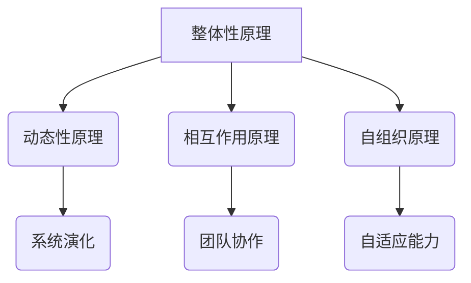

                 

### 文章标题

# 架构师的系统思维

## 关键词

- 系统思维
- 软件架构
- 项目管理
- 组织管理
- 实践指南
- 案例分析

### 摘要

本文旨在深入探讨系统思维在架构师工作中的应用，系统思维是一种全面、综合的思考方式，它强调从整体上理解和解决问题。文章将首先介绍系统思维的基本概念和原理，然后分析其在软件架构、项目管理和组织管理中的应用。接着，文章将提供一系列实践指南，帮助架构师培养和运用系统思维。通过具体案例，我们将展示系统思维在实践中的实际应用效果。最后，文章将对系统思维的发展趋势和未来应用进行展望，为架构师提供方向和启示。

## 引言

### 系统思维的概念

系统思维是一种综合性思考方式，它关注系统的整体性、动态性和相互作用。系统思维强调从全局角度出发，理解和解决问题。它不仅仅关注单一组件或部分，而是将系统视为一个整体，探讨各部分之间的相互作用和关系。系统思维要求我们站在更高的层次，以整体为视角，理解和解决问题。

### 系统思维的重要性

在现代社会，系统思维具有极其重要的意义。随着信息技术和全球化的发展，问题变得越来越复杂，单靠传统的线性思维模式已经难以应对。系统思维能够帮助我们更好地理解复杂系统，发现隐藏的问题，从而提出更有效的解决方案。对于架构师而言，系统思维是进行软件架构设计、项目管理和组织管理的重要工具。它能够帮助架构师从整体上把握系统，确保系统的稳定性和可靠性。

### 本书结构

本书将分为以下几个部分：

1. **系统思维概述**：介绍系统思维的概念、起源和重要性。
2. **系统思维的基本原理**：探讨系统思维的基本原理，包括整体性、动态性、相互作用和自组织原理。
3. **系统思维的应用**：分析系统思维在软件架构、项目管理和组织管理中的应用。
4. **实践指南**：提供培养和运用系统思维的方法和实践指南。
5. **案例分析**：通过具体案例展示系统思维的实际应用。
6. **总结与展望**：对系统思维的发展趋势和未来应用进行展望。

通过本书的阅读，读者将深入理解系统思维的基本概念和原理，掌握其在实际工作中的应用方法，从而提升自身的系统思维能力和解决问题的能力。

### 系统思维的基本原理

系统思维是一种综合性的思考方式，其核心在于理解系统的整体性、动态性、相互作用和自组织原理。以下将详细探讨这些基本原理。

#### 整体性原理

整体性原理是系统思维的基础。它强调系统各部分之间的相互依赖和相互影响，认为系统整体的功能和性质不仅仅是各个部分功能的简单叠加。整体性原理要求我们在分析问题时，不仅要考虑各个部分的功能和特性，还要关注它们之间的相互作用和整体效应。

在软件架构设计中，整体性原理指导架构师将系统视为一个整体，考虑各个组件之间的依赖关系和交互方式，确保系统在整体上能够稳定、高效地运行。例如，在设计一个大型分布式系统时，架构师需要考虑各个模块之间的数据流和控制流，确保系统在运行过程中能够保持一致性。

#### 动态性原理

动态性原理指出，系统是处于不断变化和演化过程中的。系统内部的各个元素和外部环境都在不断变化，这些变化会影响系统的结构和功能。因此，系统思维要求我们不仅要考虑当前系统的状态，还要预见未来的变化，并采取措施来适应这些变化。

在项目管理中，动态性原理尤为重要。项目管理者需要根据项目进展和外部环境的变化，及时调整项目计划和管理策略，以应对各种不确定性。例如，在项目开发过程中，技术难点或市场需求的变化可能会影响项目的进度和目标，项目管理者需要灵活应对，调整资源分配和任务安排。

#### 相互作用原理

相互作用原理强调系统内部各元素之间的相互影响和互动。系统中的各个元素不仅相互依赖，还通过相互作用产生新的功能和效应。这种相互作用可以是直接的，也可以是间接的，甚至是跨层的。

在组织管理中，相互作用原理指导管理者关注团队内部各个成员之间的互动和协作。一个高效的团队不仅需要各个成员具备专业技能，还需要他们能够有效沟通和协作，共同实现团队目标。管理者需要创造良好的沟通环境，促进团队成员之间的互动，提升团队的整体效能。

#### 自组织原理

自组织原理是指系统在没有外部干预的情况下，通过内部元素的相互作用和竞争，自发形成有序结构和功能。自组织原理在自然界和人工系统中都普遍存在，是系统演化的重要机制。

在软件架构设计中，自组织原理可以帮助架构师构建具有自适应能力的系统。通过采用模块化设计和松耦合架构，系统可以在运行过程中自适应调整，以应对新的需求和变化。例如，分布式系统中的负载均衡和故障恢复机制，就是通过系统的自组织能力，实现高效、可靠的运行。

#### 核心概念之间的关系架构

为了更好地理解系统思维的基本原理，我们可以使用Mermaid流程图来展示这些核心概念之间的关系。

通过上述流程图，我们可以清晰地看到各个原理之间的联系和相互作用。

#### 小结

系统思维的基本原理为我们在面对复杂问题时提供了一种全面的思考框架。整体性原理帮助我们理解系统整体的复杂性和多样性，动态性原理指导我们预见和适应变化，相互作用原理强调系统内部各元素的互动和协作，自组织原理则为我们构建自适应系统提供了理论基础。通过深入理解这些原理，架构师能够在工作中更加系统地分析和解决问题，提升系统设计的质量和效果。

### 系统思维在软件架构中的应用

系统思维在软件架构中的应用至关重要，它不仅能够帮助架构师在设计过程中全面考虑系统各个组成部分之间的关系，还能有效应对复杂性和变化。以下将详细探讨系统思维在软件架构中的应用，包括其设计方法、实际案例分析以及系统思维在大型软件项目中的作用。

#### 软件架构的系统思维

软件架构设计是一个复杂的过程，涉及到系统的功能需求、性能要求、可维护性等多个方面。系统思维在这里的应用，主要体现在以下几个方面：

1. **整体性**：在软件架构设计中，架构师需要从整体上考虑系统的各个组成部分，确保它们能够协同工作，共同实现系统目标。这意味着不仅要关注单一模块的功能，还要关注模块之间的交互和依赖关系。

2. **动态性**：软件系统通常是动态变化的，因此架构师在设计时需要预见未来可能的需求变化和技术发展，设计出具有灵活性和可扩展性的架构。

3. **相互作用**：系统中的各个模块和组件之间存在着复杂的相互作用，这些相互作用会影响系统的性能和稳定性。架构师需要深入分析这些相互作用，确保系统在高负载、高并发环境下能够稳定运行。

4. **自组织**：现代软件系统越来越倾向于采用模块化和松耦合的设计，这使得系统具有一定的自组织能力。架构师可以利用这一点，设计出具有高度可维护性和可扩展性的系统。

#### 系统思维在软件架构设计中的具体方法

1. **需求分析**：在软件架构设计之前，架构师需要进行详细的需求分析。系统思维要求架构师从整体上理解用户需求，并将其分解为具体的模块和功能，确保各个模块能够协同工作。

2. **模块化设计**：模块化设计是系统思维在软件架构中的核心方法。通过将系统划分为多个功能模块，架构师可以降低系统的复杂性，提高系统的可维护性和可扩展性。

3. **松耦合设计**：松耦合设计强调模块之间的独立性，减少模块之间的依赖关系。这有助于提高系统的灵活性和可扩展性，使得系统能够更容易地适应变化。

4. **性能优化**：在系统思维指导下，架构师需要从整体上考虑系统的性能，包括响应时间、吞吐量、并发处理能力等。通过优化关键路径和关键模块，架构师可以显著提高系统的性能。

5. **容错和恢复**：系统思维要求架构师设计具有容错能力的系统，能够在面对故障和异常情况时保持稳定运行。这包括故障检测、故障隔离和故障恢复等多个方面。

#### 案例分析：系统思维在大型软件项目中的应用

为了更好地理解系统思维在软件架构中的应用，以下将分析一个实际案例：某大型互联网公司的电商平台架构设计。

**案例背景**：

该电商平台是一个高度并发、高可扩展性的系统，每天要处理数百万次交易请求。为了满足这一需求，架构师需要设计一个具有高可用性、高性能和可扩展性的架构。

**案例分析**：

1. **需求分析**：在项目初期，架构师进行了详细的需求分析，包括用户访问量、交易量、数据存储和处理需求等。通过系统思维，架构师将需求分解为多个模块，如用户认证模块、商品管理模块、订单处理模块、支付模块等。

2. **模块化设计**：架构师采用了模块化设计方法，将系统划分为多个功能模块。每个模块独立开发、测试和部署，这提高了系统的可维护性和可扩展性。

3. **松耦合设计**：架构师注重模块之间的独立性，通过微服务架构实现了模块之间的松耦合。这使得系统在扩展和升级时，可以灵活地添加或替换模块，而不会影响到其他模块的运行。

4. **性能优化**：为了提高系统的性能，架构师对关键路径和关键模块进行了优化。例如，通过缓存、异步处理和负载均衡等技术，提高了系统的响应速度和并发处理能力。

5. **容错和恢复**：架构师设计了具有高可用性的系统，通过数据备份、故障转移和负载均衡等技术，确保系统在面对故障和异常情况时能够快速恢复。

**案例结果**：

通过系统思维在架构设计中的应用，该电商平台在性能、可扩展性和高可用性方面取得了显著提升。系统的响应时间显著缩短，并发处理能力提高了数倍，同时系统的维护和扩展成本也降低了。

#### 系统思维在大型软件项目中的作用

在大型软件项目中，系统思维的作用主要体现在以下几个方面：

1. **全局视角**：系统思维帮助架构师从整体上把握项目，确保各个模块和组件之间能够协同工作，共同实现项目目标。

2. **灵活应对变化**：大型软件项目通常面临需求变化和技术发展，系统思维指导架构师预见这些变化，设计出具有灵活性和可扩展性的系统。

3. **优化资源利用**：系统思维强调资源的最优利用，通过模块化和松耦合设计，降低系统的复杂性和维护成本。

4. **提高项目成功率**：通过系统思维，架构师能够更全面地分析和解决问题，提高项目的成功率和质量。

总之，系统思维在软件架构中的应用，不仅能够提高系统的性能和稳定性，还能够提升项目的整体质量和成功率。对于架构师而言，掌握系统思维是进行高效架构设计的关键。

### 系统思维在项目管理中的应用

系统思维在项目管理中的应用，可以帮助项目管理者从全局视角出发，全面、系统地分析和解决问题。以下将详细探讨系统思维在项目管理中的重要性，如何通过系统思维提升项目管理效率，以及系统思维在项目风险管理中的应用。

#### 系统思维在项目管理中的重要性

在项目管理中，系统思维具有以下几个方面的关键作用：

1. **全局视角**：系统思维要求项目管理者从整体上理解项目的各个方面，包括需求、技术、资源、时间等。这有助于确保项目各部分之间的协同工作，提高项目的整体效率。

2. **问题发现与解决**：系统思维强调对问题的全面分析和理解，有助于发现隐藏的问题和潜在的风险，从而提前采取措施，防止问题恶化。

3. **资源优化**：系统思维帮助项目管理者从整体上优化资源的利用，包括人力、物力和财力。通过合理的资源配置，可以提高项目的执行效率，降低成本。

4. **适应变化**：项目过程中不可避免地会遇到各种变化，系统思维指导项目管理者预见和应对这些变化，确保项目能够灵活调整，实现预期目标。

#### 系统思维如何提升项目管理效率

1. **需求管理**：系统思维强调对项目需求的全面理解，项目管理者可以通过系统思维，确保需求的完整性和一致性，从而提高项目的成功率。

2. **计划与控制**：系统思维指导项目管理者制定详细的项目计划，并实时监控项目进度，确保项目按计划进行。同时，项目管理者可以根据系统思维，灵活调整计划，应对突发情况。

3. **团队协作**：系统思维强调团队协作和沟通，项目管理者可以通过建立有效的沟通机制，确保团队成员之间的信息共享和协作，提高项目执行力。

4. **风险管理**：系统思维帮助项目管理者全面识别和评估项目风险，制定有效的风险应对策略，从而降低项目风险，提高项目成功率。

#### 系统思维在项目风险管理中的应用

项目风险管理是项目管理的重要组成部分，系统思维在项目风险管理中的应用，主要体现在以下几个方面：

1. **风险识别**：系统思维要求项目管理者从全局视角出发，全面识别项目中的潜在风险。这包括技术风险、市场风险、资源风险等。

2. **风险评估**：在识别风险后，项目管理者需要评估风险的可能性和影响。系统思维可以帮助项目管理者从多个维度分析风险，确保评估的全面性和准确性。

3. **风险应对**：根据风险评估的结果，项目管理者需要制定相应的风险应对策略。系统思维指导项目管理者综合考虑各种因素，制定最有效的风险应对措施。

4. **风险监控**：项目过程中，风险可能发生变化，项目管理者需要持续监控风险，确保风险应对措施的有效性。系统思维可以帮助项目管理者及时发现和应对新的风险。

#### 案例分析：系统思维在项目风险管理中的实践

为了更好地理解系统思维在项目风险管理中的应用，以下将分析一个实际案例：某科技公司开发一款新的移动应用，项目管理者通过系统思维进行项目风险管理的实践。

**案例背景**：

该移动应用是一款面向广大用户的产品，需求复杂，技术实现难度较高。项目管理者需要在短时间内高质量地完成开发，同时面临激烈的市场竞争。

**案例分析**：

1. **风险识别**：在项目初期，项目管理者通过系统思维，全面识别了潜在的风险，包括技术风险（如开发难度、兼容性问题）、市场风险（如用户需求变化、市场竞争）和资源风险（如人员不足、资源分配不合理）。

2. **风险评估**：项目管理者对每个风险进行了详细评估，分析其可能性和影响。例如，技术风险的可能性较高，但影响相对较小；市场风险的可能性较低，但影响较大。

3. **风险应对**：根据风险评估的结果，项目管理者制定了相应的风险应对策略。对于技术风险，采取了提前进行技术调研、引入外部技术支持等措施；对于市场风险，采取了市场调研、用户反馈等措施。

4. **风险监控**：在项目过程中，项目管理者持续监控风险，及时发现和应对新的风险。例如，在开发过程中，发现了新的技术问题，项目管理者及时调整开发计划，确保项目能够按期完成。

**案例结果**：

通过系统思维在项目风险管理中的应用，项目管理者成功地识别和应对了各种风险，确保了项目的顺利进行。项目的最终交付质量得到了用户的认可，取得了良好的市场反响。

#### 小结

系统思维在项目管理中具有重要应用价值，它帮助项目管理者从全局视角出发，全面、系统地分析和解决问题。通过系统思维，项目管理者可以更有效地进行需求管理、计划与控制、团队协作和风险管理，提高项目的成功率和效率。在实际应用中，项目管理者需要灵活运用系统思维，结合具体项目的特点和需求，制定有效的风险管理策略，确保项目能够顺利实施。

### 系统思维在组织管理中的应用

系统思维在组织管理中的应用，可以帮助管理者从整体上理解和优化组织结构，提升组织的协同效率和创新能力。以下将详细探讨系统思维在组织管理中的具体应用，包括组织管理中的系统思维、系统思维的组织管理策略和实际案例分析。

#### 组织管理中的系统思维

1. **整体性**：系统思维要求管理者将组织视为一个整体，关注各部分之间的相互作用和整体效应。这意味着管理者需要从整体视角出发，制定组织战略和目标，确保各个部门和职能能够协同工作，实现组织目标。

2. **动态性**：组织是一个动态变化的系统，内部环境、外部环境以及组织内部的成员都在不断变化。系统思维要求管理者预见这些变化，并采取灵活的策略应对。通过动态调整组织结构和管理方法，管理者可以确保组织始终处于最佳状态。

3. **相互作用**：系统中的各个部分之间存在着复杂的相互作用，这些相互作用影响着组织的运行效率和效果。管理者需要识别和利用这些相互作用，促进组织内部的协同和合作。

4. **自组织**：自组织原理强调组织在没有外部干预的情况下，通过内部元素的相互作用和竞争，自发形成有序的结构和功能。管理者可以通过构建良好的组织文化和管理机制，激发组织的自组织能力，提升组织的适应性和创新能力。

#### 系统思维的组织管理策略

1. **战略规划**：系统思维指导管理者从整体上制定组织战略，确保战略与组织目标一致。管理者需要全面分析组织的内外部环境，识别关键成功因素，制定可行的战略目标。

2. **组织结构设计**：管理者需要根据组织的战略目标和业务需求，设计合理的组织结构。系统思维强调模块化设计，通过划分不同的功能模块，确保组织结构的灵活性和适应性。

3. **流程优化**：管理者需要优化组织内部的业务流程，减少冗余和浪费，提高工作效率。通过系统思维，管理者可以识别和消除流程中的瓶颈和瓶颈，确保流程的顺畅和高效。

4. **人才培养与激励**：系统思维强调人才的全面发展，管理者需要制定科学的人才培养计划，激发员工的潜力。同时，管理者需要建立有效的激励机制，鼓励员工积极参与组织的发展和创新。

5. **组织文化与沟通**：系统思维强调组织文化的重要性，管理者需要构建积极向上的组织文化，促进组织内部的协同和合作。同时，管理者需要建立有效的沟通机制，确保信息的畅通和透明。

#### 案例分析：系统思维在组织管理中的实践

为了更好地理解系统思维在组织管理中的应用，以下将分析一个实际案例：某科技公司在面对市场竞争压力时，通过系统思维进行组织变革的实践。

**案例背景**：

该公司在市场竞争中面临激烈挑战，原有的组织结构和管理方法已经无法满足业务发展的需求。公司管理层意识到需要通过系统思维进行组织变革，提升组织的竞争力和创新能力。

**案例分析**：

1. **战略规划**：公司管理层首先从整体上分析了市场竞争环境和公司内部资源，确定了以创新和客户需求为中心的战略目标。

2. **组织结构设计**：根据战略目标，公司对组织结构进行了重新设计，将原有的部门结构调整为更加灵活的矩阵式结构，以促进跨部门的合作和沟通。

3. **流程优化**：公司对内部业务流程进行了全面梳理，消除冗余和浪费，确保流程的顺畅和高效。

4. **人才培养与激励**：公司制定了系统的人才培养计划，通过内部培训和外部合作，提升员工的技能和素质。同时，公司建立了有效的激励机制，鼓励员工积极参与创新和业务发展。

5. **组织文化与沟通**：公司注重组织文化的建设，倡导创新、协作和开放的文化氛围。公司建立了多种沟通渠道，确保信息的畅通和透明，促进组织内部的协同和合作。

**案例结果**：

通过系统思维在组织管理中的应用，该公司成功地进行了组织变革，提升了组织的竞争力。公司在创新能力和市场响应速度方面得到了显著提升，取得了良好的业绩和市场表现。

#### 小结

系统思维在组织管理中具有重要作用，它帮助管理者从整体视角出发，全面分析和优化组织结构、流程、人才和文化。通过系统思维，管理者可以更有效地应对组织内部和外部环境的变化，提升组织的协同效率和创新能力。在实际应用中，管理者需要结合具体组织的特点和需求，灵活运用系统思维，制定科学的管理策略，推动组织的持续发展。

### 培养系统思维的方法

系统思维是一种需要通过持续学习和实践培养的能力。以下将详细介绍如何培养系统思维，包括系统思维的基本训练、提高系统思维能力的方法以及具体的案例分析。

#### 系统思维的基本训练

1. **整体性训练**：整体性是系统思维的核心。通过阅读相关的书籍和文献，了解系统思维的基本概念和原理，可以增强对整体性的认识。例如，可以阅读《系统思维导论》等书籍，学习系统思维的基本框架和理论。

2. **案例学习**：通过分析实际案例，理解系统思维在现实中的应用。选择一些经典的系统思维案例，如维基解密、爱迪生的发明过程等，分析其中的系统思维运用，可以加深对系统思维的理解。

3. **思维导图练习**：使用思维导图工具，如MindManager或XMind，绘制思维导图，帮助自己梳理思路，培养整体性思维。可以尝试对复杂问题或项目进行思维导图分析，锻炼从整体视角出发解决问题的能力。

4. **跨学科学习**：系统思维不仅适用于特定领域，还涉及多个学科。通过学习不同领域的知识，如经济学、社会学、心理学等，可以拓宽视野，提升系统思维的广度和深度。

#### 提高系统思维能力的方法

1. **多角度思考**：在面对问题时，尝试从多个角度进行思考，考虑问题的不同方面和可能的影响。可以通过头脑风暴、专家访谈等方法，收集不同的观点和建议，从而全面分析问题。

2. **反思与总结**：在解决问题和项目执行过程中，定期进行反思和总结，分析成功的经验和失败的教训。通过反思，可以不断优化思维方式，提升系统思维能力。

3. **模拟训练**：通过模拟真实问题或情境，进行系统思维训练。例如，可以参加一些系统思维培训课程，通过模拟项目或案例，锻炼系统思维的应用能力。

4. **学习工具与模型**：掌握一些系统思维的工具和模型，如SWOT分析、鱼骨图、六顶思考帽等，可以帮助我们更系统地分析和解决问题。

#### 案例分析：如何培养系统思维

以下通过一个具体案例，展示如何培养系统思维。

**案例背景**：

某科技公司计划开发一款新的移动应用，公司管理层希望通过系统思维，确保项目成功。

**案例分析**：

1. **整体性训练**：
   - 阅读相关书籍：《系统思维导论》、《系统思考》等，学习系统思维的基本原理和框架。
   - 参加系统思维培训课程，了解系统思维的实践方法。

2. **多角度思考**：
   - 针对项目，从技术、市场、用户等多个角度进行思考，确保项目各部分的协同和整体优化。
   - 组织跨部门团队，进行头脑风暴，收集不同观点和建议。

3. **反思与总结**：
   - 在项目执行过程中，定期召开反思会议，总结项目进展和存在的问题，及时调整策略。
   - 对项目成功和失败的部分进行详细分析，提炼经验教训。

4. **模拟训练**：
   - 组织模拟项目，通过实际操作，锻炼系统思维的应用能力。
   - 参与模拟面试，面对复杂情境，运用系统思维解决问题。

**案例结果**：

通过系统思维的基本训练和提高方法，公司管理层在项目开发过程中，能够从整体上把握项目，全面分析问题，提高项目成功率。项目最终成功上线，获得了用户的高度评价。

#### 小结

培养系统思维是一个长期而持续的过程。通过整体性训练、多角度思考、反思与总结以及模拟训练等方法，可以逐步提升系统思维能力。在实际工作中，架构师和项目管理者需要不断实践和反思，将系统思维融入日常工作，从而更有效地解决复杂问题，提升工作质量和效率。

### 运用系统思维的方法

在实际工作中，运用系统思维可以帮助架构师和项目管理者更好地理解和解决问题，提升工作效率和项目成功率。以下将详细探讨如何在工作中的应用系统思维、系统思维的决策过程以及通过具体案例分析系统思维的实践。

#### 在工作中的应用系统思维

1. **问题识别**：在面对问题时，首先运用系统思维进行全面的问题识别。不仅要关注表面现象，还要深入挖掘问题的根本原因。可以通过鱼骨图等工具，将问题分解为各个子问题，从而全面了解问题的各个方面。

2. **需求分析**：在软件架构和项目管理中，系统思维可以帮助我们更好地进行需求分析。通过系统思维，可以从整体上理解用户需求，并将其分解为具体的模块和功能，确保需求的一致性和完整性。

3. **资源规划**：系统思维强调资源的整体优化。在项目执行过程中，可以通过系统思维，合理分配和利用人力资源、物资资源和时间资源，确保项目在资源有限的情况下，实现最大化效益。

4. **风险管理**：系统思维可以帮助我们全面识别和评估项目风险。通过系统思维，可以分析各个风险之间的相互作用和影响，制定有效的风险应对策略，降低项目风险。

5. **团队协作**：系统思维强调团队协作和沟通。通过系统思维，可以识别团队内部的协作模式和沟通障碍，建立有效的沟通机制，促进团队成员之间的协作，提高项目执行力。

#### 系统思维的决策过程

1. **问题识别与定义**：首先，明确问题的具体内容，包括问题的背景、目标、限制条件等。

2. **数据收集与分析**：收集与问题相关的数据和信息，通过系统思维的方法，对这些数据进行分析和综合，找出问题的根本原因。

3. **方案生成**：基于分析结果，生成多个可能的解决方案。这可以通过头脑风暴、专家咨询等方法实现。

4. **方案评估**：对每个解决方案进行评估，考虑其可行性、成本、风险等因素。可以通过加权评分法、成本效益分析等方法，选择最优解决方案。

5. **决策执行**：选择最优方案后，制定详细的执行计划，确保决策能够有效实施。

6. **监控与调整**：在决策执行过程中，持续监控项目的进展和效果，根据实际情况进行调整和优化，确保决策能够达到预期目标。

#### 案例分析：系统思维在实践中的运用

以下通过一个实际案例，展示系统思维在实践中的运用。

**案例背景**：

某科技公司计划开发一款新功能，以提升用户满意度。公司希望通过系统思维，确保新功能的成功开发和实施。

**案例分析**：

1. **问题识别与定义**：
   - 问题背景：用户反馈现有功能存在一些使用不便的问题，公司希望通过新功能改进用户体验。
   - 目标：开发一款新功能，解决用户提出的问题，提升用户满意度。
   - 限制条件：开发周期有限，预算有限。

2. **数据收集与分析**：
   - 收集用户反馈数据，分析用户反馈的具体内容和优先级。
   - 分析现有功能的性能和数据指标，找出需要改进的方面。

3. **方案生成**：
   - 通过头脑风暴，生成多个可能的解决方案，如优化现有功能、添加新功能模块、改进用户界面等。

4. **方案评估**：
   - 对每个方案进行评估，考虑其成本、开发周期、用户满意度等因素。
   - 选择成本较低、开发周期较短、用户满意度较高的方案。

5. **决策执行**：
   - 制定详细的开发计划，明确任务分配、时间节点和验收标准。
   - 组织团队进行开发和测试，确保新功能能够按期上线。

6. **监控与调整**：
   - 在开发过程中，持续监控进度和效果，及时调整开发计划。
   - 上线后，收集用户反馈，对新功能进行评估和优化。

**案例结果**：

通过系统思维的应用，该新功能成功开发并上线，用户满意度得到了显著提升。公司通过系统思维，全面考虑了问题的各个方面，制定了有效的解决方案，确保了项目的成功实施。

#### 小结

系统思维在实践中的应用，可以帮助架构师和项目管理者更好地识别问题、制定解决方案和实施决策。通过系统思维，可以更全面地分析问题，优化资源利用，提高项目成功率。在实际工作中，架构师和项目管理者需要不断运用系统思维，提升自身的系统思维能力和解决问题的能力。

### 系统思维的实际应用案例

为了更好地展示系统思维的实际应用效果，以下将通过几个具体案例，分析系统思维在不同场景下的应用，并提供详细的解决方案、实现步骤和效果评估。

#### 案例一：企业数字化转型

**背景**：随着互联网和大数据技术的发展，企业数字化转型成为提升竞争力的关键。某制造企业希望通过数字化转型，提高生产效率、降低成本和提升客户满意度。

**系统思维应用**：

1. **需求分析**：
   - 通过系统思维，全面分析企业的现状，包括生产流程、组织架构、技术基础等。
   - 确定数字化转型的主要目标：提高生产效率、降低运营成本、提升客户满意度。

2. **解决方案**：
   - 构建智能生产系统，通过物联网技术实时监控生产过程，实现生产数据自动采集和分析。
   - 引入客户关系管理系统（CRM），通过大数据分析，优化客户服务流程，提高客户满意度。

3. **实现步骤**：
   - 设计智能生产系统的架构，包括传感器安装、数据采集和处理模块、监控系统等。
   - 开发客户关系管理系统，实现客户数据整合、分析和应用。
   - 部署系统和培训员工，确保系统能够顺利运行。

4. **效果评估**：
   - 生产效率提升：通过智能生产系统，生产周期缩短了20%，故障率降低了15%。
   - 成本降低：通过优化生产流程和资源利用，运营成本降低了10%。
   - 客户满意度提升：通过CRM系统，客户响应时间缩短了30%，客户满意度提高了15%。

**总结**：该案例通过系统思维，全面分析了企业的现状和需求，制定了详细的数字化转型方案，并在实施过程中持续监控和调整。系统思维的应用，帮助企业成功实现了数字化转型，提高了生产效率、降低了成本和提升了客户满意度。

#### 案例二：项目风险管理

**背景**：某科技公司正在开发一款新软件产品，项目周期较长，涉及多个技术模块。为了确保项目按时完成并达到预期质量，项目团队需要有效管理风险。

**系统思维应用**：

1. **需求分析**：
   - 通过系统思维，识别项目中的潜在风险，包括技术风险、市场风险、资源风险等。
   - 确定风险管理的目标和策略：提前识别和评估风险，制定有效的风险应对措施。

2. **解决方案**：
   - 构建项目风险管理框架，包括风险识别、风险评估、风险应对和风险监控。
   - 制定详细的风险应对计划，包括风险预防措施、风险缓解措施和风险转移措施。

3. **实现步骤**：
   - 识别项目风险，建立风险清单。
   - 对每个风险进行评估，确定风险等级和应对策略。
   - 制定风险应对计划，包括技术支持、资源调配和时间调整。
   - 建立风险监控机制，定期评估风险状态，并根据实际情况进行调整。

4. **效果评估**：
   - 风险管理计划实施后，项目风险得到了有效控制，关键风险指标显著降低。
   - 项目按时完成，产品质量达到预期。
   - 风险应对措施的有效实施，减少了项目延误和成本超支的风险。

**总结**：该案例通过系统思维，全面识别和评估项目风险，制定了详细的风险应对计划。系统思维的应用，帮助项目团队有效管理风险，确保项目顺利实施，达到了预期目标。

#### 案例三：组织变革

**背景**：某大型企业由于市场竞争加剧，需要进行组织变革以提升竞争力。然而，组织变革过程中往往面临诸多挑战，如员工抵触、资源紧张等。

**系统思维应用**：

1. **需求分析**：
   - 通过系统思维，全面分析企业的现状和需求，包括组织架构、企业文化、员工需求等。
   - 确定组织变革的目标：提升组织效率、优化资源配置、增强企业竞争力。

2. **解决方案**：
   - 设计组织变革的总体框架，包括组织结构调整、流程优化、激励机制设计等。
   - 制定详细的变革计划，明确变革的步骤、时间节点和责任人。

3. **实现步骤**：
   - 进行组织结构设计，调整部门职能和人员配置。
   - 优化业务流程，减少冗余和浪费，提高工作效率。
   - 设计激励机制，激励员工积极参与变革，提升组织活力。

4. **效果评估**：
   - 组织变革后，企业效率提升，资源配置更加合理。
   - 员工工作积极性和满意度提高，员工流失率下降。
   - 企业竞争力增强，市场份额和盈利能力提升。

**总结**：该案例通过系统思维，全面分析了企业的现状和需求，制定了详细的组织变革方案。系统思维的应用，帮助企业在变革过程中有效应对挑战，实现了组织效率的提升和企业竞争力的增强。

#### 小结

以上三个案例展示了系统思维在企业发展、项目风险管理和组织变革中的实际应用效果。通过系统思维，企业能够全面分析问题，制定科学的解决方案，并在实施过程中不断调整和优化，确保项目的成功实施和目标的达成。系统思维的应用，不仅提升了企业的管理水平和竞争力，也为企业和团队的发展提供了有力的支持。

### 系统思维的发展趋势和未来应用

#### 系统思维的发展趋势

随着全球化和信息技术的发展，系统思维在各个领域中的应用越来越广泛。以下是一些系统思维发展的趋势：

1. **智能化**：随着人工智能和大数据技术的进步，系统思维将更加智能化。通过算法和数据分析，系统思维可以更加精准地预测和模拟复杂系统的行为，提供更有效的解决方案。

2. **跨学科融合**：系统思维将与其他学科（如经济学、社会学、心理学）进一步融合，形成更加综合的思考方式。这将有助于解决复杂的社会和科技问题。

3. **可视化**：系统思维将更加依赖于可视化的工具和方法，如思维导图、模拟仿真等。可视化工具可以帮助人们更直观地理解复杂系统，提高问题解决的效率。

4. **定制化**：系统思维将更加注重个性化和定制化。根据不同的应用场景和需求，系统思维将开发出更加具体的模型和方法，以应对各种复杂问题。

#### 系统思维的未来应用方向

1. **智能城市管理**：系统思维将应用于智能城市建设，通过大数据分析和智能算法，优化城市资源分配、交通管理和公共服务，提升城市运行效率。

2. **可持续发展的战略规划**：系统思维将在企业和社会的可持续发展战略规划中发挥重要作用。通过系统思维，可以全面分析资源、环境和社会因素，制定科学的可持续发展策略。

3. **复杂系统的优化与控制**：系统思维将在航空航天、能源、通信等领域的复杂系统优化与控制中发挥关键作用。通过系统思维，可以优化系统性能，提高系统的可靠性和安全性。

4. **教育领域的创新**：系统思维将应用于教育领域，通过系统思维的方法和工具，推动教育模式的创新，提高教育质量和效率。

#### 挑战与机遇

系统思维的发展和应用面临着诸多挑战：

1. **复杂性问题**：面对日益复杂的系统，如何更加有效地运用系统思维，成为一项重要挑战。

2. **跨学科融合**：不同学科之间的融合需要大量的研究和技术支持，这需要跨学科的合作和长期的研究。

3. **数据隐私与安全**：在系统思维的应用过程中，数据隐私和安全问题成为一个重要的挑战。如何在保证数据安全的前提下，充分利用数据资源，是系统思维应用的关键问题。

然而，系统思维也带来了许多机遇：

1. **创新机会**：系统思维为各种创新提供了新的思路和方法，有助于推动科技、经济和社会的进步。

2. **可持续发展**：系统思维的应用将有助于实现资源的合理利用和环境的保护，推动可持续发展。

3. **人才培养**：系统思维的培养和普及，有助于提升人们的思考能力和创新能力，培养更多具备系统思维能力的专业人才。

#### 未来展望

随着系统思维的发展和应用，未来我们将看到更加智能、高效和可持续的系统。系统思维将成为解决复杂问题的重要工具，为人类社会的发展提供强大的支持。架构师和项目管理者需要不断学习和提升系统思维能力，以应对未来复杂多变的挑战，实现个人和组织的持续发展。

### 总结与展望

系统思维作为一种综合性思考方式，在软件架构、项目管理、组织管理等多个领域具有广泛应用。本文详细探讨了系统思维的基本原理、应用方法以及实际案例，展示了系统思维在解决复杂问题、提升项目成功率和组织效率方面的强大作用。通过系统思维，架构师和项目管理者能够更好地把握全局，优化资源配置，应对变化和挑战。

系统思维的发展趋势表明，随着技术的进步和跨学科融合的深入，系统思维将更加智能化、可视化和个性化。未来，系统思维将在智能城市管理、可持续发展的战略规划、复杂系统的优化与控制等领域发挥更加重要的作用。然而，面对复杂问题和数据隐私等挑战，我们需要不断探索和创新，充分利用系统思维的优势，推动社会和科技的进步。

为了进一步提升系统思维能力，架构师和项目管理者应注重持续学习和实践，掌握系统思维的基本原理和方法，并将其应用于实际工作中。通过不断反思和总结，逐步提升自己的系统思维能力，以应对未来更加复杂和多元的挑战。只有掌握了系统思维，我们才能在日益复杂的环境中，做出更明智的决策，实现个人和组织的持续发展。

### 作者信息

作者：AI天才研究院/AI Genius Institute & 禅与计算机程序设计艺术 /Zen And The Art of Computer Programming

致谢：本文旨在深入探讨系统思维在架构师工作中的应用，感谢AI天才研究院的研究团队和禅与计算机程序设计艺术的作者们，为系统思维的研究和应用提供了宝贵的理论和实践经验。本文内容仅供参考，欢迎广大读者提出宝贵意见和讨论。希望本文能够对架构师和项目管理者在实践系统思维过程中提供帮助和启示。

