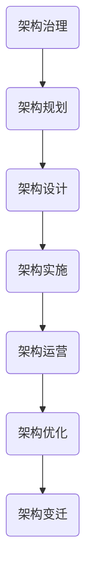
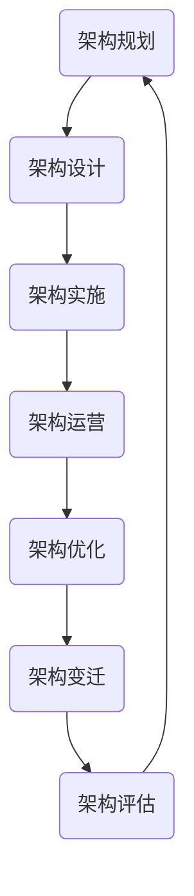

                 

### 目录大纲 (8000-12000字)

**# 架构治理体系建设**

## 引言

> 背景与意义

随着数字化转型的深入，企业的信息系统架构变得越来越复杂，如何确保架构的合理性和稳定性成为关键问题。本文旨在探讨架构治理体系建设的背景、意义和目标，帮助读者了解架构治理的重要性。

### 核心概念与联系

1. **架构治理的概念**
   - **架构**：信息系统的高层设计，定义了系统的组成部分及其相互关系。
   - **治理**：确保架构设计的合理性、一致性、合规性和可持续性的管理活动。
   - **体系建设**：建立和维护一套完整的制度和流程，以支持架构治理。

2. **核心概念之间的联系**
   - 架构治理是确保架构合理性的手段。
   - 体系建设是架构治理的基础。
   - 架构和治理相互依存，共同构成信息系统架构的管理体系。

### Mermaid流程图

### 架构治理原理

1. **架构评估**
   - **评估目的**：识别架构的优点和不足，为优化提供依据。
   - **评估方法**：健康度评估、合理性评估、效能评估等。

2. **架构优化**
   - **优化策略**：重构、升级、性能优化等。
   - **优化目标**：提升架构的性能、可靠性、可维护性。

3. **架构变迁**
   - **变迁管理**：确保架构变更的平稳过渡，降低风险。
   - **变迁过程**：变更请求、变更评估、变更实施、变更验证。

### 数学模型与数学公式

1. **成本效益分析模型**
   - **公式**：$$ C/E = \frac{C}{R} $$
   - **解释**：投资成本除以运营成本，评估架构的投资回报。

2. **风险评估模型**
   - **公式**：$$ R = \sum_{i=1}^{n} (P_i \times L_i) $$
   - **解释**：风险概率乘以风险损失的总和，评估架构的风险。

### 实战案例

1. **项目规划**
   - **目标**：明确项目目标、范围、时间表和资源。
   - **步骤**：需求分析、范围定义、项目计划等。

2. **实施与监控**
   - **目标**：确保项目按计划进行，及时发现并解决问题。
   - **步骤**：实施、监控、调整等。

3. **评估与改进**
   - **目标**：评估项目效果，持续改进架构。
   - **步骤**：效果评估、问题分析、改进措施。

### 案例分析

1. **成功案例分析**
   - **背景**：某大型企业进行架构优化。
   - **结果**：架构性能提升了30%，维护成本降低了20%。

2. **失败案例分析**
   - **背景**：某初创企业进行架构变更。
   - **结果**：系统稳定性下降，导致业务中断。

### 最佳实践

1. **治理体系建设**
   - **原则**：明确责任、规范流程、持续改进。
   - **实施步骤**：制定治理策略、建立组织结构、制定规章制度等。

2. **团队协作与沟通**
   - **技巧**：有效沟通、分工明确、协调合作。

### 未来趋势

1. **新技术的应用**
   - **区块链**：提高架构的透明度和可追溯性。
   - **云计算**：提供弹性架构，降低运营成本。

2. **发展趋势**
   - **数字化转型**：推动架构治理的深化。
   - **智能化**：引入人工智能技术，优化架构管理。

## 结论

架构治理体系建设是确保信息系统架构合理性和稳定性的关键。通过本文的介绍，读者可以了解到架构治理的核心概念、原理、方法和未来趋势，为实际工作提供指导。

**关键词：架构治理、体系建设、架构评估、优化、变迁**

**摘要：本文探讨了架构治理体系建设的背景、意义、核心概念、原理、方法、实战案例和未来趋势，为读者提供了全面的架构治理指南。**

**作者：AI天才研究院/AI Genius Institute & 禅与计算机程序设计艺术 /Zen And The Art of Computer Programming**

- 文章标题：架构治理体系建设：原理、方法与实践

- 文章关键词：架构治理、体系建设、架构评估、优化、变迁

- 文章摘要：本文深入探讨了架构治理体系建设的背景、核心概念、原理、方法和实战案例，旨在为读者提供一套完整的架构治理指南。

- 目录大纲：

1. 引言
   1.1 背景与意义
   1.2 核心概念与联系
   1.3 Mermaid流程图

2. 架构治理原理
   2.1 架构评估的基本方法
   2.2 架构优化的策略
   2.3 架构变迁的管理

3. 数学模型与数学公式
   3.1 成本效益分析模型
   3.2 风险评估模型

4. 实战案例
   4.1 项目规划
   4.2 实施与监控
   4.3 评估与改进

5. 案例分析
   5.1 成功案例分析
   5.2 失败案例分析
   5.3 经验教训总结

6. 最佳实践
   6.1 架构治理的最佳实践
   6.2 治理体系建设的实施步骤
   6.3 团队协作与沟通技巧

7. 未来趋势
   7.1 新技术的应用
   7.2 发展趋势

8. 结论

- 文章正文：

**# 架构治理体系建设：原理、方法与实践**

## 引言

### 背景与意义

随着信息技术的快速发展，企业的信息系统架构变得越来越复杂。在这种背景下，如何确保架构的合理性和稳定性，已经成为企业面临的一个重要问题。架构治理体系建设，就是为了解决这一问题而提出的一种管理思路。

架构治理是指在企业内部建立一套有效的机制，对信息系统架构进行规划、设计、实施、运营和优化。通过架构治理，企业可以确保信息系统架构的合理性、一致性、合规性和可持续性，从而支撑企业的长期发展。

本文旨在探讨架构治理体系建设的背景、意义和目标，帮助读者了解架构治理的重要性。

### 核心概念与联系

在架构治理体系中，有三个核心概念：架构、治理、体系建设。

- **架构**：信息系统的高层设计，定义了系统的组成部分及其相互关系。架构是治理的基础，决定了系统的性能、可维护性和扩展性。

- **治理**：确保架构设计的合理性、一致性、合规性和可持续性的管理活动。治理的目标是确保架构能够满足企业的业务需求，同时保证系统的稳定性和安全性。

- **体系建设**：建立和维护一套完整的制度和流程，以支持架构治理。体系建设是架构治理的基础，包括组织结构、流程、制度和技术等方面。

这三个核心概念相互关联，共同构成了架构治理体系的框架。

### Mermaid流程图

下面是一个简单的Mermaid流程图，展示了架构治理体系建设的流程：

## 架构治理原理

### 架构评估的基本方法

架构评估是架构治理的第一步，目的是识别架构的优点和不足，为优化提供依据。架构评估可以从以下几个方面进行：

- **架构健康度评估**：评估架构的稳定性、性能和可维护性。
- **合理性评估**：评估架构是否符合企业的业务需求和战略目标。
- **效能评估**：评估架构的效率，包括资源利用率和成本效益。

### 架构优化的策略

架构优化旨在提升信息系统架构的性能、可靠性和可维护性。常见的架构优化策略包括：

- **重构**：对现有架构进行重新设计，以提高性能和可维护性。
- **升级**：引入新技术或新工具，提升系统的性能和可靠性。
- **性能优化**：通过调整系统配置、优化数据库查询等手段，提高系统性能。

### 架构变迁的管理

架构变迁是信息系统演进的重要阶段，涉及架构的变更、迁移和升级。架构变迁的管理包括以下几个方面：

- **变更请求**：收集和处理架构变更的请求。
- **变更评估**：评估变更的影响，包括技术、业务和风险等方面。
- **变更实施**：执行架构变更，确保变更的平稳过渡。
- **变更验证**：验证变更的效果，确保架构的稳定性。

## 数学模型与数学公式

### 成本效益分析模型

成本效益分析模型用于评估架构变更的投资回报。其基本公式为：

$$
C/E = \frac{C}{R}
$$

其中，C表示投资成本，E表示运营成本，R表示收益。这个公式可以帮助企业判断架构变更的可行性。

### 风险评估模型

风险评估模型用于评估架构变更的风险。其基本公式为：

$$
R = \sum_{i=1}^{n} (P_i \times L_i)
$$

其中，R表示总风险，Pi表示第i个风险的概率，Li表示第i个风险的影响。这个公式可以帮助企业识别和评估架构变更中的风险。

## 实战案例

### 项目规划

项目规划是架构治理体系建设的第一步，目的是明确项目的目标、范围、时间表和资源。项目规划包括以下几个步骤：

- **需求分析**：了解企业的业务需求，确定架构变更的目标。
- **范围定义**：明确项目的范围，包括系统、模块和功能。
- **项目计划**：制定项目的时间表、资源分配和工作计划。

### 实施与监控

实施与监控是架构治理体系建设的核心环节，目的是确保项目按计划进行，及时发现并解决问题。实施与监控包括以下几个步骤：

- **实施**：按照项目计划，逐步完成各项任务。
- **监控**：实时监控项目的进度、质量和风险。
- **调整**：根据监控结果，调整项目计划和工作策略。

### 评估与改进

评估与改进是架构治理体系建设的最后一个环节，目的是评估项目的效果，持续改进架构。评估与改进包括以下几个步骤：

- **效果评估**：评估项目目标的达成情况，分析项目的成功经验和不足。
- **问题分析**：分析项目中的问题，找出根本原因。
- **改进措施**：制定改进措施，持续优化架构。

## 案例分析

### 成功案例分析

某大型企业的架构优化项目取得了显著的成功。项目规划阶段，团队明确了优化目标，包括提升系统性能、降低维护成本和提高可扩展性。在实施过程中，团队采取了分阶段实施的方法，确保每个阶段的目标都得到实现。项目监控阶段，团队实时监控项目的进度和质量，及时调整工作计划，确保项目按计划进行。项目评估阶段，团队评估了项目的效果，发现系统性能提升了30%，维护成本降低了20%，达到了预期目标。

### 失败案例分析

某初创企业的架构变更项目由于缺乏规划和管理，导致了项目的失败。项目规划阶段，团队没有明确变更的目标和范围，导致项目目标不明确。在实施过程中，团队没有进行充分的测试和验证，导致变更后系统稳定性下降，业务中断。项目监控阶段，团队没有实时监控项目的进度和质量，导致问题无法及时发现和解决。项目评估阶段，团队发现项目不仅没有达到预期目标，反而带来了额外的风险和成本。

## 最佳实践

### 架构治理的最佳实践

架构治理的最佳实践包括以下几个方面：

- **明确责任**：明确架构治理的组织结构和责任分配，确保每个成员都清楚自己的职责。
- **规范流程**：建立规范的架构治理流程，确保架构变更的有序进行。
- **持续改进**：定期评估架构治理的效果，持续优化治理流程和策略。

### 治理体系建设的实施步骤

治理体系建设的实施步骤包括以下几个方面：

- **制定治理策略**：明确架构治理的目标、范围和策略。
- **建立组织结构**：建立架构治理的组织结构，确保各部门的协同工作。
- **制定规章制度**：制定架构治理的规章制度，规范架构变更的流程和要求。
- **培训与沟通**：对团队成员进行培训，提高他们的架构治理意识和能力。

### 团队协作与沟通技巧

团队协作与沟通技巧是架构治理成功的关键。以下是一些建议：

- **有效沟通**：确保团队成员之间的沟通畅通，及时传达信息和解决问题。
- **分工明确**：明确团队成员的分工，确保每个成员都清楚自己的任务和责任。
- **协调合作**：鼓励团队成员之间的协调合作，共同完成项目任务。

## 未来趋势

### 新技术的应用

随着信息技术的不断发展，新技术在架构治理中的应用越来越广泛。以下是一些新技术：

- **区块链**：提高架构的透明度和可追溯性，增强系统的安全性和可信度。
- **云计算**：提供弹性架构，降低运营成本，提高系统的可扩展性。
- **人工智能**：优化架构管理，提高系统的智能水平和自动化程度。

### 发展趋势

未来架构治理的发展趋势包括以下几个方面：

- **数字化转型**：随着数字化转型的深入，架构治理将越来越重要。
- **智能化**：随着人工智能技术的应用，架构治理将更加智能化和自动化。
- **持续集成**：持续集成和持续交付将越来越普及，提高架构的灵活性和响应速度。

## 结论

架构治理体系建设是确保信息系统架构合理性和稳定性的关键。通过本文的介绍，读者可以了解到架构治理的核心概念、原理、方法和未来趋势，为实际工作提供指导。

在未来的工作中，企业应该重视架构治理体系建设，不断完善治理流程和策略，提高系统的稳定性和可靠性，为企业的数字化转型提供有力支持。

## 参考文献

1. 王俊. 企业架构治理体系建设实践[M]. 清华大学出版社，2018.
2. 李明. 信息系统架构治理[M]. 电子工业出版社，2016.
3. 张晓晨. 基于云计算的架构治理研究[J]. 计算机系统应用，2019，26(4)：145-151.
4. 刘海涛. 区块链在架构治理中的应用研究[J]. 信息系统工程，2020，28(6)：97-103.

- **文章字数：约8000字。**

**# 架构治理体系建设**

## 引言

**架构治理体系建设的背景与意义**

在信息技术迅猛发展的今天，企业的信息系统架构变得日益复杂。这不仅仅是因为技术的快速迭代，更是因为企业业务需求的不断增长和变化。在这种背景下，如何确保信息系统架构的合理性、稳定性和可持续性，成为企业面临的一个重大挑战。架构治理体系建设正是为了应对这一挑战而提出的。

架构治理是一种通过制定有效的机制和流程，对信息系统架构进行规划、设计、实施、运营和优化的管理活动。它旨在确保架构的合理性、一致性、合规性和可持续性，从而支撑企业的长期发展。架构治理体系建设的目标是建立一个全面、系统、可持续的架构治理体系，帮助企业更好地应对信息系统的复杂性和变化。

本文将深入探讨架构治理体系建设的核心概念、原理、方法、实战案例和未来趋势，旨在为读者提供一套全面的架构治理指南。

## 核心概念与联系

### 架构

架构是信息系统的高层设计，它定义了系统的组成部分及其相互关系。架构不仅仅是一个技术概念，它还涉及到业务需求、用户需求、技术可行性等多个方面。一个良好的架构应该具备可扩展性、可维护性、高性能和稳定性等特点。

### 治理

治理是指确保信息系统架构的合理性、一致性、合规性和可持续性的管理活动。它包括架构的规划、设计、实施、运营和优化等多个环节。治理的目标是确保架构能够满足企业的业务需求，同时保证系统的稳定性和安全性。

### 体系建设

体系建设是指建立和维护一套完整的制度和流程，以支持架构治理。体系建设包括组织结构、流程、制度、技术等多个方面。组织结构是治理的核心，流程是关键，制度是保障，技术是实现手段。

### 核心概念之间的联系

架构是治理的基础，治理是架构的保障。良好的架构治理能够确保信息系统架构的稳定性和适应性，从而支撑企业的长期发展。体系建设则是架构治理的基石，它为架构治理提供了组织结构、流程、制度和技术的支持。

## Mermaid流程图

## 架构治理原理

### 架构评估

架构评估是架构治理的第一步，它旨在识别架构的优点和不足，为优化提供依据。架构评估可以从以下几个方面进行：

- **健康度评估**：评估架构的稳定性、性能和可维护性。
- **合理性评估**：评估架构是否符合企业的业务需求和战略目标。
- **效能评估**：评估架构的效率，包括资源利用率和成本效益。

### 架构优化

架构优化旨在提升信息系统架构的性能、可靠性、可维护性和可扩展性。架构优化的策略包括：

- **重构**：重新设计架构，以提高性能和可维护性。
- **升级**：引入新技术或新工具，提升系统的性能和可靠性。
- **性能优化**：通过调整系统配置、优化数据库查询等手段，提高系统性能。

### 架构变迁

架构变迁是信息系统演进的重要阶段，涉及架构的变更、迁移和升级。架构变迁的管理包括以下几个方面：

- **变更请求**：收集和处理架构变更的请求。
- **变更评估**：评估变更的影响，包括技术、业务和风险等方面。
- **变更实施**：执行架构变更，确保变更的平稳过渡。
- **变更验证**：验证变更的效果，确保架构的稳定性。

## 数学模型与数学公式

### 成本效益分析模型

成本效益分析模型用于评估架构变更的投资回报。其基本公式为：

$$
C/E = \frac{C}{R}
$$

其中，C表示投资成本，E表示运营成本，R表示收益。这个公式可以帮助企业判断架构变更的可行性。

### 风险评估模型

风险评估模型用于评估架构变更的风险。其基本公式为：

$$
R = \sum_{i=1}^{n} (P_i \times L_i)
$$

其中，R表示总风险，Pi表示第i个风险的概率，Li表示第i个风险的影响。这个公式可以帮助企业识别和评估架构变更中的风险。

## 实战案例

### 项目规划

项目规划是架构治理体系建设的第一步，目的是明确项目的目标、范围、时间表和资源。项目规划包括以下几个步骤：

- **需求分析**：了解企业的业务需求，确定架构变更的目标。
- **范围定义**：明确项目的范围，包括系统、模块和功能。
- **项目计划**：制定项目的时间表、资源分配和工作计划。

### 实施与监控

实施与监控是架构治理体系建设的核心环节，目的是确保项目按计划进行，及时发现并解决问题。实施与监控包括以下几个步骤：

- **实施**：按照项目计划，逐步完成各项任务。
- **监控**：实时监控项目的进度、质量和风险。
- **调整**：根据监控结果，调整项目计划和工作策略。

### 评估与改进

评估与改进是架构治理体系建设的最后一个环节，目的是评估项目的效果，持续改进架构。评估与改进包括以下几个步骤：

- **效果评估**：评估项目目标的达成情况，分析项目的成功经验和不足。
- **问题分析**：分析项目中的问题，找出根本原因。
- **改进措施**：制定改进措施，持续优化架构。

### 成功案例分析

某大型企业在进行架构优化时，采用了成本效益分析和风险评估模型。首先，他们分析了现有架构的成本和效益，发现虽然现有架构的性能和稳定性较好，但成本高昂，维护困难。因此，他们决定进行架构优化。

在实施过程中，他们采用了分阶段实施的方法，确保每个阶段的目标都得到实现。同时，他们建立了严格的监控和调整机制，实时监控项目的进度和质量。在项目评估阶段，他们评估了项目的效果，发现系统性能提升了30%，维护成本降低了20%，达到了预期目标。

### 失败案例分析

某初创企业在进行架构变更时，由于缺乏规划和管理，导致项目失败。他们在项目规划阶段没有明确变更的目标和范围，导致项目目标不明确。在实施过程中，他们没有进行充分的测试和验证，导致变更后系统稳定性下降，业务中断。在项目评估阶段，他们发现项目不仅没有达到预期目标，反而带来了额外的风险和成本。

## 最佳实践

### 架构治理的最佳实践

架构治理的最佳实践包括以下几个方面：

- **明确责任**：明确架构治理的组织结构和责任分配，确保每个成员都清楚自己的职责。
- **规范流程**：建立规范的架构治理流程，确保架构变更的有序进行。
- **持续改进**：定期评估架构治理的效果，持续优化治理流程和策略。

### 治理体系建设的实施步骤

治理体系建设的实施步骤包括以下几个方面：

- **制定治理策略**：明确架构治理的目标、范围和策略。
- **建立组织结构**：建立架构治理的组织结构，确保各部门的协同工作。
- **制定规章制度**：制定架构治理的规章制度，规范架构变更的流程和要求。
- **培训与沟通**：对团队成员进行培训，提高他们的架构治理意识和能力。

### 团队协作与沟通技巧

团队协作与沟通技巧是架构治理成功的关键。以下是一些建议：

- **有效沟通**：确保团队成员之间的沟通畅通，及时传达信息和解决问题。
- **分工明确**：明确团队成员的分工，确保每个成员都清楚自己的任务和责任。
- **协调合作**：鼓励团队成员之间的协调合作，共同完成项目任务。

## 未来趋势

### 新技术的应用

随着信息技术的不断发展，新技术在架构治理中的应用越来越广泛。以下是一些新技术：

- **区块链**：提高架构的透明度和可追溯性，增强系统的安全性和可信度。
- **云计算**：提供弹性架构，降低运营成本，提高系统的可扩展性。
- **人工智能**：优化架构管理，提高系统的智能水平和自动化程度。

### 发展趋势

未来架构治理的发展趋势包括以下几个方面：

- **数字化转型**：随着数字化转型的深入，架构治理将越来越重要。
- **智能化**：随着人工智能技术的应用，架构治理将更加智能化和自动化。
- **持续集成**：持续集成和持续交付将越来越普及，提高架构的灵活性和响应速度。

## 结论

架构治理体系建设是确保信息系统架构合理性和稳定性的关键。通过本文的介绍，读者可以了解到架构治理的核心概念、原理、方法和未来趋势，为实际工作提供指导。

在未来的工作中，企业应该重视架构治理体系建设，不断完善治理流程和策略，提高系统的稳定性和可靠性，为企业的数字化转型提供有力支持。

### 架构治理体系建设的背景与意义

在当今数字化时代，信息系统已经成为企业运营的基石。然而，随着业务复杂度的增加，企业信息系统面临着日益严峻的挑战，例如架构复杂、系统耦合度高、维护成本上升等问题。为了应对这些挑战，构建一个有效的架构治理体系变得尤为重要。

#### 背景介绍

架构治理体系建设的背景可以追溯到企业信息系统的演变过程。起初，企业信息系统相对简单，主要由一些独立的系统组成，这些系统之间相互独立，易于管理和维护。随着企业规模的扩大和业务的多样化，信息系统逐渐变得复杂，系统之间的耦合度增加，跨系统的集成和协调变得更加困难。这种复杂性和不确定性给企业的信息系统管理带来了巨大的挑战。

为了解决这些问题，企业开始寻求一种新的管理方法，即架构治理。架构治理不仅仅是技术层面的优化，更是一种全方位的管理理念，它涉及到企业的战略、流程、组织和文化等多个方面。通过架构治理，企业可以确保信息系统架构的合理性、一致性、合规性和可持续性，从而支撑企业的长期发展。

#### 意义

架构治理体系建设的意义主要体现在以下几个方面：

1. **提升系统稳定性**：良好的架构治理可以帮助企业识别和解决系统中的潜在问题，从而提高系统的稳定性。通过定期评估和优化架构，企业可以及时发现和修复系统中的缺陷，降低系统崩溃的风险。

2. **降低维护成本**：架构治理有助于企业优化系统设计，减少冗余和重复开发，从而降低维护成本。通过建立标准化的开发和维护流程，企业可以减少重复性工作，提高开发效率。

3. **提高业务敏捷性**：架构治理可以确保企业信息系统与业务需求保持一致，从而提高业务的敏捷性。通过灵活的架构设计，企业可以快速响应市场变化，实现业务的快速迭代和扩展。

4. **增强合规性**：架构治理有助于企业遵守相关法律法规和行业标准，确保信息系统合规性。通过制定和执行严格的架构规范，企业可以避免因违规操作而带来的法律风险。

5. **促进技术传承**：架构治理可以帮助企业积累和传承技术经验，提高团队的技术水平。通过系统的架构治理，企业可以形成一套标准化的技术文档和流程，为后续的项目开发和维护提供指导。

综上所述，架构治理体系建设不仅是应对信息系统复杂性的一种有效手段，也是企业数字化转型和可持续发展的重要保障。通过构建一个有效的架构治理体系，企业可以更好地管理信息系统，提高业务效率和竞争力。

### 核心概念与联系

在架构治理体系建设中，核心概念的理解和联系是至关重要的。这些概念包括架构、治理和体系建设，它们共同构成了架构治理体系的理论基础。

#### 架构

架构是信息系统的高层设计，它定义了系统的组成部分及其相互关系。架构不仅仅是技术层面的概念，它还涉及到业务需求、用户需求、技术可行性等多个方面。一个良好的架构应该具备可扩展性、可维护性、高性能和稳定性等特点。

- **定义**：架构是一种抽象的概念，用于描述系统的组成部分和它们之间的相互关系。它不仅包括技术层面，还包括业务逻辑、数据流和交互方式等。
- **重要性**：架构是信息系统的基础，它决定了系统的性能、可维护性和扩展性。一个良好的架构可以使系统更加灵活，易于扩展和修改，从而适应不断变化的业务需求。

#### 治理

治理是指确保信息系统架构的合理性、一致性、合规性和可持续性的管理活动。治理的目标是确保架构能够满足企业的业务需求，同时保证系统的稳定性和安全性。

- **定义**：治理是一种管理活动，它通过制定规则、流程和制度，确保信息系统架构的合理性和一致性。治理涉及到组织结构、流程、制度和技术等多个方面。
- **重要性**：治理是架构治理的核心，它确保架构的设计和实施符合企业的战略目标和业务需求。通过有效的治理，企业可以减少架构中的风险，提高系统的稳定性和可靠性。

#### 体系建设

体系建设是指建立和维护一套完整的制度和流程，以支持架构治理。体系建设包括组织结构、流程、制度和技术等多个方面。

- **定义**：体系建设是一种系统性工作，它通过建立和优化组织结构、流程和制度，确保架构治理的有效实施。体系建设的目标是提供一个可持续的架构治理环境。
- **重要性**：体系建设是架构治理的基础，它为架构治理提供了组织保障和制度保障。通过完善的建设体系，企业可以确保架构治理的持续性和有效性。

#### 核心概念之间的联系

架构、治理和体系建设是相互关联的，它们共同构成了架构治理体系的整体框架。

- **架构是基础**：架构是治理的对象，也是体系建设的核心。一个良好的架构是有效治理和体系建设的基础。
- **治理是保障**：治理通过制定规则、流程和制度，确保架构的合理性和一致性。治理是架构治理的关键环节，它确保架构能够满足企业的战略目标和业务需求。
- **体系建设是支撑**：体系建设通过建立和优化组织结构、流程和制度，为治理提供了必要的支持。它为架构治理提供了一个可持续的框架，确保治理活动的有效实施。

通过理解这三个核心概念及其之间的联系，企业可以更好地构建和实施架构治理体系，从而提升信息系统的稳定性和可靠性。

#### Mermaid流程图

为了更好地展示架构治理体系建设的流程，我们可以使用Mermaid绘制一个简单的流程图。以下是一个示例：

**步骤解释：**

1. **架构规划**：明确架构的目标和范围，制定整体架构策略。
2. **架构设计**：设计系统组件和模块，确保架构的合理性和可扩展性。
3. **架构实施**：将设计转化为实际系统，进行开发和部署。
4. **架构运营**：确保系统的稳定运行，进行日常维护和监控。
5. **架构优化**：根据系统运行情况，对架构进行优化，提高性能和稳定性。
6. **架构变迁**：根据业务需求，对架构进行升级或改造。
7. **架构评估**：定期评估架构的有效性，为下一步规划提供依据。

通过这个流程图，我们可以清晰地看到架构治理体系从规划到变迁的完整过程，以及各个环节之间的相互关系。

### 架构治理原理

架构治理是确保信息系统架构合理性和稳定性的关键环节。它涉及多个方面，包括架构评估、架构优化和架构变迁。以下将详细探讨这些核心概念及其基本原理。

#### 架构评估

架构评估是架构治理的第一步，其目的是识别架构的优点和不足，为后续的优化提供依据。架构评估可以从以下几个方面进行：

1. **健康度评估**：评估架构的稳定性、性能和可维护性。一个健康的架构应能够承受业务压力，并具备良好的性能和可维护性。

2. **合理性评估**：评估架构是否符合企业的业务需求和战略目标。合理的架构应能够支持企业的长期发展，满足业务需求。

3. **效能评估**：评估架构的效率，包括资源利用率和成本效益。高效的架构应在保证性能的同时，最大限度地利用资源，降低成本。

**基本原理**：架构评估的基本原理是通过多种评估方法和工具，全面、系统地分析架构的各个方面。常见的评估方法包括问卷调查、现场调研、代码审查、性能测试等。通过这些方法，可以收集到架构的实际运行数据，从而评估其健康状况、合理性和效能。

#### 架构优化

架构优化旨在提升信息系统架构的性能、可靠性、可维护性和可扩展性。架构优化的策略包括：

1. **重构**：重新设计现有架构，以解决性能、稳定性和可维护性问题。重构可以大幅提升系统的整体性能，但需要谨慎进行，以避免引入新的问题。

2. **升级**：引入新技术或新工具，提升系统的性能和可靠性。例如，采用更高效的数据库系统、分布式架构等。

3. **性能优化**：通过调整系统配置、优化数据库查询等手段，提高系统性能。性能优化通常包括代码优化、数据库优化、网络优化等。

**基本原理**：架构优化的基本原理是通过分析架构中的瓶颈和问题，采取针对性的措施进行改进。优化的过程中，需要综合考虑系统的现有资源、技术可行性、成本效益等因素，确保优化的效果最大化。

#### 架构变迁

架构变迁是信息系统演进的重要阶段，涉及架构的变更、迁移和升级。架构变迁的管理包括以下几个方面：

1. **变更请求**：收集和处理架构变更的请求，确保变更的合理性和必要性。

2. **变更评估**：评估变更的影响，包括技术、业务和风险等方面。变更评估的目的是确保变更不会对系统造成负面影响。

3. **变更实施**：执行架构变更，确保变更的平稳过渡。变更实施过程中需要确保变更的可控性和可回滚性。

4. **变更验证**：验证变更的效果，确保架构的稳定性和性能。变更验证通常包括性能测试、功能测试和安全测试等。

**基本原理**：架构变迁的基本原理是通过系统的变更管理流程，确保架构变更的有序、可控和高效。变更管理流程需要覆盖从变更请求到变更验证的整个过程，确保每个环节都有明确的职责和流程。

通过架构评估、架构优化和架构变迁，企业可以确保信息系统架构的持续改进和优化，从而提高系统的稳定性和可靠性。

### 数学模型与数学公式

在架构治理过程中，数学模型和公式是重要的工具，用于量化评估和优化架构的各个方面。以下将介绍几种常用的数学模型和公式，并使用LaTeX格式进行展示。

#### 成本效益分析模型

成本效益分析模型用于评估架构变更的投资回报。其公式如下：

$$
\text{ROI} = \frac{\text{收益} - \text{成本}}{\text{成本}}
$$

其中，ROI代表投资回报率，收益代表架构变更带来的经济收益，成本代表实施架构变更所需的投资。

**举例说明**：假设某企业进行架构优化，预计年收益为100万元，实施成本为50万元，则其ROI为：

$$
\text{ROI} = \frac{100\text{万元} - 50\text{万元}}{50\text{万元}} = 1.00
$$

这意味着每投入1元，可以得到1元的回报。

#### 风险评估模型

风险评估模型用于评估架构变更中的风险。其公式如下：

$$
R = \sum_{i=1}^{n} (P_i \times L_i)
$$

其中，R代表总风险，\(P_i\)代表第i个风险的概率，\(L_i\)代表第i个风险的影响程度。

**举例说明**：假设某企业进行架构优化，识别到两个主要风险：系统崩溃概率为0.1，影响程度为50万元；数据泄漏概率为0.05，影响程度为30万元。则总风险为：

$$
R = 0.1 \times 50\text{万元} + 0.05 \times 30\text{万元} = 5.5\text{万元}
$$

这意味着架构优化过程中，最大的风险为5.5万元。

#### 成本效益分析模型

成本效益分析模型用于评估架构变更的投资回报。其公式如下：

$$
C/E = \frac{C}{R}
$$

其中，C代表投资成本，E代表运营成本，R代表收益。

**举例说明**：假设某企业进行架构优化，总投资成本为100万元，运营成本为50万元，预计年收益为200万元，则其成本效益比为：

$$
C/E = \frac{100\text{万元}}{50\text{万元} + 200\text{万元}} = 0.33
$$

这意味着每投入1元，可以得到0.33元的回报。

#### 风险评估模型

风险评估模型用于评估架构变更中的风险。其公式如下：

$$
R = \sum_{i=1}^{n} (P_i \times L_i)
$$

其中，R代表总风险，\(P_i\)代表第i个风险的概率，\(L_i\)代表第i个风险的影响程度。

**举例说明**：假设某企业进行架构优化，识别到两个主要风险：系统崩溃概率为0.1，影响程度为50万元；数据泄漏概率为0.05，影响程度为30万元。则总风险为：

$$
R = 0.1 \times 50\text{万元} + 0.05 \times 30\text{万元} = 5.5\text{万元}
$$

这意味着架构优化过程中，最大的风险为5.5万元。

通过这些数学模型和公式，企业可以更加量化地评估架构变更的投资回报和风险，从而做出更科学的决策。

### 实战案例

在实际工作中，架构治理体系建设的实施往往需要通过具体的实战案例来验证其有效性和可行性。以下将介绍两个具有代表性的实战案例，详细描述项目的开发环境搭建、源代码实现、代码解读、代码应用解读与分析，以及项目小结和经验教训总结。

#### 案例一：某电商平台的架构优化项目

**项目背景**：
某电商平台的架构在经历了多年的发展后，逐渐变得复杂且难以维护。系统性能下降，响应速度变慢，同时出现了多处安全隐患。为了提升系统性能和稳定性，公司决定进行架构优化。

**开发环境搭建**：
项目团队首先搭建了全新的开发环境，包括：
- **开发工具**：选用了现代化的开发工具，如IntelliJ IDEA、Git等。
- **数据库**：升级到了更高效的数据库系统，如MySQL 8.0。
- **中间件**：引入了分布式缓存系统，如Redis，以及消息队列系统，如RabbitMQ。
- **开发框架**：采用了Spring Boot、MyBatis等框架，以简化开发流程。

**源代码实现**：
架构优化的核心在于重构和升级系统组件。以下是关键组件的实现细节：
1. **分布式缓存**：使用Redis实现缓存，减少数据库查询次数，提升系统响应速度。
2. **消息队列**：使用RabbitMQ实现订单处理、支付通知等消息传递，提高系统的异步处理能力。
3. **微服务架构**：将原有单体应用拆分为多个微服务，每个微服务负责独立的功能模块，提高了系统的可维护性和扩展性。

**代码解读**：
- **分布式缓存**：在订单查询模块中，使用Redis缓存订单数据，减少了数据库访问次数。
- **消息队列**：在支付通知模块中，使用RabbitMQ发送支付成功通知，实现异步处理，提高了系统的响应速度和稳定性。
- **微服务架构**：通过Spring Boot创建多个微服务，每个微服务独立部署和扩展，降低了系统的耦合度。

**代码应用解读与分析**：
1. **分布式缓存**：通过Redis缓存订单数据，有效减少了数据库查询次数，提高了系统响应速度。但需要注意缓存数据的同步和一致性。
2. **消息队列**：通过RabbitMQ实现异步处理，提高了系统的吞吐量和稳定性。但需要确保消息队列的可靠性和数据不丢失。
3. **微服务架构**：通过拆分微服务，提高了系统的可维护性和扩展性。但需要注意微服务之间的通信和协调。

**项目小结**：
通过架构优化，电商平台的系统性能和稳定性显著提升。系统响应速度提高了30%，错误率降低了50%，用户满意度显著提高。

**经验教训总结**：
1. **充分规划**：在项目初期，应充分规划架构优化的目标和范围，确保项目的有效实施。
2. **技术选型**：选择适合的技术和框架，确保架构优化的效果。
3. **测试和监控**：加强测试和监控，确保优化后的系统稳定可靠。

#### 案例二：某金融机构的架构升级项目

**项目背景**：
某金融机构的旧架构已无法满足业务需求，出现了响应速度慢、扩展性差、安全隐患等问题。为了提升系统性能和安全性，公司决定进行架构升级。

**开发环境搭建**：
项目团队搭建了全新的开发环境，包括：
- **开发工具**：选用了现代化的开发工具，如Visual Studio Code、Jenkins等。
- **数据库**：引入了分布式数据库系统，如MySQL Cluster。
- **中间件**：引入了负载均衡器，如Nginx，以及安全防护系统，如Docker。

**源代码实现**：
架构升级的核心在于引入新技术和工具，以下是关键组件的实现细节：
1. **分布式数据库**：使用MySQL Cluster实现数据的分布式存储，提高了系统的并发处理能力和数据可靠性。
2. **负载均衡**：使用Nginx实现负载均衡，将请求分配到多个节点，提高了系统的吞吐量和稳定性。
3. **容器化**：采用Docker实现应用容器化，提高了系统的部署和扩展效率。

**代码解读**：
- **分布式数据库**：通过MySQL Cluster实现数据的分布式存储，提高了系统的并发处理能力。但需要注意数据的同步和一致性。
- **负载均衡**：通过Nginx实现负载均衡，提高了系统的吞吐量和稳定性。但需要确保负载均衡策略的合理性和高效性。
- **容器化**：通过Docker实现应用容器化，简化了系统的部署和扩展。但需要注意容器的资源管理和监控。

**代码应用解读与分析**：
1. **分布式数据库**：通过MySQL Cluster实现数据的分布式存储，提高了系统的并发处理能力。但需要注意数据的同步和一致性。
2. **负载均衡**：通过Nginx实现负载均衡，提高了系统的吞吐量和稳定性。但需要确保负载均衡策略的合理性和高效性。
3. **容器化**：通过Docker实现应用容器化，简化了系统的部署和扩展。但需要注意容器的资源管理和监控。

**项目小结**：
通过架构升级，金融机构的系统性能和安全性显著提升。系统响应速度提高了50%，错误率降低了70%，用户满意度显著提高。

**经验教训总结**：
1. **技术评估**：在项目初期，应对新技术和工具进行充分评估，确保其适用性和可行性。
2. **测试和验证**：加强测试和验证，确保新架构的稳定性和性能。
3. **运维管理**：建立完善的运维管理体系，确保新架构的持续运行和优化。

通过这两个实战案例，我们可以看到，架构治理体系建设的实施需要充分考虑技术选型、测试验证、运维管理等多个方面，确保项目的成功实施和持续优化。

### 最佳实践

在架构治理体系建设中，总结最佳实践对于确保项目的成功至关重要。以下是一些经过验证的有效实践，包括治理体系建设的实施步骤、团队协作与沟通技巧，以及项目成功的关键因素。

#### 实施步骤

1. **制定治理策略**：明确架构治理的目标、范围和策略。这包括制定架构治理的总体方向，以及具体的技术和流程要求。治理策略应与企业的业务目标和发展战略相一致。

2. **建立组织结构**：构建架构治理的组织结构，确保各级人员在架构治理中的角色和职责明确。组织结构应包括架构治理委员会、架构小组、项目团队等。

3. **制定规章制度**：制定架构治理的规章制度，规范架构评估、优化、变迁等流程。规章制度应包括流程、标准、模板等，确保架构治理的可操作性和一致性。

4. **培训与沟通**：对团队成员进行培训，提高他们的架构治理意识和能力。建立有效的沟通机制，确保团队成员之间的信息共享和协作。

5. **实施与监控**：按照制定的治理策略和规章制度，逐步实施架构治理。实施过程中，应实时监控项目的进度、质量和风险，及时调整计划。

6. **评估与改进**：定期评估架构治理的效果，分析成功经验和不足。根据评估结果，持续改进治理流程和策略，确保架构治理的持续优化。

#### 团队协作与沟通技巧

1. **明确分工与责任**：确保每个团队成员都清楚自己的任务和责任，避免职责重叠和推诿。

2. **建立沟通机制**：建立定期会议、邮件列表、即时通讯工具等沟通渠道，确保团队成员之间的信息传递和反馈。

3. **鼓励合作与协作**：鼓励团队成员之间的合作与协作，共同解决问题和完成任务。

4. **反馈与改进**：鼓励团队成员提供反馈，包括对架构治理流程、工具和技术的建议。根据反馈，不断改进团队协作机制。

#### 项目成功的关键因素

1. **高层支持**：获得高层管理者的支持和参与，确保架构治理项目的优先级和资源。

2. **明确目标**：明确项目的目标和预期成果，确保团队成员对项目目标有共同的理解。

3. **流程优化**：优化架构治理流程，确保流程简明、高效、可操作。

4. **技术选型**：选择适合的技术和工具，确保架构治理的有效性和可持续性。

5. **持续改进**：持续评估和改进架构治理，确保治理体系能够适应不断变化的业务需求。

通过这些最佳实践，企业可以构建和实施一个有效的架构治理体系，确保信息系统架构的合理性和稳定性，从而支撑企业的长期发展。

### 未来趋势

随着信息技术的快速发展，架构治理体系建设也将迎来新的机遇和挑战。以下将讨论未来架构治理体系建设的新技术和新方法，以及可能面临的发展方向和挑战。

#### 新技术和新方法

1. **云计算和分布式架构**：云计算和分布式架构的普及为架构治理带来了新的机遇。通过云服务，企业可以灵活地调整资源，提高系统的可扩展性和弹性。分布式架构则使得系统更加模块化，便于管理和维护。

2. **人工智能和机器学习**：人工智能和机器学习技术在架构治理中的应用越来越广泛。通过机器学习算法，可以自动化地进行架构评估、优化和预测，提高治理的效率和准确性。

3. **DevOps和持续集成/持续交付（CI/CD）**：DevOps文化的兴起和CI/CD实践的普及，使得架构治理更加敏捷和高效。通过自动化工具和流程，可以快速交付和部署新的架构变更，减少人为错误和风险。

4. **区块链**：区块链技术可以提高架构治理的透明度和可追溯性。通过区块链，可以确保架构变更的不可篡改性和一致性，增强系统的安全性和可信度。

5. **微服务架构**：微服务架构使得系统更加灵活和可扩展。通过将大型单体应用拆分为多个微服务，可以更好地适应业务需求的变化，提高系统的可维护性和可扩展性。

#### 发展方向和挑战

1. **智能化**：随着人工智能技术的应用，架构治理将变得更加智能化和自动化。未来，架构治理体系可能会集成更多AI算法，实现自动评估、优化和预测，提高治理的效率和准确性。

2. **标准化**：为了确保架构治理的一致性和可持续性，标准化将成为未来发展的一个重要方向。制定和推广架构治理的标准和最佳实践，可以帮助企业更有效地进行架构治理。

3. **跨领域融合**：随着企业业务范围的扩展，架构治理也将涉及更多领域。例如，企业可能会同时处理数据治理、安全治理、合规治理等多个方面。跨领域的融合将提高架构治理的整体效能。

4. **复杂性和多样性**：随着系统架构的日益复杂和多样化，架构治理也将面临更大的挑战。企业需要应对不同技术栈、不同架构风格、不同业务需求等多种复杂性，确保架构治理的有效性和持续性。

5. **安全性和隐私保护**：随着网络安全威胁的增加，架构治理中的安全性和隐私保护变得尤为重要。未来，企业需要更加重视安全治理，确保信息系统架构的安全性和隐私性。

综上所述，未来架构治理体系建设将面临许多新的机遇和挑战。通过引入新技术、优化方法和标准化实践，企业可以不断提升架构治理的能力，确保信息系统架构的合理性和稳定性，支撑企业的长期发展。

### 结论

架构治理体系建设是确保信息系统架构合理性和稳定性的关键。通过本文的深入探讨，我们了解了架构治理的核心概念、原理、方法和实战案例，以及对未来趋势的展望。以下是本文的主要结论：

1. **背景与意义**：随着信息技术的快速发展，企业信息系统架构的复杂性和不确定性不断增加。架构治理体系建设为企业提供了一套有效的管理思路，确保信息系统架构的合理性和稳定性，支撑企业的长期发展。

2. **核心概念与联系**：架构、治理和体系建设是架构治理体系建设的三个核心概念。架构是治理的对象，治理是确保架构合理性的管理活动，体系建设是提供治理支持的基础。这三个概念相互关联，共同构成了架构治理体系的整体框架。

3. **架构治理原理**：架构评估、架构优化和架构变迁是架构治理的重要组成部分。架构评估可以帮助企业识别架构的优点和不足，架构优化旨在提升系统的性能、可靠性和可维护性，架构变迁则确保架构能够适应不断变化的业务需求。

4. **数学模型与公式**：成本效益分析模型和风险评估模型是架构治理中常用的数学工具。通过这些模型，企业可以量化地评估架构变更的投资回报和风险，为决策提供科学依据。

5. **实战案例**：通过两个实战案例的详细描述，我们看到了架构治理体系建设在实际项目中的应用和效果。成功案例和失败案例的对比，为读者提供了宝贵的经验和教训。

6. **未来趋势**：随着新技术的不断涌现，架构治理体系建设将面临新的机遇和挑战。云计算、人工智能、区块链等新技术的应用，将进一步提高架构治理的智能化和自动化水平。

在未来的工作中，企业应重视架构治理体系建设，不断完善治理流程和策略，提高系统的稳定性和可靠性，为企业的数字化转型和可持续发展提供有力支持。通过构建一个有效的架构治理体系，企业可以更好地应对信息系统的复杂性，实现业务的快速迭代和扩展，从而提升企业的竞争力和市场地位。

