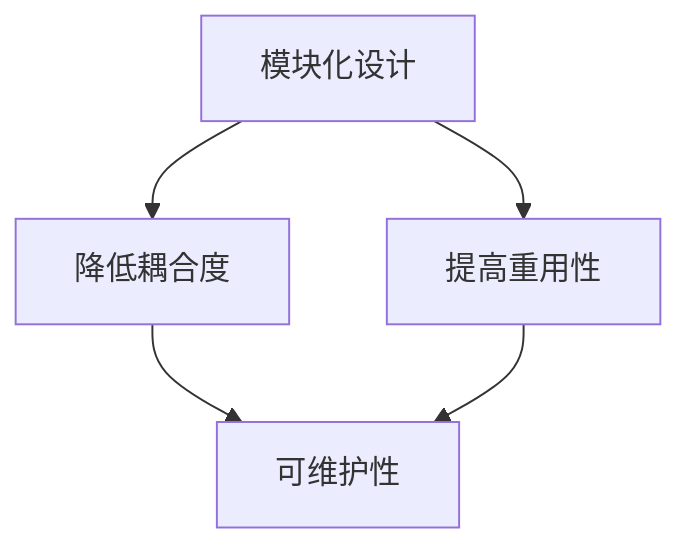
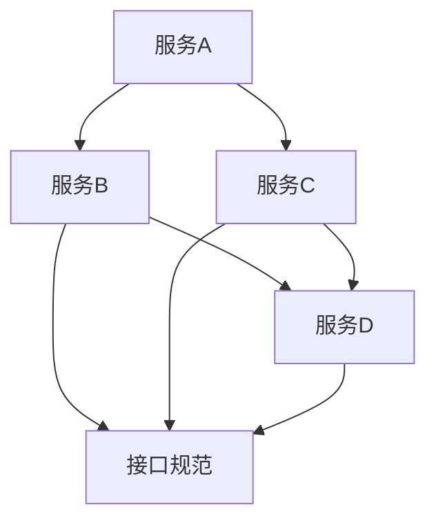
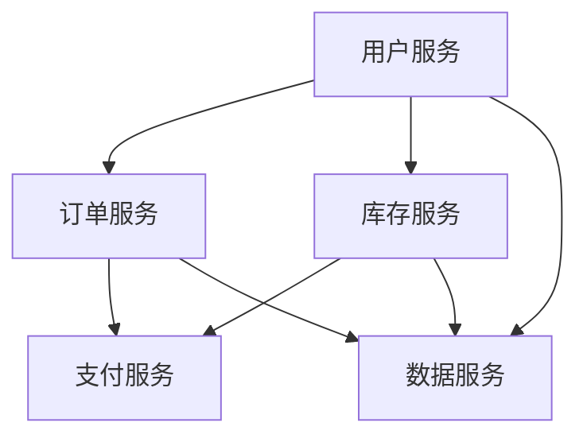
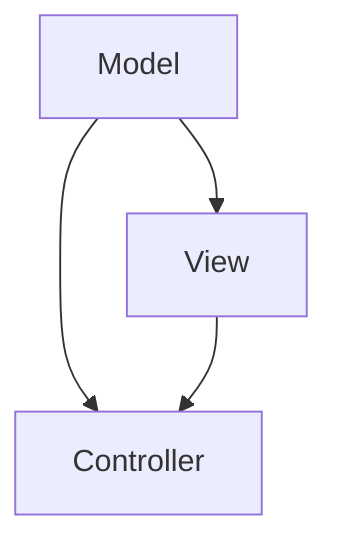
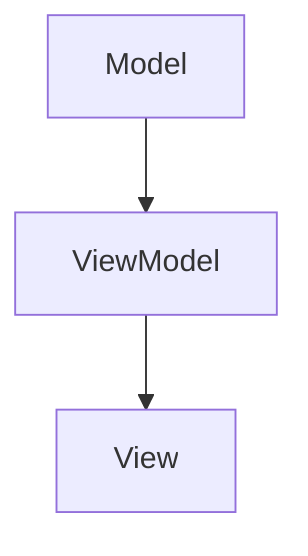
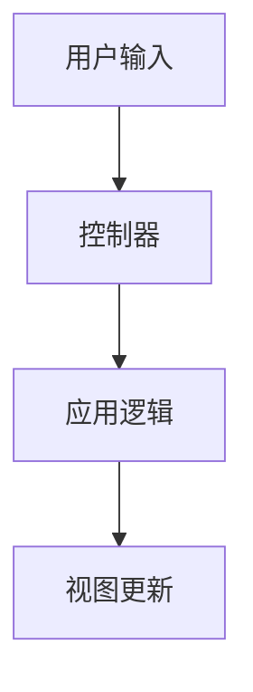
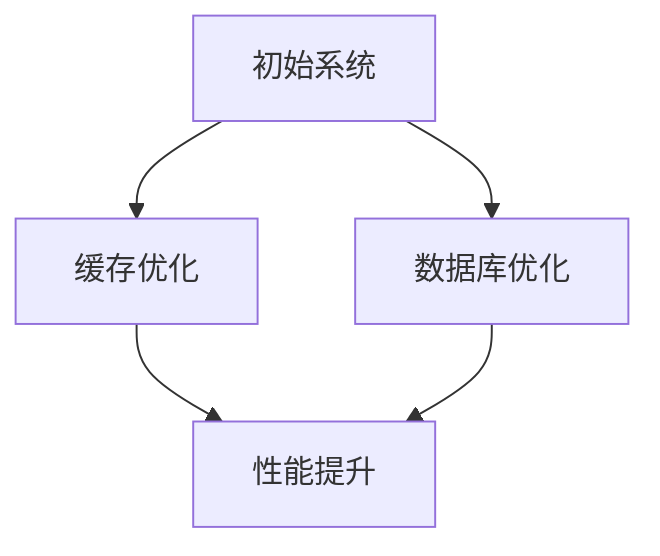
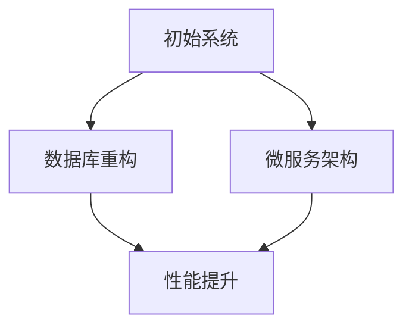
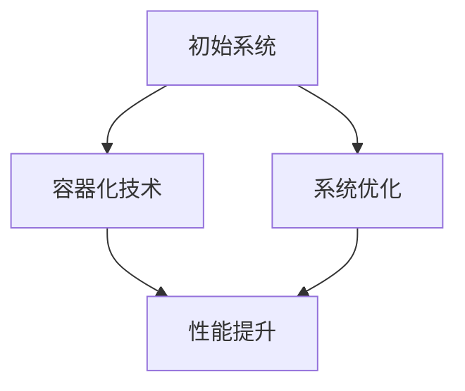

                 


### 文章标题: 架构演进是场持久战

> 关键词：架构演进、持久战、技术、设计模式、成功案例分析

> 摘要：本文深入探讨了架构演进的概念、重要性及其在IT领域中的应用。通过详细的案例分析，揭示了架构演进过程中的挑战与应对策略，旨在为开发者提供清晰的理论基础和实践指南。

### 引言

#### 架构演进的概念

架构演进是指在软件系统开发和维护过程中，随着时间和环境的变化，对系统的整体结构、设计模式和关键技术进行持续调整和优化的过程。这种演进不仅仅是技术层面的更新，更是系统整体设计理念的深化和升华。

#### 架构演进的重要性

在快速变化的市场和技术环境中，架构演进至关重要。它能够帮助组织保持技术领先地位，提高系统的可扩展性、灵活性和可维护性，从而降低长期成本和维护风险。

### 架构演进的理论基础

#### 架构设计原则

架构设计原则是架构演进的基础，包括模块化设计、面向服务的架构（SOA）和微服务架构等。模块化设计有助于降低系统的复杂度，提高可维护性。SOA和微服务架构则通过解耦和服务化，增强了系统的可扩展性和灵活性。

##### 设计原则概述

模块化设计是将系统划分为多个独立的模块，每个模块负责一个特定的功能。这种设计方式不仅降低了系统的耦合度，还提高了模块的重用性。



##### 模块化设计

模块化设计的关键在于定义清晰的接口，确保各个模块之间的独立性。通过接口，模块可以相互通信，而无需了解内部实现细节。

```plaintext
// 模块A接口
interface ModuleA {
    function doSomething();
}

// 模块B接口
interface ModuleB {
    function doAnotherThing();
}

// 模块A实现
class ModuleA implements ModuleA {
    public function doSomething() {
        // 实现细节
    }
}

// 模块B实现
class ModuleB implements ModuleB {
    public function doAnotherThing() {
        // 实现细节
    }
}
```

##### 面向服务的架构（SOA）

SOA是一种架构风格，它通过将系统划分为一系列独立的、可重用的服务来实现系统解耦。每个服务提供特定的功能，通过标准化的接口进行通信。



##### 微服务架构

微服务架构是一种基于SOA的进一步细化，它将系统划分为一组小型、独立的服务。每个服务负责一个特定的功能，运行在自己的进程中，通过轻量级的通信机制（如HTTP RESTful API）进行交互。



### 架构演进策略

#### 架构评估

架构评估是架构演进的第一步，旨在确定现有系统的优缺点，识别需要改进的领域。评估方法包括问卷调查、访谈、代码审查等。

##### 评估方法

* 问卷调查：通过问卷调查了解系统用户和开发者的需求和反馈。
* 访谈：与系统用户和开发者进行一对一访谈，深入了解系统的使用情况和潜在问题。
* 代码审查：对现有代码进行审查，识别技术债务和代码质量问题。

##### 评估工具

* SonarQube：用于代码质量管理和静态代码分析。
* JIRA：用于项目管理和任务跟踪。

##### 评估案例

在一个电商项目中，通过问卷调查发现用户对订单处理速度不满意，通过访谈得知订单处理过程中存在性能瓶颈，通过代码审查发现数据库查询效率低下。针对这些问题，决定进行架构重构。

#### 架构重构

架构重构是对现有系统进行大规模修改，以提高其性能、可维护性和可扩展性。重构过程中，需要采用设计模式和最佳实践来指导开发。

##### 设计模式

* MVC（模型-视图-控制器）：用于分离数据表示、用户界面和业务逻辑。
* MVVM（模型-视图-视图模型）：用于实现数据绑定和视图分离。
* 控制器模式：用于管理应用流程和用户交互。

##### 设计模式详解

###### MVC模式

MVC模式将系统分为模型（Model）、视图（View）和控制器（Controller）三个部分。模型负责处理数据，视图负责呈现数据，控制器负责管理用户交互和视图更新。



###### MVVM模式

MVVM模式通过数据绑定将模型和视图分离，提高了系统的可维护性和灵活性。



###### 控制器模式

控制器模式用于管理应用流程和用户交互，确保系统的响应性和一致性。



#### 架构演进模式

架构演进模式包括渐进式演进、革命性重构和混合式演进。渐进式演进通过逐步改进现有系统，减少风险和成本。革命性重构则一次性重构系统，提高系统性能和可维护性。混合式演进结合了渐进式演进和革命性重构的优势。

##### 渐进式演进

渐进式演进通过逐步改进现有系统，逐步解决性能和可维护性问题。例如，在一个社交媒体平台上，逐步引入缓存机制、优化数据库查询等。



##### 革命性重构

革命性重构一次性重构系统，以提高系统性能和可维护性。例如，在一个电子商务平台上，重构数据库架构、引入微服务架构等。



##### 混合式演进

混合式演进结合了渐进式演进和革命性重构的优势，逐步改进现有系统，同时引入关键性重构。例如，在一个大型企业级应用中，逐步引入容器化技术、优化系统架构等。



### 架构演进的过程与实践

#### 架构评估

架构评估是架构演进的第一步，旨在确定现有系统的优缺点，识别需要改进的领域。评估方法包括问卷调查、访谈、代码审查等。

##### 评估方法

* 问卷调查：通过问卷调查了解系统用户和开发者的需求和反馈。
* 访谈：与系统用户和开发者进行一对一访谈，深入了解系统的使用情况和潜在问题。
* 代码审查：对现有代码进行审查，识别技术债务和代码质量问题。

##### 评估工具

* SonarQube：用于代码质量管理和静态代码分析。
* JIRA：用于项目管理和任务跟踪。

##### 评估案例

在一个电商项目中，通过问卷调查发现用户对订单处理速度不满意，通过访谈得知订单处理过程中存在性能瓶颈，通过代码审查发现数据库查询效率低下。针对这些问题，决定进行架构重构。

#### 架构设计

架构设计是架构演进的核心，旨在构建一个高可扩展、高可维护的软件系统。架构设计包括设计流程、设计工具和设计模式。

##### 设计流程

架构设计流程包括需求分析、架构设计、详细设计和实施。

* 需求分析：明确系统的需求和功能。
* 架构设计：设计系统的整体架构，确定模块划分和接口设计。
* 详细设计：设计每个模块的内部结构，编写详细的接口文档和设计文档。
* 实施：根据设计文档进行编码和测试。

##### 设计工具

* UML工具：用于绘制系统架构图、类图和序列图等。
* Git：用于版本控制和代码管理。

##### 设计案例

在一个社交媒体平台上，采用微服务架构设计，将系统划分为用户服务、消息服务、数据分析服务等。每个服务独立部署，通过API进行通信。

#### 架构实施

架构实施是将设计转化为实际的系统过程。架构实施包括实施策略、实施工具和实施案例。

##### 实施策略

* 分阶段实施：将架构实施分为多个阶段，逐步实现功能。
* 持续集成：通过持续集成工具（如Jenkins）实现自动化构建和测试。
* 持续交付：通过持续交付工具（如Docker和Kubernetes）实现自动化部署和运维。

##### 实施工具

* Jenkins：用于自动化构建和测试。
* Docker：用于容器化应用。
* Kubernetes：用于容器编排和集群管理。

##### 实施案例

在一个电商平台上，采用Docker和Kubernetes实现微服务架构的部署和管理。通过持续集成和持续交付，实现了快速迭代和高效运维。

### 架构演进中的挑战与应对

#### 技术挑战

架构演进过程中，技术挑战是不可避免的。技术挑战包括技术栈选择、技术更新与维护、跨平台兼容性等。

##### 技术栈选择

选择合适的技术栈对于架构演进至关重要。技术栈的选择需要考虑业务需求、开发效率和系统性能等因素。

* 业务需求：选择能够满足业务需求的技术栈，如Java、Python等。
* 开发效率：选择能够提高开发效率的技术栈，如JavaScript、TypeScript等。
* 系统性能：选择能够提高系统性能的技术栈，如C++、Go等。

##### 技术更新与维护

技术更新与维护是架构演进过程中的关键环节。随着技术的不断进步，系统需要不断更新和优化，以保持竞争力。

* 定期评估：定期评估现有技术的状态，识别需要更新和优化的领域。
* 持续学习：鼓励开发人员持续学习新技术，提升团队的技术水平。
* 自动化维护：使用自动化工具（如持续集成和持续交付）降低维护成本。

##### 跨平台兼容性

跨平台兼容性是架构演进的重要挑战之一。随着用户设备的多样性，系统需要支持多种平台（如Windows、Linux、macOS等）。

* 技术选型：选择跨平台友好的技术栈，如Java、Python等。
* 测试覆盖：确保对各个平台进行充分的测试，包括功能测试、性能测试和安全测试。
* 平台适配：根据不同平台的特性，进行相应的适配和优化。

#### 团队协作

团队协作是架构演进成功的关键因素。团队协作包括团队沟通、跨职能协作和项目管理。

##### 团队沟通

良好的团队沟通是确保架构演进顺利进行的基础。团队沟通包括以下几个方面：

* 定期会议：定期召开团队会议，讨论项目进度和遇到的问题。
* 沟通工具：使用合适的沟通工具（如Slack、Microsoft Teams等），提高沟通效率。
* 信息共享：鼓励团队成员共享知识和经验，促进共同成长。

##### 跨职能协作

跨职能协作是指不同职能团队之间的协作，如开发、测试、运维等。跨职能协作的关键在于：

* 跨职能团队：建立跨职能团队，确保各个职能团队能够协同工作。
* 流程优化：优化跨职能协作的流程，提高协作效率。
* 责任明确：明确各个团队的责任和角色，确保协作顺畅。

##### 项目管理

项目管理是确保架构演进项目按时、按质量完成的关键。项目管理包括以下几个方面：

* 项目规划：明确项目的目标、范围和时间表。
* 风险管理：识别和管理项目风险，降低风险对项目的影响。
* 成本控制：合理控制项目成本，确保项目在预算范围内完成。

### 持久战的策略与执行

#### 长期规划

长期规划是架构演进的基石。长期规划包括以下几个方面：

* 战略规划：制定企业的技术发展战略，明确技术演进的方向。
* 目标设定：设定明确的目标，包括技术目标、业务目标和团队目标。
* 资源配置：合理配置资源，包括人力、技术和资金等。

##### 战略规划

战略规划是长期规划的核心，旨在确定企业技术发展的方向。战略规划包括以下几个方面：

* 市场分析：分析市场需求和竞争对手，确定企业的技术定位。
* 技术趋势：关注技术发展趋势，确定企业需要掌握的关键技术。
* 战略目标：设定企业技术发展的短期和长期目标。

##### 目标设定

目标设定是确保长期规划落地的重要环节。目标设定包括以下几个方面：

* 技术目标：设定企业的技术目标，如提升系统性能、优化用户体验等。
* 业务目标：设定企业的业务目标，如提高销售额、扩大市场份额等。
* 团队目标：设定团队的目标，如提升开发效率、降低技术债务等。

##### 资源配置

资源配置是确保目标实现的重要保障。资源配置包括以下几个方面：

* 人力配置：合理配置人力资源，确保各个团队有足够的人力支持。
* 技术配置：投资于关键技术和工具，提升团队的技术水平。
* 资金配置：合理分配预算，确保项目的顺利推进。

#### 持续改进

持续改进是架构演进的核心，旨在不断提升系统的性能、可维护性和用户体验。持续改进包括以下几个方面：

* 改进方法：采用敏捷开发、持续集成和持续交付等方法，提高开发效率和质量。
* 改进工具：使用合适的工具，如自动化测试、代码审查工具等，提高开发效率。
* 改进案例：分享和推广成功案例，鼓励团队学习和创新。

##### 改进方法

持续改进的方法包括以下几个方面：

* 敏捷开发：采用敏捷开发方法，快速迭代和反馈，提高系统的灵活性。
* 持续集成：通过持续集成，实现自动化构建和测试，降低开发风险。
* 持续交付：通过持续交付，实现自动化部署和运维，提高系统的可维护性。

##### 改进工具

持续改进的工具包括以下几个方面：

* 自动化测试：使用自动化测试工具，提高测试覆盖率和测试效率。
* 代码审查：使用代码审查工具，识别代码质量问题，提高代码质量。
* 统计分析：使用统计分析工具，收集系统运行数据，识别系统瓶颈和优化点。

##### 改进案例

在一个大型企业级应用中，通过持续改进，提升了系统的性能和用户体验。改进方法包括：

* 引入缓存机制：通过引入缓存机制，减少了数据库查询次数，提升了系统性能。
* 优化数据库查询：通过优化数据库查询，减少了查询时间和数据传输量，提升了用户体验。

#### 资源管理

资源管理是确保架构演进顺利进行的重要保障。资源管理包括以下几个方面：

* 人力资源：合理配置人力资源，确保各个团队有足够的人力支持。
* 技术资源：投资于关键技术和工具，提升团队的技术水平。
* 财务资源：合理分配预算，确保项目的顺利推进。

##### 人力资源

人力资源是资源管理的核心，包括以下几个方面：

* 人才招聘：吸引和培养优秀的技术人才，提升团队的整体水平。
* 培训与发展：提供培训和发展机会，提升员工的专业技能和综合素质。
* 团队协作：建立良好的团队协作机制，提高团队的工作效率和创造力。

##### 技术资源

技术资源是资源管理的重要组成部分，包括以下几个方面：

* 技术储备：建立技术储备库，收集和整理各种技术文档和最佳实践。
* 技术分享：鼓励团队成员分享技术知识和经验，促进团队共同成长。
* 技术更新：关注技术发展趋势，定期更新技术和工具，保持技术竞争力。

##### 财务资源

财务资源是确保项目顺利进行的重要保障，包括以下几个方面：

* 项目预算：制定合理的项目预算，确保项目在预算范围内完成。
* 成本控制：通过成本控制措施，降低项目成本，提高项目效益。
* 风险评估：对项目风险进行评估，制定相应的风险应对措施，确保项目的顺利进行。

### 成功案例分析

#### 行业案例

##### 案例一：互联网企业架构演进

一家互联网公司在快速发展的过程中，面临着系统性能和可维护性的挑战。为了应对这些挑战，公司决定进行架构演进。

1. **初始阶段**：公司采用了传统的单体架构，随着业务的发展，系统逐渐变得复杂，性能瓶颈逐渐显现。
2. **评估阶段**：通过问卷调查、访谈和代码审查，发现系统存在多个性能瓶颈，包括数据库查询效率低下、服务间通信复杂等。
3. **设计阶段**：决定采用微服务架构，将系统划分为多个独立的微服务，每个微服务负责一个特定的功能。
4. **实施阶段**：通过Docker和Kubernetes实现了微服务的部署和管理，采用了持续集成和持续交付工具，提高了开发效率和系统稳定性。
5. **持续改进阶段**：通过持续改进，不断优化系统的性能和用户体验。

##### 案例二：传统企业数字化转型

一家传统制造企业在数字化转型过程中，面临着系统架构和业务流程的挑战。为了实现数字化转型，公司决定进行架构演进。

1. **初始阶段**：公司采用了传统的集中式架构，随着业务的扩展，系统逐渐变得复杂，效率低下。
2. **评估阶段**：通过问卷调查、访谈和代码审查，发现系统存在多个问题，包括数据库查询效率低、业务流程繁琐等。
3. **设计阶段**：决定采用SOA架构，将系统划分为多个独立的模块，每个模块负责一个特定的业务功能。
4. **实施阶段**：通过引入中间件和云计算技术，实现了系统的分布式部署和管理，采用了敏捷开发方法，提高了开发效率和业务响应速度。
5. **持续改进阶段**：通过持续改进，不断优化系统的性能和业务流程，实现了数字化转型的目标。

#### 规模案例

##### 案例一：大型企业架构演进

一家大型企业在业务快速增长的过程中，面临着系统性能和可维护性的挑战。为了应对这些挑战，公司决定进行架构演进。

1. **初始阶段**：公司采用了传统的单体架构，随着业务的发展，系统逐渐变得复杂，性能瓶颈逐渐显现。
2. **评估阶段**：通过问卷调查、访谈和代码审查，发现系统存在多个性能瓶颈，包括数据库查询效率低下、服务间通信复杂等。
3. **设计阶段**：决定采用微服务架构，将系统划分为多个独立的微服务，每个微服务负责一个特定的功能。
4. **实施阶段**：通过Docker和Kubernetes实现了微服务的部署和管理，采用了持续集成和持续交付工具，提高了开发效率和系统稳定性。
5. **持续改进阶段**：通过持续改进，不断优化系统的性能和用户体验。

##### 案例二：小型企业架构演进

一家小型企业在业务发展的过程中，面临着系统性能和可维护性的挑战。为了应对这些挑战，公司决定进行架构演进。

1. **初始阶段**：公司采用了传统的单体架构，随着业务的发展，系统逐渐变得复杂，性能瓶颈逐渐显现。
2. **评估阶段**：通过问卷调查、访谈和代码审查，发现系统存在多个性能瓶颈，包括数据库查询效率低下、服务间通信复杂等。
3. **设计阶段**：决定采用微服务架构，将系统划分为多个独立的微服务，每个微服务负责一个特定的功能。
4. **实施阶段**：由于公司规模较小，采用了云计算平台（如阿里云、腾讯云等）实现微服务的部署和管理，采用了敏捷开发方法，提高了开发效率和业务响应速度。
5. **持续改进阶段**：通过持续改进，不断优化系统的性能和用户体验。

### 结论与展望

#### 架构演进的要点总结

1. **架构演进的概念**：架构演进是软件系统随着时间和环境变化进行持续优化和调整的过程。
2. **架构设计原则**：模块化设计、SOA和微服务架构等设计原则是架构演进的基础。
3. **架构演进策略**：渐进式演进、革命性重构和混合式演进是架构演进的三种主要模式。
4. **架构评估与设计**：评估现有系统，制定合理的架构设计，是架构演进的关键步骤。
5. **持续改进与资源管理**：持续改进和资源管理是确保架构演进成功的重要保障。

#### 未来的发展趋势

1. **云原生技术**：随着云计算的普及，云原生技术（如容器化、服务网格等）将成为架构演进的主要趋势。
2. **AI与机器学习**：人工智能和机器学习技术的应用将进一步提升系统的智能化和自动化水平。
3. **DevOps与持续交付**：DevOps文化和持续交付实践将加速系统的迭代和部署过程。
4. **微服务与分布式架构**：微服务和分布式架构将进一步推动系统的灵活性和可扩展性。

#### 结语

架构演进是IT领域的一项长期任务，需要持续的努力和改进。通过深入理解架构演进的理论基础和实践方法，开发者可以更好地应对业务和技术环境的变化，推动系统的持续优化和提升。作者：AI天才研究院/AI Genius Institute & 禅与计算机程序设计艺术 /Zen And The Art of Computer Programming。

