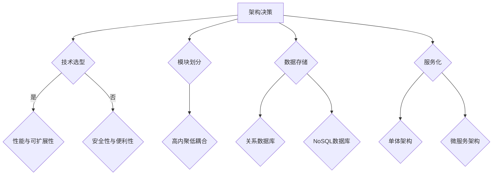
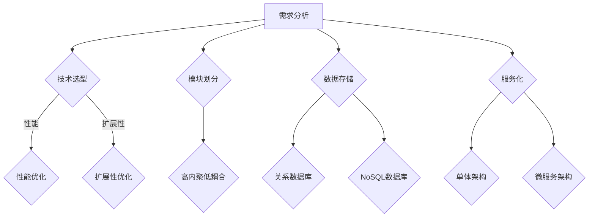

                 


### 第1章 引言：架构的本质和取舍的关系

> "架构，是一种决策的集合，它决定了系统的结构、行为和性能。" —— Martin Fowler

在软件工程领域，架构被视为系统设计的蓝图，它是软件项目的基石，决定了项目的长期成功。然而，架构不仅仅是技术上的设计，更是一种战略性的决策过程。在这个过程中，取舍成为了不可或缺的要素。

#### 1.1 架构的定义与重要性

架构（Architecture）一词在软件工程中有其独特的含义。它指的是系统的高层设计，包括系统的组成部分、这些部分的相互作用以及系统如何与环境交互。一个好的架构能够提供以下几个方面的价值：

- **可扩展性**：随着需求的增长，架构能够灵活地适应变化。
- **可维护性**：代码易于理解、修改和扩展。
- **性能**：系统能够高效地处理大量请求。
- **可靠性**：系统能够在各种情况下稳定运行。
- **安全性**：系统具备抵御外部攻击的能力。

#### 1.2 取舍的概念与实践

取舍（Trade-offs）在软件开发中是指在不同需求或目标之间做出平衡的选择。这些选择通常涉及到以下几个方面：

- **性能与可扩展性**：为了提高性能，可能需要牺牲一些可扩展性。
- **安全性与便利性**：更严格的安全措施可能带来更高的便利性损失。
- **成本与时间**：选择更昂贵的技术或工具可能缩短开发时间。

在实际开发中，取舍往往需要平衡短期目标和长期目标，确保系统能够在复杂的环境中持续稳定运行。

#### 1.3 架构决策中的取舍

架构决策是软件开发过程中的关键环节。在这个阶段，开发者需要综合考虑各种因素，做出一系列的取舍：

- **技术选型**：选择合适的编程语言、框架和工具。
- **模块划分**：确定系统的模块结构，划分职责。
- **数据存储**：选择合适的数据存储方案，如关系数据库或NoSQL数据库。
- **服务化**：决定是否将系统分解为多个微服务。

每一次架构决策都是一次取舍的过程，需要根据项目需求、团队技能、资源限制等多个因素进行权衡。

### Mermaid 流程图：架构决策中的取舍



通过这个流程图，我们可以看到架构决策是如何在不同的方向上进行取舍，从而影响系统的整体设计和性能。

#### 总结

架构不仅仅是技术上的设计，更是一种战略性的决策过程。在这个过程中，取舍成为了不可或缺的要素。通过合理地做出取舍，我们能够确保系统在复杂的环境中保持稳定和高效运行。接下来，我们将深入探讨软件架构的基础知识，以及如何在实际项目中应用取舍原则。

---

### 第2章 软件架构基础

在深入探讨架构和取舍之前，我们需要对软件架构的基础概念有一个清晰的理解。本章将介绍软件架构的基本概念、原则和方法论，以便为后续内容打下坚实的基础。

#### 2.1 软件架构的基本概念

软件架构是指系统的整体结构和设计，它决定了系统的组成组件、这些组件之间的关系，以及它们如何与外部环境交互。架构不仅仅是一组代码，更是一种思维方式，一种设计方法。

**软件架构的核心组成部分：**

- **组件（Components）**：软件系统中的基本构建块，如模块、类或服务。
- **接口（Interfaces）**：组件之间的通信方式，定义了组件如何交互。
- **通信（Communication）**：组件之间的信息交换方式，包括同步和异步通信。
- **关系（Relations）**：组件之间的依赖关系，如聚合、继承、依赖等。

**架构设计的关键原则：**

- **高内聚低耦合**：组件内部高度集中，组件之间低依赖。
- **模块化**：系统划分为多个可独立开发的模块。
- **可扩展性**：系统易于扩展，以适应新的需求和变化。
- **可维护性**：系统易于理解和修改。

**架构方法论：**

- **面向对象设计（OOD）**：通过类和对象来组织系统。
- **组件化架构**：将系统分解为可复用的组件。
- **服务导向架构（SOA）**：通过服务来实现系统的模块化和集成。

#### 2.2 架构设计模式

架构设计模式是一组可重用的解决方案，用于解决特定类型的架构问题。设计模式可以帮助开发者快速理解系统的架构，并提高设计的可维护性和可扩展性。

**常见架构设计模式：**

- **分层架构**：将系统划分为多个层次，如表示层、业务逻辑层和数据访问层。
- **微服务架构**：将系统划分为多个独立的服务，每个服务负责特定的功能。
- **事件驱动架构**：通过事件来触发和处理任务。
- **模型-视图-控制器（MVC）**：将数据模型、用户界面和业务逻辑分离。

**架构设计模式的选择原则：**

- **适用性**：选择适合项目需求和团队技能的设计模式。
- **可扩展性**：设计模式应支持系统的未来扩展。
- **可维护性**：设计模式应减少代码的复杂度。

#### 2.3 架构风格与原则

架构风格是指系统设计的整体风格和习惯，它决定了系统的结构和交互方式。常见的架构风格包括：

- **客户端-服务器（Client-Server）**：将系统划分为客户端和服务器，客户端发送请求，服务器处理请求并返回结果。
- **分布式系统**：系统分布在多个节点上，每个节点负责特定的任务。
- **微内核架构**：核心功能最小化，将其他功能作为插件或服务。

**软件架构的核心原则：**

- **模块化**：系统划分为多个独立的模块，每个模块负责特定的功能。
- **解耦**：组件之间保持低依赖，以提高系统的灵活性和可维护性。
- **可扩展性**：系统应易于扩展，以适应新的需求和变化。
- **可重用性**：设计应支持组件的重用，以提高开发效率。

#### 总结

软件架构是软件开发过程中的核心环节，它决定了系统的结构、行为和性能。通过了解架构的基本概念、设计模式和核心原则，开发者可以更好地进行架构设计，确保系统的高效、稳定和可维护性。在下一章中，我们将探讨取舍的原理和实践，分析如何在不同的架构设计中做出合理的取舍。

### 第3章 取舍的原理和实践

在软件开发的过程中，取舍是一个不可或缺的环节。它涉及到在性能、可扩展性、安全性、成本和团队技能等多种因素之间做出平衡。本章将深入探讨取舍的理论基础、实践方法，并通过具体案例展示如何在不同架构设计中应用取舍原则。

#### 3.1 取舍的理论基础

**成本效益分析**

成本效益分析是取舍过程中常用的工具，它帮助开发者评估不同选择的经济性。基本思路是通过比较投入成本和预期收益，选择成本较低、收益较高的方案。具体步骤如下：

1. **确定目标**：明确项目的目标，如性能、安全性、可维护性等。
2. **列出选项**：根据目标，列出所有可能的选项。
3. **成本评估**：对每个选项进行成本评估，包括开发成本、维护成本、人力成本等。
4. **收益评估**：对每个选项的预期收益进行评估，包括性能提升、安全性增强、用户体验改进等。
5. **决策**：比较成本和收益，选择最佳选项。

**决策模型**

在软件开发中，常用的决策模型包括：

- **理性决策模型**：基于逻辑和数据分析，选择最优解。
- **模糊决策模型**：在不确定性较高的情况下，选择最符合期望的方案。
- **权变决策模型**：根据具体情况和环境变化，灵活调整决策。

**取舍的伦理问题**

在取舍过程中，还涉及伦理问题，如隐私保护、数据安全等。开发者需要在商业利益和社会责任之间做出平衡，确保技术的应用符合伦理标准。

#### 3.2 架构设计中的取舍

在不同的架构设计中，取舍原则体现在以下几个方面：

**性能与可扩展性**

性能和可扩展性通常是开发者需要权衡的两个关键因素。高性能系统通常意味着更快的响应时间和更低的延迟，但可能牺牲一些可扩展性。相反，高度可扩展的系统可能需要更多的计算资源和时间来处理请求。

**案例**：在构建一个实时数据分析系统时，为了确保低延迟，选择使用高性能的计算引擎。虽然这增加了系统的成本，但显著提升了用户体验。

**安全性与便利性**

安全性是任何软件系统的核心要求，但过于严格的安全措施可能带来使用上的不便。开发者需要在安全性和便利性之间找到平衡。

**案例**：在开发一个在线银行应用时，为了确保账户安全，采用了多因素认证。虽然这增加了用户登录的复杂性，但有效提高了账户的安全性。

**成本与时间**

成本和时间是另一个常见的取舍点。选择更昂贵的技术或工具可能缩短开发时间，反之亦然。

**案例**：在一个大型企业级项目中，为了加快开发进度，团队选择使用成熟的商业软件，虽然这增加了预算，但显著提高了开发效率。

**可维护性与可扩展性**

可维护性和可扩展性是长期成功的关键。一个易于维护的系统可以降低长期成本，但可能牺牲一些短期性能。

**案例**：在开发一个大型电子商务平台时，团队选择了模块化设计，确保系统易于维护和扩展。虽然这增加了初始开发成本，但长期来看，显著降低了维护成本。

#### 3.3 实际案例研究

为了更好地理解取舍原则的应用，以下是一些实际案例研究：

**案例一：社交媒体平台的架构演进**

在一个社交媒体平台上，团队需要在性能和可扩展性之间做出取舍。初期，平台采用单体架构，所有功能集中在一个应用程序中。随着用户量的增加，平台面临性能瓶颈和扩展性问题。

**取舍过程**：

1. **性能评估**：通过负载测试，发现响应时间逐渐增加。
2. **扩展性分析**：确定需要将功能分解为多个微服务。
3. **成本评估**：虽然微服务架构初期开发成本较高，但长期来看，性能和可扩展性显著提升。
4. **决策**：采用微服务架构，逐步将功能模块化。

**结果**：平台性能显著提升，可扩展性增强，用户体验得到改善。

**案例二：金融交易系统的安全性优化**

在一个金融交易系统中，团队需要在安全性和便利性之间做出平衡。系统需要确保交易数据的安全，同时为用户提供便捷的登录和操作体验。

**取舍过程**：

1. **安全性评估**：分析当前系统的安全隐患，如弱密码、SQL注入等。
2. **便利性分析**：评估现有登录机制，如用户名和密码、双因素认证等。
3. **成本评估**：采用双因素认证会增加用户登录的复杂性，但显著提高系统的安全性。
4. **决策**：引入双因素认证，同时优化用户体验，确保登录流程简洁高效。

**结果**：系统安全性显著提高，用户满意度也得到改善。

**案例三：初创企业的快速迭代架构**

对于一个初创企业，时间和资源是有限的。团队需要在多个方面进行取舍，以确保系统能够快速迭代和市场竞争力。

**取舍过程**：

1. **性能评估**：初期，性能不是主要考虑因素，快速迭代是关键。
2. **成本评估**：选择轻量级框架和开源工具，以降低开发成本。
3. **可维护性分析**：初期，代码维护不是主要问题，重点是快速交付功能。
4. **决策**：采用快速开发方法，如敏捷开发，同时确保代码结构清晰，易于后续维护。

**结果**：初创企业能够快速响应市场变化，保持竞争力，并在后期逐步优化架构。

#### 总结

取舍是软件架构设计过程中的关键环节，它决定了系统的性能、安全性、可扩展性和长期维护成本。通过合理的取舍，开发者能够确保系统在复杂的环境中保持高效、稳定和可维护。本章通过理论和实践案例，展示了如何在不同架构设计中应用取舍原则，为后续内容奠定了基础。在下一章中，我们将继续探讨架构决策案例分析，进一步理解取舍在实践中的应用。

### 第4章 架构决策案例分析

在软件架构设计中，架构决策是一个复杂且关键的过程。通过分析实际案例，我们可以深入了解架构决策的背景、过程和结果，从中吸取经验教训，为未来的项目提供参考。本章将分析几个典型的架构决策案例，包括大型电商平台的架构演变、金融行业的架构重构和初创企业的快速迭代架构。

#### 案例一：大型电商平台的架构演变

**背景与挑战**

随着电商行业的快速发展，大型电商平台需要处理海量用户请求和数据存储，同时保证系统的可靠性和可扩展性。最初的架构设计采用了单体架构，所有功能集中在一个应用程序中，随着用户量的增加，系统面临性能瓶颈和扩展性问题。

**决策过程**

1. **性能评估**：通过负载测试，发现响应时间逐渐增加，系统性能无法满足用户需求。
2. **扩展性分析**：确定需要将功能分解为多个微服务，以提高系统的可扩展性。
3. **成本评估**：虽然微服务架构初期开发成本较高，但长期来看，性能和可扩展性显著提升。
4. **技术选型**：选择合适的微服务框架和工具，如Spring Boot、Docker、Kubernetes等。
5. **实施计划**：逐步将单体架构拆分为多个微服务，确保系统的稳定运行。

**结果**

通过采用微服务架构，大型电商平台显著提升了系统的性能和可扩展性。系统响应时间缩短，用户体验得到改善。同时，微服务架构降低了系统的耦合度，提高了代码的可维护性。然而，也面临了一些挑战，如服务治理、数据一致性和网络延迟等问题，需要持续优化和调整。

#### 案例二：金融交易系统的安全性优化

**背景与挑战**

金融交易系统对安全性有极高的要求，任何安全漏洞都可能带来严重的后果。随着互联网技术的发展，攻击手段也不断升级，金融交易系统需要不断提升安全性，以抵御各种潜在威胁。

**决策过程**

1. **安全性评估**：分析当前系统的安全隐患，如弱密码、SQL注入、DDoS攻击等。
2. **便利性分析**：评估现有登录机制，如用户名和密码、双因素认证等。
3. **成本评估**：采用双因素认证会增加用户登录的复杂性，但显著提高系统的安全性。
4. **技术选型**：选择合适的身份验证和安全工具，如OAuth 2.0、JWT、安全加密等。
5. **实施计划**：引入双因素认证，优化用户体验，确保登录流程简洁高效。

**结果**

通过引入双因素认证和多种安全措施，金融交易系统的安全性显著提高，用户和金融机构的安全风险降低。然而，这也带来了一些挑战，如用户满意度下降、登录流程复杂性增加等，需要持续优化和调整。

#### 案例三：初创企业的快速迭代架构

**背景与挑战**

初创企业通常面临时间紧迫、资源有限的情况。如何在短时间内快速迭代，保持市场竞争力是关键挑战。同时，初创企业需要确保系统的稳定性和可维护性，为后续发展打下基础。

**决策过程**

1. **性能评估**：初期，性能不是主要考虑因素，快速迭代是关键。
2. **成本评估**：选择轻量级框架和开源工具，以降低开发成本。
3. **可维护性分析**：初期，代码维护不是主要问题，重点是快速交付功能。
4. **技术选型**：采用敏捷开发方法，如Scrum、Kanban等，确保快速响应市场需求。
5. **实施计划**：采用模块化设计，确保系统易于维护和扩展。

**结果**

通过采用敏捷开发和模块化设计，初创企业能够快速迭代，适应市场需求。系统在初期保持了较高的稳定性，为后续发展奠定了基础。然而，这也面临一些挑战，如技术债务积累、系统复杂度增加等，需要持续优化和调整。

#### 总结

通过以上案例，我们可以看到架构决策在大型电商平台、金融交易系统和初创企业中的应用。合理的架构决策能够显著提升系统的性能、安全性、可扩展性和可维护性，为项目的长期成功奠定基础。然而，架构决策也面临各种挑战，需要持续优化和调整。在下一章中，我们将继续探讨技术选型的策略与技巧，帮助开发者做出更明智的架构决策。

### 第5章 技术选型的策略与技巧

技术选型是软件架构设计中的一个关键环节，它直接影响到项目的成功率。本章将详细介绍技术选型的策略、方法，探讨如何根据项目需求进行技术选型，分析技术选型的风险和应对策略，以及技术趋势对未来架构的影响。

#### 5.1 技术选型的策略

**1. 需求分析**

在技术选型之前，首先需要进行详细的需求分析。明确项目的目标、功能、性能、可扩展性等要求，为技术选型提供依据。需求分析可以分为以下几个方面：

- **功能需求**：确定系统需要实现的功能，如用户管理、数据存储、数据查询等。
- **性能需求**：确定系统的性能指标，如响应时间、吞吐量、并发处理能力等。
- **可扩展性需求**：确定系统在用户量、数据量增加时，如何保持性能和稳定性。
- **安全性需求**：确定系统的安全要求，如数据加密、身份验证、访问控制等。

**2. 评估标准**

根据需求分析的结果，制定评估标准，用于比较和选择技术方案。常见的评估标准包括：

- **性能**：技术方案的处理能力、响应时间、资源消耗等。
- **可扩展性**：技术方案在用户量、数据量增加时，如何保持性能和稳定性。
- **可维护性**：技术方案的代码结构、文档完整性、社区活跃度等。
- **安全性**：技术方案的安全机制、漏洞修复速度等。
- **成本**：技术方案的开发成本、维护成本等。

**3. 方法与流程**

技术选型通常包括以下几个步骤：

- **需求分析**：明确项目需求，为技术选型提供依据。
- **候选技术调研**：收集和评估候选技术方案，包括开源和商业解决方案。
- **技术评估**：根据评估标准，对候选技术方案进行详细评估，比较它们的优缺点。
- **决策**：根据评估结果，选择最佳技术方案，并制定实施计划。

#### 5.2 项目需求与技术匹配

在技术选型过程中，确保项目需求与技术方案匹配至关重要。以下是一些关键步骤：

**1. 功能匹配**

根据项目需求，确定需要实现的功能点，并与候选技术方案的功能进行比较。确保技术方案能够满足项目的核心功能需求。

**2. 性能匹配**

根据项目性能需求，评估技术方案的性能表现，如响应时间、吞吐量、并发处理能力等。选择能够满足项目性能要求的技术方案。

**3. 可扩展性匹配**

评估技术方案的可扩展性，确定其在用户量、数据量增加时，如何保持性能和稳定性。选择具有良好扩展性的技术方案。

**4. 安全性匹配**

根据项目安全性需求，评估技术方案的安全机制，如数据加密、身份验证、访问控制等。选择能够满足项目安全要求的技术方案。

**5. 成本匹配**

考虑技术方案的开发成本、维护成本等，确保项目预算范围内能够负担。

#### 5.3 技术选型的风险与应对策略

技术选型过程中存在多种风险，如技术债务、技术锁定、升级困难等。以下是一些常见风险及其应对策略：

**1. 技术债务**

技术债务是指选择的技术方案可能存在性能、可扩展性、安全性等方面的问题，导致后续维护成本增加。应对策略：

- **早期评估**：在技术选型阶段，对候选技术方案进行充分评估，识别潜在风险。
- **持续优化**：选择具有良好扩展性和维护性的技术方案，定期进行性能优化和代码重构。

**2. 技术锁定**

技术锁定是指项目选择了一种特定的技术方案，后续难以切换到其他技术方案。应对策略：

- **技术中立**：避免过度依赖某一种技术或框架，确保项目具有技术灵活性。
- **模块化设计**：采用模块化设计，将不同功能模块解耦，降低技术锁定的风险。

**3. 升级困难**

升级困难是指技术方案在更新或升级时，可能面临兼容性、迁移成本等问题。应对策略：

- **版本兼容性**：选择具有良好版本兼容性的技术方案，确保升级过程顺利进行。
- **迁移计划**：在技术选型阶段，制定详细的迁移计划，降低升级风险。

#### 5.4 技术趋势与架构影响

技术趋势对软件架构的设计和选择具有重要影响。以下是一些当前流行的技术趋势及其对架构的影响：

**1. 云原生技术**

云原生技术包括容器化（如Docker）、微服务架构（如Kubernetes）、服务网格（如Istio）等。它们使得系统在云环境中具有更好的可扩展性和灵活性。

**2. 人工智能与机器学习**

人工智能和机器学习技术正在被广泛应用于各种领域，如自动驾驶、智能家居、金融风控等。它们对系统架构提出了新的需求，如大规模数据处理、实时推理等。

**3. 低代码平台**

低代码平台提供可视化的开发工具，使得开发者能够快速构建应用，降低开发成本。然而，这也带来了技术债务和扩展性限制。

**4. 区块链技术**

区块链技术具有去中心化、不可篡改等特点，被应用于金融、供应链管理等领域。它们对系统架构提出了新的挑战，如数据一致性、隐私保护等。

**总结**

技术选型是软件架构设计过程中的关键环节，它直接影响到项目的性能、可扩展性、安全性等。通过合理的策略和技巧，开发者能够选择最佳的技术方案，确保项目的长期成功。在下一章中，我们将继续探讨架构文档编写与沟通技巧，确保团队对架构的理解和认同。

### 第6章 架构文档编写与沟通技巧

在软件架构设计中，文档编写和沟通技巧是确保项目成功的关键因素。本章将详细讨论架构文档的重要性、编写原则、如何编写高质量的架构文档、通过文档进行有效沟通的技巧、架构文档的工具和模板，以及如何通过文档管理保持架构的可持续性。

#### 6.1 架构文档的重要性

架构文档是软件架构设计的核心输出，它不仅记录了系统的设计细节，还为团队成员、利益相关者和管理者提供了共同的理解基础。以下是架构文档的重要性：

- **确保一致性和可理解性**：架构文档确保团队成员对系统的设计有共同的理解，减少误解和错误。
- **支持变更管理**：架构文档提供了系统设计的详细描述，有助于在变更过程中进行评估和决策。
- **促进知识传递**：对于新加入的团队成员，架构文档是快速了解系统设计的宝贵资源。
- **支持技术债务管理**：架构文档可以帮助团队识别潜在的技术债务，并制定相应的优化策略。
- **支持项目管理和审计**：架构文档是项目管理的重要输入，有助于项目计划的制定和审计过程的进行。

#### 6.2 架构文档的编写原则

编写高质量的架构文档需要遵循以下原则：

- **准确性**：文档内容必须准确无误，避免误导和错误。
- **一致性**：文档应保持一致性，避免出现矛盾和冲突。
- **清晰性**：文档应简洁明了，避免使用复杂的术语和语言。
- **完整性**：文档应包含所有必要的细节和背景信息，确保全面性。
- **可读性**：文档应具有好的排版和格式，便于阅读和理解。
- **可维护性**：文档应易于更新和维护，以适应系统设计的变更。

#### 6.3 如何编写高质量的架构文档

编写高质量的架构文档需要系统的方法和步骤。以下是具体的方法：

1. **需求分析**：明确文档的目的和受众，了解项目的需求。
2. **框架设计**：制定文档的结构，包括目录、章节、子章节等。
3. **内容撰写**：根据架构设计的结果，详细描述系统的各个部分，如组件、接口、通信机制等。
4. **图表和模型**：使用图表和模型（如UML图、Mermaid图等）来帮助解释和展示复杂的设计。
5. **验证和审核**：在撰写过程中，通过团队成员的反馈和审核，确保文档的准确性和完整性。
6. **文档发布**：将文档发布到适当的平台，如Confluence、GitLab等，确保易于访问和更新。

#### 6.4 通过文档进行有效沟通的技巧

通过文档进行有效沟通需要掌握以下技巧：

- **明确目标**：在撰写文档时，明确文档的目标和受众，确保内容符合受众的需求。
- **使用简洁的语言**：避免使用复杂的术语和语言，使用简单易懂的表达方式。
- **图表和示例**：使用图表、示例代码和实际案例来帮助解释复杂的概念。
- **版本控制**：使用版本控制系统来管理文档的更新，确保文档的版本一致性和可追溯性。
- **定期更新**：定期更新文档，确保其内容与系统设计保持一致。

#### 6.5 架构文档的工具和模板

以下是一些常用的架构文档工具和模板：

- **工具**：
  - **GitLab**：用于文档版本控制和项目管理。
  - **Confluence**：用于编写和存储文档。
  - **Mermaid**：用于绘制流程图和UML图。
  - **Lucidchart**：用于绘制图表和流程图。
  
- **模板**：
  - **软件架构文档模板**：包含架构概述、组件描述、接口定义、通信机制等内容。
  - **系统设计文档模板**：包含系统需求、功能描述、模块划分、技术选型等。
  - **变更管理文档模板**：包含变更请求、评估结果、决策记录等内容。

#### 6.6 如何通过文档管理保持架构的可持续性

保持架构的可持续性是架构文档管理的核心目标。以下是一些关键策略：

- **持续更新**：定期更新文档，确保其内容与实际系统设计保持一致。
- **反馈机制**：建立文档反馈机制，鼓励团队成员和利益相关者提供反馈，改进文档内容。
- **文档评审**：定期进行文档评审，确保文档的质量和准确性。
- **培训和教育**：为团队成员提供架构文档的培训和教育，提高他们对架构的理解和认同。
- **知识共享**：通过文档管理平台，促进团队成员之间的知识共享和协作。

#### 总结

架构文档编写和沟通技巧是软件架构设计过程中的关键环节。通过遵循编写原则、使用工具和模板，以及通过有效的沟通技巧，团队可以确保对系统设计的共同理解，提高项目的成功率。在下一章中，我们将探讨架构评估与优化，确保系统设计的持续改进和优化。

### 第7章 架构评估与优化

在软件架构设计过程中，架构评估与优化是确保系统长期稳定性和高效性的关键环节。本章将介绍架构评估的目的和方法，探讨如何对架构进行持续优化，分析架构优化中的常见问题和解决方案，讨论架构优化与项目管理的关系，提供架构优化的工具和实践，分析架构优化对团队的影响，并总结架构评估与优化的最佳实践。

#### 7.1 架构评估的目的和方法

**目的**

架构评估的主要目的是确保系统设计的合理性和有效性，及时发现和解决潜在问题，为后续优化提供依据。具体目的包括：

- **验证设计合理性**：确保架构设计符合项目需求，满足性能、可扩展性、安全性等要求。
- **发现潜在风险**：识别系统设计中的潜在问题，如性能瓶颈、安全漏洞、技术债务等。
- **支持决策**：为项目管理和架构优化提供科学依据，帮助团队做出明智的决策。

**方法**

架构评估通常包括以下方法：

- **静态分析**：通过代码审查、设计模式分析等手段，对系统架构进行静态评估。
- **动态分析**：通过性能测试、负载测试、安全测试等手段，对系统架构进行动态评估。
- **代码质量评估**：使用静态代码分析工具，评估代码的质量和可维护性。
- **架构评审**：组织架构评审会议，邀请团队成员和利益相关者对架构设计进行讨论和评估。

#### 7.2 如何对架构进行持续优化

持续优化是确保系统长期稳定性和高效性的关键。以下是一些关键步骤：

1. **性能优化**：
   - **代码优化**：分析代码瓶颈，使用高效算法和数据结构，减少不必要的计算和内存占用。
   - **数据库优化**：优化数据库查询，减少表连接和索引，提高查询效率。
   - **缓存策略**：使用缓存机制，减少对后端服务的调用，提高系统响应速度。

2. **可扩展性优化**：
   - **服务拆分**：将单体架构拆分为多个微服务，提高系统的可扩展性和灵活性。
   - **负载均衡**：使用负载均衡器，将请求均匀分配到多个节点，提高系统的处理能力。
   - **分布式存储**：使用分布式存储方案，提高数据存储和访问的效率。

3. **安全性优化**：
   - **加密和认证**：使用加密和认证机制，确保数据传输和存储的安全性。
   - **访问控制**：实施严格的访问控制策略，防止未授权访问和数据泄露。
   - **安全审计**：定期进行安全审计，检测潜在的安全漏洞和风险。

4. **可维护性优化**：
   - **模块化设计**：将系统划分为多个模块，降低组件之间的耦合度，提高代码的可维护性。
   - **文档化**：编写详细的架构文档，确保团队成员对系统设计有共同的理解。
   - **代码审查**：定期进行代码审查，确保代码的质量和一致性。

#### 7.3 架构优化中的常见问题和解决方案

在架构优化过程中，常见的问题包括：

- **技术债务**：由于项目时间紧迫，部分设计可能不够优雅，导致后续维护困难。解决方案：制定技术债务管理计划，逐步优化和重构代码。
- **性能瓶颈**：系统在高负载情况下可能出现性能瓶颈。解决方案：进行性能测试，定位瓶颈并进行优化。
- **资源浪费**：部分资源（如CPU、内存、网络带宽）可能被过度使用或浪费。解决方案：优化资源配置，提高资源利用率。

#### 7.4 架构优化与项目管理的关系

架构优化与项目管理密切相关。以下是一些关键点：

- **项目目标**：架构优化应与项目目标保持一致，确保系统设计满足项目需求。
- **风险管理**：架构优化过程中，应识别和评估潜在的风险，制定相应的风险管理计划。
- **资源分配**：项目管理应确保架构优化所需的资源（如时间、人力、资金）得到合理分配。
- **持续集成**：将架构优化纳入持续集成流程，确保优化成果及时应用到生产环境中。

#### 7.5 架构优化的工具和实践

以下是一些常用的架构优化工具和实践：

- **性能测试工具**：如JMeter、LoadRunner，用于模拟高负载环境，评估系统性能。
- **代码分析工具**：如SonarQube、CheckStyle，用于评估代码质量和可维护性。
- **架构评审工具**：如NDepend、Structure101，用于进行静态代码分析，发现潜在问题。
- **模块化设计实践**：将系统划分为多个模块，降低组件之间的耦合度，提高可维护性。
- **持续集成与持续部署**：将架构优化纳入持续集成和持续部署流程，确保优化成果及时应用到生产环境中。

#### 7.6 架构优化对团队的影响

架构优化不仅影响系统的性能和可维护性，还对团队产生影响：

- **技术能力提升**：通过架构优化，团队成员可以学习和掌握更多高级技术和最佳实践。
- **团队协作**：架构优化需要团队成员之间的紧密协作和沟通，提高团队的协作效率。
- **工作压力**：架构优化可能增加团队成员的工作压力，需要合理分配任务和时间。

#### 7.7 总结架构评估与优化的最佳实践

为了确保架构评估和优化取得最佳效果，以下是一些最佳实践：

- **定期评估**：定期进行架构评估，确保系统设计保持合理性和有效性。
- **持续优化**：持续关注系统性能、可扩展性、安全性等方面，进行针对性优化。
- **文档管理**：编写详细的架构文档，确保团队成员对系统设计有共同的理解。
- **风险管理**：识别和评估架构优化过程中的潜在风险，制定相应的风险管理计划。
- **培训与学习**：为团队成员提供培训和学习机会，提高他们的技术能力和协作效率。

通过遵循这些最佳实践，团队可以确保系统设计的持续改进和优化，提高项目的成功率。

### 总结

架构评估与优化是确保系统长期稳定性和高效性的关键环节。通过定期评估、持续优化和合理的项目管理，团队可以确保系统设计满足项目需求，提高性能、可扩展性和安全性。本章通过介绍架构评估的目的和方法、如何进行持续优化、与项目管理的关系、工具和实践，以及团队影响，提供了全面的架构优化指南。在下一章中，我们将进一步探讨技术选型的策略与技巧，帮助开发者做出更明智的决策。

## 第5章 技术选型的策略与技巧

技术选型是软件开发过程中的关键环节，它决定了项目的性能、可维护性、扩展性和成本。本章将深入探讨技术选型的策略、方法、关键步骤以及如何根据项目需求进行技术选型，并分析技术选型的风险和应对策略。

### 5.1 技术选型的策略

**1. 需求导向**

在技术选型过程中，首先需要明确项目的需求，包括功能需求、性能需求、可扩展性需求、安全性需求等。根据需求确定需要解决的问题，然后选择能够满足这些需求的技术。

**2. 最佳实践**

遵循业界最佳实践是技术选型的重要策略。通过参考成功项目的经验，选择成熟、稳定的技术，可以减少开发风险，提高开发效率。

**3. 技术中立**

避免过度依赖某一种技术或框架，保持技术中立。这样可以确保项目具有灵活性，方便后续的扩展和升级。

**4. 成本效益**

在技术选型时，需要综合考虑成本和效益。选择性价比高的技术，确保在预算范围内实现项目目标。

### 5.2 技术选型的关键步骤

**1. 确定需求**

明确项目的需求是技术选型的第一步。需求可以分为以下几类：

- **功能需求**：系统需要实现的具体功能，如用户管理、数据存储、数据处理等。
- **性能需求**：系统需要达到的性能指标，如响应时间、吞吐量、并发处理能力等。
- **可扩展性需求**：系统需要具备的可扩展性，以适应未来用户量的增长。
- **安全性需求**：系统需要满足的安全要求，如数据加密、身份验证、访问控制等。

**2. 候选技术调研**

在明确需求后，开始调研候选技术。可以从以下几个方面评估候选技术：

- **技术成熟度**：选择成熟、稳定的技术，减少开发风险。
- **社区支持**：技术社区是否活跃，社区资源是否丰富，如文档、教程、开源项目等。
- **生态系统**：技术相关的工具、库、框架是否丰富，是否支持多种编程语言。
- **成本**：包括开发成本、维护成本、部署成本等。

**3. 技术评估**

根据需求对候选技术进行详细评估。可以使用以下方法：

- **性能测试**：对候选技术进行性能测试，比较其响应时间、吞吐量、并发处理能力等指标。
- **安全性测试**：评估技术的安全机制，如数据加密、身份验证、访问控制等。
- **可扩展性测试**：评估技术在用户量、数据量增加时的性能表现。

**4. 决策**

根据评估结果，选择最佳技术方案。决策时可以考虑以下因素：

- **需求匹配**：技术是否能够满足项目需求。
- **成本效益**：技术的总成本是否在预算范围内。
- **社区支持**：技术社区是否活跃，是否有足够的资源支持项目。
- **技术中立**：技术是否具有灵活性，方便后续扩展和升级。

### 5.3 根据项目需求进行技术选型

**1. 功能需求**

- **用户管理**：可以选择OAuth 2.0、JWT等技术实现用户认证和授权。
- **数据存储**：根据数据类型和查询需求，可以选择关系数据库（如MySQL、PostgreSQL）或NoSQL数据库（如MongoDB、Cassandra）。

**2. 性能需求**

- **高性能计算**：可以选择Nginx、Apache等Web服务器，提高系统的响应速度。
- **负载均衡**：可以选择F5、AWS Load Balancer等工具，确保系统在高负载情况下稳定运行。

**3. 可扩展性需求**

- **微服务架构**：可以选择Spring Cloud、Netflix OSS等框架，实现系统的模块化和分布式部署。
- **容器化**：可以选择Docker、Kubernetes等工具，实现系统的快速部署和弹性扩展。

**4. 安全性需求**

- **数据加密**：可以选择AES、RSA等加密算法，确保数据在传输和存储过程中的安全性。
- **安全认证**：可以选择SSL/TLS、OAuth 2.0等协议，确保系统的身份验证和访问控制。

### 5.4 技术选型的风险和应对策略

**1. 技术债务**

风险：选择技术方案时，可能因为时间紧迫而忽视设计优化，导致后续维护困难。

应对策略：制定技术债务管理计划，逐步优化和重构代码。

**2. 技术锁定**

风险：选择的技术方案可能限制项目的后续扩展和升级。

应对策略：保持技术中立，避免过度依赖某一种技术或框架。

**3. 成本超支**

风险：技术选型时未充分考虑成本，导致项目预算超支。

应对策略：在评估阶段充分考虑成本因素，选择性价比高的技术方案。

### 5.5 技术趋势与未来架构的影响

**1. 云原生技术**

云原生技术（如容器化、服务网格、无服务器架构）正在改变软件架构的设计和部署方式。它们提供更高的可扩展性、灵活性和效率。

**2. 人工智能与机器学习**

人工智能和机器学习技术的应用正在推动软件架构的变革。系统需要具备大规模数据处理、实时推理等能力。

**3. 区块链技术**

区块链技术（如加密货币、智能合约）在金融、供应链等领域具有广泛的应用前景，对系统架构提出了新的需求。

### 5.6 技术选型的实用工具和资源

以下是一些常用的技术选型工具和资源：

- **技术选型指南**：如《微服务设计》、《架构师的实践指南》等书籍，提供技术选型的理论指导和实践案例。
- **技术社区**：如Stack Overflow、GitHub、Docker Hub等，提供丰富的技术讨论和开源项目资源。
- **在线评估工具**：如Kubernetes Benchmarks、AWS Well-Architected Tool等，用于评估和比较不同技术的性能和成本。

### 总结

技术选型是软件开发过程中至关重要的一环。通过明确需求、调研候选技术、评估和决策，团队可以确保选择合适的技术方案，提高项目的成功率和长期稳定性。在下一章中，我们将继续探讨架构文档的编写与沟通技巧，确保团队对架构的理解和认同。

## 第6章 架构文档编写与沟通技巧

在软件架构设计中，文档编写和沟通技巧是确保项目成功的关键。本章将详细讨论架构文档的重要性、编写原则、如何编写高质量的架构文档、通过文档进行有效沟通的技巧、架构文档的工具和模板，以及如何通过文档管理保持架构的可持续性。

### 6.1 架构文档的重要性

架构文档在软件项目中具有至关重要的作用，它不仅记录了系统的设计细节，还为团队成员、利益相关者和管理者提供了共同的理解基础。以下是架构文档的重要性：

- **确保一致性和可理解性**：架构文档确保团队成员对系统的设计有共同的理解，减少误解和错误。
- **支持变更管理**：架构文档提供了系统设计的详细描述，有助于在变更过程中进行评估和决策。
- **促进知识传递**：对于新加入的团队成员，架构文档是快速了解系统设计的宝贵资源。
- **支持技术债务管理**：架构文档可以帮助团队识别潜在的技术债务，并制定相应的优化策略。
- **支持项目管理和审计**：架构文档是项目管理的重要输入，有助于项目计划的制定和审计过程的进行。

### 6.2 架构文档的编写原则

编写高质量的架构文档需要遵循以下原则：

- **准确性**：文档内容必须准确无误，避免误导和错误。
- **一致性**：文档应保持一致性，避免出现矛盾和冲突。
- **清晰性**：文档应简洁明了，避免使用复杂的术语和语言。
- **完整性**：文档应包含所有必要的细节和背景信息，确保全面性。
- **可读性**：文档应具有好的排版和格式，便于阅读和理解。
- **可维护性**：文档应易于更新和维护，以适应系统设计的变更。

### 6.3 如何编写高质量的架构文档

编写高质量的架构文档需要系统的方法和步骤。以下是具体的方法：

1. **需求分析**：明确文档的目的和受众，了解项目的需求。
2. **框架设计**：制定文档的结构，包括目录、章节、子章节等。
3. **内容撰写**：根据架构设计的结果，详细描述系统的各个部分，如组件、接口、通信机制等。
4. **图表和模型**：使用图表和模型（如UML图、Mermaid图等）来帮助解释和展示复杂的设计。
5. **验证和审核**：在撰写过程中，通过团队成员的反馈和审核，确保文档的准确性和完整性。
6. **文档发布**：将文档发布到适当的平台，如Confluence、GitLab等，确保易于访问和更新。

### 6.4 通过文档进行有效沟通的技巧

通过文档进行有效沟通需要掌握以下技巧：

- **明确目标**：在撰写文档时，明确文档的目标和受众，确保内容符合受众的需求。
- **使用简洁的语言**：避免使用复杂的术语和语言，使用简单易懂的表达方式。
- **图表和示例**：使用图表、示例代码和实际案例来帮助解释复杂的概念。
- **版本控制**：使用版本控制系统来管理文档的更新，确保文档的版本一致性和可追溯性。
- **定期更新**：定期更新文档，确保其内容与系统设计保持一致。

### 6.5 架构文档的工具和模板

以下是一些常用的架构文档工具和模板：

- **工具**：
  - **GitLab**：用于文档版本控制和项目管理。
  - **Confluence**：用于编写和存储文档。
  - **Mermaid**：用于绘制流程图和UML图。
  - **Lucidchart**：用于绘制图表和流程图。

- **模板**：
  - **软件架构文档模板**：包含架构概述、组件描述、接口定义、通信机制等内容。
  - **系统设计文档模板**：包含系统需求、功能描述、模块划分、技术选型等。
  - **变更管理文档模板**：包含变更请求、评估结果、决策记录等内容。

### 6.6 如何通过文档管理保持架构的可持续性

保持架构的可持续性是架构文档管理的核心目标。以下是一些关键策略：

- **持续更新**：定期更新文档，确保其内容与实际系统设计保持一致。
- **反馈机制**：建立文档反馈机制，鼓励团队成员和利益相关者提供反馈，改进文档内容。
- **文档评审**：定期进行文档评审，确保文档的质量和准确性。
- **培训和教育**：为团队成员提供架构文档的培训和教育，提高他们对架构的理解和认同。
- **知识共享**：通过文档管理平台，促进团队成员之间的知识共享和协作。

### 6.7 总结

架构文档编写和沟通技巧是软件架构设计过程中的关键环节。通过遵循编写原则、使用工具和模板，以及通过有效的沟通技巧，团队可以确保对系统设计的共同理解，提高项目的成功率。在下一章中，我们将探讨架构评估与优化，确保系统设计的持续改进和优化。

## 第7章 架构评估与优化

在软件架构设计中，架构评估与优化是确保系统长期稳定性和高效性的关键环节。本章将详细介绍架构评估的目的和方法，探讨如何对架构进行持续优化，分析架构优化中的常见问题和解决方案，讨论架构优化与项目管理的关系，提供架构优化的工具和实践，分析架构优化对团队的影响，并总结架构评估与优化的最佳实践。

### 7.1 架构评估的目的和方法

**目的**

架构评估的主要目的是确保系统设计的合理性和有效性，及时发现和解决潜在问题，为后续优化提供依据。具体目的包括：

- **验证设计合理性**：确保架构设计符合项目需求，满足性能、可扩展性、安全性等要求。
- **发现潜在风险**：识别系统设计中的潜在问题，如性能瓶颈、安全漏洞、技术债务等。
- **支持决策**：为项目管理和架构优化提供科学依据，帮助团队做出明智的决策。

**方法**

架构评估通常包括以下方法：

- **静态分析**：通过代码审查、设计模式分析等手段，对系统架构进行静态评估。
- **动态分析**：通过性能测试、负载测试、安全测试等手段，对系统架构进行动态评估。
- **代码质量评估**：使用静态代码分析工具，评估代码的质量和可维护性。
- **架构评审**：组织架构评审会议，邀请团队成员和利益相关者对架构设计进行讨论和评估。

### 7.2 如何对架构进行持续优化

持续优化是确保系统长期稳定性和高效性的关键。以下是一些关键步骤：

1. **性能优化**：
   - **代码优化**：分析代码瓶颈，使用高效算法和数据结构，减少不必要的计算和内存占用。
   - **数据库优化**：优化数据库查询，减少表连接和索引，提高查询效率。
   - **缓存策略**：使用缓存机制，减少对后端服务的调用，提高系统响应速度。

2. **可扩展性优化**：
   - **服务拆分**：将单体架构拆分为多个微服务，提高系统的可扩展性和灵活性。
   - **负载均衡**：使用负载均衡器，将请求均匀分配到多个节点，提高系统的处理能力。
   - **分布式存储**：使用分布式存储方案，提高数据存储和访问的效率。

3. **安全性优化**：
   - **加密和认证**：使用加密和认证机制，确保数据传输和存储的安全性。
   - **访问控制**：实施严格的访问控制策略，防止未授权访问和数据泄露。
   - **安全审计**：定期进行安全审计，检测潜在的安全漏洞和风险。

4. **可维护性优化**：
   - **模块化设计**：将系统划分为多个模块，降低组件之间的耦合度，提高代码的可维护性。
   - **文档化**：编写详细的架构文档，确保团队成员对系统设计有共同的理解。
   - **代码审查**：定期进行代码审查，确保代码的质量和一致性。

### 7.3 架构优化中的常见问题和解决方案

在架构优化过程中，常见的问题包括：

- **技术债务**：由于项目时间紧迫，部分设计可能不够优雅，导致后续维护困难。解决方案：制定技术债务管理计划，逐步优化和重构代码。
- **性能瓶颈**：系统在高负载情况下可能出现性能瓶颈。解决方案：进行性能测试，定位瓶颈并进行优化。
- **资源浪费**：部分资源（如CPU、内存、网络带宽）可能被过度使用或浪费。解决方案：优化资源配置，提高资源利用率。

### 7.4 架构优化与项目管理的关系

架构优化与项目管理密切相关。以下是一些关键点：

- **项目目标**：架构优化应与项目目标保持一致，确保系统设计满足项目需求。
- **风险管理**：架构优化过程中，应识别和评估潜在的风险，制定相应的风险管理计划。
- **资源分配**：项目管理应确保架构优化所需的资源（如时间、人力、资金）得到合理分配。
- **持续集成**：将架构优化纳入持续集成流程，确保优化成果及时应用到生产环境中。

### 7.5 架构优化的工具和实践

以下是一些常用的架构优化工具和实践：

- **性能测试工具**：如JMeter、LoadRunner，用于模拟高负载环境，评估系统性能。
- **代码分析工具**：如SonarQube、CheckStyle，用于评估代码的质量和可维护性。
- **架构评审工具**：如NDepend、Structure101，用于进行静态代码分析，发现潜在问题。
- **模块化设计实践**：将系统划分为多个模块，降低组件之间的耦合度，提高可维护性。
- **持续集成与持续部署**：将架构优化纳入持续集成和持续部署流程，确保优化成果及时应用到生产环境中。

### 7.6 架构优化对团队的影响

架构优化不仅影响系统的性能和可维护性，还对团队产生影响：

- **技术能力提升**：通过架构优化，团队成员可以学习和掌握更多高级技术和最佳实践。
- **团队协作**：架构优化需要团队成员之间的紧密协作和沟通，提高团队的协作效率。
- **工作压力**：架构优化可能增加团队成员的工作压力，需要合理分配任务和时间。

### 7.7 总结架构评估与优化的最佳实践

为了确保架构评估和优化取得最佳效果，以下是一些最佳实践：

- **定期评估**：定期进行架构评估，确保系统设计保持合理性和有效性。
- **持续优化**：持续关注系统性能、可扩展性、安全性等方面，进行针对性优化。
- **文档管理**：编写详细的架构文档，确保团队成员对系统设计有共同的理解。
- **风险管理**：识别和评估架构优化过程中的潜在风险，制定相应的风险管理计划。
- **培训与学习**：为团队成员提供培训和学习机会，提高他们的技术能力和协作效率。

通过遵循这些最佳实践，团队可以确保系统设计的持续改进和优化，提高项目的成功率。

## 全文总结

### 架构的过程就是取舍的过程

软件架构设计是一个复杂的决策过程，其中取舍是关键因素。架构不仅仅是技术上的设计，更是一种战略性的选择，它决定了系统的结构、行为和性能。在架构过程中，取舍体现在多个方面，包括技术选型、模块划分、数据存储方案和服务化等。每一次架构决策都是权衡不同需求、目标和技术方案的过程，旨在实现系统的高效、稳定和可维护性。

**背景介绍**

在软件开发中，架构设计是项目的基石。一个良好的架构能够提供可扩展性、可靠性、性能和安全性，支持系统的长期成功。然而，实现这些目标并不容易，需要在各种需求之间进行取舍。例如，在性能和可扩展性之间，可能需要牺牲一些性能来换取更好的扩展性。在安全性和便利性之间，可能需要引入复杂的认证机制以提高安全性，但可能降低用户体验。

**核心概念与联系**

为了更好地理解架构中的取舍，我们可以使用Mermaid流程图来展示架构决策中的关键步骤和取舍点：



在这个流程图中，可以看到如何在不同需求之间进行取舍，例如在性能和扩展性之间、模块划分的耦合度、数据存储方案的选择以及服务化策略的确定。

**核心算法原理讲解**

在技术选型中，核心算法原理的讲解是非常重要的。以下是一个简单的伪代码示例，用于选择合适的数据存储方案：

```pseudo
function chooseDataStorage(
    performanceRequirements: List,
    scalabilityRequirements: List,
    securityRequirements: List
) -> DataStorageScheme:
    if performanceRequirements.contains("highReads") and scalabilityRequirements.contains("highWrites"):
        return "NoSQLDatabase"
    else if securityRequirements.contains("strongEncryption"):
        return "关系数据库"
    else:
        return "合适的存储方案"
```

在这个伪代码中，我们根据性能、可扩展性和安全性需求来选择最适合的数据存储方案。这只是一个简化的示例，实际情况会更加复杂，需要综合考虑多种因素。

**数学模型和公式**

在架构设计中，有时需要使用数学模型和公式来评估系统的性能和成本。以下是一个简单的公式，用于计算系统的总成本：

$$
C = C_{dev} + C_{ops} + C_{maintenance}
$$

其中，\(C_{dev}\) 是开发成本，\(C_{ops}\) 是运营成本，\(C_{maintenance}\) 是维护成本。

**举例说明**

为了更好地说明取舍原则的应用，我们可以分析以下几个实际案例：

1. **大型电商平台的架构演进**：电商平台需要在性能和可扩展性之间做出取舍。通过引入微服务架构，平台在初期可能面临更高的开发成本，但长期来看，性能和可扩展性显著提升。

2. **金融交易系统的安全性优化**：金融交易系统需要在安全性和便利性之间做出平衡。引入多因素认证机制提高了系统的安全性，但可能降低了用户体验。

3. **初创企业的快速迭代架构**：初创企业通常资源有限，需要在快速迭代和市场竞争力之间做出取舍。采用敏捷开发方法和模块化设计，初创企业能够在保持系统稳定性的同时快速响应市场需求。

**项目实战**

在项目实战中，架构评估和优化是确保系统长期成功的关键。以下是一个简单的项目实战示例：

1. **开发环境搭建**：为项目搭建合适的技术栈和开发环境，如Java、Spring Boot、Docker等。

2. **源代码详细实现和代码解读**：实现系统的核心功能，并编写详细的代码解读文档，确保团队成员对代码的理解和一致性。

3. **代码应用解读与分析**：对代码进行性能分析，识别潜在的性能瓶颈，并提出优化方案。

4. **实际案例分析和详细讲解剖析**：分析实际项目的架构决策过程，总结经验和教训，为后续项目提供参考。

**最佳实践 tips、小结、注意事项、拓展阅读**

- **最佳实践**：在架构设计中，遵循业界最佳实践，如SOLID原则、DRY原则等，可以提高系统的可维护性和可扩展性。
- **小结**：架构的过程就是取舍的过程，合理的取舍能够确保系统的高效、稳定和可维护。
- **注意事项**：在进行架构设计时，要充分考虑项目需求、团队技能和资源限制，确保架构的合理性和可行性。
- **拓展阅读**：推荐阅读《架构师的实践指南》、《软件架构：实践者的研究方法》等书籍，深入了解架构设计和优化的理论和方法。

通过以上内容，我们深入探讨了软件架构设计中的核心概念、原则、实践和方法，展示了如何在实际项目中应用取舍原则，确保系统设计的成功。架构的过程就是取舍的过程，只有通过合理的取舍，才能实现系统的高效、稳定和可维护。希望本文能为您提供有价值的参考和启示。作者：AI天才研究院/AI Genius Institute & 禅与计算机程序设计艺术/Zen And The Art of Computer Programming。

