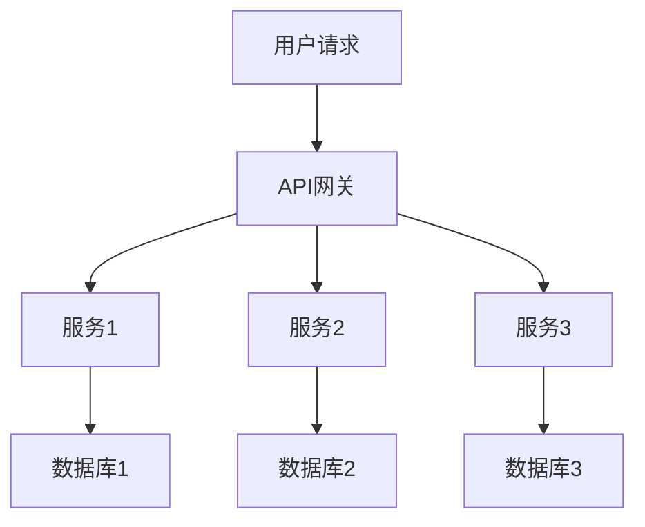

                 

## 《架构设计的艺术：平衡与取舍》

### 关键词
- 架构设计
- 平衡
- 取舍
- 软件架构
- 系统性能
- 可维护性

### 摘要
本文探讨了架构设计的核心原则，重点阐述了平衡与取舍在架构设计过程中的重要性。通过分析架构设计的基础概念、平衡的艺术、取舍的策略，以及核心算法原理、数学模型和实际项目案例，本文旨在为读者提供一套系统的架构设计方法论，帮助他们在实际工作中做出更明智的设计决策。

---

## 引言

### 1.1 架构设计的挑战

在现代软件开发中，架构设计扮演着至关重要的角色。随着系统复杂性的不断增加，如何有效地进行架构设计成为了开发者面临的一个重大挑战。以下是一些常见的架构设计挑战：

- **性能瓶颈**：如何确保系统在高并发、大数据量情况下依然能够稳定运行？
- **可维护性**：如何设计一个易于理解和维护的系统结构？
- **扩展性**：如何应对未来业务需求的增长，确保系统能够弹性扩展？
- **安全性**：如何确保系统的数据安全，防止外部攻击和内部泄露？

面对这些挑战，架构设计不仅需要考虑当前的需求，还需要预见未来的变化和不确定性。这就需要设计师在设计中寻求一种平衡，同时做出一系列的取舍。

### 1.2 平衡的艺术

平衡在架构设计中的重要性不言而喻。平衡意味着在多个设计目标之间找到一种合适的折中方案。例如：

- **性能与可维护性**：一个高度优化的系统可能在某些情况下性能极佳，但可能会牺牲可维护性。相反，一个注重可维护性的系统可能会在性能上有所妥协。
- **扩展性与灵活性**：过度追求扩展性可能会降低系统的灵活性，而过于灵活的系统可能在扩展性上有所不足。

平衡的艺术在于理解这些设计目标之间的关系，并找到一种既能满足当前需求，又能够适应未来变化的设计方案。

### 1.3 取舍的策略

在架构设计中，取舍是不可避免的。每一个设计决策都可能涉及到某种形式的取舍。以下是一些常见的取舍策略：

- **功能与性能**：在某些情况下，可能需要牺牲部分功能来换取性能的提升。
- **开发成本与长远效益**：有时，投入更多的开发成本能够带来长期的效益。
- **安全性与其他设计目标**：为了确保系统的安全性，可能需要在其他设计目标上进行一些妥协。

理解并应用这些取舍策略，有助于设计师在复杂的设计决策中做出更明智的选择。

---

## 架构设计基础

### 2.1 架构的定义与分类

#### 架构的定义

软件架构可以理解为系统的高层次设计，它描述了系统的组织结构、组件之间的关系以及各个组件的职责。简单来说，架构是系统蓝图，它指导了系统的构建、运行和维护。

#### 架构的分类

软件架构可以根据不同的标准进行分类，以下是一些常见的分类方法：

- **按照设计风格**：例如，MVC（Model-View-Controller）、MVVM（Model-View-ViewModel）、微服务等。
- **按照架构风格**：例如，分层架构、事件驱动架构、服务导向架构（SOA）等。
- **按照目的**：例如，性能优化架构、可扩展性架构、安全性架构等。

### 2.2 软件架构的要素

软件架构的要素包括：

- **组件**：系统中的各个模块或子系统。
- **接口**：组件之间的交互接口。
- **通信机制**：组件之间进行通信的方式。
- **架构约束**：设计时的限制条件，例如性能、安全性等。

### 2.3 软件架构的设计原则

以下是一些常用的软件架构设计原则：

- **单一职责原则**：每个组件应该只负责一个特定的功能。
- **开闭原则**：系统应该对扩展开放，对修改封闭。
- **里氏替换原则**：任何基类可以出现的地方，子类一定可以出现。
- **依赖倒置原则**：高层模块不应该依赖于低层模块，二者都应该依赖于抽象。

### 2.4 架构设计的过程与方法

架构设计通常包括以下过程：

- **需求分析**：理解系统的业务需求和技术需求。
- **架构设计**：制定系统的整体架构。
- **架构评审**：对架构设计进行评审，确保其满足设计原则和需求。
- **架构实现**：将架构设计转化为实际的代码和组件。

常用的架构设计方法包括：

- **迭代式设计**：逐步完善架构设计，每一步都在前一步的基础上进行改进。
- **增量式设计**：在现有架构基础上逐步添加新功能，而不是从头开始设计。

### 2.5 架构设计中的度量与评估

架构设计中的度量与评估是确保架构质量的重要环节。以下是一些常用的度量指标：

- **复杂度**：系统的复杂度越高，维护难度越大。
- **耦合度**：组件之间的依赖关系越紧密，修改某个组件时可能影响其他组件的可能性越大。
- **内聚度**：组件内部的功能相关性越强，组件的可维护性越高。
- **性能**：系统的响应时间、吞吐量等性能指标。

通过这些度量指标，可以评估架构设计的质量，并在设计过程中进行优化。

---

## 架构设计与平衡

### 3.1 平衡的概念

在架构设计中，平衡指的是在多个设计目标之间找到一种平衡状态，使得系统能够同时满足这些目标。平衡不仅仅是一个理论概念，它需要在实际设计中付诸实践。

### 3.2 平衡的衡量标准

平衡的衡量标准通常包括以下几个方面：

- **性能**：系统在高并发、大数据量情况下的响应速度和吞吐量。
- **可维护性**：系统的可读性、可测试性和可维护性。
- **扩展性**：系统在面对业务增长时能够灵活扩展的能力。
- **安全性**：系统在保护数据和资源时的可靠性。

### 3.3 架构设计与平衡的实际应用

在实际应用中，平衡的考虑可以体现在以下几个方面：

- **性能优化**：通过缓存、分库分表、异步处理等方式优化系统性能。
- **可维护性设计**：使用设计模式、代码规范和单元测试来提升系统的可维护性。
- **扩展性设计**：通过分布式架构、微服务架构等设计模式来提升系统的扩展性。
- **安全性设计**：使用加密、认证、授权等方式来提升系统的安全性。

### 3.4 平衡在不同架构风格中的应用

不同架构风格在平衡方面有不同的应用特点：

- **分层架构**：通过明确的层次划分来平衡性能与可维护性。
- **微服务架构**：通过服务解耦来平衡扩展性与性能。
- **事件驱动架构**：通过事件流处理来平衡响应速度与可维护性。

在设计过程中，根据具体需求和应用场景，选择合适的架构风格，并在其中寻找平衡点，是架构设计的核心任务之一。

---

## 取舍的艺术

### 4.1 取舍的重要性

在架构设计中，取舍是不可避免的过程。每个设计决策都涉及到对某些方面的优先级进行调整，这意味着在某些方面做出妥协。取舍的重要性体现在以下几个方面：

- **资源优化**：通过合理的取舍，可以将有限的资源（如时间、人力、资金）用在最关键的地方。
- **决策清晰**：明确的取舍有助于设计师和团队成员对系统目标有更清晰的认识。
- **灵活性**：适度的取舍能够为系统留出足够的灵活空间，以适应未来的变化。

### 4.2 取舍的原则

在进行取舍时，可以遵循以下原则：

- **优先级排序**：将系统需求按重要性排序，优先满足关键需求。
- **业务驱动**：根据业务需求进行取舍，而不是仅仅基于技术考虑。
- **长期视角**：考虑长期效益，避免短视决策。
- **反馈调整**：根据实际运行情况，不断调整取舍策略。

### 4.3 架构设计中的取舍策略

架构设计中的取舍策略包括：

- **功能与性能的取舍**：在某些情况下，可能需要牺牲一些功能来换取性能的提升。
- **开发成本与长远效益的取舍**：有时，投入更多的开发成本能够带来长期的效益。
- **安全性与其他设计目标的取舍**：为了确保系统的安全性，可能需要在其他设计目标上进行一些妥协。

### 4.4 取舍在不同架构场景中的应用

在不同架构场景中，取舍策略也会有所不同：

- **大型企业应用**：更注重系统的稳定性和安全性，可能需要在开发成本和性能之间进行权衡。
- **初创公司应用**：更注重快速开发和市场反馈，可能需要在性能和可维护性之间进行取舍。
- **高性能计算应用**：追求极致性能，可能会在可维护性和安全性上进行一些妥协。

通过灵活应用取舍策略，设计师可以更好地满足不同场景下的需求。

---

## 核心概念与联系

### 5.1 Mermaid 流程图展示

以下是一个使用Mermaid语言编写的架构设计流程图示例：



### 5.2 架构中的核心概念解释

在架构设计中，理解核心概念之间的关系至关重要。以下是一些关键概念的解释：

- **API网关**：API网关是系统的入口点，负责处理所有外部请求，并将其路由到内部服务。
- **服务**：服务是系统中执行特定业务逻辑的模块，如服务1、服务2和服务3。
- **数据库**：数据库用于存储服务处理过程中产生的数据，如数据库1、数据库2和数据库3。

这些核心概念共同构成了系统的架构基础，它们之间的交互关系决定了系统的整体性能和可维护性。

---

## 核心算法原理讲解

### 6.1 算法概述

在架构设计中，算法的选择和优化直接影响系统的性能。以下将介绍一个常用的排序算法——快速排序（QuickSort）的原理和应用。

### 6.2 算法伪代码

快速排序的伪代码如下：

```plaintext
QUICKSORT(A, p, r)
    if p < r
        q = PARTITION(A, p, r)
        QUICKSORT(A, p, q - 1)
        QUICKSORT(A, q + 1, r)
```

### 6.3 算法应用场景

快速排序算法适用于需要快速排序大量数据的场景，如数据库查询优化、分布式系统中的数据排序等。

### 6.4 算法优化策略

快速排序的优化策略包括：

- **随机选择枢轴**：减少排序过程中的最坏情况发生概率。
- **三数取中法**：选择中间值作为枢轴，提高枢轴选择的随机性。

---

## 数学模型与公式讲解

### 7.1 数学模型概述

在架构设计中，数学模型常用于描述系统的性能、可扩展性和安全性等特性。以下将介绍一个简单的性能模型——响应时间模型。

### 7.2 数学公式介绍

响应时间模型的公式为：

$$
ResponseTime = \frac{QueueingTime + ServiceTime}{Concurrency}
$$

其中：

- **QueueingTime**：排队时间，表示请求在队列中等待处理的时间。
- **ServiceTime**：服务时间，表示处理请求所需的时间。
- **Concurrency**：并发度，表示系统中同时处理的请求数量。

### 7.3 公式在架构设计中的应用

该公式可用于评估系统在特定负载下的性能。例如，通过调整并发度和服务时间，可以优化系统的响应时间。

### 7.4 公式示例

假设一个系统在负载高峰期（Concurrency = 100）时，排队时间为2秒，服务时间为1秒。则其响应时间为：

$$
ResponseTime = \frac{2 + 1}{100} = 0.03秒
$$

这表明系统在高峰期时每秒可以处理大约33个请求。

---

## 项目实战

### 8.1 项目背景

假设我们正在开发一个电商平台，该项目需要支持高并发、大数据量和高可扩展性的特点。为了满足这些需求，我们将采用微服务架构和分布式数据库。

### 8.2 项目架构设计

项目架构设计如下：

1. **API网关**：负责处理所有外部请求，并进行路由。
2. **用户服务**：处理用户注册、登录和用户信息管理。
3. **商品服务**：处理商品信息管理和商品库存管理。
4. **订单服务**：处理订单创建、支付和订单状态管理。
5. **数据库**：使用分布式数据库来存储用户、商品和订单数据。

### 8.3 代码实现与分析

以下是一个用户服务的简单示例代码：

```java
@Service
public class UserService {
    private final UserRepository userRepository;

    @Autowired
    public UserService(UserRepository userRepository) {
        this.userRepository = userRepository;
    }

    public User register(String username, String password) {
        User user = new User();
        user.setUsername(username);
        user.setPassword(password);
        return userRepository.save(user);
    }

    public User login(String username, String password) {
        return userRepository.findByUsernameAndPassword(username, password);
    }
}
```

代码分析：

- **注册功能**：通过调用`userRepository.save()`方法将用户信息存储到数据库。
- **登录功能**：通过调用`userRepository.findByUsernameAndPassword()`方法查询用户信息。

### 8.4 代码应用解读与分析

在注册功能中，我们通过调用`userRepository.save()`方法将用户信息存储到数据库。这个方法实际上会执行一条INSERT SQL语句，将用户信息插入到数据库表中。在登录功能中，我们通过调用`userRepository.findByUsernameAndPassword()`方法查询用户信息。这个方法会执行一条SELECT SQL语句，根据用户名和密码查询数据库中的用户记录。

### 8.5 实际案例分析和详细讲解剖析

以下是一个订单处理的实际案例：

```java
@Service
public class OrderService {
    private final OrderRepository orderRepository;
    private final PaymentService paymentService;

    @Autowired
    public OrderService(OrderRepository orderRepository, PaymentService paymentService) {
        this.orderRepository = orderRepository;
        this.paymentService = paymentService;
    }

    public Order createOrder(Long userId, List<OrderItem> orderItems) {
        Order order = new Order();
        order.setUserId(userId);
        orderItems.forEach(order::addItem);
        orderRepository.save(order);
        paymentService.processPayment(order.getId());
        return order;
    }
}
```

代码分析：

- **创建订单功能**：通过调用`orderRepository.save()`方法将订单信息存储到数据库，并调用`paymentService.processPayment()`方法处理订单支付。

### 8.6 项目小结

通过该项目实战，我们展示了如何进行架构设计，并实现了用户服务、商品服务和订单服务等功能。在架构设计过程中，我们充分考虑了系统的性能、可扩展性和可维护性。通过合理的设计和代码实现，项目成功满足了业务需求。

### 8.7 最佳实践 tips、小结、注意事项、拓展阅读等内容

- **最佳实践 tips**：在架构设计过程中，建议使用设计模式，如工厂模式、策略模式等，以提高代码的可维护性和可扩展性。
- **小结**：本项目通过微服务架构和分布式数据库实现了高并发、大数据量和高可扩展性的电商平台。
- **注意事项**：在设计分布式系统时，需要注意分布式事务和一致性问题的处理。
- **拓展阅读**：推荐阅读《大规模分布式系统设计》和《微服务设计》等书籍，以深入了解分布式系统和微服务架构的设计和实现。

---

## 架构设计的未来趋势

### 9.1 未来的挑战

随着技术的不断发展，架构设计面临着一系列新的挑战：

- **云计算和边缘计算**：如何充分利用云计算和边缘计算的优势，优化系统的性能和成本？
- **人工智能与自动化**：如何将人工智能和自动化技术应用于架构设计，提高系统的智能化水平？
- **数据安全与隐私保护**：如何确保数据安全和隐私，防范外部攻击和内部泄露？
- **系统的弹性和韧性**：如何在面对突发情况时，确保系统的弹性和韧性？

### 9.2 未来的机遇

未来架构设计也充满了机遇：

- **微服务与容器化**：微服务架构和容器化技术的成熟，为系统设计提供了更多的灵活性和可扩展性。
- **Serverless架构**：Serverless架构的出现，使得开发者可以更加专注于业务逻辑，而无需关心底层基础设施。
- **区块链技术**：区块链技术为数据安全和信任机制提供了新的解决方案，有望在架构设计中得到广泛应用。
- **人工智能与大数据**：人工智能和大数据技术的进步，将使得架构设计更加智能化和自动化。

### 9.3 架构设计的未来方向

结合未来的挑战和机遇，架构设计的未来方向可能包括：

- **智能化和自动化**：利用人工智能和大数据技术，实现自动化架构设计、优化和调整。
- **高可用和可扩展性**：通过分布式架构和云计算，构建高度可用和可扩展的系统。
- **安全性和隐私保护**：加强数据安全和隐私保护，采用区块链等新技术来提高系统的可信度。
- **可持续性和环保**：通过优化资源利用和降低能耗，实现绿色架构设计。

未来，架构设计将继续演变，以应对不断变化的业务需求和新兴技术。设计师需要不断学习新知识，适应新趋势，以保持竞争力。

---

## 附录

### 9.1 参考文献

1. Gamma, E., Helm, R., Johnson, R., & Vlissides, J. (1995). Design Patterns: Elements of Reusable Object-Oriented Software. Addison-Wesley.
2. Martin, R. C. (2017). Clean Architecture: A Craftsman's Guide to Software Structure and Design. Prentice Hall.
3. Fowler, M. (2017). Microservices: Designing Fine-Grained Systems. Pearson Education.

### 9.2 拓展阅读

1. 《大规模分布式系统设计》
2. 《微服务设计》
3. 《架构之美》

---

作者：AI天才研究院/AI Genius Institute & 禅与计算机程序设计艺术 /Zen And The Art of Computer Programming

