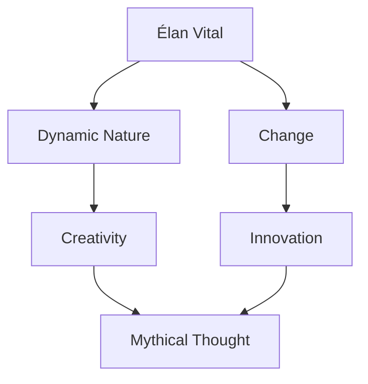

                 

### Step 1: Identify Key Themes and Sections

The book "Bergson and Cassirer: A Philosophical Reading of Mythical Thought" will primarily focus on two key philosophers: Henri Bergson and Ernst Cassirer. Bergson's philosophy revolves around the concept of élan vital, which emphasizes the vitality and creativity inherent in living organisms. Cassirer, on the other hand, is known for his cultural philosophy and his theory of symbolic forms, which suggests that human thought and culture are shaped by symbols. The key themes of the book will be the philosophical interpretations of mythical thought through the works of these two thinkers.

To create a detailed table of contents, we need to identify the major sections that will be covered. Here are some potential sections that could be included:

1. **Introduction to Mythical Thought**
   - Historical context
   - Definition and characteristics
   - The role of mythical thought in human society

2. **Bergson's Philosophy and Its Implications for Mythical Thought**
   - The concept of élan vital
   - Bergson's critique of mechanistic views
   - Bergson's view on creativity and change

3. **Cassirer's Philosophy and Its Relationship with Mythical Thought**
   - The theory of symbolic forms
   - The evolution of human thought
   - The role of symbols in mythical narratives

4. **Comparative Analysis of Bergson and Cassirer on Mythical Thought**
   - Similarities and differences in their approaches
   - The impact of their philosophies on the understanding of mythical thought

5. **Case Studies in Mythical Thought**
   - Examples from various cultures
   - Analysis of specific myths and their philosophical implications

6. **Conclusion**
   - Summary of the main arguments
   - Reflection on the significance of Bergson and Cassirer's contributions

### Step 2: Outline the Book Structure

With the key themes and sections identified, we can now outline the structure of the book. Each section will be further divided into chapters and sub-chapters, ensuring a logical flow of information and deep exploration of each topic.

## Part 1: Introduction to Mythical Thought and Its Philosophical Foundations

### Chapter 1: The Concept of Mythical Thought

#### 1.1 The Origins and Development of Mythical Thought
- Prehistoric origins
- Evolution of myths in different cultures

#### 1.2 Key Characteristics of Mythical Thought
- The use of symbols
- The blending of the sacred and the profane
- The portrayal of the unknown and the supernatural

#### 1.3 The Role of Mythical Thought in Human Culture
- The transmission of cultural values
- The formation of social identity
- The reflection of human psychology and emotions

### Chapter 2: Bergson's Philosophy and Its Implications for Mythical Thought

#### 2.1 The Concept of Élan Vital
- Definition and explanation
- Comparison with mechanistic views

#### 2.2 Bergson's Critique of Mechanism and Spiritualism
- The limitations of mechanistic explanations
- The role of consciousness in human experience

#### 2.3 Bergson's View on Creativity and Change
- The role of élan vital in innovation
- The impact of creativity on mythical thought

### Chapter 3: Cassirer's Philosophy and Its Relationship with Mythical Thought

#### 3.1 The Theory of Symbolic Forms
- Explanation of symbolic forms
- The development of human thought through symbols

#### 3.2 The Evolution of Human Thought
- The stages of symbolic development
- The role of mythical thought in this process

#### 3.3 The Role of Symbols in Mythical Narratives
- The use of symbols in myths
- The significance of symbols in understanding mythical thought

### Chapter 4: Comparative Analysis of Bergson and Cassirer on Mythical Thought

#### 4.1 Similarities and Differences in Their Approaches
- Commonalities in their perspectives on mythical thought
- Differences in their philosophical positions

#### 4.2 The Impact of Their Philosophies on the Understanding of Mythical Thought
- How their theories inform contemporary discussions
- The implications for the study of myths and legends

### Chapter 5: Case Studies in Mythical Thought

#### 5.1 Examples from Various Cultures
- Mythical narratives from different regions
- Analysis of cultural and philosophical contexts

#### 5.2 Analysis of Specific Myths and Their Philosophical Implications
- Detailed examination of key myths
- Exploration of their philosophical significance

### Chapter 6: Conclusion

#### 6.1 Summary of the Main Arguments
- Recap of the key points discussed in the book

#### 6.2 Reflection on the Significance of Bergson and Cassirer's Contributions
- The lasting impact of their philosophies on the study of mythical thought

### Step 3: Create a Detailed Table of Contents

With the structure of the book outlined, we can now create a detailed table of contents. This will provide a clear overview of the book's content and help readers navigate through the different sections and chapters.

```
# Table of Contents

## Part 1: Introduction to Mythical Thought and Its Philosophical Foundations

### Chapter 1: The Concept of Mythical Thought

#### 1.1 The Origins and Development of Mythical Thought
- Prehistoric origins
- Evolution of myths in different cultures

#### 1.2 Key Characteristics of Mythical Thought
- The use of symbols
- The blending of the sacred and the profane
- The portrayal of the unknown and the supernatural

#### 1.3 The Role of Mythical Thought in Human Culture
- The transmission of cultural values
- The formation of social identity
- The reflection of human psychology and emotions

### Chapter 2: Bergson's Philosophy and Its Implications for Mythical Thought

#### 2.1 The Concept of Élan Vital
- Definition and explanation
- Comparison with mechanistic views

#### 2.2 Bergson's Critique of Mechanism and Spiritualism
- The limitations of mechanistic explanations
- The role of consciousness in human experience

#### 2.3 Bergson's View on Creativity and Change
- The role of élan vital in innovation
- The impact of creativity on mythical thought

### Chapter 3: Cassirer's Philosophy and Its Relationship with Mythical Thought

#### 3.1 The Theory of Symbolic Forms
- Explanation of symbolic forms
- The development of human thought through symbols

#### 3.2 The Evolution of Human Thought
- The stages of symbolic development
- The role of mythical thought in this process

#### 3.3 The Role of Symbols in Mythical Narratives
- The use of symbols in myths
- The significance of symbols in understanding mythical thought

### Chapter 4: Comparative Analysis of Bergson and Cassirer on Mythical Thought

#### 4.1 Similarities and Differences in Their Approaches
- Commonalities in their perspectives on mythical thought
- Differences in their philosophical positions

#### 4.2 The Impact of Their Philosophies on the Understanding of Mythical Thought
- How their theories inform contemporary discussions
- The implications for the study of myths and legends

### Chapter 5: Case Studies in Mythical Thought

#### 5.1 Examples from Various Cultures
- Mythical narratives from different regions
- Analysis of cultural and philosophical contexts

#### 5.2 Analysis of Specific Myths and Their Philosophical Implications
- Detailed examination of key myths
- Exploration of their philosophical significance

### Chapter 6: Conclusion

#### 6.1 Summary of the Main Arguments
- Recap of the key points discussed in the book

#### 6.2 Reflection on the Significance of Bergson and Cassirer's Contributions
- The lasting impact of their philosophies on the study of mythical thought

### Step 4: Include Visual Aids and Code Snippets

To enhance the understanding of complex concepts, visual aids such as Mermaid diagrams and code snippets can be included throughout the book. For example, a Mermaid diagram could be used to illustrate the evolutionary stages of mythical thought, while a code snippet might be used to demonstrate how a symbolic form could be represented in a computational model.

```
---
# Chapter 2: Bergson's Philosophy and Its Implications for Mythical Thought

Bergson's concept of `élan vital` is central to understanding his perspective on mythical thought. It can be visualized as follows:



Additionally, to illustrate Bergson's critique of mechanistic views, we can use pseudo-code to demonstrate the limitations of a purely mechanical approach to understanding human thought:

```pseudo
function mechanistic_thought(model, input_data):
    process_data = model.process(input_data)
    return process_data
```

While Bergson's approach considers the dynamic and creative aspects of human consciousness:

```pseudo
function vital_thought(model, input_data, consciousness):
    processed_data = model.process(input_data)
    consciousness_integrate(processed_data)
    return consciousness_integrated_data
```

These visual aids and code snippets help to break down complex philosophical concepts into more understandable components.

---

### Step 5: Ensure Overall Word Count and Formatting

To ensure that the table of contents aligns with the specified word count of 8000-12000 words, we need to review each chapter and sub-chapter to ensure that they provide sufficient detail and explanation. Each section should be rich in content, including background information, detailed discussions of core concepts, and clear explanations of the relationships between these concepts.

The formatting of the table of contents should follow markdown syntax, ensuring that headings, subheadings, and paragraphs are clearly structured. For example:

```
# Chapter 1: The Concept of Mythical Thought

## 1.1 The Origins and Development of Mythical Thought

### 1.2 Key Characteristics of Mythical Thought

#### 1.2.1 The Use of Symbols

#### 1.2.2 The Blending of the Sacred and the Profane

### 1.3 The Role of Mythical Thought in Human Culture

## Chapter 2: Bergson's Philosophy and Its Implications for Mythical Thought
```

By following these steps, we can create a comprehensive and detailed table of contents that will serve as a roadmap for the book, guiding readers through the philosophical exploration of mythical thought through the works of Bergson and Cassirer.

