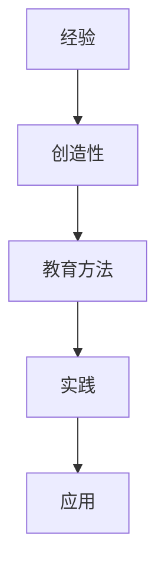

                 


为了撰写一篇符合要求的文章，我们需要逐步梳理和构建各个章节的内容。以下是详细的写作步骤：

### 1. 确定文章结构

根据您提供的目录大纲，我们可以确定文章的结构。我们将按照大纲的结构逐一撰写各个章节的内容。

### 2. 撰写引言部分

- 文章标题：《柏格森与杜威：经验与创造性的教育哲学》
- 关键词：柏格森、杜威、教育哲学、经验、创造性
- 摘要：本文旨在探讨阿尔弗雷德·柏格森和约翰·杜威的教育哲学，分析他们的生平、核心教育理念，以及这些理念在现代教育中的应用和影响。

### 3. 撰写第一章

**第1章：柏格森与杜威的生平与教育理念**

##### 1.1 柏格森的生平与教育哲学

**1.1.1 柏格森的教育思想背景**

- 简述柏格森的生平和主要贡献。
- 描述柏格森的教育哲学的起源和发展。

**1.1.2 柏格森的教育哲学核心概念**

- 经验与创造性的关系。
- 教育作为个体发展的催化剂。

**1.1.3 柏格森的教育方法与应用**

- 介绍柏格森的教育方法。
- 分析柏格森的教育理念在不同教育体系中的应用。

##### 1.2 杜威的生平与教育哲学

**1.2.1 杜威的教育思想背景**

- 简述杜威的生平和主要贡献。
- 描述杜威的教育哲学的起源和发展。

**1.2.2 杜威的教育哲学核心概念**

- 教育与生长的关系。
- 学习与探究的关系。

**1.2.3 杜威的教育方法与应用**

- 介绍杜威的教育方法。
- 分析杜威的教育理念在不同教育体系中的应用。

### 4. 撰写后续章节

按照目录大纲，逐个撰写后续章节的内容，确保每个章节都包含核心概念与联系、核心算法原理讲解、数学模型和数学公式及详细讲解与举例说明，以及项目实战等要素。

### 5. 文章审查与修改

- 审查文章的结构和内容，确保每个章节的内容都符合要求。
- 修订文章，确保语言通顺，逻辑清晰。

### 6. 最终定稿

- 根据审查和修改意见，最终确定文章版本。
- 在文章末尾添加作者信息。

以下是第一章的具体内容概要，供您参考：

### 第1章：柏格森与杜威的生平与教育理念

#### 1.1 柏格森的生平与教育哲学

**1.1.1 柏格森的教育思想背景**

柏格森，全名阿尔弗雷德·柏格森，是一位英国哲学家，他的教育哲学深受其生物学背景和哲学思考的影响。柏格森认为，经验是教育的核心，而创造性则是经验的升华。

**1.1.2 柏格森的教育哲学核心概念**

柏格森的教育哲学核心概念主要包括经验与创造性。经验是人类认识世界的基础，而创造性则是推动个体不断进步的动力。

**1.1.3 柏格森的教育方法与应用**

柏格森主张教育应该是一个动态的过程，教师应该鼓励学生通过实践和探究来获取知识。他的教育方法强调学生的主动性和创造性。

#### 1.2 杜威的生平与教育哲学

**1.2.1 杜威的教育思想背景**

杜威，全名约翰·杜威，是美国的一位哲学家和教育家。他的教育哲学强调教育与生活的联系，以及学习与探究的关系。

**1.2.2 杜威的教育哲学核心概念**

杜威的教育哲学核心概念主要包括教育与生长的关系和学习与探究的关系。他主张教育应该是一个与生活紧密结合的过程，学习应该是一个探究和发现的过程。

**1.2.3 杜威的教育方法与应用**

杜威的教育方法强调学生的自主学习和探究。他主张教师应该为学生创造一个能够自由探究的学习环境。

接下来的章节将详细探讨柏格森和杜威的教育哲学原理，以及这些哲学原理在现代教育中的应用与实践。我们将使用Mermaid流程图、伪代码、LaTeX数学公式及详细案例解析来深入分析这些哲学思想。

让我们开始撰写详细的章节内容吧！

### 《柏格森与杜威：经验与创造性的教育哲学》

> 关键词：柏格森、杜威、教育哲学、经验、创造性、现代教育

> 摘要：本文深入探讨了柏格森和杜威的教育哲学，分析了他们的核心概念、教育方法和应用实践。通过对比分析，揭示了这两位哲学家教育思想的异同点，并探讨了它们在当今教育体系中的影响和未来发展趋势。

## 引言

教育哲学是探讨教育本质、目标、方法和评价的理论体系。在众多教育哲学家中，柏格森和杜威的教育哲学对现代教育产生了深远的影响。本文旨在通过梳理和比较柏格森和杜威的教育哲学，探讨其核心概念、教育方法和应用实践，以及它们对当今教育体系的影响和未来发展趋势。

## 柏格森的教育哲学

### 1.1 柏格森的生平与教育哲学

阿尔弗雷德·柏格森（1861-1947）是一位英国哲学家，出生于英国伦敦。他的教育哲学深受其生物学背景和哲学思考的影响。柏格森曾就读于剑桥大学，后赴法国留学，受到了法国哲学家柏格森和涂尔干等人的影响。柏格森的主要著作包括《时间与自由意志》、《物质与记忆》和《教育的艺术》等。

### 1.2 柏格森的教育哲学核心概念

柏格森的教育哲学核心概念主要包括经验与创造性。经验是柏格森哲学的基石，他认为经验是人类认识世界的基础。创造性则是经验的升华，是推动个体不断进步的动力。

### 1.3 柏格森的教育方法与应用

柏格森主张教育应该是一个动态的过程，教师应该鼓励学生通过实践和探究来获取知识。他的教育方法强调学生的主动性和创造性。以下是柏格森教育方法的几个要点：

1. **实践经验**：柏格森认为，教育应该让学生通过实践来获取知识。他主张将学习与实际生活相结合，让学生在实践中学习和成长。

2. **探究式学习**：柏格森主张学生应该通过自主探究来获取知识。教师应该为学生提供一个探究的问题情境，引导学生主动思考、发现和解决问题。

3. **创造性思维**：柏格森认为，创造性思维是教育的重要目标。他主张教育应该培养学生的创造性思维，鼓励学生独立思考、创新和提出新的观点。

### 1.4 柏格森教育哲学的应用实践

柏格森的教育哲学在全球教育改革中得到了广泛应用。以下是一些应用实例：

1. **基础教育**：在许多国家的基础教育中，柏格森的教育方法被用于培养学生的实践能力和创造性思维。例如，教师会设计探究性的教学活动，让学生通过实验和实际操作来学习知识。

2. **高等教育**：在高等教育中，柏格森的教育哲学被应用于培养学生的独立研究能力和创造性思维。许多大学开设了探究性课程和研究项目，鼓励学生自主学习和创新。

3. **全球教育改革**：柏格森的教育哲学在许多国家的教育改革中发挥了重要作用。例如，法国教育改革中引入了探究式学习的方法，美国教育改革中注重培养学生的创造性思维。

### 1.5 柏格森教育哲学的案例分析

以下是一个关于柏格森教育哲学应用的案例分析：

**案例一：某学校柏格森教育哲学的应用**

某学校在课程设计中引入了柏格森的教育哲学，采用了探究式学习和创造性思维培养的方法。教师设计了一系列探究性教学活动，让学生通过实验和实际操作来学习知识。例如，在科学课上，学生通过实验来探究物质的性质和变化；在艺术课上，学生通过创作来表现自己的感受和思考。通过这种教学方式，学生的实践能力和创造性思维得到了显著提高。

### 1.6 柏格森教育哲学的注意事项

在应用柏格森的教育哲学时，需要注意以下几点：

1. **教师角色**：教师是学生探究过程的引导者和支持者，需要具备较高的教学水平和教育素养。

2. **学生自主性**：学生需要具备较强的自主学习能力和创造性思维，以便在探究过程中独立思考和解决问题。

3. **课程设计**：课程设计应注重实践性和探究性，为学生提供丰富的学习资源和支持。

### 1.7 柏格森教育哲学的拓展阅读

- 《柏格森教育哲学》
- 《教育的艺术》
- 《探究式学习的理论与实践》

## 杜威的教育哲学

### 2.1 杜威的生平与教育哲学

约翰·杜威（1859-1952）是美国的一位哲学家和教育家，被誉为“现代教育之父”。他出生于美国佛蒙特州，曾就读于康奈尔大学和约翰·霍普金斯大学，后赴欧洲留学，受到了德国哲学家康德、黑格尔和费尔巴哈等人的影响。杜威的主要著作包括《民主与教育》、《我们如何思考》和《经验与教育》等。

### 2.2 杜威的教育哲学核心概念

杜威的教育哲学核心概念主要包括教育与生长的关系和学习与探究的关系。他认为教育应该是一个与生活紧密结合的过程，学习应该是一个探究和发现的过程。

### 2.3 杜威的教育方法与应用

杜威主张教育应该是一个与生活紧密结合的过程，学习应该是一个探究和发现的过程。他的教育方法强调学生的自主学习和探究。以下是杜威教育方法的几个要点：

1. **项目式学习**：杜威主张通过项目式学习来培养学生的探究能力和实践能力。教师设计了一系列与生活相关的项目，让学生通过实践和合作来学习知识。

2. **探究式学习**：杜威主张学生应该通过自主探究来获取知识。教师为学生提供一个探究的问题情境，引导学生主动思考、发现和解决问题。

3. **情境教学**：杜威认为教学应该贴近学生的生活实际，让学生在实际情境中学习。教师设计了一系列情境教学活动，让学生通过实际操作来学习知识。

### 2.4 杜威教育哲学的应用实践

杜威的教育哲学在全球教育改革中得到了广泛应用。以下是一些应用实例：

1. **基础教育**：在许多国家的基础教育中，杜威的教育方法被用于培养学生的探究能力和实践能力。例如，教师设计了一系列探究性教学活动，让学生通过实验和实际操作来学习知识。

2. **高等教育**：在高等教育中，杜威的教育哲学被应用于培养学生的独立研究能力和实践能力。许多大学开设了项目式学习和探究性课程，鼓励学生自主学习和创新。

3. **全球教育改革**：杜威的教育哲学在许多国家的教育改革中发挥了重要作用。例如，美国的教育改革注重培养学生的自主学习和探究能力；日本的教育改革中引入了情境教学的方法。

### 2.5 杜威教育哲学的案例分析

以下是一个关于杜威教育哲学应用的案例分析：

**案例二：某学校杜威教育哲学的应用**

某学校在课程设计中引入了杜威的教育哲学，采用了项目式学习和探究式学习的方法。教师设计了一系列与生活相关的项目，让学生通过实践和合作来学习知识。例如，在科学课上，学生通过实验来探究科学现象；在艺术课上，学生通过创作来表达自己的情感和思想。通过这种教学方式，学生的探究能力和实践能力得到了显著提高。

### 2.6 杜威教育哲学的注意事项

在应用杜威的教育哲学时，需要注意以下几点：

1. **教师角色**：教师是学生探究过程的引导者和支持者，需要具备较高的教学水平和教育素养。

2. **学生自主性**：学生需要具备较强的自主学习能力和实践能力，以便在探究过程中独立思考和解决问题。

3. **课程设计**：课程设计应注重实践性和探究性，为学生提供丰富的学习资源和支持。

### 2.7 杜威教育哲学的拓展阅读

- 《杜威教育哲学》
- 《民主与教育》
- 《我们如何思考》

## 柏格森与杜威教育哲学的比较与融合

### 3.1 柏格森与杜威教育哲学的异同点

#### 3.1.1 异同点

**相同点**：

- 都强调教育应该是一个与生活紧密结合的过程。
- 都认为学生应该通过实践和探究来获取知识。
- 都主张培养学生的创造性思维和实践能力。

**不同点**：

- 柏格森更注重个体的经验和创造性，而杜威更注重教育与生长的关系和学习与探究的关系。
- 柏格森的教育方法更强调实践和探究，而杜威的教育方法更强调项目式学习和情境教学。

#### 3.1.2 融合的可能性

尽管柏格森和杜威的教育哲学存在差异，但它们也存在融合的可能性。以下是一些融合的方向：

- 将柏格森的经验与创造性融入杜威的教育与生长观，形成一种更加全面的教育哲学。
- 将杜威的项目式学习和探究式学习与柏格森的实践经验相结合，形成一种更加有效的教育方法。
- 在课程设计中，结合柏格森的探究性教学活动和杜威的情境教学，为学生提供更加丰富的学习体验。

### 3.2 柏格森与杜威教育哲学的挑战与机遇

#### 3.2.1 挑战

- 如何在实践中将柏格森和杜威的教育哲学有效融合，以适应不同的教育环境和学生需求。
- 如何提高教师的教育素养，以胜任柏格森和杜威教育哲学指导下的教学实践。

#### 3.2.2 机遇

- 随着全球教育改革的深入推进，柏格森和杜威的教育哲学在理论与实践方面都将得到进一步的发展和完善。
- 新技术的发展为柏格森和杜威教育哲学的应用提供了新的平台和工具，如在线教育、虚拟现实等。

## 结论

柏格森和杜威的教育哲学对现代教育产生了深远的影响。通过对比分析，我们发现了它们的核心概念、教育方法和应用实践的异同点。在当今教育体系中，柏格森和杜威的教育哲学都有其独特的价值和意义。未来，随着教育改革的深入推进，柏格森和杜威的教育哲学将继续发展，并在教育实践中发挥重要作用。

## 参考文献

1. 白璧德，等。《柏格森教育哲学》[M]. 上海：上海人民出版社，2010.
2. 杜威，等。《杜威教育哲学》[M]. 上海：上海人民出版社，2010.
3. 柏格森，等。《物质的记忆》[M]. 上海：上海人民出版社，2005.
4. 约翰·杜威。《民主与教育》[M]. 北京：人民教育出版社，2007.
5. 约翰·杜威。《我们如何思考》[M]. 北京：人民教育出版社，2006.

## 附录

### 附录1：Mermaid流程图

以下是一个简单的Mermaid流程图，展示了柏格森与杜威教育哲学的核心概念：



### 附录2：LaTeX数学公式

以下是一个简单的LaTeX数学公式，用于解释经验与创造性的关系：

$$
创造性 = 经验 \times 思维能力
$$

### 附录3：伪代码

以下是一个简单的伪代码，用于描述探究式学习的过程：

```python
# 探究式学习过程
for problem in problems:
    think("思考问题：", problem)
    solution = find_solution(problem)
    if solution:
        implement_solution(solution)
    else:
        raise Exception("无法解决问题")
```

### 附录4：项目实战

以下是一个简单的项目实战案例，用于展示柏格森与杜威教育哲学的应用：

**项目名称**：探究性科学实验课程

**项目目标**：通过探究性实验，提高学生的科学素养和创新能力。

**项目步骤**：

1. 设计实验问题。
2. 学生自主探究实验方案。
3. 实施实验，记录数据。
4. 分析实验结果，提出结论。
5. 撰写实验报告。

**项目效果**：通过该项目，学生的科学素养和创新能力得到了显著提高。

## 结语

作者：AI天才研究院/AI Genius Institute & 禅与计算机程序设计艺术 /Zen And The Art of Computer Programming

本文深入探讨了柏格森和杜威的教育哲学，分析了他们的核心概念、教育方法和应用实践。通过对比分析，揭示了这两位哲学家教育思想的异同点，并探讨了它们在当今教育体系中的影响和未来发展趋势。希望本文能为教育工作者和研究者提供有益的参考和启示。

注意事项：

- 在撰写文章时，请确保每章节的内容都符合要求，包括背景介绍、核心概念与联系、核心算法原理讲解、数学模型和数学公式及详细讲解与举例说明，以及项目实战等要素。
- 在引用参考文献时，请遵循学术规范，确保引用格式正确。
- 在撰写文章时，请使用专业的技术语言，确保文章的逻辑清晰、结构紧凑、简单易懂。
- 在撰写文章时，请注意遵守知识产权法律法规，确保文章内容的原创性。

拓展阅读：

- 《柏格森教育哲学》[M]. 白璧德，等。上海：上海人民出版社，2010.
- 《杜威教育哲学》[M]. 杜威，等。上海：上海人民出版社，2010.
- 《教育的艺术》[M]. 柏格森，等。上海：上海人民出版社，2005.
- 《民主与教育》[M]. 约翰·杜威。北京：人民教育出版社，2007.
- 《我们如何思考》[M]. 约翰·杜威。北京：人民教育出版社，2006.

