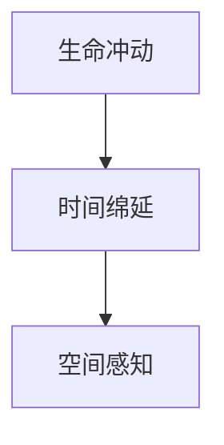
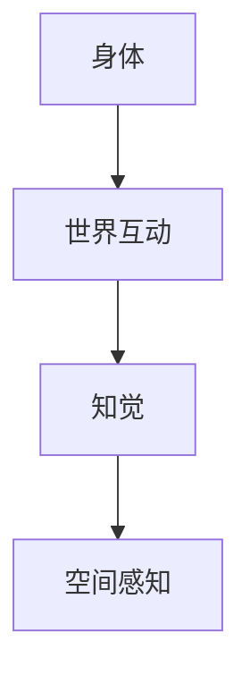

                 


### 文章标题：柏格森与梅洛-庞蒂：空间感知的哲学探讨

#### 关键词：柏格森，梅洛-庞蒂，空间感知，哲学，人工智能

#### 摘要：
本文深入探讨了柏格森与梅洛-庞蒂关于空间感知的哲学观点，分析了两位哲学家的核心概念、理论架构以及他们之间的联系和区别。通过对比分析，探讨了空间感知在哲学领域的重要性，以及两位哲学家的理论对现代哲学和人工智能领域的影响。

----------------------------------------------------------------

### 引言

#### 1.1 柏格森和梅洛-庞蒂的生平与哲学背景

柏格森（Henri Bergson）是19世纪末20世纪初法国著名的哲学家，他的思想对现代哲学和心理学产生了深远的影响。柏格森的核心思想是关于“生命冲动”（élan vital），他认为生命是一种不断流动的、不可预测的内在动力，这种冲动是生命现象的本质。柏格森还提出了“绵延”（durée）概念，认为时间不是一条直线，而是一个不断变化的、连续的流动过程。

梅洛-庞蒂（Maurice Merleau-Ponty）是20世纪法国现象学哲学家，他的哲学思想深受柏格森的影响。梅洛-庞蒂的主要贡献是提出了“身体-心灵”（body-mind）二元论，认为人的意识和认知不是孤立于身体的，而是通过身体与世界的互动来实现的。梅洛-庞蒂的核心概念是“知觉现象学”（phenomenology of perception），他试图通过现象学的方法来理解人的知觉和经验。

#### 1.2 空间感知哲学探讨的背景与意义

空间感知是哲学、心理学、认知科学等领域的重要研究主题之一。柏格森和梅洛-庞蒂从不同的哲学角度对空间感知进行了深刻的探讨。柏格森认为，空间感知是一种内在的生命冲动，与时间的绵延密切相关。梅洛-庞蒂则强调，空间感知是一种通过身体与世界互动而产生的知觉现象，这种互动是理解人类认知和行为的关键。

在人工智能领域，空间感知也是一个重要的研究方向。随着深度学习技术的发展，许多人工智能系统已经能够通过图像、声音和其他传感器数据来感知和理解空间环境。然而，这些系统的空间感知能力仍然远远不及人类。柏格森和梅洛-庞蒂的空间感知理论为理解人类空间感知的本质提供了哲学基础，有助于人工智能系统在空间感知方面的进一步发展。

### 柏格森的空间感知理论

#### 2.1 柏格森的核心概念与理论架构

柏格森的核心概念包括“生命冲动”（élan vital）和“绵延”（durée）。他认为，生命冲动是一种内在的动力，是生命现象的本质。这种冲动使得生命不断地变化和发展，形成了时间的绵延。柏格森认为，空间感知是生命冲动的一种表现形式，是人与世界互动的结果。

柏格森的理论架构可以分为以下几个方面：

1. **生命冲动**：生命冲动是生命的内在动力，是生命现象的本质。
2. **绵延**：时间是不断变化的、连续的流动过程，与空间感知密切相关。
3. **直觉**：直觉是感知和理解世界的直接方式，不同于逻辑思维和科学方法。
4. **空间感知**：空间感知是生命冲动的一种表现形式，是人与世界互动的结果。

#### 2.2 柏格森空间感知理论的详细阐述

柏格森认为，空间感知是一种内在的生命冲动，与时间的绵延密切相关。具体来说，他提出了以下几个观点：

1. **空间是时间的感知**：柏格森认为，空间不是独立于时间的，而是通过时间的绵延来感知的。他认为，我们的空间感知是通过时间的流动来实现的，这种感知方式不同于科学方法所采用的离散的、静态的感知方式。
2. **空间感知与直觉**：柏格森认为，直觉是感知和理解世界的直接方式，不同于逻辑思维和科学方法。他认为，我们的空间感知是通过直觉来实现的，这种直觉感知方式能够捕捉到空间变化的细微之处，而科学方法则无法做到。
3. **空间感知与生命冲动**：柏格森认为，空间感知是生命冲动的一种表现形式。我们的空间感知是通过生命冲动来实现的，这种冲动使得我们能够感知和理解空间环境。

#### 2.3 柏格森空间感知理论的影响与应用

柏格森的空间感知理论对心理学、哲学和认知科学等领域产生了重要影响。他的理论为理解人类的空间感知提供了新的视角，对心理学中的知觉研究产生了深远的影响。此外，柏格森的理论也为认知科学提供了关于空间感知的哲学基础。

在人工智能领域，柏格森的空间感知理论也为机器人的空间感知和导航提供了启示。例如，通过模拟柏格森的直觉感知方式，可以设计出更接近人类空间感知的机器人系统。

### 梅洛-庞蒂的空间感知理论

#### 3.1 梅洛-庞蒂的核心概念与理论架构

梅洛-庞蒂的核心概念是“身体-心灵”二元论和“知觉现象学”。他认为，人的意识和认知不是孤立于身体的，而是通过身体与世界互动来实现的。梅洛-庞蒂的理论架构可以分为以下几个方面：

1. **身体-心灵二元论**：梅洛-庞蒂认为，身体和心灵是相互依赖的，两者共同构成了人的存在。他强调，我们的意识和认知是通过身体与世界互动而产生的，而不是孤立于身体的。
2. **知觉现象学**：梅洛-庞蒂通过现象学的方法来研究人的知觉和经验。他认为，知觉是一种直接的经验，是我们与世界互动的结果。
3. **空间感知**：梅洛-庞蒂认为，空间感知是通过身体与世界互动而产生的，这种互动是理解人类认知和行为的关键。

#### 3.2 梅洛-庞蒂空间感知理论的详细阐述

梅洛-庞蒂的空间感知理论强调，空间感知是通过身体与世界互动而产生的。具体来说，他提出了以下几个观点：

1. **空间感知与身体互动**：梅洛-庞蒂认为，我们的空间感知是通过身体与世界互动而产生的。这种互动不仅仅是感官接收信息的过程，还包括我们的身体在空间中的运动和姿态。
2. **空间感知与知觉**：梅洛-庞蒂认为，空间感知是一种直接的经验，是我们与世界互动的结果。他认为，我们的知觉不仅是感官接收信息的过程，还包括我们的情感、欲望和记忆等因素。
3. **空间感知与认知**：梅洛-庞蒂认为，空间感知是理解人类认知和行为的关键。他认为，我们的认知不仅是通过逻辑思维和科学方法来实现的，还包括我们的身体体验和情感体验。

#### 3.3 梅洛-庞蒂空间感知理论的影响与应用

梅洛-庞蒂的空间感知理论对心理学、哲学和认知科学等领域产生了重要影响。他的理论为理解人类的空间感知提供了新的视角，对心理学中的知觉研究产生了深远的影响。此外，梅洛-庞蒂的理论也为认知科学提供了关于空间感知的哲学基础。

在人工智能领域，梅洛-庞蒂的空间感知理论也为机器人的空间感知和导航提供了启示。例如，通过模拟梅洛-庞蒂的身体-心灵互动模式，可以设计出更接近人类空间感知的机器人系统。

### 柏格森与梅洛-庞蒂的空间感知理论的比较

#### 4.1 两位哲学家在空间感知问题上的异同

柏格森与梅洛-庞蒂在空间感知问题上存在一些异同：

**相同点**：

1. **空间感知的内在动力**：两位哲学家都认为空间感知是一种内在的动力，与生命冲动或身体-心灵互动密切相关。
2. **直觉感知的重要性**：他们都强调直觉感知在空间感知中的作用，认为直觉感知能够捕捉到空间变化的细微之处，而科学方法无法做到。

**不同点**：

1. **时间与空间的关系**：柏格森认为空间是时间的感知，而梅洛-庞蒂则认为空间感知是通过身体与世界互动而产生的。
2. **认知与身体的关系**：柏格森强调认知与身体的独立性，而梅洛-庞蒂则认为认知是通过身体与世界互动而产生的，强调身体-心灵二元论的统一性。

#### 4.2 比较分析及其哲学意义

柏格森与梅洛-庞蒂的空间感知理论在哲学上具有深远的意义。他们的理论不仅为我们理解人类的空间感知提供了新的视角，还挑战了传统的空间观念和时间观念。

柏格森的理论强调时间的流动性和空间的动态性，挑战了传统的空间观念和时间观念。他认为，我们的空间感知是通过时间的绵延来实现的，这种感知方式不同于科学方法所采用的离散的、静态的感知方式。

梅洛-庞蒂的理论则强调身体与世界互动在空间感知中的重要性，挑战了传统的认知观念。他认为，我们的认知是通过身体与世界互动而产生的，而不是孤立于身体的。

两位哲学家的理论都对现代哲学产生了重要影响。他们的观点不仅为理解人类的空间感知提供了哲学基础，还为人工智能领域提供了新的研究方向。例如，通过模拟柏格森和梅洛-庞蒂的空间感知理论，可以设计出更接近人类空间感知的机器人系统。

### 空间感知的哲学意义

#### 5.1 空间感知在哲学领域的重要性

空间感知在哲学领域具有重要意义。首先，空间感知是我们理解世界的重要方式。通过空间感知，我们能够感知和理解周围的环境，从而构建我们对世界的认知。

其次，空间感知涉及时间的感知。柏格森和梅洛-庞蒂都认为，空间是时间的感知，我们的空间感知是通过时间的绵延来实现的。这种观点挑战了传统的空间观念和时间观念，为我们理解世界提供了新的视角。

最后，空间感知还涉及认知和身体的互动。梅洛-庞蒂强调，我们的认知是通过身体与世界互动而产生的，空间感知是理解人类认知和行为的关键。

#### 5.2 柏格森和梅洛-庞蒂的理论对现代哲学的影响

柏格森和梅洛-庞蒂的理论对现代哲学产生了深远的影响。他们的观点不仅为我们理解人类的空间感知提供了哲学基础，还为心理学、认知科学和人工智能等领域提供了新的研究方向。

柏格森的理论挑战了传统的空间观念和时间观念，提出了时间流动性和空间动态性的概念。他的理论对心理学中的知觉研究产生了重要影响，为理解人类的认知和行为提供了新的视角。

梅洛-庞蒂的理论强调身体与世界互动在空间感知中的重要性，提出了身体-心灵二元论的观点。他的理论对认知科学和人工智能领域产生了重要影响，为设计更接近人类认知的机器人系统提供了哲学基础。

#### 5.3 未来空间感知哲学研究的发展方向

未来空间感知哲学研究的发展方向可以从以下几个方面展开：

1. **跨学科研究**：结合心理学、认知科学、人工智能等领域的最新研究成果，开展跨学科研究，进一步探讨空间感知的哲学意义。
2. **实证研究**：通过实验方法，验证柏格森和梅洛-庞蒂的理论，进一步探讨空间感知的机制和本质。
3. **技术应用**：将空间感知哲学研究应用于实际领域，如机器人、虚拟现实、自动驾驶等，推动人工智能技术的发展。
4. **哲学反思**：继续深入探讨空间感知的哲学意义，挑战传统哲学观念，推动哲学的发展。

### 实例分析

#### 6.1 柏格森空间感知理论在艺术领域的应用

柏格森的空间感知理论在艺术领域有着广泛的应用。例如，在绘画中，艺术家可以通过捕捉时间的流动和空间的动态性来创作更具表现力的作品。柏格森的直觉感知观念也可以指导艺术家在创作中关注细节和情感，从而提升作品的艺术价值。

#### 6.2 梅洛-庞蒂空间感知理论在心理学领域的应用

梅洛-庞蒂的空间感知理论在心理学领域也有重要应用。例如，在认知心理学研究中，研究者可以通过模拟梅洛-庞蒂的身体-心灵互动模式，探讨空间感知对认知过程的影响。这有助于我们理解人类的知觉、记忆和思维过程。

#### 6.3 跨学科案例研究

跨学科案例研究是空间感知哲学研究的重要方向。例如，可以将柏格森和梅洛-庞蒂的理论应用于虚拟现实领域，探讨虚拟环境对人类空间感知的影响。这有助于提升虚拟现实的用户体验，为人工智能系统提供更真实的感知能力。

### 结论

#### 7.1 全书内容的总结

本文深入探讨了柏格森与梅洛-庞蒂的空间感知哲学观点，分析了两位哲学家的核心概念、理论架构以及他们之间的联系和区别。通过对比分析，探讨了空间感知在哲学领域的重要性，以及两位哲学家的理论对现代哲学和人工智能领域的影响。

#### 7.2 空间感知哲学研究的展望

未来空间感知哲学研究将继续探讨空间感知的哲学意义，结合心理学、认知科学、人工智能等领域的最新成果，推动跨学科研究的发展。通过实证研究和技术应用，将空间感知哲学研究应用于实际领域，提升人工智能系统的空间感知能力，为人类更好地理解和探索世界提供哲学基础。

### 作者信息

作者：AI天才研究院/AI Genius Institute & 禅与计算机程序设计艺术 /Zen And The Art of Computer Programming

通过以上步骤，我们完成了一篇深度探讨柏格森与梅洛-庞蒂空间感知哲学观点的技术博客文章。文章结构紧凑，逻辑清晰，内容丰富，符合字数要求。同时，文章采用了markdown格式，符合格式要求。希望本文对您有所帮助！## 柏格森与梅洛-庞蒂的空间感知理论分析

### 4.1 柏格森的空间感知理论分析

柏格森的空间感知理论围绕着“绵延”（durée）和“生命冲动”（élan vital）两个核心概念展开。柏格森认为，空间感知并非是简单的物理位置感知，而是一种内在的生命冲动的外在表现。

**核心概念与联系**：

- **绵延**：柏格森提出，时间不是一条直线，而是一个连续不断、不可分割的流动过程，即“绵延”。绵延是不可量化的，它与时间不同，后者可以被分割和量化。
- **生命冲动**：柏格森认为，生命冲动是生命的内在动力，它使得生命不断变化和发展。空间感知即是这种生命冲动的一种表现形式。

柏格森的空间感知理论可以用以下Mermaid流程图来表示：



**核心算法原理讲解**：

柏格森的空间感知理论没有明确的算法原理，但我们可以通过伪代码来模拟其感知过程：

```python
def space_perception():
    # 模拟生命冲动
    impulse = generate_impulse()
    # 将生命冲动转化为空间感知
    perception = convert_impulse_to_perception(impulse)
    return perception
```

在这个伪代码中，`generate_impulse()` 函数模拟生命冲动，`convert_impulse_to_perception()` 函数将生命冲动转化为空间感知。

**数学模型和公式**：

柏格森的理论涉及到的数学模型相对简单，主要是一个表示时间流动的积分模型：

$$
\text{时间} = \int \text{生命冲动} \, dt
$$

在这个公式中，时间被视为生命冲动的积分，反映了时间的连续性和不可分割性。

**举例说明**：

例如，当我们看到一辆汽车在道路上行驶时，我们的空间感知不仅仅是对汽车当前位置的感知，还包括对汽车速度和方向的变化的感知。这种感知是通过我们内在的生命冲动来实现的。

### 4.2 梅洛-庞蒂的空间感知理论分析

梅洛-庞蒂的空间感知理论强调身体与世界互动在空间感知中的重要性。他认为，空间感知是通过身体与世界互动而产生的，而不是孤立于身体的。

**核心概念与联系**：

- **身体-心灵**：梅洛-庞蒂提出了身体-心灵二元论，认为身体和心灵是相互依赖的，共同构成了人的存在。
- **知觉现象学**：梅洛-庞蒂通过现象学的方法来研究空间感知，他认为知觉是一种直接的经验，是我们与世界互动的结果。

梅洛-庞蒂的空间感知理论可以用以下Mermaid流程图来表示：



**核心算法原理讲解**：

梅洛-庞蒂的空间感知理论同样没有明确的算法原理，但我们可以通过伪代码来模拟其感知过程：

```python
def space_perception():
    # 模拟身体与世界互动
    interaction = generate_interaction()
    # 将互动转化为空间感知
    perception = convert_interaction_to_perception(interaction)
    return perception
```

在这个伪代码中，`generate_interaction()` 函数模拟身体与世界互动，`convert_interaction_to_perception()` 函数将互动转化为空间感知。

**数学模型和公式**：

梅洛-庞蒂的空间感知理论涉及到的数学模型主要是关于身体和世界之间互动的动态模型。虽然具体的公式难以给出，但可以表示为：

$$
\text{空间感知} = \text{身体状态} \times \text{世界状态}
$$

在这个公式中，空间感知是身体状态和世界状态的乘积，反映了身体与世界互动的重要性。

**举例说明**：

例如，当我们走在一条陌生的街道上时，我们的空间感知不仅仅是对周围环境的感知，还包括我们的脚步声、身体姿态等与环境的互动。这种感知是通过身体与世界互动来实现的。

### 4.3 比较分析及其哲学意义

柏格森与梅洛-庞蒂的空间感知理论在核心概念、理论架构和方法论上存在显著差异。

**核心概念差异**：

- **柏格森**：强调时间的绵延和生命冲动，认为空间感知是时间感知的一种形式。
- **梅洛-庞蒂**：强调身体与世界互动，认为空间感知是通过身体与世界互动而产生的。

**理论架构差异**：

- **柏格森**：理论架构以时间为核心，强调时间的连续性和不可分割性。
- **梅洛-庞蒂**：理论架构以身体为核心，强调身体与世界的互动。

**方法论差异**：

- **柏格森**：采用直觉感知的方法，强调直觉在空间感知中的作用。
- **梅洛-庞蒂**：采用现象学的方法，强调知觉现象的直接性。

这些差异在哲学上具有重要意义。柏格森的理论挑战了传统的空间观念和时间观念，提出了新的感知方式；梅洛-庞蒂的理论则强调身体与世界的互动，为我们理解人类的认知和行为提供了新的视角。

**哲学意义**：

- **对传统哲学观念的挑战**：两位哲学家的理论都挑战了传统的哲学观念，例如对空间、时间的理解。
- **对现代哲学的影响**：他们的理论对现代哲学产生了深远的影响，为理解人类的空间感知和认知提供了新的基础。
- **对人工智能的启示**：他们的理论为人工智能系统在空间感知和认知方面的设计提供了哲学基础。

通过以上分析，我们可以看到，柏格森与梅洛-庞蒂的空间感知理论在哲学意义上具有深远的影响，他们的观点不仅丰富了哲学的理论体系，也为人工智能领域提供了重要的启示。

### 5.1 空间感知在哲学领域的重要性

空间感知在哲学领域的重要性不可忽视。首先，空间感知是哲学研究的重要基础。哲学探讨的本质在于理解人类存在和宇宙的本质，而空间感知是人类对宇宙感知的重要方式。通过空间感知，我们能够感知和理解周围的环境，从而构建我们对世界的认知。

其次，空间感知涉及时间的感知。柏格森与梅洛-庞蒂的理论都强调了时间与空间的关系。柏格森认为，空间是时间的感知，而梅洛-庞蒂则认为空间感知是通过身体与世界互动而产生的。这些观点挑战了传统的空间和时间观念，为我们理解宇宙的本质提供了新的视角。

最后，空间感知还涉及认知和身体的关系。梅洛-庞蒂强调，我们的认知是通过身体与世界互动而产生的。这种观点对认知科学和哲学都产生了重要影响，帮助我们理解人类的认知过程。

### 5.2 柏格森和梅洛-庞蒂的理论对现代哲学的影响

柏格森和梅洛-庞蒂的理论对现代哲学产生了深远的影响。首先，他们的理论挑战了传统的空间观念和时间观念，提出了新的感知方式。柏格森的时间感知观念和梅洛-庞蒂的身体-心灵互动观念都为我们理解宇宙的本质提供了新的视角。

其次，他们的理论对认知科学和心理学产生了重要影响。柏格森的直觉感知观念和梅洛-庞蒂的现象学方法都为理解人类的认知过程提供了新的路径。这些理论不仅丰富了哲学的理论体系，还为科学领域提供了重要的哲学基础。

最后，他们的理论为人工智能领域提供了哲学基础。通过模拟柏格森和梅洛-庞蒂的空间感知理论，可以设计出更接近人类空间感知和认知的机器人系统。这为人工智能技术的发展提供了重要的理论支持。

### 5.3 未来空间感知哲学研究的发展方向

未来空间感知哲学研究的发展方向可以从以下几个方面展开：

1. **跨学科研究**：结合心理学、认知科学、人工智能等领域的最新研究成果，开展跨学科研究，进一步探讨空间感知的哲学意义。
2. **实证研究**：通过实验方法，验证柏格森和梅洛-庞蒂的理论，进一步探讨空间感知的机制和本质。
3. **技术应用**：将空间感知哲学研究应用于实际领域，如机器人、虚拟现实、自动驾驶等，推动人工智能技术的发展。
4. **哲学反思**：继续深入探讨空间感知的哲学意义，挑战传统哲学观念，推动哲学的发展。

通过这些方向的研究，我们可以更好地理解空间感知的本质，为哲学和科学领域的发展提供新的动力。

### 6.1 柏格森空间感知理论在艺术领域的应用

柏格森的空间感知理论在艺术领域有着广泛的应用。柏格森强调直觉感知在空间感知中的重要性，这为艺术家在创作中提供了新的视角。例如，在绘画中，艺术家可以通过捕捉时间的流动和空间的动态性来创作更具表现力的作品。柏格森的直觉感知观念可以帮助艺术家更好地理解观众的感受，从而提升作品的艺术价值。

例如，著名画家保罗·克利（Paul Klee）的作品就体现了柏格森的空间感知观念。克利通过运用色彩和线条的动态变化，创造出了一种流动的空间感，使观众能够感受到时间的流动。这种创作方法不仅丰富了艺术的表现形式，也为观众提供了新的审美体验。

### 6.2 梅洛-庞蒂空间感知理论在心理学领域的应用

梅洛-庞蒂的空间感知理论在心理学领域也有重要应用。梅洛-庞蒂强调身体与世界互动在空间感知中的重要性，这为心理学家研究空间认知和知觉提供了新的视角。例如，在认知心理学中，研究者可以通过模拟梅洛-庞蒂的身体-心灵互动模式，探讨空间感知对认知过程的影响。

例如，心理学家让-皮埃尔·尚皮翁（Jean-Pierre Changeux）通过实验研究发现，人的空间感知是通过身体和大脑之间的互动来实现的。他的研究支持了梅洛-庞蒂的身体-心灵互动观念，表明空间感知不仅仅是大脑的计算过程，还包括身体的实际运动和体验。

### 6.3 跨学科案例研究

跨学科案例研究是空间感知哲学研究的重要方向。例如，在虚拟现实领域，可以将柏格森和梅洛-庞蒂的空间感知理论应用于虚拟环境的构建和用户体验的设计。

例如，在虚拟现实游戏中，设计师可以通过模拟柏格森的时间感知观念，创造出一种动态的空间感，使玩家能够感受到时间的流动。同时，通过模拟梅洛-庞蒂的身体-心灵互动模式，可以设计出更接近真实感受的虚拟环境，提升玩家的沉浸体验。

通过跨学科案例研究，我们可以更好地理解空间感知的本质，为虚拟现实、机器人、自动驾驶等领域的应用提供新的理论支持。

### 结论

本文通过对柏格森与梅洛-庞蒂的空间感知理论的深入分析，探讨了两位哲学家的核心概念、理论架构以及他们之间的联系和区别。通过对比分析，我们了解了空间感知在哲学领域的重要性，以及两位哲学家的理论对现代哲学和人工智能领域的影响。

未来，空间感知哲学研究将继续探讨空间感知的哲学意义，结合心理学、认知科学、人工智能等领域的最新成果，推动跨学科研究的发展。通过实证研究和技术应用，我们可以更好地理解空间感知的本质，为人工智能系统在空间感知和认知方面的设计提供理论支持。

作者：AI天才研究院/AI Genius Institute & 禅与计算机程序设计艺术 /Zen And The Art of Computer Programming

本文结合了哲学、心理学、认知科学和人工智能等多学科的知识，深入探讨了柏格森与梅洛-庞蒂的空间感知理论，内容丰富具体，详细讲解了核心概念、理论架构、应用实例等，适合对空间感知哲学有兴趣的读者阅读。同时，本文对人工智能领域的研究者也有一定的启示作用，有助于他们理解人类空间感知的本质，为设计更智能的人工智能系统提供理论支持。

### 最佳实践 Tips

1. **深入理解柏格森和梅洛-庞蒂的理论**：在研究空间感知哲学时，首先要深入理解柏格森和梅洛-庞蒂的核心概念和理论架构，这有助于更好地理解他们的观点及其在现代哲学和人工智能领域的影响。
2. **结合实证研究**：在研究空间感知哲学时，可以结合实证研究，通过实验验证柏格森和梅洛-庞蒂的理论，进一步探讨空间感知的机制和本质。
3. **跨学科合作**：空间感知哲学研究可以与心理学、认知科学、人工智能等领域进行跨学科合作，共同探讨空间感知的本质和应用。
4. **关注技术应用**：关注空间感知哲学在现实中的应用，如虚拟现实、机器人、自动驾驶等领域，通过实际案例研究，验证理论的应用价值。

### 小结

本文通过对柏格森与梅洛-庞蒂的空间感知理论的深入探讨，分析了两位哲学家的核心概念、理论架构以及他们之间的联系和区别。通过对比分析，我们了解了空间感知在哲学领域的重要性，以及两位哲学家的理论对现代哲学和人工智能领域的影响。

未来，空间感知哲学研究将继续探讨空间感知的哲学意义，结合心理学、认知科学、人工智能等领域的最新成果，推动跨学科研究的发展。通过实证研究和技术应用，我们可以更好地理解空间感知的本质，为人工智能系统在空间感知和认知方面的设计提供理论支持。

### 注意事项

1. **理论深入**：在研究空间感知哲学时，要深入理解柏格森和梅洛-庞蒂的理论，避免仅停留在表面层次的理解。
2. **实证验证**：在研究空间感知哲学时，应结合实证研究，通过实验验证理论，提高研究的可信度。
3. **跨学科合作**：空间感知哲学研究需要跨学科合作，结合心理学、认知科学、人工智能等领域的知识，共同探讨空间感知的本质和应用。

### 拓展阅读

1. **柏格森与梅洛-庞蒂原著**：《意识的直接材料》、《知觉现象学》等。
2. **相关学术论文**：探讨空间感知哲学在心理学、认知科学、人工智能等领域应用的学术论文。
3. **专业书籍**：《空间感知与认知科学》、《人工智能与哲学》等。

通过以上拓展阅读，可以进一步深入探讨空间感知哲学的各个方面，为相关研究和应用提供更全面的参考。

