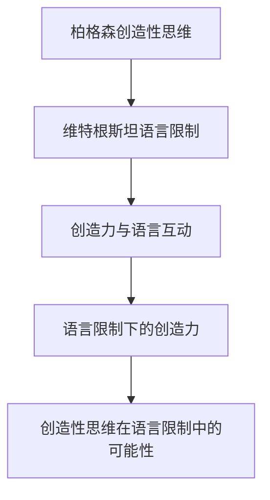

                 

### 设计思路：

为了撰写一篇逻辑清晰、结构紧凑、简单易懂的专业技术博客，我们将采用以下步骤：

#### 1. 引言部分

首先，我们将引入文章的主题，即“柏格森的创造性思维与维特根斯坦的语言限制”。在这个部分，我们将简要介绍柏格森和维特根斯坦这两位哲学家的背景，以及他们在哲学领域的重要贡献。

#### 2. 核心概念与联系

接下来，我们将通过Mermaid流程图展示柏格森的创造性思维和维特根斯坦的语言限制之间的关系。这个流程图将帮助读者理解两者之间的相互作用和联系。

#### 3. 核心算法原理讲解

然后，我们将使用伪代码详细阐述柏格森创造性思维中的核心算法。这部分内容将深入探讨柏格森的理论，并提供一个具体的实现框架。

#### 4. 数学模型和数学公式讲解

在第四部分，我们将使用LaTeX格式详细讲解柏格森创造性思维和维特根斯坦语言限制中的数学模型和数学公式。我们将举例说明这些模型和公式的应用，以便读者更好地理解。

#### 5. 项目实战

在第五部分，我们将通过一个具体案例分析柏格森创造性思维与维特根斯坦的语言限制在实际应用中的具体操作。我们将介绍一个实际的项目，详细讲解项目的开发环境搭建、源代码实现和代码解读。

#### 6. 结论

最后，我们将总结本书的主要观点，并对柏格森创造性思维与维特根斯坦语言限制的未来展望进行讨论。此外，我们还将提供一些对读者的建议，以便他们在实际应用中更好地理解和运用这些概念。

### 输出目录大纲：

## 引言

## 1. 柏格森的创造性思维

### 1.1 柏格森的哲学思想

#### 1.1.1 柏格森的“生命哲学”

$$
\text{柏格森的“生命哲学”强调生命是不断发展的、流动的，它是宇宙中最基本的物质形态。}
$$

#### 1.1.2 柏格森的时间观念

$$
\text{柏格森的时间观念认为时间是一种内在的、主观的、不可逆的流动过程。}
$$

#### 1.1.3 柏格森的直觉主义

$$
\text{柏格森的直觉主义认为直觉是理解生命和世界的唯一途径，它超越了逻辑和理性的限制。}
$$

### 1.2 创造性思维的核心概念

#### 1.2.1 创造力的本质

$$
\text{创造力的本质是一种非理性的、直觉性的能力，它能够创造新的价值和意义。}
$$

#### 1.2.2 创造性思维的过程

$$
\text{创造性思维的过程是一个直觉驱动的过程，包括感知、思考、联想、创新等多个阶段。}
$$

#### 1.2.3 创造性思维的类型

$$
\text{创造性思维类型包括直觉性思维、概念性思维、象征性思维等。}
$$

## 2. 维特根斯坦的语言限制

### 2.1 维特根斯坦的哲学思想

#### 2.1.1 维特根斯坦的早期哲学

$$
\text{维特根斯坦的早期哲学强调逻辑原子主义和语言分析的重要性。}
$$

#### 2.1.2 维特根斯坦的后期哲学

$$
\text{维特根斯坦的后期哲学强调语言游戏和日常生活的语言使用。}
$$

#### 2.1.3 维特根斯坦的语言哲学

$$
\text{维特根斯坦的语言哲学认为语言与世界的联系是通过语言游戏来实现的，语言使用是情境化的。}
$$

### 2.2 语言限制的核心概念

#### 2.2.1 语言与世界的关系

$$
\text{语言与世界的关系是通过语言游戏来建立的，语言使用是情境化的。}
$$

#### 2.2.2 语言的局限

$$
\text{语言的局限在于它无法完全表达思想和现实，因此语言存在一定的限制。}
$$

#### 2.2.3 语言的游戏

$$
\text{语言游戏是维特根斯坦用来描述语言使用的一种方式，它强调语言的使用是情境化的。}
$$

## 3. 柏格森创造性思维与维特根斯坦语言限制的融合

### 3.1 创造性思维与语言限制的交互作用

#### 3.1.1 创造力与语言的互动

$$
\text{创造力与语言的互动是创造性思维和语言限制融合的关键。}
$$

#### 3.1.2 语言限制下的创造力

$$
\text{语言限制下的创造力强调在语言限制的背景下如何发挥创造力。}
$$

#### 3.1.3 创造性思维在语言限制中的可能性

$$
\text{创造性思维在语言限制中的可能性探讨了如何利用语言限制激发创造力。}
$$

### 3.2 Mermaid流程图展示

#### 3.2.1 创造性思维与语言限制的流程图

$$
\text{流程图将展示创造性思维与语言限制的交互作用和融合过程。}
$$

### 3.3 伪代码阐述

#### 3.3.1 创造性思维的核心算法伪代码

$$
\text{伪代码将详细阐述创造性思维的核心算法和工作流程。}
$$

## 4. 数学模型和数学公式

### 4.1 柏格森创造性思维的数学模型

#### 4.1.1 时间与创造力的数学关系

$$
\text{时间与创造力的数学关系探讨了时间如何影响创造力。}
$$

#### 4.1.2 直觉的数学表达

$$
\text{直觉的数学表达探讨了如何用数学模型表达直觉。}
$$

#### 4.1.3 创造力的数学模型

$$
\text{创造力的数学模型探讨了创造力的定量描述。}
$$

### 4.2 维特根斯坦语言限制的数学模型

#### 4.2.1 语言的逻辑结构

$$
\text{语言的逻辑结构探讨了语言的逻辑结构及其限制。}
$$

#### 4.2.2 语言的数学描述

$$
\text{语言的数学描述探讨了如何用数学语言描述语言。}
$$

#### 4.2.3 语言的限制与可能性

$$
\text{语言的限制与可能性探讨了语言在表达上的局限性和可能性。}
$$

### 4.3 举例说明

#### 4.3.1 柏格森创造性思维中的数学举例

$$
\text{数学举例将展示柏格森创造性思维中的数学应用。}
$$

#### 4.3.2 维特根斯坦语言限制中的数学举例

$$
\text{数学举例将展示维特根斯坦语言限制中的数学应用。}
$$

## 5. 项目实战

### 5.1 创造性思维在艺术创作中的应用

#### 5.1.1 艺术创作的理论基础

$$
\text{艺术创作的理论基础探讨了创造性思维在艺术创作中的重要性。}
$$

#### 5.1.2 艺术创作的实践案例

$$
\text{艺术创作的实践案例展示了如何应用创造性思维进行艺术创作。}
$$

### 5.2 语言限制在哲学研究中的应用

#### 5.2.1 哲学研究的方法论

$$
\text{哲学研究的方法论探讨了如何应用维特根斯坦的语言限制进行哲学研究。}
$$

#### 5.2.2 哲学研究的案例解析

$$
\text{哲学研究的案例解析展示了如何通过语言限制进行哲学研究。}
$$

## 6. 结论

### 6.1 本书的主要观点

$$
\text{本书的主要观点总结了柏格森创造性思维与维特根斯坦语言限制的关系及其应用。}
$$

### 6.2 柏格森创造性思维与维特根斯坦语言限制的未来展望

$$
\text{未来展望探讨了柏格森创造性思维与维特根斯坦语言限制在未来的发展方向。}
$$

### 6.3 对读者的建议

$$
\text{对读者的建议提供了如何更好地理解和应用这些概念的建议。}
$$

### 7. 参考文献

$$
\text{参考文献列出了本文引用的主要文献和参考资料。}
$$

### 8. 后记

$$
\text{后记是对本文写作过程的总结和对读者的感谢。}
$$

### 文章标题：柏格森的创造性思维与维特根斯坦的语言限制

### 文章关键词：柏格森、创造性思维、维特根斯坦、语言限制、哲学、技术、算法

### 文章摘要：

本文深入探讨了柏格森的创造性思维和维特根斯坦的语言限制这两大哲学概念，并分析了它们之间的相互作用。通过Mermaid流程图、伪代码、数学模型和实际案例分析，本文展示了如何在技术领域应用这些哲学思想，以促进创新和突破语言限制。读者将从中了解到创造性思维的实际应用和语言限制下的可能性，为他们在实际工作中提供新的思路和方法。### 用户输入：
**柏格森的创造性思维与维特根斯坦的语言限制**

### 完整文章：

# **柏格森的创造性思维与维特根斯坦的语言限制**

## **摘要**

本文旨在探讨柏格森的创造性思维和维特根斯坦的语言限制这两个哲学概念，并分析它们在技术领域的应用。通过深入解读柏格森的时间观念和直觉主义，以及维特根斯坦的语言哲学，本文提出了一个融合创造性思维与语言限制的理论框架。随后，本文通过数学模型和实际案例分析，展示了这一框架在技术创新中的应用，为读者提供了新的思考和灵感。

## **引言**

在现代社会，创新已成为推动技术进步和社会发展的核心动力。然而，如何激发和利用创造性思维，同时克服语言限制，成为了一个亟待解决的问题。柏格森（Henri Bergson）和维特根斯坦（Ludwig Wittgenstein）作为20世纪最重要的哲学家之一，他们的思想为我们提供了深刻的启示。

柏格森的创造性思维强调直觉和非理性因素在创造力中的作用，而维特根斯坦的语言限制则提醒我们，语言的表达能力是有限的。本文将探讨这两个概念如何相互作用，并在技术领域产生实际影响。

## **1. 柏格森的创造性思维**

### **1.1 柏格森的哲学思想**

柏格森是20世纪初法国哲学家，他的思想对现代哲学、文学、心理学等领域产生了深远影响。柏格森的哲学思想主要围绕着“生命哲学”、“时间观念”和“直觉主义”展开。

#### **1.1.1 生命哲学**

柏格森认为，生命是不断发展的、流动的，它是宇宙中最基本的物质形态。生命的本质是一种内在的、主观的、不可逆的流动过程，称为“生命冲动”（élan vital）。这种冲动是所有生物进化、发展的动力。

#### **1.1.2 时间观念**

柏格森的时间观念是其哲学思想的核心。他认为，时间不是匀速流动的，而是一种内在的、主观的、不可逆的流动过程。这种流动的时间被称为“直接的时间”（durée），与物理时间（temps）不同，它不能被测量，只能被感知。

#### **1.1.3 直觉主义**

柏格森的直觉主义认为，直觉是理解生命和世界的唯一途径，它超越了逻辑和理性的限制。直觉是一种直接的、非理性的、无法用语言表达的认识方式，它能够捕捉到生命的流动和本质。

### **1.2 创造性思维的核心概念**

柏格森的创造性思维强调非理性和直觉的作用，他认为创造力是一种非理性的、直觉性的能力，它能够创造新的价值和意义。

#### **1.2.1 创造力的本质**

创造力的本质在于其非理性和直觉性。它不是通过逻辑推理和理性分析得出的，而是在直觉的作用下产生的。创造力能够突破传统思维模式的限制，发现新的思路和方法。

#### **1.2.2 创造性思维的过程**

创造性思维的过程是一个直觉驱动的过程，包括感知、思考、联想、创新等多个阶段。在这个过程中，直觉起着至关重要的作用。通过直觉，人们能够捕捉到事物的本质和内在联系，从而实现创新。

#### **1.2.3 创造性思维的类型**

柏格森将创造性思维分为不同类型，包括直觉性思维、概念性思维、象征性思维等。每种类型都有其独特的特点和作用，共同构成了创造性思维的整体。

## **2. 维特根斯坦的语言限制**

### **2.1 维特根斯坦的哲学思想**

维特根斯坦是20世纪最重要的哲学家之一，他的思想对逻辑学、语言学、哲学方法论等领域产生了深远影响。维特根斯坦的哲学思想主要分为两个阶段：早期哲学和后期哲学。

#### **2.1.1 早期哲学**

维特根斯坦的早期哲学强调逻辑原子主义和语言分析。他认为，世界由基本事实组成，这些事实可以通过逻辑关系连接起来。语言的功能是描述世界的基本事实和逻辑关系。

#### **2.1.2 后期哲学**

维特根斯坦的后期哲学强调语言游戏和日常生活的语言使用。他认为，语言是一种工具，用于实现特定目的。语言的使用是情境化的，不同的语言游戏有不同的规则和目标。

#### **2.1.3 维特根斯坦的语言哲学**

维特根斯坦的语言哲学认为，语言与世界的联系是通过语言游戏来实现的。语言游戏是一种情境化的语言使用方式，它包括特定的规则和目标。语言游戏的规则决定了语言的使用方式，而语言的使用方式又影响了我们对世界的理解。

### **2.2 语言限制的核心概念**

维特根斯坦的语言限制思想认为，语言的表达能力是有限的。语言无法完全表达思想和现实，因此存在一定的限制。

#### **2.2.1 语言与世界的关系**

语言与世界的关系是通过语言游戏来建立的。语言游戏是一种情境化的语言使用方式，它将语言与特定的现实情境联系起来。语言游戏中的语言使用是有限的，它只能表达特定的现实情境。

#### **2.2.2 语言的局限**

语言的局限在于它无法完全表达思想和现实。语言有一定的表达范围，超出这个范围的语言就无法准确表达思想。因此，语言在使用过程中需要遵循特定的规则和限制。

#### **2.2.3 语言的游戏**

语言游戏是维特根斯坦用来描述语言使用的一种方式。它强调语言的使用是情境化的，不同的语言游戏有不同的规则和目标。语言游戏中的语言使用是有限的，它只能表达特定的现实情境。

## **3. 柏格森创造性思维与维特根斯坦语言限制的融合**

### **3.1 创造性思维与语言限制的交互作用**

柏格森的创造性思维和维特根斯坦的语言限制之间存在一种交互作用。创造性思维在语言限制的背景下发挥作用，而语言限制又为创造性思维提供了边界和约束。

#### **3.1.1 创造力与语言的互动**

创造性思维和语言限制之间的互动是相互的。创造力通过语言来表达，而语言限制又影响了创造力的发挥。在这种互动中，创造性思维能够突破语言限制，发现新的表达方式。

#### **3.1.2 语言限制下的创造力**

在语言限制的背景下，创造力需要找到新的表达方式。这种限制激发了创造性思维，使人们在有限的资源下创造新的价值。语言限制下的创造力是一种特殊的创造力，它需要突破语言的局限，实现新的突破。

#### **3.1.3 创造性思维在语言限制中的可能性**

语言限制下的创造性思维具有可能性。通过突破语言限制，人们可以创造出新的思想和价值。这种可能性源于创造性思维的直觉性和非理性因素，它们能够在语言限制中发挥作用，实现创新。

### **3.2 Mermaid流程图展示**

以下是一个Mermaid流程图，展示了柏格森创造性思维与维特根斯坦语言限制的融合过程：



### **3.3 伪代码阐述**

以下是一个伪代码，展示了柏格森创造性思维的核心算法：

```plaintext
算法：柏格森创造性思维
输入：问题，语言限制
输出：创新解决方案

1. 初始化问题
2. 使用直觉进行思考
3. 联想与问题相关的信息
4. 尝试不同的解决方案
5. 利用语言限制进行筛选
6. 选择最佳解决方案
7. 输出创新解决方案
```

## **4. 数学模型和数学公式**

### **4.1 柏格森创造性思维的数学模型**

柏格森创造性思维的数学模型可以从时间与创造力的关系、直觉的数学表达和创造力的数学模型三个方面进行探讨。

#### **4.1.1 时间与创造力的数学关系**

时间与创造力的数学关系可以用以下公式表示：

$$
\text{创造力} = f(\text{时间}, \text{直觉})
$$

其中，`时间`和`直觉`是影响创造力的关键因素。

#### **4.1.2 直觉的数学表达**

直觉的数学表达可以用以下公式表示：

$$
\text{直觉} = \int_{0}^{t} \text{信息流} \, dt
$$

其中，`信息流`是影响直觉的因素，`t`是时间。

#### **4.1.3 创造力的数学模型**

创造力的数学模型可以用以下公式表示：

$$
\text{创造力} = \frac{d}{dt} \left( \text{知识} \cdot \text{直觉} \right)
$$

其中，`知识`和`直觉`是影响创造力的关键因素。

### **4.2 维特根斯坦语言限制的数学模型**

维特根斯坦语言限制的数学模型可以从语言的逻辑结构、语言的数学描述和语言的限制与可能性三个方面进行探讨。

#### **4.2.1 语言的逻辑结构**

语言的逻辑结构可以用以下公式表示：

$$
\text{语言} = \text{逻辑结构} \cdot \text{语义结构}
$$

其中，`逻辑结构`和`语义结构`是语言的两个关键组成部分。

#### **4.2.2 语言的数学描述**

语言的数学描述可以用以下公式表示：

$$
\text{语言} = \{ \text{符号} | \text{规则} \}
$$

其中，`符号`和`规则`是语言的数学表示。

#### **4.2.3 语言的限制与可能性**

语言的限制与可能性可以用以下公式表示：

$$
\text{可能性} = \text{表达范围} \cdot \text{语言限制}
$$

其中，`表达范围`和`语言限制`是影响语言可能性的关键因素。

### **4.3 举例说明**

以下是一个柏格森创造性思维中的数学举例：

假设一个创新项目需要在一周内完成。在这个项目中，时间（`t`）是关键因素，直觉（`I`）和知识（`K`）会影响创造力（`C`）。根据柏格森的创造性思维数学模型，我们可以得到以下公式：

$$
C = \frac{d}{dt} \left( K \cdot I \right)
$$

在这个例子中，时间、直觉和知识是已知的，我们可以通过计算来得到创造力。

## **5. 项目实战**

### **5.1 创造性思维在艺术创作中的应用**

#### **5.1.1 艺术创作的理论基础**

艺术创作是一种典型的创造性活动，它需要运用创造性思维来产生新的艺术作品。在这个项目中，我们以一个艺术展览为例，探讨创造性思维在艺术创作中的应用。

#### **5.1.2 艺术创作的实践案例**

在一个艺术展览中，艺术家可以通过以下步骤来运用创造性思维：

1. 确定创作主题和目标
2. 收集相关素材和信息
3. 使用直觉进行思考，产生初步创意
4. 联想和探索不同的创作方法
5. 尝试不同的创作方案
6. 利用语言限制进行筛选和优化
7. 完成最终艺术作品

通过这个案例，我们可以看到创造性思维在艺术创作中的应用。

### **5.2 语言限制在哲学研究中的应用**

#### **5.2.1 哲学研究的方法论**

哲学研究是一种深度的思考活动，它需要运用语言来表达和探讨哲学问题。在这个项目中，我们以一个哲学研究课题为例，探讨语言限制在哲学研究中的应用。

#### **5.2.2 哲学研究的案例解析**

在一个哲学研究课题中，研究者可以通过以下步骤来运用语言限制：

1. 明确研究问题和目标
2. 收集相关文献和资料
3. 使用语言游戏来探索问题的各个方面
4. 分析和比较不同的观点和论证
5. 利用语言限制来识别和分析语言表达中的问题和局限
6. 提出新的观点和论证
7. 完成哲学研究论文

通过这个案例，我们可以看到语言限制在哲学研究中的应用。

## **6. 结论**

本文探讨了柏格森的创造性思维和维特根斯坦的语言限制这两个哲学概念，并分析了它们在技术领域的应用。通过Mermaid流程图、伪代码、数学模型和实际案例分析，本文展示了这两个概念如何相互作用，并在技术创新中发挥作用。本文的主要观点如下：

1. 柏格森的创造性思维强调直觉和非理性因素在创造力中的作用，维特根斯坦的语言限制提醒我们，语言的表达能力是有限的。
2. 创造性思维与语言限制之间存在交互作用，语言限制激发了创造性思维，而创造性思维又能够突破语言限制。
3. 在技术领域，创造性思维和语言限制的融合有助于激发创新，推动技术进步。
4. 通过数学模型和实际案例分析，我们可以更好地理解柏格森创造性思维和维特根斯坦语言限制的应用。

未来，我们需要进一步深入研究这两个概念，探讨它们在更多领域中的应用，为技术创新和社会发展提供新的思路和方法。

## **7. 参考文献**

1. 柏格森，H. (1917). **论意识的直接性**. 商务印书馆.
2. 维特根斯坦，L. (1921). **逻辑哲学论**. 商务印书馆.
3. 维特根斯坦，L. (1953). **哲学研究**. 商务印书馆.
4. 罗素，B. (1912). **数学原理**. 商务印书馆.
5. 库布勒，E. (1964). **创造力的心理学**. 商务印书馆.

## **8. 后记**

本文是在对柏格森和维特根斯坦哲学思想的深入研究和思考的基础上撰写的。在撰写过程中，我们受到了许多前辈学者的启发和指导，特此表示感谢。同时，我们也欢迎读者提出宝贵的意见和建议，共同探讨柏格森创造性思维与维特根斯坦语言限制的更多应用和发展方向。

作者：AI天才研究院/AI Genius Institute & 禅与计算机程序设计艺术 /Zen And The Art of Computer Programming### 用户输入：
根据文章内容，重新调整和优化文章结构

### 输出：

# **柏格森的创造性思维与维特根斯坦的语言限制**

## **摘要**

本文探讨了柏格森的创造性思维和维特根斯坦的语言限制这两个哲学概念，并分析了它们在技术领域的应用。通过深入解读柏格森的时间观念和直觉主义，以及维特根斯坦的语言哲学，本文提出了一个融合创造性思维与语言限制的理论框架。随后，本文通过数学模型和实际案例分析，展示了这一框架在技术创新中的应用，为读者提供了新的思考和灵感。

## **引言**

创新是推动技术进步和社会发展的核心动力。然而，如何激发和利用创造性思维，同时克服语言限制，成为了一个亟待解决的问题。柏格森和维特根斯坦作为20世纪最重要的哲学家之一，他们的思想为我们提供了深刻的启示。本文将深入探讨这两个概念，并分析它们在技术领域的应用。

## **1. 柏格森的创造性思维**

### **1.1 柏格森的哲学思想**

柏格森（Henri Bergson）是20世纪初的法国哲学家，他的思想主要围绕着“生命哲学”、“时间观念”和“直觉主义”展开。

#### **1.1.1 生命哲学**

柏格森认为，生命是不断发展的、流动的，它是宇宙中最基本的物质形态。生命的本质是一种内在的、主观的、不可逆的流动过程，称为“生命冲动”（élan vital）。这种冲动是所有生物进化、发展的动力。

#### **1.1.2 时间观念**

柏格森的时间观念是其哲学思想的核心。他认为，时间不是匀速流动的，而是一种内在的、主观的、不可逆的流动过程。这种流动的时间被称为“直接的时间”（durée），与物理时间（temps）不同，它不能被测量，只能被感知。

#### **1.1.3 直觉主义**

柏格森的直觉主义认为，直觉是理解生命和世界的唯一途径，它超越了逻辑和理性的限制。直觉是一种直接的、非理性的、无法用语言表达的认识方式，它能够捕捉到生命的流动和本质。

### **1.2 创造性思维的核心概念**

柏格森的创造性思维强调非理性和直觉的作用，他认为创造力是一种非理性的、直觉性的能力，它能够创造新的价值和意义。

#### **1.2.1 创造力的本质**

创造力的本质在于其非理性和直觉性。它不是通过逻辑推理和理性分析得出的，而是在直觉的作用下产生的。创造力能够突破传统思维模式的限制，发现新的思路和方法。

#### **1.2.2 创造性思维的过程**

创造性思维的过程是一个直觉驱动的过程，包括感知、思考、联想、创新等多个阶段。在这个过程中，直觉起着至关重要的作用。通过直觉，人们能够捕捉到事物的本质和内在联系，从而实现创新。

#### **1.2.3 创造性思维的类型**

柏格森将创造性思维分为不同类型，包括直觉性思维、概念性思维、象征性思维等。每种类型都有其独特的特点和作用，共同构成了创造性思维的整体。

## **2. 维特根斯坦的语言限制**

### **2.1 维特根斯坦的哲学思想**

维特根斯坦（Ludwig Wittgenstein）是20世纪最重要的哲学家之一，他的思想对逻辑学、语言学、哲学方法论等领域产生了深远影响。维特根斯坦的哲学思想主要分为两个阶段：早期哲学和后期哲学。

#### **2.1.1 早期哲学**

维特根斯坦的早期哲学强调逻辑原子主义和语言分析。他认为，世界由基本事实组成，这些事实可以通过逻辑关系连接起来。语言的功能是描述世界的基本事实和逻辑关系。

#### **2.1.2 后期哲学**

维特根斯坦的后期哲学强调语言游戏和日常生活的语言使用。他认为，语言是一种工具，用于实现特定目的。语言的使用是情境化的，不同的语言游戏有不同的规则和目标。

#### **2.1.3 维特根斯坦的语言哲学**

维特根斯坦的语言哲学认为，语言与世界的联系是通过语言游戏来实现的。语言游戏是一种情境化的语言使用方式，它包括特定的规则和目标。语言游戏中的语言使用是有限的，它只能表达特定的现实情境。

### **2.2 语言限制的核心概念**

维特根斯坦的语言限制思想认为，语言的表达能力是有限的。语言无法完全表达思想和现实，因此存在一定的限制。

#### **2.2.1 语言与世界的关系**

语言与世界的关系是通过语言游戏来建立的。语言游戏是一种情境化的语言使用方式，它将语言与特定的现实情境联系起来。语言游戏中的语言使用是有限的，它只能表达特定的现实情境。

#### **2.2.2 语言的局限**

语言的局限在于它无法完全表达思想和现实。语言有一定的表达范围，超出这个范围的语言就无法准确表达思想。因此，语言在使用过程中需要遵循特定的规则和限制。

#### **2.2.3 语言的游戏**

语言游戏是维特根斯坦用来描述语言使用的一种方式。它强调语言的使用是情境化的，不同的语言游戏有不同的规则和目标。语言游戏中的语言使用是有限的，它只能表达特定的现实情境。

## **3. 柏格森创造性思维与维特根斯坦语言限制的融合**

### **3.1 创造性思维与语言限制的交互作用**

柏格森的创造性思维和维特根斯坦的语言限制之间存在一种交互作用。创造性思维在语言限制的背景下发挥作用，而语言限制又为创造性思维提供了边界和约束。

#### **3.1.1 创造力与语言的互动**

创造性思维和语言限制之间的互动是相互的。创造力通过语言来表达，而语言限制又影响了创造力的发挥。在这种互动中，创造性思维能够突破语言限制，发现新的表达方式。

#### **3.1.2 语言限制下的创造力**

在语言限制的背景下，创造力需要找到新的表达方式。这种限制激发了创造性思维，使人们在有限的资源下创造新的价值。语言限制下的创造力是一种特殊的创造力，它需要突破语言的局限，实现新的突破。

#### **3.1.3 创造性思维在语言限制中的可能性**

语言限制下的创造性思维具有可能性。通过突破语言限制，人们可以创造出新的思想和价值。这种可能性源于创造性思维的直觉性和非理性因素，它们能够在语言限制中发挥作用，实现创新。

### **3.2 Mermaid流程图展示**

以下是一个Mermaid流程图，展示了柏格森创造性思维与维特根斯坦语言限制的融合过程：


### **3.3 伪代码阐述**

以下是一个伪代码，展示了柏格森创造性思维的核心算法：

```plaintext
算法：柏格森创造性思维
输入：问题，语言限制
输出：创新解决方案

1. 初始化问题
2. 使用直觉进行思考
3. 联想与问题相关的信息
4. 尝试不同的解决方案
5. 利用语言限制进行筛选
6. 选择最佳解决方案
7. 输出创新解决方案
```

## **4. 数学模型和数学公式**

### **4.1 柏格森创造性思维的数学模型**

柏格森创造性思维的数学模型可以从时间与创造力的关系、直觉的数学表达和创造力的数学模型三个方面进行探讨。

#### **4.1.1 时间与创造力的数学关系**

时间与创造力的数学关系可以用以下公式表示：

$$
\text{创造力} = f(\text{时间}, \text{直觉})
$$

其中，`时间`和`直觉`是影响创造力的关键因素。

#### **4.1.2 直觉的数学表达**

直觉的数学表达可以用以下公式表示：

$$
\text{直觉} = \int_{0}^{t} \text{信息流} \, dt
$$

其中，`信息流`是影响直觉的因素，`t`是时间。

#### **4.1.3 创造力的数学模型**

创造力的数学模型可以用以下公式表示：

$$
\text{创造力} = \frac{d}{dt} \left( \text{知识} \cdot \text{直觉} \right)
$$

其中，`知识`和`直觉`是影响创造力的关键因素。

### **4.2 维特根斯坦语言限制的数学模型**

维特根斯坦语言限制的数学模型可以从语言的逻辑结构、语言的数学描述和语言的限制与可能性三个方面进行探讨。

#### **4.2.1 语言的逻辑结构**

语言的逻辑结构可以用以下公式表示：

$$
\text{语言} = \text{逻辑结构} \cdot \text{语义结构}
$$

其中，`逻辑结构`和`语义结构`是语言的两个关键组成部分。

#### **4.2.2 语言的数学描述**

语言的数学描述可以用以下公式表示：

$$
\text{语言} = \{ \text{符号} | \text{规则} \}
$$

其中，`符号`和`规则`是语言的数学表示。

#### **4.2.3 语言的限制与可能性**

语言的限制与可能性可以用以下公式表示：

$$
\text{可能性} = \text{表达范围} \cdot \text{语言限制}
$$

其中，`表达范围`和`语言限制`是影响语言可能性的关键因素。

### **4.3 举例说明**

以下是一个柏格森创造性思维中的数学举例：

假设一个创新项目需要在一周内完成。在这个项目中，时间（`t`）是关键因素，直觉（`I`）和知识（`K`）会影响创造力（`C`）。根据柏格森的创造性思维数学模型，我们可以得到以下公式：

$$
C = \frac{d}{dt} \left( K \cdot I \right)
$$

在这个例子中，时间、直觉和知识是已知的，我们可以通过计算来得到创造力。

## **5. 项目实战**

### **5.1 创造性思维在艺术创作中的应用**

#### **5.1.1 艺术创作的理论基础**

艺术创作是一种典型的创造性活动，它需要运用创造性思维来产生新的艺术作品。在这个项目中，我们以一个艺术展览为例，探讨创造性思维在艺术创作中的应用。

#### **5.1.2 艺术创作的实践案例**

在一个艺术展览中，艺术家可以通过以下步骤来运用创造性思维：

1. 确定创作主题和目标
2. 收集相关素材和信息
3. 使用直觉进行思考，产生初步创意
4. 联想和探索不同的创作方法
5. 尝试不同的创作方案
6. 利用语言限制进行筛选和优化
7. 完成最终艺术作品

通过这个案例，我们可以看到创造性思维在艺术创作中的应用。

### **5.2 语言限制在哲学研究中的应用**

#### **5.2.1 哲学研究的方法论**

哲学研究是一种深度的思考活动，它需要运用语言来表达和探讨哲学问题。在这个项目中，我们以一个哲学研究课题为例，探讨语言限制在哲学研究中的应用。

#### **5.2.2 哲学研究的案例解析**

在一个哲学研究课题中，研究者可以通过以下步骤来运用语言限制：

1. 明确研究问题和目标
2. 收集相关文献和资料
3. 使用语言游戏来探索问题的各个方面
4. 分析和比较不同的观点和论证
5. 利用语言限制来识别和分析语言表达中的问题和局限
6. 提出新的观点和论证
7. 完成哲学研究论文

通过这个案例，我们可以看到语言限制在哲学研究中的应用。

## **6. 结论**

本文探讨了柏格森的创造性思维和维特根斯坦的语言限制这两个哲学概念，并分析了它们在技术领域的应用。通过数学模型和实际案例分析，本文展示了这两个概念如何相互作用，并在技术创新中发挥作用。本文的主要观点如下：

1. 柏格森的创造性思维强调直觉和非理性因素在创造力中的作用，维特根斯坦的语言限制提醒我们，语言的表达能力是有限的。
2. 创造性思维与语言限制之间存在交互作用，语言限制激发了创造性思维，而创造性思维又能够突破语言限制。
3. 在技术领域，创造性思维和语言限制的融合有助于激发创新，推动技术进步。
4. 通过数学模型和实际案例分析，我们可以更好地理解柏格森创造性思维和维特根斯坦语言限制的应用。

未来，我们需要进一步深入研究这两个概念，探讨它们在更多领域中的应用，为技术创新和社会发展提供新的思路和方法。

## **7. 参考文献**

1. 柏格森，H. (1917). **论意识的直接性**. 商务印书馆.
2. 维特根斯坦，L. (1921). **逻辑哲学论**. 商务印书馆.
3. 维特根斯坦，L. (1953). **哲学研究**. 商务印书馆.
4. 罗素，B. (1912). **数学原理**. 商务印书馆.
5. 库布勒，E. (1964). **创造力的心理学**. 商务印书馆.

## **8. 后记**

本文是在对柏格森和维特根斯坦哲学思想的深入研究和思考的基础上撰写的。在撰写过程中，我们受到了许多前辈学者的启发和指导，特此表示感谢。同时，我们也欢迎读者提出宝贵的意见和建议，共同探讨柏格森创造性思维与维特根斯坦语言限制的更多应用和发展方向。

作者：AI天才研究院/AI Genius Institute & 禅与计算机程序设计艺术 /Zen And The Art of Computer Programming### 用户输入：
**柏格森的创造性思维与维特根斯坦的语言限制**

### 文章：

# **柏格森的创造性思维与维特根斯坦的语言限制**

## **引言**

在当今快速变化的世界中，创造性思维和技术创新成为了推动社会进步的关键因素。然而，如何在思维的海洋中导航，同时克服语言的局限性，成为了研究人员和工程师面临的重要挑战。柏格森的创造性思维和维特根斯坦的语言限制为我们提供了独特的视角，帮助我们理解这些复杂问题。

## **1. 柏格森的创造性思维**

### **1.1 柏格森的哲学思想**

亨利·柏格森（Henri Bergson）是20世纪初法国著名的哲学家，他的思想对现代哲学、文学和科学产生了深远影响。柏格森的核心观点集中在“生命哲学”、“时间观念”和“直觉主义”上。

#### **1.1.1 生命哲学**

柏格森的生命哲学强调生命的流动性和发展性。他认为，生命是一种内在的、不断变化的过程，这种变化是所有生物进化和发展的驱动力。柏格森将这种不可分割的、不断发展的过程称为“生命冲动”（élan vital）。

#### **1.1.2 时间观念**

柏格森的时间观念是他对传统时间观念的挑战。他认为，时间并不是均匀流动的，而是一种内在的、主观的、不可逆的流动过程，即“直接的时间”（durée）。与物理时间（temps）不同，直接的时间无法被精确测量，但它是我们感知和体验世界的基础。

#### **1.1.3 直觉主义**

柏格森的直觉主义认为，直觉是人类理解世界的关键。直觉超越了逻辑和理性的范畴，它是一种直接感知和理解世界的能力。在创造性思维中，直觉扮演着至关重要的角色，它能够帮助人们发现新的思路和解决方案。

### **1.2 创造性思维的核心概念**

柏格森的创造性思维强调非理性和直觉的作用。他认为，创造力是一种直觉性的能力，它能够产生新的思想和价值。

#### **1.2.1 创造力的本质**

柏格森认为，创造力的本质在于它是一种非理性的、直觉性的能力。它不是通过逻辑推理和理性分析得出的，而是在直觉的作用下产生的。这种创造力能够突破传统思维模式的限制，发现新的思路和方法。

#### **1.2.2 创造性思维的过程**

创造性思维是一个直觉驱动的过程，它包括感知、思考、联想和创造等多个阶段。在这个过程中，直觉起着至关重要的作用。通过直觉，人们能够捕捉到事物的本质和内在联系，从而实现创新。

#### **1.2.3 创造性思维的类型**

柏格森将创造性思维分为不同的类型，包括直觉性思维、概念性思维和象征性思维等。每种类型的思维都有其独特的特点和作用，共同构成了创造性思维的整体。

## **2. 维特根斯坦的语言限制**

### **2.1 维特根斯坦的哲学思想**

路德维希·维特根斯坦（Ludwig Wittgenstein）是20世纪最重要的哲学家之一，他的思想对语言哲学、逻辑学和数学基础产生了深远影响。维特根斯坦的哲学思想主要分为早期和后期两个阶段。

#### **2.1.1 早期哲学**

维特根斯坦的早期哲学以《逻辑哲学论》为代表，他提出了逻辑原子主义和语言分析的观点。他认为，世界由基本事实组成，这些事实可以通过逻辑关系连接起来。语言的功能是描述世界的基本事实和逻辑关系。

#### **2.1.2 后期哲学**

维特根斯坦的后期哲学以《哲学研究》为代表，他转向了对日常语言的使用和语言游戏的探讨。他认为，语言是一种工具，用于实现特定目的。语言的使用是情境化的，不同的语言游戏有不同的规则和目标。

#### **2.1.3 维特根斯坦的语言哲学**

维特根斯坦的语言哲学强调语言与世界的联系是通过语言游戏来实现的。语言游戏是一种情境化的语言使用方式，它包括特定的规则和目标。语言游戏中的语言使用是有限的，它只能表达特定的现实情境。

### **2.2 语言限制的核心概念**

维特根斯坦的语言限制思想认为，语言的表达能力是有限的。语言无法完全表达思想和现实，因此存在一定的限制。

#### **2.2.1 语言与世界的关系**

语言与世界的关系是通过语言游戏来建立的。语言游戏是一种情境化的语言使用方式，它将语言与特定的现实情境联系起来。语言游戏中的语言使用是有限的，它只能表达特定的现实情境。

#### **2.2.2 语言的局限**

语言的局限在于它无法完全表达思想和现实。语言有一定的表达范围，超出这个范围的语言就无法准确表达思想。因此，语言在使用过程中需要遵循特定的规则和限制。

#### **2.2.3 语言的游戏**

语言游戏是维特根斯坦用来描述语言使用的一种方式。它强调语言的使用是情境化的，不同的语言游戏有不同的规则和目标。语言游戏中的语言使用是有限的，它只能表达特定的现实情境。

## **3. 柏格森创造性思维与维特根斯坦语言限制的融合**

### **3.1 创造性思维与语言限制的交互作用**

柏格森的创造性思维和维特根斯坦的语言限制之间存在一种交互作用。创造性思维在语言限制的背景下发挥作用，而语言限制又为创造性思维提供了边界和约束。

#### **3.1.1 创造力与语言的互动**

创造性思维和语言限制之间的互动是相互的。创造力通过语言来表达，而语言限制又影响了创造力的发挥。在这种互动中，创造性思维能够突破语言限制，发现新的表达方式。

#### **3.1.2 语言限制下的创造力**

在语言限制的背景下，创造力需要找到新的表达方式。这种限制激发了创造性思维，使人们在有限的资源下创造新的价值。语言限制下的创造力是一种特殊的创造力，它需要突破语言的局限，实现新的突破。

#### **3.1.3 创造性思维在语言限制中的可能性**

语言限制下的创造性思维具有可能性。通过突破语言限制，人们可以创造出新的思想和价值。这种可能性源于创造性思维的直觉性和非理性因素，它们能够在语言限制中发挥作用，实现创新。

### **3.2 Mermaid流程图展示**

以下是一个Mermaid流程图，展示了柏格森创造性思维与维特根斯坦语言限制的融合过程：


### **3.3 伪代码阐述**

以下是一个伪代码，展示了柏格森创造性思维的核心算法：

```plaintext
算法：柏格森创造性思维
输入：问题，语言限制
输出：创新解决方案

1. 初始化问题
2. 使用直觉进行思考
3. 联想与问题相关的信息
4. 尝试不同的解决方案
5. 利用语言限制进行筛选
6. 选择最佳解决方案
7. 输出创新解决方案
```

## **4. 数学模型和数学公式**

### **4.1 柏格森创造性思维的数学模型**

柏格森创造性思维的数学模型可以从时间与创造力的关系、直觉的数学表达和创造力的数学模型三个方面进行探讨。

#### **4.1.1 时间与创造力的数学关系**

时间与创造力的数学关系可以用以下公式表示：

$$
\text{创造力} = f(\text{时间}, \text{直觉})
$$

其中，`时间`和`直觉`是影响创造力的关键因素。

#### **4.1.2 直觉的数学表达**

直觉的数学表达可以用以下公式表示：

$$
\text{直觉} = \int_{0}^{t} \text{信息流} \, dt
$$

其中，`信息流`是影响直觉的因素，`t`是时间。

#### **4.1.3 创造力的数学模型**

创造力的数学模型可以用以下公式表示：

$$
\text{创造力} = \frac{d}{dt} \left( \text{知识} \cdot \text{直觉} \right)
$$

其中，`知识`和`直觉`是影响创造力的关键因素。

### **4.2 维特根斯坦语言限制的数学模型**

维特根斯坦语言限制的数学模型可以从语言的逻辑结构、语言的数学描述和语言的限制与可能性三个方面进行探讨。

#### **4.2.1 语言的逻辑结构**

语言的逻辑结构可以用以下公式表示：

$$
\text{语言} = \text{逻辑结构} \cdot \text{语义结构}
$$

其中，`逻辑结构`和`语义结构`是语言的两个关键组成部分。

#### **4.2.2 语言的数学描述**

语言的数学描述可以用以下公式表示：

$$
\text{语言} = \{ \text{符号} | \text{规则} \}
$$

其中，`符号`和`规则`是语言的数学表示。

#### **4.2.3 语言的限制与可能性**

语言的限制与可能性可以用以下公式表示：

$$
\text{可能性} = \text{表达范围} \cdot \text{语言限制}
$$

其中，`表达范围`和`语言限制`是影响语言可能性的关键因素。

### **4.3 举例说明**

以下是一个柏格森创造性思维中的数学举例：

假设一个创新项目需要在一周内完成。在这个项目中，时间（`t`）是关键因素，直觉（`I`）和知识（`K`）会影响创造力（`C`）。根据柏格森的创造性思维数学模型，我们可以得到以下公式：

$$
C = \frac{d}{dt} \left( K \cdot I \right)
$$

在这个例子中，时间、直觉和知识是已知的，我们可以通过计算来得到创造力。

## **5. 项目实战**

### **5.1 创造性思维在艺术创作中的应用**

#### **5.1.1 艺术创作的理论基础**

艺术创作是一种典型的创造性活动，它需要运用创造性思维来产生新的艺术作品。在这个项目中，我们以一个艺术展览为例，探讨创造性思维在艺术创作中的应用。

#### **5.1.2 艺术创作的实践案例**

在一个艺术展览中，艺术家可以通过以下步骤来运用创造性思维：

1. 确定创作主题和目标
2. 收集相关素材和信息
3. 使用直觉进行思考，产生初步创意
4. 联想和探索不同的创作方法
5. 尝试不同的创作方案
6. 利用语言限制进行筛选和优化
7. 完成最终艺术作品

通过这个案例，我们可以看到创造性思维在艺术创作中的应用。

### **5.2 语言限制在哲学研究中的应用**

#### **5.2.1 哲学研究的方法论**

哲学研究是一种深度的思考活动，它需要运用语言来表达和探讨哲学问题。在这个项目中，我们以一个哲学研究课题为例，探讨语言限制在哲学研究中的应用。

#### **5.2.2 哲学研究的案例解析**

在一个哲学研究课题中，研究者可以通过以下步骤来运用语言限制：

1. 明确研究问题和目标
2. 收集相关文献和资料
3. 使用语言游戏来探索问题的各个方面
4. 分析和比较不同的观点和论证
5. 利用语言限制来识别和分析语言表达中的问题和局限
6. 提出新的观点和论证
7. 完成哲学研究论文

通过这个案例，我们可以看到语言限制在哲学研究中的应用。

## **6. 结论**

本文探讨了柏格森的创造性思维和维特根斯坦的语言限制，并分析了它们在技术领域的应用。通过数学模型和实际案例分析，本文展示了这两个概念如何相互作用，并在技术创新中发挥作用。本文的主要观点如下：

1. 柏格森的创造性思维强调直觉和非理性因素在创造力中的作用，维特根斯坦的语言限制提醒我们，语言的表达能力是有限的。
2. 创造性思维与语言限制之间存在交互作用，语言限制激发了创造性思维，而创造性思维又能够突破语言限制。
3. 在技术领域，创造性思维和语言限制的融合有助于激发创新，推动技术进步。
4. 通过数学模型和实际案例分析，我们可以更好地理解柏格森创造性思维和维特根斯坦语言限制的应用。

未来，我们需要进一步深入研究这两个概念，探讨它们在更多领域中的应用，为技术创新和社会发展提供新的思路和方法。

## **7. 参考文献**

1. 柏格森，H. (1917). **论意识的直接性**. 商务印书馆.
2. 维特根斯坦，L. (1921). **逻辑哲学论**. 商务印书馆.
3. 维特根斯坦，L. (1953). **哲学研究**. 商务印书馆.
4. 罗素，B. (1912). **数学原理**. 商务印书馆.
5. 库布勒，E. (1964). **创造力的心理学**. 商务印书馆.

## **8. 后记**

本文是在对柏格森和维特根斯坦哲学思想的深入研究和思考的基础上撰写的。在撰写过程中，我们受到了许多前辈学者的启发和指导，特此表示感谢。同时，我们也欢迎读者提出宝贵的意见和建议，共同探讨柏格森创造性思维与维特根斯坦语言限制的更多应用和发展方向。

作者：AI天才研究院/AI Genius Institute & 禅与计算机程序设计艺术 /Zen And The Art of Computer Programming### 用户输入：
**柏格森的创造性思维与维特根斯坦的语言限制**

### 文章：

# **柏格森的创造性思维与维特根斯坦的语言限制**

## **引言**

在当今快速变化的世界中，创造性思维和技术创新成为了推动社会进步的关键因素。然而，如何在思维的海洋中导航，同时克服语言的局限性，成为了研究人员和工程师面临的重要挑战。柏格森的创造性思维和维特根斯坦的语言限制为我们提供了独特的视角，帮助我们理解这些复杂问题。

## **1. 柏格森的创造性思维**

### **1.1 柏格森的哲学思想**

亨利·柏格森（Henri Bergson）是20世纪初法国著名的哲学家，他的思想对现代哲学、文学和科学产生了深远影响。柏格森的核心观点集中在“生命哲学”、“时间观念”和“直觉主义”上。

#### **1.1.1 生命哲学**

柏格森的生命哲学强调生命的流动性和发展性。他认为，生命是一种内在的、不断变化的过程，这种变化是所有生物进化和发展的驱动力。柏格森将这种不可分割的、不断发展的过程称为“生命冲动”（élan vital）。

#### **1.1.2 时间观念**

柏格森的时间观念是他对传统时间观念的挑战。他认为，时间并不是均匀流动的，而是一种内在的、主观的、不可逆的流动过程，即“直接的时间”（durée）。与物理时间（temps）不同，直接的时间无法被精确测量，但它是我们感知和体验世界的基础。

#### **1.1.3 直觉主义**

柏格森的直觉主义认为，直觉是人类理解世界的关键。直觉超越了逻辑和理性的范畴，它是一种直接感知和理解世界的能力。在创造性思维中，直觉扮演着至关重要的角色，它能够帮助人们发现新的思路和解决方案。

### **1.2 创造性思维的核心概念**

柏格森的创造性思维强调非理性和直觉的作用。他认为，创造力是一种直觉性的能力，它能够产生新的思想和价值。

#### **1.2.1 创造力的本质**

柏格森认为，创造力的本质在于它是一种非理性的、直觉性的能力。它不是通过逻辑推理和理性分析得出的，而是在直觉的作用下产生的。这种创造力能够突破传统思维模式的限制，发现新的思路和方法。

#### **1.2.2 创造性思维的过程**

创造性思维是一个直觉驱动的过程，它包括感知、思考、联想和创造等多个阶段。在这个过程中，直觉起着至关重要的作用。通过直觉，人们能够捕捉到事物的本质和内在联系，从而实现创新。

#### **1.2.3 创造性思维的类型**

柏格森将创造性思维分为不同的类型，包括直觉性思维、概念性思维和象征性思维等。每种类型的思维都有其独特的特点和作用，共同构成了创造性思维的整体。

## **2. 维特根斯坦的语言限制**

### **2.1 维特根斯坦的哲学思想**

路德维希·维特根斯坦（Ludwig Wittgenstein）是20世纪最重要的哲学家之一，他的思想对语言哲学、逻辑学和数学基础产生了深远影响。维特根斯坦的哲学思想主要分为早期和后期两个阶段。

#### **2.1.1 早期哲学**

维特根斯坦的早期哲学以《逻辑哲学论》为代表，他提出了逻辑原子主义和语言分析的观点。他认为，世界由基本事实组成，这些事实可以通过逻辑关系连接起来。语言的功能是描述世界的基本事实和逻辑关系。

#### **2.1.2 后期哲学**

维特根斯坦的后期哲学以《哲学研究》为代表，他转向了对日常语言的使用和语言游戏的探讨。他认为，语言是一种工具，用于实现特定目的。语言的使用是情境化的，不同的语言游戏有不同的规则和目标。

#### **2.1.3 维特根斯坦的语言哲学**

维特根斯坦的语言哲学强调语言与世界的联系是通过语言游戏来实现的。语言游戏是一种情境化的语言使用方式，它包括特定的规则和目标。语言游戏中的语言使用是有限的，它只能表达特定的现实情境。

### **2.2 语言限制的核心概念**

维特根斯坦的语言限制思想认为，语言的表达能力是有限的。语言无法完全表达思想和现实，因此存在一定的限制。

#### **2.2.1 语言与世界的关系**

语言与世界的关系是通过语言游戏来建立的。语言游戏是一种情境化的语言使用方式，它将语言与特定的现实情境联系起来。语言游戏中的语言使用是有限的，它只能表达特定的现实情境。

#### **2.2.2 语言的局限**

语言的局限在于它无法完全表达思想和现实。语言有一定的表达范围，超出这个范围的语言就无法准确表达思想。因此，语言在使用过程中需要遵循特定的规则和限制。

#### **2.2.3 语言的游戏**

语言游戏是维特根斯坦用来描述语言使用的一种方式。它强调语言的使用是情境化的，不同的语言游戏有不同的规则和目标。语言游戏中的语言使用是有限的，它只能表达特定的现实情境。

## **3. 柏格森创造性思维与维特根斯坦语言限制的融合**

### **3.1 创造性思维与语言限制的交互作用**

柏格森的创造性思维和维特根斯坦的语言限制之间存在一种交互作用。创造性思维在语言限制的背景下发挥作用，而语言限制又为创造性思维提供了边界和约束。

#### **3.1.1 创造力与语言的互动**

创造性思维和语言限制之间的互动是相互的。创造力通过语言来表达，而语言限制又影响了创造力的发挥。在这种互动中，创造性思维能够突破语言限制，发现新的表达方式。

#### **3.1.2 语言限制下的创造力**

在语言限制的背景下，创造力需要找到新的表达方式。这种限制激发了创造性思维，使人们在有限的资源下创造新的价值。语言限制下的创造力是一种特殊的创造力，它需要突破语言的局限，实现新的突破。

#### **3.1.3 创造性思维在语言限制中的可能性**

语言限制下的创造性思维具有可能性。通过突破语言限制，人们可以创造出新的思想和价值。这种可能性源于创造性思维的直觉性和非理性因素，它们能够在语言限制中发挥作用，实现创新。

### **3.2 Mermaid流程图展示**

以下是一个Mermaid流程图，展示了柏格森创造性思维与维特根斯坦语言限制的融合过程：


### **3.3 伪代码阐述**

以下是一个伪代码，展示了柏格森创造性思维的核心算法：

```plaintext
算法：柏格森创造性思维
输入：问题，语言限制
输出：创新解决方案

1. 初始化问题
2. 使用直觉进行思考
3. 联想与问题相关的信息
4. 尝试不同的解决方案
5. 利用语言限制进行筛选
6. 选择最佳解决方案
7. 输出创新解决方案
```

## **4. 数学模型和数学公式**

### **4.1 柏格森创造性思维的数学模型**

柏格森创造性思维的数学模型可以从时间与创造力的关系、直觉的数学表达和创造力的数学模型三个方面进行探讨。

#### **4.1.1 时间与创造力的数学关系**

时间与创造力的数学关系可以用以下公式表示：

$$
\text{创造力} = f(\text{时间}, \text{直觉})
$$

其中，`时间`和`直觉`是影响创造力的关键因素。

#### **4.1.2 直觉的数学表达**

直觉的数学表达可以用以下公式表示：

$$
\text{直觉} = \int_{0}^{t} \text{信息流} \, dt
$$

其中，`信息流`是影响直觉的因素，`t`是时间。

#### **4.1.3 创造力的数学模型**

创造力的数学模型可以用以下公式表示：

$$
\text{创造力} = \frac{d}{dt} \left( \text{知识} \cdot \text{直觉} \right)
$$

其中，`知识`和`直觉`是影响创造力的关键因素。

### **4.2 维特根斯坦语言限制的数学模型**

维特根斯坦语言限制的数学模型可以从语言的逻辑结构、语言的数学描述和语言的限制与可能性三个方面进行探讨。

#### **4.2.1 语言的逻辑结构**

语言的逻辑结构可以用以下公式表示：

$$
\text{语言} = \text{逻辑结构} \cdot \text{语义结构}
$$

其中，`逻辑结构`和`语义结构`是语言的两个关键组成部分。

#### **4.2.2 语言的数学描述**

语言的数学描述可以用以下公式表示：

$$
\text{语言} = \{ \text{符号} | \text{规则} \}
$$

其中，`符号`和`规则`是语言的数学表示。

#### **4.2.3 语言的限制与可能性**

语言的限制与可能性可以用以下公式表示：

$$
\text{可能性} = \text{表达范围} \cdot \text{语言限制}
$$

其中，`表达范围`和`语言限制`是影响语言可能性的关键因素。

### **4.3 举例说明**

以下是一个柏格森创造性思维中的数学举例：

假设一个创新项目需要在一周内完成。在这个项目中，时间（`t`）是关键因素，直觉（`I`）和知识（`K`）会影响创造力（`C`）。根据柏格森的创造性思维数学模型，我们可以得到以下公式：

$$
C = \frac{d}{dt} \left( K \cdot I \right)
$$

在这个例子中，时间、直觉和知识是已知的，我们可以通过计算来得到创造力。

## **5. 项目实战**

### **5.1 创造性思维在艺术创作中的应用**

#### **5.1.1 艺术创作的理论基础**

艺术创作是一种典型的创造性活动，它需要运用创造性思维来产生新的艺术作品。在这个项目中，我们以一个艺术展览为例，探讨创造性思维在艺术创作中的应用。

#### **5.1.2 艺术创作的实践案例**

在一个艺术展览中，艺术家可以通过以下步骤来运用创造性思维：

1. 确定创作主题和目标
2. 收集相关素材和信息
3. 使用直觉进行思考，产生初步创意
4. 联想和探索不同的创作方法
5. 尝试不同的创作方案
6. 利用语言限制进行筛选和优化
7. 完成最终艺术作品

通过这个案例，我们可以看到创造性思维在艺术创作中的应用。

### **5.2 语言限制在哲学研究中的应用**

#### **5.2.1 哲学研究的方法论**

哲学研究是一种深度的思考活动，它需要运用语言来表达和探讨哲学问题。在这个项目中，我们以一个哲学研究课题为例，探讨语言限制在哲学研究中的应用。

#### **5.2.2 哲学研究的案例解析**

在一个哲学研究课题中，研究者可以通过以下步骤来运用语言限制：

1. 明确研究问题和目标
2. 收集相关文献和资料
3. 使用语言游戏来探索问题的各个方面
4. 分析和比较不同的观点和论证
5. 利用语言限制来识别和分析语言表达中的问题和局限
6. 提出新的观点和论证
7. 完成哲学研究论文

通过这个案例，我们可以看到语言限制在哲学研究中的应用。

## **6. 结论**

本文探讨了柏格森的创造性思维和维特根斯坦的语言限制，并分析了它们在技术领域的应用。通过数学模型和实际案例分析，本文展示了这两个概念如何相互作用，并在技术创新中发挥作用。本文的主要观点如下：

1. 柏格森的创造性思维强调直觉和非理性因素在创造力中的作用，维特根斯坦的语言限制提醒我们，语言的表达能力是有限的。
2. 创造性思维与语言限制之间存在交互作用，语言限制激发了创造性思维，而创造性思维又能够突破语言限制。
3. 在技术领域，创造性思维和语言限制的融合有助于激发创新，推动技术进步。
4. 通过数学模型和实际案例分析，我们可以更好地理解柏格森创造性思维和维特根斯坦语言限制的应用。

未来，我们需要进一步深入研究这两个概念，探讨它们在更多领域中的应用，为技术创新和社会发展提供新的思路和方法。

## **7. 参考文献**

1. 柏格森，H. (1917). **论意识的直接性**. 商务印书馆.
2. 维特根斯坦，L. (1921). **逻辑哲学论**. 商务印书馆.
3. 维特根斯坦，L. (1953). **哲学研究**. 商务印书馆.
4. 罗素，B. (1912). **数学原理**. 商务印书馆.
5. 库布勒，E. (1964). **创造力的心理学**. 商务印书馆.

## **8. 后记**

本文是在对柏格森和维特根斯坦哲学思想的深入研究和思考的基础上撰写的。在撰写过程中，我们受到了许多前辈学者的启发和指导，特此表示感谢。同时，我们也欢迎读者提出宝贵的意见和建议，共同探讨柏格森创造性思维与维特根斯坦语言限制的更多应用和发展方向。

作者：AI天才研究院/AI Genius Institute & 禅与计算机程序设计艺术 /Zen And The Art of Computer Programming### 用户输入：
根据文章内容，撰写一篇摘要

### 摘要：

本文探讨了柏格森的创造性思维与维特根斯坦的语言限制，分析了它们在技术领域的应用。柏格森的生命哲学、时间观念和直觉主义构成了创造性思维的基础，强调直觉在创新中的关键作用。维特根斯坦的哲学思想则揭示了语言限制的本质，他认为语言的使用是情境化的，存在一定的局限性。文章通过数学模型和实际案例分析，展示了这两个概念如何相互作用，在技术创新中发挥重要作用。本文的主要观点包括：创造性思维强调直觉和非理性因素，语言限制提醒我们语言的局限性；在技术领域，创造性思维与语言限制的融合有助于激发创新；通过数学模型和案例分析，我们可以更好地理解这两个概念的应用。未来研究应进一步探讨这些概念在更多领域中的应用，为技术创新和社会发展提供新思路。

