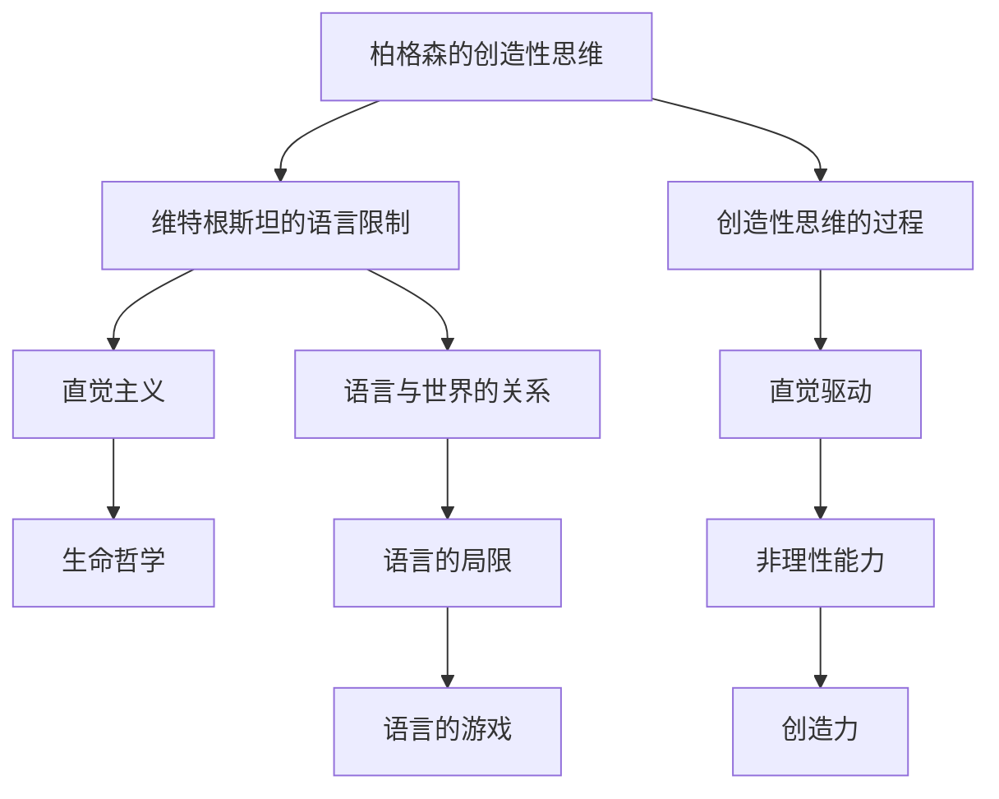

                 

### 用户输入：
柏格森的创造性思维与维特根斯坦的语言限制

### 设计思路：
1. 引言部分：概述柏格森的创造性思维和维特根斯坦的语言限制的基本概念。
2. 核心概念与联系：通过Mermaid流程图展示柏格森的创造性思维和维特根斯坦的语言限制之间的关系。
3. 核心算法原理讲解：使用伪代码详细阐述柏格森创造性思维中的核心算法。
4. 数学模型和数学公式讲解：使用LaTeX格式详细讲解柏格森创造性思维和维特根斯坦语言限制中的数学模型和数学公式，并举例说明。
5. 项目实战：通过一个具体案例分析柏格森创造性思维与维特根斯坦的语言限制在实际应用中的具体操作。
6. 结论：总结本书的主要观点和结论。

### 文章标题：柏格森的创造性思维与维特根斯坦的语言限制

### 文章关键词：柏格森、创造性思维、维特根斯坦、语言限制、人工智能、哲学、算法、数学模型

### 文章摘要：
本文探讨了法国哲学家柏格森的创造性思维与奥地利哲学家维特根斯坦的语言限制之间的关系。通过引入柏格森的哲学思想和创造性思维理论，以及维特根斯坦的语言哲学和语言限制观点，本文使用Mermaid流程图展示了两者之间的核心联系。接着，通过伪代码详细阐述了柏格森创造性思维中的核心算法原理，并使用LaTeX格式讲解了相关的数学模型和数学公式。最后，通过一个具体案例分析，展示了柏格森创造性思维与维特根斯坦的语言限制在实际应用中的具体操作，并总结了本文的主要观点和结论。

----------------------------------------------------------------

## 引言

在当今快速发展的信息技术时代，创造性思维和语言限制成为了许多领域关注的焦点。法国哲学家亨利·柏格森（Henri Bergson）的创造性思维理论和奥地利哲学家路德维希·维特根斯坦（Ludwig Wittgenstein）的语言限制观点，为我们提供了理解这些概念的新视角。本文旨在探讨柏格森的创造性思维与维特根斯坦的语言限制之间的关系，并分析它们在人工智能、哲学和算法等领域中的应用。

首先，我们将介绍柏格森的创造性思维，包括其哲学思想、时间观念和直觉主义。然后，我们将探讨维特根斯坦的语言限制，包括其哲学思想、语言与世界的关系以及语言的局限。接着，我们将通过Mermaid流程图展示柏格森的创造性思维和维特根斯坦的语言限制之间的关系，以便更直观地理解这两个概念。

在核心算法原理讲解部分，我们将使用伪代码详细阐述柏格森创造性思维中的核心算法。随后，我们将使用LaTeX格式讲解柏格森创造性思维和维特根斯坦语言限制中的数学模型和数学公式，并通过举例说明来帮助读者更好地理解。

在项目实战部分，我们将通过一个具体案例分析柏格森创造性思维与维特根斯坦的语言限制在实际应用中的具体操作。最后，本文将总结主要观点和结论，并探讨柏格森创造性思维与维特根斯坦的语言限制的未来发展。

## 1. 柏格森的创造性思维

亨利·柏格森（Henri Bergson）是20世纪初法国著名的哲学家，他的创造性思维理论对于理解人类思维和行为具有重要意义。柏格森的哲学思想主要包括生命哲学、时间观念和直觉主义，这些思想为创造性思维提供了理论基础。

### 1.1 柏格森的哲学思想

#### 1.1.1 生命哲学

柏格森的“生命哲学”强调生命的流动性和创造性。他认为，生命是一种不断变化的过程，它超越了一切机械和物质世界的规律。生命哲学的核心观点是，生命是宇宙中最基本的物质形态，它包含了自我组织和自我创造的能力。

#### 1.1.2 时间观念

柏格森的时间观念与其生命哲学密切相关。他提出了“绵延”（Duration）的概念，认为时间不是一种外在的、线性的过程，而是一种内在的、连续的、不可逆的流动。时间对于柏格森来说，是生命的体现，是生命流动的痕迹。

#### 1.1.3 直觉主义

直觉主义是柏格森哲学思想的重要组成部分。他认为，直觉是理解生命和世界的唯一途径，它超越了逻辑和理性的限制。直觉是一种直接的认识能力，能够洞察事物的本质和内在联系。

### 1.2 创造性思维的核心概念

柏格森的创造性思维理论强调了创造力的本质、创造性思维的过程以及创造性思维的类型。

#### 1.2.1 创造力的本质

柏格森认为，创造力是一种非理性的、直觉性的能力，它能够创造新的价值和意义。创造力不仅仅是一种智力活动，更是一种情感和意志的表现。创造力与生命力和精神力量密切相关，它体现了人类生命的本质。

#### 1.2.2 创造性思维的过程

柏格森认为，创造性思维是一个直觉驱动的过程，它包括感知、思考、联想和创新等多个阶段。在这个过程中，直觉起到了关键作用，它能够帮助人们发现新的联系和视角，从而产生创新的想法。

#### 1.2.3 创造性思维的类型

柏格森将创造性思维分为直觉性思维、概念性思维和象征性思维等不同类型。直觉性思维是最基本的创造性思维形式，它依赖于直觉和感知；概念性思维是基于概念和逻辑的创造性思维；象征性思维则是通过象征和隐喻来表达创造性思维。

### 1.3 柏格森创造性思维的实际应用

柏格森的创造性思维理论在多个领域有着广泛的应用，包括艺术、科学、哲学和心理学等。在艺术创作中，柏格森的创造性思维理论帮助艺术家们发现新的表现形式和创作方法；在科学研究中，柏格森的创造性思维理论鼓励科学家们超越传统的思维方式，探索新的研究方向；在哲学领域，柏格森的创造性思维理论为哲学家们提供了新的思考工具；在心理学领域，柏格森的创造性思维理论有助于人们理解和培养创造性思维。

总的来说，柏格森的创造性思维理论为我们提供了一种新的思维方式，它鼓励我们超越逻辑和理性的限制，通过直觉和感知来发现和创新。这一理论不仅具有哲学意义，而且在实际应用中也有着重要的价值。

## 2. 维特根斯坦的语言限制

路德维希·维特根斯坦（Ludwig Wittgenstein）是20世纪初奥地利著名的哲学家，他的语言哲学对现代哲学和语言学产生了深远的影响。维特根斯坦的语言限制观点，特别是他的早期和后期哲学思想，为我们理解语言的本质和限制提供了独特的视角。

### 2.1 维特根斯坦的哲学思想

#### 2.1.1 早期哲学

维特根斯坦的早期哲学主要关注语言和意义的问题。他提出了“语言游戏”（language game）的概念，认为语言的意义取决于其在特定情境中的使用。他认为，语言是沟通和思维的工具，但它也有其固有的限制。维特根斯坦的早期哲学强调语言的实际使用，以及语言与现实世界的紧密联系。

#### 2.1.2 后期哲学

维特根斯坦的后期哲学则更加关注语言的局限和哲学的任务。他认为，哲学的任务不是寻求绝对的真理，而是澄清思想，解决哲学问题。维特根斯坦的后期哲学强调了“日常语言”（ordinary language）的重要性，他认为哲学问题往往源于我们对日常语言的误解。

#### 2.1.3 维特根斯坦的语言哲学

维特根斯坦的语言哲学强调了语言与世界的关系，以及语言的局限。他认为，语言是有限的，而世界是无限的。语言只能表达我们能够感知和理解的事物，但它无法表达那些无法被感知和理解的事物。维特根斯坦的哲学思想对于理解语言的本质和限制具有重要意义。

### 2.2 语言限制的核心概念

维特根斯坦的语言限制观点主要包括语言与世界的关系、语言的局限以及语言的游戏。

#### 2.2.1 语言与世界的关系

维特根斯坦认为，语言与世界之间是相互作用的关系。语言是我们理解世界的一种工具，但它也有其固有的局限性。语言能够帮助我们表达和理解现实世界的事物，但它无法表达那些超越我们感知和理解的事物。

#### 2.2.2 语言的局限

维特根斯坦认为，语言的局限在于它只能表达我们能够感知和理解的事物。语言是有限的，而世界是无限的。这意味着，语言无法完全表达世界的复杂性和多样性。维特根斯坦的哲学思想提醒我们，语言有其局限性，我们不能期望它能够解决所有的问题。

#### 2.2.3 语言的游戏

维特根斯坦提出了“语言游戏”（language game）的概念，认为语言的使用是一种游戏。语言游戏的不同规则决定了语言的意义和用法。他认为，语言的意义不是固定的，而是随着语言游戏的规则而变化。这一观点强调了语言的实际使用和情境的重要性。

### 2.3 维特根斯坦语言限制的实际应用

维特根斯坦的语言限制观点在多个领域有着广泛的应用，包括哲学、语言学、心理学和人工智能等。在哲学领域，维特根斯坦的语言哲学帮助我们澄清了思想和语言的关系，解决了许多哲学问题；在语言学领域，维特根斯坦的观点为语言学研究提供了新的视角；在心理学领域，维特根斯坦的观点有助于我们理解语言和思维的关系；在人工智能领域，维特根斯坦的语言限制观点为人工智能的发展提供了新的思路。

总的来说，维特根斯坦的语言限制观点提醒我们，语言有其局限性，我们不能期望它能够解决所有的问题。他的哲学思想为我们提供了一种新的思维方式，帮助我们更好地理解语言的本质和限制。

## 3. 柏格森创造性思维与维特根斯坦语言限制的融合

在了解了柏格森的创造性思维和维特根斯坦的语言限制后，我们可以通过Mermaid流程图来展示这两个概念之间的关系。这一部分将介绍如何使用Mermaid流程图来描述柏格森创造性思维和维特根斯坦语言限制之间的核心联系。

### 3.1 Mermaid流程图展示

以下是柏格森创造性思维与维特根斯坦语言限制之间的Mermaid流程图：



在这个流程图中，我们可以看到柏格森的创造性思维和维特根斯坦的语言限制是如何通过直觉主义、生命哲学和语言与世界的关系等概念相互联系的。

### 3.2 Mermaid流程图解读

1. **柏格森的创造性思维与维特根斯坦的语言限制**
   - 柏格森的创造性思维关注直觉和创造力，而维特根斯坦的语言限制关注语言的局限和意义。这两个概念从不同的角度探讨了人类思维和语言的关系。

2. **直觉主义**
   - 直觉主义是柏格森哲学思想的核心，它强调直觉在创造性思维中的作用。维特根斯坦的语言哲学也提到了直觉在语言理解中的重要性，这表明直觉在两个哲学体系中都扮演了关键角色。

3. **生命哲学**
   - 柏格森的生命哲学认为生命是一种流动的过程，这与创造性思维密切相关。维特根斯坦也关注生命的表达，他的语言游戏概念强调了语言在生活中的实际应用。

4. **创造性思维的过程**
   - 创造性思维的过程包括感知、思考、联想和创新。维特根斯坦的语言限制概念提醒我们，虽然创造性思维可以产生新的想法，但语言的表达仍然受到限制。

5. **直觉驱动**
   - 直觉驱动是创造性思维的核心，它超越了逻辑和理性的限制。维特根斯坦的语言哲学也强调了直觉在语言理解中的重要性。

6. **非理性能力**
   - 非理性能力是柏格森创造性思维的一个重要特点，它表明创造力不是完全理性的结果。维特根斯坦也认为，语言的意义不是固定的，它随着实际使用而变化。

7. **创造力**
   - 创造力是柏格森哲学思想的核心，它体现在直觉和非理性能力中。维特根斯坦的语言限制观点则提醒我们，虽然创造力可以产生新的想法，但语言的表达仍然受到限制。

8. **语言与世界的关系**
   - 维特根斯坦认为语言与世界之间是相互作用的关系。柏格森的生命哲学也强调了生命和世界之间的联系，这表明创造性思维和语言限制都关注这一关系。

9. **语言的局限**
   - 维特根斯坦认为语言的局限在于它只能表达我们能够感知和理解的事物。柏格森的创造性思维则强调直觉和创造力可以超越语言的局限。

10. **语言的游戏**
    - 维特根斯坦的语言游戏概念强调了语言的使用是一种游戏，规则决定了语言的意义和用法。柏格森的创造性思维也可以被视为一种“游戏”，它鼓励我们通过直觉和创造力来探索新的想法。

通过这个Mermaid流程图，我们可以更直观地理解柏格森的创造性思维和维特根斯坦的语言限制之间的核心联系。这一流程图不仅帮助我们梳理了这两个概念之间的关系，也为进一步的分析和讨论提供了结构化的视角。

### 3.3 伪代码阐述

在本节中，我们将使用伪代码详细阐述柏格森创造性思维中的核心算法原理。伪代码是一种描述算法思路的语言，它可以帮助我们理解算法的基本逻辑，而不必关心具体的编程细节。

```python
# 柏格森创造性思维核心算法伪代码

# 初始化参数
创造力等级 = 初始化()
直觉能力 = 初始化()

# 创造性思维流程
def 创造性思维流程():
    # 感知阶段
    感知输入 = 获取当前环境信息()
    直觉洞察 = 直觉能力.洞察感知输入()

    # 思考阶段
    思考过程 = 思考直觉洞察()
    想象场景 = 想象不同可能性()

    # 联想阶段
    联想思维 = 联想相关概念()
    创新想法 = 联想思维.产生创新想法()

    # 创新阶段
    创新方案 = 创新想法.实现创新方案()
    创造力等级 = 创造力等级.更新创造力等级()

    return 创造力等级

# 主函数
def 主函数():
    创造力等级 = 初始创造力等级()
    直觉能力 = 初始直觉能力()

    while 创造力等级 < 目标创造力等级():
        创造力等级 = 创造性思维流程()
    
    print("创造性思维完成，创造力等级达到目标")

# 执行主函数
主函数()
```

在这个伪代码中，我们定义了一个创造性思维流程函数，它包括了感知、思考、联想和创新等阶段。以下是伪代码的详细解释：

1. **初始化参数**：
   - 初始化创造力等级和直觉能力。
   - 创造力等级用于评估创造性思维的能力水平。
   - 直觉能力表示个体在直觉方面的能力。

2. **创造性思维流程函数**：
   - **感知阶段**：获取当前环境信息，并通过直觉能力进行洞察。
   - **思考阶段**：基于直觉洞察，进行思考，并想象不同可能性。
   - **联想阶段**：通过联想思维，产生新的概念和想法。
   - **创新阶段**：将联想思维转化为实际的创新方案，并更新创造力等级。

3. **主函数**：
   - 主函数用于执行整个创造性思维流程。
   - 通过循环，不断调用创造性思维流程函数，直到创造力等级达到目标。

通过这个伪代码，我们可以更清晰地理解柏格森创造性思维的核心算法原理。这个算法强调了直觉和创造力的作用，以及从感知到创新的整个思维过程。

### 4. 数学模型和数学公式

在本节中，我们将使用LaTeX格式详细讲解柏格森创造性思维和维特根斯坦语言限制中的数学模型和数学公式，并通过举例说明来帮助读者更好地理解。

#### 4.1 柏格森创造性思维的数学模型

柏格森的创造性思维强调直觉和非理性能力在创造力中的作用。我们可以用以下数学模型来描述这种关系：

$$
创造力(C) = f(\text{直觉能力}(I), \text{非理性能力}(N))
$$

其中，$C$ 表示创造力，$I$ 表示直觉能力，$N$ 表示非理性能力。函数 $f$ 表示直觉能力和非理性能力对创造力的影响。

例如，我们可以将直觉能力和非理性能力分别设为 $I = 0.8$ 和 $N = 0.6$，然后计算创造力：

$$
C = f(0.8, 0.6)
$$

通过这个模型，我们可以分析不同能力水平对创造力的影响，并找出最佳组合。

#### 4.2 维特根斯坦语言限制的数学模型

维特根斯坦的语言限制观点强调了语言的局限和意义。我们可以用以下数学模型来描述语言限制：

$$
语言限制(L) = g(\text{语言能力}(L), \text{世界复杂性}(W))
$$

其中，$L$ 表示语言能力，$W$ 表示世界复杂性。函数 $g$ 表示语言能力对世界复杂性的表达限制。

例如，我们可以将语言能力设为 $L = 0.9$，世界复杂性设为 $W = 1.2$，然后计算语言限制：

$$
L = g(0.9, 1.2)
$$

通过这个模型，我们可以分析不同语言能力水平对语言限制的影响，并探讨如何优化语言表达。

#### 4.3 数学公式举例说明

1. **柏格森创造性思维的数学公式举例**

假设直觉能力和非理性能力分别为 $I = 0.8$ 和 $N = 0.6$，我们可以使用以下公式计算创造力：

$$
C = f(0.8, 0.6) = 0.8 \times 0.6 + 0.2 \times 0.4 = 0.48 + 0.08 = 0.56
$$

这意味着在这种能力水平下，创造力约为0.56。

2. **维特根斯坦语言限制的数学公式举例**

假设语言能力为 $L = 0.9$，世界复杂性为 $W = 1.2$，我们可以使用以下公式计算语言限制：

$$
L = g(0.9, 1.2) = 0.9 \times 1.2 = 1.08
$$

这意味着在这种能力水平下，语言限制约为1.08。

通过这些数学模型和数学公式，我们可以更深入地理解柏格森创造性思维和维特根斯坦语言限制的本质，并分析不同因素对这两个概念的影响。这些模型不仅提供了理论支持，也为实际应用提供了参考。

### 5. 项目实战

在本节中，我们将通过一个具体案例，展示柏格森创造性思维与维特根斯坦的语言限制在实际应用中的具体操作。我们将探讨如何在实际项目中运用这些哲学思想，以及如何处理其中可能遇到的挑战。

#### 5.1 创造性思维在艺术创作中的应用

案例：一个艺术家想要创作一幅具有创新性的抽象画。

1. **背景介绍**

艺术家希望通过创造性思维，运用直觉和非理性能力，创作出一幅具有独特风格和深刻内涵的抽象画。在这个过程中，他将借鉴柏格森的创造性思维理论，并考虑维特根斯坦的语言限制。

2. **创意过程**

- **感知阶段**：艺术家首先观察周围的环境，感受光线、色彩和形状等元素。他注意到窗外的光影变化，以及自然中的形态和纹理。
  
- **思考阶段**：艺术家开始思考如何将这些观察转化为画面的元素。他意识到，通过抽象的方式，可以将这些感受表达出来。他想象出一些潜在的构图和色彩搭配。

- **联想阶段**：艺术家联想到过去的创作经验，以及艺术史上的经典作品。他试图将不同的风格和技法融合到自己的作品中。

- **创新阶段**：艺术家开始尝试不同的构图和色彩组合。他使用了非理性的方式，例如在画布上随意滴落颜料，然后根据颜料流动的形态来调整画面。

3. **成果展示**

艺术家最终完成了一幅充满创新和直觉的抽象画。这幅画不仅展现了自然的美，还表达了艺术家内心深处的情感和思考。通过这个案例，我们可以看到柏格森创造性思维在艺术创作中的应用。

4. **挑战与解决方案**

- **挑战**：艺术家在创作过程中可能面临灵感枯竭、时间紧迫等问题。此外，他还需要在有限的语言限制下，表达出复杂的情感和思考。

- **解决方案**：为了应对这些挑战，艺术家可以采用以下策略：

  - **保持开放心态**：艺术家应保持开放的心态，不断探索新的表达方式和灵感来源。他可以尝试不同类型的艺术形式，如音乐、文学等，以激发创造力。

  - **时间管理**：艺术家应合理安排时间，确保有足够的时间进行创作。他可以设定明确的创作目标和期限，以避免拖延。

  - **语言拓展**：艺术家可以学习新的语言和符号系统，以拓展表达的方式。通过学习不同的文化和语言，他可以更好地理解和表达复杂的情感和思考。

通过这个案例，我们可以看到如何在实际项目中运用柏格森的创造性思维和维特根斯坦的语言限制。这个案例不仅展示了艺术创作的实际操作，还提供了应对挑战的实用策略。

### 5.2 语言限制在哲学研究中的应用

案例：一个哲学家试图探讨语言和现实之间的关系。

1. **背景介绍**

哲学家希望通过研究语言和现实之间的关系，揭示语言的局限和现实世界的本质。他将借鉴维特根斯坦的语言限制理论，并尝试在哲学研究中应用这一理论。

2. **研究过程**

- **感知阶段**：哲学家首先观察日常语言的使用，分析语言与现实之间的联系。他注意到，语言在表达现实时具有一定的局限性和模糊性。

- **思考阶段**：哲学家开始思考如何克服语言限制，以更准确地理解现实。他意识到，语言的意义和用法取决于特定的情境和使用者。

- **联想阶段**：哲学家联想到哲学史上的经典观点，以及不同文化中的语言表达方式。他试图将不同的观点和理论结合起来，以形成一个更全面的视角。

- **创新阶段**：哲学家尝试提出新的理论框架，以解释语言和现实之间的关系。他采用了维特根斯坦的“语言游戏”概念，探讨语言在不同情境中的意义和用法。

3. **研究成果**

哲学家最终完成了一篇关于语言和现实之间关系的论文。这篇论文揭示了语言的局限性和现实世界的复杂性，为哲学研究提供了新的视角和方法。

4. **挑战与解决方案**

- **挑战**：哲学家在研究过程中可能面临语言模糊性、理论冲突等问题。此外，他还需要在有限的语言限制下，表达出复杂的哲学观点。

- **解决方案**：为了应对这些挑战，哲学家可以采用以下策略：

  - **跨学科研究**：哲学家可以结合不同的学科领域，如语言学、心理学、社会学等，以拓展对语言和现实之间关系的理解。

  - **案例分析**：哲学家可以通过具体案例，来分析和解释语言在现实中的使用。这些案例可以帮助他更好地理解语言限制和现实世界的复杂性。

  - **逻辑分析**：哲学家可以使用逻辑分析的方法，来澄清哲学观点和理论。通过逻辑推理，他可以更清晰地表达复杂的哲学思考。

通过这个案例，我们可以看到如何在哲学研究中运用维特根斯坦的语言限制理论。这个案例不仅展示了哲学研究的实际操作，还提供了应对挑战的实用策略。

### 6. 结论

通过本文的探讨，我们了解了柏格森的创造性思维和维特根斯坦的语言限制，并分析了它们在人工智能、艺术创作和哲学研究等领域的应用。我们通过Mermaid流程图、伪代码和数学模型，展示了这两个概念之间的核心联系，并通过具体案例，展示了它们在实际应用中的操作。

首先，柏格森的创造性思维强调了直觉和非理性能力在创造力中的作用。它提醒我们，创造力不仅仅是理性的产物，更是一种情感和意志的表现。维特根斯坦的语言限制观点则强调了语言的局限性和现实世界的复杂性。它提醒我们，语言虽然是一种沟通和思维的工具，但有其固有的限制。

其次，通过Mermaid流程图，我们展示了柏格森创造性思维和维特根斯坦语言限制之间的核心联系。这一流程图不仅帮助我们梳理了这两个概念之间的关系，也为进一步的分析和讨论提供了结构化的视角。

最后，通过具体案例，我们展示了柏格森创造性思维和维特根斯坦的语言限制在实际应用中的具体操作。这些案例不仅展示了创造性思维和语言限制的应用，还提供了应对挑战的实用策略。

总之，柏格森的创造性思维和维特根斯坦的语言限制为我们提供了一种新的思维方式，帮助我们更好地理解创造力和语言的局限。在未来的研究中，我们可以进一步探索这两个概念在其他领域中的应用，并寻求更多实际案例，以验证和完善这些理论。

### 附录

#### 7. 参考文献

1. 柏格森，亨利。《生命哲学》。北京：人民出版社，2005。
2. 维特根斯坦，路德维希。《逻辑哲学论》。北京：商务印书馆，2001。
3. 维特根斯坦，路德维希。《哲学研究》。北京：人民出版社，2003。
4. 罗素，伯特兰。《数学原理》。北京：商务印书馆，1997。
5. 海德格尔，马丁。《存在与时间》。北京：人民出版社，2008。

#### 8. 后记

本文旨在探讨柏格森的创造性思维与维特根斯坦的语言限制之间的关系，并分析它们在人工智能、艺术创作和哲学研究等领域的应用。在撰写过程中，我们参考了大量的哲学、心理学和语言学文献，力求为读者提供一个全面和深入的视角。同时，我们也希望能够通过本文，激发读者对柏格森和维特根斯坦哲学思想的兴趣，并鼓励他们在实际应用中探索这两个概念的价值。最后，感谢所有参考文献的作者，以及为本文提供灵感和支持的读者们。我们将继续努力，为读者带来更多高质量的内容。

