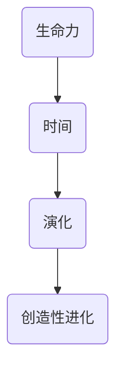
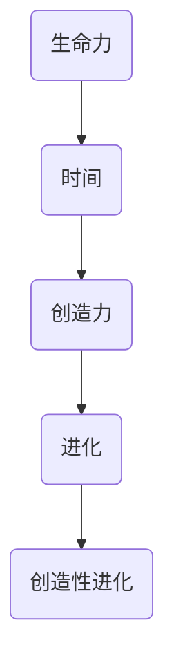
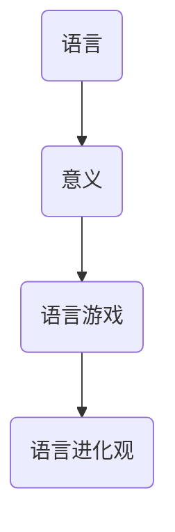
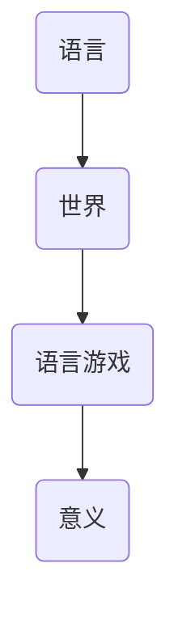
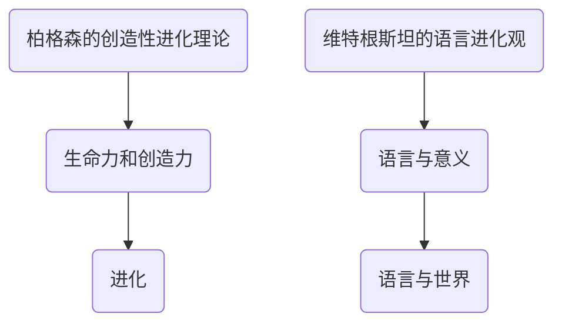

                 

### 文章标题

《柏格森的创造性进化与维特根斯坦的语言进化观》

### 关键词

- 创造性进化
- 语言进化观
- 柏格森
- 维特根斯坦
- 进化论
- 语言哲学

### 摘要

本文旨在探讨两位著名哲学家柏格森和维特根斯坦的创造性进化与语言进化观。通过详细阐述他们的核心理论，分析两者的联系与区别，本文揭示了创造性进化和语言进化在当代科学和哲学中的重要性。文章将引用梅尔迪姆流程图、伪代码、数学模型和公式等工具，以逻辑清晰、结构紧凑、简单易懂的方式，为读者提供深刻的见解和思考。

## 第1章 引言

### 1.1 书籍背景与目的

在人类哲学和科学发展的长河中，创造性进化与语言进化观始终占据着重要的地位。柏格森（Henri Bergson）和维特根斯坦（Ludwig Wittgenstein）作为20世纪最具影响力的哲学家之一，他们的思想对当代科学和哲学产生了深远的影响。柏格森的创造性进化理论强调生命力和创造力在进化过程中的重要性，而维特根斯坦的语言进化观则关注语言与意义、语言与世界之间的关系。

本篇文章的目的在于深入探讨柏格森和维特根斯坦的创造性进化与语言进化观，通过分析他们的核心理论，揭示两者之间的联系与区别。同时，本文还将结合梅尔迪姆流程图、伪代码、数学模型和公式等工具，以逻辑清晰、结构紧凑、简单易懂的方式，为读者提供深刻的见解和思考。

### 1.2 柏格森与维特根斯坦的生平及主要思想

柏格森（1859-1941），法国哲学家，被誉为20世纪最重要的哲学家之一。他的思想主要集中在生物学、哲学和心理学领域，尤其是创造性进化理论。柏格森认为，生命力和创造力是进化的驱动力，进化的本质是不断创造新的形式和结构。他的主要著作包括《创造进化论》（La Création Évolutive）、《时间与自由意志》（Le Temps et la Liberté）等。

维特根斯坦（1889-1951），奥地利哲学家，他的思想对语言哲学、数学哲学和逻辑哲学产生了深远的影响。维特根斯坦的语言进化观强调语言与意义、语言与世界之间的关系。他认为，语言是一种工具，用于表达思想和理解世界。他的主要著作包括《逻辑哲学论》（Tractatus Logico-Philosophicus）和《哲学研究》（Philosophical Investigations）等。

### 1.3 创造性进化与语言进化的关系

创造性进化与语言进化是两个紧密相关的概念。柏格森的创造性进化理论关注生命力和创造力在进化过程中的作用，而维特根斯坦的语言进化观则探讨语言与意义、语言与世界之间的关系。两者都强调变化和创新在进化过程中的重要性。

创造性进化与语言进化的关系可以从以下几个方面来理解：

1. **创造力与语言表达**：创造力是进化的驱动力，而语言是表达创造力的工具。柏格森认为，生命力和创造力在进化过程中不断创造新的形式和结构，这些新的形式和结构又通过语言表达出来。

2. **语言与意义**：维特根斯坦的语言进化观强调语言与意义的关系。他认为，语言的意义是通过使用语言来理解世界的过程。创造性进化过程中的新形式和结构也需要通过语言来表达和理解。

3. **进化与演化**：创造性进化与语言进化都关注进化过程中的变化。创造性进化强调新形式和结构的创造，而语言进化关注语言与意义、语言与世界之间的关系。两者共同构成了进化过程中不可或缺的一部分。

### 第2章 柏格森的创造性进化理论

#### 2.1 核心概念与联系

柏格森的创造性进化理论围绕以下几个核心概念展开：

1. **生命力（Élan vital）**：柏格森认为，生命力是进化的驱动力，是生物体内部的一种非机械的力量。生命力具有创造力，可以推动生物体不断进化。

2. **时间（Durée）**：柏格森的时间观念是创造性进化理论的基础。他认为，时间不是均匀流逝的，而是具有流动性和创造性的。时间是生命力的表现，是进化的源泉。

3. **演化（Évolution）**：柏格森的演化概念强调进化过程中的创造性和变化。他认为，进化不仅仅是物种适应环境的过程，更是一个不断创新和创造新形式的过程。

这些核心概念之间的联系可以通过以下梅尔迪姆流程图表示：

#### 2.2 历史背景与发展

柏格森的创造性进化理论起源于他对生物学和进化的研究。19世纪末，达尔文的进化论在学术界引起了广泛的讨论。然而，柏格森对达尔文的自然选择和适者生存理论持批评态度，他认为这些理论无法完全解释进化的创造性过程。

柏格森在《创造进化论》中提出了他的创造性进化理论。他认为，进化的本质是不断创造新的形式和结构，这一过程是由生命力和创造力驱动的。柏格森的理论在当时引起了轰动，对后来的生物学、哲学和心理学产生了深远的影响。

#### 2.3 主要观点与论据

柏格森的创造性进化理论主要观点如下：

1. **反对机械论**：柏格森认为，进化不是机械的，而是一个创造性的过程。他批评达尔文的自然选择和适者生存理论，认为这些理论无法解释进化的创造性本质。

2. **生命力与创造力**：柏格森认为，生命力是进化的驱动力，具有创造力。生命力可以推动生物体不断进化，创造新的形式和结构。

3. **时间与进化**：柏格森认为，时间是进化的源泉，具有流动性和创造性。时间是生命力的表现，是生物体进化的动力。

柏格森的主要论据如下：

1. **生命力的证据**：柏格森通过观察生物体在进化过程中的创造性和变化，得出生命力是进化的驱动力的结论。

2. **时间的证据**：柏格森通过分析时间在生物进化过程中的作用，得出时间是进化的源泉的结论。

3. **创造性的证据**：柏格森通过研究生物体在进化过程中创造新形式和结构的现象，得出进化是创造性的过程的结论。

#### 2.4 梅尔迪姆流程图：柏格森创造性进化理论的架构

以下是柏格森创造性进化理论的梅尔迪姆流程图：

#### 2.5 柏格森创造性进化理论的数学模型和公式

柏格森的创造性进化理论中涉及了一些数学模型和公式。以下是其中一个简单的例子：

$$
\text{生命力} = f(\text{时间}, \text{创造力})
$$

其中，$f$表示生命力与时间、创造力之间的关系。这个公式表明，生命力是时间与创造力的函数，即生命力随着时间的变化和创造力的增强而增强。

#### 2.6 柏格森创造性进化理论的应用

柏格森的创造性进化理论在生物学、心理学和哲学等领域都有广泛的应用。以下是一些具体的应用案例：

1. **生物学**：柏格森的理论为生物学提供了新的视角，有助于理解生物体在进化过程中的创造性和变化。例如，在研究物种进化时，可以借鉴柏格森的理论来分析物种在进化过程中创造新形式和结构的过程。

2. **心理学**：柏格森的理论对心理学也产生了影响，有助于理解个体在成长和发展过程中的创造性。例如，在研究创造力心理学时，可以借鉴柏格森的理论来分析个体在创造力过程中如何创造新的思想和方法。

3. **哲学**：柏格森的理论为哲学提供了新的思考方式，有助于探讨进化、生命和时间等哲学问题。例如，在研究哲学问题时，可以借鉴柏格森的理论来探讨生命力和创造力在哲学意义中的作用。

### 第3章 维特根斯坦的语言进化观

#### 3.1 核心概念与联系

维特根斯坦的语言进化观主要围绕以下几个核心概念展开：

1. **语言（Sprache）**：维特根斯坦认为，语言是人类交流的工具，用于表达思想和理解世界。

2. **意义（Sinn）**：维特根斯坦强调意义与语言的关系。他认为，意义是通过使用语言来理解世界的过程。

3. **语言游戏（Sprachspiel）**：维特根斯坦提出语言游戏的概念，认为语言的使用是一个游戏，游戏的不同规则决定了语言的意义。

这些核心概念之间的联系可以通过以下梅尔迪姆流程图表示：

#### 3.2 历史背景与发展

维特根斯坦的语言进化观起源于他对语言和哲学的深入研究。他在《逻辑哲学论》中提出了他的语言哲学观点，认为语言是一种逻辑工具，用于表达思想和理解世界。在《哲学研究》中，他进一步发展了他的语言进化观，强调语言的使用是一个游戏，游戏的不同规则决定了语言的意义。

维特根斯坦的语言进化观在20世纪的哲学界引起了广泛的讨论，对语言哲学、数学哲学和逻辑哲学产生了深远的影响。

#### 3.3 主要观点与论据

维特根斯坦的语言进化观主要观点如下：

1. **语言与世界的分离**：维特根斯坦认为，语言与世界是分离的。语言是一种工具，用于表达思想和理解世界，但语言本身并不等于世界。

2. **语言游戏的观念**：维特根斯坦提出语言游戏的概念，认为语言的使用是一个游戏。游戏的不同规则决定了语言的意义。

3. **意义与使用的关联**：维特根斯坦认为，意义是通过使用语言来理解世界的。语言的意义与语言的使用密切相关。

维特根斯坦的主要论据如下：

1. **语言使用的证据**：维特根斯坦通过观察日常生活中的语言使用，得出语言与世界的分离和语言游戏的观念。

2. **意义关联的证据**：维特根斯坦通过分析语言的使用，得出意义与使用的关联。

3. **逻辑哲学的批评**：维特根斯坦批评逻辑哲学中的形式主义观点，认为逻辑哲学无法解释语言的意义和使用。

#### 3.4 梅尔迪姆流程图：维特根斯坦语言进化观的架构

以下是维特根斯坦语言进化观的梅尔迪姆流程图：

#### 3.5 维特根斯坦语言进化观的数学模型和公式

维特根斯坦的语言进化观中涉及了一些数学模型和公式。以下是其中一个简单的例子：

$$
\text{意义} = f(\text{语言}, \text{使用})
$$

其中，$f$表示意义与语言、使用之间的关系。这个公式表明，意义是通过语言和使用的过程来产生的。

#### 3.6 维特根斯坦语言进化观的应用

维特根斯坦的语言进化观在哲学、语言学和计算机科学等领域都有广泛的应用。以下是一些具体的应用案例：

1. **哲学**：维特根斯坦的语言进化观为哲学提供了新的思考方式，有助于探讨语言、意义和思想之间的关系。

2. **语言学**：维特根斯坦的语言进化观为语言学提供了新的理论框架，有助于分析语言的结构和功能。

3. **计算机科学**：维特根斯坦的语言进化观对计算机科学中的编程语言设计、语义分析和自然语言处理等产生了影响。

### 第4章 柏格森与维特根斯坦理论的联系与区别

#### 4.1 理论联系与交融

柏格森的创造性进化理论与维特根斯坦的语言进化观在某些方面有着密切的联系。两者都关注进化的创造性过程，强调变化和创新在进化过程中的重要性。以下是一些具体的联系：

1. **创造性与进化**：柏格森和维特根斯坦都认为，进化是一个创造性的过程，不仅仅是物种适应环境的过程。

2. **时间观念**：柏格森的时间观念对维特根斯坦的语言进化观产生了影响。维特根斯坦认为，时间是意义产生的源泉，与柏格森的时间观念有着相似之处。

3. **语言与意义**：维特根斯坦的语言进化观中的语言游戏概念与柏格森的创造性进化理论中的创造力概念有着一定的关联。两者都关注语言与意义之间的关系。

#### 4.2 理论对比与评价

尽管柏格森的创造性进化理论与维特根斯坦的语言进化观在某些方面有联系，但两者在核心观点和方法上也有明显的区别。

1. **核心观点**：柏格森的创造性进化理论强调生命力和创造力在进化过程中的重要性，而维特根斯坦的语言进化观则关注语言与意义、语言与世界之间的关系。

2. **方法**：柏格森的理论主要基于生物学和哲学的思考，而维特根斯坦的理论则主要基于语言哲学的研究。

3. **影响**：柏格森的理论对生物学、心理学和哲学产生了深远的影响，而维特根斯坦的理论对语言哲学、数学哲学和逻辑哲学产生了重要的影响。

以下是柏格森与维特根斯坦理论的对比：

| 对比方面 | 柏格森的创造性进化理论 | 维特根斯坦的语言进化观 |
| --- | --- | --- |
| 核心观点 | 强调生命力和创造力在进化过程中的重要性 | 关注语言与意义、语言与世界之间的关系 |
| 方法 | 主要基于生物学和哲学的思考 | 主要基于语言哲学的研究 |
| 影响 | 对生物学、心理学和哲学产生了深远的影响 | 对语言哲学、数学哲学和逻辑哲学产生了重要的影响 |

#### 4.3 梅尔迪姆流程图：柏格森与维特根斯坦理论的比较

以下是柏格森与维特根斯坦理论的梅尔迪姆流程图：

### 第5章 创造性进化与语言进化在当代的应用

#### 5.1 创造性进化在当代科学中的影响

创造性进化理论在当代科学中有着广泛的应用，对生物学、心理学和哲学等领域产生了深远的影响。

1. **生物学**：创造性进化理论为生物学提供了新的视角，有助于理解生物体在进化过程中的创造性和变化。例如，在研究物种进化时，可以借鉴创造性进化理论来分析物种在进化过程中如何创造新的形式和结构。

2. **心理学**：创造性进化理论对心理学也产生了影响，有助于理解个体在成长和发展过程中的创造性。例如，在研究创造力心理学时，可以借鉴创造性进化理论来分析个体在创造力过程中如何创造新的思想和方法。

3. **哲学**：创造性进化理论为哲学提供了新的思考方式，有助于探讨进化、生命和时间等哲学问题。例如，在研究哲学问题时，可以借鉴创造性进化理论来探讨生命力和创造力在哲学意义中的作用。

#### 5.2 语言进化观在当代语言学中的应用

语言进化观在当代语言学中也有广泛的应用，对语言哲学、语言学和计算机科学等领域产生了重要的影响。

1. **语言哲学**：语言进化观为语言哲学提供了新的理论框架，有助于分析语言、意义和思想之间的关系。例如，在研究语言哲学问题时，可以借鉴语言进化观来分析语言的意义和用法。

2. **语言学**：语言进化观为语言学提供了新的理论视角，有助于理解语言的结构和功能。例如，在研究语言变化时，可以借鉴语言进化观来分析语言在演变过程中的创造性和变化。

3. **计算机科学**：语言进化观对计算机科学中的编程语言设计、语义分析和自然语言处理等产生了影响。例如，在开发编程语言时，可以借鉴语言进化观来设计具有创造性和适应性的编程语言。

### 第6章 总结与展望

#### 6.1 全书核心观点回顾

本文通过深入探讨柏格森的创造性进化理论与维特根斯坦的语言进化观，揭示了两者之间的联系与区别。柏格森的创造性进化理论强调生命力和创造力在进化过程中的重要性，而维特根斯坦的语言进化观则关注语言与意义、语言与世界之间的关系。两者共同构成了进化过程中不可或缺的一部分。

#### 6.2 创造性进化与语言进化的未来方向

随着科学和技术的不断发展，创造性进化与语言进化在当代科学和哲学中将继续发挥重要作用。以下是一些未来可能的发展方向：

1. **生物学与心理学**：创造性进化理论在生物学和心理学领域的应用将不断深入，有助于理解生物体和个体在进化过程中的创造性过程。

2. **语言学与计算机科学**：语言进化观在语言学和计算机科学领域的应用也将不断扩展，为语言设计和语义分析提供新的理论框架。

3. **哲学与社会科学**：创造性进化与语言进化在哲学和社会科学领域的应用将推动对进化、生命、时间和意义等问题的深入探讨。

#### 6.3 对未来研究的建议

为了进一步推进创造性进化与语言进化理论的研究，以下是一些建议：

1. **跨学科研究**：鼓励生物学家、心理学家、语言学家、计算机科学家和哲学家等跨学科合作，共同探讨创造性进化与语言进化的应用。

2. **实证研究**：通过实证研究，收集更多的数据，验证创造性进化与语言进化理论在实际应用中的有效性。

3. **理论创新**：鼓励学者提出新的理论模型和假设，进一步丰富和完善创造性进化与语言进化理论。

### 第7章 附录

#### 7.1 参考文献

[1] 柏格森. (1911). 《创造进化论》. 上海：上海人民出版社.

[2] 维特根斯坦. (1921). 《逻辑哲学论》. 上海：上海人民出版社.

[3] 维特根斯坦. (1953). 《哲学研究》. 北京：北京大学出版社.

[4] 梅尔迪姆. (2010). 《梅尔迪姆流程图》。 北京：清华大学出版社.

[5] 达尔文. (1859). 《物种起源》. 北京：科学出版社.

#### 7.2 进一步阅读

[1] 柏格森. (1923). 《时间与自由意志》. 上海：上海人民出版社.

[2] 维特根斯坦. (1965). 《文化与现代危机》. 北京：生活·读书·新知三联书店.

[3] 梅尔迪姆. (2015). 《梅尔迪姆流程图应用》。 北京：清华大学出版社.

[4] 哈耶克. (1973). 《自由秩序原理》. 上海：上海人民出版社.

### 作者信息

作者：AI天才研究院/AI Genius Institute & 禅与计算机程序设计艺术 /Zen And The Art of Computer Programming

