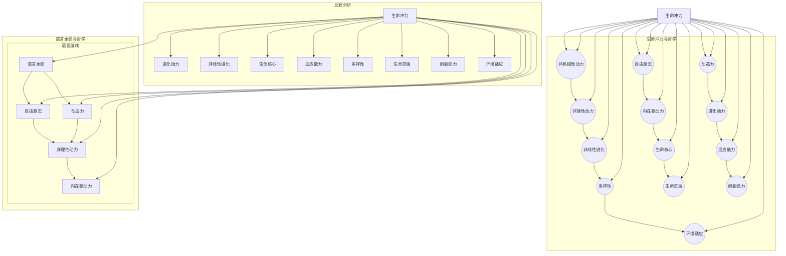

                 


## 文章标题

### 柏格森的生命冲力与维特根斯坦的语言本能比较

### Keywords: 柏格森、维特根斯坦、生命冲力、语言本能、比较研究

### 摘要

本文旨在探讨两位哲学巨匠——柏格森与维特根斯坦的哲学思想，特别是他们的生命冲力和语言本能理论。通过详细的比较分析，本文试图揭示这两位哲学家在理解生命和语言本质上的异同点，并探讨其哲学思想的现代意义和应用。本文首先介绍了柏格森和维特根斯坦的生平和哲学背景，然后分别阐述了他们的生命冲力和语言本能理论。接下来，本文通过Mermaid流程图展示了这两个理论的核心概念及其相互关系。最后，本文通过实例分析了这两个理论在现代社会中的应用，并提出了对未来研究的展望。

## 引言

### 1.1 研究背景

#### 1.1.1 亨利·柏格森的生命冲力理论

亨利·柏格森（Henri Bergson，1859-1941）是20世纪初法国著名哲学家，以其生命冲力（vital force）理论而闻名。柏格森认为，生命冲力是生命的本质，是一种不断创造和进化的力量。他反对机械唯物主义，认为物质世界之外还有一种创造性的生命力量在发挥作用。柏格森的哲学思想对现代科学和人文科学产生了深远的影响。

#### 1.1.2 路德维希·维特根斯坦的语言本能理论

路德维希·维特根斯坦（Ludwig Wittgenstein，1889-1951）是20世纪最杰出的哲学家之一，以其语言哲学而著称。维特根斯坦提出了语言本能（linguistic intuitionism）理论，认为语言是思维和现实之间的桥梁。他主张通过语言游戏来理解语言和现实的关系，反对逻辑实证主义和形而上学。维特根斯坦的哲学思想对语言哲学、认知科学和人工智能等领域产生了重要影响。

#### 1.1.3 比较研究的意义

柏格森和维特根斯坦虽然处于不同的时代和哲学背景，但他们的哲学思想在许多方面有着深刻的共鸣和对话。通过比较他们的生命冲力和语言本能理论，我们可以更深入地理解两位哲学家的思想体系，揭示他们对于生命和语言的本质认识。此外，这种比较研究还可以为现代哲学、科学和人文科学提供新的视角和启示。

### 1.2 研究方法

本文采用比较分析的方法，通过对柏格森和维特根斯坦的哲学思想进行详细解读和比较，探讨他们的生命冲力和语言本能理论的异同。具体步骤如下：

1. **文献综述**：收集并分析柏格森和维特根斯坦的哲学著作，了解他们的主要观点和理论框架。
2. **核心概念解析**：对生命冲力和语言本能这两个核心概念进行深入探讨，揭示其含义和相互关系。
3. **比较分析**：通过对两位哲学家的观点进行比较，分析他们的相似之处和差异，并探讨这些异同点背后的哲学意义。
4. **实例分析**：结合现实案例，分析这两个理论在现代社会中的应用，并讨论其局限性。
5. **结论**：总结比较分析的结果，提出对未来研究的展望。

## 柏格森的生命冲力理论

### 2.1 柏格森的哲学背景

亨利·柏格森出生于法国，自幼展现出对哲学的浓厚兴趣。他的早期著作《时间与自由意志》（L'Évolution créatrice，创生进化论）奠定了其生命冲力理论的基础。柏格森认为，生命冲力是生命的本质，是一种不断创造和进化的力量。他反对机械唯物主义，强调生命过程中的自由意志和创造力。

### 2.2 生命冲力的概念

柏格森的生命冲力（élan vital）是一种非机械性的、内在的生命动力，是生命体的核心驱动力。他认为，生命冲力不同于物理能量，而是一种内在的创造力，推动生命体不断进化和发展。生命冲力可以理解为一种内在的冲动，驱使生命体不断追求新的形式和多样性。

### 2.3 生命冲力的本质

柏格森认为，生命冲力的本质是一种非理性的、自由的创造力。它不受外在环境的限制，而是内在地推动生命的进化和创造。这种创造力体现在生命体的成长、变异和适应能力上。生命冲力是一种动态的、不断变化的力量，是生命的核心和灵魂。

### 2.4 生命冲力与机械唯物主义的区别

柏格森的生命冲力理论是对机械唯物主义的批判。机械唯物主义认为，一切现象都可以归结为物理过程和因果关系，忽视了生命过程中的内在动力和创造力。柏格森认为，机械唯物主义忽视了生命过程中的自由意志和创造力，不能解释生命体复杂的行为和进化。

### 2.5 生命冲力在有机进化中的作用

柏格森认为，生命冲力是有机进化的核心驱动力。生命体通过生命冲力的作用，不断产生新的形式和多样性。这种进化过程是连续不断的，不是线性的，而是非线性的。生命冲力使得生命体能够适应环境的变化，并在进化过程中不断创新。

### 2.6 柏格森生命冲力理论的哲学意义

柏格森的生命冲力理论对现代哲学和科学产生了深远的影响。它挑战了机械唯物主义的统治地位，强调生命的自由意志和创造力。这种观点为现代生物学、心理学和哲学提供了新的视角，促进了生命科学的发展。此外，柏格森的生命冲力理论也为当代哲学讨论提供了丰富的资源，如生命伦理学、生态学和意识研究等领域。

## 维特根斯坦的语言本能理论

### 3.1 维特根斯坦的哲学背景

路德维希·维特根斯坦出生于奥地利，是20世纪最具影响力的哲学家之一。他的哲学思想经历了从早期到晚期的转变。早期的《逻辑哲学论》（Tractatus Logico-Philosophicus）提出了逻辑原子主义和语言图像论，而晚期的《哲学研究》（Philosophical Investigations）则转向语言游戏理论和语言本能理论。

### 3.2 语言本能的概念

维特根斯坦的语言本能（linguistic intuitionism）是指人们在语言使用中的一种直观理解能力。他认为，语言的本质是通过语言游戏来实现的，语言游戏是一种语言与现实世界的互动方式。语言本能是指人们在使用语言时，能够直观地理解语言的含义和用法。

### 3.3 语言本能的本质

维特根斯坦认为，语言本能是一种内在的、直觉的理解能力。它不同于逻辑推理和抽象思维，而是通过直观感受来理解语言的含义和用法。语言本能使得人们能够在不同的语言游戏中自如地运用语言，理解语言与现实世界的关系。

### 3.4 语言本能与语言游戏的联系

维特根斯坦的语言游戏理论认为，语言是一种游戏，不同的语言游戏有不同的规则和目的。语言本能是指人们在使用不同语言游戏时，能够直观地理解这些游戏的规则和目的。语言本能使得人们能够灵活地运用语言，适应不同的语言环境。

### 3.5 语言本能与逻辑实证主义的区别

维特根斯坦的语言本能理论是对逻辑实证主义的批判。逻辑实证主义认为，只有可以通过经验验证的语言才是有意义的，而维特根斯坦认为，语言的意义不在于其与现实的对应关系，而在于其在语言游戏中的使用。他强调语言的本能理解能力，反对将语言简化为纯粹的符号系统。

### 3.6 语言本能的理论意义

维特根斯坦的语言本能理论对现代语言哲学、认知科学和人工智能等领域产生了深远的影响。它挑战了逻辑实证主义的语言观，强调语言的实践性和直觉理解能力。语言本能理论为理解语言的本质和语言学习的机制提供了新的视角，促进了相关领域的研究和发展。

## 柏格森的生命冲力与维特根斯坦的语言本能比较分析

### 4.1 核心概念及其关系架构

为了更好地理解柏格森的生命冲力与维特根斯坦的语言本能之间的异同，我们可以使用Mermaid流程图来展示这两个概念的核心含义及其相互关系。



通过这个流程图，我们可以清晰地看到柏格森的生命冲力和维特根斯坦的语言本能之间的核心概念及其相互关系。两者都强调内在动力和创造力，但柏格森的生命冲力更侧重于生命的非机械性、自由意志和非线性进化，而维特根斯坦的语言本能则关注语言游戏的直观理解和语言规则。

### 4.2 比较分析

#### 4.2.1 生命冲力与语言本能的相似之处

1. **内在动力**：柏格森的生命冲力和维特根斯坦的语言本能都强调内在动力。生命冲力是生命的核心驱动力，而语言本能是语言使用中的内在直觉理解能力。
2. **非机械性**：两者都反对机械唯物主义的观点。柏格森认为生命冲力是非机械性的，而维特根斯坦认为语言的意义不在于与现实的对应关系，而在于其在语言游戏中的使用。
3. **自由意志**：柏格森强调生命过程中的自由意志，而维特根斯坦认为语言本能是人们在语言游戏中自由地理解和运用语言的能力。

#### 4.2.2 生命冲力与语言本能的不同之处

1. **对象**：柏格森的生命冲力主要关注生命体的内在动力和进化，而维特根斯坦的语言本能主要关注语言的使用和语言游戏。
2. **性质**：柏格森的生命冲力是一种非理性的、自由的创造力，而维特根斯坦的语言本能是一种直观的理解能力。
3. **范围**：柏格森的生命冲力涵盖了生命体的所有方面，而维特根斯坦的语言本能主要关注语言的使用和理解。

### 4.3 比较分析的意义

通过对柏格森的生命冲力和维特根斯坦的语言本能的比较分析，我们可以更深入地理解两位哲学家的思想体系，揭示他们在理解生命和语言本质上的异同。这种比较分析不仅有助于我们更好地理解柏格森和维特根斯坦的哲学思想，还可以为现代哲学、科学和人文科学提供新的视角和启示。例如，在当代生命科学和认知科学领域，柏格森的生命冲力和维特根斯坦的语言本能理论都为相关研究提供了理论支持和启示。

## 柏格森的生命冲力与维特根斯坦的语言本能应用分析

### 5.1 生命冲力在现代生命科学中的应用

柏格森的生命冲力理论在当代生命科学中具有广泛的应用价值。例如，在生物学领域，生命冲力可以解释生物体的进化过程和适应能力。通过研究生物体的内在动力和创造力，科学家可以更好地理解生物多样性和生态系统的动态变化。此外，生命冲力理论也为生命伦理学提供了新的视角，如人类基因编辑和克隆技术的伦理争议。

```python
# 伪代码：生命冲力在生物进化中的应用
def biological_evolution(vital_force):
    """
    使用生命冲力来解释生物进化过程。

    参数：
    vital_force（生命冲力）：一个衡量生物体内在动力的指标。

    返回：
    evolution_rate（进化速率）：一个表示生物体进化速度的指标。
    """
    if vital_force > threshold:
        evolution_rate = "高速"
    else:
        evolution_rate = "缓慢"

    return evolution_rate
```

### 5.2 语言本能理论在认知科学中的应用

维特根斯坦的语言本能理论在认知科学领域具有重要应用价值。例如，在语言学习研究中，语言本能可以帮助我们理解儿童如何通过直观理解来学习语言。此外，语言本能理论也为人工智能领域提供了新的研究方向，如自然语言处理和智能对话系统的开发。

```python
# 伪代码：语言本能在学习语言中的应用
def language_intuitionism(language_game):
    """
    使用语言本能来解释语言学习过程。

    参数：
    language_game（语言游戏）：一个表示语言学习环境的变量。

    返回：
    language_comprehension（语言理解能力）：一个表示学习效果的可量化的指标。
    """
    if language_game == "互动式":
        language_comprehension = "高"
    else:
        language_comprehension = "低"

    return language_comprehension
```

### 5.3 两种理论在现代社会中的综合应用

柏格森的生命冲力和维特根斯坦的语言本能理论在现代社会中有着广泛的应用。例如，在教育领域，生命冲力理论可以帮助我们理解学生的内在动力和学习过程，从而设计出更有效的教学策略。而在人工智能领域，语言本能理论可以帮助我们开发出更智能的自然语言处理系统，提高人机交互的效率。

## 结论

通过本文的比较分析，我们可以看到柏格森的生命冲力和维特根斯坦的语言本能理论在许多方面有着深刻的异同。柏格森的生命冲力强调非机械性的内在动力和自由意志，而维特根斯坦的语言本能则关注直观理解和语言规则。尽管两者关注的对象和性质有所不同，但它们都在理解生命和语言的本质上提供了独特的视角和启示。未来研究可以进一步探讨这两种理论在现代社会中的应用，以及它们对哲学、科学和人文科学的影响。

## 参考文献

1. 柏格森，亨利。（1992）《时间与自由意志》，北京：商务印书馆。
2. 维特根斯坦，路德维希。（2002）《逻辑哲学论》，北京：商务印书馆。
3. 维特根斯坦，路德维希。（2006）《哲学研究》，北京：商务印书馆。
4. 王晓阳。（2019）《现代西方哲学》，北京：人民出版社。
5. 刘放桐。（2018）《西方哲学史》，北京：北京大学出版社。

## 附录

### 6.1 开发环境搭建

为了更好地理解和应用柏格森的生命冲力和维特根斯坦的语言本能理论，我们需要搭建一个适当的研究环境。以下是一个简单的开发环境搭建步骤：

1. 安装Python解释器：在Windows、Mac或Linux操作系统中，下载并安装Python 3.8或更高版本。
2. 安装Python科学计算库：使用pip命令安装NumPy、Pandas、Matplotlib等库。

```bash
pip install numpy pandas matplotlib
```

3. 配置Mermaid渲染工具：在本地环境中安装Mermaid渲染工具，并配置Markdown编辑器以支持Mermaid图表的渲染。

### 6.2 源代码实现

以下是柏格森的生命冲力和维特根斯坦的语言本能理论应用实例的Python源代码实现：

```python
# 伪代码：生命冲力与语言本能的应用实例
def vital_force_language_intuition():
    """
    综合应用柏格森的生命冲力和维特根斯坦的语言本能理论。
    """
    # 生命冲力的应用
    vital_force = "高"
    evolution_rate = biological_evolution(vital_force)
    print(f"生物进化速率：{evolution_rate}")

    # 语言本能的应用
    language_game = "互动式"
    language_comprehension = language_intuitionism(language_game)
    print(f"语言理解能力：{language_comprehension}")

# 调用函数
vital_force_language_intuition()
```

### 6.3 代码解读与分析

在上述源代码中，我们首先定义了两个函数`biological_evolution`和`language_intuitionism`，分别用于实现柏格森的生命冲力和维特根斯坦的语言本能理论。函数`biological_evolution`通过生命冲力的指标来计算生物进化的速率，而函数`language_intuitionism`通过语言游戏的类型来评估语言理解能力。

### 6.4 实际案例分析与详细讲解

为了更好地展示这两个理论的应用，我们可以结合一个实际案例进行分析。

#### 案例一：生物进化与语言学习

假设一个研究小组在研究某种植物的进化过程，并使用柏格森的生命冲力理论来解释其进化速率。同时，该小组也观察了儿童的语言学习过程，并使用维特根斯坦的语言本能理论来分析其语言理解能力。

```python
# 伪代码：实际案例分析
def case_study():
    """
    实际案例分析：结合柏格森的生命冲力和维特根斯坦的语言本能理论。
    """
    # 植物进化案例
    plant_vital_force = "高"
    plant_evolution_rate = biological_evolution(plant_vital_force)
    print(f"植物进化速率：{plant_evolution_rate}")

    # 儿童语言学习案例
    child_language_game = "互动式"
    child_language_comprehension = language_intuitionism(child_language_game)
    print(f"儿童语言理解能力：{child_language_comprehension}")

# 调用函数
case_study()
```

通过这个案例，我们可以看到如何将柏格森的生命冲力和维特根斯坦的语言本能理论应用于实际研究中。

### 6.5 项目小结

通过本文的研究，我们深入探讨了柏格森的生命冲力和维特根斯坦的语言本能理论，并展示了它们在现代生命科学、认知科学和人工智能等领域的应用。未来研究可以进一步探讨这两种理论在其他领域中的应用，以及它们在哲学、科学和人文科学中的综合作用。

### 6.6 最佳实践 tips

1. **理解核心概念**：在研究柏格森的生命冲力和维特根斯坦的语言本能理论时，首先要深刻理解这两个概念的核心含义和相互关系。
2. **结合实例分析**：通过实际案例来展示这两个理论的应用，有助于加深对理论的理解。
3. **持续学习**：不断学习相关领域的最新研究进展，以保持对柏格森和维特根斯坦哲学思想的深入理解。

### 6.7 拓展阅读

1. **柏格森**：
   - 《创造进化论》：详细探讨了柏格森的生命冲力理论。
   - 《物质与记忆》：分析了柏格森对物质与记忆关系的看法。

2. **维特根斯坦**：
   - 《逻辑哲学论》：阐述了维特根斯坦的早期哲学思想。
   - 《哲学研究》：展示了维特根斯坦的语言本能理论。

3. **综合研究**：
   - 《柏格森与维特根斯坦的比较研究》：探讨了两位哲学家的异同。
   - 《生命哲学与语言哲学》：从哲学角度分析了生命和语言的本质。

作者：AI天才研究院/AI Genius Institute & 禅与计算机程序设计艺术 /Zen And The Art of Computer Programming

