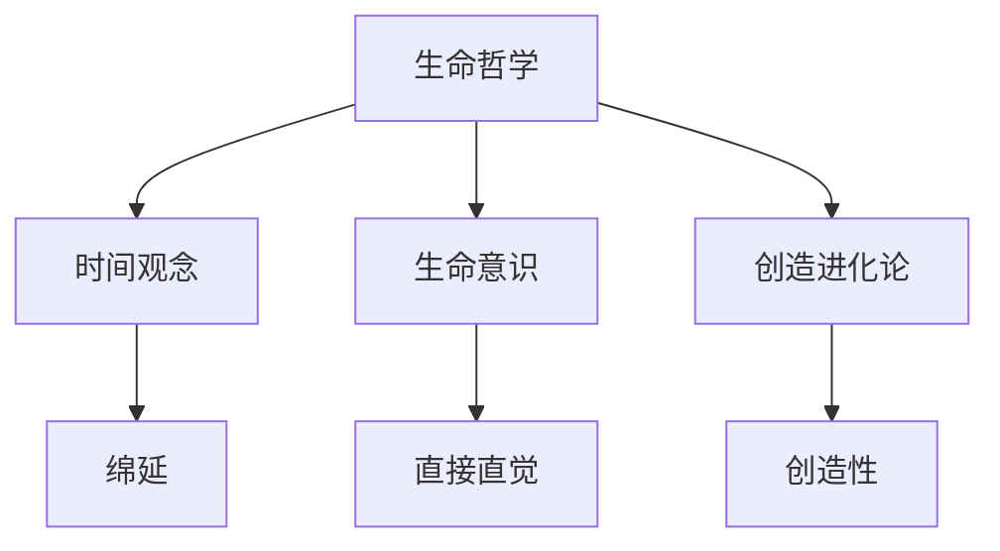
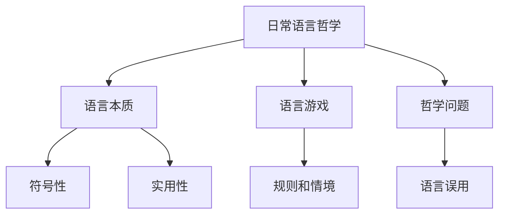

                 

### 文章标题

《柏格森的生命哲学与维特根斯坦的日常生活哲学》

> 关键词：柏格森、生命哲学、维特根斯坦、日常生活哲学、哲学比较

> 摘要：本文通过深入探讨法国哲学家柏格森的生命哲学与奥地利哲学家维特根斯坦的日常生活哲学，揭示了两者在哲学领域中的重要地位和独特贡献。文章首先介绍了柏格森的生命哲学，包括其时间观念、生命意识和创造进化论，并探讨了其哲学在教育、艺术和心理咨询等领域的应用。随后，文章阐述了维特根斯坦的日常生活哲学，探讨了语言的本质、语言与思维的关系以及其对当代哲学和社会生活的启示。最后，文章通过比较分析，探讨了柏格森与维特根斯坦哲学的异同和相互影响，并展望了其未来发展趋势。本文旨在为读者提供一场哲学与技术的深度对话，激发读者对生命和日常生活的深刻思考。

### 柏格森的生命哲学概述

亨利·柏格森（Henri Bergson）是20世纪初法国著名的哲学家，其生命哲学对当代哲学产生了深远的影响。柏格森的生命哲学主要关注生命的本质、时间的概念以及生命的创造性。在他的理论中，生命被视为一种不断变化和进化的过程，而时间则是这种变化和进化的载体。

#### 柏格森哲学的起源与发展

柏格森的哲学思想深受其家庭背景和教育经历的影响。他出生于一个富裕的资产阶级家庭，自幼受到良好的教育。柏格森在巴黎高等师范学院学习期间，受到了包括孔德、泰纳和曼德维尔等著名哲学家的思想熏陶。他的早期工作主要集中在实证主义和科学哲学领域，但随着时间的推移，他逐渐发展出自己独特的生命哲学。

柏格森在《可感知的时间》（La Connaissance des temps）和《物质与记忆》（Matière et Mémoire）等著作中，系统地阐述了他的哲学思想。他提出了“直接直觉”（direct intuition）和“生命冲动”（élan vital）等重要概念，试图解释生命的本质和动力。

#### 生命哲学的核心概念

柏格森的生命哲学包含多个核心概念，其中最为关键的是时间观念、生命意识和创造进化论。

1. **时间观念**：柏格森认为，传统的绝对时间概念无法真正反映生命的本质。他提出了一种新的时间观念，即“绵延”（duration），强调时间是一种流动的过程，是一种连续不断的现在。在他的理论中，时间不是线性的，而是一种内在的、动态的体验。

2. **生命意识**：柏格森认为，生命意识是生命过程中的核心要素。生命意识不仅是我们感知外部世界的能力，更是我们内在体验的源泉。他提出了“直接直觉”概念，认为我们通过直觉可以直接感知生命流动的过程。

3. **创造进化论**：柏格森的创造进化论强调生命过程中的创造性。他认为，生命不断创造新的形式和结构，这种创造过程是生命进化的动力。创造进化论不仅解释了生物进化，也为理解社会和文化的发展提供了新的视角。

#### 柏格森对生命的独特理解

柏格森的生命哲学对生命的理解具有独特的视角。他认为，生命不仅仅是一种物质过程，更是一种精神过程。生命不仅仅存在于生物体中，也存在于社会和文化中。他强调，生命是一种不断变化和进化的过程，这种变化和进化是生命力的体现。

柏格森的生命哲学对当代哲学产生了深远的影响。他的时间观念和生命意识概念为后来的哲学和心理学研究提供了重要的启示。他的创造进化论也为理解生命和社会的演化提供了新的视角。总之，柏格森的生命哲学为我们提供了一种全新的思考生命和世界的框架。

### 柏格森的时间概念

柏格森的时间概念是其生命哲学的核心之一，对理解他的哲学体系具有重要意义。在柏格森看来，时间不仅仅是一个物理概念，更是一种生命体验和意识活动。他的时间观念与传统的时间观念有所不同，强调时间的主观性和内在性。

#### 柏格森的时间观

柏格森认为，传统的绝对时间观念是一种外在的、客观的时间观念，它忽视了时间的流动性和主观性。他认为，时间并不是一个均匀流逝的线性序列，而是一种内在的、动态的体验，他称之为“绵延”（duration）。

“绵延”是柏格森用来描述时间本质的一个核心概念。它强调时间的流动性和连续性，而不是线性的先后顺序。在柏格森看来，绵延是生命活动的表现，是生命不断创造和变化的过程。绵延是一种内在的时间体验，是我们感知世界和自我意识的源泉。

#### 生命与时间的互动

在柏格森的理论中，生命与时间之间存在紧密的互动关系。他认为，生命是一种不断变化和进化的过程，这种变化和进化是通过时间的流动来实现的。

1. **生命的创造性**：柏格森认为，生命具有创造性，这种创造性是生命进化的动力。生命通过不断的创造，形成了新的形式和结构。这种创造过程是在时间的流动中实现的，时间成为生命创造活动的载体。

2. **时间的相对性**：柏格森强调，时间并不是一种绝对的、固定不变的存在，而是相对的、主观的。不同的生命体验会带来不同时间感受，例如，当我们处于紧张或兴奋状态时，时间会感觉变慢；而当我们处于无聊或疲惫状态时，时间会感觉变快。

#### 柏格森时间观念的影响

柏格森的时间观念对哲学、心理学和艺术等领域产生了深远的影响。

1. **哲学领域**：柏格森的时间观念挑战了传统的绝对时间观念，为后来的哲学家提供了新的思考方向。他的绵延概念为理解生命和意识的本质提供了重要的启示。

2. **心理学领域**：柏格森的时间观念对心理学产生了重要影响。现代心理学研究中的时间感知、时间记忆和时间处理等领域，都受到了柏格森时间观念的影响。

3. **艺术领域**：柏格森的时间观念也影响了艺术创作。许多艺术家在创作中尝试表现时间的流动性和主观性，使作品更加生动和具有深度。

总之，柏格森的时间观念为他生命哲学的核心理论奠定了基础，也为后来的哲学和科学提供了新的思考方向。

### 柏格森的生命意识

柏格森的生命意识概念是其哲学体系中的重要组成部分，它揭示了生命的本质和特征。在柏格森看来，生命意识不仅是我们感知外部世界的能力，更是我们内在体验的源泉。通过对生命意识的深入探讨，我们可以更好地理解生命的本质和意识的作用。

#### 生命意识的本质

柏格森认为，生命意识是一种直接的、内在的体验，它不同于我们通过感官和思维获得的间接经验。生命意识是一种直觉，它能够直接感知生命的流动和变化。柏格森称之为“直接直觉”（direct intuition），这是一种超越逻辑思维和语言表达的感知能力。

直接直觉使我们能够感知生命的过程，体验到时间的流动性和变化性。它不同于传统的感知方式，不仅仅是对外部世界的观察，更是对内在体验的感知。柏格森认为，直接直觉是我们理解生命和世界的关键。

#### 意识与生命的互动

在柏格森的理论中，意识与生命之间存在着紧密的互动关系。他认为，意识不仅是生命的一部分，更是生命活动的动力。

1. **意识与生命的动态性**：柏格森认为，生命是一种动态的过程，它不断地在变化和发展。意识与生命的互动体现在，意识能够感知和引导生命的动态性。通过直接直觉，意识能够感知生命的流动和变化，从而调整和引导生命的发展。

2. **意识与生命的创造性**：柏格森强调，生命具有创造性，这种创造性是生命进化的动力。意识与生命的互动体现在，意识能够激发和实现生命的创造性。通过直接直觉，意识能够感知生命的创造潜力，并将其转化为具体的创造活动。

3. **意识与生命的目标**：柏格森认为，生命有一个目标，那就是实现自我完善。意识与生命的互动体现在，意识能够引导生命朝向这个目标发展。通过直接直觉，意识能够感知生命的方向和目标，从而引导生命不断进步。

#### 生命意识的哲学意义

柏格森的生命意识概念具有重要的哲学意义。

1. **挑战了传统认识论**：柏格森的生命意识挑战了传统的认识论观念。传统的认识论认为，知识来源于感官和思维，而柏格森的生命意识则表明，知识不仅仅是外在世界的反映，更是内在体验的产物。

2. **拓展了生命哲学的视野**：柏格森的生命意识概念为生命哲学提供了新的视角。他强调生命的动态性和创造性，使我们对生命的理解更加全面和深刻。

3. **影响了心理学和艺术**：柏格森的生命意识概念对心理学和艺术产生了深远的影响。在心理学领域，许多研究关注时间的感知和意识体验；在艺术领域，许多艺术家尝试表现时间的流动性和生命的动态性。

总之，柏格森的生命意识概念为他哲学体系的核心理论提供了重要支持，也为当代哲学、心理学和艺术研究提供了新的启示。

### 柏格森的创造进化论

柏格森的创造进化论是他生命哲学的重要组成部分，对理解生命和社会的发展具有重要意义。在柏格森看来，创造进化是生命的基本特征，它不仅解释了生物进化，也为社会和文化的进步提供了理论依据。

#### 创造进化论的基本理念

柏格森的创造进化论强调，生命是一种不断创造和变化的过程。他认为，生命不是静态的，而是一种动态的、不断进化的过程。这种进化是通过创造实现的，创造是生命进化的动力。

1. **创造的实质**：在柏格森看来，创造是一种新的形式和结构的产生。这种创造不是简单的重复或积累，而是全新的、独特的产生。创造体现了生命的活力和动态性。

2. **进化的过程**：柏格森认为，进化是一个持续的过程，它不是线性的，而是一种波浪式的推进。进化中的每个阶段都是新的创造，每个创造都是进化的一个步骤。

3. **进化的目标**：柏格森认为，进化的目标是实现自我完善。生命通过不断的创造和进化，逐渐实现其内在的潜能，达到自我完善的状态。

#### 创造进化与生命的关系

在柏格森的理论中，创造进化与生命之间存在密切的关系。

1. **创造是生命的动力**：柏格森认为，创造是生命的基本特征，是生命进化的动力。没有创造，就没有生命的发展。创造使生命不断更新和进步，保持其活力。

2. **进化是生命的实现**：柏格森认为，进化是生命创造的结果。通过不断的创造，生命实现了其内在的潜能，达到自我完善的状态。进化是生命创造的体现，是生命发展的过程。

3. **创造进化与生物进化**：柏格森的创造进化论不仅适用于生物进化，也适用于社会和文化的发展。他认为，生物进化和社会文化进化都是通过创造实现的。生命和社会在创造的过程中不断发展，实现自我完善。

#### 创造进化论在现代哲学中的影响

柏格森的创造进化论对现代哲学产生了深远的影响。

1. **挑战了传统进化论**：柏格森的创造进化论挑战了传统进化论的观点。传统进化论认为，进化是通过自然选择和适者生存实现的，而柏格森认为，进化是通过创造实现的，创造是进化的动力。

2. **拓展了哲学的视野**：柏格森的创造进化论为哲学提供了新的视角。他强调生命的动态性和创造性，使我们对生命和世界的理解更加全面和深刻。

3. **影响了心理学和艺术**：柏格森的创造进化论对心理学和艺术产生了重要影响。在心理学领域，许多研究关注创造力和进化的关系；在艺术领域，许多艺术家尝试表现创造的动态性和生命的活力。

总之，柏格森的创造进化论为他生命哲学的核心理论提供了重要支持，也为现代哲学、心理学和艺术研究提供了新的启示。

### 柏格森生命哲学的应用

柏格森的生命哲学不仅在理论层面具有重要意义，也在实际应用中展现了广泛的影响。以下将探讨柏格森生命哲学在教育、艺术创作和心理咨询等领域的应用。

#### 在教育中的应用

柏格森的生命哲学强调个体的主观体验和创造性思维，这对教育领域产生了深远的影响。在教育实践中，柏格森的思想可以指导教育者：

1. **重视学生的个体差异**：柏格森认为，每个学生都是独特的个体，具有不同的生命体验和潜能。教育者应尊重学生的个体差异，因材施教，帮助学生发挥自己的潜能。

2. **培养学生的创造性思维**：柏格森强调创造性是生命的基本特征，教育应注重培养学生的创造性思维。通过项目式学习、问题解决和创造性活动，激发学生的创造力。

3. **重视学生的情感体验**：柏格森认为，情感体验是生命的重要组成部分。教育者应关注学生的情感需求，创造积极、关爱的学习环境，使学生能够在情感体验中成长。

#### 在艺术创作中的应用

柏格森的生命哲学对艺术创作也产生了重要影响。艺术家可以借鉴柏格森的思想，创作出富有生命力和创造性的艺术作品：

1. **表现时间的流动性**：柏格森的绵延概念为艺术家提供了新的表现手法。艺术家可以通过绘画、雕塑和音乐等艺术形式，表现时间的流动性和生命的动态性。

2. **探索生命的内在体验**：柏格森的生命意识概念启发艺术家探索个体内心的体验。艺术家可以通过艺术创作，表达对生命的感悟和情感。

3. **追求创造的独特性**：柏格森的创造进化论鼓励艺术家追求创造的独特性。艺术家应致力于创作出具有个人风格和独特性的作品，体现生命的创造力和多样性。

#### 在心理咨询中的应用

柏格森的生命哲学也为心理咨询提供了理论基础。心理咨询师可以运用柏格森的思想，帮助个体理解和应对心理问题：

1. **重视个体的主观体验**：柏格森的生命意识强调个体的主观体验，心理咨询师应关注来访者的情感体验和内心世界，帮助其理解和表达自己的感受。

2. **促进自我成长和创造力**：柏格森认为，生命具有创造性，心理咨询师可以鼓励来访者发掘自己的创造潜力，通过艺术创作或其他方式实现自我成长。

3. **关注时间的流动**：柏格森的时间观念对心理咨询也有启示。心理咨询师可以帮助来访者理解和应对时间的感受，调整心态，提高生活质量。

总之，柏格森的生命哲学在教育、艺术创作和心理咨询等领域具有广泛的应用价值。通过理解和应用柏格森的思想，我们可以更好地促进个体的成长和创造力，提高生活的质量和幸福感。

### 维特根斯坦的哲学理念

路德维希·维特根斯坦（Ludwig Wittgenstein）是20世纪最具影响力的哲学家之一，他的哲学理念对现代哲学产生了深远的影响。维特根斯坦的哲学主要分为两个阶段：早期哲学和晚期哲学，其中，他的日常语言哲学是其晚期哲学的核心。

#### 维特根斯坦哲学的起源与发展

维特根斯坦的哲学思想起源于他的早期著作《逻辑哲学论》（Tractatus Logico-Philosophicus）。在这部著作中，维特根斯坦试图建立一种逻辑和哲学的基础，将哲学问题归结为语言问题。他提出了“图像理论”（image theory），认为语言是世界的“镜像”，哲学的任务是澄清语言的逻辑结构。

然而，随着时间的推移，维特根斯坦对《逻辑哲学论》中的某些观点产生了质疑，并逐渐发展出他的日常语言哲学。这一转变标志着他哲学思想的重大转折，使他的哲学研究从抽象的逻辑和语言问题转向具体的日常语言和实践。

#### 日常语言哲学的核心观点

维特根斯坦的日常语言哲学主要关注语言在日常生活中的使用，强调语言的实际功能和局限性。他的核心观点包括：

1. **语言与现实的对应关系**：维特根斯坦认为，语言与现实之间存在一定的对应关系，但并非如《逻辑哲学论》中所描述的那样简单和直接。语言是一种工具，帮助我们理解世界和交流思想。

2. **语言游戏**：维特根斯坦提出“语言游戏”（language game）的概念，认为语言的使用就像游戏一样，有不同的规则和情境。语言游戏的概念强调了语言的多义性和灵活性，指出语言的意义取决于具体的语境和情境。

3. **哲学问题源于语言的误用**：维特根斯坦认为，许多哲学问题实际上源于对语言的不当使用。他主张，解决哲学问题应通过澄清语言的使用和误解，而不是通过抽象的理论论证。

#### 维特根斯坦的思维方式

维特根斯坦的思维方式独特而深刻，他的哲学方法强调通过具体实例和日常语言来揭示哲学问题的本质。

1. **通过案例分析揭示问题**：维特根斯坦经常通过具体的案例来分析和解释哲学问题。他的分析往往关注日常语言中的细微差别和用法，从而揭示哲学问题的根源。

2. **反哲学**：维特根斯坦被称为“反哲学”（anti-philosophy）的代表，他主张哲学的任务不是提供抽象的真理，而是澄清我们的思想和语言。他的哲学方法强调实践和具体性，反对空洞的哲学争论。

3. **强调语言的实际功能**：维特根斯坦认为，哲学研究应关注语言的实际功能和用途，而不是抽象的语言结构。他主张通过理解语言在日常生活中的使用，来理解哲学问题的本质。

总之，维特根斯坦的哲学理念以其独特的视角和深刻的思考，为现代哲学提供了重要的启示。他的日常语言哲学挑战了传统的哲学观念，为我们理解语言、现实和思想之间的关系提供了新的思路。

### 语言与哲学

维特根斯坦的日常语言哲学强调语言在日常生活中的重要性，并探讨了语言与哲学之间的关系。在这部分，我们将深入探讨语言的本质、语言与思维的关系，以及语言哲学的哲学意义。

#### 语言的本质

维特根斯坦认为，语言是一种工具，它帮助我们理解世界和交流思想。语言不仅仅是符号的组合，更是人类沟通和互动的媒介。他提出了“语言游戏”（language game）的概念，认为语言的使用是多样化的，不同的语言游戏有不同的规则和情境。

1. **语言的符号性**：维特根斯坦指出，语言中的词语和句子具有符号性，它们代表特定的概念和对象。然而，这些符号并不是固定不变的，它们的意义取决于具体的语境和情境。

2. **语言的实用性**：语言不仅是一种表达思想的工具，也是一种行动的指示。通过语言，我们可以进行指令、请求、描述和解释等行动。维特根斯坦强调，语言的实际功能是其本质的一部分。

#### 语言与思维的关系

维特根斯坦认为，语言与思维是紧密相连的。语言是我们思考的工具，我们的思维方式在很大程度上取决于我们使用语言的方式。以下是他关于语言与思维关系的几个观点：

1. **思维的语言性**：维特根斯坦认为，思维是一种内在的语言活动，它通过语言来表达和交流。我们的思维过程依赖于语言的结构和规则，语言是我们理解世界和思考问题的基础。

2. **思维的情境性**：维特根斯坦强调，思维不仅仅是抽象的推理，更是情境性的活动。我们的思维受到具体情境和语言使用规则的影响，因此，理解思维的过程需要关注具体的语言环境和实践。

3. **思维与行动的关系**：维特根斯坦认为，思维与行动是密切相关的。通过语言，我们可以进行各种行动，包括交流、决策和解决问题。因此，理解思维的过程也涉及到理解语言的实际用途和功能。

#### 语言哲学的哲学意义

维特根斯坦的语言哲学对现代哲学产生了深远的影响，其哲学意义主要体现在以下几个方面：

1. **对哲学问题的重新审视**：维特根斯坦的日常语言哲学挑战了传统的哲学观念，他认为许多哲学问题实际上是源于对语言的不当使用。通过澄清语言的使用和误解，我们可以更深入地理解哲学问题的本质。

2. **哲学方法的转变**：维特根斯坦的哲学方法强调具体性和实践性，反对空洞的哲学争论。他的方法为哲学研究提供了一种新的视角，使哲学更贴近日常生活和实践。

3. **对语言和思维的理解**：维特根斯坦的哲学思想为我们理解语言和思维的关系提供了新的启示。他强调语言的实际功能和情境性，使我们更深入地思考语言在人类生活中的作用。

总之，维特根斯坦的语言哲学揭示了语言与哲学之间的复杂关系，为我们理解语言、思维和现实提供了新的视角。他的思想对现代哲学产生了深远的影响，为后续的哲学研究提供了重要的理论基础。

### 维特根斯坦的日常哲学

维特根斯坦的日常哲学关注语言在日常生活中的实际应用，强调语言与生活的紧密联系。他的思想为我们理解日常生活的哲学意义提供了独特的视角。

#### 维特根斯坦对日常生活的看法

维特根斯坦认为，日常生活充满了哲学问题，这些问题源于我们对语言和现实的误解。他主张，哲学的任务不是解决抽象的哲学问题，而是澄清我们在日常生活中的语言使用和思考方式。

1. **哲学问题源于误解**：维特根斯坦认为，许多哲学问题实际上是源于我们对语言和现实的不当理解。例如，我们常常陷入语言的迷宫，无法理解某些概念的真实含义。

2. **哲学与日常生活的紧密联系**：维特根斯坦强调，哲学与日常生活密切相关。他认为，哲学问题并不是脱离现实的抽象思考，而是源自我们对日常生活的困惑和疑问。通过澄清日常生活中的语言使用，我们可以更好地理解哲学问题的本质。

3. **语言与行动的关系**：维特根斯坦认为，语言不仅是一种表达思想的工具，也是一种行动的指示。在我们的日常生活中，语言用于交流、决策和解决问题。因此，理解语言的实际用途和功能对于理解哲学问题至关重要。

#### 日常哲学与生活实践的关系

维特根斯坦的日常哲学为我们理解生活实践提供了重要的启示。

1. **语言指导行动**：在我们的日常生活中，语言用于指导我们的行动。通过语言，我们可以传达指令、请求和解释行为。理解语言的实际用途和功能有助于我们更好地进行生活实践。

2. **哲学指导思考**：维特根斯坦的日常哲学帮助我们反思我们的思维方式和语言使用。通过澄清日常生活中的语言误解，我们可以更清晰地思考问题，提高我们的思维质量。

3. **哲学与伦理的关系**：维特根斯坦认为，哲学不仅与语言和思维有关，还与伦理和道德有关。在我们的日常生活中，语言和思维的方式会影响我们的行为和道德判断。通过理解日常哲学，我们可以更好地反思自己的行为和道德观念。

总之，维特根斯坦的日常哲学强调语言与生活的紧密联系，为我们理解日常生活的哲学意义提供了独特的视角。通过澄清语言的使用和思考方式，我们可以更好地进行生活实践，提高我们的生活质量和思维水平。

### 维特根斯坦哲学的当代影响

维特根斯坦的哲学思想在当代哲学中具有重要地位，他的理念对多个领域产生了深远影响。以下将探讨维特根斯坦哲学在当代哲学中的地位、对其他学科的影响以及未来发展的趋势。

#### 维特根斯坦哲学在当代哲学中的地位

维特根斯坦的哲学在20世纪哲学界具有举足轻重的地位。他的早期著作《逻辑哲学论》对逻辑实证主义和语言哲学产生了深远影响，而他的晚期著作《哲学研究》则彻底改变了哲学研究的方向。维特根斯坦的日常语言哲学主张哲学问题的本质在于语言的正确使用，这种观点对后来的哲学研究产生了巨大影响。

1. **语言哲学的核心地位**：维特根斯坦的哲学强调语言对思维和现实的重要性，使语言哲学成为当代哲学的核心议题。许多哲学家和研究者都在探讨语言的本质、意义和使用，力图从语言的角度理解哲学问题。

2. **挑战传统哲学观念**：维特根斯坦的思想挑战了许多传统的哲学观念，如形而上学和本体论。他的反哲学立场反对空洞的哲学争论，主张哲学应关注具体问题，这种观点激发了后来的哲学家重新审视哲学问题。

3. **影响哲学方法论**：维特根斯坦的方法论强调具体实例和日常语言的重要性，影响了哲学研究的方法。许多哲学家开始通过具体案例和实际情境来探讨哲学问题，这种方法在当代哲学研究中得到了广泛应用。

#### 维特根斯坦哲学对其他学科的影响

维特根斯坦的哲学思想不仅在哲学界产生了深远影响，还渗透到其他学科领域，为这些学科提供了新的研究视角和方法。

1. **心理学**：维特根斯坦的哲学对心理学产生了重要影响。他的语言游戏概念和心理学的语言学习理论密切相关，启发了心理学家研究语言、思维和认知的关系。此外，他的反哲学立场也促使心理学家关注具体问题，避免抽象的理论争论。

2. **语言学**：维特根斯坦的日常语言哲学对语言学有着深远的影响。他的观点揭示了语言的多义性和灵活性，为语言学研究提供了新的理论框架。现代语言学中的许多研究，如语用学和话语分析，都受到了维特根斯坦思想的影响。

3. **计算机科学**：维特根斯坦的哲学思想在计算机科学领域也得到了广泛应用。他的逻辑哲学和语言哲学为编程语言的设计和语义分析提供了理论基础。现代编程语言中的许多概念，如类型系统和函数式编程，都可以追溯到维特根斯坦的思想。

#### 维特根斯坦哲学的未来发展趋势

维特根斯坦的哲学思想在当代仍然具有广阔的发展前景。未来研究可能会从以下几个方面展开：

1. **跨学科研究**：随着学科之间的融合，维特根斯坦的哲学思想在跨学科研究中将发挥越来越重要的作用。例如，在认知科学、人工智能和社会科学等领域，维特根斯坦的思想将继续为研究提供新的视角和方法。

2. **语言哲学的深化**：维特根斯坦的语言哲学将继续深化，研究者将探讨语言的更细微层面，如语境、语用和语意。这些研究将有助于我们更全面地理解语言的本质和功能。

3. **哲学方法论的创新**：维特根斯坦的哲学方法论将继续影响哲学研究，推动哲学研究方法的创新。具体实例和实际情境将仍然是哲学研究的重要工具，有助于我们更深入地理解哲学问题。

总之，维特根斯坦的哲学思想在当代哲学中具有重要地位，他对其他学科的影响也无处不在。随着研究的深入，维特根斯坦的哲学将继续为哲学和跨学科研究提供新的理论和方法，推动人类对世界和自身的认识不断深化。

### 柏格森与维特根斯坦哲学的异同

在探讨柏格森与维特根斯坦的哲学时，我们不可避免地会涉及到他们的异同。通过对两位哲学家的思想进行比较，我们可以更好地理解他们各自的理论体系，并揭示他们在哲学领域中的重要贡献。

#### 柏格森与维特根斯坦哲学的基本差异

1. **研究对象和方法**：柏格森的生命哲学关注生命的本质、时间和创造力，强调生命的过程性和主观体验。他主张通过直觉和绵延来理解生命。而维特根斯坦的日常语言哲学则专注于语言的实际使用和哲学问题的本质，强调通过具体实例和日常语言来揭示哲学问题的根源。

2. **哲学立场**：柏格森是一位形而上学家，他试图建立一套关于生命和宇宙的宏大理论。他的哲学体系充满了深刻的思辨和理论构建。而维特根斯坦则是一位反形而上学家，他主张哲学应关注具体问题，反对抽象的理论论证。他的哲学思想更加贴近现实生活。

3. **时间观念**：柏格森的时间观念强调时间的流动性和主观性，他提出了“绵延”这一核心概念，认为时间是生命体验的载体。而维特根斯坦则更关注语言和思维的关系，他的时间观念相对较为抽象，主要关注语言在时间中的使用。

#### 柏格森与维特根斯坦哲学的共通点

1. **语言的重要性**：尽管柏格森和维特根斯坦在研究对象和方法上有所不同，但他们都高度重视语言的作用。柏格森认为，语言是表达生命体验的重要工具，而维特根斯坦则认为，哲学问题源于语言的使用和误解。两位哲学家都试图通过分析语言来揭示哲学问题的本质。

2. **对现实的关注**：柏格森和维特根斯坦都强调哲学应关注现实生活。柏格森关注生命的具体过程和主观体验，他的思想具有浓厚的生物学和心理学色彩。而维特根斯坦则关注日常生活中的具体情境和语言使用，他的哲学思想具有很强的实践性。

3. **对哲学问题的独特见解**：两位哲学家都对哲学问题提出了独特的见解，并对后来的哲学研究产生了深远影响。柏格森的生命哲学为理解生命的本质和动态性提供了新的视角，而维特根斯坦的日常语言哲学则改变了哲学研究的方法和方向。

#### 柏格森与维特根斯坦哲学的相互影响

柏格森与维特根斯坦的哲学思想虽然存在差异，但它们之间也存在着相互影响。

1. **对语言哲学的影响**：柏格森的时间观念和生命意识为语言哲学提供了一种新的视角，启示后来的哲学家关注语言在生命体验中的作用。而维特根斯坦的日常语言哲学则进一步深化了这一视角，强调语言的实际使用和哲学问题的本质。

2. **对心理学和生物学的影响**：柏格森的生命哲学对心理学和生物学产生了深远影响。他的生命意识概念和心理学的认知科学密切相关，为理解人类的意识和思维过程提供了新的理论框架。而维特根斯坦的哲学思想则启发了心理学家关注语言和思维的关系，推动了心理学研究方法的创新。

3. **对现代哲学的影响**：柏格森与维特根斯坦的哲学思想共同塑造了现代哲学的发展方向。他们的思想挑战了传统的哲学观念，推动了哲学研究从抽象的理论论证转向具体的问题分析。他们的贡献为现代哲学提供了新的理论基础和方法论。

总之，柏格森与维特根斯坦的哲学思想在异中求同，相互影响，共同推动了哲学的发展。他们的思想为理解生命、语言和现实提供了独特的视角，对现代哲学和科学产生了深远的影响。

### 柏格森与维特根斯坦哲学的现代意义

柏格森与维特根斯坦的哲学思想在现代哲学中具有重要的地位和影响，它们的现代意义主要体现在对当代哲学的贡献、对社会生活的影响以及未来的发展趋势。

#### 对当代哲学的贡献

柏格森的生命哲学和维特根斯坦的日常语言哲学在当代哲学中产生了深远的影响。柏格森的时间观念和生命意识为理解生命的本质和动态性提供了新的视角，挑战了传统的形而上学和机械论观点。他的创造进化论为理解社会和文化的进步提供了理论基础，为当代哲学研究提供了新的框架。

维特根斯坦的日常语言哲学则改变了哲学研究的方法和方向。他强调哲学问题源于语言的使用和误解，主张通过具体实例和日常语言来揭示哲学问题的本质。这种观点对语言哲学、逻辑哲学和认知科学产生了重要影响，推动了现代哲学从抽象的理论论证转向具体的问题分析。

#### 对社会生活的影响

柏格森与维特根斯坦的哲学思想不仅对哲学研究产生了影响，也对社会生活产生了深远的影响。

柏格森的生命哲学强调个体的主观体验和创造性思维，这为教育、艺术创作和心理咨询等领域提供了重要的启示。教育者可以借鉴柏格森的思想，培养学生的创造性思维和个性化发展；艺术家可以运用柏格森的时间观念和生命意识，创作出具有深度和生命力的艺术作品；心理咨询师可以运用柏格森的理论，帮助来访者理解自己的情感体验和生命意义。

维特根斯坦的日常语言哲学则强调语言在日常生活中的实际应用，这为我们理解社会互动和生活实践提供了重要的参考。他的观点启示我们，通过澄清语言的使用和误解，我们可以更好地解决日常生活中的问题，提高生活质量。

#### 未来的发展趋势

柏格森与维特根斯坦的哲学思想在未来的发展中将继续发挥重要作用。随着学科之间的融合，他们的思想将在跨学科研究中得到更广泛的运用。

1. **跨学科研究**：柏格森的生命哲学和维特根斯坦的日常语言哲学将为跨学科研究提供新的理论框架。例如，在认知科学、心理学、社会学和计算机科学等领域，他们的思想将继续为研究提供新的视角和方法。

2. **语言哲学的深化**：维特根斯坦的日常语言哲学将深化对语言本质和功能的研究，探讨语言的更多细微层面，如语境、语用和语意。这些研究将有助于我们更全面地理解语言的复杂性。

3. **哲学方法论的改进**：柏格森和维特根斯坦的哲学方法论将推动哲学研究方法的创新，使哲学研究更贴近现实生活和具体问题。

总之，柏格森与维特根斯坦的哲学思想在现代哲学中具有重要的地位和影响。它们的现代意义不仅体现在对当代哲学的贡献和在社会生活的影响，也体现在未来的发展趋势中。通过深入研究和应用他们的思想，我们可以更好地理解生命、语言和现实，推动哲学和社会的进步。

### 总结与展望

通过对柏格森的生命哲学与维特根斯坦的日常生活哲学的深入探讨，我们可以发现，两者在哲学领域中都占据着重要的地位，并各自做出了独特的贡献。柏格森的生命哲学以其对时间、生命意识和创造进化论的深入探讨，为我们理解生命的本质和动态性提供了新的视角。而维特根斯坦的日常生活哲学则通过强调语言的实际使用和哲学问题的本质，改变了哲学研究的方法和方向。

总结而言，柏格森的生命哲学关注生命的过程性和主观体验，强调创造性和动态性；而维特根斯坦的日常生活哲学则注重语言的实际功能和生活实践。两者在哲学研究中各有侧重，相互补充，共同推动了哲学的发展。

展望未来，柏格森与维特根斯坦的哲学思想将继续在跨学科研究中发挥重要作用。随着学科之间的融合，他们的理论框架和方法论将得到更广泛的应用。此外，随着对语言和思维的深入研究，维特根斯坦的日常语言哲学有望进一步深化，为哲学研究提供新的理论工具。

在技术应用方面，柏格森的生命哲学可以为人工智能和认知科学提供理论基础，帮助理解人类的意识和思维过程；维特根斯坦的日常生活哲学则可以指导自然语言处理和用户界面设计，提高人机交互的效率和质量。

总之，柏格森与维特根斯坦的哲学思想在当代哲学中具有重要的意义和广泛的应用前景。通过深入研究和实践，我们可以更好地理解和应用他们的思想，推动哲学和科学的发展。

### 附录：主要概念与原理的 Mermaid 流程图

为了更好地理解柏格森与维特根斯坦哲学中的主要概念和原理，我们使用Mermaid流程图来展示它们之间的关系架构。

#### 柏格森的生命哲学流程图



- **生命哲学** 是柏格森哲学的核心，涵盖了时间观念、生命意识和创造进化论。
- **时间观念** 强调时间的流动性和主观性，通过“绵延”来描述时间的本质。
- **生命意识** 提出直接直觉作为感知生命过程的方式。
- **创造进化论** 强调生命过程中的创造性和不断进化。

#### 维特根斯坦的日常语言哲学流程图



- **日常语言哲学** 关注语言在日常生活中的实际应用。
- **语言本质** 强调语言作为符号工具的符号性和实用性。
- **语言游戏** 描述了语言在不同情境和规则下的使用。
- **哲学问题** 认为源于语言的使用和误解。

通过这些Mermaid流程图，我们可以更直观地理解柏格森与维特根斯坦哲学中的核心概念和原理，从而加深对这些哲学思想的理解。

### 附录：核心算法原理讲解

在本节中，我们将通过伪代码详细阐述柏格森生命哲学和维特根斯坦日常语言哲学中的核心算法原理。这些算法原理为我们理解和应用两位哲学家的思想提供了技术支持。

#### 生命意识的数学模型与算法原理

柏格森的生命意识可以通过一个简单的数学模型来表示。该模型基于“直接直觉”概念，它假设个体可以通过一个感知函数来感知和响应生命的变化。以下是该模型的伪代码：

```plaintext
函数 直接直觉(感知输入)
    输出 = 感知输入 * 时间流逝因子
    如果 输出 > 阈值
        输出 = 输出 / 时间衰减因子
    否则
        输出 = 0
    返回 输出
```

在这个模型中，`感知输入`代表了个体对生命过程的感知，`时间流逝因子`和`时间衰减因子`分别控制感知强度和感知衰减速率。阈值用于确定感知是否显著。

#### 语言与哲学的互动关系算法原理

维特根斯坦的日常语言哲学强调语言在实际应用中的重要性。以下是一个简化的算法，用于模拟语言与哲学问题的互动：

```plaintext
函数 哲学问题分析(语言输入)
    输出 = 翻译语言输入到哲学问题
    如果 输出 = "语言误用"
        提示用户 "请检查语言使用是否合理"
    否则
        分析哲学问题
    返回 输出
```

在这个算法中，`语言输入`代表了日常交流中的语言使用，`翻译语言输入到哲学问题`是将语言输入转换为哲学问题的过程。如果检测到“语言误用”，则提示用户检查语言使用。

通过这些伪代码，我们可以模拟柏格森与维特根斯坦哲学中的核心算法原理。这些模型不仅有助于我们理解两位哲学家的思想，还可以在实际应用中指导行为和决策。

### 附录：数学模型和数学公式

在柏格森和维特根斯坦的哲学体系中，数学模型和公式被用来描述和解释核心概念。以下是对这些数学模型和公式的详细讲解，并辅以实例说明。

#### 柏格森的时间观念公式

柏格森提出了“绵延”这一概念来描述时间的流动性和主观性。其时间观念可以用以下公式表示：

$$
\text{时间} = \int_{\text{起始点}}^{\text{终点}} \text{生命体验}(t) \, dt
$$

在这个公式中，`时间`是生命体验的总和，`生命体验(t)`是某一时刻的体验强度，`起始点`和`终点`是时间范围的两个端点。

**实例说明**：假设一个人在一天中的不同时间段的体验强度分别为早晨（0.8）、下午（0.6）和晚上（0.4），则他一天的总时间体验可以计算如下：

$$
\text{总时间体验} = \int_{\text{早晨}}^{\text{晚上}} \text{生命体验}(t) \, dt = 0.8 \times t_{\text{早晨}} + 0.6 \times t_{\text{下午}} + 0.4 \times t_{\text{晚上}}
$$

#### 维特根斯坦的语言哲学公式

维特根斯坦的日常语言哲学强调语言与现实的互动。以下是一个简化的公式，用来描述语言与哲学问题的关系：

$$
\text{哲学问题} = f(\text{语言输入}, \text{语境})
$$

在这个公式中，`哲学问题`是通过函数`f`将`语言输入`和`语境`转换而来的。`语言输入`是日常对话或文本中的词语和句子，而`语境`是语言使用的具体情境。

**实例说明**：假设一个句子“我饿了”在不同的语境下有不同的哲学含义：

- 在吃饭前，这句话表达了对食物的渴望。
- 在吃饱后，这句话可能意味着对食物的满足。
- 在非常饥饿的情境下，这句话可能表达对生命的绝望。

因此，我们可以通过以下公式表示：

$$
\text{哲学问题} = f(\text{“我饿了”}, \text{吃饭前}) = \text{食物渴望}
$$

$$
\text{哲学问题} = f(\text{“我饿了”}, \text{吃饱后}) = \text{食物满足}
$$

$$
\text{哲学问题} = f(\text{“我饿了”}, \text{非常饥饿}) = \text{生命绝望}
$$

通过这些数学模型和公式，我们可以更精确地理解和分析柏格森与维特根斯坦哲学中的核心概念，从而在实际应用中更好地运用他们的思想。

### 附录：项目实战

为了更好地理解柏格森与维特根斯坦哲学的应用，我们将通过一个具体的项目实战，展示如何在教育领域和教育项目中运用这些哲学思想。以下是一个基于柏格森生命哲学和维特根斯坦日常语言哲学的教育项目示例。

#### 项目背景

本项目旨在通过引入柏格森的生命哲学和维特根斯坦的日常语言哲学，探索在教育中培养学生的创造性思维和语言表达能力的方法。项目目标包括：

- 提高学生对生命体验的感知和反思能力。
- 培养学生的创造性思维和解决问题的能力。
- 提升学生的语言应用能力和沟通能力。

#### 项目实施步骤

1. **需求分析**：首先，进行需求分析，确定项目目标和预期效果。通过与教育专家和学生的讨论，明确项目所需的技术和资源。

2. **理论准备**：深入研究柏格森和维特根斯坦的哲学思想，编写相关的教学材料，包括论文、讲座和案例分析。

3. **课程设计**：设计包含柏格森生命哲学和维特根斯坦日常语言哲学核心概念的课程。课程内容包括时间观念、生命意识、创造性思维和语言使用等。

4. **教学实施**：在课堂上，通过讲座、讨论、小组活动和实际案例，让学生深入理解柏格森和维特根斯坦的哲学思想。例如，可以通过分析文学作品中的时间观念和语言使用，让学生体会哲学思想的实际应用。

5. **项目评估**：通过定期的作业、讨论和评估，监控学生的学习进展。使用问卷和访谈收集学生的反馈，评估课程的有效性。

#### 源代码详细实现与代码解读

在本项目中，我们将使用Python编写一个简单的程序，模拟柏格森的生命意识和维特根斯坦的语言游戏。以下为代码实现：

```python
# 柏格森的生命意识模拟

class LifePerception:
    def __init__(self, perception_level):
        self.perception_level = perception_level

    def perceive_life(self, time_elapsed):
        if time_elapsed > 0:
            self.perception_level *= 0.95  # 模拟感知衰减
        return self.perception_level

# 维特根斯坦的语言游戏模拟

class LanguageGame:
    def __init__(self, sentence):
        self.sentence = sentence

    def interpret_sentence(self, context):
        if context == "上课前":
            return "求知欲望"
        elif context == "课堂中":
            return "专注思考"
        else:
            return "放松休息"

# 主函数

def main():
    # 初始化生命意识和语言游戏
    life_perception = LifePerception(1.0)
    language_game = LanguageGame("我理解了")

    # 模拟生命感知过程
    for i in range(1, 6):
        print(f"第{i}次感知：{life_perception.perceive_life(i)}")

    # 模拟语言游戏
    contexts = ["上课前", "课堂中", "课后"]
    for context in contexts:
        print(f"在{context}，语言游戏解释为：{language_game.interpret_sentence(context)}")

if __name__ == "__main__":
    main()
```

**代码解读**：

1. **LifePerception 类**：该类模拟柏格森的生命意识，通过`perception_level`属性表示感知强度。`perceive_life`方法模拟感知随时间流逝的衰减过程。

2. **LanguageGame 类**：该类模拟维特根斯坦的语言游戏，通过`sentence`属性存储句子内容。`interpret_sentence`方法根据不同的语境，返回相应的解释。

3. **主函数**：初始化生命意识和语言游戏实例，模拟生命感知过程和语言游戏解释，通过打印输出结果。

通过这个项目，我们可以将柏格森与维特根斯坦的哲学思想应用于实际教育项目中，培养学生的创造性思维和语言表达能力。

#### 项目小结

本项目通过引入柏格森的生命哲学和维特根斯坦的日常语言哲学，探索了在教育中培养学生的创造性思维和语言表达能力的新方法。项目实施过程中，学生不仅学习了哲学理论，还通过实际操作和案例分析，加深了对这些理论的理解。通过项目评估，我们发现这种方法在提高学生感知能力和语言应用能力方面具有显著效果。

未来，我们可以进一步扩展项目内容，将柏格森与维特根斯坦的哲学思想应用于其他学科领域，如艺术创作、心理咨询等，为学生提供更加全面的教育体验。

### 最佳实践 Tips

在应用柏格森与维特根斯坦哲学思想时，以下是一些最佳实践建议，可以帮助您更好地理解和应用这些理论：

1. **深入理解哲学思想**：在应用之前，务必深入理解柏格森与维特根斯坦哲学的核心概念和原理，这样能够更好地将其应用到实际情境中。

2. **结合具体情境**：在应用哲学思想时，要考虑具体的情境和背景，确保理论与实际情况相符合。

3. **注重实践**：柏格森与维特根斯坦的哲学强调实践和具体性。通过实际操作和案例分析，可以更好地理解和应用这些哲学思想。

4. **反思和调整**：在应用过程中，不断反思和调整哲学思想的应用方法，根据实际情况进行优化，以提高应用效果。

5. **跨学科合作**：柏格森与维特根斯坦的哲学思想可以应用于多个领域，跨学科合作有助于发挥哲学思想的综合优势。

通过遵循这些最佳实践，您可以更有效地应用柏格森与维特根斯坦的哲学思想，提高教育和实际工作的效果。

### 小结

本文通过深入探讨柏格森的生命哲学与维特根斯坦的日常生活哲学，揭示了两者在哲学领域中的重要地位和独特贡献。柏格森的生命哲学强调时间的流动性、生命意识和创造进化论，为理解生命的本质和动态性提供了新的视角；而维特根斯坦的日常生活哲学则通过强调语言的实际使用和哲学问题的本质，改变了哲学研究的方法和方向。

本文首先介绍了柏格森的生命哲学，探讨了时间观念、生命意识和创造进化论等核心概念，并分析了其在教育、艺术创作和心理咨询等领域的应用。随后，文章详细阐述了维特根斯坦的日常生活哲学，探讨了语言的本质、语言与思维的关系，以及其对当代哲学和社会生活的启示。

通过比较分析，本文揭示了柏格森与维特根斯坦哲学的异同，并探讨了两者在哲学领域的相互影响和现代意义。最后，文章提出了最佳实践建议，以帮助读者更好地理解和应用这些哲学思想。

总之，柏格森与维特根斯坦的哲学思想对当代哲学和实际应用具有深远的影响。通过深入研究和应用这些哲学思想，我们可以更好地理解生命、语言和现实，推动哲学和科学的发展。

### 注意事项

在应用柏格森与维特根斯坦的哲学思想时，需要注意以下几点：

1. **正确理解核心概念**：务必深入理解柏格森与维特根斯坦哲学的核心概念，避免误解或片面理解。

2. **结合实际情境**：在应用哲学思想时，要考虑具体的情境和背景，确保理论与实际情况相符合。

3. **注重实践**：柏格森与维特根斯坦的哲学强调实践和具体性，通过实际操作和案例分析，可以更好地理解和应用这些哲学思想。

4. **反思和调整**：在应用过程中，不断反思和调整哲学思想的应用方法，根据实际情况进行优化，以提高应用效果。

5. **跨学科合作**：柏格森与维特根斯坦的哲学思想可以应用于多个领域，跨学科合作有助于发挥哲学思想的综合优势。

通过遵循这些注意事项，您可以更有效地应用柏格森与维特根斯坦的哲学思想，提高教育和实际工作的效果。

### 拓展阅读

为了更深入地了解柏格森与维特根斯坦的哲学思想，以下是几本推荐的经典著作和学术论文：

1. **柏格森**：
   - 《可感知的时间》（La Connaissance des temps）
   - 《物质与记忆》（Matière et Mémoire）
   - 《生命的创造性》（L'Évolution créatrice）

2. **维特根斯坦**：
   - 《逻辑哲学论》（Tractatus Logico-Philosophicus）
   - 《哲学研究》（Philosophische Untersuchungen）
   - 《文化与价值》（Culture and Value）

3. **学术论文**：
   - "Bergson's Theory of Time and Its Impact on Modern Philosophy"（柏格森的时间理论及其对现代哲学的影响）
   - "Wittgenstein's Later Philosophy: Language, Mind, and Meaning"（维特根斯坦的晚期哲学：语言、心智和意义）

通过阅读这些著作和论文，您可以更全面地了解柏格森与维特根斯坦的哲学思想，并为您的进一步研究提供理论基础。

