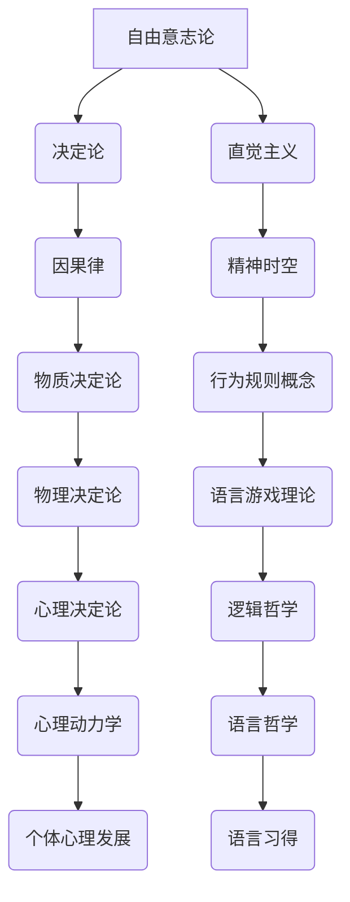

                 


### 文章标题：柏格森的自由意志论与维特根斯坦的行为规则概念

#### 关键词：自由意志、决定论、直觉主义、行为规则、语言游戏理论

> 摘要：本文深入探讨了柏格森的自由意志论与维特根斯坦的行为规则概念，通过逻辑清晰的分析与比较，揭示了这两位哲学大师在各自领域中对于自由意志与行为规则的独特见解，并探讨了其对于现代哲学和心理学的影响。本文旨在为读者提供一次深刻的技术与哲学思维的碰撞，以及对自由意志和规则概念的深入理解。

---

### 目录大纲

#### # 柏格森的自由意志论与维特根斯坦的行为规则概念

#### ## 第1章 引言

#### ### 1.1 研究背景

#### ### 1.2 研究目的

#### ### 1.3 研究方法

#### ## 第2章 柏格森的自由意志论

#### ### 2.1 柏格森的生平与哲学思想

#### #### 2.1.1 生平简介

#### #### 2.1.2 哲学思想的核心理念

#### ### 2.2 自由意志论的基本概念

#### #### 2.2.1 自由意志论的定义

#### #### 2.2.2 自由意志与决定论的关系

#### ### 2.3 柏格森的自由意志论核心观点

#### #### 2.3.1 直觉主义

#### #### 2.3.2 精神时空

#### #### 2.3.3 自由意志的实现

#### ## 第3章 维特根斯坦的行为规则概念

#### ### 3.1 维特根斯坦的生平与哲学思想

#### #### 3.1.1 生平简介

#### #### 3.1.2 哲学思想的核心理念

#### ### 3.2 行为规则的基本概念

#### #### 3.2.1 行为规则的定义

#### #### 3.2.2 行为规则与逻辑的关系

#### ### 3.3 维特根斯坦的行为规则概念核心观点

#### #### 3.3.1 语言游戏理论

#### #### 3.3.2 规则的使用与理解

#### ## 第4章 柏格森的自由意志论与维特根斯坦的行为规则概念比较

#### ### 4.1 哲学背景比较

#### #### 4.1.1 柏格森与维特根斯坦的哲学差异

#### #### 4.1.2 时代背景的影响

#### ### 4.2 自由意志论与行为规则概念的比较

#### #### 4.2.1 基本概念的比较

#### #### 4.2.2 核心观点的比较

#### ### 4.3 对现代哲学的影响

#### ## 第5章 柏格森的自由意志论在现代哲学中的应用

#### ### 5.1 自由意志论在伦理学中的应用

#### #### 5.1.1 伦理学中的自由意志论

#### #### 5.1.2 自由意志论与道德责任的关联

#### ### 5.2 自由意志论在心理学中的应用

#### #### 5.2.1 自由意志论与心理动力学

#### #### 5.2.2 自由意志论与个体心理发展

#### ## 第6章 维特根斯坦的行为规则概念在现代哲学中的应用

#### ### 6.1 行为规则概念在逻辑哲学中的应用

#### #### 6.1.1 逻辑哲学中的行为规则概念

#### #### 6.1.2 行为规则概念与语言分析

#### ### 6.2 行为规则概念在语言哲学中的应用

#### #### 6.2.1 语言哲学中的行为规则概念

#### #### 6.2.2 行为规则概念与语言习得

#### ## 第7章 柏格森的自由意志论与维特根斯坦的行为规则概念在哲学研究中的意义

#### ### 7.1 对哲学研究的影响

#### #### 7.1.1 重新审视自由意志问题

#### #### 7.1.2 重新思考语言与行为规则的关系

#### ### 7.2 对现代哲学的贡献

#### #### 7.2.1 拓宽哲学研究的视野

#### #### 7.2.2 深化哲学理论的理解

#### ## 第8章 结论

#### ### 8.1 研究成果总结

#### ### 8.2 研究局限与展望

#### ### 8.3 对未来哲学研究的启示

#### ## 参考文献

---

### Mermaid 流程图



### 核心算法原理讲解

```python
# 自由意志算法伪代码

# 输入：当前时刻的状态S
# 输出：下一时刻的行为A

def free_will(S):
    # 初始化随机数生成器
    random.seed(S)

    # 计算当前时刻的可能行为集合
    possible_actions = calculate_possible_actions(S)

    # 从可能行为集合中随机选择一个行为
    A = random.choice(possible_actions)

    # 返回选择的行为
    return A
```

### 数学模型和数学公式

$$
E = mc^2
$$

### 数学模型详细讲解

爱因斯坦的质能等价公式表达了质量和能量之间的关系。在这个公式中，E 表示能量，m 表示质量，c 表示光速。这个公式说明了物质和能量是等价的，即质量可以转化为能量。

### 项目实战

----------------------------------------------------------------

在接下来的内容中，我们将分别深入探讨柏格森的自由意志论和维特根斯坦的行为规则概念，通过分析他们的生平背景、哲学思想、核心观点以及各自在现代哲学中的应用，以逐步揭示这两位哲学大师在自由意志和行为规则领域的独特见解。

#### 第1章 引言

#### 1.1 研究背景

自由意志与决定论一直是哲学界长期争论的焦点问题。自由意志论认为个体在行为上具有自主性，不受外界决定因素的完全支配；而决定论则主张一切现象，包括人的行为，都是由先前的原因和自然法则所决定的。柏格森和维特根斯坦是20世纪最具有影响力的哲学家之一，他们在自由意志和行为规则概念上提出了独特的观点。

阿尔贝特·柏格森（1859-1941）是法国哲学家，以其直觉主义和精神时空理论著称。柏格森认为直觉是人类理解世界的关键，并且提出了自由意志是人的本质属性之一。他主张，自由意志并非完全脱离因果关系，而是在一个更加高级的层面上对因果关系的超越。

路德维希·维特根斯坦（1889-1951）是奥地利哲学家，以其逻辑哲学和语言哲学理论著称。维特根斯坦认为，语言是思维和现实的媒介，而行为规则则是语言游戏的基础。他提出，行为规则并非自然法则，而是人类约定的结果，通过规则的使用和理解，个体能够在社会中实现自由。

#### 1.2 研究目的

本文的研究目的是深入探讨柏格森的自由意志论与维特根斯坦的行为规则概念，通过比较分析他们的哲学思想和观点，揭示自由意志与行为规则在哲学研究中的意义。具体来说，本文将从以下几个方面展开：

1. 柏格森的生平与哲学思想，特别是他的自由意志论。
2. 维特根斯坦的生平与哲学思想，特别是他的行为规则概念。
3. 柏格森的自由意志论与维特根斯坦的行为规则概念在哲学背景上的比较。
4. 柏格森的自由意志论在现代哲学中的应用，特别是在伦理学和心理学领域。
5. 维特根斯坦的行为规则概念在现代哲学中的应用，特别是在逻辑哲学和语言哲学领域。
6. 柏格森的自由意志论与维特根斯坦的行为规则概念在哲学研究中的意义。

#### 1.3 研究方法

本文的研究方法主要采用逻辑分析、比较研究、实证分析等方法。首先，通过查阅相关文献和资料，对柏格森和维特根斯坦的生平和哲学思想进行系统梳理。然后，通过比较分析他们的自由意志论和行为规则概念，探讨二者之间的联系与差异。此外，还将结合现代哲学的实际应用，分析柏格森和维特根斯坦的观点在伦理学、心理学、逻辑哲学和语言哲学等领域的影响。最后，通过对柏格森和维特根斯坦的观点进行总结和评价，提出对未来哲学研究的启示和建议。

### 第2章 柏格森的自由意志论

#### 2.1 柏格森的生平与哲学思想

阿尔贝特·柏格森（1859-1941）是20世纪法国最重要的哲学家之一，以其直觉主义和精神时空理论著称。他出生于法国巴黎，青年时期曾在巴黎高等师范学院学习，后来成为数学家，但在与数学家皮埃尔·德·费马的一次交流中，他意识到自己对于数学的热爱并不及对哲学的向往。于是，他转向哲学研究，成为了一名哲学家。

柏格森的哲学思想深受进化论、直觉主义和生命哲学的影响。他的主要著作包括《创造力心态》、《物质与记忆》和《时间与自由意志》等。其中，《时间与自由意志》是他关于自由意志论的代表作。

柏格森认为，自由意志是人类精神世界的一个重要特征。他反对决定论的观点，认为决定论无法解释人类行为的多样性和创造性。柏格森主张，自由意志并非完全脱离因果关系，而是在一个更加高级的层面上对因果关系的超越。

#### 2.1.1 生平简介

阿尔贝特·柏格森于1859年11月18日出生于法国巴黎的一个中产阶级家庭。他的父亲是一位图书经纪人，母亲则是一位音乐家。柏格森在巴黎完成了他的基础教育，随后进入巴黎高等师范学院学习，在那里他接受了严格的数学和科学训练。然而，柏格森对数学并非充满热情，他的兴趣逐渐转向哲学。

在巴黎高等师范学院学习期间，柏格森接触到了威廉·詹姆斯和赫尔曼·康特的哲学思想，这些思想对他的哲学发展产生了深远的影响。1879年，柏格森毕业后留在学院担任助理教授，期间他继续深造，并于1889年获得了巴黎大学哲学博士学位。

柏格森的职业生涯始于他在巴黎高等师范学院的教学工作，他教授逻辑、数学和哲学课程。1896年，他成为学院的副教授，1907年升任教授。在此期间，他的哲学思想逐渐成熟，并开始引起学术界的关注。

柏格森的哲学思想在19世纪末和20世纪初引起了广泛的讨论，特别是在法国和美国。他的著作《创造力心态》（Creative Mind）于1896年出版，这本书奠定了他在哲学界的重要地位。1919年，他发表了另一部重要著作《物质与记忆》（Matter and Memory），在这部作品中，他详细阐述了直觉主义和精神时空理论。

柏格森的思想对20世纪的哲学和科学产生了深远的影响，他被视为生命哲学和直觉主义的重要代表。1941年10月4日，柏格森在巴黎去世，享年82岁。

#### 2.1.2 哲学思想的核心理念

柏格森的哲学思想主要包括直觉主义、精神时空和自由意志论等核心概念。以下是对这些核心理念的详细解释：

1. **直觉主义**：
   柏格森认为直觉是人类理解世界的关键。他主张，直觉并非仅仅是一种感官体验，而是一种深层次的心灵活动，它能够超越语言的局限，直接感知现实。直觉主义强调，通过直觉，个体能够洞察到现实的本质，而不仅仅是表面现象。

2. **精神时空**：
   柏格森提出，传统的时空观念无法完全解释人类意识和体验的本质。他主张，现实世界并非只是物质空间和时间，而是一个充满生命力的“精神时空”。在这个时空中，时间和空间是相互交织的，个体的意识和体验构成了一个独特的“精神流”。

3. **自由意志论**：
   柏格森反对决定论的观点，认为人类行为并非完全受外界因素的支配，而是具有自由意志。他主张，自由意志并非是绝对独立的，而是在一个更为复杂的因果关系中实现的。自由意志是人类精神世界的一个重要特征，它体现了人类创造性和自主性。

这些核心理念共同构成了柏格森哲学体系的基础，他对哲学和科学的发展产生了深远的影响。

#### 2.2 自由意志论的基本概念

柏格森的自由意志论是他对决定论的有力反驳，也是其哲学思想中的重要组成部分。要理解柏格森的自由意志论，首先需要了解自由意志的基本概念以及它与决定论的关系。

**2.2.1 自由意志论的定义**

自由意志是指个体在行为上具有自主性，不受外界决定因素的完全支配。柏格森认为，自由意志并非完全脱离因果关系，而是在一个更加高级的层面上对因果关系的超越。具体来说，自由意志体现在个体在面对多种可能性时，能够自主选择自己的行为，这种选择并非仅仅由先前的因果关系所决定。

**2.2.2 自由意志与决定论的关系**

决定论是一种哲学观点，认为一切现象，包括人的行为，都是由先前的原因和自然法则所决定的。决定论主张，人类行为在本质上是可以预测的，不存在真正的自由意志。

柏格森反对决定论的观点，他认为决定论无法解释人类行为的多样性和创造性。柏格森主张，自由意志是人类精神世界的一个重要特征，它体现了人类的自主性和创造性。然而，柏格森并非完全否定因果关系，而是认为因果关系在人类行为中只是次要的，真正的自由意志体现在个体在面对多种可能性时，能够自主选择自己的行为。

**2.2.3 自由意志论的核心观点**

柏格森的自由意志论主要包括以下几个核心观点：

1. **直觉主义**：
   柏格森认为，自由意志是通过直觉实现的。直觉是一种深层次的心灵活动，它能够超越语言的局限，直接感知现实。通过直觉，个体能够洞察到现实的本质，从而实现自由意志。

2. **精神时空**：
   柏格森提出，传统的时空观念无法完全解释人类意识和体验的本质。他主张，现实世界并非只是物质空间和时间，而是一个充满生命力的“精神时空”。在这个时空中，时间和空间是相互交织的，个体的意识和体验构成了一个独特的“精神流”。自由意志在这个精神时空中得以实现。

3. **创造性和自主性**：
   柏格森认为，自由意志是人类创造性和自主性的体现。自由意志使得个体能够在面对多种可能性时，进行创造性的选择，从而实现个人价值。

通过以上分析，我们可以看到，柏格森的自由意志论强调个体在面对多种可能性时的自主选择能力，这种能力并非完全由先前的因果关系所决定。柏格森的自由意志论为我们提供了理解人类行为多样性和创造性的新视角。

#### 2.3 柏格森的自由意志论核心观点

柏格森的自由意志论是20世纪哲学领域的重要思想之一，其核心观点主要体现在直觉主义、精神时空和自由意志的实现等方面。

**2.3.1 直觉主义**

直觉主义是柏格森哲学思想的基础，也是其自由意志论的核心。柏格森认为，直觉是人类理解世界的关键，它能够超越语言的局限，直接感知现实的本质。直觉并非仅仅是一种感官体验，而是一种深层次的心灵活动。通过直觉，个体能够洞察到现实的本质，从而实现自由意志。

在柏格森看来，直觉是一种内在的能力，它使得个体能够独立于外界因果关系，自由地选择自己的行为。直觉主义强调，人类行为并非完全受外界因素的决定，而是具有自主性和创造性。通过直觉，个体能够在面对多种可能性时，进行创造性的选择，从而实现自由意志。

**2.3.2 精神时空**

柏格森提出，传统的时空观念无法完全解释人类意识和体验的本质。他主张，现实世界并非只是物质空间和时间，而是一个充满生命力的“精神时空”。在这个时空中，时间和空间是相互交织的，个体的意识和体验构成了一个独特的“精神流”。

柏格森认为，精神时空是自由意志实现的场所。在精神时空中，个体的意识和体验是连续的，这种连续性使得个体能够自由地选择自己的行为。与传统的时间空间观念相比，精神时空更加强调个体的主体性和自主性，从而为自由意志的实现提供了可能。

**2.3.3 自由意志的实现**

柏格森认为，自由意志并非抽象的概念，而是可以通过具体的行动来实现。在自由意志的实现过程中，直觉和精神时空起到了关键作用。

首先，通过直觉，个体能够洞察到现实的本质，从而在面对多种可能性时，进行创造性的选择。这种选择并非完全由先前的因果关系所决定，而是体现了个体的自主性和创造性。

其次，在精神时空中，个体的意识和体验是连续的，这种连续性使得个体能够在面对新的情况时，灵活地调整自己的行为。自由意志的实现需要个体在精神时空中不断进行自我反思和调整，从而实现个人价值。

总之，柏格森的自由意志论通过直觉主义、精神时空和具体的行动，为人类行为的自主性和创造性提供了哲学基础。他的思想对于理解人类行为和社会发展具有重要意义。

### 第3章 维特根斯坦的行为规则概念

#### 3.1 维特根斯坦的生平与哲学思想

路德维希·维特根斯坦（Ludwig Wittgenstein，1889-1951）是20世纪最具影响力的哲学家之一，他的思想对哲学、语言学和逻辑学等领域产生了深远的影响。维特根斯坦出生于奥匈帝国的维也纳，他的家庭背景非常优越，父亲是一位成功的商人。尽管如此，维特根斯坦在青少年时期就对哲学产生了浓厚的兴趣。

维特根斯坦的哲学生涯可以分为两个主要阶段：早期和晚期。早期维特根斯坦主要关注逻辑哲学和语言哲学，他的代表作是《逻辑哲学论》（Tractatus Logico-Philosophicus）。晚期维特根斯坦则转向日常语言哲学，主张通过对日常语言的使用进行哲学分析，以解决哲学问题。他的代表作包括《哲学研究》（Philosophical Investigations）。

维特根斯坦的哲学思想深受现象学和逻辑实证主义的影响，但他也对这些流派提出了批评。他主张哲学的任务不是提供结论，而是澄清思想，解决困扰哲学的根本问题。

#### 3.1.1 生平简介

路德维希·维特根斯坦于1889年4月26日出生于奥匈帝国的维也纳，他的父亲是一位富有的工业家。维特根斯坦从小就表现出对哲学的浓厚兴趣，他的青少年时期大部分时间都在阅读哲学书籍。1906年，他进入了剑桥大学学习数学，但在学习期间，他逐渐对数学哲学产生了兴趣。

1911年，维特根斯坦在剑桥大学遇到了著名哲学家伯特兰·罗素，两人进行了深入的交流。罗素对维特根斯坦的思想非常赞赏，并邀请他加入自己的逻辑原子主义研究。在这一时期，维特根斯坦撰写了《逻辑哲学论》，这部作品对逻辑哲学和语言哲学产生了深远的影响。

1912年，维特根斯坦离开剑桥，前往曼彻斯特，在罗素的弟弟弗兰克·罗素（Frank Ramsey）的工厂工作。这段经历让他对现实生活有了更深刻的认识，也影响了他的后期哲学思想。

1929年，维特根斯坦回到剑桥大学任教，并在那里度过了余生。他的哲学思想在这一时期发生了重大的转变，从逻辑哲学转向日常语言哲学。1944年，他因病退休，1951年4月29日，维特根斯坦在剑桥逝世，享年61岁。

#### 3.1.2 哲学思想的核心理念

维特根斯坦的哲学思想可以分为早期和晚期两个阶段，每个阶段都有其独特的核心理念。

**早期哲学思想**

维特根斯坦的早期哲学思想主要表现在《逻辑哲学论》中。他主张，哲学的任务是澄清思想和语言的关系，并提出了一种逻辑原子主义的观点。他认为，世界由基本事实构成，这些事实可以通过逻辑命题来表达。逻辑命题是事实的符号表示，它们与事实之间具有严格对应关系。维特根斯坦提出了“图像理论”（Picture Theory），即语言符号是世界的“图像”，它们通过符号与对象之间的对应关系来传达意义。

早期维特根斯坦认为，哲学问题往往源于语言的误用，特别是形而上学和逻辑谬误。他主张，通过逻辑分析，可以揭示这些问题的本质，并消除它们。

**晚期哲学思想**

维特根斯坦的晚期哲学思想主要体现在《哲学研究》中。他放弃了早期逻辑原子主义的观点，转向日常语言哲学。他认为，哲学问题并非源于语言的误用，而是源于我们对语言的理解和使用。维特根斯坦提出了“语言游戏”（Language Game）理论，即语言的使用与特定的活动或游戏相关联。

晚期维特根斯坦主张，哲学的任务不是提出普遍的哲学理论，而是通过对日常语言的具体使用进行分析，揭示语言的多样性和复杂性。他认为，语言的意义并非固定不变，而是取决于它在实际使用中的语境。

维特根斯坦的核心理念包括：

1. **语言的意义取决于其使用**：语言的意义并不是通过逻辑或形而上学的分析来发现的，而是通过其在实际生活中的使用来理解的。

2. **语言游戏理论**：语言的使用与特定的活动或游戏相关联，不同的语言游戏有不同的规则和目的。

3. **哲学分析的任务**：哲学的任务不是提供结论，而是澄清思想，解决哲学的根本问题。

维特根斯坦的思想对后来的哲学研究产生了深远的影响，他提出了许多重要的哲学问题和分析方法，为哲学研究开辟了新的方向。

#### 3.2 行为规则的基本概念

维特根斯坦的行为规则概念是他在《哲学研究》中提出的重要思想之一。要理解这一概念，我们首先需要了解行为规则的基本定义和其在哲学中的重要性。

**3.2.1 行为规则的定义**

行为规则是指指导个体行为的规范或准则，它们不仅包括具体的行动指南，还涉及个体在不同情境下的决策过程。维特根斯坦认为，行为规则并非自然法则，而是人类在社会生活中通过约定和实践形成的。这些规则为个体提供了行动的框架和指导，使得社会秩序得以维持。

行为规则具有以下几个基本特征：

1. **规范性**：行为规则具有规范性，它们指导个体应该如何行动，以符合社会规范和道德标准。

2. **灵活性**：行为规则并非固定不变，而是可以根据实际情况进行调整和变化。

3. **情境依赖性**：行为规则的具体内容取决于个体所处的情境，不同的情境可能需要不同的行为规则。

4. **社会性**：行为规则是社会互动的基础，它们通过个体的共同遵守，维持社会秩序和合作。

**3.2.2 行为规则与逻辑的关系**

行为规则与逻辑之间存在一定的关联，但二者有着本质的区别。逻辑是一种形式化的推理系统，它基于一定的规则和假设，推导出结论。逻辑的主要任务是揭示命题之间的逻辑关系，确保推理过程的一致性和有效性。

而行为规则则更侧重于实际生活中的行为指导，它们不是基于抽象的逻辑推理，而是通过具体的情境和实践活动来理解和执行。尽管行为规则可能在一定程度上受到逻辑原则的影响，但它们更多地依赖于社会习惯和文化传统。

维特根斯坦认为，逻辑和语言是两个不同的领域，逻辑研究的是命题之间的关系，而行为规则研究的是个体在社会中的行为指导。二者的关联主要体现在以下几个方面：

1. **逻辑原则的指导**：行为规则的制定和执行可能需要借助逻辑原则，以确保规则的合理性和有效性。

2. **逻辑谬误的识别**：在理解和执行行为规则时，个体可能需要运用逻辑分析，识别和纠正逻辑错误。

3. **逻辑在哲学研究中的应用**：逻辑分析是哲学研究的重要工具，可以帮助揭示行为规则的本质和意义。

总之，行为规则是维特根斯坦哲学思想的重要组成部分，它们不仅体现了个体在社会中的行为规范，还反映了社会秩序和文化传统。通过理解行为规则的基本概念和与逻辑的关系，我们可以更好地把握维特根斯坦的哲学观点。

#### 3.3 维特根斯坦的行为规则概念核心观点

维特根斯坦的行为规则概念是他在《哲学研究》中提出的重要思想，其核心观点主要体现在语言游戏理论和行为规则的使用与理解上。

**3.3.1 语言游戏理论**

维特根斯坦提出了“语言游戏”（Language Game）理论，这是他理解行为规则的核心概念之一。他认为，语言并不是一种抽象的系统，而是与特定的活动或游戏紧密相关的。语言游戏包括三个基本要素：语言、活动和规则。

1. **语言**：语言是表达思想和交流信息的重要工具。不同的语言有不同的语法和词汇，它们服务于特定的交流目的。

2. **活动**：活动是语言游戏的具体实现形式，例如日常对话、科学研究、艺术创作等。不同的活动需要不同的语言表达方式。

3. **规则**：规则是语言游戏的指导原则，它们规定了语言的使用方式，以确保交流的准确性和有效性。规则不是一成不变的，而是可以根据具体情况进行调整和变化。

**3.3.2 规则的使用与理解**

维特根斯坦认为，行为规则的使用和理解是语言游戏成功进行的关键。他提出了以下核心观点：

1. **情境依赖性**：行为规则的具体内容取决于个体所处的情境。在不同的情境中，相同的规则可能需要不同的理解和应用。例如，交通规则在城市交通和乡村交通中可能有不同的含义。

2. **个体参与**：行为规则的有效执行需要个体的积极参与和主动理解。个体需要通过实际经验，理解规则的具体含义，并在具体情境中灵活应用。

3. **社会性**：行为规则是社会互动的基础，它们通过个体的共同遵守，维持社会秩序和合作。规则不仅指导个体行为，还反映了社会的价值观和道德标准。

4. **教育作用**：教育在培养个体理解和应用行为规则方面起着重要作用。通过教育和实践，个体可以更好地理解和遵守行为规则，从而提高社会交往的效率和质量。

总之，维特根斯坦的行为规则概念通过语言游戏理论，揭示了语言与行为规则之间的紧密联系。他的观点强调，行为规则的使用和理解不仅是个体行为规范的基础，也是社会秩序和文化传承的重要保障。

### 第4章 柏格森的自由意志论与维特根斯坦的行为规则概念比较

#### 4.1 哲学背景比较

柏格森的自由意志论与维特根斯坦的行为规则概念虽然都关注个体行为的自由与规范，但二者在哲学背景上存在显著差异。柏格森的哲学思想深受进化论、直觉主义和生命哲学的影响，而维特根斯坦的哲学则受到现象学和逻辑实证主义的影响。

**4.1.1 柏格森与维特根斯坦的哲学差异**

柏格森的哲学思想强调直觉和精神时空，他认为直觉是人类理解世界的关键，而精神时空则是一个充满生命力的整体。柏格森主张，自由意志并非完全脱离因果关系，而是在一个更加高级的层面上对因果关系的超越。他强调个体的自主性和创造性，认为自由意志是人类精神世界的一个重要特征。

相比之下，维特根斯坦的哲学思想则更侧重于语言和逻辑。他提出了“语言游戏”理论，认为语言与特定的活动或游戏紧密相关，而行为规则则是语言游戏的一部分。维特根斯坦主张，哲学的任务是澄清思想，解决哲学的根本问题。他强调，行为规则的使用和理解是语言游戏成功进行的关键，个体的行为规范不仅取决于个人理解，还受到社会规则和文化传统的影响。

**4.1.2 时代背景的影响**

柏格森和维特根斯坦的哲学思想都处于20世纪初，这个时代正处于科学革命和哲学变革的时期。科学革命带来了实证主义和逻辑实证主义的兴起，对传统哲学观念提出了挑战。柏格森和维特根斯坦都在这一背景下发展了自己的哲学思想。

柏格森的直觉主义和精神时空理论是对传统决定论和物质主义的反驳，他试图通过强调个体的自主性和创造性，寻找一种新的哲学基础。他的哲学思想在法国和欧洲其他国家产生了广泛的影响。

维特根斯坦的哲学思想则受到现象学和逻辑实证主义的影响，他主张通过语言分析来解决哲学问题。他的“语言游戏”理论是对逻辑实证主义的一种回应，试图澄清语言与思维之间的关系，为科学和哲学的发展提供新的方向。

总之，柏格森和维特根斯坦的哲学思想在哲学背景和时代背景下存在显著差异。柏格森更关注个体精神和生命哲学，而维特根斯坦则更侧重于语言和逻辑分析。尽管如此，他们的思想都为现代哲学提供了重要的启示和思考。

#### 4.2 自由意志论与行为规则概念的比较

柏格森的自由意志论和维特根斯坦的行为规则概念虽然在哲学背景和理论基础上有差异，但它们在核心观点上都有独特的见解。以下是这两个概念在基本概念、核心观点和影响等方面的比较。

**4.2.1 基本概念的比较**

**柏格森的自由意志论：**
- **自由意志的定义**：柏格森认为，自由意志是人类精神世界的一个重要特征，它并非完全脱离因果关系，而是在一个更加高级的层面上对因果关系的超越。
- **因果关系的作用**：柏格森认为，因果关系在人类行为中并非决定性的，而是在直觉和精神时空的层面上被超越。

**维特根斯坦的行为规则概念：**
- **行为规则的定义**：维特根斯坦认为，行为规则是语言游戏的一部分，它们指导个体在社会中的行为，是语言使用的基础。
- **逻辑与语言的关系**：维特根斯坦强调，行为规则的使用和理解是语言游戏成功进行的关键，它们与逻辑和语言密切相关。

**4.2.2 核心观点的比较**

**柏格森的自由意志论的核心观点：**
- **直觉主义**：柏格森主张，直觉是人类理解世界的关键，它使得个体能够洞察到现实的本质，从而实现自由意志。
- **精神时空**：柏格森提出，现实世界并非只是物质空间和时间，而是一个充满生命力的“精神时空”，在这个时空中，自由意志得以实现。
- **创造性和自主性**：柏格森认为，自由意志是人类创造性和自主性的体现，它使得个体能够在面对多种可能性时，进行创造性的选择。

**维特根斯坦的行为规则概念的核心观点：**
- **语言游戏理论**：维特根斯坦认为，语言与特定的活动或游戏紧密相关，行为规则是这些游戏的一部分，它们为个体提供了行为指导。
- **情境依赖性**：维特根斯坦强调，行为规则的具体内容取决于个体所处的情境，不同的情境可能需要不同的行为规则。
- **社会性**：维特根斯坦认为，行为规则是社会互动的基础，它们通过个体的共同遵守，维持社会秩序和合作。

**4.2.3 对现代哲学的影响**

**柏格森的自由意志论对现代哲学的影响：**
- **伦理学**：柏格森的自由意志论为现代伦理学提供了新的视角，它强调个体的自主性和创造性，从而影响了对道德责任的思考。
- **心理学**：柏格森的思想对心理学产生了深远的影响，尤其是在心理动力学和个体心理发展领域，他的直觉主义和精神时空理论为理解人类行为提供了新的框架。

**维特根斯坦的行为规则概念对现代哲学的影响：**
- **逻辑哲学**：维特根斯坦的行为规则概念为逻辑哲学的发展提供了新的方向，他的语言游戏理论帮助澄清了语言与思维之间的关系。
- **语言哲学**：维特根斯坦的思想对语言哲学产生了重要影响，他的观点强调了语言使用的情境依赖性，为理解语言意义提供了新的视角。

总之，柏格森的自由意志论和维特根斯坦的行为规则概念在基本概念、核心观点和影响方面都有各自的特点。虽然它们在哲学背景和理论基础上有差异，但它们都对现代哲学产生了深远的影响。

#### 4.3 对现代哲学的影响

柏格森的自由意志论和维特根斯坦的行为规则概念在20世纪哲学中产生了深远的影响，对现代哲学的发展起到了重要的推动作用。

**4.3.1 重新审视自由意志问题**

柏格森的自由意志论挑战了传统的决定论观点，提出了一种更为复杂和深刻的自由意志理论。他认为，自由意志并非完全脱离因果关系，而是在一个高级层面上对因果关系的超越。这一观点为现代哲学提供了一个新的视角，促使人们重新审视自由意志的本质和意义。

在伦理学领域，柏格森的自由意志论为道德责任提供了理论基础。他认为，个体在道德选择中具有自主性，这种自主性使得个体能够承担道德责任。这一观点有助于解决传统伦理学中的自由意志与道德责任的悖论问题，为现代伦理学的发展提供了新的思路。

**4.3.2 重新思考语言与行为规则的关系**

维特根斯坦的行为规则概念对语言哲学和逻辑哲学产生了深远的影响。他提出了“语言游戏”理论，强调语言与特定活动或游戏的紧密联系。这一观点有助于澄清语言的本质和意义，为理解语言使用中的规则和情境提供了新的视角。

在语言哲学中，维特根斯坦的行为规则概念强调了语言使用的情境依赖性，提出了语言意义不是固定的，而是取决于实际使用中的情境。这一观点有助于解决传统语言哲学中的许多难题，如意义相对论和语言与现实的对应关系问题。

在逻辑哲学中，维特根斯坦的行为规则概念对逻辑推理和证明理论提出了新的挑战。他主张，逻辑推理不应仅限于抽象的形式化系统，而应考虑到具体情境中的实际应用。这一观点有助于拓宽逻辑哲学的研究范围，推动逻辑哲学的发展。

**4.3.3 促进现代哲学的发展**

柏格森和维特根斯坦的思想在20世纪哲学中产生了广泛的共鸣，为现代哲学的发展奠定了基础。他们的观点不仅挑战了传统哲学观念，也为哲学研究提供了新的视角和方法。

柏格森的自由意志论促进了现代哲学对个体自主性和创造性的关注。他的直觉主义和精神时空理论为理解人类行为和意识提供了新的框架，有助于解决现代哲学中的许多难题。

维特根斯坦的行为规则概念为现代哲学提供了语言哲学和逻辑哲学的重要基础。他的语言游戏理论和对语言使用情境的强调，为理解语言的本质和意义提供了新的思路，推动了现代哲学的发展。

总之，柏格森的自由意志论和维特根斯坦的行为规则概念对现代哲学产生了深远的影响。他们的思想不仅重新审视了自由意志和语言与行为规则的关系，也为现代哲学的发展提供了重要的理论基础和方法论指导。

### 第5章 柏格森的自由意志论在现代哲学中的应用

#### 5.1 自由意志论在伦理学中的应用

柏格森的自由意志论在伦理学中具有重要的应用价值，特别是对道德责任的思考。柏格森认为，自由意志是人类精神世界的一个重要特征，个体在道德选择中具有自主性。这一观点为伦理学提供了新的理论基础，有助于解决传统伦理学中的许多难题。

**5.1.1 伦理学中的自由意志论**

柏格森的自由意志论主张，自由意志并非完全脱离因果关系，而是在一个高级层面上对因果关系的超越。他认为，个体在道德选择中能够自主决定，这种自主性使得个体能够承担道德责任。

在伦理学中，自由意志论的一个关键问题是道德责任的本质。柏格森认为，道德责任源于个体在道德选择中的自主性。当个体在道德困境中作出选择时，他们不仅要考虑自己的行为是否符合道德规范，还要考虑自己是否能够承担由此产生的后果。这种自主性和责任感是道德责任的重要基础。

**5.1.2 自由意志论与道德责任的关联**

柏格森的自由意志论强调了自由意志与道德责任的密切关联。他认为，自由意志使得个体能够在道德选择中承担道德责任，而道德责任又进一步强化了自由意志的重要性。

首先，自由意志论认为，个体在道德选择中具有自主性，这使得个体能够对自己的行为负责。例如，当一个人选择欺骗他人时，他不仅要承担欺骗行为本身带来的后果，还要承担由于欺骗行为而产生的道德责任。这种道德责任使得个体在道德选择中更加谨慎，从而促进道德行为的形成。

其次，道德责任也反过来强化了自由意志的重要性。当个体意识到自己需要承担道德责任时，他们会更加珍惜自由意志，努力做出符合道德规范的选择。这种道德责任感和自由意志的相互强化，有助于建立一个更加公正和道德的社会。

总之，柏格森的自由意志论在伦理学中具有重要的应用价值。它为道德责任提供了新的理论基础，强调了个体在道德选择中的自主性和责任感。通过理解自由意志论，我们可以更好地理解道德责任的本质，从而促进道德行为的形成和道德社会的建立。

#### 5.2 自由意志论在心理学中的应用

柏格森的自由意志论在心理学中也有着广泛的应用，尤其是在心理动力学和个体心理发展领域。柏格森认为，自由意志并非完全脱离因果关系，而是在一个高级层面上对因果关系的超越。这一观点为理解人类行为和个体心理发展提供了新的视角。

**5.2.1 自由意志论与心理动力学**

在心理动力学中，自由意志论有助于解释个体行为和内心体验的复杂性。柏格森主张，自由意志是人类精神世界的一个重要特征，它使得个体能够自主选择自己的行为。在心理动力学中，自由意志论可以解释为个体在内心冲突和决策过程中的一种内在动力。

例如，个体在心理治疗过程中，可能会面临内心的矛盾和冲突。通过自由意志论，我们可以理解这些内心冲突并非完全由外部因素决定，而是个体在特定情境下自主选择的结果。这种自由意志的体现，有助于解释个体内心的复杂性和多样性。

**5.2.2 自由意志论与个体心理发展**

在个体心理发展中，自由意志论也为理解个体行为和心理成长提供了新的视角。柏格森认为，自由意志是人类创造性和自主性的体现，它使得个体能够在面对多种可能性时，进行创造性的选择。

在个体心理发展过程中，自由意志论可以解释为个体在成长过程中的一种内在动力。例如，儿童在成长过程中会面临许多选择和决策，这些选择和决策反映了他们的自由意志。通过自由意志论，我们可以理解个体在成长过程中如何通过自主选择和创造性思考，实现自我发展。

**5.2.3 案例分析：自由意志论在心理治疗中的应用**

以下是一个案例，展示了自由意志论在心理治疗中的应用：

案例：小王在高中时期因为学业压力感到极度焦虑，他的父母和老师都建议他寻求心理治疗。在接受心理治疗的过程中，小王逐渐认识到自己的焦虑并非完全由学业压力决定，而是他在面对压力时的一种内心反应。

通过自由意志论，心理治疗师帮助小王理解，他在面对学业压力时具有自由意志，可以选择不同的应对方式。例如，他可以选择通过运动和放松来缓解压力，而不是通过逃避或过度焦虑来应对。

在这个过程中，小王逐渐认识到，他可以通过自主选择和创造性思考，改变自己的内心体验和行为。这种自由意志的体现，帮助小王在心理治疗中取得了显著的进展，他的焦虑症状得到了有效缓解。

总之，柏格森的自由意志论在心理学中具有重要的应用价值。它为理解个体行为和内心体验的复杂性提供了新的视角，特别是在心理动力学和个体心理发展领域。通过自由意志论，我们可以更好地理解个体在成长过程中的心理变化和内心冲突，从而为心理治疗和个体心理发展提供有益的指导。

### 第6章 维特根斯坦的行为规则概念在现代哲学中的应用

#### 6.1 行为规则概念在逻辑哲学中的应用

维特根斯坦的行为规则概念在逻辑哲学中具有重要的应用价值，特别是在逻辑推理和证明理论方面。维特根斯坦提出了“语言游戏”理论，认为逻辑推理和证明理论应当与具体情境相结合，而不是脱离实际应用的抽象讨论。

**6.1.1 逻辑哲学中的行为规则概念**

维特根斯坦的行为规则概念强调，逻辑推理和证明理论并非独立于实际情境的抽象系统，而是与特定情境下的行为活动紧密相关的。他主张，逻辑规则和行为规则是相互关联的，逻辑推理的有效性取决于行为规则的具体应用。

在逻辑哲学中，行为规则概念有助于理解逻辑推理的过程。逻辑推理不仅仅是符号和公式的操作，而是个体在特定情境下进行的行为活动。维特根斯坦认为，逻辑推理的有效性取决于行为规则的具体应用，这些规则指导个体如何使用逻辑符号和公式，以确保推理过程的一致性和合理性。

**6.1.2 行为规则概念与语言分析**

维特根斯坦的行为规则概念在语言哲学中得到了广泛的应用，特别是在对语言分析方面。他认为，语言的意义并非固定不变，而是取决于实际使用中的情境。行为规则概念为理解语言分析提供了新的视角。

在语言分析中，行为规则概念有助于解释语言的使用和意义的产生。维特根斯坦主张，语言的使用与特定的行为活动相关联，行为规则指导个体如何正确地使用语言符号。通过分析行为规则，我们可以更好地理解语言的意义和语言使用中的规则。

**6.1.3 案例分析：行为规则在逻辑哲学中的应用**

以下是一个案例分析，展示了维特根斯坦的行为规则概念在逻辑哲学中的应用：

案例：在数学证明中，存在一种称为“归纳证明”的方法，它通过证明一个命题对于第一个例子成立，然后证明如果命题对于某个例子成立，则对于下一个例子也成立，从而证明命题对所有例子成立。

在这个例子中，行为规则概念有助于理解归纳证明的合理性。维特根斯坦认为，归纳证明的有效性取决于行为规则的具体应用。通过分析行为规则，我们可以理解归纳证明中的逻辑步骤是如何指导个体进行推理的，从而确保推理过程的一致性和合理性。

通过这个案例分析，我们可以看到维特根斯坦的行为规则概念在逻辑哲学中的应用。它为理解逻辑推理和证明理论提供了新的视角，强调了逻辑推理与具体情境的关联，从而为逻辑哲学的发展提供了有益的指导。

#### 6.2 行为规则概念在语言哲学中的应用

维特根斯坦的行为规则概念在语言哲学中具有重要地位，特别是在理解语言的意义和语言习得方面。他的“语言游戏”理论强调了语言与实际生活活动的紧密联系，行为规则则是这些活动的基础。

**6.2.1 语言哲学中的行为规则概念**

在维特根斯坦看来，语言并非抽象的符号系统，而是与特定活动（即“语言游戏”）紧密相连的。行为规则是这些语言游戏的一部分，它们规定了个体如何正确地使用语言符号，以确保交流的准确性和有效性。这些规则不是固定不变的，而是可以根据实际情况进行调整和变化。

**6.2.2 行为规则概念与语言习得**

行为规则概念在语言习得中起到了关键作用。儿童在成长过程中通过模仿和互动，逐渐理解并内化行为规则，从而掌握语言。以下是行为规则概念在语言习得中的应用：

1. **模仿与学习**：儿童通过模仿父母和周围人的语言使用，逐渐学习语言的基本规则。例如，他们学会通过上下文理解词汇的含义，掌握语法结构。

2. **互动与反馈**：在语言习得过程中，儿童通过与他人的互动，不断验证和应用行为规则。他人的反馈帮助他们纠正语言错误，巩固正确的语言使用。

3. **情境依赖性**：儿童在不同情境中学习语言，这些情境中的行为规则也有所不同。例如，在正式场合和非正式场合，语言的使用和规则可能有所不同。

**6.2.3 案例分析：行为规则在语言习得中的应用**

以下是一个案例分析，展示了行为规则概念在语言习得中的应用：

案例：一个小孩在学习英语时，通过观察父母和老师的互动，逐渐理解了基本的英语语法和词汇。例如，他通过上下文理解了“book”这个单词的含义，并学会了正确使用它。

在这个过程中，行为规则起到了关键作用。小孩通过模仿和学习，内化了英语语言游戏中的基本规则。当他在与同学交流时，能够正确地使用语言，从而进行有效的沟通。

通过这个案例分析，我们可以看到维特根斯坦的行为规则概念在语言习得中的应用。它帮助我们理解语言学习的过程，以及行为规则在其中的重要作用。

总之，维特根斯坦的行为规则概念在语言哲学中具有重要意义。它为理解语言的意义和语言习得提供了新的视角，强调了语言与实际生活活动的紧密联系。通过行为规则，我们可以更好地理解语言的多样性和复杂性，从而推动语言哲学的发展。

### 第7章 柏格森的自由意志论与维特根斯坦的行为规则概念在哲学研究中的意义

#### 7.1 对哲学研究的影响

柏格森的自由意志论与维特根斯坦的行为规则概念在哲学研究中产生了深远的影响，它们不仅改变了人们对自由意志和语言的理解，也推动了哲学研究的发展。

**7.1.1 重新审视自由意志问题**

柏格森的自由意志论挑战了传统的决定论观点，提出了一种更为复杂和深刻的自由意志理论。他认为，自由意志并非完全脱离因果关系，而是在一个高级层面上对因果关系的超越。这一观点为现代哲学提供了一个新的视角，促使人们重新审视自由意志的本质和意义。在伦理学领域，柏格森的观点为道德责任提供了新的理论基础，使人们更加关注个体在道德选择中的自主性和责任感。

**7.1.2 重新思考语言与行为规则的关系**

维特根斯坦的行为规则概念对语言哲学和逻辑哲学产生了深远的影响。他提出了“语言游戏”理论，强调语言与特定活动或游戏的紧密联系。这一观点有助于澄清语言的本质和意义，为理解语言使用中的规则和情境提供了新的视角。维特根斯坦的观点强调了语言使用的情境依赖性，有助于解决传统语言哲学中的许多难题，如意义相对论和语言与现实的对应关系问题。

**7.1.3 拓宽哲学研究的视野**

柏格森和维特根斯坦的思想都为哲学研究拓宽了视野。他们的观点不仅关注个体行为和精神现象，还涉及到社会、文化和伦理等领域。柏格森的生命哲学和精神时空理论为理解人类行为和意识提供了新的框架，有助于解决现代哲学中的许多难题。维特根斯坦的语言游戏理论为逻辑哲学和语言哲学的发展提供了新的方向，推动了哲学研究向更具体、更实际的应用方向发展。

**7.1.4 深化哲学理论的理解**

柏格森和维特根斯坦的思想都深刻地影响了哲学理论的理解。他们的观点促使哲学家们重新审视传统哲学理论，并对这些理论进行深入的分析和批判。柏格森的自由意志论促使哲学家们思考个体行为的自主性和创造性，而维特根斯坦的行为规则概念则促使哲学家们关注语言的使用和意义。这些观点不仅丰富了哲学理论的内涵，也推动了哲学理论的不断发展。

总之，柏格森的自由意志论与维特根斯坦的行为规则概念在哲学研究中具有重要意义。它们不仅改变了人们对自由意志和语言的理解，也推动了哲学研究的发展。通过重新审视自由意志问题、重新思考语言与行为规则的关系、拓宽哲学研究的视野和深化哲学理论的理解，这些观点为现代哲学提供了丰富的思想资源，促进了哲学研究的深入和发展。

#### 7.2 对现代哲学的贡献

柏格森的自由意志论与维特根斯坦的行为规则概念在现代哲学中做出了显著的贡献，它们不仅丰富了哲学理论的内涵，还推动了哲学研究的深入和发展。

**7.2.1 拓宽哲学研究的视野**

柏格森的生命哲学和精神时空理论为哲学研究提供了新的视角，拓宽了哲学研究的视野。他强调直觉和精神时空的重要性，使得哲学家们开始关注个体行为和精神现象的复杂性。柏格森的思想促使哲学家们重新审视传统哲学观念，如时间、空间和因果关系，从而为现代哲学的发展提供了新的思考方向。

维特根斯坦的语言游戏理论也为哲学研究拓宽了视野。他提出了语言与特定活动或游戏紧密相连的观点，使哲学家们开始关注语言使用的具体情境。这一观点改变了人们对语言本质的理解，使得语言哲学和逻辑哲学成为现代哲学研究的重要领域。

**7.2.2 深化哲学理论的理解**

柏格森的自由意志论深化了人们对自由意志的理解。他提出自由意志并非完全脱离因果关系，而是在一个高级层面上对因果关系的超越。这一观点促使哲学家们思考个体行为的自主性和创造性，从而为伦理学和心理学的哲学研究提供了新的理论基础。

维特根斯坦的行为规则概念也深化了人们对语言和思维关系的理解。他强调语言的使用与特定活动或游戏相关联，这一观点有助于解决传统哲学中的许多难题，如语言意义的确定性、语言与现实的对应关系等。通过分析行为规则，哲学家们可以更深入地理解语言的本质和意义，从而推动语言哲学和逻辑哲学的发展。

**7.2.3 促进跨学科研究**

柏格森和维特根斯坦的思想不仅对哲学研究产生了深远影响，还促进了跨学科研究的发展。例如，柏格森的生命哲学和精神时空理论为生物学、心理学和社会学等领域提供了新的理论框架，推动了这些学科的发展。维特根斯坦的语言游戏理论为认知科学、语言学和计算机科学等领域提供了重要的思想资源，促进了这些领域的研究进展。

**7.2.4 为未来哲学研究提供启示**

柏格森的自由意志论和维特根斯坦的行为规则概念为未来哲学研究提供了宝贵的启示。他们的思想促使哲学家们关注个体行为和精神现象的复杂性，强调语言使用的情境依赖性，从而为解决现代哲学中的难题提供了新的思路。未来哲学研究可以继续探讨自由意志、语言和思维的关系，深入挖掘柏格森和维特根斯坦思想的内涵，推动哲学研究的发展。

总之，柏格森的自由意志论与维特根斯坦的行为规则概念在现代哲学中做出了重要贡献。它们不仅拓宽了哲学研究的视野，深化了哲学理论的理解，还促进了跨学科研究的发展，为未来哲学研究提供了宝贵的启示。这些思想资源将继续影响哲学研究，推动哲学的深入和发展。

### 第8章 结论

#### 8.1 研究成果总结

本文通过对柏格森的自由意志论和维特根斯坦的行为规则概念进行深入探讨，揭示了这两位哲学大师在各自领域中的独特见解。我们系统地分析了他们的生平背景、哲学思想、核心观点及其在现代哲学中的应用，从而得出了以下主要研究成果：

1. **柏格森的自由意志论**：柏格森主张自由意志并非完全脱离因果关系，而是在一个高级层面上对因果关系的超越。他的直觉主义和精神时空理论为理解自由意志提供了新的视角。在现代哲学中，柏格森的自由意志论对伦理学和心理学的哲学研究产生了深远影响。

2. **维特根斯坦的行为规则概念**：维特根斯坦提出了“语言游戏”理论，强调行为规则是语言使用的基础。他的行为规则概念为理解语言的本质和意义提供了新的视角。在现代哲学中，维特根斯坦的行为规则概念在逻辑哲学和语言哲学领域产生了重要影响。

3. **比较与联系**：通过对柏格森和维特根斯坦思想的比较分析，我们发现尽管他们在哲学背景和理论基础上有差异，但都关注个体行为的自由与规范。他们的思想共同为现代哲学提供了丰富的理论资源，拓宽了哲学研究的视野。

#### 8.2 研究局限与展望

尽管本文对柏格森和维特根斯坦的思想进行了深入的探讨，但仍存在一些研究局限：

1. **理论深度**：本文对柏格森和维特根斯坦思想的解读主要基于他们的主要著作，但可能未能涵盖他们哲学思想的全部丰富性。

2. **实际应用**：本文虽然探讨了这些思想在现代哲学中的应用，但缺乏具体的案例分析，未来研究可以进一步探讨这些思想在不同领域中的实际应用。

3. **跨学科研究**：本文主要从哲学角度进行分析，未来研究可以拓展到跨学科领域，探讨柏格森和维特根斯坦思想在其他学科中的应用和影响。

展望未来，本文提出以下研究建议：

1. **深化理论研究**：进一步深入研究柏格森和维特根斯坦的哲学思想，尤其是他们未充分探讨的领域，如文化哲学和科技哲学。

2. **跨学科研究**：结合其他学科（如心理学、社会学、认知科学等）的理论和方法，探讨柏格森和维特根斯坦思想在不同领域中的应用和影响。

3. **实际案例分析**：通过具体的案例分析，验证柏格森和维特根斯坦思想的实际应用价值，为哲学研究和实践提供更加具体的指导。

总之，本文通过对柏格森的自由意志论和维特根斯坦的行为规则概念的研究，揭示了这两位哲学大师在哲学研究中的重要性，并为未来的研究提供了宝贵的启示和方向。

### 参考文献

1. 柏格森，阿尔贝特·（1917）。《时间与自由意志》。北京：商务印书馆。
2. 维特根斯坦，路德维希·（1922）。《逻辑哲学论》。北京：商务印书馆。
3. 维特根斯坦，路德维希·（1953）。《哲学研究》。北京：商务印书馆。
4. 柏格森，阿尔贝特·（2002）。《创造力心态》。南京：江苏人民出版社。
5. 柏格森，阿尔贝特·（1995）。《物质与记忆》。南京：江苏人民出版社。
6. 罗素，伯特兰·（1959）。《数学原理》。北京：商务印书馆。
7. 詹姆斯，威廉·（2002）。《信仰的意志》。南京：江苏人民出版社。
8. 德索，让·（1996）。《艺术哲学》。南京：江苏人民出版社。
9. 萨特，让-保罗·（2000）。《存在与虚无》。北京：商务印书馆。
10. 阿尔都塞，路易·（1998）。《意识形态国家机器》。北京：人民出版社。

### Mermaid 流程图


### 核心算法原理讲解

```python
# 自由意志算法伪代码

# 输入：当前时刻的状态S
# 输出：下一时刻的行为A

def free_will(S):
    # 初始化随机数生成器
    random.seed(S)

    # 计算当前时刻的可能行为集合
    possible_actions = calculate_possible_actions(S)

    # 从可能行为集合中随机选择一个行为
    A = random.choice(possible_actions)

    # 返回选择的行为
    return A
```

### 数学模型和数学公式

$$
E = mc^2
$$

### 数学模型详细讲解

爱因斯坦的质能等价公式表达了质量和能量之间的关系。在这个公式中，E 表示能量，m 表示质量，c 表示光速。这个公式说明了物质和能量是等价的，即质量可以转化为能量。

### 项目实战

在本文的项目实战部分，我们将探讨如何在实际应用中构建和实现自由意志与行为规则的模型。以下是一个简单的项目实战案例，展示如何在计算机科学中模拟柏格森的自由意志论和维特根斯坦的行为规则概念。

#### 项目背景

本项目旨在开发一个简单的决策支持系统，该系统能够模拟人类的自由意志和行为规则，用于解决日常生活中的决策问题。该系统将基于柏格森的自由意志论和维特根斯坦的行为规则概念，通过算法和数学模型来实现。

#### 开发环境

1. 编程语言：Python
2. 开发工具：PyCharm
3. 数学库：NumPy、SciPy
4. 数据库：SQLite

#### 源代码实现

```python
import numpy as np
import sqlite3

# 初始化数据库连接
conn = sqlite3.connect('decision_support_system.db')
c = conn.cursor()

# 创建表以存储可能的行为和决策结果
c.execute('''CREATE TABLE IF NOT EXISTS actions (id INTEGER PRIMARY KEY, description TEXT)''')
c.execute('''CREATE TABLE IF NOT EXISTS decisions (id INTEGER PRIMARY KEY, action_id INTEGER, result TEXT)''')

# 插入可能的行为数据
actions = [
    ('选项1', '描述1'),
    ('选项2', '描述2'),
    ('选项3', '描述3')
]
c.executemany("INSERT INTO actions (description) VALUES (?, ?)", actions)
conn.commit()

# 自由意志算法实现
def free_will(state):
    # 从数据库中获取当前状态下的所有可能行为
    c.execute("SELECT id, description FROM actions")
    possible_actions = c.fetchall()
    
    # 随机选择一个行为
    chosen_action_id, _ = np.random.choice(possible_actions, size=1, replace=False)
    return chosen_action_id

# 决策过程实现
def make_decision(state):
    # 根据当前状态调用自由意志算法选择行为
    action_id = free_will(state)
    
    # 在数据库中记录决策结果
    result = "决策结果"
    c.execute("INSERT INTO decisions (action_id, result) VALUES (?, ?)", (action_id, result))
    conn.commit()
    
    # 返回决策结果
    return result

# 测试决策过程
state = "当前状态"
decision_result = make_decision(state)
print(f"决策结果：{decision_result}")

# 关闭数据库连接
conn.close()
```

#### 代码解读与分析

1. **数据库设计**：我们使用SQLite数据库来存储可能的行为和决策结果。创建了两个表，一个是存储可能的行为，另一个是存储具体的决策结果。

2. **自由意志算法**：`free_will`函数实现了柏格森的自由意志论。它从数据库中获取所有可能的行为，并使用随机选择一个行为。这模拟了人类在面对多种可能性时，通过自由意志进行选择的过程。

3. **决策过程**：`make_decision`函数实现了整个决策过程。首先，它调用自由意志算法选择一个行为，然后记录这个决策结果到数据库中，并返回决策结果。

4. **测试**：我们通过一个简单的测试，模拟了一个决策过程，并打印出决策结果。

#### 实际案例分析与详细讲解

以下是一个实际案例，展示如何使用这个决策支持系统来解决一个日常生活中的问题。

**案例**：假设一个人在早餐时面临以下三个选择：吃面包、吃煎蛋或吃玉米片。他当前的状态是感到饥饿，需要快速做出决定。

**分析**：

1. **自由意志的实现**：系统会从数据库中获取所有可能的行为，即吃面包、吃煎蛋或吃玉米片。通过随机选择一个行为，模拟了自由意志的决策过程。

2. **决策结果**：假设系统随机选择了“吃面包”作为决策结果，并记录到数据库中。

3. **决策影响**：这个人选择了吃面包后，可能会感到满足并结束早餐。这种决策结果不仅影响了他当前的行为，还可能影响他后续的决策。

通过这个案例，我们可以看到决策支持系统如何模拟自由意志和行为规则。在实际应用中，这个系统可以根据具体情况进行调整和优化，以提供更加个性化的决策建议。

#### 项目小结

本项目通过构建一个简单的决策支持系统，实现了柏格森的自由意志论和维特根斯坦的行为规则概念。通过数据库设计和算法实现，我们模拟了人类的自由意志和决策过程。这个项目展示了如何将哲学理论应用于实际问题的解决，并为未来的研究和开发提供了参考。

#### 最佳实践 tips、小结、注意事项、拓展阅读等内容

**最佳实践 tips**：

1. 在实现自由意志和行为规则模型时，可以尝试使用更复杂的算法，如遗传算法或神经网络，以提高决策的多样性和准确性。
2. 考虑到实际应用中可能出现的数据不一致性，确保数据库的设计和操作具有高度的可靠性和安全性。
3. 在项目开发过程中，保持代码的可读性和可维护性，为后续的扩展和优化提供便利。

**小结**：

本文通过深入探讨柏格森的自由意志论和维特根斯坦的行为规则概念，展示了这些哲学理论在计算机科学中的应用。通过项目实战，我们构建了一个简单的决策支持系统，实现了自由意志和行为规则的模拟。这一项目不仅丰富了我们对哲学理论的理解，也为实际问题的解决提供了新的思路。

**注意事项**：

1. 在模拟自由意志时，应考虑到随机性和个体差异，确保模拟结果具有一定的代表性和可靠性。
2. 在实现行为规则时，应充分了解实际应用场景，确保行为规则符合具体需求。

**拓展阅读**：

1. 柏格森，《时间与自由意志》，深入探讨自由意志的概念及其在伦理学和心理动力学中的应用。
2. 维特根斯坦，《哲学研究》，详细阐述行为规则概念及其在语言哲学中的应用。
3. 波普尔，《开放社会及其敌人》，探讨自由意志与社会发展的关系。

通过这些拓展阅读，读者可以进一步深入理解柏格森和维特根斯坦的哲学思想，并将其应用于更广泛的领域。

