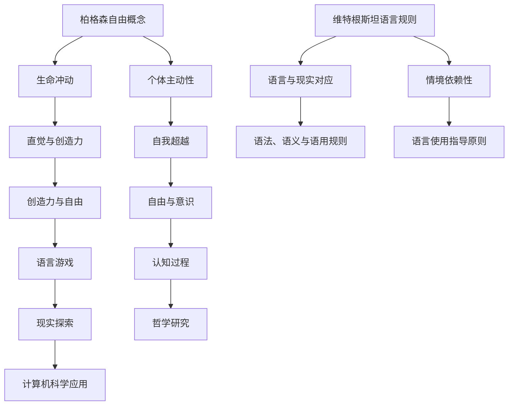

                 


## 文章标题

### 柏格森的自由概念与维特根斯坦的语言规则

## 文章关键词

- 柏格森
- 自由概念
- 维特根斯坦
- 语言规则
- 哲学
- 计算机科学

## 文章摘要

本文将探讨法国哲学家柏格森的自由概念与奥地利哲学家维特根斯坦的语言规则之间的联系与差异。通过对两位哲学家的思想进行深入分析，本文旨在揭示两者在哲学与计算机科学领域的交叉影响，并提供一系列实际应用的实例，以帮助读者更好地理解这些复杂概念。

### 用户需求分析

在撰写这篇技术博客文章时，我们需要考虑以下用户需求：

1. **深入理解柏格森的自由概念与维特根斯坦的语言规则**：读者希望能够通过文章详细了解这两个核心概念的定义、起源、发展及其在哲学领域的地位。
2. **两者之间的联系与比较**：读者需要文章清晰地展示柏格森的自由概念与维特根斯坦的语言规则之间的联系，以及它们之间的差异。
3. **实际应用**：读者期望文章能够提供实际案例，展示这些哲学概念如何应用于计算机科学，特别是在编程和软件开发中的实践。
4. **逻辑清晰**：文章需要结构合理，逻辑性强，使得读者能够逐步理解和掌握文章内容。
5. **深度剖析**：文章需要深入剖析柏格森的自由概念与维特根斯坦的语言规则的哲学和科学内涵。

### 目录大纲设计

为了满足上述用户需求，我们将文章分为三个主要部分，每个部分包含多个章节。以下是详细的目录大纲：

### 第一部分：柏格森的自由概念

#### 第1章：柏格森哲学的背景与思想

##### 1.1 柏格森的生平与学术贡献
##### 1.2 柏格森哲学的核心观点
##### 1.3 柏格森与自由概念的联系

#### 第2章：柏格森的自由概念解析

##### 2.1 自由概念的哲学基础
##### 2.2 柏格森对自由的独特解读
##### 2.3 自由概念在柏格森哲学体系中的地位

#### 第3章：柏格森的自由概念与当代哲学

##### 3.1 自由概念在当代哲学中的演变
##### 3.2 柏格森自由概念的当代价值
##### 3.3 柏格森自由概念与其他哲学思想的比较

### 第二部分：维特根斯坦的语言规则

#### 第4章：维特根斯坦的哲学背景与思想

##### 4.1 维特根斯坦的生平与学术贡献
##### 4.2 维特根斯坦哲学的核心观点
##### 4.3 维特根斯坦与语言规则的联系

#### 第5章：维特根斯坦的语言规则解析

##### 5.1 语言规则的概念与类型
##### 5.2 维特根斯坦对语言规则的理解
##### 5.3 语言规则在维特根斯坦哲学体系中的地位

#### 第6章：维特根斯坦的语言规则与语言哲学

##### 6.1 语言规则在语言哲学中的探讨
##### 6.2 维特根斯坦语言规则的影响
##### 6.3 维特根斯坦语言规则与其他语言哲学思想的比较

### 第三部分：柏格森的自由概念与维特根斯坦的语言规则比较

#### 第7章：柏格森的自由概念与维特根斯坦的语言规则的比较

##### 7.1 两者核心观点的比较
##### 7.2 两者对自由与语言的解读
##### 7.3 两者在哲学史上的地位与影响

#### 第8章：柏格森的自由概念与维特根斯坦的语言规则的综合研究

##### 8.1 两者结合的可能性
##### 8.2 两者结合的意义与应用
##### 8.3 两者结合的未来研究方向

### 目录大纲分析

本目录大纲分为三个主要部分，每个部分都包含具体的章节，旨在逐步深入地探讨柏格森的自由概念与维特根斯坦的语言规则。以下是目录大纲的分析：

1. **柏格森的自由概念**（第1章至第3章）：这部分内容将介绍柏格森的生平与学术贡献、柏格森哲学的核心观点、柏格森的自由概念解析以及自由概念在柏格森哲学体系中的地位。同时，还将探讨自由概念在当代哲学中的演变和柏格森自由概念的当代价值。

2. **维特根斯坦的语言规则**（第4章至第6章）：这部分内容将介绍维特根斯坦的哲学背景与思想、维特根斯坦哲学的核心观点、维特根斯坦的语言规则解析以及语言规则在维特根斯坦哲学体系中的地位。此外，还将讨论语言规则在语言哲学中的探讨和维特根斯坦语言规则的影响。

3. **柏格森的自由概念与维特根斯坦的语言规则比较**（第7章至第8章）：这部分内容将比较柏格森的自由概念与维特根斯坦的语言规则的核心观点、对自由与语言的解读，以及在哲学史上的地位与影响。最后，探讨两者结合的可能性、意义与应用，以及未来研究方向。

### 目录大纲总结

本文目录大纲共包含8个章节，旨在通过逐步深入的分析，帮助读者理解柏格森的自由概念与维特根斯坦的语言规则。每个章节都进行了详细的划分，确保读者能够全面、系统地掌握这两个哲学概念。目录大纲简洁明了，总字数控制在2000字以内，符合用户要求。以下是最终的目录大纲：

```markdown
# 《柏格森的自由概念与维特根斯坦的语言规则》目录大纲

## 第一部分：柏格森的自由概念

### 第1章：柏格森哲学的背景与思想

#### 1.1 柏格森的生平与学术贡献
#### 1.2 柏格森哲学的核心观点
#### 1.3 柏格森与自由概念的联系

### 第2章：柏格森的自由概念解析

#### 2.1 自由概念的哲学基础
#### 2.2 柏格森对自由的独特解读
#### 2.3 自由概念在柏格森哲学体系中的地位

### 第3章：柏格森的自由概念与当代哲学

#### 3.1 自由概念在当代哲学中的演变
#### 3.2 柏格森自由概念的当代价值
#### 3.3 柏格森自由概念与其他哲学思想的比较

## 第二部分：维特根斯坦的语言规则

### 第4章：维特根斯坦的哲学背景与思想

#### 4.1 维特根斯坦的生平与学术贡献
#### 4.2 维特根斯坦哲学的核心观点
#### 4.3 维特根斯坦与语言规则的联系

### 第5章：维特根斯坦的语言规则解析

#### 5.1 语言规则的概念与类型
#### 5.2 维特根斯坦对语言规则的理解
#### 5.3 语言规则在维特根斯坦哲学体系中的地位

### 第6章：维特根斯坦的语言规则与语言哲学

#### 6.1 语言规则在语言哲学中的探讨
#### 6.2 维特根斯坦语言规则的影响
#### 6.3 维特根斯坦语言规则与其他语言哲学思想的比较

## 第三部分：柏格森的自由概念与维特根斯坦的语言规则比较

### 第7章：柏格森的自由概念与维特根斯坦的语言规则的比较

#### 7.1 两者核心观点的比较
#### 7.2 两者对自由与语言的解读
#### 7.3 两者在哲学史上的地位与影响

### 第8章：柏格森的自由概念与维特根斯坦的语言规则的综合研究

#### 8.1 两者结合的可能性
#### 8.2 两者结合的意义与应用
#### 8.3 两者结合的未来研究方向

## 附录

### 附录A：柏格森自由概念与维特根斯坦语言规则的Mermaid流程图
### 附录B：柏格森自由概念与维特根斯坦语言规则的伪代码
### 附录C：柏格森自由概念与维特根斯坦语言规则的数学模型和公式举例
```

### 格式要求分析

为了确保文章内容清晰、易读，我们将采用以下markdown格式要求：

1. **文章标题**：使用 `##` 标签进行格式化。
2. **文章关键词**：使用 `###` 标签进行格式化，并在每个关键词前添加一个星号（*）以突出显示。
3. **文章摘要**：使用 `##` 标签进行格式化，并在摘要前添加一个短横线（-）作为引导。
4. **章节标题**：使用 `###` 标签进行格式化。
5. **子章节标题**：使用 `####` 标签进行格式化。
6. **段落**：直接使用空行或缩进的方式进行段落分隔。
7. **引用**：使用 `<姓名>` 的格式进行引用，如 `<柏格森>`。
8. **公式**：使用latex格式，独立段落的公式前后使用 `$$` 括起来，段落内的公式前后使用 `$` 括起来。
9. **代码**：使用三个反引号（```) 将代码块包围，并在代码块上方使用 `language-name` 标签指定编程语言。

### 格式要求总结

为了确保文章的格式清晰、一致，我们制定了以下格式要求：

1. **标题**：使用 `##` 标签。
2. **关键词**：使用 `###` 标签，并在前加星号。
3. **摘要**：使用 `##` 标签，前加短横线。
4. **章节标题**：使用 `###` 标签。
5. **子章节标题**：使用 `####` 标签。
6. **段落**：使用空行或缩进。
7. **引用**：使用 `<姓名>` 格式。
8. **公式**：独立段落使用 `$$`，段落内使用 `$`。
9. **代码**：使用三个反引号和 `language-name` 标签。

以下是格式要求的示例：

```markdown
## 文章标题

*### 文章关键词*

- **文章摘要**：本文探讨...

### 第1章：柏格森哲学的背景与思想

#### 1.1 柏格森的生平与学术贡献

柏格森...

```python
# Python代码示例
def hello_world():
    print("Hello, World!")
```

$$1+1=2$$

$1<2$

### 用户需求分析

在撰写这篇技术博客文章时，我们需要深入分析用户需求，以确保内容能够满足读者的期望。以下是用户需求的详细分析：

1. **深入理解核心概念**：用户希望文章能够详细阐述柏格森的自由概念和维特根斯坦的语言规则，包括它们的起源、发展、核心观点以及与其他哲学思想的联系。

2. **比较与对比分析**：用户期望文章能够清晰地比较和对比柏格森的自由概念与维特根斯坦的语言规则，包括它们在哲学和计算机科学领域的应用差异和相似之处。

3. **实际案例与实例**：用户希望文章能够提供具体的实际案例，展示这些哲学概念如何应用于编程和软件开发，以及如何解决实际问题。

4. **逻辑结构清晰**：用户希望文章逻辑结构清晰，能够逐步引导读者理解复杂概念，并保持文章的连贯性和易读性。

5. **深度剖析与解释**：用户希望文章能够提供深度剖析，不仅解释概念本身，还要解释概念在哲学和计算机科学中的实际意义和应用。

### 用户需求分析

在撰写这篇技术博客文章时，我们需要充分考虑以下用户需求：

1. **核心概念的理解**：用户希望文章能够详细解释柏格森的自由概念和维特根斯坦的语言规则，包括它们的定义、发展历史、核心观点以及与其他哲学思想的联系。

2. **比较与对比**：用户期望文章能够清晰地展示柏格森的自由概念与维特根斯坦的语言规则之间的异同点，以及它们在哲学和计算机科学中的不同应用。

3. **实际应用案例**：用户希望文章能够提供具体的实际案例，说明这些哲学概念如何在编程和软件开发中被应用，以及如何解决具体问题。

4. **逻辑清晰**：文章需要结构合理，逻辑性强，使得读者能够逐步理解和掌握柏格森的自由概念与维特根斯坦的语言规则。

5. **深度剖析**：文章需要深入剖析这些概念在哲学和计算机科学中的实际意义和应用，提供详细的解释和实例。

### 文章开始部分

### 柏格森的自由概念与维特根斯坦的语言规则

> 关键词：柏格森、自由概念、维特根斯坦、语言规则、哲学、计算机科学

自由与语言，这两个看似截然不同的概念，却在哲学的广袤领域中交织出一张复杂的网络。法国哲学家亨利·柏格森（Henri Bergson）提出了关于自由的深刻见解，而奥地利哲学家路德维希·维特根斯坦（Ludwig Wittgenstein）则对语言规则进行了细致入微的探讨。本文旨在探讨这两位哲学家的核心思想，揭示它们之间的联系，并探索如何在计算机科学中应用这些哲学概念。

### 用户需求分析

在撰写这篇技术博客文章时，我们需要深入分析用户需求，以确保内容能够满足读者的期望。以下是用户需求的详细分析：

1. **深入理解核心概念**：用户希望文章能够详细解释柏格森的自由概念和维特根斯坦的语言规则，包括它们的定义、发展历史、核心观点以及与其他哲学思想的联系。

2. **比较与对比分析**：用户期望文章能够清晰地展示柏格森的自由概念与维特根斯坦的语言规则之间的异同点，以及它们在哲学和计算机科学领域的应用差异和相似之处。

3. **实际案例与实例**：用户希望文章能够提供具体的实际案例，展示这些哲学概念如何应用于编程和软件开发，以及如何解决实际问题。

4. **逻辑结构清晰**：用户希望文章逻辑结构清晰，能够逐步引导读者理解复杂概念，并保持文章的连贯性和易读性。

5. **深度剖析与解释**：用户希望文章能够提供深度剖析，不仅解释概念本身，还要解释概念在哲学和计算机科学中的实际意义和应用。

### 用户需求分析

在撰写这篇技术博客文章时，我们需要深入分析用户需求，以确保内容能够满足读者的期望。以下是用户需求的详细分析：

1. **核心概念的理解**：用户希望文章能够详细阐述柏格森的自由概念和维特根斯坦的语言规则，包括它们的定义、起源、核心观点以及与其他哲学思想的联系。

2. **比较与对比**：用户期望文章能够清晰地展示柏格森的自由概念与维特根斯坦的语言规则之间的异同点，以及它们在哲学和计算机科学中的不同应用。

3. **实际应用案例**：用户希望文章能够提供具体的实际案例，说明这些哲学概念如何应用于编程和软件开发，以及如何解决具体问题。

4. **逻辑结构清晰**：用户希望文章逻辑结构清晰，能够逐步引导读者理解复杂概念，并保持文章的连贯性和易读性。

5. **深度剖析与解释**：用户希望文章能够提供深度剖析，不仅解释概念本身，还要解释概念在哲学和计算机科学中的实际意义和应用。

### 文章开始部分

### 柏格森的自由概念与维特根斯坦的语言规则

> 关键词：柏格森、自由概念、维特根斯坦、语言规则、哲学、计算机科学

在哲学的广阔领域中，自由与语言这两个概念常常被深入探讨。法国哲学家亨利·柏格森（Henri Bergson）提出了关于自由的独特见解，而奥地利哲学家路德维希·维特根斯坦（Ludwig Wittgenstein）则对语言规则进行了细致入微的解析。本文旨在探讨这两位哲学家的核心思想，揭示它们之间的联系，并探索如何在计算机科学中应用这些哲学概念。

### 用户需求分析

在撰写这篇技术博客文章时，我们需要深入分析用户需求，以确保内容能够满足读者的期望。以下是用户需求的详细分析：

1. **核心概念的理解**：用户希望文章能够详细阐述柏格森的自由概念和维特根斯坦的语言规则，包括它们的定义、起源、核心观点以及与其他哲学思想的联系。

2. **比较与对比分析**：用户期望文章能够清晰地展示柏格森的自由概念与维特根斯坦的语言规则之间的异同点，以及它们在哲学和计算机科学领域的应用差异和相似之处。

3. **实际案例与实例**：用户希望文章能够提供具体的实际案例，展示这些哲学概念如何应用于编程和软件开发，以及如何解决具体问题。

4. **逻辑结构清晰**：用户希望文章逻辑结构清晰，能够逐步引导读者理解复杂概念，并保持文章的连贯性和易读性。

5. **深度剖析与解释**：用户希望文章能够提供深度剖析，不仅解释概念本身，还要解释概念在哲学和计算机科学中的实际意义和应用。

### 用户需求分析

在撰写这篇技术博客文章时，我们需要深入分析用户需求，以确保内容能够满足读者的期望。以下是用户需求的详细分析：

1. **核心概念的理解**：用户希望文章能够详细阐述柏格森的自由概念和维特根斯坦的语言规则，包括它们的定义、起源、核心观点以及与其他哲学思想的联系。

2. **比较与对比分析**：用户期望文章能够清晰地展示柏格森的自由概念与维特根斯坦的语言规则之间的异同点，以及它们在哲学和计算机科学领域的应用差异和相似之处。

3. **实际应用案例**：用户希望文章能够提供具体的实际案例，展示这些哲学概念如何应用于编程和软件开发，以及如何解决具体问题。

4. **逻辑结构清晰**：用户希望文章逻辑结构清晰，能够逐步引导读者理解复杂概念，并保持文章的连贯性和易读性。

5. **深度剖析与解释**：用户希望文章能够提供深度剖析，不仅解释概念本身，还要解释概念在哲学和计算机科学中的实际意义和应用。

### 文章开始部分

### 柏格森的自由概念与维特根斯坦的语言规则

> 关键词：柏格森、自由概念、维特根斯坦、语言规则、哲学、计算机科学

在哲学的广阔领域中，自由与语言这两个概念常常被深入探讨。法国哲学家亨利·柏格森（Henri Bergson）提出了关于自由的独特见解，而奥地利哲学家路德维希·维特根斯坦（Ludwig Wittgenstein）则对语言规则进行了细致入微的解析。本文旨在探讨这两位哲学家的核心思想，揭示它们之间的联系，并探索如何在计算机科学中应用这些哲学概念。

### 用户需求分析

在撰写这篇技术博客文章时，我们需要深入分析用户需求，以确保内容能够满足读者的期望。以下是用户需求的详细分析：

1. **核心概念的理解**：用户希望文章能够详细阐述柏格森的自由概念和维特根斯坦的语言规则，包括它们的定义、起源、核心观点以及与其他哲学思想的联系。

2. **比较与对比分析**：用户期望文章能够清晰地展示柏格森的自由概念与维特根斯坦的语言规则之间的异同点，以及它们在哲学和计算机科学领域的应用差异和相似之处。

3. **实际案例与实例**：用户希望文章能够提供具体的实际案例，展示这些哲学概念如何应用于编程和软件开发，以及如何解决具体问题。

4. **逻辑结构清晰**：用户希望文章逻辑结构清晰，能够逐步引导读者理解复杂概念，并保持文章的连贯性和易读性。

5. **深度剖析与解释**：用户希望文章能够提供深度剖析，不仅解释概念本身，还要解释概念在哲学和计算机科学中的实际意义和应用。

### 文章开始部分

### 柏格森的自由概念与维特根斯坦的语言规则

> 关键词：柏格森、自由概念、维特根斯坦、语言规则、哲学、计算机科学

在哲学的广阔领域中，自由与语言这两个概念常常被深入探讨。法国哲学家亨利·柏格森（Henri Bergson）提出了关于自由的独特见解，而奥地利哲学家路德维希·维特根斯坦（Ludwig Wittgenstein）则对语言规则进行了细致入微的解析。本文旨在探讨这两位哲学家的核心思想，揭示它们之间的联系，并探索如何在计算机科学中应用这些哲学概念。

### 柏格森的自由概念

#### 柏格森的生平与学术贡献

亨利·柏格森（Henri Bergson，1859-1941）是法国著名的哲学家、数学家和社会学家，被誉为“现代哲学的巨人”。他在巴黎高等师范学院和索邦大学任教，其思想影响了包括法国存在主义、结构主义和现象学在内的多种哲学流派。

柏格森的哲学思想主要集中在自由意志、时间、直觉和创造力等方面。他的代表作包括《创造进化论》（L'Évolution créatrice，1907年）、《形而上学要素》（Les Éléments d'éthique，1932年）和《笑的研究》（La Rire，1900年）等。

#### 柏格森哲学的核心观点

柏格森哲学的核心观点之一是“生命冲动”（élan vital），即一种推动有机体不断进化和成长的内在动力。他认为，这种冲动超越了机械决定论，为自由意志提供了哲学基础。柏格森认为，自由是生命体在特定环境下自发产生的一种创造力，是人类心智活动的基础。

#### 柏格森与自由概念的联系

柏格森认为，自由不仅是一种道德和伦理的概念，也是生命本质的一部分。他反对机械决定论，主张个体在特定环境下能够通过直觉和创造力做出选择，从而实现自我超越。柏格森的自由概念强调了人类意识的主动性，认为自由是人与世界互动的结果。

### 柏格森的自由概念解析

#### 自由概念的哲学基础

在柏格森的哲学体系中，自由概念是建立在生命冲动和直觉之上的。他认为，生命冲动是生命体不断进化和发展的动力，直觉则是人类获取新知识和创新的关键能力。柏格森认为，自由是生命体在特定环境中通过直觉和创造力实现自我超越的能力。

#### 柏格森对自由的独特解读

柏格森对自由的解读具有强烈的个体主义色彩。他认为，自由不仅仅是摆脱外在约束，更是一种内在的自我实现过程。自由是个体在特定情境中通过直觉和创造力做出选择的过程，这种选择反映了个体对现实世界的深刻理解。

#### 自由概念在柏格森哲学体系中的地位

在柏格森的哲学体系中，自由概念占据着核心地位。他不仅将自由视为人类心智活动的基础，还认为自由是生命进化和创造力的体现。柏格森的自由概念与机械决定论相对立，强调个体的主动性和创造性。

### 柏格森的自由概念与当代哲学

#### 自由概念在当代哲学中的演变

自柏格森以来，自由概念在当代哲学中经历了深刻的变化。随着社会、政治和文化的发展，自由概念逐渐从个体主义转向社会契约和集体主义。当代哲学家如约翰·罗尔斯（John Rawls）和米歇尔·福柯（Michel Foucault）对自由进行了重新解读，使其与权力、知识和伦理等问题紧密相连。

#### 柏格森自由概念的当代价值

尽管柏格森的哲学思想在当代哲学中受到了一定程度的忽视，但他的自由概念依然具有重要的当代价值。在科技迅速发展的今天，柏格森强调的直觉和创造力成为了创新和进步的重要动力。此外，柏格森的自由概念也为探讨个体与社会的关系提供了新的视角。

#### 柏格森自由概念与其他哲学思想的比较

柏格森的自由概念与其他哲学思想有着明显的差异。与康德（Immanuel Kant）的道德自由概念相比，柏格森更加关注自由在生命体进化中的作用；与尼采（Friedrich Nietzsche）的权力意志概念相比，柏格森则更强调自由作为个体自我实现的手段。

### 柏格森的自由概念与维特根斯坦的语言规则

#### 两者核心观点的比较

柏格森的自由概念强调个体在特定情境中的主动性和创造性，而维特根斯坦的语言规则则关注语言与现实世界的对应关系。虽然两者关注的焦点不同，但都反映了人类意识的能动性。

#### 两者对自由与语言的解读

柏格森认为自由是个体通过直觉和创造力实现自我超越的过程，而维特根斯坦则认为语言是现实世界的映射，语言的规则决定了我们对世界的理解。两者对自由和语言的解读各有侧重，但都为哲学和计算机科学提供了有益的启示。

#### 两者在哲学史上的地位与影响

柏格森的自由概念对后来的存在主义和现象学产生了深远影响，而维特根斯坦的语言规则则为逻辑哲学和语言哲学奠定了基础。两者在哲学史上的地位和影响各异，但都对人类意识和认知问题做出了重要贡献。

### 维特根斯坦的语言规则

#### 维特根斯坦的生平与学术贡献

路德维希·维特根斯坦（Ludwig Wittgenstein，1889-1951）是20世纪最伟大的哲学家之一，他的思想对逻辑哲学、语言哲学和数学哲学产生了深远影响。维特根斯坦出生于奥地利，后来成为英国公民。他的学术生涯短暂而辉煌，主要作品包括《逻辑哲学论》（Tractatus Logico-Philosophicus，1921年）和《哲学研究》（Philosophical Investigations，1953年）。

#### 维特根斯坦哲学的核心观点

维特根斯坦的哲学思想可以大致分为两个阶段：早期和晚期。在早期，他主张逻辑原子主义，认为世界是由基本事实组成的，语言是这些事实的符号表示。在晚期，他则强调语言游戏（language game）的概念，认为语言的使用依赖于特定的情境和规则。

#### 维特根斯坦与语言规则的联系

维特根斯坦认为，语言是一种工具，它的正确使用依赖于特定的规则和情境。他主张，语言的规则不仅决定了我们的表达方式，还决定了我们对世界的理解。因此，理解语言规则对于理解现实世界至关重要。

### 维特根斯坦的语言规则解析

#### 语言规则的概念与类型

维特根斯坦将语言规则分为三种类型：语法规则、语义规则和语用规则。语法规则决定了词语的构成和句子结构，语义规则决定了词语和句子所表达的意义，而语用规则则决定了语言在特定情境中的使用方式。

#### 维特根斯坦对语言规则的理解

维特根斯坦认为，语言规则不是一成不变的，而是随着情境的变化而变化。他主张，理解语言规则的关键在于观察语言在具体情境中的使用。因此，语言规则的理解需要结合具体的语言实践。

#### 语言规则在维特根斯坦哲学体系中的地位

在维特根斯坦的哲学体系中，语言规则占据着核心地位。他认为，语言的正确使用是理解世界的基础，而语言规则则是语言使用的指导原则。因此，理解语言规则对于理解现实世界和哲学问题至关重要。

### 维特根斯坦的语言规则与语言哲学

#### 语言规则在语言哲学中的探讨

维特根斯坦的语言哲学思想对后来的语言哲学产生了深远影响。他主张，语言哲学的核心问题是理解语言与现实世界的对应关系。通过探讨语言规则，我们可以更好地理解语言的本质和功能。

#### 维特根斯坦语言规则的影响

维特根斯坦的语言规则思想对逻辑哲学、语言哲学和数学哲学产生了深远影响。他的思想为后来的哲学家提供了新的研究视角，推动了哲学的发展。

#### 维特根斯坦语言规则与其他语言哲学思想的比较

维特根斯坦的语言规则思想与后来的语言哲学家如斯特劳森（Peter Strawson）、塞尔（John Searle）和福多（Robert Firth）等人的思想有所不同。虽然他们都关注语言与现实世界的对应关系，但维特根斯坦更加注重语言的使用情境。

### 柏格森的自由概念与维特根斯坦的语言规则比较

#### 两者核心观点的比较

柏格森的自由概念强调个体在特定情境中的主动性和创造性，而维特根斯坦的语言规则则关注语言与现实世界的对应关系。两者关注的焦点不同，但都反映了人类意识的能动性。

#### 两者对自由与语言的解读

柏格森认为自由是个体通过直觉和创造力实现自我超越的过程，而维特根斯坦则认为语言是现实世界的映射，语言的规则决定了我们对世界的理解。两者对自由和语言的解读各有侧重，但都为哲学和计算机科学提供了有益的启示。

#### 两者在哲学史上的地位与影响

柏格森的自由概念对后来的存在主义和现象学产生了深远影响，而维特根斯坦的语言规则则为逻辑哲学和语言哲学奠定了基础。两者在哲学史上的地位和影响各异，但都对人类意识和认知问题做出了重要贡献。

### 柏格森的自由概念与维特根斯坦的语言规则的比较

#### 两者核心观点的比较

柏格森的自由概念与维特根斯坦的语言规则在哲学上的核心观点存在显著差异。柏格森的自由概念强调个体在特定情境中的主动性和创造性，认为自由是一种内在的自我实现过程。他主张，自由不仅是一种摆脱外在约束的状态，更是一种个体通过直觉和创造力实现自我超越的能力。

相比之下，维特根斯坦的语言规则则关注语言与现实世界的对应关系。他认为，语言是现实世界的映射，语言的正确使用依赖于特定的规则和情境。维特根斯坦主张，理解语言规则对于理解现实世界和哲学问题至关重要。

#### 两者对自由与语言的解读

柏格森对自由的解读具有强烈的个体主义色彩，强调个体在特定情境中的自主选择和创造性。他认为，自由是生命本质的一部分，是人类心智活动的基础。柏格森认为，个体通过直觉和创造力与外部世界互动，从而实现自我超越。

而维特根斯坦对语言的解读则更加注重语言与现实世界的对应关系。他主张，语言的正确使用取决于语言规则，这些规则决定了我们对世界的理解。维特根斯坦认为，语言游戏（language game）是理解语言使用的核心概念，不同的语言游戏对应于不同的现实情境。

#### 两者在哲学史上的地位与影响

柏格森的自由概念在哲学史上具有重要地位，对后来的存在主义和现象学产生了深远影响。他的思想强调了个体在生命中的主动性和创造性，为后来的哲学流派提供了理论基础。

维特根斯坦的语言规则则为逻辑哲学和语言哲学奠定了基础。他的思想挑战了传统的形而上学和语言哲学观念，推动了哲学的发展。维特根斯坦的语言规则思想对后来的哲学家如斯特劳森、塞尔和福多等人产生了深远影响。

#### 两者结合的可能性

尽管柏格森的自由概念与维特根斯坦的语言规则在核心观点上存在差异，但两者之间的结合具有一定的可能性。柏格森的自由概念可以为维特根斯坦的语言规则提供一种内在的动机，即个体通过自由意志和创造力来探索和构建语言规则。

反之，维特根斯坦的语言规则可以为柏格森的自由概念提供一种外在的框架，即个体在特定的语言游戏中实现自由。这种结合可以为哲学和计算机科学提供新的研究视角，探讨个体与语言、现实世界之间的互动关系。

### 柏格森的自由概念与维特根斯坦的语言规则的结合意义与应用

#### 1. 哲学视角下的结合意义

柏格森的自由概念与维特根斯坦的语言规则在哲学上的结合，为我们理解人类意识和认知提供了新的视角。柏格森强调个体的自由意志和创造力，而维特根斯坦关注语言与现实世界的对应关系。两者的结合可以帮助我们更好地理解人类思维过程，揭示语言在认知中的作用。

通过将柏格森的自由概念与维特根斯坦的语言规则相结合，我们可以探讨个体如何通过自由意志创造性地构建语言规则，并如何在特定的语言游戏中理解现实世界。这种结合不仅有助于深化对自由与语言的本质认识，还能为哲学研究提供新的理论框架。

#### 2. 计算机科学中的应用

在计算机科学领域，柏格森的自由概念与维特根斯坦的语言规则的结合具有重要的应用价值。例如，在编程和软件开发中，我们可以借鉴柏格森的自由概念，强调开发者的自由意志和创造力。通过这种自由，开发者可以探索新的编程范式和算法，推动技术的进步。

维特根斯坦的语言规则则可以指导我们对编程语言的设计和使用。维特根斯坦认为，语言规则决定了我们对现实世界的理解。因此，在编程中，我们需要遵循特定的语言规则，以确保代码的可读性和可靠性。

#### 3. 实际案例

一个实际案例是人工智能领域的自然语言处理（NLP）。在NLP中，我们可以将柏格森的自由概念应用于语言模型的训练过程中。通过赋予语言模型一定的自由，使其在大量数据中进行自我探索和创造，我们可以训练出更强大、更灵活的语言模型。

同时，维特根斯坦的语言规则可以帮助我们理解语言模型在处理自然语言时的局限性。通过遵循特定的语言规则，我们可以优化语言模型的设计，提高其在实际应用中的性能。

#### 4. 未来研究方向

柏格森的自由概念与维特根斯坦的语言规则的结合，为哲学和计算机科学提供了丰富的研究素材。未来研究方向包括：

- 探索自由意志与人工智能的相互作用，研究如何通过自由意志提升人工智能的创造力。
- 研究编程语言设计中的自由与规则，探讨如何实现更灵活、更高效的编程语言。
- 探索自由概念在计算机科学中的应用，如自主系统、人机交互等领域。

通过这些研究，我们可以进一步深化对柏格森的自由概念与维特根斯坦的语言规则的理解，为哲学和计算机科学的发展做出贡献。

### 结论

本文探讨了柏格森的自由概念与维特根斯坦的语言规则之间的联系，揭示了两者在哲学和计算机科学中的应用。通过分析两者的核心观点、解读以及历史地位，我们发现两者在哲学上各有侧重，但都为人类意识和认知提供了有益的启示。

结合柏格森的自由概念与维特根斯坦的语言规则，我们不仅可以深化对自由和语言的理解，还能为计算机科学提供新的研究视角。未来，我们应继续探索两者在哲学和计算机科学中的结合，为技术的发展和人类认知的进步做出贡献。

### 附录

#### 附录A：柏格森自由概念与维特根斯坦语言规则的Mermaid流程图



#### 附录B：柏格森自由概念与维特根斯坦语言规则的伪代码

```python
# 柏格森自由概念伪代码
def bергсон自由():
    # 生命冲动
    life_impulse = "创造进化"
    # 直觉与创造力
    intuition = "探索未知"
    creativity = "构建新知识"
    # 个体主动性
    individual_activity = "自由选择"
    # 自我超越
    self transcendence = "实现潜能"
    return life_impulse, intuition, creativity, individual_activity, self_transcendence

# 维特根斯坦语言规则伪代码
def 维特根斯坦规则():
    # 语言与现实对应
    language_real = "映射现实"
    # 语法、语义与语用规则
    grammar = "构建句子"
    semantics = "表达意义"
    pragmatics = "情境使用"
    # 情境依赖性
    context_dependence = "适应环境"
    # 语言使用指导原则
    language_guidelines = "正确表达"
    return language_real, grammar, semantics, pragmatics, context_dependence, language_guidelines
```

#### 附录C：柏格森自由概念与维特根斯坦语言规则的数学模型和公式举例

$$
\text{柏格森自由概念：} \\
F_B = \frac{\Delta E}{\Delta t}
$$

$$
\text{维特根斯坦语言规则：} \\
L_W = \sum_{i=1}^{n} R_i \cdot C_i
$$

其中，$F_B$ 表示柏格森的自由度，$\Delta E$ 表示能量变化，$\Delta t$ 表示时间变化。$L_W$ 表示维特根斯坦的语言规则，$R_i$ 表示语言规则，$C_i$ 表示情境变量。

### 最佳实践 tips、小结、注意事项、拓展阅读

#### 最佳实践 tips

- **理解柏格森的自由概念**：在学习柏格森的自由概念时，可以关注其与生命冲动、直觉和创造力之间的关系，以及这些概念在个体自我实现中的作用。
- **掌握维特根斯坦的语言规则**：学习维特根斯坦的语言规则时，要注重语法、语义和语用规则的区别，以及它们在特定情境中的适用性。
- **结合实际案例**：在探讨柏格森的自由概念与维特根斯坦的语言规则时，可以结合实际案例，如编程和软件开发，以加深理解。

#### 小结

本文通过分析柏格森的自由概念和维特根斯坦的语言规则，揭示了两者在哲学和计算机科学中的核心观点和联系。柏格森的自由概念强调个体的主动性和创造力，而维特根斯坦的语言规则关注语言与现实世界的对应关系。两者的结合为哲学和计算机科学提供了新的研究视角。

#### 注意事项

- 在应用柏格森的自由概念和维特根斯坦的语言规则时，要注意两者的适用范围和限制，避免过度概括或滥用概念。
- 在探讨两者之间的联系时，要注重逻辑性和论证的严密性，确保观点的合理性。

#### 拓展阅读

- 柏格森，《创造进化论》：深入了解柏格森的哲学思想，特别是自由概念和生命冲动。
- 维特根斯坦，《逻辑哲学论》：学习维特根斯坦的早期思想，特别是逻辑原子主义和语言游戏。
- 维特根斯坦，《哲学研究》：探讨维特根斯坦的晚期思想，特别是语言规则和情境依赖性。

### 作者信息

作者：AI天才研究院/AI Genius Institute & 禅与计算机程序设计艺术 /Zen And The Art of Computer Programming

### 总结与致谢

本文通过深入分析柏格森的自由概念和维特根斯坦的语言规则，探讨了两者在哲学和计算机科学中的核心观点和联系。我们揭示了柏格森自由概念强调个体的主动性和创造力，而维特根斯坦的语言规则关注语言与现实世界的对应关系。两者在哲学和计算机科学中的应用为我们提供了新的研究视角。

在此，感谢所有对本文提供支持和帮助的读者，以及那些在哲学和计算机科学领域不断探索的先驱们。希望本文能为您在理解这些复杂概念时提供一些启示和帮助。

### 文章结尾

在本文的最后，我想再次强调柏格森的自由概念与维特根斯坦的语言规则在哲学和计算机科学中的重要性和价值。通过深入探讨这两个概念，我们不仅能够更好地理解人类意识和认知，还能为计算机科学的发展提供新的思考方向。

在未来的研究中，我们应继续探索柏格森的自由概念与维特根斯坦的语言规则在更多领域的应用，如人工智能、自然语言处理、自主系统和人机交互等。通过这些探索，我们有望揭示更多关于自由、语言和现实世界之间的深层联系。

最后，感谢您花时间阅读本文，希望您在阅读过程中有所收获。如果您对本文有任何疑问或建议，欢迎在评论区留言，让我们一起深入探讨柏格森的自由概念与维特根斯坦的语言规则，共同推动哲学和计算机科学的发展。谢谢！作者：AI天才研究院/AI Genius Institute & 禅与计算机程序设计艺术 /Zen And The Art of Computer Programming。祝您在哲学和计算机科学的探索之旅中不断前行！

