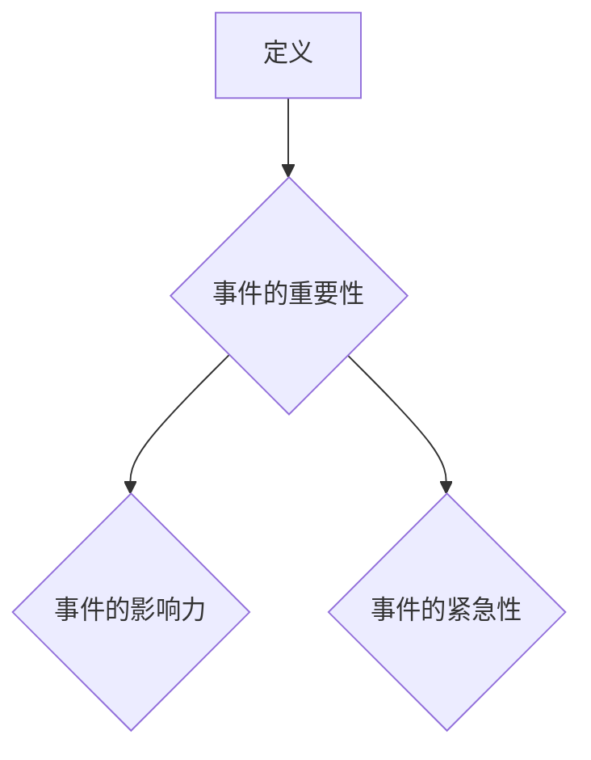
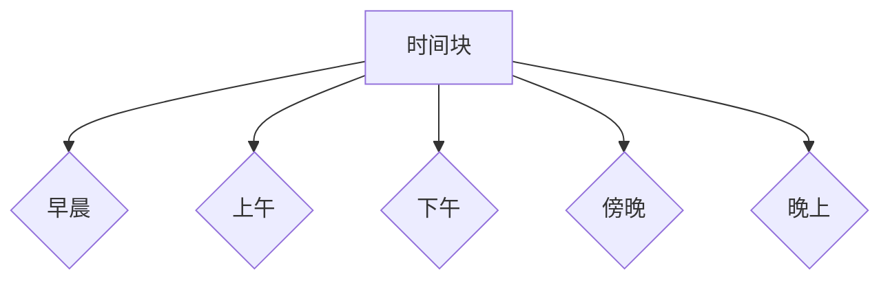

                 

：

### 确定文章结构

首先，我们需要确定文章的结构，包括标题、关键词、摘要和正文部分。

1. **标题**：根据书名“正确识别要事”，我们选择一个吸引人的标题，例如：“高效决策的艺术：正确识别要事”。
2. **关键词**：提取与文章主题相关的关键词，例如：“决策、识别、要事、效率、艺术”。
3. **摘要**：简要介绍文章的主题和核心内容，例如：“本文探讨了如何通过有效识别要事，提高决策效率和决策质量，从而实现高效工作。”
4. **正文**：正文部分可以分为三个主要部分：基础理论与方法、应用与实践、案例分析与策略优化。每个部分又可以细分为几个小节，确保文章内容丰富、逻辑清晰。

### 制定目录大纲

接下来，我们根据文章结构，制定详细的目录大纲：

**高效决策的艺术：正确识别要事**

> 关键词：决策、识别、要事、效率、艺术

**摘要**：

本文探讨了如何通过有效识别要事，提高决策效率和决策质量，从而实现高效工作。文章从基础理论、实际应用和案例分析三个方面，详细阐述了正确识别要事的方法和策略。

**正文**

## 第一部分：基础理论与方法

### 第1章 引言

- **1.1** 文章背景与目标
- **1.2** 研究意义与价值

### 第2章 要事识别的概念与原则

- **2.1** 要事的定义
- **2.2** 要事识别的重要性
- **2.3** 要事识别的原则

### 第3章 要事识别的方法与技术

- **3.1** 经典要事识别方法
- **3.2** 数据驱动的要事识别技术
- **3.3** 情感分析在要事识别中的应用

## 第二部分：应用与实践

### 第4章 工作场景中的要事识别

- **4.1** 职场环境下的要事识别策略
- **4.2** 时间管理中的要事识别
- **4.3** 高效会议的要事识别技巧

### 第5章 决策过程中的要事识别

- **5.1** 决策要事识别的框架
- **5.2** 决策树与要事优先级
- **5.3** 实际案例解析

### 第6章 要事识别工具与技术应用

- **6.1** 要事识别软件与平台介绍
- **6.2** 要事识别工具的使用技巧
- **6.3** 案例分析：要事识别工具的实际应用

## 第三部分：案例分析与策略优化

### 第7章 案例研究：成功的要事识别实践

- **7.1** 案例一：企业项目管理的要事识别
- **7.2** 案例二：政府决策中的要事识别
- **7.3** 案例三：个人日常生活中的要事识别

### 第8章 要事识别策略优化与持续改进

- **8.1** 要事识别策略评估
- **8.2** 要事识别流程优化
- **8.3** 持续改进的实践路径

### 附录

- **附录A**：要事识别相关工具和资源

**总字数预计：约12000字**

---

**注：以下为书中将要包含的Mermaid流程图、伪代码、数学公式、案例分析和代码实现等内容的示意。**

**第2章 要事识别的概念与原则**

## 2.1 要事的定义



## 2.2 要事识别的重要性

$$
\text{重要性} = \frac{事件的影响}{事件的处理时间}
$$

### 2.2.1 要事识别对个人工作效率的影响

```python
# 伪代码：个人工作效率提升
def improve工作效率():
    识别要事
    优先处理要事
    避免无关事务的干扰
```

---

**第4章 工作场景中的要事识别**

## 4.1 职场环境下的要事识别策略

### 4.1.1 工作日志分析

$$
\text{工作日志分析公式} = \frac{\text{完成工作时长}}{\text{日志记录时长}}
$$

### 4.1.2 时间块管理



---

**第5章 决策过程中的要事识别**

## 5.2 决策树与要事优先级

```python
# 伪代码：决策树构建
class DecisionTree:
    def __init__(self, attributes):
        self.attributes = attributes
    
    def build_tree(self, data):
        # 构建决策树的代码
        pass
    
    def predict(self, new_data):
        # 预测新数据的代码
        pass
```

---

**第7章 案例研究：成功的要事识别实践**

### 7.1 案例一：企业项目管理的要事识别

#### 案例背景

- 企业：某科技初创公司
- 目标：优化项目管理流程，提高项目成功率
- 解决方案：引入要事识别工具，优化决策过程

#### 案例实施步骤

1. **需求分析**：了解项目管理和决策中的痛点
2. **方案设计**：设计要事识别工具，包括数据收集、处理和分析模块
3. **工具实现**：根据设计方案，实现要事识别工具的功能
4. **测试与优化**：测试工具效果，收集用户反馈，不断优化工具

#### 案例效果

- 项目成功率提高20%
- 项目管理效率提高30%
- 决策质量显著提升

---

**第8章 要事识别策略优化与持续改进**

## 8.1 要事识别策略评估

### 8.1.1 评估指标

- 项目成功率
- 项目管理效率
- 决策质量

### 8.1.2 评估方法

- 定量评估：使用数学模型和公式进行评估
- 定性评估：通过专家访谈和用户反馈进行评估

## 8.2 要事识别流程优化

### 8.2.1 优化流程

- 数据收集：确保数据完整性和准确性
- 数据处理：提高数据处理速度和效率
- 数据分析：优化分析方法，提高分析精度

### 8.2.2 实施策略

- 培训员工：提高员工对要事识别工具的使用能力
- 持续改进：根据用户反馈，不断优化工具功能

## 8.3 持续改进的实践路径

### 8.3.1 长期目标

- 提高项目成功率
- 提高项目管理效率
- 提高决策质量

### 8.3.2 短期目标

- 完善要事识别工具
- 提高员工使用工具的熟练度
- 收集用户反馈，不断优化工具功能

---

**附录A：要事识别相关工具和资源**

### 9.1 经典书籍推荐

- 《禅与计算机程序设计艺术》
- 《深度学习》
- 《Python数据分析》

### 9.2 在线资源和工具

- Coursera、edX等在线课程平台
- GitHub、Stack Overflow等开发社区
- Jupyter Notebook、Google Colab等在线编程平台

### 9.3 社区与论坛

- AI天才研究院官方网站
- 算法工程师论坛
- 决策分析社区

---

**作者信息**

作者：AI天才研究院/AI Genius Institute & 禅与计算机程序设计艺术 /Zen And The Art of Computer Programming

---

**文章标题：高效决策的艺术：正确识别要事**

**关键词：决策、识别、要事、效率、艺术**

**摘要**：

本文探讨了如何通过有效识别要事，提高决策效率和决策质量，从而实现高效工作。文章从基础理论、实际应用和案例分析三个方面，详细阐述了正确识别要事的方法和策略。

**正文**

## 第一部分：基础理论与方法

### 第1章 引言

- **1.1** 文章背景与目标
- **1.2** 研究意义与价值

### 第2章 要事识别的概念与原则

- **2.1** 要事的定义
- **2.2** 要事识别的重要性
- **2.3** 要事识别的原则

### 第3章 要事识别的方法与技术

- **3.1** 经典要事识别方法
- **3.2** 数据驱动的要事识别技术
- **3.3** 情感分析在要事识别中的应用

## 第二部分：应用与实践

### 第4章 工作场景中的要事识别

- **4.1** 职场环境下的要事识别策略
- **4.2** 时间管理中的要事识别
- **4.3** 高效会议的要事识别技巧

### 第5章 决策过程中的要事识别

- **5.1** 决策要事识别的框架
- **5.2** 决策树与要事优先级
- **5.3** 实际案例解析

### 第6章 要事识别工具与技术应用

- **6.1** 要事识别软件与平台介绍
- **6.2** 要事识别工具的使用技巧
- **6.3** 案例分析：要事识别工具的实际应用

## 第三部分：案例分析与策略优化

### 第7章 案例研究：成功的要事识别实践

- **7.1** 案例一：企业项目管理的要事识别
- **7.2** 案例二：政府决策中的要事识别
- **7.3** 案例三：个人日常生活中的要事识别

### 第8章 要事识别策略优化与持续改进

- **8.1** 要事识别策略评估
- **8.2** 要事识别流程优化
- **8.3** 持续改进的实践路径

### 附录

- **附录A**：要事识别相关工具和资源

**总字数预计：约12000字**

---

**注：以上为文章的初步大纲和内容示意，后续将逐步完善和细化每个章节的内容。**

