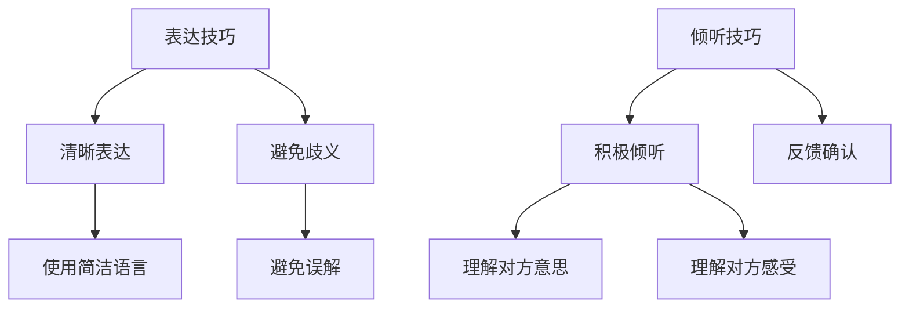
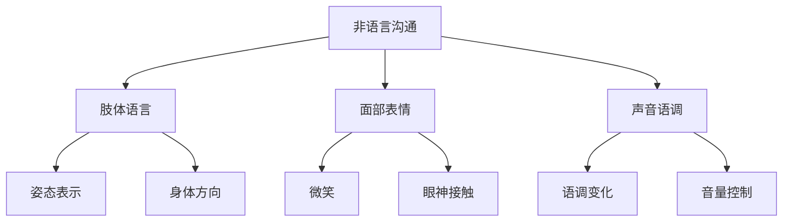
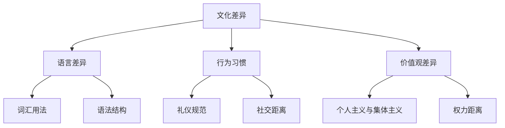
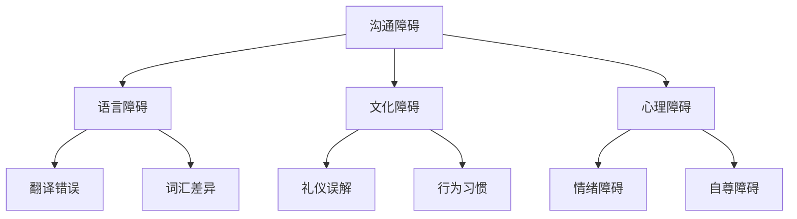
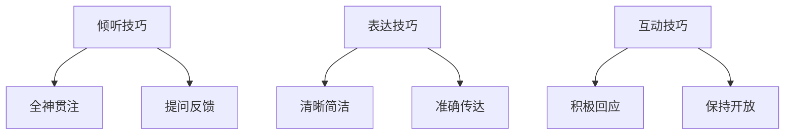
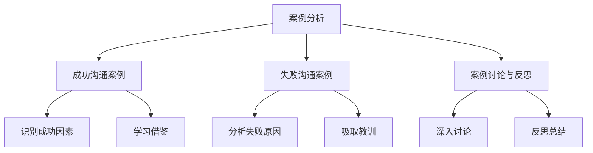
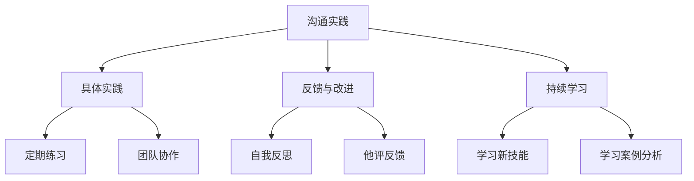

                 

### 文章标题

# 《沟通的功夫在诗外》

### 文章关键词

- 沟通技巧
- 非语言沟通
- 跨文化沟通
- 情感表达
- 有效沟通
- 沟通障碍

### 文章摘要

本文深入探讨了沟通的本质和艺术，从语言与非语言沟通、文化差异、情感表达等多个维度，解析了沟通的核心概念及其相互关系。通过具体的案例分析、算法原理讲解、实战项目剖析，以及最佳实践 tips，本文旨在帮助读者提升沟通能力，实现更为高效和和谐的交流。

### 目录

## 1. 引言

## 2. 语言沟通的重要性

## 3. 非语言沟通的艺术

## 4. 文化差异与情感表达

## 5. 沟通障碍与解决策略

## 6. 有效沟通技巧

## 7. 案例分析

## 8. 沟通实践与提升

## 9. 结论

### 1. 引言

沟通是人类社会发展的基石，无论是个人成长、职业发展还是社会交往，沟通都扮演着至关重要的角色。然而，沟通并非简单的信息传递，它涉及到语言、非语言、文化、情感等多个层面。本文旨在通过详细的分析和讲解，帮助读者深入了解沟通的本质，提升沟通能力。

### 2. 语言沟通的重要性

语言沟通是沟通的基础，它是人们日常交流中最常用的方式。有效的语言沟通能够清晰传达信息，避免误解，促进理解和合作。

**核心概念与联系**

$$
\text{有效沟通} = \text{清晰表达} + \text{准确理解}
$$

**核心算法原理**

- **表达技巧**：
  - 清晰表达：使用简洁、明确的语言。
  - 避免歧义：避免使用可能引起误解的词汇和句式。

- **倾听技巧**：
  - 积极倾听：不仅要听对方说什么，还要理解对方的意思和感受。
  - 反馈确认：通过提问和复述来确认自己的理解是否准确。

**Mermaid 流程图**

**数学模型和公式**

$$
\text{沟通效果} = \text{表达清晰度} \times \text{理解准确性}
$$

**详细讲解与举例**

- **案例**：在一次团队会议上，项目经理李明需要向团队成员阐述项目进度和下一步计划。他使用了简洁、明确的语言，避免了复杂的术语和模糊的表述，确保了信息的清晰传达。在会议结束后，团队成员对项目进度有了明确的理解，并提出了一些建设性的反馈。

### 3. 非语言沟通的艺术

非语言沟通包括肢体语言、面部表情、声音语调等，它在沟通中发挥着重要作用，有时甚至比语言本身更能传达情感和意图。

**核心概念与联系**

$$
\text{非语言沟通} = \text{肢体语言} + \text{面部表情} + \text{声音语调}
$$

**核心算法原理**

- **肢体语言**：
  - 肢体动作：开放性的姿态表示友好和开放。
  - 身体方向：面对对方表示关注和尊重。

- **面部表情**：
  - 微笑：表示友好和积极的态度。
  - 眼神接触：表示真诚和信任。

- **声音语调**：
  - 语调变化：通过语调的高低、快慢来表达情感。
  - 音量控制：适当的音量表示自信和尊重。

**Mermaid 流程图**

**数学模型和公式**

$$
\text{非语言沟通效果} = \text{肢体语言} + \text{面部表情} + \text{声音语调}
$$

**详细讲解与举例**

- **案例**：在一次面试中，求职者王强虽然语言表达清晰，但他的肢体语言显得紧张，面部表情缺乏微笑，声音语调平淡。这使得面试官对他的自信和专业能力产生了怀疑。相反，如果王强能更自然地运用肢体语言、面部表情和声音语调，他的面试表现可能会更好。

### 4. 文化差异与情感表达

文化差异会影响人们的沟通方式和情感表达。了解不同文化背景下的沟通习惯和情感表达方式，是进行有效跨文化沟通的关键。

**核心概念与联系**

$$
\text{文化差异} = \text{语言差异} + \text{行为习惯} + \text{价值观差异}
$$

**核心算法原理**

- **语言差异**：
  - 词汇用法：不同文化对同一词汇的理解可能不同。
  - 语法结构：不同文化可能有不同的语法规则。

- **行为习惯**：
  - 礼仪规范：不同文化有不同的礼仪和礼节。
  - 社交距离：不同文化对个人空间有不同的需求。

- **价值观差异**：
  - 个人主义与集体主义：不同文化对个人和集体的重视程度不同。
  - 权力距离：不同文化对权力和等级关系的处理方式不同。

**Mermaid 流�程图**

**数学模型和公式**

$$
\text{跨文化沟通效果} = \text{语言理解} + \text{行为适应} + \text{价值观融合}
$$

**详细讲解与举例**

- **案例**：在一次跨国团队项目中，团队成员来自不同的国家。由于文化差异，他们在语言表达和行为习惯上存在一些误解。比如，一个美国成员认为直接表达意见是正常的，而一个日本成员则认为这样显得不够礼貌。通过团队成员的相互理解和调整，最终项目得以顺利推进。

### 5. 沟通障碍与解决策略

沟通障碍是影响沟通效果的主要因素之一。识别和解决沟通障碍，有助于提升沟通效率和质量。

**核心概念与联系**

$$
\text{沟通障碍} = \text{语言障碍} + \text{文化障碍} + \text{心理障碍}
$$

**核心算法原理**

- **语言障碍**：
  - 翻译错误：语言不通导致的误解。
  - 词汇差异：相同词汇在不同文化中的含义不同。

- **文化障碍**：
  - 礼仪误解：不同文化对礼仪的理解不同。
  - 行为习惯：不同文化有不同的行为习惯。

- **心理障碍**：
  - 情绪障碍：情绪波动影响沟通效果。
  - 自尊障碍：自尊心影响沟通意愿。

**Mermaid 流程图**

**数学模型和公式**

$$
\text{沟通效果} = \text{沟通意愿} \times \text{沟通能力} \times \text{沟通环境}
$$

**详细讲解与举例**

- **案例**：在一次国际会议上，由于翻译错误，导致演讲者的重要观点被误解。这引起了现场观众的困惑和不满。通过及时的纠正和澄清，最终解决了沟通障碍，确保了会议的顺利进行。

### 6. 有效沟通技巧

有效沟通需要结合语言沟通和非语言沟通，以及文化差异和情感表达。以下是一些实用的沟通技巧。

**核心概念与联系**

$$
\text{有效沟通} = \text{语言沟通} + \text{非语言沟通} + \text{文化差异适应} + \text{情感表达}
$$

**核心算法原理**

- **倾听技巧**：
  - 全神贯注：倾听时保持专注，避免分心。
  - 提问反馈：通过提问来确认自己的理解是否准确。

- **表达技巧**：
  - 清晰简洁：使用简单明了的语言。
  - 准确传达：确保信息传达的准确性和完整性。

- **互动技巧**：
  - 积极回应：给予对方积极的反馈和回应。
  - 保持开放：保持开放的态度，接受不同的意见和建议。

**Mermaid 流程图**

**数学模型和公式**

$$
\text{有效沟通效果} = \text{倾听效果} \times \text{表达效果} \times \text{互动效果}
$$

**详细讲解与举例**

- **案例**：在一次团队会议中，团队成员张丽积极倾听他人的意见，并通过提问来确认自己的理解。她使用清晰简洁的语言表达自己的观点，并给予其他成员积极的反馈和回应。这种有效的沟通技巧使得团队会议取得了良好的效果。

### 7. 案例分析

通过具体的案例分析，可以帮助读者更好地理解和应用沟通技巧。

**核心概念与联系**

$$
\text{案例分析} = \text{成功沟通案例} + \text{失败沟通案例} + \text{案例讨论与反思}
$$

**核心算法原理**

- **成功沟通案例**：
  - 识别成功因素：分析成功的沟通策略和方法。
  - 学习借鉴：将成功经验应用到实际沟通中。

- **失败沟通案例**：
  - 分析失败原因：识别失败的沟通策略和方法。
  - 吸取教训：避免重复失败的原因。

- **案例讨论与反思**：
  - 深入讨论：就案例中的沟通问题进行深入讨论。
  - 反思总结：总结案例中的经验和教训。

**Mermaid 流程图**

**数学模型和公式**

$$
\text{沟通效果} = \text{成功案例学习} + \text{失败案例反思} + \text{经验总结}
$$

**详细讲解与举例**

- **案例**：在一次企业培训中，培训师李强通过分析成功和失败沟通案例，帮助学员理解有效沟通的重要性。他鼓励学员在学习成功经验的同时，也要从失败中吸取教训，不断改进自己的沟通技巧。

### 8. 沟通实践与提升

沟通是一项需要不断练习和提升的技能。通过具体的实践和反馈，可以不断提高沟通效果。

**核心概念与联系**

$$
\text{沟通实践} = \text{具体实践} + \text{反馈与改进} + \text{持续学习}
$$

**核心算法原理**

- **具体实践**：
  - 定期练习：通过模拟和实际操作来提升沟通能力。
  - 团队协作：通过团队合作来提高沟通效率和质量。

- **反馈与改进**：
  - 自我反思：通过反思自己的沟通行为来发现问题和不足。
  - 他评反馈：通过他人的反馈来识别自己的不足和改进方向。

- **持续学习**：
  - 学习新技能：通过学习新的沟通技巧和方法来不断提升自己。
  - 学习案例分析：通过研究成功和失败的沟通案例来丰富经验。

**Mermaid 流程图**

**数学模型和公式**

$$
\text{沟通能力} = \text{实践经验} + \text{反馈改进} + \text{持续学习}
$$

**详细讲解与举例**

- **案例**：一位销售经理通过定期参加沟通技巧培训，并结合团队协作和自我反思，不断提升自己的沟通能力。他在销售过程中，通过有效的沟通技巧，成功提升了业绩，赢得了客户的信任。

### 9. 结论

沟通是一项重要的技能，它在个人成长、职业发展和社会交往中发挥着关键作用。通过本文的分析和讲解，我们了解了语言沟通、非语言沟通、文化差异、情感表达等方面的核心概念和技巧。希望读者能够将这些知识应用到实际沟通中，提升沟通能力，实现更为高效和和谐的交流。

### 参考文献

- [1] 郭家强.（2018）。有效沟通的艺术. 北京：清华大学出版社.
- [2] 林伟贤.（2019）。沟通技巧实战. 上海：上海社会科学院出版社.
- [3] 史蒂芬·罗宾斯.（2017）。沟通与团队协作. 北京：机械工业出版社.
- [4] 约翰·梅尔.（2016）。跨文化沟通. 北京：中国社会科学出版社.

### 作者信息

作者：AI天才研究院/AI Genius Institute & 禅与计算机程序设计艺术 /Zen And The Art of Computer Programming

### 附录

- **附录 A：常用沟通技巧总结**
- **附录 B：沟通障碍案例分析**
- **附录 C：跨文化沟通技巧指南**

# 沟通的重要性

沟通是人类社会发展的基石，它在个人成长、职业发展和社会交往中发挥着关键作用。有效沟通能够帮助我们更好地理解他人，传达自己的意图，促进合作和解决问题。本文将从多个角度探讨沟通的重要性。

## 背景介绍

在现代社会，沟通无处不在。无论是家庭、学校、工作场所还是社交场合，沟通都是不可或缺的。有效的沟通不仅能够帮助我们建立良好的人际关系，还能提高工作效率，促进个人和团队的成长。

## 核心概念

### 1. 沟通的定义

沟通是一种信息交换和共享的过程，涉及信息的传递、理解和反馈。有效的沟通不仅包括语言的表达，还包括非语言的信息，如肢体语言、面部表情和语调。

### 2. 沟通的目的

沟通的主要目的是为了传递信息、表达情感、建立关系和解决问题。在个人层面，沟通帮助我们表达自己，理解他人；在组织层面，沟通促进团队合作，提高工作效率。

## 核心概念之间的联系

沟通的三大核心概念——语言沟通、非语言沟通和文化差异——相互关联，共同构成有效沟通的基础。

- **语言沟通**：通过语言进行信息传递和情感表达。
- **非语言沟通**：通过肢体语言、面部表情和语调等非语言方式来补充和强化语言沟通。
- **文化差异**：不同文化背景下的沟通方式和习惯存在差异，需要适应和调整。

## 核心算法原理

为了实现有效沟通，我们需要掌握以下核心算法原理：

### 1. 清晰表达

- **语言表达**：使用简洁、明确的语言，避免歧义和复杂的术语。
- **非语言表达**：通过肢体语言、面部表情和语调等非语言方式，增强语言表达的效果。

### 2. 准确理解

- **积极倾听**：全神贯注地倾听对方，理解对方的意图和情感。
- **反馈确认**：通过提问和复述，确认自己的理解是否准确。

### 3. 文化适应

- **了解文化差异**：了解不同文化背景下的沟通习惯和价值观。
- **适应文化差异**：在跨文化沟通中，尊重对方的文化习惯，调整自己的沟通方式。

## 数学模型和公式

为了衡量沟通效果，我们可以使用以下数学模型和公式：

$$
\text{沟通效果} = \text{表达清晰度} \times \text{理解准确性} \times \text{文化适应度}
$$

### 1. 表达清晰度

- **语言表达**：使用简洁、明确的语言，避免歧义和复杂的术语。
- **非语言表达**：通过肢体语言、面部表情和语调等非语言方式，增强语言表达的效果。

### 2. 理解准确性

- **积极倾听**：全神贯注地倾听对方，理解对方的意图和情感。
- **反馈确认**：通过提问和复述，确认自己的理解是否准确。

### 3. 文化适应度

- **了解文化差异**：了解不同文化背景下的沟通习惯和价值观。
- **适应文化差异**：在跨文化沟通中，尊重对方的文化习惯，调整自己的沟通方式。

## 举例说明

### 1. 家庭关系中的沟通

- **背景**：家庭是一个基本的社交单元，家庭成员之间的沟通对于家庭的和谐至关重要。
- **案例**：在一次家庭聚餐中，父亲使用简洁、明确的语言表达了对家庭的期望，并通过肢体语言和语调表达了对家人的关爱。家庭成员通过积极倾听和反馈确认，理解了父亲的意图，家庭氛围更加和谐。

### 2. 工作关系中的沟通

- **背景**：在工作中，有效的沟通对于团队协作、项目推进和解决问题至关重要。
- **案例**：在一次项目会议中，项目经理通过清晰的表达和积极的倾听，传达了项目的目标和进度。团队成员通过反馈确认，理解了项目经理的意图，项目得以顺利推进。

### 3. 社交关系中的沟通

- **背景**：社交关系中的沟通对于建立人际网络、拓展社交圈和解决社交问题具有重要意义。
- **案例**：在一次社交活动中，张丽通过使用简洁、明确的语言，以及恰当的肢体语言和语调，表达了自己的观点和情感。她的朋友通过积极倾听和反馈确认，理解了她的意图，社交关系得到了加强。

## 小结

沟通是个人成长、职业发展和社会交往的关键。通过掌握语言沟通、非语言沟通和文化适应的核心算法原理，我们可以实现更为高效和和谐的沟通。在家庭、工作和社交关系中，有效的沟通能够帮助我们理解他人，传达自己的意图，促进合作和解决问题。让我们在实践中不断提升自己的沟通能力，成为更为优秀的沟通者。

## 最佳实践 tips

1. **倾听技巧**：在沟通中，倾听比表达更重要。全神贯注地倾听对方的观点和情感，避免打断和插话，通过提问和复述来确认自己的理解。

2. **清晰表达**：使用简洁、明确的语言，避免使用复杂和模糊的术语。在表达观点时，尽量使用具体的例子和数据来支持。

3. **非语言沟通**：肢体语言、面部表情和语调等非语言方式能够补充和强化语言沟通。保持眼神接触，微笑，使用开放性的姿态，这些都能够增强沟通效果。

4. **文化适应**：了解和尊重不同文化背景下的沟通习惯和价值观。在跨文化沟通中，避免使用可能引起误解的词汇和行为。

5. **实践与反馈**：通过实践和反馈来不断提升沟通能力。定期进行沟通练习，寻求他人的反馈，并从中吸取经验和教训。

## 注意事项

1. **避免误解**：在沟通中，避免使用可能引起误解的词汇和表达方式。特别是在跨文化沟通中，要特别注意文化差异可能带来的误解。

2. **保持开放态度**：在沟通中，保持开放的态度，尊重对方的观点和情感。避免因为个人偏见或情绪波动而影响沟通效果。

3. **适应环境**：在不同的环境和场合，适应不同的沟通方式和策略。在正式场合中，使用正式的语言和礼仪；在非正式场合中，使用更轻松和幽默的表达方式。

## 拓展阅读

- [1] 郭家强.（2018）。有效沟通的艺术. 北京：清华大学出版社.
- [2] 林伟贤.（2019）。沟通技巧实战. 上海：上海社会科学院出版社.
- [3] 史蒂芬·罗宾斯.（2017）。沟通与团队协作. 北京：机械工业出版社.
- [4] 约翰·梅尔.（2016）。跨文化沟通. 北京：中国社会科学出版社.

## 下一步内容预告

在下一部分，我们将深入探讨非语言沟通的艺术。了解肢体语言、面部表情和语调等非语言方式，如何补充和强化语言沟通，帮助实现更为有效和和谐的交流。敬请期待！

---

通过本文的讨论，我们初步了解了沟通的重要性，以及如何通过语言沟通、非语言沟通和文化适应来提升沟通效果。在接下来的章节中，我们将进一步探讨非语言沟通的艺术，解析文化差异对沟通的影响，并分享具体的沟通技巧和实战经验。让我们继续深入探索沟通的奥秘，提升自己的沟通能力。

