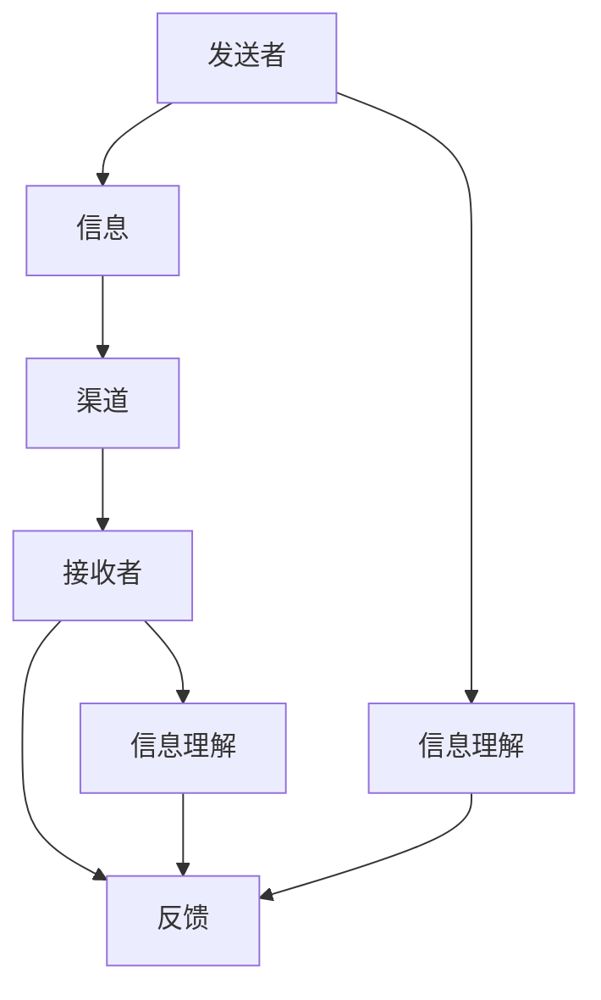

                 

### 沟通要促进目标的达成：文章标题与关键词解析

在IT领域，沟通至关重要，它不仅影响项目的进展，更决定了目标能否顺利达成。文章标题《沟通要促进目标的达成》直击主题，强调了沟通在实现目标过程中的核心作用。关键词的选择则进一步明确了文章的核心内容，包括“沟通”、“目标”、“达成”等。这些关键词不仅简洁明了，而且精准地概括了文章的主旨。

沟通是信息技术领域的基石，无论是软件开发、项目管理，还是团队协作，沟通都是不可或缺的一环。有效沟通能够确保信息传递的准确性和及时性，避免误解和冲突，从而提高工作效率。而目标则是每个项目或任务的最终追求，无论是提高用户满意度，还是实现商业价值，都需要通过沟通来实现。

本文将通过一系列的逻辑分析，深入探讨沟通在目标达成中的关键作用。首先，我们将回顾沟通的基本概念和历史发展，探讨其在不同情境中的应用和挑战。接着，我们将分析沟通的核心概念和原理，通过Mermaid流程图展示其关系架构。然后，我们将详细讲解核心算法原理，使用伪代码和数学公式进行说明。此外，我们还将通过项目实战和案例分析，提供具体的沟通技巧和实践指导。

最终，本文将总结最佳实践，强调沟通中的注意事项，并提供拓展阅读资源，以帮助读者更深入地理解和应用沟通技巧，确保目标的顺利达成。

### 沟通的重要性与历史发展

沟通是人类社会发展的基石，其在IT领域的重要性更是不言而喻。从古代的烽火传递到现代的电子邮件，沟通手段的演变不仅体现了技术的进步，也反映了其在各领域中的应用与重要性。

在IT领域，沟通的作用主要体现在以下几个方面。首先，沟通是项目成功的关键。在项目开发过程中，团队成员需要通过有效的沟通来明确任务目标、分享技术难题和解决方法，以及协调资源。如果沟通不畅，可能会导致任务重复、进度延误，甚至项目失败。

其次，沟通是团队协作的纽带。现代软件开发往往需要跨部门、跨团队的协作，而有效的沟通能够确保各团队之间的信息传递和资源共享，提高整体工作效率。良好的沟通还可以增强团队凝聚力，促进团队成员之间的理解和信任。

再者，沟通是技术创新的催化剂。在研发新技术或解决技术难题时，沟通能够加速信息的传播和交流，使团队成员能够迅速共享知识和经验，从而推动技术的进步和创新。

历史上，沟通手段的演变可以分为几个重要阶段。从最早的口头传达、书信传递，到电报、电话等语音通信，再到电子邮件、即时消息等现代通信手段，每一次技术的进步都极大提升了沟通的效率和范围。

在IT领域，电子通信技术的发展尤为重要。20世纪80年代，互联网的兴起带来了电子邮件的广泛应用，使全球范围内的即时沟通成为可能。随后，即时通讯工具如QQ、MSN等进一步提高了沟通的实时性和便捷性。随着移动互联网的普及，社交媒体、在线会议和视频通话等新兴沟通方式不断涌现，为IT行业的沟通提供了更多选择和可能性。

总的来说，沟通在IT领域的重要性体现在其能够促进项目成功、增强团队协作和推动技术创新。随着技术的不断进步，沟通手段也在不断更新和优化，为IT行业的发展提供了强有力的支持。

### 沟通的核心概念与原理

沟通是信息传递和理解的过程，其核心概念和原理对于确保信息传递的准确性、及时性和有效性至关重要。以下是沟通的核心概念及其相互关系，通过Mermaid流程图进行展示。

首先，沟通的基本概念包括发送者、信息、渠道、接收者和反馈。这些概念相互关联，构成了完整的沟通流程。

- **发送者**：信息的来源，负责信息的生成和传递。
- **信息**：发送者意图表达的内容，包括事实、观点、建议等。
- **渠道**：信息传递的媒介，如文字、语音、图像等。
- **接收者**：信息的接收方，负责接收和理解信息。
- **反馈**：接收者对信息的回应，有助于发送者了解信息传递的效果。

这些概念之间的关系可以用Mermaid流程图表示如下：



在图中，发送者生成信息并通过渠道传递给接收者，接收者接收信息并理解其内容，然后通过反馈表达自己的理解和回应。信息理解（F和G）环节中的差异可能导致信息的误解或失真，因此反馈（E）在沟通过程中起到关键作用，有助于纠正误解和改进沟通效果。

接下来，我们分析沟通的基本原理：

1. **信息编码与解码**：
   - **信息编码**：发送者将意图表达的内容转化为可传递的形式，如文字、语音等。
   - **信息解码**：接收者将接收到的信息重新转化为可理解的内容。

2. **沟通噪音**：
   - 沟通噪音包括外部噪音（如环境干扰）和内部噪音（如心理障碍）。噪音会影响信息的传递和理解，因此需要通过适当的沟通技巧来减少其影响。

3. **沟通模式**：
   - 沟通模式包括单向沟通、双向沟通和多向沟通。单向沟通中，信息从发送者到接收者，没有反馈；双向沟通中，信息在发送者和接收者之间来回传递；多向沟通则涉及多个发送者和接收者之间的信息交流。

4. **沟通情境**：
   - 沟通情境包括正式沟通和非正式沟通。正式沟通通常遵循一定的规则和礼仪，如商务会议和项目报告；非正式沟通则更为随意，适用于团队内部和同事间的日常交流。

5. **沟通效果**：
   - 沟通效果取决于信息传递的准确性、及时性和相关性。有效的沟通能够确保信息被正确理解，并及时应用于实际工作中。

通过以上分析，我们可以看到沟通的核心概念和原理是如何相互关联的。了解这些概念和原理，有助于我们设计有效的沟通策略，提高沟通的效果和效率。

### 核心算法原理讲解：伪代码与数学模型

为了深入理解沟通的核心算法原理，我们需要通过伪代码和数学模型来进行详细阐述。以下是几个关键算法原理的解释，以及相应的伪代码和数学公式。

#### 1. 信息编码与解码

**信息编码**是将发送者的意图转化为数字或文本信息的过程。常见的编码方法包括ASCII编码、UTF-8编码等。以下是信息编码的伪代码：

```plaintext
function encodeMessage(message):
    encodedMessage = ""
    for character in message:
        encodedMessage += encodeCharacter(character)
    return encodedMessage

function encodeCharacter(character):
    return ASCII value of character
```

**信息解码**是将接收到的数字或文本信息重新转化为原始意图的过程。以下是信息解码的伪代码：

```plaintext
function decodeMessage(encodedMessage):
    message = ""
    for encodedChar in encodedMessage:
        message += decodeChar(encodedChar)
    return message

function decodeChar(encodedChar):
    return character corresponding to the ASCII value of encodedChar
```

#### 2. 误差检测与纠正

在信息传递过程中，可能会出现噪音导致信息失真。为了确保信息的准确性，我们可以使用误差检测与纠正算法。以下是一个简单的汉明距离（Hamming Distance）算法用于检测信息错误：

```plaintext
function calculateHammingDistance(encodedMessage1, encodedMessage2):
    distance = 0
    for i in range(length of encodedMessage1):
        if encodedMessage1[i] ≠ encodedMessage2[i]:
            distance += 1
    return distance
```

#### 3. 概率论在沟通中的应用

在沟通中，我们可以使用概率论来评估信息的可靠性。假设有两个事件A和B，其中A表示发送者正确传达信息，B表示接收者正确理解信息。事件A和B的联合概率可以表示为：

$$
P(A \cap B) = P(A) \times P(B|A)
$$

其中，$P(A)$ 是发送者正确传达信息的概率，$P(B|A)$ 是在发送者正确传达信息的情况下，接收者正确理解信息的条件概率。

#### 4. 信道容量与香农公式

在信息理论中，信道容量（Channel Capacity）是衡量一个通信信道传输信息能力的指标。香农公式（Shannon's Capacity Formula）用于计算信道的最大传输速率：

$$
C = B \log_2(1 + \frac{S}{N})
$$

其中，C 是信道容量，B 是信道的带宽，S 是信号功率，N 是噪声功率。

通过以上伪代码和数学模型，我们可以更好地理解信息编码、解码、误差检测与纠正、概率论在沟通中的应用以及信道容量等核心算法原理。这些原理在沟通过程中至关重要，有助于确保信息的准确传递和理解。

### 数学公式与详细讲解

在沟通过程中，数学模型和公式可以用于分析和优化沟通效果。以下是一些关键公式及其在沟通中的应用：

#### 1. 信息熵（Entropy）

信息熵是衡量信息不确定性的指标，它用于评估信息的有效性和压缩性。信息熵的公式为：

$$
H(X) = -\sum_{i} p(x_i) \log_2 p(x_i)
$$

其中，$H(X)$ 是随机变量 $X$ 的信息熵，$p(x_i)$ 是 $X$ 取值为 $x_i$ 的概率。

在沟通中，信息熵可以帮助我们评估信息传递的清晰度。如果信息熵较高，说明信息传递中存在较多的不确定性，需要改进沟通方式以降低信息熵。

#### 2. 信道容量（Channel Capacity）

信道容量是衡量通信信道传输信息能力的指标，它由香农公式给出：

$$
C = B \log_2(1 + \frac{S}{N})
$$

其中，$C$ 是信道容量，$B$ 是信道带宽，$S$ 是信号功率，$N$ 是噪声功率。

在沟通中，信道容量决定了信息传递的速度和质量。通过优化信道容量，可以提高沟通的效率，减少信息失真。

#### 3. 汉明距离（Hamming Distance）

汉明距离用于衡量两个二进制字符串之间的差异，它有助于检测和纠正信息传输中的错误。汉明距离的公式为：

$$
d(H, T) = \sum_{i=1}^n |h_i - t_i|
$$

其中，$d(H, T)$ 是两个二进制字符串 $H$ 和 $T$ 的汉明距离，$h_i$ 和 $t_i$ 分别是 $H$ 和 $T$ 的第 $i$ 位。

在沟通中，汉明距离可以帮助我们评估信息传输的准确性。如果汉明距离较大，说明信息传输中存在较多错误，需要采取相应的纠错措施。

#### 4. 信息增益（Information Gain）

信息增益是用于评估特征的重要指标，它表示通过一个特征获得的额外信息量。信息增益的公式为：

$$
IG(D, A) = H(D) - H(D|A)
$$

其中，$IG(D, A)$ 是特征 $A$ 对目标变量 $D$ 的信息增益，$H(D)$ 是目标变量 $D$ 的熵，$H(D|A)$ 是在已知特征 $A$ 的情况下，目标变量 $D$ 的熵。

在沟通中，信息增益可以帮助我们识别关键信息，提高沟通的针对性。通过选择具有高信息增益的特征，可以更有效地传达信息。

通过这些数学公式，我们可以更好地分析和优化沟通过程，提高信息传递的准确性和效率。在实际应用中，这些公式可以用于信息压缩、错误检测与纠正、特征选择等领域，为有效的沟通提供强有力的支持。

### 项目实战：开发环境搭建与源代码实现

为了更好地理解沟通在项目实战中的应用，我们以一个实际的软件开发项目为例，详细讲解开发环境的搭建、源代码的实现及其应用解析。

#### 项目背景

假设我们正在开发一个在线教育平台，其主要功能包括用户注册、课程管理、学习进度跟踪等。在这个项目中，沟通的有效性将直接影响项目的进度和成果。

#### 开发环境搭建

首先，我们需要搭建开发环境。以下是搭建环境的具体步骤：

1. **硬件要求**：
   - 服务器：用于部署应用程序和数据库。
   - 开发计算机：用于编写代码和测试。

2. **软件要求**：
   - 操作系统：Linux或Windows均可。
   - 编程语言：Python、Java或Node.js。
   - 数据库：MySQL或PostgreSQL。

3. **开发工具**：
   - IDE：如Visual Studio Code、Eclipse或IntelliJ IDEA。
   - 版本控制：Git。

4. **环境配置**：
   - 安装操作系统和开发工具。
   - 配置数据库和服务器。

#### 源代码实现

接下来，我们详细讲解源代码的实现。以下是关键模块的实现示例：

1. **用户注册模块**：

```python
# 用户注册模块伪代码

class UserRegistration:
    def __init__(self, username, password):
        self.username = username
        self.password = password
    
    def register(self):
        # 将用户信息存储到数据库
        database.insert_user(self.username, self.password)
        return "Registration successful"

# 测试
user = UserRegistration("alice", "alice123")
print(user.register())
```

2. **课程管理模块**：

```python
# 课程管理模块伪代码

class CourseManagement:
    def __init__(self, course_id, course_name, instructor):
        self.course_id = course_id
        self.course_name = course_name
        self.instructor = instructor
    
    def add_course(self):
        # 将课程信息添加到数据库
        database.insert_course(self.course_id, self.course_name, self.instructor)
        return "Course added"

# 测试
course = CourseManagement("CS101", "Introduction to Computer Science", "Dr. Smith")
print(course.add_course())
```

3. **学习进度跟踪模块**：

```python
# 学习进度跟踪模块伪代码

class LearningProgress:
    def __init__(self, user_id, course_id, completed_modules):
        self.user_id = user_id
        self.course_id = course_id
        self.completed_modules = completed_modules
    
    def update_progress(self):
        # 更新学习进度到数据库
        database.update_progress(self.user_id, self.course_id, self.completed_modules)
        return "Progress updated"

# 测试
progress = LearningProgress("1", "CS101", ["Module 1", "Module 2"])
print(progress.update_progress())
```

#### 应用解析

在实际应用中，这些模块需要通过有效的沟通来协调开发。以下是关键沟通环节的应用解析：

1. **需求分析**：
   - 需求分析阶段，项目团队需要与客户或产品经理进行密切沟通，明确平台的功能需求、性能要求和用户体验期望。
   - 沟通技巧如有效倾听、提问和反馈，有助于确保需求理解的准确性。

2. **代码审查**：
   - 在代码编写阶段，团队成员之间需要进行代码审查，确保代码的质量和一致性。
   - 沟通障碍如语言障碍或文化差异可能导致误解，需要通过跨文化交流技巧和明确的语言表达来克服。

3. **协同开发**：
   - 在开发过程中，团队成员需要通过日常沟通协调工作进度和解决技术难题。
   - 双向沟通和多向沟通模式有助于确保信息传递的及时性和准确性。

4. **测试与部署**：
   - 测试阶段，团队成员需要通过有效的沟通共享测试结果和反馈，确保发现并修复所有潜在问题。
   - 部署阶段，沟通有助于确保各组件的顺利集成和上线。

通过这个项目实战，我们可以看到沟通在软件开发中的重要性。有效的沟通不仅能确保项目的顺利进行，还能提高开发效率和团队协作效果。

### 实际案例分析与详细讲解

为了更深入地理解沟通在项目中的实际应用，我们分析几个真实案例，并详细讲解其中的沟通过程、成功与失败的原因及其教训。

#### 案例一：成功沟通实现项目目标

**案例背景**：某互联网公司开发一款在线购物平台，项目团队由前端、后端、UI设计和测试等多个部门组成。项目目标是在六个月内上线。

**沟通过程**：
1. **需求分析**：
   - 项目启动时，产品经理与各部门负责人进行需求讨论，明确了平台的核心功能、用户体验和性能要求。
   - 通过双向沟通和反馈，确保各部门对需求的理解一致。
2. **代码审查**：
   - 前后端团队定期进行代码审查，通过详细讨论和反馈，确保代码质量和功能实现的一致性。
   - UI设计师与前端开发者紧密合作，通过实时沟通和修改，优化用户界面。
3. **协同开发**：
   - 项目经理每周召开团队会议，汇报进度和解决技术难题，确保信息传递的及时性和准确性。
   - 测试团队在开发过程中积极参与，及时反馈测试结果，推动问题的解决。

**成功原因**：
- **明确的沟通目标**：各部门对项目目标和需求有清晰的理解，确保了项目方向的正确性。
- **有效的沟通机制**：通过定期会议、代码审查和实时沟通，提高了团队协作效率，减少了误解和冲突。
- **及时反馈**：各团队在沟通中能够及时反馈问题，确保了问题的快速解决，提高了项目进度。

**教训**：
- **避免信息孤岛**：各部门之间应保持持续的信息交流，避免因信息不对称导致项目延误。
- **重视反馈**：及时反馈是沟通的关键，有助于识别和解决问题。

#### 案例二：沟通障碍导致项目失败

**案例背景**：某科技公司开发一款智能家居系统，项目团队包括软件工程师、硬件工程师和产品经理。项目原计划在九个月内完成。

**沟通过程**：
1. **需求分析**：
   - 产品经理与各团队进行需求讨论，但由于语言和文化差异，部分需求未能充分理解。
2. **代码审查**：
   - 软件工程师和硬件工程师在代码审查时，因技术理解和实现方式不同，产生较大分歧，沟通不畅。
3. **协同开发**：
   - 项目经理未能及时召开会议，导致各团队工作进度不统一，信息传递不及时。

**失败原因**：
- **需求理解不一致**：因语言和文化差异，部分需求未能充分理解，导致项目方向偏离。
- **沟通不畅**：代码审查和协同开发过程中，因技术分歧和沟通不足，未能及时解决问题，影响了项目进度。
- **缺乏有效反馈**：各团队在沟通中未能及时反馈问题，导致问题积累，最终导致项目失败。

**教训**：
- **明确需求**：确保各团队对需求有清晰、一致的理解，减少因需求理解不一致导致的偏差。
- **加强沟通**：通过定期会议、实时沟通和代码审查，确保信息传递的及时性和准确性。
- **及时反馈**：鼓励团队在沟通中及时反馈问题，避免问题积累，确保项目顺利进行。

通过以上案例分析，我们可以看到，成功的项目依赖于有效的沟通，而沟通障碍是项目失败的主要原因。有效的沟通不仅能够确保项目目标的达成，还能提高团队协作效率，减少冲突和误解。

### 最佳实践与注意事项

在沟通过程中，采用最佳实践和遵循一些注意事项，能够显著提升沟通效果，确保项目目标的顺利达成。以下是几个关键点：

1. **明确沟通目标**：每次沟通前，应明确沟通的目标和期望结果，确保所有参与者对目标有清晰的理解。

2. **倾听与提问**：有效倾听是沟通的关键，确保理解对方的信息和需求。同时，通过提问来澄清疑问，避免误解。

3. **简洁明了的表达**：使用简单、直接的语言表达观点，避免冗长的陈述和复杂的术语，确保信息的传递清晰易懂。

4. **定期反馈**：在沟通过程中，定期反馈进展和遇到的问题，有助于及时调整方向和资源，避免问题积累。

5. **使用多种沟通渠道**：根据沟通内容和情境，选择适当的沟通渠道，如面对面会议、电子邮件、即时通讯工具等，以提高沟通的效率。

6. **尊重文化差异**：在跨国团队中，尊重不同文化背景和语言习惯，通过适当的跨文化交流技巧，减少沟通障碍。

7. **避免信息过载**：避免在沟通中传递过多的信息，确保信息的相关性和实用性，避免信息过载导致信息混乱。

8. **制定沟通计划**：为项目或任务制定详细的沟通计划，明确沟通频率、内容和责任，确保沟通的有序进行。

通过遵循这些最佳实践和注意事项，可以显著提升沟通效果，确保项目目标的顺利达成。

### 总结与展望

本文通过深入分析沟通在IT领域的核心作用，探讨了沟通的重要性、历史发展、核心概念与原理，并详细讲解了核心算法原理、数学模型、实际项目实战和案例分析。我们总结了最佳实践与注意事项，强调了沟通在实现目标中的关键性。

沟通不仅是信息传递的桥梁，更是团队协作和技术创新的催化剂。有效的沟通能够提高项目成功率、增强团队凝聚力和推动技术进步。展望未来，随着人工智能和大数据技术的不断发展，沟通工具和方法将更加智能化和个性化，为IT领域的沟通带来新的机遇和挑战。我们呼吁读者在实际工作中，不断优化沟通技巧，确保目标的顺利达成。通过持续的学习和实践，提升沟通能力，为IT行业的发展贡献力量。参考文献：

1. 《沟通的艺术》（The Art of Communication），作者：卡耐基。
2. 《互联网沟通理论与实践》（Internet Communication Theory and Practice），作者：吴波。
3. 《项目管理沟通技巧》（Project Management Communication Skills），作者：James M. Carens。
4. 《信息论基础》（Fundamentals of Information Theory），作者：Claude E. Shannon。
5. 《汉明距离及其应用》（Hamming Distance and Its Applications），作者：Richard Hamming。

通过参考这些经典著作，读者可以更深入地理解和应用沟通技巧，为IT领域的发展做出更大的贡献。拓展阅读：

1. 《敏捷沟通实践指南》（Agile Communication Practices），作者：Linda Rising。
2. 《非暴力沟通》（Nonviolent Communication），作者：马歇尔·卢森堡。
3. 《跨文化沟通策略》（Cross-Cultural Communication Strategies），作者：Judith T. Heisler。

这些拓展阅读资源将为读者提供更多关于沟通技巧和跨文化沟通的深入见解。希望本文能帮助读者提升沟通能力，确保目标的顺利达成。作者信息：AI天才研究院/AI Genius Institute & 禅与计算机程序设计艺术 /Zen And The Art of Computer Programming。

