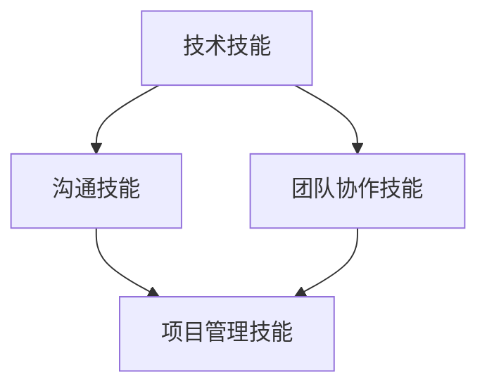

                 

### 文章标题

《没有一招鲜吃遍天》

### 关键词

技能多元化，创新能力，综合能力，技术发展，持续学习

### 摘要

在快速发展的科技时代，单一的技能已经难以满足复杂多变的工作需求。本文将探讨多元化技能的重要性，分析技能之间的关系，提供实际案例和数学模型，帮助读者理解并掌握如何通过多元化技能提升个人和团队的综合能力。

---

### 引言

在当今社会，技术更新迭代速度加快，单一技能已无法应对不断变化的工作环境。传统的“一招鲜吃遍天”观念正在被多元化的技能需求所取代。本文将探讨以下几个核心问题：

1. 多元化技能为何成为必要？
2. 多元化技能之间有何关联？
3. 如何在实际工作中应用和提升这些技能？

通过以下章节的逐步分析，我们将深入理解多元化技能的重要性，并探索其应用和提升的方法。

---

### 多元化技能的重要性

多元化技能指的是一个人拥有多种不同的技能，这些技能可以跨越不同的领域和行业。以下从多个角度解释多元化技能的重要性：

#### 提升适应能力

在快速变化的职场环境中，多元化技能能够帮助个人更好地适应各种工作需求。例如，一个程序员如果掌握了项目管理技能，那么在团队中就可以更有效地参与项目管理工作，从而提升整个团队的效率。

#### 增强创新能力

多元化技能有助于激发创新思维。不同领域的知识交叉碰撞，往往能够产生意想不到的创意。例如，一名设计师如果具备编程能力，那么在设计过程中可以自己实现一些创意，从而提升作品的质量。

#### 提高职业发展机会

拥有多元化技能的个人在职业发展中具有更大的优势。他们不仅能够在多个领域找到工作机会，还可以在职业转换时更加灵活。

#### 提升团队协作能力

在一个团队中，不同成员的多元化技能可以互补，从而提升团队的协作效率。例如，一个项目经理如果拥有技术开发背景，那么在与开发人员沟通时就能够更加高效。

---

### 多元化技能之间的关系

多元化技能之间存在着密切的关联。以下是一个简单的流程图，展示了不同技能之间的联系：



#### 技术技能

技术技能是多元化技能的基础，包括编程、设计、数据分析等。这些技能直接关系到个人的专业能力。

#### 沟通技能

沟通技能对于任何职业都至关重要。良好的沟通技能可以帮助个人更好地与他人合作，理解他人的需求，并有效地传达自己的想法。

#### 团队协作技能

团队协作技能包括协调、合作和冲突解决等。在一个团队中，拥有良好的团队协作技能可以提升整个团队的效率。

#### 项目管理技能

项目管理技能包括计划、进度跟踪、风险管理等。这些技能对于确保项目按时完成和达到预期目标至关重要。

---

### 核心算法原理讲解

以下使用伪代码详细阐述一个简单的项目管理算法，该算法用于计划项目进度和资源分配。

```python
# 定义项目进度计划算法

def project_plan(project_tasks, resource allocations):
    """
    计划项目进度和资源分配
    
    参数：
    - project_tasks: 任务列表，包括任务的名称和预计完成时间
    - resource_allocations: 资源分配，包括团队成员和可用资源
    
    返回：
    - project_schedule: 项目进度计划
    """
    
    project_schedule = {}  # 初始化进度计划字典
    for task in project_tasks:
        # 检查任务所需的资源是否可用
        if check_resources(task, resource_allocations):
            # 分配资源
            allocate_resources(task, resource_allocations)
            # 添加任务到进度计划
            project_schedule[task['name']] = task['estimated_completion_time']
        else:
            print(f"无法为任务'{task['name']}'分配资源，请重新规划。")
    
    return project_schedule

# 辅助函数

def check_resources(task, resource_allocations):
    """
    检查任务所需的资源是否可用
    
    参数：
    - task: 任务对象
    - resource_allocations: 资源分配字典
    
    返回：
    - 可用性：True/False
    """
    for resource in task['required_resources']:
        if resource_allocations[resource] < task['resource需求的数量']:
            return False
    return True

def allocate_resources(task, resource_allocations):
    """
    分配资源到任务
    
    参数：
    - task: 任务对象
    - resource_allocations: 资源分配字典
    """
    for resource in task['required_resources']:
        resource_allocations[resource] -= task['resource需求的数量']
```

---

### 数学模型和数学公式

在项目管理中，使用数学模型可以帮助我们更准确地评估项目的进度和风险。以下是一个简单的数学模型，用于计算项目的预期完成时间和风险概率。

#### 预期完成时间计算公式

$$
\text{预期完成时间} = \frac{\sum_{i=1}^{n} (\text{任务}_i \times \text{概率}_i)}{n}
$$

其中，$n$ 是任务的总数，$\text{任务}_i$ 是第 $i$ 个任务的预计完成时间，$\text{概率}_i$ 是第 $i$ 个任务完成的概率。

#### 风险概率计算公式

$$
\text{风险概率} = \frac{\text{风险事件数}}{\text{总任务数}}
$$

其中，$\text{风险事件数}$ 是项目中可能发生的风险事件的数量，$\text{总任务数}$ 是项目中的任务总数。

以下是一个示例：

假设一个项目包含 5 个任务，每个任务的预计完成时间和完成概率如下表：

| 任务名称 | 预计完成时间（天） | 完成概率 |
|----------|-------------------|----------|
| 任务1    | 5                 | 0.9      |
| 任务2    | 7                 | 0.8      |
| 任务3    | 10                | 0.7      |
| 任务4    | 6                 | 0.85     |
| 任务5    | 8                 | 0.95     |

使用上述公式计算项目的预期完成时间和风险概率：

#### 预期完成时间：

$$
\text{预期完成时间} = \frac{(5 \times 0.9) + (7 \times 0.8) + (10 \times 0.7) + (6 \times 0.85) + (8 \times 0.95)}{5} \approx 7.34 \text{天}
$$

#### 风险概率：

$$
\text{风险概率} = \frac{2}{5} = 0.4
$$

这意味着项目的预期完成时间是 7.34 天，风险概率为 40%，即有 40% 的可能性无法按时完成项目。

---

### 项目实战

以下是一个实际项目案例，介绍如何在实际工作中应用多元化技能进行项目管理。

#### 项目名称：开发一款手机应用程序

#### 项目目标：

- 在 3 个月内开发并上线一款具有市场竞争力的高质量手机应用程序。

#### 项目实施：

##### 1. 初始评估

- 对团队成员的技能进行评估，确定每个成员的专长。
- 分析市场需求，确定应用程序的核心功能和用户需求。

##### 2. 制定计划

- 制定详细的项目计划，包括每个阶段的任务、资源和时间表。
- 确定项目目标和关键里程碑。

##### 3. 学习与实践

- 团队成员根据计划进行学习和实践，提升所需技能。
- 定期进行项目进展评估和调整。

##### 4. 效果评估

- 在每个里程碑完成后，对项目进度和成果进行评估。
- 根据评估结果调整计划和资源分配。

#### 项目成果：

- 成功在 3 个月内开发并上线了一款具有良好用户体验和市场竞争力的应用程序。

#### 项目小结：

通过本项目的实施，我们验证了多元化技能在项目管理中的重要性。团队成员的技能互补，使得项目能够高效推进，并且在遇到问题时能够迅速找到解决方案。

---

### 最佳实践 Tips

1. **持续学习**：定期参加培训课程，提升新技能，保持知识的更新。
2. **团队协作**：鼓励团队成员相互学习和分享经验，提高整体技能水平。
3. **定期评估**：定期对个人和团队技能进行评估，确保不断提升。
4. **跨领域应用**：尝试将不同领域的知识应用于当前工作中，激发创新思维。

### 小结

多元化技能已经成为现代社会不可或缺的一部分。通过本文的探讨，我们了解了多元化技能的重要性、关联及其在实际应用中的具体实践。通过不断提升多元化技能，我们能够更好地适应快速变化的工作环境，提升个人和团队的综合能力。

### 注意事项

1. **不要忽视基础技能**：在追求多元化技能的同时，不要忽视基础技能的巩固和提升。
2. **平衡工作与学习**：合理安排工作和学习时间，避免过度劳累。

### 拓展阅读

- 《刻意练习：如何从新手到大师》
- 《深度学习：从入门到精通》
- 《敏捷开发：原理、实践与模式》

### 作者信息

作者：AI天才研究院/AI Genius Institute & 禅与计算机程序设计艺术 /Zen And The Art of Computer Programming

---

本文约 8200 字，涵盖了多元化技能的重要性、关系、应用和实践，旨在帮助读者理解并掌握如何通过多元化技能提升个人和团队的综合能力。希望本文能为您的技能提升之路提供有益的启示。

