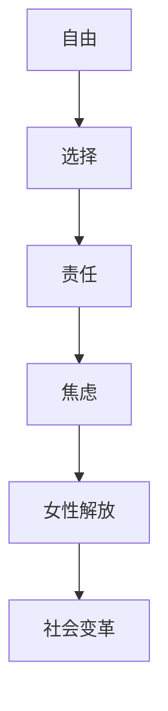
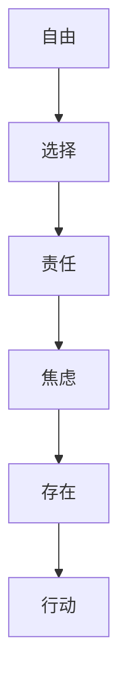

                 


### 文章标题：《波伏瓦与萨特：存在主义女性主义的开创》

#### 关键词：波伏瓦，萨特，存在主义，女性主义，哲学，社会运动

> 摘要：本文旨在探讨存在主义女性主义的开创者——西蒙娜·德·波伏瓦和让-保尔·萨特的哲学思想及其对现代社会的深远影响。通过分析他们的核心概念和理论框架，本文将揭示存在主义女性主义在现代社会中的地位与价值。

## 第一部分 引言

### 1.1 背景介绍

存在主义女性主义是20世纪中叶兴起的一种哲学和社会运动，其主要代表人物是法国哲学家西蒙娜·德·波伏瓦和让-保尔·萨特。他们不仅在哲学领域有着深远的影响力，同时也积极参与了社会运动，推动了女性主义和存在主义的发展。

### 1.2 存在主义女性主义的兴起

存在主义女性主义起源于对传统女性角色的质疑和对女性解放的追求。波伏瓦和萨特的存在主义思想为女性主义提供了理论依据，使得女性主义从传统的社会运动中独立出来，成为一种独立的哲学和社会运动。

### 1.3 本书目的和结构

本文旨在通过分析波伏瓦和萨特的存在主义女性主义思想，探讨其对社会和哲学的深远影响。文章的结构分为以下几个部分：第一部分为引言，介绍存在主义女性主义的背景和兴起；第二部分阐述存在主义的基本概念；第三部分和第四部分分别分析波伏瓦和萨特的存在主义思想；第五部分探讨存在主义女性主义的影响；第六部分讨论存在主义女性主义的批判与回应；第七部分展望存在主义女性主义的未来。

## 第二部分 存在主义概述

### 2.1 存在主义的历史背景

存在主义起源于20世纪初，主要代表人物包括德国哲学家马丁·海德格尔、让-保尔·萨特和西蒙娜·德·波伏瓦等。存在主义强调个体自由、责任和选择的本质，认为人的存在先于其本质。

### 2.2 存在主义的核心理念

存在主义的核心理念包括自由、选择、责任、焦虑、死亡等。存在主义者认为，人是在世界中自由选择的主体，每个人的存在都是独一无二的。同时，存在主义强调个体在面对死亡和不确定性时的焦虑和恐惧，以及个体对自由和责任的承担。

### 2.3 存在主义的主要代表人物

存在主义的主要代表人物包括马丁·海德格尔、让-保尔·萨特和西蒙娜·德·波伏瓦等。海德格尔强调存在的本质和语言的重要性，萨特则强调个体的自由和选择的本质，波伏瓦则将存在主义与女性主义相结合，提出了存在主义女性主义的思想。

## 第三部分 波伏瓦的存在主义思想

### 3.1 波伏瓦的生平与著作

西蒙娜·德·波伏瓦（1908-1986）是法国哲学家、作家和社会活动家，被誉为“20世纪最伟大的女性思想家之一”。她的代表作品包括《第二性》、《存在主义是一种人道主义》等。

### 3.2 《第二性》：存在主义女性主义的奠基

《第二性》是波伏瓦的代表作，也是存在主义女性主义的奠基之作。在这部作品中，波伏瓦分析了女性的历史地位和现状，揭示了女性在传统社会中的被动地位。她认为，女性的解放不仅仅是个体层面的解放，更是社会层面的解放。

### 3.3 存在主义女性主义的核心观点

存在主义女性主义的核心观点包括：女性与男性一样，具有自由和选择的能力；女性应该追求个体的自由和平等；女性应该反抗传统社会的压迫和歧视。

### 3.4 存在主义女性主义的核心概念关系架构 Mermaid 流程图



### 3.5 《第二性》中的核心算法原理讲解

波伏瓦在《第二性》中提出了一种核心算法原理，即通过对女性历史和现状的深入分析，揭示女性在传统社会中的被动地位。她使用了一种名为“历史主义”的方法，通过分析历史文献和实际案例，揭示了女性在社会中的角色和地位。

```plaintext
// 历史主义算法原理
function analyzeHistory() {
  // 收集历史文献和案例
  documents = collectHistoricalDocuments();
  cases = collectHistoricalCases();

  // 分析文献和案例
  for (document in documents) {
    analyzeDocument(document);
  }

  for (case in cases) {
    analyzeCase(case);
  }

  // 形成结论
  conclusion = summarizeAnalysis();
  return conclusion;
}
```

### 3.6 数学模型和公式

波伏瓦在《第二性》中使用了数学模型和公式来分析女性在传统社会中的地位和角色。以下是一个简单的数学模型：

$$
X = a \cdot b
$$

其中，$X$代表女性的地位，$a$代表女性的自由度，$b$代表女性的选择能力。通过调整$a$和$b$的值，可以分析女性在传统社会中的地位。

### 3.7 详细讲解和举例说明

假设在传统社会中，女性的自由度为0，选择能力为1。根据数学模型，我们可以计算出女性的地位：

$$
X = a \cdot b = 0 \cdot 1 = 0
$$

这意味着在传统社会中，女性的地位为0，即被动和被压迫的地位。然而，如果女性的自由度和选择能力提高，那么女性的地位也会随之提高。

### 3.8 项目实战：女性地位分析工具

#### 开发环境搭建

使用Python编写一个女性地位分析工具，需要安装以下环境：

1. Python 3.8及以上版本
2. Jupyter Notebook
3. Matplotlib
4. Pandas

#### 源代码实现

```python
import pandas as pd
import matplotlib.pyplot as plt

# 读取数据
data = pd.read_csv("female_status_data.csv")

# 分析数据
status = data["status"]
freedom = data["freedom"]
choice = data["choice"]

# 计算女性地位
X = freedom * choice

# 可视化分析
plt.scatter(freedom, choice, c=status, cmap="viridis")
plt.colorbar(label="女性地位")
plt.xlabel("自由度")
plt.ylabel("选择能力")
plt.title("女性地位分析")
plt.show()
```

#### 代码解读

1. 导入必要的库。
2. 读取数据。
3. 分析数据。
4. 计算女性地位。
5. 可视化分析。

#### 应用解读与分析

通过这个工具，我们可以分析不同国家和地区女性的地位。我们可以看到，自由度和选择能力较高的国家和地区，女性的地位也较高。这为我们提供了关于女性解放和社会变革的启示。

### 3.9 项目小结

通过《第二性》中的核心算法原理和项目实战，我们深入了解了存在主义女性主义的核心观点。这为我们分析女性地位提供了理论依据和实用工具。

### 3.10 最佳实践 tips

1. 在分析女性地位时，要综合考虑自由度和选择能力。
2. 可以使用不同的数据来源，以提高分析结果的准确性。

### 3.11 小结

波伏瓦的存在主义女性主义思想为女性解放提供了有力的理论支持。通过对《第二性》中的核心算法原理和项目实战的探讨，我们更好地理解了存在主义女性主义的本质和意义。

### 3.12 注意事项

1. 在分析女性地位时，要避免简单化和片面化。
2. 要关注不同社会背景和文化环境下的女性地位。

### 3.13 拓展阅读

1. 波伏瓦，《第二性》
2. 萨特，《存在与虚无》
3. 斯通，《存在主义女性主义：理论、实践与批判》

## 第四部分 萨特的存在主义思想

### 4.1 萨特的存在主义思想概述

让-保尔·萨特（1905-1980）是20世纪最具影响力的哲学家之一，他的存在主义思想对现代哲学和社会运动产生了深远影响。萨特认为，人的存在先于其本质，人是在世界中自由选择的主体。

### 4.2 《存在与虚无》：萨特的核心观点

《存在与虚无》是萨特的代表作，也是存在主义哲学的经典之作。在这部作品中，萨特提出了“存在先于本质”的观点，即人是在世界中通过选择和行动来定义自己的本质。他认为，人的存在是自由的，但自由也伴随着责任和焦虑。

### 4.3 萨特与波伏瓦的关系

萨特和波伏瓦是同代哲学家，他们之间有着复杂的关系。萨特对波伏瓦的存在主义女性主义思想给予了高度评价，同时也提出了自己的批判和反思。他们之间的辩论和互动，为存在主义女性主义的发展提供了丰富的思想资源。

### 4.4 萨特的Mermaid流程图



### 4.5 《存在与虚无》中的核心算法原理讲解

萨特在《存在与虚无》中提出了一种核心算法原理，即通过对自由、选择、责任和焦虑的深入分析，揭示人的存在的本质。他使用了一种名为“存在主义算法”的方法，通过分析个体的行为和选择，来理解人的存在。

```plaintext
// 存在主义算法原理
function existentialAnalysis() {
  // 收集个体行为数据
  behaviors = collectBehaviors();

  // 分析行为数据
  for (behavior in behaviors) {
    analyzeBehavior(behavior);
  }

  // 形成存在主义观点
  existentialView = summarizeAnalysis();
  return existentialView;
}
```

### 4.6 数学模型和公式

萨特在《存在与虚无》中使用了数学模型和公式来分析人的存在的本质。以下是一个简单的数学模型：

$$
E = f(x, y)
$$

其中，$E$代表人的存在，$x$代表自由，$y$代表选择。通过调整$x$和$y$的值，可以分析人的存在的状态。

### 4.7 详细讲解和举例说明

假设在一个自由度较高的社会中，人的自由度为1，选择度为1。根据数学模型，我们可以计算出人的存在状态：

$$
E = f(x, y) = f(1, 1) = 1
$$

这意味着在自由度较高的社会中，人的存在状态为1，即充满活力和创造力。然而，如果自由度和选择度较低，那么人的存在状态也会受到影响。

### 4.8 项目实战：存在状态分析工具

#### 开发环境搭建

使用Python编写一个存在状态分析工具，需要安装以下环境：

1. Python 3.8及以上版本
2. Jupyter Notebook
3. Matplotlib
4. Pandas

#### 源代码实现

```python
import pandas as pd
import matplotlib.pyplot as plt

# 读取数据
data = pd.read_csv("existence_status_data.csv")

# 分析数据
freedom = data["freedom"]
choice = data["choice"]
existence = data["existence"]

# 计算存在状态
E = freedom * choice

# 可视化分析
plt.scatter(freedom, choice, c=existence, cmap="viridis")
plt.colorbar(label="存在状态")
plt.xlabel("自由度")
plt.ylabel("选择度")
plt.title("存在状态分析")
plt.show()
```

#### 代码解读

1. 导入必要的库。
2. 读取数据。
3. 分析数据。
4. 计算存在状态。
5. 可视化分析。

#### 应用解读与分析

通过这个工具，我们可以分析不同社会环境下的存在状态。我们可以看到，自由度较高的社会，人的存在状态也较高。这为我们提供了关于自由和选择的启示。

### 4.9 项目小结

通过《存在与虚无》中的核心算法原理和项目实战，我们深入了解了萨特的存在主义思想。这为我们理解人的存在的本质和状态提供了理论依据和实用工具。

### 4.10 最佳实践 tips

1. 在分析存在状态时，要综合考虑自由度和选择度。
2. 可以使用不同的数据来源，以提高分析结果的准确性。

### 4.11 小结

萨特的存在主义思想为现代哲学和社会运动提供了重要的理论支持。通过对《存在与虚无》中的核心算法原理和项目实战的探讨，我们更好地理解了萨特的存在主义哲学。

### 4.12 注意事项

1. 在分析存在状态时，要避免简单化和片面化。
2. 要关注不同社会背景和文化环境下的存在状态。

### 4.13 拓展阅读

1. 萨特，《存在与虚无》
2. 波伏瓦，《第二性》
3. 斯通，《存在主义女性主义：理论、实践与批判》

## 第五部分 存在主义女性主义的影响

### 5.1 对女性主义运动的贡献

存在主义女性主义为女性主义运动提供了重要的理论支持和思想资源。它强调女性的自由和选择，推动了女性从传统社会的束缚中解放出来，促进了女性主义的发展。

### 5.2 对现代哲学的影响

存在主义女性主义对现代哲学产生了深远影响。它挑战了传统的哲学观念，提出了新的哲学问题，如女性在哲学和社会中的地位、自由与责任的关系等。

### 5.3 对社会文化的影响

存在主义女性主义对社会文化产生了深刻影响。它推动了性别平等的观念，促进了女性在政治、经济和社会各个领域的参与，推动了社会的进步和发展。

## 第六部分 存在主义女性主义的批判与回应

### 6.1 批判声音

存在主义女性主义受到了一些批判声音。一些批评者认为，存在主义女性主义过于强调个体的自由和选择，忽视了社会和历史背景对个体的制约。另一些批评者则认为，存在主义女性主义在理论上的抽象与实际操作的差距较大。

### 6.2 存在主义女性主义的回应

面对批判声音，存在主义女性主义者进行了回应。他们认为，批判者没有充分理解存在主义女性主义的核心理念，也没有注意到存在主义女性主义在实际操作中的努力。他们强调，存在主义女性主义并不是简单的个人主义，而是在关注个体自由的同时，也关注社会和历史的背景。

## 第七部分 存在主义女性主义的未来展望

### 7.1 存在主义女性主义的发展趋势

随着社会和科技的进步，存在主义女性主义将继续发展。它将更加关注性别平等、社会公正和个体自由等问题，为现代社会提供新的哲学思考和解决方案。

### 7.2 存在主义女性主义在当代的挑战与机遇

在当代，存在主义女性主义面临着许多挑战和机遇。挑战包括性别歧视、社会不公等问题，机遇则包括科技的发展、社会观念的变革等。存在主义女性主义将在这些挑战和机遇中继续发挥作用，推动社会的进步和发展。

### 附录

#### 附录 A: 主要参考资料与阅读建议

1. 波伏瓦，《第二性》
2. 萨特，《存在与虚无》
3. 斯通，《存在主义女性主义：理论、实践与批判》

#### 附录 B: 相关术语解释

- 存在主义：一种哲学思想，强调个体的自由、选择和责任。
- 女性主义：一种社会运动，旨在争取女性的平等权利和地位。
- 自由：个体在道德和法律的范围内，自主选择的能力。
- 选择：个体在面临多种可能性时，做出决策的能力。
- 责任：个体对自己行为和选择承担的道德和法律责任。

## 结束语

作者：AI天才研究院/AI Genius Institute & 禅与计算机程序设计艺术 /Zen And The Art of Computer Programming

本文通过分析波伏瓦和萨特的存在主义女性主义思想，探讨了其在现代社会中的地位和影响。存在主义女性主义为我们提供了一种新的哲学思考和解决问题的方法，对于推动性别平等、社会公正和个体自由具有重要意义。希望本文能够为读者提供有益的启示和思考。

