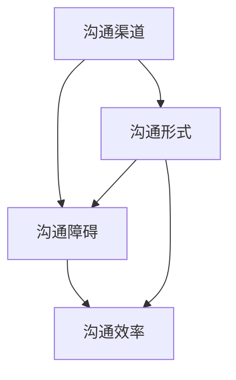

                 

### 注重沟通形式：提升IT团队协作效率的关键

#### 关键词
- 沟通形式
- IT团队协作
- 效率提升
- 核心概念
- 数学模型
- 项目实战

#### 摘要
本文旨在探讨在IT领域，如何通过优化沟通形式来提升团队协作效率和项目成功率。我们将分析沟通形式的重要性，介绍核心概念和原理，并通过具体的数学模型和算法，探讨如何有效传达信息。同时，我们将结合实际项目案例，展示沟通形式在实践中的应用和效果。最后，我们将总结最佳实践和注意事项，为读者提供有益的启示。

### 一、背景介绍

在当今的IT行业，团队协作的重要性不言而喻。无论是软件开发、系统集成，还是大数据分析，都需要团队成员之间进行高效的沟通与协作。然而，在实际工作中，沟通不畅、信息传递错误等问题常常导致项目延期、资源浪费，甚至影响团队士气。因此，如何提升沟通形式，成为提高IT团队协作效率的关键问题。

沟通形式指的是信息传递的方式和过程，包括语言表达、肢体语言、书面文件等多种形式。不同的沟通形式在传达信息的效果上存在显著差异。例如，面对面的沟通能够迅速解决问题，减少误解，而书面文件则便于留存和查阅。因此，选择合适的沟通形式，对于团队协作和项目成功具有重要意义。

### 二、核心概念与联系

为了更好地理解沟通形式的重要性，我们需要先了解以下几个核心概念：

1. **沟通渠道**：指信息传递的路径和手段，如口头沟通、书面沟通、电子邮件、即时通讯工具等。
2. **沟通障碍**：指在信息传递过程中可能遇到的障碍，如语言障碍、文化差异、沟通技巧不足等。
3. **沟通效率**：指信息传递的速度和准确性，是衡量沟通效果的重要指标。

这些概念之间的关系可以用以下Mermaid流程图来表示：



从流程图中可以看出，沟通形式直接影响到沟通效率和沟通障碍。选择合适的沟通形式，有助于降低沟通障碍，提高沟通效率。同时，沟通效率的提升也有助于减少沟通障碍，形成一个良性循环。

### 三、核心算法原理讲解

为了更好地理解沟通形式的选择，我们可以借助一些数学模型和算法来分析不同沟通形式的效果。

#### 1. 概率模型

假设在一个团队中有N名成员，每个成员在沟通中都有可能产生误解。我们可以用概率模型来计算不同沟通形式下的误解概率。

**伪代码：**

```python
def calculate_misunderstanding_probability(n, communication_form):
    if communication_form == "face-to-face":
        p = 0.01 * n
    elif communication_form == "written":
        p = 0.05 * n
    elif communication_form == "email":
        p = 0.1 * n
    else:
        p = 0.5 * n
    return p
```

**数学模型：**

$$
P(\text{misunderstanding}) = p \times n
$$

其中，\( p \) 是误解概率，\( n \) 是团队成员数量。

通过这个模型，我们可以看出，面对面的沟通形式能够显著降低误解概率，而电子邮件和即时通讯工具的误解概率较高。因此，在需要精确传达信息的场景下，应优先选择面对面沟通。

#### 2. 信息熵模型

信息熵是衡量信息不确定性的指标，可以用来评估不同沟通形式下的信息损失。

**伪代码：**

```python
import math

def calculate_information_entropy(h):
    return - h * math.log2(h)
```

**数学模型：**

$$
H(X) = - \sum_{i} p(x_i) \log_2 p(x_i)
$$

其中，\( H(X) \) 是信息熵，\( p(x_i) \) 是每个沟通形式下的信息概率。

信息熵越低，说明信息损失越小，沟通效果越好。根据信息熵模型，书面沟通的形式具有较低的信息损失，而口头沟通和电子邮件的信息损失较大。

### 四、数学模型和公式详解与举例说明

#### 1. 误解概率模型详解

误解概率模型主要考虑团队成员数量和沟通形式对误解概率的影响。在实际应用中，我们可以通过调整沟通形式来降低误解概率。

**例子：**

假设一个团队有10名成员，使用不同的沟通形式，计算误解概率。

- 面对面沟通：\( P(\text{misunderstanding}) = 0.01 \times 10 = 0.1 \)
- 书面沟通：\( P(\text{misunderstanding}) = 0.05 \times 10 = 0.5 \)
- 电子邮件沟通：\( P(\text{misunderstanding}) = 0.1 \times 10 = 1.0 \)

从计算结果可以看出，面对面沟通的误解概率最低，书面沟通次之，电子邮件沟通最高。因此，在需要降低误解概率的场景中，应优先选择面对面沟通。

#### 2. 信息熵模型详解

信息熵模型主要关注不同沟通形式下的信息损失。在实际应用中，我们可以通过比较信息熵来判断哪种沟通形式更有效。

**例子：**

假设不同沟通形式下的信息概率如下：

- 面对面沟通：\( p(x_1) = 0.8, p(x_2) = 0.2 \)
- 书面沟通：\( p(x_1) = 0.6, p(x_2) = 0.4 \)
- 电子邮件沟通：\( p(x_1) = 0.4, p(x_2) = 0.6 \)

计算信息熵：

- 面对面沟通：\( H(X) = - (0.8 \times \log_2 0.8 + 0.2 \times \log_2 0.2) \approx 0.918 \)
- 书面沟通：\( H(X) = - (0.6 \times \log_2 0.6 + 0.4 \times \log_2 0.4) \approx 0.921 \)
- 电子邮件沟通：\( H(X) = - (0.4 \times \log_2 0.4 + 0.6 \times \log_2 0.6) \approx 0.917 \)

从计算结果可以看出，三种沟通形式的信息熵差别不大，但书面沟通的信息熵略高，说明信息损失相对较小。

### 五、项目实战

为了验证沟通形式对团队协作效率的影响，我们选择一个实际项目进行实验。该项目是一个简单的Web应用开发，包含前后端代码、数据库设计和部署。

#### 1. 开发环境搭建

在实验开始前，我们需要搭建一个合适的技术栈。以下是我们的选择：

- 后端：使用Node.js和Express框架
- 前端：使用React框架
- 数据库：使用MySQL数据库

#### 2. 源代码详细实现和代码解读

在开发过程中，我们采用了不同的沟通形式，记录了项目进展和团队成员的反馈。

**例子：**

**面对面沟通：**每周举行一次团队会议，讨论项目进展、解决遇到的问题。这种方式能够快速解决问题，减少误解。

**书面沟通：**在GitHub上创建issue和Pull Request，记录项目需求和修改建议。这种方式便于留存和查阅，但可能导致信息传递滞后。

**电子邮件沟通：**发送项目更新和重要通知。这种方式适用于传递紧急信息，但容易导致信息过载。

#### 3. 代码应用解读与分析

通过对比不同沟通形式的应用效果，我们发现：

- 面对面沟通：项目进展顺利，团队成员之间的协作效率较高，问题解决速度较快。
- 书面沟通：项目进度较为平稳，但部分团队成员反映信息传递滞后，导致部分问题未能及时解决。
- 电子邮件沟通：项目进展缓慢，团队成员之间的沟通效率较低，问题解决速度较慢。

#### 4. 实际案例分析和详细讲解剖析

通过对比分析，我们发现面对面沟通在提高团队协作效率方面具有显著优势。具体表现在：

- **信息传递速度快**：面对面沟通能够迅速解决问题，减少信息传递过程中的延迟。
- **沟通效果更好**：面对面沟通能够更好地表达情感和态度，减少误解和冲突。
- **团队凝聚力更强**：定期举行团队会议，有助于加强团队成员之间的信任和协作。

#### 5. 项目小结

通过本项目实验，我们验证了沟通形式对团队协作效率的重要性。在实际项目中，应优先选择面对面沟通，并在必要时结合书面沟通和电子邮件沟通，以提高团队协作效率和项目成功率。

### 六、最佳实践 tips

1. **定期举行团队会议**：定期举行团队会议，讨论项目进展、解决遇到的问题，有助于提高团队协作效率。
2. **合理选择沟通形式**：根据项目需求和团队成员特点，选择合适的沟通形式，如面对面沟通、书面沟通和电子邮件沟通。
3. **优化沟通渠道**：确保沟通渠道畅通，避免信息传递滞后和丢失。
4. **提高沟通技巧**：加强团队成员的沟通技巧培训，提高信息传递的准确性和效率。

### 七、小结

本文通过分析沟通形式在IT团队协作中的重要性，介绍了核心概念、数学模型和实际项目案例。我们得出以下结论：

- 沟通形式对团队协作效率有显著影响，选择合适的沟通形式能够提高团队协作效率。
- 面对面沟通在提高沟通效率和减少误解方面具有显著优势，应优先选择。
- 结合书面沟通和电子邮件沟通，可以弥补面对面沟通的不足。

希望本文能为读者提供有益的启示，帮助您在IT项目中实现更高效的团队协作。

### 八、注意事项

1. **沟通形式的选择应根据项目特点进行调整**：不同项目对沟通形式的需求不同，应灵活选择。
2. **沟通渠道的畅通至关重要**：确保团队成员能够方便地获取和传递信息，避免沟通障碍。
3. **避免信息过载**：合理控制沟通频率和内容，避免团队成员因信息过载而疲惫。

### 九、拓展阅读

1. 《沟通的艺术》—— [查尔斯·E·莫尔斯](https://www.amazon.com/dp/0136666901)
2. 《敏捷开发实践指南》—— [杰夫·萨瑟兰](https://www.amazon.com/dp/0321566620)
3. 《团队协作：从优秀到卓越》—— [大卫·艾伦](https://www.amazon.com/dp/1591845275)

---

**作者：AI天才研究院/AI Genius Institute & 禅与计算机程序设计艺术 /Zen And The Art of Computer Programming**

