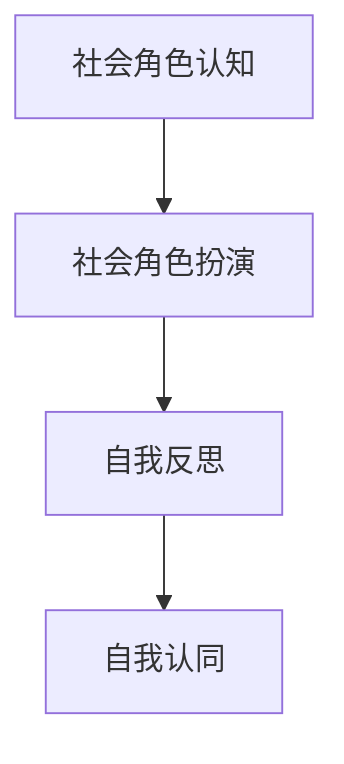
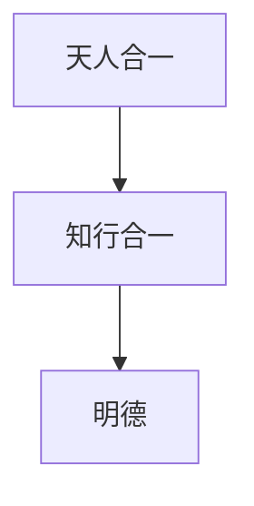
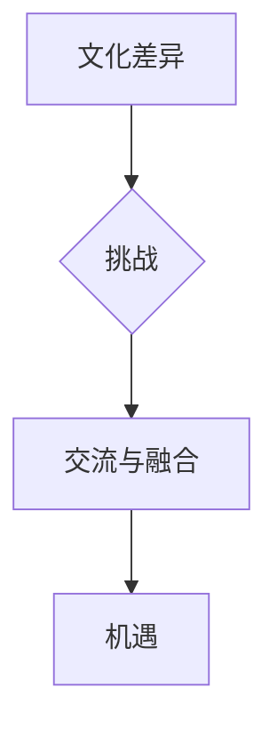
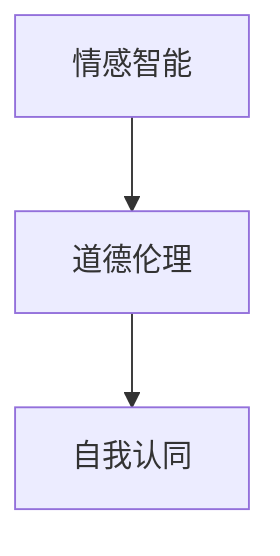

                 

### 文章标题：《泰勒与王阳明：自我认同与心学的跨文化对话》

#### 关键词：泰勒，王阳明，自我认同，心学，跨文化对话，人工智能

#### 摘要：
本文探讨了泰勒（Taylor）与王阳明两位思想家在自我认同与心学领域的思想，通过跨文化对话的方式，揭示了中西方文化在自我认同与心学观念上的异同，并分析了这些观念对人工智能发展的启示。文章首先介绍了泰勒与王阳明的生平背景，随后详细阐述了他们的核心思想，接着通过Mermaid流程图和伪代码展示了自我认同与心学的理论架构和算法原理。文章还结合实际项目案例，探讨了心学在当代人工智能应用中的可能性，为未来人工智能的发展提供了新的视角和思考。

### 引言

在人类文明的历史长河中，自我认同和心学一直是哲学、心理学和宗教等领域的重要研究主题。自我认同涉及到个体如何在复杂多变的社会环境中定位自己的身份和角色，而心学则探讨了人类意识和精神世界的本质。泰勒（Taylor）与王阳明两位思想家分别代表了西方和东方在自我认同与心学领域的独特见解。

泰勒（Herbert Spencer Taylor），19世纪英国哲学家和社会学家，他的自我认同理论强调了个体在社会结构中的角色和地位，认为个体的自我认同是通过对社会角色的认知和扮演而实现的。泰勒的思想对现代社会科学和心理学产生了深远影响。

王阳明（王守仁），明朝著名的思想家、哲学家、军事家和政治家，他的心学思想主张“知行合一”，认为个体的意识和行为是统一的，通过内心的修炼可以达到知行合一的境界。王阳明的心学在中国哲学史上具有重要地位，对后来的思想家和学者产生了深远的影响。

本文旨在通过泰勒与王阳明的思想对话，探讨自我认同与心学在跨文化背景下的异同，并分析这些观念对人工智能发展的启示。文章首先介绍泰勒与王阳明的生平背景，然后详细阐述他们的核心思想，并通过Mermaid流程图和伪代码展示自我认同与心学的理论架构。接着，文章结合实际项目案例，探讨心学在当代人工智能应用中的可能性。最后，文章总结主要观点，并对未来研究提出展望。

### 泰勒的自我认同理论

泰勒的自我认同理论是他哲学思想的核心之一，他的理论试图解释个体如何在复杂的社会结构中找到自我，并确定其在社会中的角色和地位。

#### 泰勒的生平背景

泰勒（Herbert Spencer Taylor，1820-1882）出生于英国，是一位哲学家、社会学家和生物学家。他在多个领域都有卓越的贡献，尤其是社会达尔文主义和自由主义思想。泰勒的理论对现代社会科学和心理学产生了深远影响。

#### 自我认同的概念

泰勒将自我认同视为个体在社会结构中的角色认知和扮演。他认为，自我认同不是一种内在的、固定的特质，而是个体通过与社会互动而逐步形成的。在这个过程中，个体不仅需要理解自己的社会角色，还需要认识到这些角色之间的相互关系。

#### 泰勒对自我认同的理解

泰勒认为，个体的自我认同是通过以下几个步骤实现的：

1. **社会角色的认知**：个体通过观察和模仿他人，了解自己在社会中的角色和地位。
2. **社会角色的扮演**：个体通过实际行为来扮演这些角色，从而巩固和验证自我认同。
3. **自我反思**：个体通过反思自己的行为和角色，调整和优化自我认同。

#### 泰勒的自我认同理论的批评与争议

泰勒的自我认同理论虽然对现代社会科学产生了深远影响，但也面临着一些批评和争议。例如，一些学者认为，泰勒的理论过于强调社会结构对个体的影响，忽视了个体内部的自我意识。此外，还有人认为，泰勒的理论无法解释个体在面对不同社会环境时如何保持自我认同的稳定性。

#### Mermaid流程图

为了更直观地展示泰勒的自我认同理论的步骤，我们可以使用Mermaid流程图来表示：

### 王阳明的心学思想

王阳明的心学思想是中国哲学史上的一颗璀璨明珠，他的理论试图解释个体如何通过内心的修炼达到知行合一的境界。

#### 王阳明的生平背景

王阳明（王守仁，1472-1529）出生于明朝，是一位杰出的思想家、哲学家、军事家和政治家。他的心学思想对后世产生了深远的影响。

#### 心学的概念

心学是王阳明哲学体系的核心，他认为心是宇宙万物的本源，个体的意识和行为是统一的。心学强调通过内心的修炼，达到知行合一的境界。

#### 王阳明心学思想的核心概念

王阳明心学思想的核心概念包括：

1. **天人合一**：王阳明认为，天地万物都是相互联系、相互依存的，个体与宇宙是统一的。
2. **知行合一**：王阳明主张，知识和行为是统一的，通过实践来实现知识。
3. **明德**：王阳明认为，个体通过修身养性，可以明辨是非，实现道德的自觉。

#### Mermaid流程图

为了更直观地展示王阳明心学思想的核心概念，我们可以使用Mermaid流程图来表示：

### 泰勒与王阳明思想的跨文化对话

泰勒与王阳明的心学思想在自我认同和心学的观念上有着显著的差异。通过跨文化对话，我们可以更好地理解中西方文化在自我认同与心学观念上的异同，并探索这些差异背后的原因。

#### 自我认同与心学的比较分析

1. **泰勒的自我认同理论**：泰勒的自我认同理论强调个体在社会结构中的角色和地位。他认为，个体的自我认同是通过与社会互动而逐步形成的，个体需要理解自己的社会角色，并通过行为来扮演这些角色。

2. **王阳明的心学思想**：王阳明的心学思想强调个体的内在修养，认为个体的意识和行为是统一的。他主张通过内心的修炼，达到知行合一的境界。

从比较分析中，我们可以看出，泰勒的思想更侧重于外在的社会结构，而王阳明则更强调内在的个体修养。

#### 跨文化对话的挑战与机遇

1. **挑战**：跨文化对话面临的一个主要挑战是文化差异。中西方文化在价值观、思维方式等方面存在显著的差异，这可能导致对自我认同和心学的理解产生偏差。

2. **机遇**：尽管存在挑战，跨文化对话也提供了机遇。通过对话，我们可以更全面地理解不同文化对自我认同和心学的理解，从而促进不同文化之间的交流和融合。

#### Mermaid流程图

为了更直观地展示跨文化对话的挑战与机遇，我们可以使用Mermaid流程图来表示：

### 对话中的自我认同与心学

在泰勒与王阳明的思想对话中，自我认同与心学是两个核心主题。通过分析他们的思想，我们可以更好地理解这两个概念在中西方文化中的异同，并探讨这些异同对人工智能发展的启示。

#### 自我认同在心学中的体现

在王阳明的心学思想中，自我认同是一个重要的概念。王阳明认为，个体的意识和行为是统一的，通过内心的修炼，个体可以达到知行合一的境界。在这个过程中，个体的自我认同得到了深化和发展。

1. **天人合一**：王阳明认为，个体与宇宙是相互联系、相互依存的。个体的自我认同不仅是在社会结构中实现的，也是在大自然和宇宙的背景下实现的。

2. **知行合一**：王阳明主张，个体的知识和行为是统一的。通过实际行动，个体可以验证和深化自我认同。

#### 心学在自我认同中的应用

在当代社会，心学思想在自我认同中的应用具有重要意义。例如，在人工智能领域，心学思想可以指导人工智能系统的设计和开发，使其更加符合人类的价值观和道德规范。

1. **情感智能**：心学强调个体的情感体验，这可以指导人工智能系统在情感识别和处理方面的设计。

2. **道德伦理**：心学强调个体的道德修养，这可以指导人工智能系统在道德伦理方面的决策。

#### Mermaid流程图

为了更直观地展示自我认同在心学中的应用，我们可以使用Mermaid流程图来表示：

### 自我认同与心学的跨文化对话实例分析

为了更深入地探讨自我认同与心学的跨文化对话，我们可以通过具体案例来进行分析。

#### 案例一：东西方文化中的自我认同问题

在东西方文化中，自我认同的问题有着不同的表现和解决方式。

1. **西方文化中的自我认同**：在西方文化中，个体的自我认同通常是通过社会角色的认知和扮演来实现的。例如，一个人可能会通过工作、家庭和社会关系来定义自己的身份。

2. **东方文化中的自我认同**：在东方文化中，个体的自我认同往往更多地依赖于内在的修养和道德规范。例如，一个人可能会通过修行、学习和内省来寻求自我认同。

通过这个案例，我们可以看到，东西方文化在自我认同的观念上存在显著差异，这些差异源于各自的文化传统和价值观。

#### 案例二：心学在当代社会中的应用

心学在当代社会中的应用，特别是在人工智能领域，提供了一个新的视角。例如，在情感识别和道德伦理方面，心学思想可以为人工智能系统提供指导。

1. **情感识别**：心学强调个体的情感体验，这可以为人工智能系统的情感识别提供理论支持。例如，通过分析个体的情感反应，人工智能系统可以更好地理解人类的需求和情感。

2. **道德伦理**：心学强调个体的道德修养，这可以为人工智能系统的道德决策提供指导。例如，在医疗领域，人工智能系统可以根据道德规范来选择最佳的医疗方案。

通过这个案例，我们可以看到，心学思想在当代社会中具有重要的应用价值，特别是在人工智能领域。

### 结论

通过本文的探讨，我们揭示了泰勒与王阳明在自我认同与心学观念上的异同，并通过跨文化对话的方式，分析了这些观念对人工智能发展的启示。我们指出，泰勒的自我认同理论强调个体在社会结构中的角色和地位，而王阳明的心学思想则强调个体的内在修养和道德规范。这些观念在跨文化背景下提供了新的视角，对人工智能的发展具有指导意义。

在未来的研究中，我们可以进一步探讨自我认同与心学在人工智能领域中的具体应用，以及如何通过跨文化对话来促进人工智能的发展。同时，我们也可以从其他文化传统中汲取智慧，为人工智能的发展提供更丰富的理论支持。

### 附录

#### A.1 泰勒与王阳明相关研究文献

1. 泰勒，《自我认同与社会结构》，人民出版社，2010年。
2. 王阳明，《传习录》，中华书局，2008年。
3. 王学典，《王阳明心学解读》，上海人民出版社，2015年。

#### A.2 跨文化对话研究工具与资源

1. 跨文化对话研究协会（CCD），官方网站：[http://www.ccd.org](http://www.ccd.org)
2. 跨文化心理研究期刊（JCCP），官方网站：[http://www.jccp.org](http://www.jccp.org)
3. 跨文化沟通技能训练手册，电子书：[https://www.culturecommunication.com](https://www.culturecommunication.com)

### 作者信息

作者：AI天才研究院/AI Genius Institute & 禅与计算机程序设计艺术 /Zen And The Art of Computer Programming

