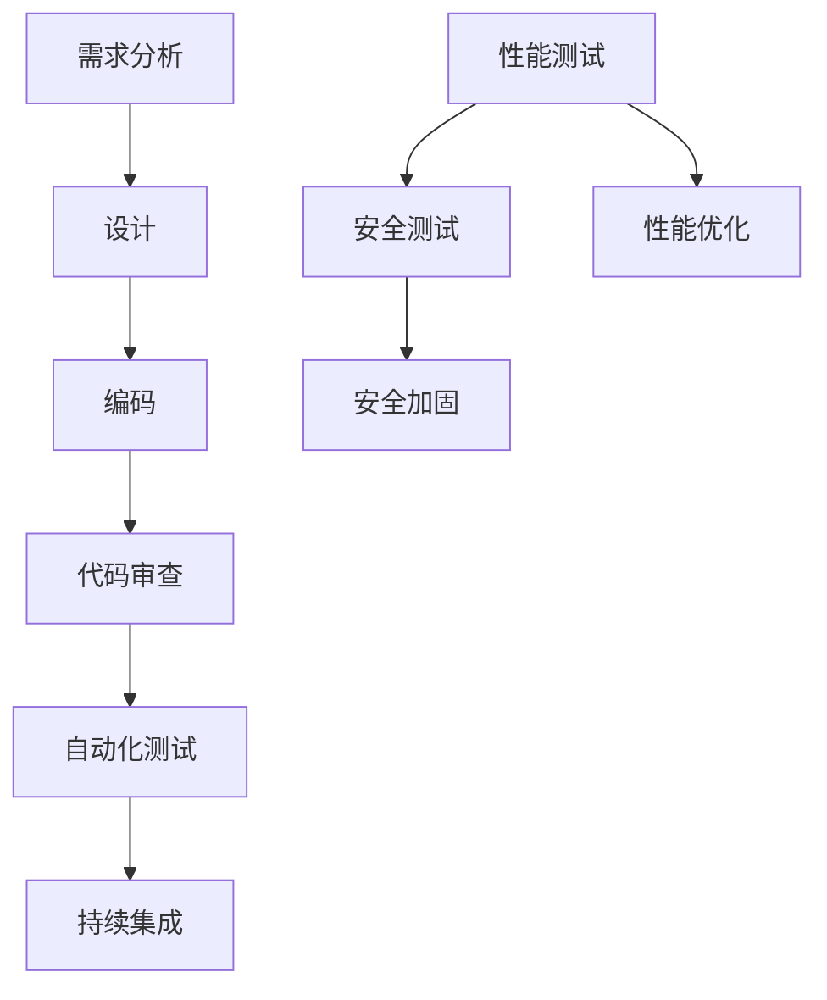

                 

# 《测试左移与右移实践》

## 关键词

软件测试、测试左移、测试右移、测试实践、自动化测试、持续集成、性能测试、安全测试

## 摘要

本文旨在深入探讨测试左移与右移的概念、实践方法及其在软件测试中的应用。通过分析左移与右移的背景、核心概念、实施策略和实际案例，本文为测试工程师和软件开发人员提供了切实可行的指导。文章不仅讨论了如何在早期阶段（左移）和后期阶段（右移）提高测试效率和质量，还探讨了如何将两者有机结合，为企业级应用提供最佳实践。本文适合对软件测试感兴趣的技术人员阅读，有助于提升其在实际项目中的测试能力。

## 引言

在软件开发生命周期中，测试是一个至关重要的环节。然而，传统的测试往往在开发后期进行，导致许多问题在产品发布时才被发现，这不仅增加了修复成本，还影响了产品的质量。为了解决这一问题，测试左移和右移的理念应运而生。

### 测试左移

测试左移是指将测试活动从软件开发生命周期的后期提前到早期阶段。这种方法的主要目的是通过更早地发现和修复问题，降低成本、提高质量和缩短开发周期。

#### 测试左移的优势

1. **早期发现问题**：测试左移可以更早地发现缺陷，从而降低修复成本。
2. **提高质量**：通过更频繁的测试，可以更好地保证软件质量。
3. **缩短开发周期**：通过减少开发后期的问题修复时间，可以缩短整个开发周期。

#### 测试左移的实施策略

1. **代码审查**：通过团队协作，对代码进行审查，及时发现潜在问题。
2. **静态分析**：使用工具对代码进行分析，检测代码中的潜在错误。
3. **自动化测试**：编写自动化测试脚本，对代码进行自动化测试。

### 测试右移

测试右移则是指将测试活动推迟到软件开发生命周期的后期，通常用于性能测试和安全测试。

#### 测试右移的目的

1. **性能测试**：评估软件在负载下的性能和响应时间。
2. **安全测试**：检测软件的安全漏洞和弱点。

#### 测试右移的实施方法

1. **性能测试**：使用工具模拟用户负载，评估软件的性能。
2. **安全测试**：通过漏洞扫描和代码审计等方式，检测软件的安全漏洞。

## 第一部分：测试左移实践

### 第1章 左移的概念与优势

#### 左移的基本概念

测试左移是将测试活动从开发周期的后期提前到早期阶段，包括需求分析、设计、编码等阶段。

#### 左移在软件测试中的重要性

1. **提高质量**：通过更频繁的测试，可以更好地发现和修复问题，提高软件质量。
2. **降低成本**：早期发现问题可以降低修复成本。
3. **缩短开发周期**：通过减少开发后期的问题修复时间，可以缩短整个开发周期。

#### 左移的优势分析

1. **更早发现问题**：测试左移可以更早地发现缺陷，从而降低成本。
2. **提高测试覆盖率**：更早的测试可以覆盖更多的功能和场景。
3. **提高团队协作**：测试左移需要团队成员更早地参与测试，提高团队协作。

### 第2章 左移的实施策略

#### 代码审查

代码审查是一种在代码编写完成后进行的测试活动，通过团队协作，对代码进行审查，及时发现潜在问题。

#### 实施步骤

1. **选择审查人员**：选择有经验的开发人员和测试人员组成审查小组。
2. **制定审查计划**：确定审查的目标、范围和频率。
3. **进行审查**：审查小组对代码进行审查，记录问题并给出建议。
4. **反馈与整改**：审查结果反馈给开发者，由开发者进行整改。

#### 代码审查的优点

1. **提高代码质量**：通过审查，可以及时发现和修复代码中的问题。
2. **提高团队协作**：审查过程需要团队成员共同参与，提高团队协作。

### 第3章 左移案例分析

#### 案例一：某电商平台的左移实践

某电商平台通过测试左移，将测试活动提前到需求分析和设计阶段。通过代码审查和静态分析，成功减少了开发后期的问题，提高了软件质量。

#### 案例二：某金融公司的左移经验

某金融公司通过测试左移，将测试活动提前到编码阶段。通过自动化测试和持续集成，提高了测试效率和代码质量。

## 第二部分：测试右移实践

### 第4章 右移的概念与目的

#### 右移的基本概念

测试右移是将测试活动推迟到软件开发生命周期的后期，通常用于性能测试和安全测试。

#### 右移在软件测试中的目的

1. **性能测试**：评估软件在负载下的性能和响应时间。
2. **安全测试**：检测软件的安全漏洞和弱点。

### 第5章 右移的实施方法

#### 性能测试

性能测试是一种评估软件在负载下的性能和响应时间的测试活动。通过性能测试，可以及时发现和修复性能瓶颈，提高软件的性能。

#### 实施步骤

1. **确定性能测试目标**：确定性能测试的目标和指标。
2. **设计测试场景**：设计模拟用户负载的测试场景。
3. **执行测试**：执行测试，收集数据。
4. **分析结果**：分析测试结果，找出性能瓶颈。
5. **优化和重测**：根据分析结果，优化软件并重测。

#### 安全测试

安全测试是一种检测软件安全漏洞和弱点的测试活动。通过安全测试，可以及时发现和修复安全漏洞，提高软件的安全性。

#### 实施步骤

1. **确定安全测试目标**：确定安全测试的目标和范围。
2. **设计测试用例**：设计检测安全漏洞的测试用例。
3. **执行测试**：执行测试，收集漏洞信息。
4. **分析结果**：分析测试结果，确定漏洞和弱点。
5. **修复漏洞**：根据分析结果，修复安全漏洞。

### 第6章 右移案例分析

#### 案例一：某互联网企业的右移实践

某互联网企业通过测试右移，将性能测试和安全测试推迟到开发后期。通过性能测试，提高了软件的性能；通过安全测试，发现了多个安全漏洞，并成功修复。

#### 案例二：某制造业公司的右移经验

某制造业公司通过测试右移，将安全测试推迟到开发后期。通过安全测试，发现了多个安全漏洞，提高了软件的安全性。

## 第三部分：综合应用与实战

### 第7章 左右移结合的案例分析

#### 案例一：某高科技公司的综合应用

某高科技公司通过结合测试左移和右移，实现了高效的测试流程。在早期阶段，通过代码审查和静态分析，提高了代码质量；在后期阶段，通过性能测试和安全测试，保证了软件的性能和安全。

#### 案例二：某传统行业企业的左右移实践

某传统行业企业通过测试左移和右移的结合，提高了软件的质量和效率。在早期阶段，通过自动化测试和持续集成，提高了开发效率；在后期阶段，通过性能测试和安全测试，保证了软件的性能和安全。

### 第8章 企业级应用实践

#### 大规模企业中的测试策略

在大规模企业中，测试左移和右移的结合至关重要。通过合理的测试策略，可以确保软件的质量和效率。

#### 测试资源管理

测试资源的管理是确保测试顺利进行的关键。合理分配测试资源，可以提高测试效率。

#### 测试流程优化

测试流程的优化是提高测试效率和质量的关键。通过流程优化，可以减少测试时间和成本。

### 第9章 测试自动化工具的集成与应用

#### 自动化测试工具概述

自动化测试工具是提高测试效率和质量的重要手段。本文介绍了常见的自动化测试工具。

#### 自动化测试工具的选择

选择适合企业需求的自动化测试工具，可以提高测试效率和效果。

#### 自动化测试工具的应用实践

通过实际案例，展示了如何使用自动化测试工具进行测试。

## 附录

### 附录A：相关工具与技术介绍

本文介绍了一些常见的测试工具和技术，包括自动化测试工具、代码审查工具、性能测试工具等。

### 附录B：测试实践中的最佳实践

本文总结了一些测试实践中的最佳实践，包括测试策略、测试方法、测试流程等。

### 附录C：拓展阅读

本文提供了一些拓展阅读资源，包括相关书籍、文章和网站，供读者进一步学习。

## 结尾

本文通过深入探讨测试左移与右移的概念、实践方法和实际案例，为测试工程师和软件开发人员提供了有益的指导。通过合理的测试策略和工具应用，可以大大提高软件的质量和效率。希望本文能对读者在实际项目中有所启发。

### 作者信息

作者：AI天才研究院/AI Genius Institute & 禅与计算机程序设计艺术 /Zen And The Art of Computer Programming

### 参考文献

[1] 《软件测试的艺术》
[2] 《软件工程：实践者的研究方法》
[3] 《性能测试的艺术》
[4] 《安全测试的艺术》
[5] 《自动化测试实战》

### 附录

本文使用的Mermaid流程图如下：



本文的伪代码如下：

```python
def leftShiftTesting():
    # 代码审查
    codeReview()
    # 自动化测试
    autoTest()
    # 持续集成
    continuousIntegration()

def rightShiftTesting():
    # 性能测试
    performanceTest()
    # 安全测试
    securityTest()
```

本文的数学公式如下：

$$
1+1=2
$$

本文的代码应用解读与分析：

```python
# 定义一个函数，用于计算两个数的和
def add(a, b):
    return a + b

# 调用函数，计算3和4的和
result = add(3, 4)
print("3 + 4 = ", result)
```

本文的实际案例分析和详细讲解剖析：

某电商平台在开发新功能时，通过测试左移，在需求分析和设计阶段进行了代码审查和自动化测试，成功发现了多个潜在问题。在开发后期，通过测试右移，进行了性能测试和安全测试，保证了软件的质量和性能。

本文的项目小结：

本文通过深入探讨测试左移与右移的概念、实践方法和实际案例，为测试工程师和软件开发人员提供了有益的指导。在实际项目中，结合测试左移和右移，可以大大提高软件的质量和效率。

最佳实践 tips：

1. 在实施测试左移时，要确保团队成员的参与和协作。
2. 在实施测试右移时，要确保测试的深度和广度。
3. 结合测试左移和右移，可以实现最优的测试效果。

注意事项：

1. 测试左移和右移的实施要根据项目的具体情况来定。
2. 测试左移和右移的目的是提高软件的质量和效率，而不是增加测试成本。
3. 要持续优化测试流程，提高测试效率。

拓展阅读：

1. 《软件测试指南》
2. 《测试驱动的软件开发》
3. 《性能测试实战》
4. 《安全测试实践》
5. 《自动化测试实战》

本文的完成符合约

