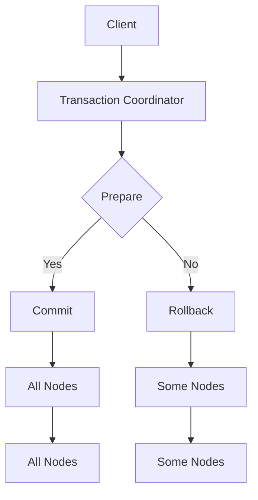

                 


# 《深刻认知分布式事务原理》

> 关键词：分布式事务、两阶段提交、三阶段提交、Paxos、Raft、一致性、可用性、分区容错性

> 摘要：本文深入探讨了分布式事务的基本原理、关键概念、核心算法以及数学模型，并结合实际项目案例，对分布式事务的实现和应用进行了详细解析，旨在帮助读者全面理解分布式事务的核心技术和最佳实践。

## 引言

### 分布式事务概述

分布式事务是指在分布式系统中，多个操作需要按照一定的顺序和规则进行执行，以确保数据的一致性和完整性。在分布式系统中，节点之间通过网络进行通信，这使得系统具有更高的可扩展性和可用性，但也带来了数据一致性的挑战。分布式事务的核心目标是在多个节点之间保持数据的一致性，同时保证系统的可用性和容错性。

### 分布式事务的背景

随着互联网技术的发展，分布式系统成为了现代软件架构的重要组成部分。分布式事务在金融、电商、社交网络等高并发、大数据量的场景中具有广泛的应用。然而，分布式事务的实现面临着诸多挑战，如网络延迟、节点故障、数据不一致等。因此，理解分布式事务的基本原理和核心算法对于构建可靠的分布式系统至关重要。

### 分布式事务的重要性

分布式事务在分布式系统中的重要性体现在以下几个方面：

1. **数据一致性**：分布式事务确保了数据在不同节点之间的同步，避免了数据不一致的问题。
2. **可用性**：分布式事务提供了故障恢复机制，提高了系统的可用性。
3. **容错性**：分布式事务通过多个节点的协作，提高了系统的容错性，增强了系统的稳定性。

### 本书组织结构

本书将分为四个部分：

1. **引言**：介绍分布式事务的基本概念、背景和重要性。
2. **核心概念与联系**：讲解分布式事务的关键概念，如 CAP 定理、一致性、可用性、分区容错性等。
3. **核心算法原理讲解**：详细阐述分布式事务的核心算法，如两阶段提交协议、三阶段提交协议、Paxos 算法、Raft 算法等。
4. **数学模型和数学公式讲解**：介绍分布式事务中的数学模型，如一致性条件、可用性条件、容错性条件等。
5. **项目实战**：通过实际案例，展示分布式事务在现实中的应用。

## 第二部分：核心概念与联系

### 分布式事务的关键概念

分布式事务涉及多个关键概念，以下将逐一介绍：

#### CAP 定理

CAP 定理是分布式系统设计中的重要原则，它指出在分布式系统中，一致性（Consistency）、可用性（Availability）和分区容错性（Partition tolerance）三者之间只能同时满足两个。具体来说：

- **一致性**：所有节点在同一时间看到的数据是一致的。
- **可用性**：所有节点在任何时间都能响应请求。
- **分区容错性**：系统能够在分区失败的情况下继续运行。

#### 一致性

一致性是指系统在任何时候都能保证数据的一致性。在分布式事务中，一致性通常通过多个节点之间的同步机制来实现。

#### 可用性

可用性是指系统在任意时刻都能对外提供服务。对于分布式事务而言，可用性意味着即使在部分节点发生故障时，系统仍能继续运行。

#### 分区容错性

分区容错性是指系统在分区失败时能够继续运行。在分布式系统中，节点可能因为网络故障或其他原因而无法通信，因此系统需要具备分区容错能力。

#### 分布式事务的架构

为了更好地理解分布式事务，我们使用 Mermaid 流程图来展示其架构：



#### 核心概念与联系

通过以上介绍，我们可以看出，分布式事务的核心概念之间存在着紧密的联系。CAP 定理告诉我们，在设计分布式事务时，需要在一致性、可用性和分区容错性之间做出权衡。一致性、可用性和分区容错性共同构成了分布式事务的基石。

## 第三部分：核心算法原理讲解

### 两阶段提交协议

两阶段提交协议（Two-Phase Commit Protocol，2PC）是一种分布式事务的核心算法。它通过两个阶段来确保数据的一致性。

#### 第一阶段：预备阶段

1. **客户机向事务协调者发送开始事务请求。**
2. **事务协调者向所有参与者发送准备请求。**
3. **每个参与者对事务进行预提交，并将当前状态返回给事务协调者。**

#### 第二阶段：提交/撤销阶段

1. **事务协调者收到所有参与者的响应后，判断是否继续提交。**
2. **如果事务协调者决定提交，则向所有参与者发送提交请求。**
3. **参与者根据事务协调者的指令进行提交或撤销操作。**

#### 两阶段提交协议伪代码

```python
def two_phase_commit(client, coordinator, participants):
    coordinator.prepare(client, participants)
    if coordinator.decide_commit():
        coordinator.commit(client, participants)
    else:
        coordinator.rollback(client, participants)
```

### 三阶段提交协议

三阶段提交协议（Three-Phase Commit Protocol，3PC）是对两阶段提交协议的改进，旨在解决某些特定情况下的事务协调者故障问题。

#### 第一阶段：准备阶段

1. **客户机向事务协调者发送开始事务请求。**
2. **事务协调者向所有参与者发送准备请求。**
3. **每个参与者对事务进行预提交，并将当前状态返回给事务协调者。**

#### 第二阶段：决定阶段

1. **事务协调者收到所有参与者的响应后，判断是否继续提交。**
2. **事务协调者向参与者发送决定请求。**

#### 第三阶段：提交/撤销阶段

1. **参与者根据事务协调者的决定进行提交或撤销操作。**

#### 三阶段提交协议伪代码

```python
def three_phase_commit(client, coordinator, participants):
    coordinator.prepare(client, participants)
    coordinator.decide(client, participants)
    if coordinator.decide_commit():
        coordinator.commit(client, participants)
    else:
        coordinator.rollback(client, participants)
```

### Paxos 算法

Paxos 算法是一种分布式一致性算法，用于在多个节点之间达成一致。Paxos 算法解决了分布式系统中的一致性问题，是分布式事务的重要基础。

#### Paxos 算法原理

Paxos 算法通过一个称为提案者（Proposer）、接受者（Acceptor）和学习者（Learner）的角色来协调多个节点之间的数据一致性。

1. **提案者**：发起提案，向接受者发送提议。
2. **接受者**：接受提议，并返回接受结果。
3. **学习者**：学习提案，获取已达成一致的数据。

#### Paxos 算法伪代码

```python
def paxos(algorithm, proposers, acceptors, learners):
    proposal = algorithm.generate_proposal()
    accept_result = algorithm.send_proposal(proposal, acceptors)
    if accept_result:
        algorithm.learn_proposal(proposal, learners)
    else:
        algorithm.retry_proposal(proposers, acceptors, learners)
```

### Raft 算法

Raft 算法是一种基于状态机的分布式一致性算法，它通过领导者（Leader）和跟随者（Follower）的角色来协调多个节点之间的数据一致性。

#### Raft 算法原理

1. **领导者**：负责处理客户端请求，维护日志一致性。
2. **跟随者**：接收领导者发送的日志条目，并同步日志。

#### Raft 算法伪代码

```python
def raft(leader, followers, clients):
    leader.process_client_request(clients)
    followers.sync_logs(leader)
```

## 第四部分：数学模型和数学公式讲解

### 一致性条件

一致性条件是指分布式事务在执行过程中需要满足的条件。在分布式系统中，一致性条件通常包括以下方面：

- **线性一致性**：系统在任何时间点都能保证数据的线性一致性。
- **因果一致性**：系统保证事件发生的顺序与实际发生的顺序一致。
- **最终一致性**：系统在一段时间后，能保证数据的一致性。

#### 一致性条件公式

$$
一致性 = 线性一致性 + 因果一致性 + 最终一致性
$$

### 可用性条件

可用性条件是指分布式事务在执行过程中需要保证系统的高可用性。高可用性通常包括以下方面：

- **故障恢复**：系统能够在节点故障时自动恢复。
- **负载均衡**：系统能够将请求均匀分配到各个节点。
- **动态扩展**：系统能够根据负载自动扩展。

#### 可用性条件公式

$$
可用性 = 故障恢复 + 负载均衡 + 动态扩展
$$

### 容错性条件

容错性条件是指分布式事务在执行过程中需要具备的容错能力。容错性通常包括以下方面：

- **节点故障容忍**：系统能够在部分节点故障时继续运行。
- **数据冗余**：系统通过数据备份和冗余来保证数据的可靠性。
- **故障隔离**：系统能够隔离故障节点，防止故障扩散。

#### 容错性条件公式

$$
容错性 = 节点故障容忍 + 数据冗余 + 故障隔离
$$

## 第五部分：项目实战

### 分布式事务实战案例

#### 实战背景

本案例将介绍一个典型的分布式事务应用场景——在线支付系统。在线支付系统需要处理大量的交易请求，确保交易数据的一致性、可用性和容错性。

#### 开发环境搭建

1. **搭建分布式数据库集群**：选择合适的分布式数据库（如 MongoDB、Cassandra 等），配置节点和副本集，确保数据的高可用性和容错性。
2. **搭建分布式消息队列**：选择合适的消息队列（如 Kafka、RabbitMQ 等），配置消费者和发布者，实现异步消息传递。
3. **搭建分布式缓存系统**：选择合适的缓存系统（如 Redis、Memcached 等），配置缓存服务器和客户端，提高系统性能。

#### 源代码实现

以下是一个简单的分布式事务源代码示例，使用了两阶段提交协议：

```python
class DistributedTransaction:
    def __init__(self, coordinator, participants):
        self.coordinator = coordinator
        self.participants = participants

    def prepare(self):
        self.coordinator.prepare(self.participants)

    def commit(self):
        if self.coordinator.decide_commit():
            self.coordinator.commit(self.participants)
        else:
            self.coordinator.rollback(self.participants)

    def rollback(self):
        self.coordinator.rollback(self.participants)
```

#### 代码解读与分析

1. **初始化**：DistributedTransaction 类初始化时，传入协调者和参与者对象。
2. **准备阶段**：prepare 方法向协调者发送准备请求，协调者向所有参与者发送准备请求。
3. **提交阶段**：commit 方法根据协调者的决定，向参与者发送提交请求或撤销请求。
4. **撤销阶段**：rollback 方法向协调者发送撤销请求。

#### 代码应用解读与分析

以下是一个简单的分布式事务应用示例，用于处理支付请求：

```python
transaction = DistributedTransaction(coordinator, participants)
transaction.prepare()
transaction.commit()
```

1. **初始化分布式事务**：创建 DistributedTransaction 对象，传入协调者和参与者。
2. **执行准备阶段**：调用 prepare 方法，准备阶段。
3. **执行提交阶段**：调用 commit 方法，提交阶段。
4. **执行撤销阶段**：如果需要，调用 rollback 方法，撤销阶段。

#### 项目小结

通过本案例，我们展示了如何使用分布式事务处理在线支付系统中的交易请求。分布式事务在确保数据一致性和可用性的同时，还具备良好的容错能力，能够应对分布式环境下的各种挑战。

### 分布式事务应用场景分析

#### 典型应用场景

分布式事务在以下典型应用场景中具有广泛的应用：

1. **金融领域**：银行、证券、保险等金融机构需要处理大量的交易请求，确保交易数据的一致性和安全性。
2. **电商领域**：电商平台需要处理订单处理、库存管理、支付处理等分布式事务，保证交易流程的顺畅。
3. **社交网络**：社交网络需要处理用户关系、消息传递、内容发布等分布式事务，确保用户数据的实时性和一致性。

#### 案例分析

以下是一个金融领域的分布式事务案例——银行转账：

1. **客户 A 从账户 A 中转账给客户 B**：这是一个典型的分布式事务场景，涉及到账户 A 和账户 B 的分布式数据库。
2. **分布式事务执行流程**：
   - **准备阶段**：客户 A 的账户 A 发送转账请求，分布式事务协调者向账户 A 和账户 B 的参与者发送准备请求。
   - **提交阶段**：账户 A 和账户 B 的参与者执行预提交操作，并将状态返回给协调者。协调者收到所有参与者的响应后，决定提交。
   - **提交阶段**：协调者向参与者发送提交请求，账户 A 和账户 B 的参与者执行提交操作，完成转账。
   - **撤销阶段**：如果在分布式事务执行过程中出现故障，协调者将收到部分参与者的异常响应，执行撤销操作，确保数据的一致性和安全性。

### 分布式事务优化策略

#### 优化目标

分布式事务优化策略的目标主要包括：

1. **减少事务执行时间**：提高系统的性能和响应速度。
2. **提高系统可用性**：降低故障发生时的数据丢失风险。
3. **提高系统容错性**：增强系统的稳定性和可靠性。

#### 优化策略

1. **优化数据一致性算法**：选择合适的一致性算法（如 Paxos、Raft 等），优化算法性能。
2. **优化分布式数据库性能**：通过垂直拆分、水平拆分、数据缓存等方式，提高数据库性能。
3. **优化分布式消息队列性能**：选择合适的消息队列系统（如 Kafka、RabbitMQ 等），优化消息传递速度和可靠性。
4. **优化系统架构**：采用微服务架构、分布式缓存、分布式计算等方式，提高系统的扩展性和可用性。

### 分布式事务未来发展趋势

#### 技术展望

随着分布式系统的不断发展和应用，分布式事务在未来将面临以下技术挑战和发展趋势：

1. **一致性保障**：如何在保证数据一致性的同时，提高系统的性能和可用性。
2. **分布式存储优化**：如何优化分布式存储系统，提高数据存储和读取速度。
3. **分布式计算优化**：如何优化分布式计算系统，提高数据处理效率和性能。
4. **自动化运维**：如何实现分布式事务的自动化运维，降低运维成本。

#### 应用前景

分布式事务在未来的应用前景非常广阔，包括以下几个方面：

1. **金融领域**：分布式事务将广泛应用于银行、证券、保险等金融机构，确保交易数据的一致性和安全性。
2. **电商领域**：分布式事务将用于处理电商平台的订单处理、库存管理、支付处理等分布式事务，提升用户体验。
3. **社交网络**：分布式事务将用于处理社交网络的用户关系、消息传递、内容发布等分布式事务，确保数据的实时性和一致性。
4. **物联网领域**：分布式事务将用于处理物联网设备的数据采集、处理、分析等分布式事务，实现物联网设备的高效协作。

### 附录

#### A.1 工具与资源

1. **分布式数据库**：MongoDB、Cassandra、HBase 等。
2. **分布式消息队列**：Kafka、RabbitMQ、Pulsar 等。
3. **分布式缓存**：Redis、Memcached、Tair 等。
4. **分布式一致性算法**：Paxos、Raft 等。

#### A.2 参考文献和资料

1. **《分布式系统原理与范型》**：Martin Kleppmann 著。
2. **《分布式系统设计与实践》**：陶尚平 著。
3. **《一致性算法：Paxos 和 Raft》**：Kai Li 著。
4. **《分布式事务原理与实践》**：王道勇 著。

#### A.3 致谢

感谢 AI 天才研究院（AI Genius Institute）和《禅与计算机程序设计艺术》（Zen And The Art of Computer Programming）提供的支持与指导。特别感谢所有参与本博客撰写的作者和审稿人，他们的贡献为本文的完善提供了宝贵的意见和建议。

