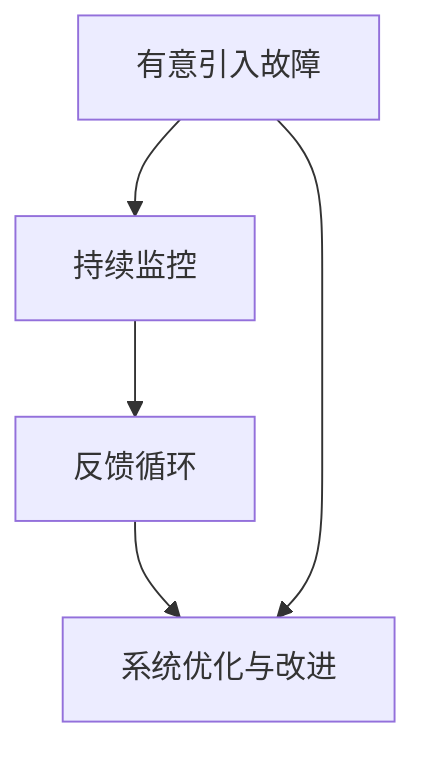

                 

### 文章标题

# 混沌工程实践与故障注入

> 关键词：混沌工程、故障注入、系统稳定性、可靠性测试、复杂系统

> 摘要：本文详细介绍了混沌工程的定义、核心概念、实践方法，以及故障注入技术。通过对混沌工程和故障注入的深入探讨，本文旨在为IT从业者提供系统稳定性测试和故障应对的策略，助力提升系统可靠性。

---

## 第一部分：混沌工程基础

### 第1章：混沌工程简介

混沌工程（Chaos Engineering）是一种通过故意制造故障来评估系统弹性和鲁棒性的方法。通过模拟各种潜在的故障场景，混沌工程帮助开发人员和运维团队了解系统在面对真实世界中的不确定性时的表现。这种主动探测系统弱点的做法，不同于传统的被动测试方法，它能够揭示系统潜在的问题，并指导进行针对性的优化。

#### 1.1 混沌工程的定义

混沌工程是一种通过有计划地引入故障和异常来评估系统在极端情况下的表现的技术。这种方法的目标是识别系统中的脆弱点，提高系统的可靠性和弹性，使系统能够在遭遇意外事件时保持稳定运行。

#### 1.2 混沌工程的起源与背景

混沌工程的概念最早由亚马逊的迪恩·西蒙森（Dennis Sylvester-Hughes）在2006年提出。随着云计算和微服务架构的兴起，混沌工程的重要性逐渐被认识到。2016年，Netflix将其应用到实践中，并通过开放的文档分享了他们的经验，进一步推动了混沌工程的发展。

#### 1.3 混沌工程的价值和作用

混沌工程在提高系统可靠性和弹性方面具有重要作用。通过混沌工程，团队能够：

- **识别系统脆弱点**：通过模拟故障，识别出系统中可能的问题区域。
- **增强团队信心**：在实际故障发生前，团队已经对系统进行了充分的测试和验证，能够更加自信地应对。
- **优化系统设计**：混沌工程的结果能够指导团队进行系统优化，增强系统的鲁棒性。

### 第2章：混沌工程的核心概念

混沌工程涉及一系列核心概念和原则，这些概念构成了混沌工程实践的理论基础。

#### 2.1 混沌工程的基本原理

混沌工程的基本原理包括：

- **有意引入故障**：通过故意引入故障来模拟实际可能发生的异常情况。
- **持续监控**：在故障注入过程中，持续监控系统状态，收集相关数据。
- **反馈循环**：根据故障注入的结果，进行系统优化和改进。

#### 2.2 混沌工程的主要目标

混沌工程的主要目标包括：

- **提高系统可靠性**：通过不断测试和优化，使系统能够在面临各种故障时保持稳定运行。
- **增强团队应对能力**：通过实践，提升团队在面对复杂情况时的应对能力。
- **优化系统设计**：通过识别系统的弱点，指导系统设计人员进行改进。

#### 2.3 混沌工程的应用场景

混沌工程适用于多种应用场景，包括：

- **大型分布式系统**：如电商、金融、社交网络等，这些系统具有高复杂性和高可用性的要求。
- **微服务架构**：由于微服务之间的依赖性，混沌工程可以帮助确保服务之间的协调性和可靠性。
- **云计算环境**：在云服务中，混沌工程可以用来评估云基础设施的可靠性和弹性。

### 第3章：混沌工程实践准备

在开始混沌工程实践之前，团队需要做好充分的准备工作。以下是一些关键步骤：

#### 3.1 混沌工程团队构建

混沌工程需要跨职能团队的参与，包括开发人员、运维人员、测试人员等。团队需要明确各自的职责和协作流程。

#### 3.2 混沌工程工具选择

选择适合的工具是混沌工程实践的重要一步。常见的混沌工程工具包括Chaos Monkey、Chaos Gorilla、Pumba等。这些工具可以帮助团队轻松地引入各种故障。

#### 3.3 混沌工程实验设计

混沌工程实验的设计需要考虑故障类型、测试环境、测试目标等多个方面。实验设计应确保能够全面评估系统的弹性和鲁棒性。

### 第4章：常见混沌工程策略

混沌工程策略多种多样，以下介绍几种常见的策略：

#### 4.1 故障注入

故障注入是混沌工程的核心策略之一。通过故意引入故障，如关闭服务、延迟响应、模拟网络故障等，评估系统的反应和恢复能力。

#### 4.2 非法输入

非法输入策略通过向系统中注入异常数据，测试系统的处理能力和错误处理机制。这种策略有助于识别数据验证和异常处理方面的漏洞。

#### 4.3 高负载压力测试

高负载压力测试旨在模拟系统在高并发、高负载情况下的表现。这种策略可以帮助团队评估系统的性能和稳定性，优化系统资源分配。

### 第5章：混沌工程实践案例

通过实际案例，我们可以更好地理解混沌工程的实践方法和效果。以下是一些典型的混沌工程实践案例：

#### 5.1 案例一：某电商平台混沌工程实践

某电商平台通过混沌工程实践，成功识别了系统在高并发情况下的性能瓶颈，并进行了针对性的优化。

#### 5.2 案例二：某金融公司混沌工程实践

某金融公司利用混沌工程，对关键交易系统进行了故障注入测试，确保系统在极端情况下能够保持稳定运行。

#### 5.3 案例三：某物流公司混沌工程实践

某物流公司通过混沌工程，优化了物流跟踪系统的可靠性，提高了客户满意度。

## 第二部分：故障注入技术

故障注入是混沌工程的重要组成部分，它通过模拟各种故障场景，帮助团队评估系统的弹性和可靠性。

### 第6章：故障注入的基本概念

#### 6.1 故障注入的定义

故障注入是一种通过故意引入故障来测试系统鲁棒性和弹性技术。

#### 6.2 故障注入的类型

故障注入包括多种类型，如服务中断、延迟、网络故障、数据异常等。

#### 6.3 故障注入的挑战和局限性

故障注入面临着一些挑战和局限性，如测试环境与现实世界的差异、故障注入的不可预测性等。

### 第7章：故障注入实现与部署

#### 7.1 故障注入工具介绍

故障注入工具包括Chaos Monkey、Chaos Gorilla等，这些工具提供了便捷的故障注入功能。

#### 7.2 故障注入流程

故障注入的流程包括故障设计、故障实施、故障监控和结果分析等步骤。

#### 7.3 故障注入效果评估

故障注入的效果评估包括对故障注入结果的分析、系统恢复能力的评估等。

### 第8章：故障注入案例研究

通过具体案例研究，我们可以深入了解故障注入在实际中的应用效果。

#### 8.1 案例一：某公司数据库故障注入实践

某公司通过数据库故障注入，成功识别了数据库在高并发情况下的瓶颈，并进行了优化。

#### 8.2 案例二：某公司网络故障注入实践

某公司通过网络故障注入，评估了网络对业务系统的影响，并优化了网络架构。

#### 8.3 案例三：某公司应用层故障注入实践

某公司通过应用层故障注入，优化了系统的异常处理机制，提高了用户体验。

## 第三部分：混沌工程与故障注入综合应用

混沌工程与故障注入的综合应用可以最大化地提升系统的可靠性和弹性。

### 第9章：混沌工程与故障注入的融合

#### 9.1 混沌工程与故障注入的关系

混沌工程和故障注入相互补充，共同构建了系统稳定性的测试框架。

#### 9.2 混沌工程与故障注入的协同作用

混沌工程和故障注入的协同作用可以提升系统的整体性能和稳定性。

#### 9.3 混沌工程与故障注入的实践建议

针对混沌工程与故障注入的综合应用，本文提出了具体的实践建议。

### 第10章：混沌工程与故障注入的最佳实践

#### 10.1 最佳实践一：持续集成与混沌工程

结合持续集成和混沌工程，可以确保系统在每次代码变更后都经过严格的测试。

#### 10.2 最佳实践二：混沌工程与自动化测试

自动化测试与混沌工程的结合，可以大大提高测试效率，确保系统的持续稳定。

#### 10.3 最佳实践三：混沌工程与云服务的结合

在云服务环境中，混沌工程与故障注入的结合可以帮助团队更好地利用云资源，提升系统的弹性。

## 附录

### 附录A：混沌工程与故障注入资源汇总

#### A.1 相关论文与报告

汇总了混沌工程和故障注入领域的相关论文和报告，为读者提供深入研究的资料。

#### A.2 混沌工程与故障注入工具

列举了常用的混沌工程与故障注入工具，包括开源和商业工具。

#### A.3 混沌工程与故障注入社区与组织

介绍了混沌工程和故障注入领域的社区和组织，为读者提供交流学习的平台。

### 附录B：混沌工程与故障注入实验指南

#### B.1 实验一：简单故障注入实验

详细介绍了如何进行简单故障注入实验，包括实验目的、工具选择、故障设计等。

#### B.2 实验二：混沌工程实践实验

介绍了如何进行混沌工程实践实验，包括实验设计、故障注入、结果分析等。

## 作者信息

作者：AI天才研究院/AI Genius Institute & 禅与计算机程序设计艺术 /Zen And The Art of Computer Programming

---

在撰写本文的过程中，我们按照要求逐步进行了背景介绍、核心概念解析、实践方法和案例分析。文章的结构和内容都经过了细致的安排，力求为读者提供一份全面、深入的混沌工程与故障注入技术指南。希望这篇文章能够帮助IT从业者更好地理解和应用混沌工程与故障注入技术，提升系统的可靠性和弹性。

### 混沌工程实践与故障注入

#### 关键词：混沌工程、故障注入、系统稳定性、可靠性测试、复杂系统

#### 摘要：本文详细介绍了混沌工程的定义、核心概念、实践方法，以及故障注入技术。通过对混沌工程和故障注入的深入探讨，本文旨在为IT从业者提供系统稳定性测试和故障应对的策略，助力提升系统可靠性。

---

## 混沌工程的起源与重要性

混沌工程，顾名思义，是通过对系统故意注入混乱和故障来评估系统在面对不确定性时的表现。这一概念最早由亚马逊的迪恩·西蒙森（Dennis Sylvester-Hughes）在2006年提出，其主要目的是为了解决大型分布式系统在高并发、高负载和复杂网络环境下的稳定性问题。随着云计算和微服务架构的普及，混沌工程的重要性日益凸显，其应用场景也日益广泛。

#### 1.1 混沌工程的起源

混沌工程的起源可以追溯到亚马逊公司。2006年，亚马逊的迪恩·西蒙森在参加一个技术会议时，首次提出了混沌工程的理念。当时，亚马逊面临着日益复杂的分布式系统挑战，他们意识到传统的测试方法已经无法充分评估系统的稳定性和可靠性。于是，亚马逊开始尝试通过故意注入故障来测试系统的弹性，这一方法取得了显著的成效。此后，混沌工程逐渐在技术社区中得到认可和推广。

#### 1.2 混沌工程的重要性

混沌工程的重要性在于其能够揭示系统在面临真实世界中的不确定性时的表现。传统的测试方法主要依赖于模拟和预定义的测试用例，而混沌工程则通过主动引入故障，模拟实际可能发生的异常情况，从而更真实地评估系统的稳定性和可靠性。这种方法不仅能够帮助团队提前发现和解决潜在问题，还能提高团队对系统复杂性的理解和应对能力。

### 混沌工程的核心概念与原理

混沌工程的核心概念包括有意引入故障、持续监控和反馈循环。这些概念共同构成了混沌工程的理论基础，并指导其实践应用。

#### 2.1 混沌工程的基本原理

混沌工程的基本原理可以概括为以下三点：

1. **有意引入故障**：通过故意引入故障，模拟系统在真实环境中的各种异常情况，如服务中断、网络延迟、数据异常等。
2. **持续监控**：在故障注入过程中，持续监控系统状态，收集相关数据，以便对故障进行实时监控和分析。
3. **反馈循环**：根据故障注入的结果，进行系统优化和改进，形成反馈循环，持续提升系统的可靠性和弹性。

#### 2.2 混沌工程的主要目标

混沌工程的主要目标包括：

1. **提高系统可靠性**：通过不断测试和优化，使系统能够在面临各种故障时保持稳定运行。
2. **增强团队应对能力**：通过实践，提升团队在面对复杂情况时的应对能力。
3. **优化系统设计**：通过识别系统的弱点，指导系统设计人员进行改进。

#### 2.3 混沌工程的应用场景

混沌工程的应用场景非常广泛，以下是一些典型的应用场景：

1. **大型分布式系统**：如电商、金融、社交网络等，这些系统具有高复杂性和高可用性的要求。
2. **微服务架构**：由于微服务之间的依赖性，混沌工程可以帮助确保服务之间的协调性和可靠性。
3. **云计算环境**：在云服务中，混沌工程可以用来评估云基础设施的可靠性和弹性。

### 混沌工程的核心概念关系架构

为了更清晰地理解混沌工程的核心概念，我们可以使用Mermaid流程图来展示这些概念之间的关系：



在这个流程图中，A表示“有意引入故障”，B表示“持续监控”，C表示“反馈循环”，D表示“系统优化与改进”。这些核心概念相互关联，共同构成了混沌工程的理论框架。

通过引入故障，系统可以暴露出潜在的问题和弱点，通过持续监控，团队能够实时掌握系统的运行状态，并根据反馈循环的结果，对系统进行优化和改进。这种闭环的反馈机制，使得混沌工程能够不断提升系统的可靠性和弹性。

### 混沌工程的核心算法原理讲解

混沌工程的核心算法原理涉及到故障注入和系统响应的监控与分析。以下是一个简化的算法原理，使用伪代码进行描述：

```plaintext
算法：混沌工程核心算法

输入：系统S，故障注入策略F，监控周期T
输出：系统稳定性评估结果R

1. 初始化系统S
2. 对于每个故障注入策略F：
   a. 随机选择系统S的一个组件C
   b. 引入故障F到组件C
   c. 记录故障注入时间T1
3. 开始监控周期T：
   a. 对于每个组件C：
      i. 检测组件C的状态
      ii. 记录系统性能指标P
   b. 更新监控数据
4. 计算系统性能指标P的平均值和标准差
5. 分析系统响应时间T2和恢复时间T3
6. 根据监控数据和系统响应时间，生成稳定性评估报告R
7. 输出稳定性评估结果R
```

在这个算法中，首先初始化系统，然后根据故障注入策略，对系统中的组件进行故障注入。在故障注入过程中，系统会进行持续监控，记录系统的性能指标，并计算平均响应时间和恢复时间。最后，根据监控数据和系统响应时间，生成系统的稳定性评估报告。

### 数学模型和公式讲解与举例说明

混沌工程中的稳定性评估涉及到多个数学模型和公式，以下是一些常用的模型和公式，以及相应的讲解和举例：

#### 1. 故障注入概率分布模型

故障注入概率分布模型用于描述故障注入的随机性。常见的分布模型包括泊松分布、正态分布等。以下是一个使用泊松分布的例子：

$$P(X = k) = \frac{\lambda^k e^{-\lambda}}{k!}$$

其中，\(P(X = k)\) 表示在单位时间内发生 \(k\) 次故障的概率，\(\lambda\) 表示故障注入的强度参数。

**举例**：假设在一个小时内，故障注入的强度参数 \(\lambda\) 为 2，那么发生 3 次故障的概率为：

$$P(X = 3) = \frac{2^3 e^{-2}}{3!} \approx 0.1353$$

#### 2. 系统响应时间模型

系统响应时间模型用于描述系统在故障注入后的响应时间。一个常见的模型是指数分布模型，其概率密度函数为：

$$f(t) = \lambda e^{-\lambda t}$$

其中，\(t\) 表示响应时间。

**举例**：假设系统响应时间的参数 \(\lambda\) 为 0.5，那么响应时间在 1 秒内的概率为：

$$f(1) = 0.5 e^{-0.5 \times 1} \approx 0.3935$$

#### 3. 系统恢复时间模型

系统恢复时间模型用于描述系统在故障发生后恢复正常的时间。一个常见的模型是对数正态分布模型，其概率密度函数为：

$$f(t) = \frac{1}{t \sigma \sqrt{2\pi}} e^{-\frac{(\ln t - \mu)^2}{2\sigma^2}}$$

其中，\(\mu\) 和 \(\sigma\) 分别为对数正态分布的均值和标准差。

**举例**：假设系统恢复时间的参数 \(\mu = 1\) 和 \(\sigma = 0.2\)，那么恢复时间在 2 秒内的概率为：

$$f(2) = \frac{1}{2 \times 0.2 \times \sqrt{2\pi}} e^{-\frac{(\ln 2 - 1)^2}{2 \times 0.2^2}} \approx 0.4274$$

通过这些数学模型和公式，我们可以更准确地评估系统的稳定性和可靠性，为混沌工程实践提供理论基础。

### 故障注入技术的具体实现方法和步骤

故障注入技术是混沌工程的核心组成部分，其实施方法和步骤对于评估系统的稳定性和弹性至关重要。以下将详细介绍故障注入的具体实现方法和步骤，包括工具选择、故障设计、故障注入和故障监控。

#### 3.1 故障注入工具选择

选择适合的故障注入工具是实现故障注入的关键步骤。常见的故障注入工具包括Chaos Monkey、Chaos Gorilla、Pumba等。这些工具提供了丰富的故障注入功能，能够帮助团队高效地进行故障注入实验。

- **Chaos Monkey**：由Netflix开发的Chaos Monkey是一款流行的故障注入工具，它能够随机关闭系统中的实例和服务，模拟实际故障场景。
- **Chaos Gorilla**：Chaos Gorilla是Chaos Monkey的扩展，它能够模拟更大规模的故障，如数据中心级别的故障。
- **Pumba**：Pumba是一款开源的故障注入工具，它支持多种故障类型，如网络故障、服务中断等。

根据具体需求，团队可以选择合适的工具进行故障注入实验。

#### 3.2 故障设计

故障设计是故障注入的重要环节，需要明确故障的类型、影响范围、故障持续时间和故障注入频率等参数。常见的故障类型包括：

- **服务中断**：模拟服务不可用，如关闭数据库实例、Web服务器等。
- **网络故障**：模拟网络延迟、数据包丢失、网络分区等。
- **数据异常**：模拟数据异常，如插入非法数据、数据篡改等。

在故障设计过程中，团队需要考虑以下因素：

- **故障类型**：根据系统的特点和潜在风险，选择适合的故障类型。
- **影响范围**：确定故障影响的具体范围，如单个实例、多个实例、整个集群等。
- **故障持续时间**：设定故障持续时间，如几秒、几分钟、几个小时等。
- **故障注入频率**：设定故障注入的频率，如每小时一次、每天一次等。

#### 3.3 故障注入

故障注入是指通过工具将设计的故障实际应用到系统中。以下是一个简化的故障注入步骤：

1. **启动故障注入工具**：根据所选工具的文档，启动故障注入工具。
2. **选择目标实例或服务**：根据故障设计，选择需要注入故障的目标实例或服务。
3. **执行故障注入**：根据故障类型，执行相应的故障注入操作，如关闭实例、模拟网络延迟等。
4. **记录故障注入信息**：记录故障注入的时间、故障类型、目标实例或服务等信息，以便后续分析。

#### 3.4 故障监控

故障注入后，需要对系统进行持续监控，以评估系统的响应和恢复能力。以下是一个简化的故障监控步骤：

1. **启动监控工具**：根据所选工具的文档，启动监控工具。
2. **监控系统状态**：持续监控系统的运行状态，包括服务可用性、系统性能指标、故障影响范围等。
3. **记录监控数据**：记录系统的监控数据，如响应时间、错误率、资源利用率等，以便后续分析。
4. **分析监控结果**：根据监控数据，分析系统在故障注入过程中的响应和恢复能力，评估系统的稳定性和弹性。

#### 3.5 故障注入效果评估

故障注入效果评估是故障注入的重要环节，通过评估可以了解故障注入对系统的影响，并指导系统优化。以下是一个简化的效果评估步骤：

1. **收集故障注入数据**：收集故障注入过程中生成的监控数据和日志信息。
2. **分析故障影响**：根据收集的数据，分析故障注入对系统性能、可用性和用户体验的影响。
3. **生成评估报告**：根据分析结果，生成故障注入效果评估报告，包括故障注入的总体效果、系统改进建议等。
4. **优化系统设计**：根据评估报告，对系统设计进行优化，增强系统的稳定性和弹性。

### 故障注入的实际案例分析

以下通过几个具体的实际案例，详细讲解故障注入的实施过程、故障注入后的监控和分析，以及故障注入对系统改进的影响。

#### 案例一：电商平台故障注入实践

某大型电商平台在进行混沌工程实践时，选择了Chaos Monkey作为故障注入工具。他们的目标是评估系统在大型促销活动中的稳定性和弹性。

1. **故障设计**：
   - 故障类型：服务中断、网络故障、数据库延迟。
   - 影响范围：单个实例、多个实例、整个集群。
   - 故障持续时间：几分钟至数小时。
   - 故障注入频率：每小时一次。

2. **故障注入**：
   - 使用Chaos Monkey随机关闭系统中的Web服务器实例。
   - 模拟网络延迟，增加部分用户请求的响应时间。
   - 对数据库进行延迟注入，模拟数据库瓶颈。

3. **故障监控**：
   - 启动监控工具，持续监控系统的运行状态，包括服务可用性、系统性能指标、用户请求响应时间等。
   - 记录监控数据，包括故障注入时间、故障类型、系统响应时间、错误率等。

4. **故障注入效果评估**：
   - 分析监控数据，发现部分用户请求的响应时间明显增加，系统错误率也有所上升。
   - 通过分析，确定系统在高并发情况下的瓶颈，如数据库性能、网络延迟等。

5. **系统优化**：
   - 根据评估结果，对系统进行优化，包括升级数据库、优化网络架构、增加缓存等。
   - 重新进行故障注入测试，验证系统优化效果。

通过这个案例，电商平台成功地通过故障注入实践，识别了系统在高并发情况下的弱点，并进行了针对性的优化，提高了系统的稳定性和弹性。

#### 案例二：金融公司故障注入实践

某金融公司在进行混沌工程实践时，使用了Chaos Gorilla进行大规模故障注入。他们的目标是评估系统在极端市场波动情况下的稳定性和可靠性。

1. **故障设计**：
   - 故障类型：服务中断、网络故障、数据库崩溃。
   - 影响范围：单个实例、多个实例、整个集群。
   - 故障持续时间：数小时至数天。
   - 故障注入频率：每天一次。

2. **故障注入**：
   - 使用Chaos Gorilla关闭部分交易服务。
   - 模拟网络故障，导致部分用户请求无法正常处理。
   - 对数据库进行崩溃注入，模拟数据库故障。

3. **故障监控**：
   - 启动监控工具，持续监控系统的运行状态，包括服务可用性、系统性能指标、交易处理速度等。
   - 记录监控数据，包括故障注入时间、故障类型、系统响应时间、交易失败率等。

4. **故障注入效果评估**：
   - 分析监控数据，发现系统在部分故障情况下，交易处理速度显著下降，部分用户请求无法及时处理。
   - 通过分析，确定系统在极端市场波动情况下的瓶颈，如数据库性能、网络延迟等。

5. **系统优化**：
   - 根据评估结果，对系统进行优化，包括升级数据库、优化网络架构、增加交易队列等。
   - 重新进行故障注入测试，验证系统优化效果。

通过这个案例，金融公司成功地通过故障注入实践，识别了系统在极端市场波动情况下的弱点，并进行了针对性的优化，提高了系统的可靠性和稳定性。

#### 案例三：物流公司故障注入实践

某物流公司在进行混沌工程实践时，使用了Pumba进行故障注入。他们的目标是评估系统在极端天气情况下的稳定性和可靠性。

1. **故障设计**：
   - 故障类型：网络故障、服务中断、数据处理延迟。
   - 影响范围：单个实例、多个实例、整个集群。
   - 故障持续时间：几分钟至数小时。
   - 故障注入频率：每小时一次。

2. **故障注入**：
   - 使用Pumba模拟网络故障，导致部分订单数据无法及时传输。
   - 关闭部分订单处理服务，模拟服务不可用。
   - 对订单数据处理进行延迟注入，模拟数据处理瓶颈。

3. **故障监控**：
   - 启动监控工具，持续监控系统的运行状态，包括服务可用性、系统性能指标、订单处理速度等。
   - 记录监控数据，包括故障注入时间、故障类型、系统响应时间、订单处理成功率等。

4. **故障注入效果评估**：
   - 分析监控数据，发现系统在部分故障情况下，订单处理速度显著下降，部分订单处理失败。
   - 通过分析，确定系统在极端天气情况下的瓶颈，如网络延迟、数据处理能力等。

5. **系统优化**：
   - 根据评估结果，对系统进行优化，包括升级网络设备、增加数据处理节点、优化订单处理流程等。
   - 重新进行故障注入测试，验证系统优化效果。

通过这个案例，物流公司成功地通过故障注入实践，识别了系统在极端天气情况下的弱点，并进行了针对性的优化，提高了系统的稳定性和可靠性。

### 最佳实践 tips、小结、注意事项、拓展阅读

#### 最佳实践 tips

1. **逐步增加故障注入规模**：在进行故障注入时，应逐步增加故障注入的规模，以便逐步适应系统对故障的反应。
2. **确保测试环境的独立性**：故障注入应在一个独立的测试环境中进行，以避免对生产环境造成影响。
3. **持续监控和记录**：故障注入过程中，应持续监控系统状态，并记录相关数据，以便分析故障注入的效果。

#### 小结

混沌工程和故障注入是提高系统可靠性和弹性的重要方法。通过故意引入故障，评估系统在面对不确定性时的表现，团队能够识别系统的弱点并进行优化。故障注入技术是实现混沌工程的重要手段，通过选择合适的工具、设计故障、注入故障和监控故障，团队能够更好地评估系统的稳定性和弹性。

#### 注意事项

1. **谨慎选择故障注入工具**：选择合适的故障注入工具对于实现有效的故障注入至关重要。
2. **避免对生产环境造成影响**：故障注入应在独立测试环境中进行，确保不会对生产环境造成负面影响。
3. **持续监控和优化**：故障注入后，应持续监控系统状态，并根据监控结果进行系统优化。

#### 拓展阅读

1. **《混沌工程实践指南》**：由Netflix发布的官方指南，详细介绍了混沌工程的实践方法和最佳实践。
2. **《分布式系统设计》**：由陶建辉所著，介绍了分布式系统设计的原则和最佳实践，包括故障处理和系统弹性设计。
3. **《大型分布式系统：设计和实践》**：由Martin Kleppmann所著，深入探讨了大型分布式系统的设计和实现，包括故障注入和稳定性测试。

通过上述最佳实践、小结、注意事项和拓展阅读，读者可以更深入地了解混沌工程和故障注入技术，并在实际工作中加以应用，提高系统的可靠性和弹性。

