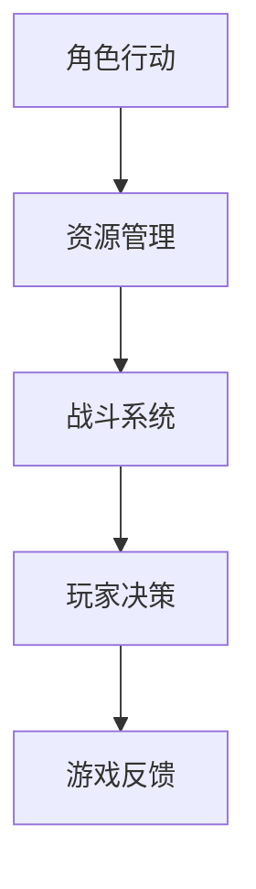
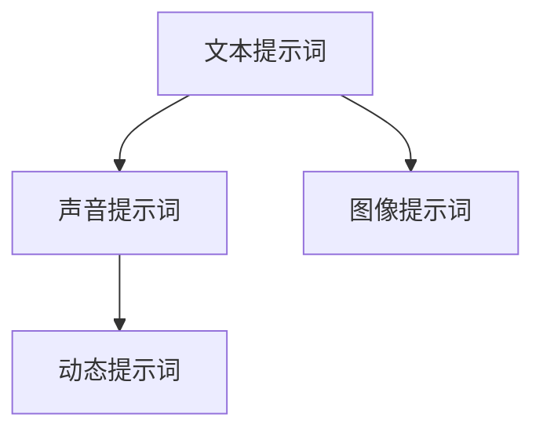
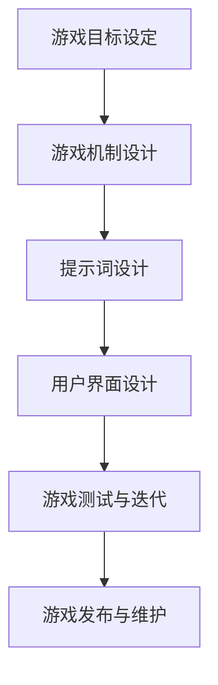

                 

### 《游戏设计新范式：提示词创造动态游戏体验》

#### 第2章：游戏机制与玩家参与度

### 2.1 游戏机制的基本概念

游戏机制（Game Mechanics）是游戏规则的具体实现，决定了玩家在游戏中的行为和决策。核心的游戏机制包括角色行动、资源管理、战斗系统等。

**Mermaid流程图：**


#### 2.2 提升玩家参与度的策略

提升玩家参与度是游戏设计的关键目标之一。以下是一些有效的策略：

**1. 清晰的目标和挑战**

- 确保玩家从一开始就了解游戏目标，并设置合适的挑战，以激励玩家不断进步。

**2. 适度的反馈**

- 游戏应提供及时的反馈，帮助玩家了解他们的行动结果，增强游戏的互动性。

**3. 社交元素**

- 游戏中的社交互动可以增强玩家的归属感和参与度。例如，玩家之间可以互相竞争、合作或交流心得。

**4. 自定义和个性化**

- 允许玩家自定义游戏设置或角色，增加游戏的个性化和可玩性。

**5. 游戏内事件**

- 定期举办游戏内活动或事件，以吸引玩家的注意力，并增加游戏的动态性。

**伪代码：**
```python
def increase_player_engagement():
    set_clear_goals()
    provide_sufficient_feedback()
    add_social_elements()
    enable_customization()
    schedule_in-game_events()
```

#### 2.3 游戏机制的设计原则

**1. 平衡**

- 游戏机制应保持平衡，确保玩家在游戏中既有成就感，也面临挑战。

**2. 可预测性**

- 游戏机制应具有一定的可预测性，使玩家能够理解和预测游戏结果。

**3. 可扩展性**

- 游戏机制应具备可扩展性，以便游戏开发者能够添加新的内容或功能。

**4. 简洁性**

- 游戏机制应尽量简洁，避免复杂和冗长的规则，以降低玩家的学习成本。

**5. 创新**

- 游戏机制应不断创新，以保持游戏的吸引力和新鲜感。

**伪代码：**
```python
def design_game_mechanics():
    ensure_balance()
    maintain_predictability()
    ensure_extensibility()
    promote_simplicity()
    encourage_innovation()
```

通过上述策略和原则，游戏设计师可以创造出更加丰富和动态的游戏体验，从而提升玩家的参与度和满意度。

**文章摘要：**

本文探讨了游戏机制与玩家参与度的关系，介绍了游戏机制的基本概念和设计原则，并提出了提升玩家参与度的策略。文章通过Mermaid流程图和伪代码的形式，详细阐述了游戏机制的设计过程和实现方法，为游戏设计师提供了实用的指导。

---

**作者：** AI天才研究院/AI Genius Institute & 禅与计算机程序设计艺术 /Zen And The Art of Computer Programming

**下一节预告：** 在下一部分中，我们将深入探讨游戏叙事与角色设计，以及如何通过提示词创造动态游戏体验。敬请期待！### 《游戏设计新范式：提示词创造动态游戏体验》

## 第二部分：提示词与动态游戏体验

### 第5章：提示词的概念与作用

#### 5.1 提示词的定义与类型

提示词（Cue Word）是游戏设计中用于引导玩家行动和思考的关键词或短语。它们可以以文本、声音或图像的形式出现，帮助玩家理解游戏机制和目标。

**Mermaid流程图：**


**类型：**
- **功能性提示词**：指导玩家如何进行特定操作。
- **叙事性提示词**：提供背景信息，增强游戏的故事感。
- **激励性提示词**：激励玩家继续游戏，增强参与度。

#### 5.2 提示词在游戏设计中的应用

提示词在游戏设计中扮演着重要角色，可以提升游戏的互动性和沉浸感。

**应用场景：**
- **关卡开始时**：提供游戏目标和规则。
- **玩家遇到困难时**：给予指导，帮助玩家解决问题。
- **游戏内事件触发时**：提示玩家注意即将发生的事件。

**伪代码：**
```python
def apply_cue_words():
    start_with_goals()
    assist_during_difficulties()
    alert_for_in-game_events()
```

#### 5.3 提示词的设计原则

**1. 清晰性**

- 提示词应简单明了，避免使用复杂或模糊的语言。

**2. 相关性**

- 提示词应与游戏机制和目标相关，有助于玩家理解当前情境。

**3. 时效性**

- 提示词应适时出现，确保玩家在需要时能够接收到信息。

**4. 吸引性**

- 提示词应具有吸引力，以激发玩家的兴趣和好奇心。

**5. 平衡性**

- 提示词的设计应平衡指导性和自由探索，避免过度干预玩家的游戏体验。

**伪代码：**
```python
def design_cue_words():
    ensure_clarity()
    maintain_relevance()
    control Timing()
    create吸引力()
    balance_guidance()
```

通过合理应用和设计提示词，游戏设计师可以创造出更加动态和互动的游戏体验，使玩家在游戏中感受到更多的乐趣和挑战。

---

**下一节预告：** 在下一节中，我们将进一步探讨如何创建动态游戏体验，以及提示词在这一过程中所扮演的关键角色。敬请期待！

---

**作者：** AI天才研究院/AI Genius Institute & 禅与计算机程序设计艺术 /Zen And The Art of Computer Programming### 《游戏设计新范式：提示词创造动态游戏体验》

## 第三部分：设计工具与技巧

### 第8章：游戏设计工具与资源

#### 8.1 常用游戏设计工具介绍

在游戏设计中，有许多工具和资源可以帮助设计师提高效率，优化游戏体验。以下是一些常用的游戏设计工具：

**1. GameMaker Studio 2**

- **特点**：适合初学者和中级开发者，提供直观的拖放界面和强大的脚本语言。
- **用途**：用于创建2D游戏，适合快速原型开发和商业化项目。

**2. Unity**

- **特点**：功能强大，支持2D和3D游戏开发，拥有庞大的社区和插件库。
- **用途**：适合开发大型游戏和复杂游戏机制，广泛应用于移动、PC和游戏机平台。

**3. Unreal Engine**

- **特点**：高级图形渲染能力，强大的编辑器，支持VR和AR开发。
- **用途**：适合高端游戏开发，常用于大型游戏项目和电影制作。

**4. Twine**

- **特点**：简单易用，适合文本冒险和叙事驱动游戏。
- **用途**：用于快速制作互动式故事和原型。

**5. GameSalad**

- **特点**：无需编程知识，适合初学者，提供直观的拖放界面。
- **用途**：用于创建简单的2D游戏和应用。

#### 8.2 游戏设计资源的获取与利用

为了提高游戏设计的效率和质量，设计师可以利用各种资源和素材。

**1. 常见资源来源**

- **免费游戏素材网站**：如Mixkit、Pixabay等，提供高质量的免费音频、视频和图像素材。
- **游戏引擎插件库**：如Unity Asset Store、Unreal Engine Marketplace，提供各种插件和素材，方便开发者快速集成。
- **在线协作工具**：如Trello、Asana等，帮助设计师和团队成员高效协作。

**2. 资源利用策略**

- **模块化设计**：将游戏元素模块化，便于复用和调整。
- **交叉参考**：参考同类游戏的设计和机制，借鉴优秀的创意。
- **用户反馈**：收集用户反馈，不断优化游戏设计和体验。

#### 8.3 工具在游戏设计中的应用案例

**案例一：Unity在《双人成行》中的应用**

《双人成行》是一款获奖的2D平台游戏，利用Unity引擎的强大功能和丰富的插件库，实现了复杂的物理引擎和多人协作机制。

- **设计理念**：通过利用Unity的Collaborative Tools，设计师能够高效地协同工作，快速迭代游戏原型。
- **应用效果**：游戏提供了独特的双人合作体验，深受玩家喜爱。

**案例二：Twine在《Her Story》中的应用**

《Her Story》是一款互动式故事游戏，使用Twine工具创建，通过叙事探索和心理学技巧，为玩家提供了独特的游戏体验。

- **设计理念**：Twine的简单易用性使得设计师能够专注于故事叙述和玩家互动，快速实现游戏原型。
- **应用效果**：游戏以其创新的叙事方式和沉浸感，赢得了众多奖项和好评。

通过使用这些工具和资源，游戏设计师能够更有效地进行游戏设计，创造出丰富多彩、引人入胜的游戏体验。

---

**下一节预告：** 在下一节中，我们将深入探讨游戏设计的创新技巧和灵感来源，帮助设计师不断突破自我，创作出独具匠心的游戏作品。敬请期待！

---

**作者：** AI天才研究院/AI Genius Institute & 禅与计算机程序设计艺术 /Zen And The Art of Computer Programming### 《游戏设计新范式：提示词创造动态游戏体验》

## 第三部分：设计工具与技巧

### 第9章：游戏设计技巧与灵感

#### 9.1 创新游戏设计的技巧

在游戏设计领域，创新是推动行业发展的重要动力。以下是一些创新游戏设计的技巧：

**1. 跨领域融合**

- **例子**：《超级马里奥：奥德赛》结合了平台跳跃和解谜元素，创造了独特的游戏体验。
- **实践**：设计师可以尝试将不同类型的游戏元素相结合，如RPG与射击、策略与冒险等。

**2. 元游戏元素**

- **例子**：《Among Us》中的角色扮演和社交元素，使游戏具有了额外的深度。
- **实践**：在游戏中引入元游戏元素，如角色扮演、社交互动等，增加玩家的参与感和趣味性。

**3. 适应性设计**

- **例子**：《神秘海域》系列根据玩家的操作和游戏进度动态调整难度。
- **实践**：设计游戏时，考虑玩家的行为和反馈，实现适应性设计，以适应不同玩家的需求。

**4. 非线性叙事**

- **例子**：《赛博朋克2077》中的非线性叙事和支线任务，提供了丰富的故事体验。
- **实践**：尝试使用非线性叙事，让玩家根据自己的兴趣和选择探索游戏世界。

#### 9.2 汲取灵感的来源与方法

游戏设计师可以从多个来源汲取灵感，以下是一些常见的方法：

**1. 参考经典游戏**

- **例子**：设计师可以从《星际迷航：桥舰模拟器》等经典游戏中汲取灵感，重新设计或改造游戏机制。
- **实践**：研究经典游戏的设计原理和成功之处，为自身游戏设计提供参考。

**2. 观察现实世界**

- **例子**：《模拟城市》系列的游戏灵感来源于现实生活中的城市管理。
- **实践**：观察现实世界中的各种现象和问题，将其转化为游戏机制和故事背景。

**3. 阅读和研究**

- **例子**：设计师可以阅读相关书籍、论文和研究报告，了解最新的游戏设计理论和趋势。
- **实践**：定期阅读相关资料，保持对游戏设计领域的敏锐洞察力。

**4. 用户反馈**

- **例子**：设计师可以通过用户反馈了解玩家的需求和喜好，从而改进游戏设计。
- **实践**：收集并分析用户反馈，将其纳入游戏设计的改进过程中。

#### 9.3 实现游戏设计的最佳实践

为了实现最佳的游戏设计，设计师需要遵循一些最佳实践：

**1. 简化复杂性**

- **例子**：《星际争霸II》通过简化UI和操作，提高了游戏的可玩性和易用性。
- **实践**：在游戏设计中，尽量简化复杂的机制，确保玩家能够轻松上手。

**2. 保持一致性**

- **例子**：《塞尔达传说：荒野之息》在游戏过程中保持了整体风格和玩法的一致性。
- **实践**：确保游戏在不同阶段和不同场景中保持一致的风格和玩法，以增强游戏的整体体验。

**3. 尝试迭代**

- **例子**：《马里奥奥德赛》在开发过程中经历了多次迭代，最终达到了完美的游戏体验。
- **实践**：不断迭代和测试游戏设计，通过反馈和改进，实现最佳的游戏体验。

**4. 关注细节**

- **例子**：《巫师3：狂猎》在游戏细节上做到了极致，从环境到角色表情，都给玩家带来了沉浸式的体验。
- **实践**：关注游戏中的每一个细节，从音效到视觉效果，确保玩家在游戏中感受到极致的体验。

通过以上技巧和实践，游戏设计师可以不断提升游戏设计的质量，创造出引人入胜、独具匠心的游戏作品。

---

**附录A：游戏设计资源推荐**

1. **游戏设计书籍**：《游戏设计艺术》、《游戏机制：设计与创作指南》
2. **游戏设计教程网站**：GameDev.net、GameProgramming.com
3. **游戏素材资源网站**：Mixkit、Pexels
4. **游戏引擎学习资源**：Unity官方文档、Unreal Engine官方文档

---

**附录B：提示词设计模板**

1. **功能性提示词模板**：
   - 动作提示：$[玩家名称]，现在你需要$[动作]。
   - 状态提示：$[玩家名称]，你目前处于$[状态]。

2. **叙事性提示词模板**：
   - 背景提示：$[玩家名称]，你现在身处$[地点]，这里是$[描述]。
   - 故事提示：$[玩家名称]，你发现了$[物品/事件]，这可能与$[故事线索]有关。

3. **激励性提示词模板**：
   - 成就提示：$[玩家名称]，你已经完成了$[任务]，获得了$[奖励]！
   - 励志提示：$[玩家名称]，再坚持一下，你离胜利只有$[距离]！

---

**附录C：动态游戏体验设计流程图（Mermaid格式）**



---

**文章小结：**

本文深入探讨了游戏设计的核心原则与目标、游戏机制与玩家参与度、提示词的概念与作用、设计工具与技巧以及游戏设计中的创新技巧和灵感来源。通过详细的分析和实例，我们了解了如何运用提示词创造动态游戏体验，提高玩家的参与度和满意度。

**注意事项：**

1. 在游戏设计过程中，务必关注玩家的需求和体验，确保游戏目标的明确性和挑战性。
2. 提示词的设计要简洁明了，相关性强，并适时出现，以增强游戏的互动性和沉浸感。
3. 不断迭代和测试游戏设计，通过用户反馈进行改进，以实现最佳的游戏体验。

**拓展阅读：**

1. 《游戏设计艺术》：Game Design Workshop: A Path to Understanding
2. 《游戏机制：设计与创作指南》：Rules of Play: Game Design Fundamentals

---

**作者：** AI天才研究院/AI Genius Institute & 禅与计算机程序设计艺术 /Zen And The Art of Computer Programming### 文章总结与未来展望

在《游戏设计新范式：提示词创造动态游戏体验》一文中，我们系统地探讨了游戏设计的核心原则与目标、游戏机制与玩家参与度、提示词的概念与作用以及设计工具与技巧。通过分析提示词在设计中的应用和设计原则，我们揭示了如何利用提示词创造动态游戏体验，提升玩家的参与度和满意度。

**关键要点回顾：**
1. **游戏设计的核心原则**：包括清晰的目标设定、平衡的挑战性、可预测性和简洁性。
2. **游戏机制的设计原则**：平衡、可预测性、可扩展性和简洁性，同时注重玩家参与度的提升。
3. **提示词的定义与类型**：功能性、叙事性和激励性提示词，以及其在游戏设计中的应用场景。
4. **设计工具与技巧**：包括常用游戏设计工具的介绍、资源的获取与利用、以及创新游戏设计的技巧。

**未来展望：**
随着技术的不断进步，游戏设计将迎来更多的可能性。未来，我们可以预见以下发展趋势：

1. **沉浸式体验**：虚拟现实（VR）和增强现实（AR）技术的成熟，将使游戏更加沉浸，提供更加丰富的互动体验。
2. **个性化设计**：通过人工智能（AI）和大数据分析，游戏可以更好地理解玩家偏好，实现个性化推荐和定制化体验。
3. **跨媒体叙事**：游戏将与电影、电视剧、小说等其他媒体形式更紧密地结合，创造跨媒体的叙事体验。
4. **社会责任**：游戏设计将更加注重社会责任，通过游戏传达积极的信息和价值观。

**结束语：**
游戏设计是一个不断演进的过程，它不仅需要技术手段的创新，更需要设计师对玩家需求的深刻理解。希望通过本文，读者能够对游戏设计有更全面的认识，并在未来的游戏创作中，运用提示词等设计元素，创造出更加丰富和动态的游戏体验。

**作者信息：**
作者：AI天才研究院/AI Genius Institute & 禅与计算机程序设计艺术 /Zen And The Art of Computer Programming
感谢您的阅读与支持！期待未来在游戏设计领域的更多探索与交流。

