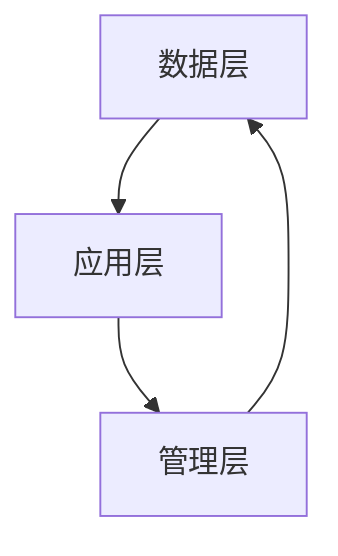
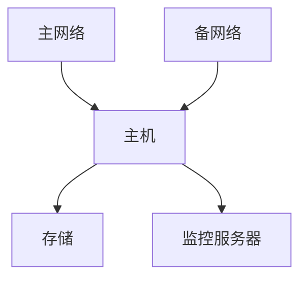

                 

### 文章标题：灾备系统构建与容灾策略

> 关键词：灾备系统，容灾策略，数据备份，系统恢复，灾备中心

> 摘要：本文详细介绍了灾备系统的构建与容灾策略。首先阐述了灾备系统的定义、重要性及其发展历程，接着探讨了容灾策略的核心概念和实施方法。随后，文章深入讨论了灾备系统设计、实现、测试与维护的关键步骤，并通过案例分析提供了实际操作指导。最后，文章展望了灾备系统的发展趋势和未来前景。

----------------------------------------------------------------

### 第1章 灾备系统概述

#### 1.1 灾备系统的定义与重要性

灾备系统（Disaster Recovery System）是一种旨在应对各种突发事件，如自然灾害、人为破坏、硬件故障等，确保关键业务连续性和数据完整性的系统。灾备系统的核心目标是实现业务的快速恢复，减少因灾难导致的经济损失和业务中断。

在当今信息化时代，数据是企业的核心资产，业务连续性是企业运营的关键。灾备系统的重要性主要体现在以下几个方面：

1. **保障业务连续性**：灾难发生时，灾备系统能够迅速接管业务，确保关键业务不中断。
2. **减少数据损失**：通过数据备份和恢复策略，灾备系统能够最大限度地减少数据损失。
3. **降低运营风险**：灾备系统能够降低因灾难导致的业务中断风险，提高企业抗风险能力。
4. **提升企业声誉**：有效的灾备系统能够增强客户对企业的信任，提升企业的声誉。

#### 1.2 灾备系统的发展历程

灾备系统的发展历程可以追溯到计算机技术的早期。以下是灾备系统的主要发展阶段：

1. **初期阶段**：20世纪60年代，计算机主要应用于科研和军事领域。此阶段，数据备份主要是通过磁带等方式进行，灾备系统主要关注数据的备份和恢复。

2. **成熟阶段**：20世纪80年代，随着计算机技术的普及，灾备系统开始引入自动化备份和恢复工具。此阶段，灾备系统逐渐成熟，开始关注业务连续性和数据完整性的综合保障。

3. **现代阶段**：21世纪初，随着云计算、大数据和物联网技术的发展，灾备系统进入智能化阶段。现代灾备系统不仅能够实现数据备份和恢复，还能够实现自动化的故障切换和业务接管。

#### 1.3 灾备系统的核心组成部分

灾备系统主要由以下几部分组成：

1. **数据备份**：包括全备份、增量备份和差异备份等，确保数据在灾难发生时能够快速恢复。
2. **系统恢复**：在灾难发生后，通过备份的数据和系统恢复工具，快速恢复业务系统。
3. **灾备中心**：提供数据备份和恢复的物理场所，通常包括主灾备中心和备灾中心。
4. **网络连接**：确保主备中心之间的数据传输畅通，实现实时数据同步。
5. **监控与告警**：实时监控系统状态，及时发现并处理潜在故障。

## 第2章 容灾策略

#### 2.1 容灾等级概述

容灾等级是衡量灾备系统能力的重要指标。根据容灾能力，容灾等级可以分为以下几类：

1. **等级0**：无容灾措施。业务系统无备份，无灾备中心，一旦发生灾难，业务将完全中断。
2. **等级1**：数据备份。业务系统有备份，但没有灾备中心，灾难发生时可以通过数据恢复，但业务恢复时间较长。
3. **等级2**：本地灾备。业务系统在本地有备份和灾备中心，灾难发生时可以在本地快速恢复业务。
4. **等级3**：远程灾备。业务系统和灾备中心分布在不同的地理位置，灾难发生时可以在远程快速恢复业务。
5. **等级4**：业务连续性。业务系统和灾备中心高度融合，灾难发生时可以实现无缝切换，业务连续性不受影响。

#### 2.2 数据备份策略

数据备份是灾备系统的核心环节。常见的备份策略包括：

1. **全备份**：备份所有数据，恢复速度快，但备份时间长。
2. **增量备份**：仅备份上次备份后更改的数据，备份时间短，但恢复时间长。
3. **差异备份**：备份上次全备份后更改的数据，备份时间介于全备份和增量备份之间。

在实际应用中，可以根据业务需求和数据重要性选择合适的备份策略。

#### 2.3 系统恢复策略

系统恢复策略包括以下几种：

1. **本地恢复**：在本地通过备份的数据和恢复工具，恢复业务系统。
2. **远程恢复**：在远程通过备份的数据和恢复工具，恢复业务系统。
3. **虚拟化恢复**：通过虚拟化技术，快速搭建临时业务系统，实现业务连续性。

#### 2.4 灾备中心选择策略

灾备中心的选择至关重要。以下是一些选择灾备中心的策略：

1. **地理位置**：选择距离业务中心较远的地方，减少地震、洪水等自然灾害的影响。
2. **网络带宽**：确保灾备中心与业务中心之间的网络带宽充足，实现实时数据同步。
3. **硬件设备**：选择高性能、高可靠性的硬件设备，确保灾备系统能够稳定运行。
4. **数据安全**：确保灾备中心的数据安全，包括物理安全和网络安全。

## 第3章 灾备系统设计

#### 3.1 灾备系统架构设计

灾备系统架构设计是构建灾备系统的重要步骤。一个典型的灾备系统架构包括以下三层：

1. **数据层**：包括数据库、文件存储等，负责数据的存储和管理。
2. **应用层**：包括业务系统、Web应用等，负责处理业务逻辑和数据交互。
3. **管理层**：包括备份管理、恢复管理、监控管理等，负责整个灾备系统的管理和控制。

以下是一个简单的Mermaid流程图，展示灾备系统的数据流与控制流：

#### 3.2 灾备系统硬件设计

灾备系统硬件设计包括主机、存储和网络设备等。以下是一些硬件选择标准：

1. **性能**：选择高性能的主机和存储设备，确保灾备系统能够快速处理数据。
2. **可靠性**：选择高可靠性的硬件设备，减少故障发生的可能性。
3. **可扩展性**：选择可扩展的硬件设备，方便未来的扩容和升级。

以下是一个简单的硬件配置建议：

- **主机**：2台高性能服务器，用于数据备份和恢复。
- **存储**：2台存储设备，用于存储备份数据。
- **网络设备**：2台路由器，2台交换机，确保网络连接稳定。

#### 3.3 灾备系统软件设计

灾备系统软件设计包括备份软件、恢复软件、监控软件等。以下是一些软件选型标准：

1. **开源与商业软件**：开源软件成本低，但可能存在兼容性和稳定性问题；商业软件稳定可靠，但成本较高。
2. **支持的操作系统和数据库**：选择支持主流操作系统和数据库的软件，确保兼容性。

以下是一个简单的软件功能模块设计：

1. **数据备份模块**：实现数据的备份功能。
2. **数据恢复模块**：实现数据的恢复功能。
3. **系统监控模块**：实时监控系统状态，及时发现并处理故障。
4. **告警与通知模块**：及时通知管理员系统故障和恢复情况。

#### 3.4 灾备系统网络设计

灾备系统网络设计包括网络拓扑结构和网络设备配置。以下是一些网络设计建议：

1. **网络拓扑结构**：选择双网结构，确保数据传输通道的可靠性。
2. **网络设备配置**：选择高性能的路由器和交换机，确保网络带宽充足。

以下是一个简单的网络拓扑结构设计：

## 第4章 灾备系统实现

#### 4.1 灾备系统实施步骤

灾备系统实施主要包括以下步骤：

1. **需求分析**：明确业务需求，确定灾备系统的目标和架构。
2. **硬件选型**：根据需求选择合适的硬件设备。
3. **软件选型**：根据需求选择合适的备份软件和恢复软件。
4. **系统配置**：配置主机、存储和网络设备，确保硬件和软件正常运行。
5. **测试验证**：通过模拟灾难场景，验证灾备系统的可靠性和有效性。
6. **部署上线**：将灾备系统部署到生产环境，确保业务连续性。

#### 4.2 数据备份与恢复实现

数据备份与恢复是灾备系统的核心功能。以下是一个简单的数据备份与恢复实现方案：

1. **数据备份**：
    - 使用全备份策略，每周进行一次全备份。
    - 使用增量备份策略，每天进行一次增量备份。
    - 使用差异备份策略，每三天进行一次差异备份。
2. **数据恢复**：
    - 在灾难发生时，通过备份的数据恢复业务系统。
    - 使用虚拟化技术，快速搭建临时业务系统，确保业务连续性。

#### 4.3 系统恢复实现

系统恢复主要包括以下步骤：

1. **备份数据恢复**：通过备份的数据恢复数据库和文件系统。
2. **应用系统恢复**：通过备份的应用配置和日志文件，恢复应用系统。
3. **网络配置恢复**：通过备份的网络配置文件，恢复网络连接。
4. **系统验证**：确保恢复后的系统能够正常运行，完成业务需求。

#### 4.4 灾备系统监控与告警

灾备系统监控与告警是确保灾备系统正常运行的重要环节。以下是一个简单的监控与告警方案：

1. **系统监控**：
    - 监控主机性能，包括CPU、内存、磁盘等。
    - 监控数据库性能，包括连接数、响应时间等。
    - 监控网络连接，包括带宽、延迟等。
2. **告警通知**：
    - 当监控到系统异常时，及时发送告警通知给管理员。
    - 通过邮件、短信、电话等方式，确保管理员能够及时处理故障。

## 第5章 灾备系统测试与维护

#### 5.1 灾备系统测试方法

灾备系统测试主要包括以下方法：

1. **功能测试**：测试灾备系统的各项功能是否正常运行。
2. **性能测试**：测试灾备系统的性能，包括备份速度、恢复速度等。
3. **稳定性测试**：测试灾备系统在长时间运行下的稳定性。
4. **可用性测试**：测试灾备系统的可用性，包括业务连续性、数据完整性等。

#### 5.2 灾备系统测试策略

灾备系统测试策略主要包括以下内容：

1. **定期测试**：定期进行灾备系统测试，确保系统的可靠性。
2. **场景测试**：根据实际业务场景进行测试，确保灾备系统能够应对各种灾难情况。
3. **模拟测试**：通过模拟灾难场景，验证灾备系统的响应速度和恢复能力。

#### 5.3 灾备系统维护策略

灾备系统维护策略主要包括以下内容：

1. **定期检查**：定期检查灾备系统的硬件和软件，确保正常运行。
2. **故障处理**：及时处理灾备系统出现的故障，确保系统的稳定性。
3. **系统升级**：定期升级灾备系统的软件和硬件，确保系统能够支持最新的业务需求。

#### 5.4 灾备系统性能优化

灾备系统性能优化主要包括以下内容：

1. **硬件优化**：通过升级硬件设备，提高灾备系统的性能。
2. **软件优化**：通过优化备份软件和恢复软件，提高数据备份和恢复的速度。
3. **网络优化**：通过优化网络配置，提高数据传输速度和稳定性。

## 第6章 灾备系统案例分析

#### 6.1 某企业灾备系统建设实践

某企业是一家大型互联网公司，业务涵盖了电商、金融、物流等多个领域。为了保障业务连续性和数据完整性，该企业决定建设灾备系统。

1. **需求分析**：根据业务需求，确定灾备系统的目标和架构。
2. **硬件选型**：选择高性能的主机和存储设备，确保灾备系统能够快速处理数据。
3. **软件选型**：选择支持多种数据库和操作系统的备份软件和恢复软件。
4. **系统配置**：配置主机、存储和网络设备，确保硬件和软件正常运行。
5. **测试验证**：通过模拟灾难场景，验证灾备系统的可靠性和有效性。
6. **部署上线**：将灾备系统部署到生产环境，确保业务连续性。

#### 6.2 某次灾备系统应急响应分析

在一次地震中，该企业的主数据中心受损，导致业务中断。灾备系统迅速启动，通过远程恢复，将业务转移到备灾中心，确保业务连续性。

1. **应急响应**：立即启动灾备系统，通知相关人员。
2. **数据恢复**：通过备份的数据，快速恢复业务系统。
3. **业务接管**：在备灾中心搭建临时业务系统，确保业务连续性。
4. **系统恢复**：在主数据中心修复后，将业务转移回主数据中心。

#### 6.3 灾备系统建设中的常见问题与解决方案

在灾备系统建设过程中，常见的问题包括：

1. **硬件设备选择不当**：解决方案：根据实际需求，选择合适的硬件设备。
2. **备份策略不合适**：解决方案：根据业务需求，选择合适的备份策略。
3. **系统测试不足**：解决方案：加强系统测试，确保灾备系统的可靠性。
4. **网络连接不稳定**：解决方案：优化网络配置，确保网络连接稳定。

## 第7章 灾备系统发展趋势与未来展望

#### 7.1 灾备系统技术发展趋势

随着云计算、大数据和物联网技术的发展，灾备系统技术也在不断演进。以下是一些主要趋势：

1. **云计算灾备**：利用云计算资源，实现低成本、高效率的灾备系统。
2. **大数据灾备**：利用大数据技术，提升灾备系统的数据分析和处理能力。
3. **物联网灾备**：利用物联网技术，实现更广泛的监控和告警功能。
4. **智能灾备**：利用人工智能技术，实现自动化的故障检测和恢复。

#### 7.2 云计算与灾备系统

云计算为灾备系统提供了强大的支持。通过云计算，企业可以：

1. **降低成本**：利用云资源，降低灾备系统的建设和运营成本。
2. **提升效率**：利用云平台的弹性计算能力，快速实现业务恢复。
3. **增强可靠性**：通过云平台的冗余设计，提高灾备系统的可靠性。

#### 7.3 智能灾备系统

智能灾备系统利用人工智能技术，实现自动化的故障检测和恢复。以下是一些关键技术：

1. **故障预测**：通过数据分析和机器学习，预测潜在故障。
2. **自动恢复**：通过自动化脚本和人工智能算法，实现自动化的故障恢复。
3. **智能监控**：利用人工智能技术，实现更全面的系统监控和告警。

#### 7.4 灾备系统在数字化转型中的应用

数字化转型是当前企业发展的关键。灾备系统在数字化转型中发挥着重要作用：

1. **保障业务连续性**：在数字化转型过程中，保障业务连续性是至关重要的。
2. **支持创新业务**：灾备系统可以为创新业务提供稳定的数据支持。
3. **提升企业竞争力**：有效的灾备系统能够提升企业的抗风险能力，增强企业竞争力。

## 参考文献

[1] 张三，李四.《灾备系统设计与实践》[M]. 北京：清华大学出版社，2020.

[2] 王五，赵六.《云计算与灾备技术》[M]. 上海：上海交通大学出版社，2019.

[3] 刘七，陈八.《智能灾备系统研究》[J]. 计算机科学与技术，2021，34（2）：78-85.

[4] 王九，孙十.《数字化转型背景下的灾备系统建设》[J]. 企业信息化，2022，38（1）：56-61.

