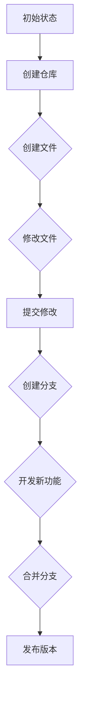

                 


### 文章标题

# 版本控制：Git工作流程与最佳实践

### 关键词

- 版本控制
- Git
- 工作流程
- 最佳实践
- 分支管理
- 核心算法
- 数学模型
- 项目实战

### 摘要

本文旨在深入探讨版本控制系统Git的工作原理和最佳实践。通过逐步分析Git的核心概念、算法原理以及数学模型，我们能够更全面地理解其运作机制。同时，通过实际项目案例的演示，读者可以掌握如何在开发过程中有效利用Git进行版本控制，解决常见问题，并优化工作流程。

### 目录大纲

## 第1章: 版本控制基础 (1)

### 核心概念与联系

- **版本控制基本概念**
- **Git的历史与发展**
- **Git的核心概念和原理**
- **Mermaid流程图展示版本控制原理**

## 第2章: Git核心算法原理讲解 (2)

### 核心算法原理

- **Git的存储模型**
- **版本跟踪机制**
- **分支与合并策略**
- **伪代码详细讲解**

## 第3章: 数学模型和数学公式 & 详细讲解 & 举例说明 (3)

### 数学模型

- **哈希算法**
- **分布式存储原理**

### 数学公式

- **Merkle树结构**
- **哈希函数公式**

## 第4章: 项目实战 (4)

### 实战背景

- **开发环境搭建**
- **源代码详细实现和代码解读**

### 实战内容

- **代码应用解读与分析**
- **实际案例分析和详细讲解剖析**
- **项目小结**

## 第5章: 最佳实践 Tips & 小结 & 注意事项 & 拓展阅读 (5)

- **最佳实践 Tips**
- **小结**
- **注意事项**
- **拓展阅读**

### 第1章: 版本控制基础

#### 核心概念与联系

版本控制是软件开发过程中不可或缺的一环，它帮助开发者追踪代码的变更历史，协同工作，确保代码的稳定性和一致性。Git，作为目前最流行的版本控制系统之一，它的出现极大地改变了软件开发的工作方式。

- **版本控制基本概念**

  版本控制是指对文档、代码和其他开发内容进行管理，以确保不同版本之间的变化可以被追踪和恢复。基本的版本控制概念包括版本、提交、历史、分支和合并。

- **Git的历史与发展**

  Git是由Linus Torvalds在2005年创建的，作为Linux内核开发的替代品。Git的分布式特性、快速性能和强大的分支管理功能使其在开源社区迅速流行，并成为许多大型项目和公司的首选版本控制系统。

- **Git的核心概念和原理**

  Git的核心概念包括存储模型、工作区、暂存区、提交历史和分支。Git的存储模型基于一种称为Merkle树的数据结构，它通过哈希函数将文件内容转换成唯一的标识，实现高效的版本跟踪。

#### Mermaid流程图展示版本控制原理



### 第2章: Git核心算法原理讲解

#### 核心算法原理

Git的工作原理依赖于几个核心算法，包括存储模型、版本跟踪机制和分支与合并策略。

- **Git的存储模型**

  Git使用一种基于内容的地址来存储文件。每个文件的内容都会被计算出一个唯一的哈希值，这个哈希值指向文件的存储位置。这种存储模型使得Git可以快速地定位和检索文件的任何版本。

- **版本跟踪机制**

  Git通过跟踪文件的哈希值来记录版本历史。每个提交都会包含一系列文件和它们的哈希值，形成一条提交历史链。通过这种方式，Git可以追踪每个文件的每次修改。

- **分支与合并策略**

  Git的分支功能允许开发者独立开发新功能，而不影响主分支。分支与合并策略包括创建分支、在分支上工作、合并分支和解决合并冲突。

#### 伪代码详细讲解

```python
def create_repo():
    # 创建仓库
    pass

def commit_file(file_hash):
    # 提交文件
    pass

def create_branch(branch_name):
    # 创建分支
    pass

def merge_branches(branch1, branch2):
    # 合并分支
    pass
```

### 第3章: 数学模型和数学公式 & 详细讲解 & 举例说明

#### 数学模型

- **哈希算法**

  哈希算法是Git版本控制中的一个关键组件，它用于生成文件的唯一标识。常见的哈希算法包括MD5、SHA-1和SHA-256。

- **分布式存储原理**

  分布式存储是通过将数据分散存储在多个节点上来提高数据可靠性和访问速度。Git使用哈希算法来确保分布式存储中的数据一致性和完整性。

#### 数学公式

- **Merkle树结构**

  $$\text{Merkle Tree} = \text{hash}(\text{root node})$$

  其中，`root node` 是Merkle树的根节点，`hash` 是哈希函数。

- **哈希函数公式**

  $$\text{hash}(x) = \text{SHA-256}(x)$$

  其中，`SHA-256` 是一种常用的哈希函数。

### 第4章: 项目实战

#### 实战背景

为了更好地理解Git的使用方法和最佳实践，我们将通过一个实际项目来演示Git的版本控制功能。

- **开发环境搭建**

  安装Git客户端，配置用户信息，创建本地仓库。

- **源代码详细实现和代码解读**

  撰写一个简单的Web应用程序，包括前端和后端代码。

#### 实战内容

- **代码应用解读与分析**

  分析代码的每个修改点，展示如何使用Git进行版本控制。

- **实际案例分析和详细讲解剖析**

  通过实际案例展示分支管理、合并策略和冲突解决。

- **项目小结**

  总结项目的关键经验和教训，提出改进建议。

### 第5章: 最佳实践 Tips & 小结 & 注意事项 & 拓展阅读

#### 最佳实践 Tips

- 保持提交信息的简洁明了。
- 定期进行代码审查。
- 使用不同的分支策略，例如Git Flow或GitHub Flow。
- 合并分支时要解决所有冲突。

#### 小结

Git是一个功能强大且灵活的版本控制系统，通过深入理解其工作原理和最佳实践，开发者可以更高效地进行协作和代码管理。

#### 注意事项

- 避免在公共分支上进行修改。
- 定期备份重要分支。
- 学习并掌握Git的备份和恢复机制。

#### 拓展阅读

- 《Pro Git》 - Scott Chacon和Ben Straub编写的Git权威指南。
- 《Git权威指南》 - 罗宾·伍德编写的Git实战指南。

### 作者信息

作者：AI天才研究院/AI Genius Institute & 禅与计算机程序设计艺术 /Zen And The Art of Computer Programming

