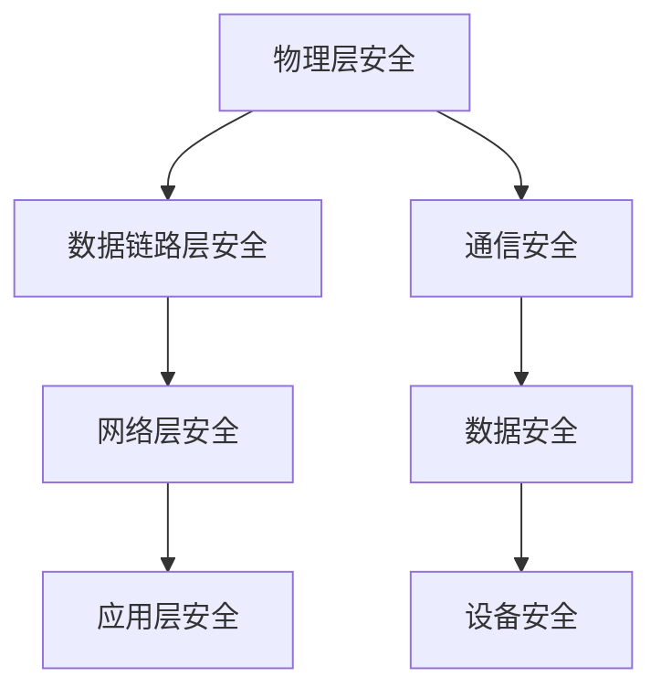

                 

### 物联网安全：保护互联设备的策略

# 物联网安全：保护互联设备的策略

## 关键词

- 物联网安全
- 设备保护
- 数据隐私
- 加密算法
- 攻击防御
- 安全工具
- 实战案例

## 摘要

本文旨在深入探讨物联网安全的重要性、核心概念、安全架构以及防御策略。通过逐步分析，我们将了解如何保护互联设备免受潜在威胁。文章包括物联网安全概述、核心概念与架构、通信安全、设备安全、网络安全、数据安全、安全工具与测试方法，以及案例分析。通过本文，读者将获得全面的安全防护知识和实战经验。

---

## 第一部分：物联网安全概述

### 1.1 物联网安全的重要性

物联网（IoT）正在逐渐渗透到我们生活的方方面面，从智能家居到工业自动化，再到医疗设备和公共基础设施。然而，随着物联网设备的普及，安全问题也日益突出。

**1.1.1 对个人与企业的影响**

- **个人隐私泄露**：物联网设备通常收集个人数据，如位置信息、行为习惯等，这些数据一旦泄露，将严重威胁个人隐私。
- **企业经济损失**：物联网设备被攻击可能导致系统瘫痪、数据丢失，给企业带来巨大的经济损失。
- **公共安全问题**：物联网设备在关键基础设施中的应用，如交通管理、能源供应等，一旦被攻击，可能引发严重的公共安全问题。

**1.1.2 物联网安全的发展历程**

- **物联网早期阶段**：设备相对较少，安全关注不足。
- **物联网安全问题日益凸显**：随着设备数量的增加，安全问题逐渐成为关注的焦点。
- **当前物联网安全形势**：安全威胁日益复杂，需要采取有效的安全措施。

### 1.2 物联网安全的关键挑战

**1.2.1 设备与网络安全**

- **设备安全性**：设备硬件和软件的安全性直接影响物联网系统的整体安全。
- **网络连接安全性**：物联网设备通常通过网络连接，网络安全问题不容忽视。

**1.2.2 数据安全与隐私保护**

- **数据加密与传输**：确保数据在传输过程中不被窃取或篡改。
- **隐私泄露防范**：防范个人隐私数据泄露。

---

## 第二部分：物联网安全的核心概念与架构

### 2.1 物联网安全的核心概念

**2.1.1 安全定义**

安全是指在不确定的环境中对潜在威胁进行预防和管理，以保护资产免受损害。在物联网领域，安全包括设备安全、网络安全、数据安全和通信安全等多个方面。

**2.1.2 风险管理**

风险管理是指识别、评估和应对潜在威胁的过程。在物联网安全中，风险管理至关重要，可以帮助组织制定有效的安全策略。

### 2.2 物联网安全的体系架构

物联网安全体系架构通常分为以下几个层次：

- **物理层安全**：保护物联网设备硬件免受物理损坏或窃取。
- **数据链路层安全**：确保数据在传输过程中不被截获或篡改。
- **网络层安全**：保护物联网设备与互联网的连接。
- **应用层安全**：确保物联网应用和数据的安全。

**2.2.1 Mermaid流程图**

### 2.3 物联网安全的层级划分

- **设备安全**：包括硬件安全、固件安全和软件安全。
- **网络安全**：涉及网络架构、防火墙、入侵检测和入侵防御系统。
- **数据安全**：包括数据加密、完整性保护和隐私保护。
- **通信安全**：涉及通信协议的安全性、加密技术和认证机制。

---

## 第三部分：物联网通信安全

### 3.1 物联网通信协议的安全性

物联网设备通常使用无线通信协议，如Wi-Fi、蓝牙和Zigbee等。这些协议的安全性直接影响物联网系统的整体安全。

**3.1.1 数据加密与完整性保护**

- **数据加密**：使用加密算法（如AES）确保数据在传输过程中不被窃取或篡改。
- **完整性保护**：通过哈希算法（如SHA-256）确保数据在传输过程中未被篡改。

**3.1.2 防火墙与入侵检测系统**

- **防火墙**：限制网络访问，阻止未经授权的访问。
- **入侵检测系统（IDS）**：监控网络流量，检测潜在的入侵行为。

---

## 第四部分：物联网设备安全

### 4.1 设备安全策略与措施

设备安全策略包括：

- **硬件安全**：使用安全芯片、硬件加密模块等确保设备硬件的安全。
- **固件安全**：定期更新固件，修复已知漏洞。
- **软件安全**：使用安全编码实践，避免常见的安全漏洞。

**4.1.1 硬件安全模块**

硬件安全模块（HSM）是一种专门用于加密和认证的硬件设备，可以提供安全的密钥管理和加密服务。

---

## 第五部分：物联网网络安全

### 5.1 网络安全基础

网络安全基础包括：

- **网络架构**：设计安全、可靠的网络架构。
- **防火墙**：防止未经授权的访问。
- **入侵检测和防御系统**：监控网络流量，防止入侵行为。

### 5.2 网络安全防护技术

网络安全防护技术包括：

- **入侵检测系统（IDS）**：实时监控网络流量，检测潜在的入侵行为。
- **入侵防御系统（IPS）**：自动阻止入侵行为。
- **安全信息和事件管理（SIEM）**：集成安全事件监控和管理。

### 5.3 网络安全案例分析

- **案例分析**：分析实际的安全事件，探讨应对策略和教训。

---

## 第六部分：物联网数据安全

### 6.1 数据安全保护

数据安全保护包括：

- **数据加密**：使用加密算法（如AES、RSA）保护数据。
- **完整性保护**：使用哈希算法（如SHA-256）确保数据的完整性。
- **访问控制**：限制对数据的访问权限。

### 6.2 数据隐私保护

数据隐私保护包括：

- **匿名化**：去除数据中的个人识别信息。
- **数据最小化**：仅收集必要的个人信息。

### 6.3 数据安全法律法规

- **数据安全法律法规**：了解相关法律法规，确保合规。

---

## 第七部分：物联网安全工具与测试方法

### 7.1 安全工具介绍

物联网安全工具包括：

- **漏洞扫描工具**：扫描设备或网络中的漏洞。
- **渗透测试工具**：模拟攻击，检测系统的安全性。
- **加密工具**：实现数据加密和完整性保护。

### 7.2 安全测试方法

安全测试方法包括：

- **静态分析**：分析设备或代码的安全性。
- **动态分析**：运行时监测设备或网络的安全性。
- **实战演练**：模拟真实攻击场景，测试系统应对能力。

### 7.3 安全测试实战案例

- **实战案例**：详细讲解一个物联网安全测试的实战案例，包括开发环境搭建、源代码实现和代码解读。

---

## 第八部分：物联网安全案例分析

### 8.1 典型物联网安全事件分析

分析一些典型的物联网安全事件，探讨事件的原因、影响和应对策略。

### 8.2 安全事件应对与处理

在发生安全事件时，如何快速响应和处理。

### 8.3 安全经验与教训

总结物联网安全事件的经验和教训，提高安全意识和防护能力。

---

## 附录

### 附录A：物联网安全工具与测试方法

详细讲解物联网安全工具的使用方法，包括：

- **漏洞扫描工具**的使用。
- **渗透测试工具**的使用。
- **加密工具**的使用。

### 附录B：常见安全漏洞与防护措施

列出一些常见的物联网安全漏洞，并提供相应的防护措施。

### 附录C：物联网安全资源与拓展阅读

提供一些物联网安全相关的资源，包括：

- **安全书籍**。
- **安全博客**。
- **安全论坛**。

---

## 作者信息

作者：AI天才研究院/AI Genius Institute & 禅与计算机程序设计艺术 /Zen And The Art of Computer Programming

---

本文通过逐步分析物联网安全的各个层面，提供了全面的安全防护知识和实战经验。希望本文能够帮助读者更好地理解物联网安全，并提升安全意识和防护能力。

