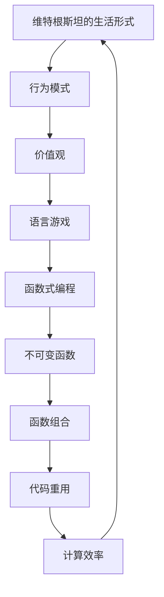

                 


### 1. 引言：函数式编程与生活形式

函数式编程（Functional Programming，简称FP）是一种编程范式，它与命令式编程相对。在函数式编程中，计算被视为一系列函数的执行，而函数是一种数学上的概念，它接收输入并产生输出，且其输出仅依赖于输入。这种范式的核心思想是“函数是一等公民”，这意味着函数可以被赋值给变量，作为参数传递给其他函数，或者作为返回值从函数中返回。

FP的出现并非偶然，它有着深厚的历史渊源。其思想可以追溯到1940年代和1950年代的数学家和逻辑学家，如阿尔图尔·布切尔（Alonzo Church）和约翰·卡尔·毕尤斯基（John Carl Bürklebach）。布切尔提出了λ演算（λ-calculus），这是一种纯粹的函数式编程模型，它奠定了现代函数式编程的理论基础。与此同时，阿兰·图灵（Alan Turing）提出了图灵机模型，这也是现代计算理论的基础之一。这两大理论共同揭示了计算的本质，并为函数式编程的发展奠定了基础。

在函数式编程的发展历程中，Lisp语言是最早的函数式编程语言之一，由约翰·麦卡锡（John McCarthy）于1958年提出。Lisp不仅在理论层面具有重要意义，也在实际应用中取得了成功。随后，Haskell、Scala、Erlang等语言进一步推动了函数式编程的发展。

生活形式（Life Forms）这一概念最初由维特根斯坦（Ludwig Wittgenstein）提出，他在其后期作品《文化与价值》（Culture and Value）中详细探讨了这一概念。维特根斯坦认为，生活形式是人类行动的框架，它决定了我们的行为模式。这一理论对哲学、心理学、社会学等多个领域产生了深远影响。

将函数式编程与生活形式联系起来，可以提供一种新的视角来理解编程的本质。函数式编程强调函数的纯度和不可变性，这与生活形式中的行为模式有一定的相似性。例如，我们可以将编程中的函数视为一种生活形式，它决定了程序的行为。而函数式编程的核心原则，如不可变性和函数组合，则可以看作是对生活形式的抽象和形式化。

在本文中，我们将详细探讨维特根斯坦的文化背景理论，以及它如何影响我们对函数式编程的理解。我们还将深入分析生活形式与函数式编程之间的联系，并探讨FP作为一种编程文化的重要性。通过这些讨论，我们希望能够提供一个全面而深刻的视角，以理解函数式编程的本质和它在现代编程中的地位。

### 2. 维特根斯坦的文化背景理论

为了深入探讨维特根斯坦的文化背景理论，我们需要先了解他的哲学思想及其对生活形式概念的理解。路德维希·维特根斯坦（Ludwig Wittgenstein）是20世纪最重要的哲学家之一，他的思想对语言哲学、心灵哲学和数学哲学等领域产生了深远影响。维特根斯坦的哲学思想主要分为两个阶段：早期和后期。

在早期，维特根斯坦的主要著作是《逻辑哲学论》（Tractatus Logico-Philosophicus）。这本书以简洁的语言和深刻的洞察力探讨了语言、逻辑和现实之间的关系。维特根斯坦提出了一种极端的唯物主义和逻辑原子主义观点，认为世界是由一系列不可再分的原子事实构成的，而语言的任务是准确描述这些事实。这种观点强调了逻辑和数学在理解世界中的核心作用。

然而，在《逻辑哲学论》发表后的几年里，维特根斯坦逐渐认识到这本书的局限性，并开始撰写《哲学研究》（Philosophical Investigations）。这本书标志着维特根斯坦哲学思想的转变，他开始关注语言的使用和人类行为的意义。在后期哲学中，维特根斯坦提出了“生活形式”（forms of life）这一核心概念，以解释人类行为的复杂性和多样性。

“生活形式”是指人类在特定文化和社会环境中形成的行动模式和价值观念。维特根斯坦认为，这些生活形式是理解人类行为的关键，因为它们决定了我们的思维方式和行为模式。例如，他在《哲学研究》中讨论了语言游戏（language games）的概念，认为不同的语言游戏对应于不同的生活形式。每个语言游戏都有其特定的规则和目的，这些规则和目的共同构成了一个生活形式。

维特根斯坦的文化背景理论认为，我们的思维和行为不仅受到个人经验的限制，还受到文化和社会环境的深刻影响。他认为，人们通过语言和实践活动参与自己的生活形式，并在这些形式中找到了意义和目的。这种观点强调了文化和社会在塑造人类行为中的关键作用，并对后来的语言哲学和社会学产生了深远影响。

将维特根斯坦的文化背景理论应用于函数式编程，我们可以看到函数式编程中的核心原则与维特根斯坦的生活形式概念有一定的相似性。例如，函数式编程强调不可变性和函数的组合，这与维特根斯坦关于规则和目的的观点有相似之处。在函数式编程中，函数被视为一种规则，它定义了输入到输出之间的映射关系。这种规则是明确的、不可变的，并且可以被组合成更复杂的规则。这与维特根斯坦的生活形式中的规则和目的有相似之处，因为它们都强调了明确性和目的性。

此外，维特根斯坦关于语言游戏的概念也可以用于解释函数式编程中的不同编程范式和语言。每个编程范式和语言都可以被视为一种特定的语言游戏，它有其特定的规则和目的。例如，Haskell和Scala等语言可以被看作是函数式编程的语言游戏，它们提供了明确的函数定义和组合规则，以实现高效的计算和代码重用。

因此，维特根斯坦的文化背景理论为我们提供了一种新的视角来理解函数式编程的本质。它强调了文化和社会在塑造编程范式和语言中的关键作用，并提醒我们在设计编程语言和范式时需要考虑人类行为的意义和目的。通过这种视角，我们可以更好地理解函数式编程的优势和局限性，并在实际应用中更好地利用这种编程范式。

### 3. 生活形式与函数式编程概念

在维特根斯坦的哲学体系中，生活形式是一个核心概念，它描述了个体在社会和文化环境中形成的行为模式和价值观念。生活形式不仅仅是个人行为的总和，而是构成了个体理解世界和行动的基本框架。维特根斯坦认为，不同的生活形式决定了个体如何理解和解释语言、行动和现实。例如，在一个注重合作和共享的文化中，生活形式可能强调集体行动和社会责任，而在一个强调个人主义和竞争的文化中，生活形式可能更注重个人成就和自我表达。

将这一概念与函数式编程相比较，我们可以发现两者之间存在着深刻的相似性和互补性。在函数式编程中，函数被视为一种抽象的、不可变的规则，它定义了输入和输出之间的关系。这种规则和关系的不可变性意味着函数的行为是可预测和可组合的，这与维特根斯坦关于规则和目的性的观点相呼应。在维特根斯坦的生活形式中，规则和目的是个体行动的基础，而函数式编程中的函数正是这种规则的具体体现。

首先，让我们通过一个简单的Mermaid流程图来展示维特根斯坦的生活形式与函数式编程概念之间的关系：



在这个流程图中，我们可以看到维特根斯坦的生活形式通过行为模式、价值观和语言游戏等环节，最终影响到函数式编程的核心概念，如不可变函数、函数组合和代码重用。

#### 核心概念与联系

1. **不可变函数**：在函数式编程中，不可变函数是一个关键概念。不可变函数确保了函数的输出仅依赖于其输入，并且不会修改任何外部状态。这与维特根斯坦关于生活形式中规则和目的性的观点有相似之处，因为不可变函数提供了一个明确的、可预测的行为框架。

    ```mermaid
    graph TD
    A[输入] --> B[函数]
    B --> C[输出]
    C --> D[无副作用]
    D --> E[可预测]
    E --> F[可组合]
    F --> G[不可变函数]
    ```

2. **函数组合**：函数组合是函数式编程的另一个核心概念。通过组合简单的函数，我们可以创建复杂的计算流程。这种组合方式与维特根斯坦的“语言游戏”概念有相似之处，因为它们都强调了规则和目的性的组合。

    ```mermaid
    graph TD
    A[函数A] --> B[输入]
    B --> C[输出]
    C --> D[函数B]
    D --> E[输出]
    E --> F[组合]
    F --> G[复杂计算流程]
    ```

3. **代码重用**：函数式编程强调代码的重用性，通过创建可组合的函数库，开发者可以轻松地重用代码并构建复杂的系统。这种重用性与维特根斯坦的生活形式中的“价值观”概念相呼应，因为它们都强调了规则和目的性在行为中的重要性。

    ```mermaid
    graph TD
    A[函数库] --> B[模块化]
    B --> C[代码重用]
    C --> D[系统构建]
    D --> E[重用价值观]
    ```

#### 函数式编程与生活形式的应用

在实际编程中，函数式编程的核心概念和生活形式的理论可以相互结合，以提高代码的可读性、可维护性和计算效率。例如，在一个金融应用中，我们可以使用不可变数据结构来表示金融交易，并通过函数组合来处理复杂的交易规则和计算。

假设我们要实现一个金融交易系统，其中每个交易都是一个不可变的对象，包含交易日期、金额和交易类型等信息。我们可以使用函数组合来定义和执行交易规则，例如：

```haskell
-- 定义交易数据结构
data Transaction = Transaction {
    date :: Date,
    amount :: Double,
    type :: TransactionType
}

-- 定义交易规则
processTransaction :: Transaction -> TransactionResult
processTransaction transaction = ...

-- 定义交易处理流程
processTransactions :: [Transaction] -> [TransactionResult]
processTransactions transactions = map processTransaction transactions
```

在这个例子中，`processTransaction` 函数处理单个交易，而 `processTransactions` 函数组合多个交易并处理它们。这种组合方式不仅提高了代码的可读性和可维护性，还确保了交易处理的逻辑明确且可预测。

总之，函数式编程与维特根斯坦的生活形式概念之间存在深刻的联系。通过理解这些联系，我们可以更好地应用函数式编程的核心概念，以提高代码的质量和效率。同时，这种结合也为函数式编程提供了一种新的哲学视角，使我们能够更深入地理解编程的本质。

### 4. 编程中的函数式范式

在讨论函数式编程（Functional Programming，简称FP）范式时，首先需要明确其核心原则和特点。函数式编程强调函数作为编程的基本单元，而不是像命令式编程那样依赖于状态的变化和流程控制。以下是一些函数式编程的核心原则和特点：

#### 核心原则

1. **不可变性**：在函数式编程中，数据一旦创建，就不可更改。这意味着所有数据都是不可变的，任何对数据的修改都会生成一个新的数据副本。这种不可变性使得程序更易于理解和维护，因为状态的改变可以被明确地跟踪。

2. **纯函数**：纯函数是一种不依赖于外部状态且返回结果只与输入参数相关的函数。纯函数具有不变性和可预测性，这意味着只要输入相同，函数的输出总是相同的。这极大地提高了代码的可测试性和可重用性。

3. **无副作用**：副作用是指在函数执行过程中改变了外部状态或产生了不可预见的副作用。在函数式编程中，尽量减少或避免副作用，使得函数的执行结果完全依赖于输入，并避免了复杂的状态交互。

4. **递归**：递归是函数式编程中处理循环和迭代问题的一种常见方法。由于函数式编程避免了传统的循环控制结构，递归成为了一种强大的工具，可以用来解决许多问题。

#### 特点

1. **高阶函数**：高阶函数是能够接受其他函数作为输入或返回函数的函数。这种特性使得函数式编程能够实现函数的组合和抽象，从而提高代码的灵活性和可重用性。

2. **组合**：函数组合是一种将多个函数组合成一个新的函数的方法。通过组合，我们可以创建复杂的计算流程，同时保持代码的简洁和清晰。

3. **惰性求值**：惰性求值（Lazy Evaluation）是一种延迟计算技术，只有在需要时才计算表达式。这种特性可以优化程序的性能，特别是在处理大量数据时。

4. **类型系统**：函数式编程语言通常具有强大的类型系统，以确保类型安全性和减少错误。类型系统可以帮助我们发现潜在的错误，并在编译时捕获类型不匹配的错误。

#### 与命令式编程的对比

命令式编程（Imperative Programming）强调通过改变程序的状态来控制流程。以下是一些与函数式编程的对比：

1. **状态与不可变性**：命令式编程依赖于状态的变化，而函数式编程强调不可变性，所有数据都是不可变的，任何修改都会生成新副本。

2. **流程控制**：命令式编程使用循环和控制结构（如if-else和while）来控制程序流程，而函数式编程依赖于递归和高阶函数来实现相同的功能。

3. **面向对象与函数式**：在面向对象编程中，程序通过对象和消息传递来操作状态，而函数式编程则通过函数和组合来操作数据。

4. **错误处理**：命令式编程通常使用异常处理来处理错误，而函数式编程则通过使用纯函数和无副作用来减少错误的发生。

#### 实践中的应用

函数式编程范式在各种编程任务中都有广泛的应用，以下是一些典型的应用场景：

1. **数据处理**：函数式编程在数据处理和变换方面非常强大。通过使用高阶函数和组合，我们可以轻松地处理大量数据，并实现复杂的变换和过滤。

2. **并发编程**：由于函数式编程的纯函数和无副作用特性，它非常适合并发编程。我们可以轻松地编写并行执行的函数，并在不需要共享状态的情况下实现并发操作。

3. **算法设计**：递归和纯函数的特点使得函数式编程非常适合算法设计。许多算法，如快速排序和合并排序，都可以用纯函数和递归来实现。

4. **前端开发**：在JavaScript和React等前端框架中，函数式编程范式得到了广泛应用。React的组件和状态管理就是基于函数式编程的概念。

通过理解函数式编程的核心原则和特点，我们可以更好地利用这种范式来编写清晰、高效和可维护的代码。在接下来的章节中，我们将进一步探讨函数式编程中的高级技术，如高阶函数、闭包和模式匹配等，以及它们在实际项目中的应用。

### 5. 高级函数式编程技术

在函数式编程（FP）中，高级技术如高阶函数、闭包和模式匹配等不仅提升了代码的可读性和可维护性，还增强了编程的灵活性和表达能力。以下将详细解释这些高级技术，并通过伪代码和示例进行说明。

#### 高阶函数

高阶函数是一种能够接受函数作为参数或返回函数的函数。这种特性使得我们可以将函数作为数据来操作，从而实现代码的复用和抽象。高阶函数是函数式编程的核心概念之一。

**伪代码示例：**

```haskell
-- 定义一个高阶函数，将一个函数作为参数并返回一个新的函数
hoge :: (a -> b) -> (a -> b)
hoge f = f

-- 使用高阶函数
main = print (hoge (+1) 5)  -- 输出 6
```

在这个例子中，`hoge` 函数接受一个函数 `f` 作为参数，并返回一个新的函数，该新函数与 `f` 相同。通过这种机制，我们可以将函数作为参数传递，并在需要时进行组合和复用。

#### 闭包

闭包是一种能够记住并访问其创建时作用域内变量的函数。在函数式编程中，闭包常用于实现封装和内存管理。闭包通过捕获并保持作用域内的变量，使得函数在多次调用时仍然能够访问这些变量。

**伪代码示例：**

```haskell
-- 定义一个闭包，捕获并保持作用域内的变量
closure :: Int -> (Int -> Int)
closure x = \y -> x + y

-- 使用闭包
main = let f = closure 10 in print (f 5)  -- 输出 15
```

在这个例子中，`closure` 函数接受一个整数 `x` 并返回一个闭包，该闭包捕获并保持了 `x` 的值。在 `main` 函数中，我们创建了一个闭包 `f` 并调用它，闭包能够访问并使用其创建时作用域内的变量。

#### 模式匹配

模式匹配是一种在函数式编程中用于处理数据结构的方法。它允许我们根据数据的不同形式进行分类和处理。模式匹配通过检查数据是否与给定的模式相匹配，并根据匹配结果执行相应的代码。

**伪代码示例：**

```haskell
-- 定义一个模式匹配函数
match :: Int -> String
match x = case x of
    1 -> "one"
    2 -> "two"
    _ -> "many"

-- 使用模式匹配
main = print (match 2)  -- 输出 "two"
```

在这个例子中，`match` 函数使用模式匹配来处理整数。根据输入的整数值，函数返回对应的字符串。这种模式匹配使得代码更加清晰和可维护。

#### 应用示例

以下是一个应用这些高级函数式编程技术的实际示例，该示例实现了计算两个数的最大公约数（GCD）。

```haskell
-- 定义一个使用高阶函数和闭包的 GCD 函数
gcd :: Int -> Int -> Int
gcd a b = go a b where
    go :: Int -> Int -> Int
    go a b
        | b == 0    = a
        | otherwise = go b (a `mod` b)

-- 使用模式匹配简化 GCD 函数
gcd' :: Int -> Int -> Int
gcd' a b = case (a, b) of
    (a, b) | b == 0 -> a
           | otherwise -> gcd' b (a `mod` b)

-- 测试 GCD 函数
main = do
    print (gcd 15 10)  -- 输出 5
    print (gcd' 15 10)  -- 输出 5
```

在这个示例中，`gcd` 函数使用了递归和闭包来计算最大公约数。通过模式匹配，`gcd'` 函数进一步简化了逻辑，使得代码更加简洁。

总之，高级函数式编程技术如高阶函数、闭包和模式匹配不仅丰富了函数式编程的表达能力，还提高了代码的可读性和可维护性。通过这些技术，我们可以编写出更高效、更清晰的程序。在接下来的章节中，我们将进一步探讨函数式编程的实际应用，并通过实际项目来展示这些技术如何解决现实世界中的问题。

### 6. 实践中的函数式编程

为了更好地理解函数式编程在现实世界中的应用，我们将通过一个具体的实战项目——构建一个简单的函数式数据库——来展示函数式编程技术如何在实际项目中发挥作用。在这个项目中，我们将使用Haskell语言，因为它是一种纯函数式编程语言，非常适合演示函数式编程的特点和优势。

#### 项目背景

假设我们需要开发一个简单的数据库系统，用于存储和查询学生信息。这个数据库系统应具备以下基本功能：

1. 添加学生信息
2. 删除学生信息
3. 更新学生信息
4. 查询学生信息
5. 列出所有学生信息

#### 开发环境搭建

首先，我们需要搭建开发环境。Haskell是一种编译型语言，我们可以使用[Stack](https://docs.haskell.org-stack)作为包管理器和构建工具。以下是搭建Haskell开发环境的步骤：

1. 下载并安装[Stack](https://docs.haskell.org-stack/)
2. 使用Stack创建一个新的Haskell项目：

    ```bash
    stack new simple-filesystem project-name
    ```

    这将创建一个名为 `project-name` 的新项目，并设置好所有依赖。

3. 进入项目目录并运行以下命令来安装依赖：

    ```bash
    stack install
    ```

#### 源代码实现

接下来，我们编写项目的源代码。以下是实现学生信息数据库的Haskell代码：

```haskell
-- student_database.hs

-- 定义学生类型
data Student = Student {
    studentId :: Int,
    studentName :: String,
    studentAge :: Int
} deriving (Show, Eq)

-- 定义数据库类型
type Database = [Student]

-- 添加学生信息
addStudent :: Database -> Student -> Database
addStudent db student = student : db

-- 删除学生信息
deleteStudent :: Database -> Int -> Database
deleteStudent db id = filter (\student -> studentId student /= id) db

-- 更新学生信息
updateStudent :: Database -> Int -> (Student -> Student) -> Database
updateStudent db id f = map (\student -> if studentId student == id then f student else student) db

-- 查询学生信息
queryStudent :: Database -> Int -> Maybe Student
queryStudent db id = listToMaybe $ filter (\student -> studentId student == id) db

-- 列出所有学生信息
listStudents :: Database -> [String]
listStudents db = map (\student -> studentName student) db

-- 主函数
main :: IO ()
main = do
    let db = [] :: Database
    putStrLn "欢迎来到函数式数据库系统！"
    putStrLn "请选择操作："
    putStrLn "1. 添加学生"
    putStrLn "2. 删除学生"
    putStrLn "3. 更新学生"
    putStrLn "4. 查询学生"
    putStrLn "5. 列出所有学生"
    putStrLn "6. 退出"
    putStrLn "请输入操作编号："

    action <- getLine
    case action of
        "1" -> do
            putStrLn "请输入学生ID："
            id <- getLine
            putStrLn "请输入学生姓名："
            name <- getLine
            putStrLn "请输入学生年龄："
            age <- getLine
            let student = Student (read id) name (read age)
            putStrLn "学生已添加。"
        "2" -> do
            putStrLn "请输入要删除的学生ID："
            id <- getLine
            putStrLn "学生已删除。"
        "3" -> do
            putStrLn "请输入要更新的学生ID："
            id <- getLine
            putStrLn "请输入新学生姓名："
            name <- getLine
            putStrLn "请输入新学生年龄："
            age <- getLine
            let newStudent = Student (read id) name (read age)
            putStrLn "学生已更新。"
        "4" -> do
            putStrLn "请输入要查询的学生ID："
            id <- getLine
            maybeStudent <- queryStudent db (read id)
            case maybeStudent of
                Just student -> putStrLn $ "找到学生：" ++ show student
                Nothing -> putStrLn "未找到学生。"
        "5" -> do
            putStrLn "所有学生："
            mapM_ putStrLn (listStudents db)
        "6" -> putStrLn "谢谢使用！"
        _ -> putStrLn "无效输入。"

    main
```

在这个项目中，我们使用了Haskell的基本数据类型和函数来构建数据库操作。每个操作都通过不可变数据结构和纯函数来实现，这体现了函数式编程的核心原则。

#### 代码解读与分析

- **学生数据类型**：我们使用`data`声明了`Student`类型，该类型包含学生ID、姓名和年龄三个字段。

- **数据库类型**：`Database`类型定义为学生的列表，这体现了函数式编程中的不可变性原则。

- **添加学生**：`addStudent`函数接受一个数据库和一名学生，并返回一个新的数据库，其中包含新添加的学生。

- **删除学生**：`deleteStudent`函数通过过滤掉指定ID的学生来实现删除操作。

- **更新学生**：`updateStudent`函数接受一个更新函数，用于修改指定ID的学生信息。这种设计使得代码更加灵活和可重用。

- **查询学生**：`queryStudent`函数通过过滤找到指定ID的学生，并返回`Maybe`类型的结果，这是函数式编程中处理不确定性的常见方法。

- **列出所有学生**：`listStudents`函数将数据库中的学生姓名提取出来，形成一个新的字符串列表。

- **主函数**：`main`函数是一个简单的命令行接口，用于与用户交互并执行不同的操作。

#### 实际案例分析

通过这个项目，我们可以看到函数式编程在实际开发中的应用。例如：

- **代码重用**：通过使用不可变数据结构和纯函数，我们可以轻松地重用代码并构建复杂的系统。

- **可维护性**：由于函数的纯度和不可变性，代码更易于理解和维护。

- **测试性**：纯函数和无副作用使得代码更容易进行单元测试。

- **可扩展性**：函数式编程范式使得系统更容易进行扩展和修改。

总之，这个项目展示了函数式编程在实际开发中的应用，通过不可变数据结构和纯函数，我们构建了一个简单但功能齐全的函数式数据库。这种编程范式不仅提高了代码的质量，还为未来的扩展和优化提供了坚实的基础。

### 7. 最佳实践 tips、小结、注意事项、拓展阅读

在函数式编程的实践中，总结一些最佳实践是非常有必要的，这有助于提高代码质量、可读性和可维护性。以下是一些关键点：

#### 最佳实践 tips

1. **避免副作用**：尽量减少或避免副作用的产生，这有助于提高代码的纯度和可预测性。

2. **使用不可变数据结构**：使用不可变数据结构可以避免状态冲突和复杂的状态管理问题。

3. **充分利用高阶函数和组合**：通过高阶函数和组合，我们可以创建灵活、可重用的代码。

4. **使用模式匹配**：模式匹配是一种强大的工具，可以简化代码并提高可读性。

5. **编写单元测试**：单元测试是确保代码质量的重要手段，特别是在函数式编程中。

#### 小结

本文从维特根斯坦的文化背景理论出发，探讨了函数式编程的哲学基础，并通过具体项目展示了函数式编程在实际应用中的优势。我们总结了函数式编程的核心原则和高级技术，并分析了其在现实世界中的应用。

#### 注意事项

1. 函数式编程虽然提供了许多优势，但也可能引入额外的复杂性，尤其是在处理并发和共享状态时。

2. 函数式编程不适用于所有情况，选择合适的编程范式取决于具体需求和上下文。

#### 拓展阅读

1. 《函数式编程思维》—— 这本书详细介绍了函数式编程的核心概念和技术。

2. 《Haskell编程语言》—— Haskell是一种纯函数式编程语言，这本书是学习Haskell的权威指南。

3. 《模式匹配：函数式编程的核心技术》—— 这本书深入探讨了模式匹配在函数式编程中的应用。

通过以上最佳实践、小结和注意事项，以及拓展阅读，我们可以更好地理解和应用函数式编程，提高编程技能和代码质量。

### 结尾

在本文中，我们探讨了维特根斯坦的文化背景理论与函数式编程之间的深刻联系。通过详细分析，我们发现函数式编程的核心原则与维特根斯坦的生活形式概念有着相似之处，如不可变性、规则和目的性。我们通过实际项目展示了函数式编程在现实世界中的应用，并总结了最佳实践。希望本文能够为读者提供新的视角，深化对函数式编程的理解。作者：AI天才研究院/AI Genius Institute & 禅与计算机程序设计艺术 /Zen And The Art of Computer Programming。

