                 

### 引言

#### 生物信息学的定义与重要性

生物信息学（Bioinformatics）是生物学、计算机科学和信息技术的交叉学科，旨在解决生物学问题，尤其是处理和解释大量的生物数据。随着基因测序技术的迅猛发展，生物数据量呈现出爆炸式增长，这使得传统的生物学研究方法难以应对。生物信息学的出现，为生物学研究提供了强有力的工具和方法。

生物信息学的重要性在于其能够将海量的生物数据转化为生物学知识。它不仅可以帮助科学家们更好地理解基因、蛋白质和代谢物等生物大分子的功能，还能够揭示生物体之间的相互作用和生物体的进化关系。此外，生物信息学还在疾病诊断、治疗和药物研发等领域发挥着重要作用。

#### 计算机科学在生物信息学中的应用

计算机科学在生物信息学中扮演着至关重要的角色。计算机科学提供了强大的数据处理和分析工具，使得生物信息学能够高效地处理和分析海量的生物数据。以下是一些关键的应用领域：

- **算法和数据分析**：计算机科学中的算法和数据分析方法被广泛应用于生物数据的处理和分析，如序列比对、聚类分析、机器学习等。
- **数据库管理**：计算机科学中的数据库管理系统被用于存储和管理生物数据，如基因组数据库、蛋白质序列数据库等。
- **计算模型**：计算机科学中的计算模型和模拟方法被用于研究生物系统的动态行为，如蛋白质折叠模拟、生物网络分析等。
- **可视化**：计算机科学中的可视化技术被用于展示生物数据，如基因表达图谱、蛋白质结构图等。

#### 书籍的组织结构与内容概览

本书《生物信息学：计算机科学在生命科学中的应用》旨在为读者提供一个全面且深入的了解生物信息学和计算机科学在生命科学中的应用。本书的组织结构如下：

- **第一部分：生物信息学基础**：介绍生物信息学的基本概念、计算机科学基础、生物数据类型和处理、生物信息学数据库和资源。
- **第二部分：生物信息学应用**：详细探讨基因组学、蛋白质组学、代谢组学和生物信息学在疾病研究中的应用。
- **第三部分：计算机科学在生物信息学中的深度应用**：介绍机器学习、数据挖掘、计算生物学等计算机科学在生物信息学中的深度应用。
- **附录**：提供生物信息学常用工具和资源、实验指南和常见问题解答。

通过以上组织结构，本书旨在帮助读者逐步深入了解生物信息学和计算机科学在生命科学中的应用，为读者在相关领域的研究和实践提供有力支持。

### 第一部分：生物信息学基础

#### 第1章：生物信息学概述

##### 1.1 生物信息学的定义与发展历程

生物信息学是生物学、计算机科学和信息技术的交叉学科，旨在解决生物学问题，特别是处理和解释大量的生物数据。其定义可以概括为：利用计算机科学、信息学和统计学的方法和技术，研究生物大分子（如DNA、RNA、蛋白质）的结构、功能及其相互作用的学科。

生物信息学的发展历程可以追溯到20世纪70年代。当时，随着DNA测序技术的兴起，科学家们开始面临如何存储、管理和分析大量基因序列数据的问题。1978年，Arabidopsis thaliana的基因组测序工作标志着生物信息学的正式诞生。此后，随着计算机技术和测序技术的飞速发展，生物信息学逐渐成为一门独立的学科，并在基因组学、蛋白质组学、代谢组学等领域取得了重要突破。

##### 1.2 生物信息学中的核心概念

生物信息学中的核心概念包括基因、基因组、蛋白质、代谢物、生物网络等。这些概念构成了生物信息学研究的基石。

- **基因**：基因是生物体内编码特定蛋白质或RNA的DNA序列。基因是生物多样性和个体性状的基础。
- **基因组**：基因组是生物体内所有基因的总和。基因组测序是生物信息学研究的核心内容之一。
- **蛋白质**：蛋白质是生命活动的主要执行者，由氨基酸序列编码。蛋白质组学是研究蛋白质组成、结构和功能的学科。
- **代谢物**：代谢物是生物体内进行代谢活动的中间产物或终产物。代谢组学是研究生物体内所有代谢物的学科。
- **生物网络**：生物网络是描述生物体内不同生物大分子之间相互作用和调控关系的网络结构。生物网络分析是生物信息学中的重要研究方向。

##### 1.3 生物信息学在生命科学中的角色

生物信息学在生命科学中扮演着多重角色，包括数据存储、数据分析、新发现驱动的研究、辅助实验设计等。

- **数据存储**：生物信息学提供了高效的生物数据存储和管理方法，如基因组数据库、蛋白质序列数据库等。
- **数据分析**：生物信息学提供了多种数据分析工具和方法，如序列比对、聚类分析、机器学习等，帮助科学家们从海量数据中提取有用信息。
- **新发现驱动的研究**：生物信息学通过数据挖掘和模式识别，发现新的生物现象和生物机制，推动生命科学研究的深入。
- **辅助实验设计**：生物信息学为实验设计提供理论支持，如通过生物网络分析预测潜在的治疗靶点，通过基因组注释指导实验研究。

#### Mermaid流程图：生物信息学核心概念关系架构

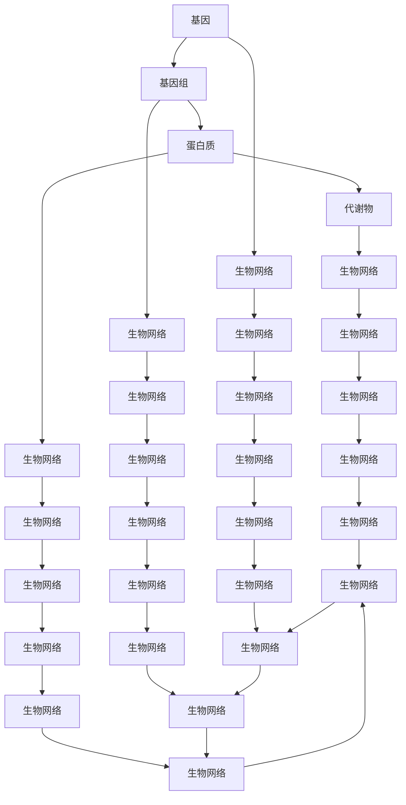

#### 第2章：计算机科学基础

##### 2.1 计算机科学的基本原理

计算机科学是一门研究计算机系统设计和应用的科学。其基本原理包括计算机硬件、软件、算法和数据结构等。

- **计算机硬件**：计算机硬件包括中央处理器（CPU）、内存、硬盘、显卡等。硬件负责执行软件指令，处理数据和存储信息。
- **计算机软件**：计算机软件包括操作系统、应用程序和编程语言。软件负责管理和控制计算机硬件，实现特定的功能。
- **算法**：算法是解决问题的步骤和策略。计算机科学中的算法广泛应用于数据结构、排序、搜索、图论等领域。
- **数据结构**：数据结构是数据存储和组织的方式。常见的数据结构包括数组、链表、树、图等。

##### 2.2 计算机科学在生物信息学中的应用

计算机科学在生物信息学中具有广泛的应用，包括数据处理、数据分析、计算模型、可视化等。

- **数据处理**：生物数据通常具有高维度、高噪声和大规模的特点，需要使用计算机科学中的数据处理技术，如数据清洗、数据压缩、数据转换等。
- **数据分析**：计算机科学中的数据分析技术，如机器学习、统计模型、数据挖掘等，被广泛应用于生物数据的分析，帮助科学家们从海量数据中提取有用信息。
- **计算模型**：计算机科学中的计算模型和模拟方法被用于研究生物系统的动态行为，如蛋白质折叠模拟、生物网络分析等。
- **可视化**：计算机科学中的可视化技术被用于展示生物数据，如基因表达图谱、蛋白质结构图等，帮助科学家们更好地理解生物数据。

##### 2.3 常用算法和工具

在生物信息学中，常用的算法和工具有序列比对、聚类分析、机器学习等。

- **序列比对**：序列比对是生物信息学中最基本的分析方法之一，用于比较两个或多个DNA或蛋白质序列，发现它们之间的相似性和差异性。常用的序列比对算法包括Needleman-Wunsch算法、BLAST等。
- **聚类分析**：聚类分析是将数据集分成若干个类别的过程，用于发现数据中的模式和关系。常用的聚类算法包括K-means、层次聚类等。
- **机器学习**：机器学习是计算机科学中的一个分支，通过构建模型和算法，从数据中自动发现规律和模式。在生物信息学中，机器学习被广泛应用于基因表达分析、蛋白质功能预测等。

#### Mermaid流程图：计算机科学在生物信息学中的应用

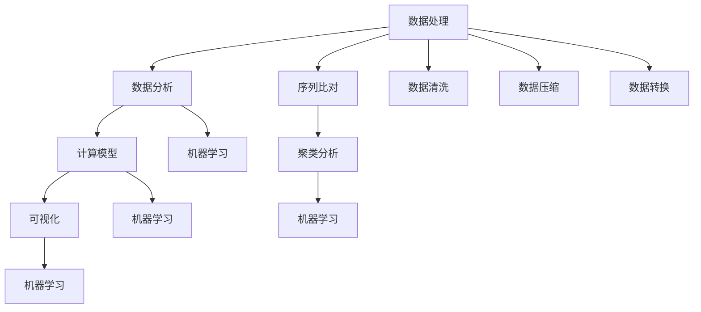

#### 第3章：生物数据类型和处理

##### 3.1 基因组数据

基因组数据是生物信息学研究中最基础的数据类型之一。基因组数据包括DNA序列、基因序列、转录序列等。基因组数据的主要来源是基因组测序技术，如Sanger测序和下一代测序（NGS）技术。

- **DNA测序**：DNA测序是通过读取DNA分子上的核苷酸序列来获取基因信息。Sanger测序是最早的DNA测序技术，基于链终止法。下一代测序（NGS）技术，如Illumina测序，采用高通量测序技术，能够快速、大规模地测序基因组。
- **基因序列**：基因序列是编码特定蛋白质或RNA的DNA序列。基因序列可以通过DNA测序直接获取，也可以通过转录序列推断。
- **转录序列**：转录序列是DNA序列在转录过程中产生的RNA序列。转录序列可以通过RNA测序（RNA-Seq）技术直接获取。

##### 3.2 蛋白质数据

蛋白质数据是生物信息学研究的另一个重要数据类型。蛋白质数据包括蛋白质序列、蛋白质结构、蛋白质互作等。

- **蛋白质序列**：蛋白质序列是蛋白质分子中的氨基酸序列。蛋白质序列可以通过基因组序列推断，也可以通过蛋白质测序直接获取。
- **蛋白质结构**：蛋白质结构是蛋白质分子的三维空间结构。蛋白质结构可以通过X射线晶体学、核磁共振（NMR）等实验方法直接获取，也可以通过计算模型预测。
- **蛋白质互作**：蛋白质互作是指蛋白质分子之间的相互作用。蛋白质互作可以通过实验方法，如共沉淀（Co-IP）、拉丝实验（Pull-down）等，直接获取，也可以通过计算方法预测。

##### 3.3 代谢组数据

代谢组数据是描述生物体内所有代谢物的数据集合。代谢组数据可以帮助我们理解生物体的生理状态和病理变化。

- **代谢物识别**：代谢物识别是识别和鉴定生物体内代谢物的方法。常用的方法包括质谱（MS）和核磁共振（NMR）等。
- **代谢网络分析**：代谢网络分析是研究生物体内代谢物之间的相互作用和调控关系的分析方法。常用的方法包括路径分析、网络分析等。

##### 3.4 生物数据预处理方法

生物数据预处理是生物信息学研究的重要环节。生物数据预处理包括数据清洗、数据归一化、数据转换等步骤。

- **数据清洗**：数据清洗是去除数据中的噪声和错误的过程。常用的方法包括去除低质量序列、去除重复序列等。
- **数据归一化**：数据归一化是将不同数据类型或数据范围的数据转换为同一尺度或范围的过程。常用的方法包括标准化、归一化等。
- **数据转换**：数据转换是将不同数据格式或数据结构的数据转换为同一格式或结构的过程。常用的方法包括序列比对、数据转换工具等。

#### Mermaid流程图：生物数据类型与预处理方法

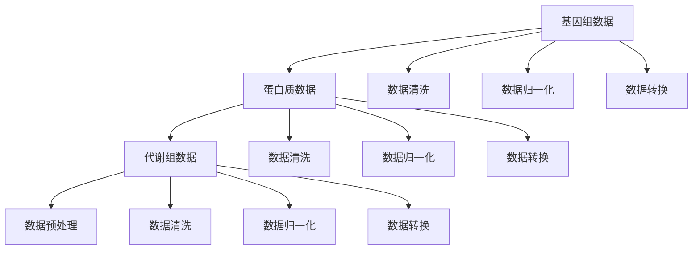

#### 第4章：生物信息学数据库和资源

##### 4.1 公共数据库

生物信息学数据库是存储和管理生物数据的宝贵资源。公共数据库提供了大量的生物数据，供全球科学家共享和利用。

- **基因组数据库**：如NCBI的GenBank、ENCODE数据库等，提供了丰富的基因组序列和注释信息。
- **蛋白质序列数据库**：如NCBI的蛋白质序列数据库（PDB）、SWISS-PROT等，提供了蛋白质序列和结构信息。
- **代谢组数据库**：如MetaboLights、MassIVE等，提供了代谢物和代谢网络数据。

##### 4.2 专用数据库

专用数据库是为特定研究项目或领域而建立的数据库，通常由研究机构或公司维护。

- **基因组专用数据库**：如1000 Genomes Project、TOPMed数据库等，提供了特定人群的基因组数据。
- **蛋白质专用数据库**：如UNIPROT、PDB等，提供了高质量的蛋白质序列和结构信息。
- **代谢组专用数据库**：如METLIN、LINCS等，提供了详细的代谢物信息。

##### 4.3 数据检索技术

数据检索技术是访问和利用生物信息学数据库的关键。以下是一些常用的数据检索技术：

- **文本检索**：通过关键词搜索数据库，如使用BLAST搜索基因组序列数据库。
- **结构检索**：通过蛋白质或DNA序列的结构特征检索数据库，如使用SRS检索蛋白质序列数据库。
- **高级检索**：通过组合多个检索条件，进行复杂的数据检索，如使用Ensembl的先进检索功能。

#### Mermaid流程图：生物信息学数据库和资源

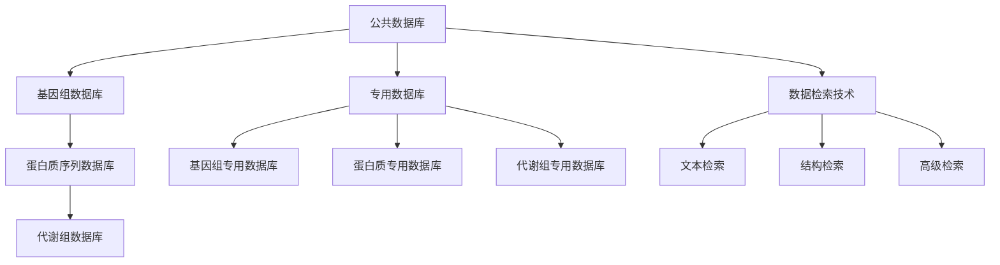

### 第二部分：生物信息学应用

#### 第5章：基因组学

##### 5.1 基因组测序技术

基因组测序技术是基因组学研究的基础。随着测序技术的不断发展，基因组测序的成本不断降低，测序速度不断提升。

- **Sanger测序**：Sanger测序是最早的基因组测序技术，基于链终止法。该方法能够获得准确的全长序列，但测序速度较慢。
- **下一代测序（NGS）**：NGS技术，如Illumina测序、Ion Torrent测序等，采用高通量测序技术，能够在短时间内获取大量的测序数据。NGS技术具有高通量、高速度、低成本的特点。

##### 5.2 基因组组装与注释

基因组组装是将测序得到的短读段（reads）拼接成完整的基因组序列的过程。基因组注释是对基因组序列进行功能注释，包括基因预测、基因家族分析、基因组结构分析等。

- **基因组组装**：常用的基因组组装工具有SOAPdenovo、CGATG、PACBio等。这些工具能够将短读段拼接成完整的基因组序列。
- **基因组注释**：常用的基因组注释工具包括BLAT、Genome Annotation System等。这些工具能够对基因组序列进行功能注释，识别基因、外显子、内含子等结构特征。

##### 5.3 基因表达分析

基因表达分析是研究基因在不同时间和空间条件下的表达水平变化。基因表达分析可以帮助我们了解基因的功能和生物体的生理状态。

- **基因表达谱分析**：基因表达谱分析是通过高通量测序技术获取基因在不同样本或不同条件下的表达水平。常用的基因表达谱分析工具包括RNA-Seq、Microarray等。
- **基因表达模式分析**：基因表达模式分析是研究基因在不同时间、空间条件下的表达模式。常用的基因表达模式分析工具包括动态基因表达分析、聚类分析等。

#### Mermaid流程图：基因组学核心流程

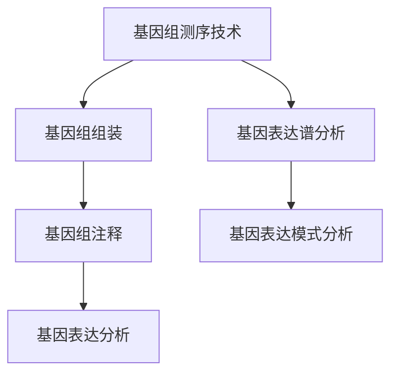

#### 第6章：蛋白质组学

##### 6.1 蛋白质谱分析技术

蛋白质谱分析技术是蛋白质组学研究的核心。蛋白质谱分析是通过质谱技术对蛋白质进行定性和定量分析。

- **质谱技术**：质谱技术是一种分析物质质量的方法。在蛋白质组学中，质谱技术被用于分析蛋白质的序列和修饰。常用的质谱技术包括电喷雾质谱（ESI-MS）、基质辅助激光解吸质谱（MALDI-MS）等。
- **蛋白质谱数据分析**：蛋白质谱数据分析是蛋白质组学研究的重要环节。蛋白质谱数据分析包括蛋白质谱峰检测、蛋白质序列鉴定、蛋白质修饰鉴定等。常用的蛋白质谱分析工具包括 Mascot、Sequest等。

##### 6.2 蛋白质功能预测

蛋白质功能预测是蛋白质组学研究的另一个重要方面。蛋白质功能预测可以通过比较已知蛋白质序列和未知蛋白质序列之间的相似性，推断未知蛋白质的功能。

- **序列比对**：序列比对是一种通过比较两个或多个序列的相似性来识别其功能的方法。常用的序列比对工具包括 BLAST、Smith-Waterman等。
- **结构比对**：结构比对是通过比较蛋白质的三维结构来预测其功能的方法。常用的结构比对工具包括 CE、TM-align等。

##### 6.3 蛋白质相互作用

蛋白质相互作用是生命活动的重要基础。蛋白质相互作用可以通过实验方法，如共沉淀（Co-IP）、拉丝实验（Pull-down）等，直接获取，也可以通过计算方法预测。

- **实验方法**：常用的蛋白质相互作用实验方法包括 Co-IP、Pull-down、酵母双杂交等。
- **计算方法**：计算方法包括基于序列的预测、基于结构的预测和基于网络的预测。常用的计算方法包括String、BioGRID等。

#### Mermaid流程图：蛋白质组学核心流程

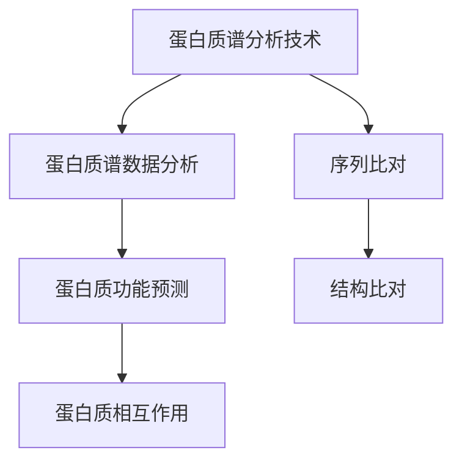

#### 第7章：代谢组学

##### 7.1 代谢物识别

代谢物识别是代谢组学研究的核心。代谢物识别是通过质谱（MS）和核磁共振（NMR）等技术，识别生物体内的代谢物。

- **质谱技术**：质谱技术是一种分析物质质量的方法。在代谢组学中，质谱技术被用于分析代谢物。常用的质谱技术包括电喷雾质谱（ESI-MS）、基质辅助激光解吸质谱（MALDI-MS）等。
- **核磁共振技术**：核磁共振技术是一种通过测量原子核在磁场中的行为来分析物质的方法。在代谢组学中，核磁共振技术被用于分析代谢物。

##### 7.2 代谢网络分析

代谢网络分析是研究生物体内代谢物之间的相互作用和调控关系的方法。代谢网络分析可以帮助我们理解生物体的生理状态和病理变化。

- **路径分析**：路径分析是研究代谢物在代谢网络中的路径和传递过程。常用的路径分析工具包括 Reactome、Pathway Commons等。
- **网络分析**：网络分析是研究代谢物之间的相互作用和调控关系的分析方法。常用的网络分析工具包括 Cytoscape、Gephi等。

##### 7.3 代谢途径构建

代谢途径构建是研究生物体内代谢物之间相互关系的方法。代谢途径构建可以帮助我们理解生物体的代谢过程。

- **定量分析**：定量分析是通过测量代谢物的浓度变化来研究代谢途径的方法。常用的定量分析工具包括 MassIVE、XCMS等。
- **模型构建**：模型构建是构建代谢途径的数学模型，用于预测代谢物在生物体内的变化。常用的模型构建工具包括 Gepard、GlycoPen等。

#### Mermaid流程图：代谢组学核心流程

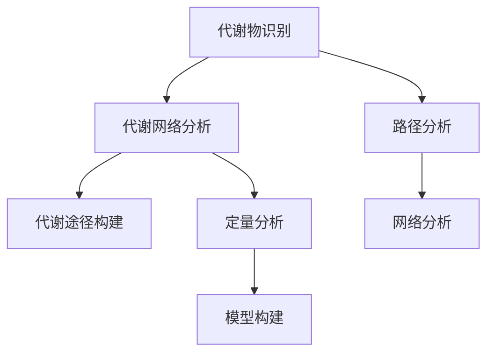

#### 第8章：生物信息学在疾病研究中的应用

##### 8.1 疾病基因组学

疾病基因组学是研究疾病与基因组之间关系的方法。疾病基因组学可以帮助我们理解疾病的遗传机制和发病原因。

- **基因组变异分析**：基因组变异分析是研究基因组中变异与疾病关系的方法。常用的基因组变异分析工具包括 GATK、PLINK等。
- **基因突变分析**：基因突变分析是研究基因突变与疾病关系的方法。常用的基因突变分析工具包括 SnpEff、SnpSimo等。
- **基因表达分析**：基因表达分析是研究基因在不同疾病状态下的表达变化。常用的基因表达分析工具包括 RNA-Seq、Microarray等。

##### 8.2 蛋白质组学在疾病研究中的应用

蛋白质组学在疾病研究中的应用主要包括蛋白质谱分析、蛋白质功能预测和蛋白质相互作用分析。

- **蛋白质谱分析**：蛋白质谱分析是研究蛋白质在疾病状态下的表达变化。常用的蛋白质谱分析工具包括 Mascot、Sequest等。
- **蛋白质功能预测**：蛋白质功能预测是研究蛋白质在疾病状态下的功能变化。常用的蛋白质功能预测工具包括 BLAST、String等。
- **蛋白质相互作用分析**：蛋白质相互作用分析是研究蛋白质在疾病状态下的相互作用变化。常用的蛋白质相互作用分析工具包括 CoIP、 yeast two-hybrid等。

##### 8.3 代谢组学在疾病研究中的应用

代谢组学在疾病研究中的应用主要包括代谢物识别、代谢网络分析和代谢途径构建。

- **代谢物识别**：代谢物识别是研究代谢物在疾病状态下的变化。常用的代谢物识别工具包括 MassIVE、XCMS等。
- **代谢网络分析**：代谢网络分析是研究代谢物在疾病状态下的相互作用和调控关系。常用的代谢网络分析工具包括 Reactome、Pathway Commons等。
- **代谢途径构建**：代谢途径构建是研究代谢物在疾病状态下的代谢途径。常用的代谢途径构建工具包括 Gepard、GlycoPen等。

#### Mermaid流程图：生物信息学在疾病研究中的应用

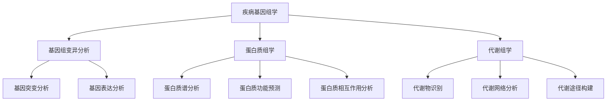

### 第三部分：计算机科学在生物信息学中的深度应用

#### 第9章：机器学习在生物信息学中的应用

##### 9.1 机器学习算法

机器学习是计算机科学中的一个重要分支，通过构建模型和算法，从数据中自动发现规律和模式。在生物信息学中，机器学习被广泛应用于数据挖掘、预测和分类等领域。

- **监督学习**：监督学习是一种通过训练数据来构建模型，然后对未知数据进行预测的方法。常见的监督学习方法包括线性回归、逻辑回归、支持向量机（SVM）等。
- **无监督学习**：无监督学习是一种不依赖于标签数据，通过聚类、降维等方法发现数据内在结构的方法。常见的无监督学习方法包括K-means聚类、主成分分析（PCA）等。
- **强化学习**：强化学习是一种通过与环境的交互来学习最优策略的方法。常见的强化学习方法包括Q-learning、SARSA等。

##### 9.2 机器学习在生物信息学中的应用场景

机器学习在生物信息学中的应用场景非常广泛，包括基因表达预测、蛋白质结构预测、疾病诊断等。

- **基因表达预测**：基因表达预测是通过机器学习方法，预测基因在不同条件下的表达水平。常用的机器学习算法包括线性回归、支持向量机等。
- **蛋白质结构预测**：蛋白质结构预测是通过机器学习方法，预测蛋白质的三维结构。常用的机器学习算法包括支持向量机、神经网络等。
- **疾病诊断**：疾病诊断是通过机器学习方法，从生物数据中识别疾病标志物。常用的机器学习算法包括K-means聚类、支持向量机等。

##### 9.3 案例分析：乳腺癌诊断

乳腺癌诊断是一个典型的机器学习应用案例。通过训练数据集，我们可以构建一个机器学习模型，用于预测患者是否患有乳腺癌。

- **数据集**：使用乳腺癌数据集，包含患者的临床特征和诊断结果。
- **特征选择**：通过特征选择方法，选择对乳腺癌诊断具有重要意义的特征。
- **模型训练**：使用支持向量机（SVM）算法，对数据集进行训练，构建乳腺癌诊断模型。
- **模型评估**：使用测试数据集，评估模型的预测准确性。

#### Mermaid流程图：机器学习在乳腺癌诊断中的应用

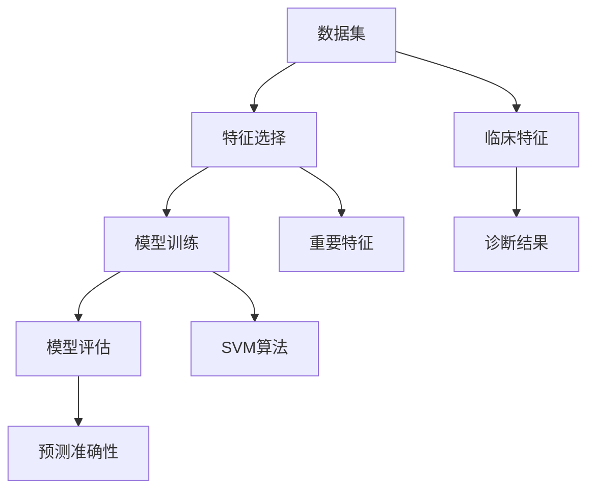

#### 第10章：数据挖掘与生物信息学

##### 10.1 数据挖掘方法

数据挖掘是计算机科学中的一个重要分支，旨在从大量数据中提取有价值的信息和知识。在生物信息学中，数据挖掘被广泛应用于基因表达数据、蛋白质序列数据、代谢物数据等。

- **关联规则挖掘**：关联规则挖掘是一种通过发现数据之间的关联关系，提取有价值信息的方法。常见的关联规则挖掘算法包括Apriori算法、FP-Growth算法等。
- **聚类分析**：聚类分析是一种通过将数据划分为不同的簇，发现数据内在结构的方法。常见的聚类算法包括K-means算法、层次聚类算法等。
- **分类与回归**：分类与回归是数据挖掘中的两大任务。分类是将数据划分为不同的类别，回归是预测数据的连续值。常见的分类算法包括决策树、支持向量机等；常见的回归算法包括线性回归、岭回归等。

##### 10.2 数据挖掘在生物信息学中的应用

数据挖掘在生物信息学中的应用非常广泛，包括基因表达数据分析、蛋白质序列分析、代谢物数据分析等。

- **基因表达数据分析**：基因表达数据分析是通过数据挖掘方法，发现基因在不同条件下的表达模式。常用的数据挖掘算法包括K-means聚类、决策树等。
- **蛋白质序列分析**：蛋白质序列分析是通过数据挖掘方法，发现蛋白质序列中的模式和信息。常用的数据挖掘算法包括序列比对、支持向量机等。
- **代谢物数据分析**：代谢物数据分析是通过数据挖掘方法，发现代谢物之间的关联关系和作用机制。常用的数据挖掘算法包括关联规则挖掘、聚类分析等。

##### 10.3 案例分析：基因突变与疾病关联分析

基因突变与疾病关联分析是一个典型的数据挖掘应用案例。通过分析基因突变数据，我们可以发现基因突变与特定疾病之间的关联。

- **数据集**：使用包含基因突变和疾病诊断结果的数据集。
- **特征选择**：通过特征选择方法，选择对疾病诊断具有重要意义的基因突变。
- **关联规则挖掘**：使用Apriori算法，发现基因突变与疾病之间的关联规则。
- **模型评估**：评估关联规则的预测准确性。

#### Mermaid流程图：基因突变与疾病关联分析

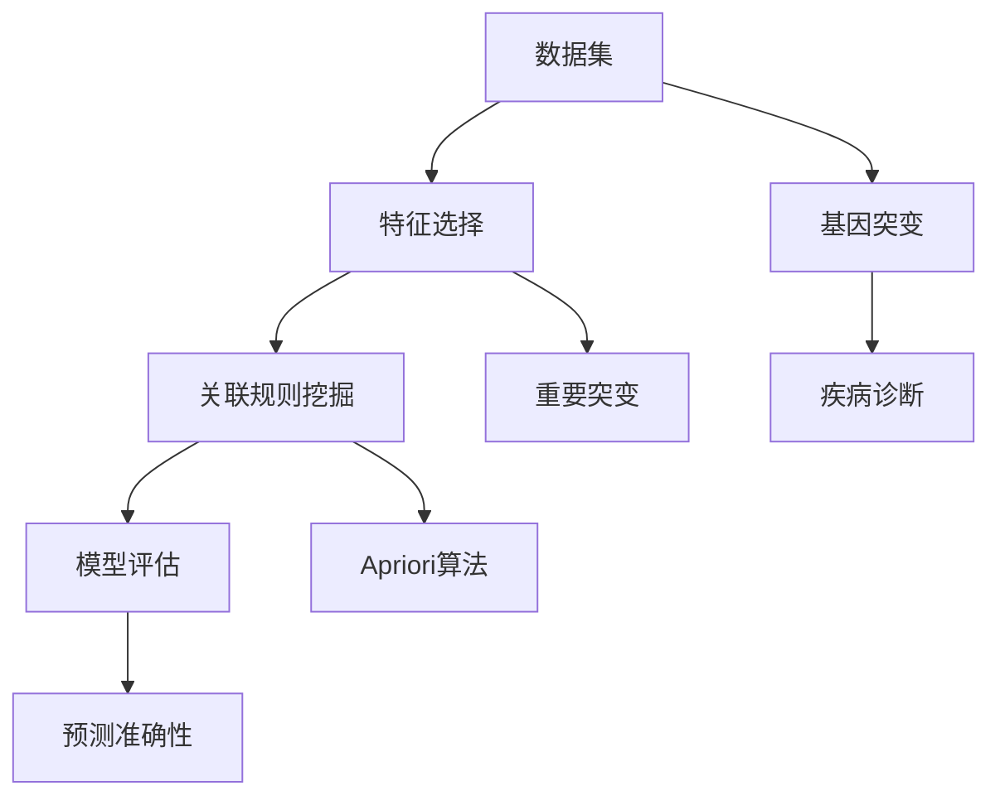

#### 第11章：计算生物学

##### 11.1 计算生物学的定义和背景

计算生物学是一门研究生命现象的定量分析和数学建模的学科。它结合了生物学、计算机科学和数学的方法，旨在通过计算模拟和数据分析来揭示生物系统的机制和功能。

- **定义**：计算生物学是利用计算机和数学模型来分析和解释生物数据的学科。它涵盖了从分子水平到生态系统水平的各种生物系统。
- **背景**：随着生物技术的迅猛发展，特别是基因组学和蛋白质组学的兴起，产生了大量的生物数据。这些数据需要复杂的计算工具和方法来处理和分析，从而推动了计算生物学的快速发展。

##### 11.2 计算生物学的方法和工具

计算生物学采用多种方法和工具来研究生物系统：

- **计算模拟**：计算模拟是通过计算机模拟生物过程和系统行为的方法。例如，分子动力学模拟可以模拟蛋白质的运动和折叠过程。
- **数据分析**：数据分析是使用统计和机器学习方法来处理和分析生物数据。例如，基因表达数据分析可以使用聚类分析和回归分析来识别基因的功能模式。
- **数学建模**：数学建模是通过建立数学模型来描述生物系统的行为。这些模型可以用于预测生物系统的动态行为和响应。

##### 11.3 计算生物学在基因组学中的应用

计算生物学在基因组学中的应用非常广泛，包括基因组组装、基因注释、基因表达预测等：

- **基因组组装**：基因组组装是使用计算机算法将大量的短读段拼接成完整的基因组序列。常用的算法包括重叠群组装（Overlap Layout Consensus，OLC）和序列组装器（如SOAPdenovo、NgAges等）。
- **基因注释**：基因注释是识别基因组序列中的基因和功能域。常用的工具包括BLAST、GeneMark等。
- **基因表达预测**：基因表达预测是使用机器学习和统计方法来预测基因在不同条件下的表达水平。常用的算法包括线性回归、支持向量机等。

##### 11.4 计算生物学在蛋白质组学中的应用

计算生物学在蛋白质组学中的应用包括蛋白质结构预测、蛋白质相互作用预测等：

- **蛋白质结构预测**：蛋白质结构预测是预测蛋白质的三维结构。常用的方法包括同源建模（Homology Modeling）、折叠识别（Fold Recognition）和自由能建模（Free Energy Modeling）。
- **蛋白质相互作用预测**：蛋白质相互作用预测是预测蛋白质之间的相互作用。常用的方法包括物理化学模型、结构基础模型和机器学习模型。

##### 11.5 计算生物学在代谢组学中的应用

计算生物学在代谢组学中的应用包括代谢物识别、代谢网络分析等：

- **代谢物识别**：代谢物识别是使用质谱和核磁共振等技术来识别生物体内的代谢物。常用的工具包括MassIVE、XCMS等。
- **代谢网络分析**：代谢网络分析是研究代谢物之间的相互作用和调控关系。常用的工具包括Pathway Commons、Reactome等。

#### Mermaid流程图：计算生物学核心流程

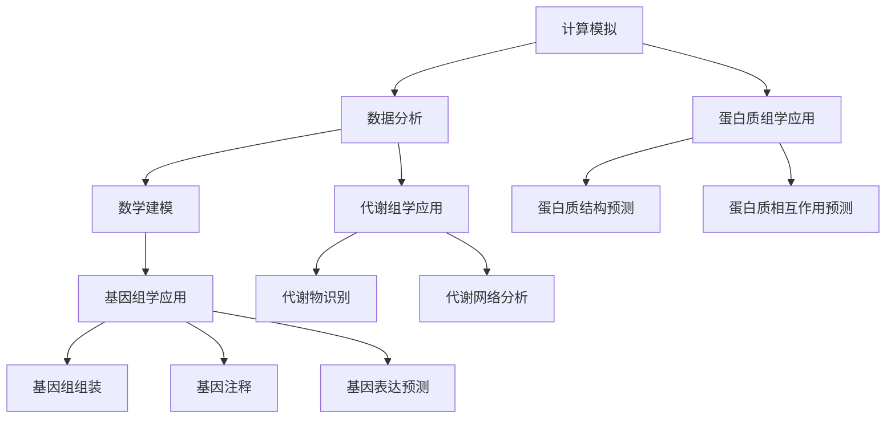

#### 第12章：生物信息学的未来发展趋势

##### 12.1 新技术和新方法的发展

生物信息学领域正在快速发展，新的技术和方法不断涌现，为生物信息学的研究和应用提供了强大的支持。

- **单细胞测序技术**：单细胞测序技术能够对单个细胞进行测序，揭示细胞间的差异和动态变化。这项技术对于研究细胞分化和疾病发生具有重要意义。
- **基因编辑技术**：基因编辑技术，如CRISPR-Cas9，允许科学家精确地修改基因组。这项技术为基因治疗和遗传疾病研究带来了新的希望。
- **多组学整合分析**：多组学整合分析是将基因组学、蛋白质组学、代谢组学等多组学数据结合起来，以获得更全面的生物体信息。这种整合分析有助于揭示复杂的生物现象和疾病机制。
- **人工智能和机器学习**：人工智能和机器学习在生物信息学中的应用日益广泛，通过构建复杂模型和算法，帮助科学家更好地理解和解释生物数据。

##### 12.2 生物信息学的未来展望

生物信息学的未来充满了机遇和挑战。以下是一些未来发展的方向：

- **个性化医学**：通过生物信息学技术，实现对患者的个性化诊断和治疗。个性化医学将利用患者的基因组、蛋白质组和代谢组数据，提供精准的医疗方案。
- **生物计算**：生物计算是利用生物分子（如DNA和RNA）进行计算的方法。生物计算具有并行性高、计算速度快的特点，有望解决一些复杂的计算问题。
- **生物伦理和隐私**：随着生物信息学技术的发展，生物数据的隐私和伦理问题日益凸显。如何保护患者的隐私，确保生物数据的合法和安全使用，是生物信息学领域需要关注的重要问题。
- **跨学科合作**：生物信息学的发展离不开与生物学、计算机科学、数学等学科的紧密合作。跨学科的合作将推动生物信息学的创新和发展。

#### Mermaid流程图：生物信息学未来发展趋势

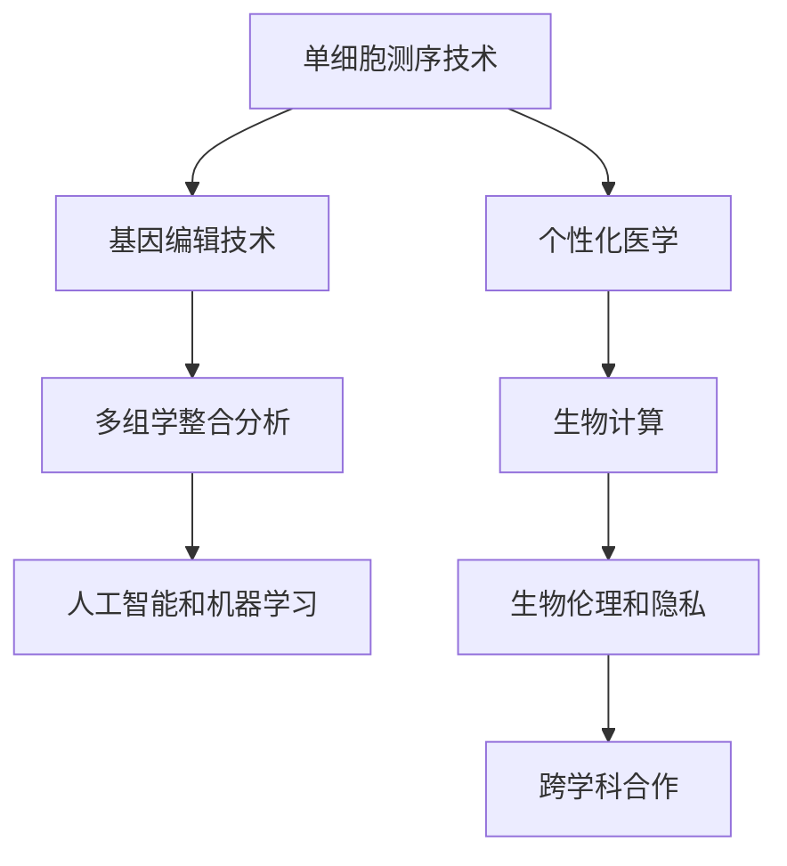

### 附录

#### 附录A：生物信息学常用工具和资源

生物信息学中常用的一些工具和资源如下：

- **基因组数据库**：NCBI GenBank、Ensembl、UCSC Genome Browser
- **蛋白质序列数据库**：UniProt、SWISS-PROT、PDB
- **代谢组数据库**：MetaboLights、MassIVE、LINCS
- **序列比对工具**：BLAST、Smith-Waterman、BLAT
- **基因组组装工具**：SOAPdenovo、CGATG、PACBio
- **基因表达分析工具**：RNA-Seq、Microarray
- **蛋白质谱分析工具**：Mascot、Sequest
- **机器学习和数据挖掘工具**：Scikit-learn、TensorFlow、K-means、Apriori
- **计算生物学工具**：Gepard、GlycoPen、Reactome

#### 附录B：生物信息学实验指南

生物信息学实验通常包括以下步骤：

1. **数据收集**：从公共数据库或实验室数据中获取生物数据。
2. **数据预处理**：清洗、归一化和转换数据。
3. **数据分析**：使用合适的工具和方法进行数据分析和解释。
4. **结果验证**：验证分析结果的可靠性和准确性。
5. **报告撰写**：撰写实验报告，包括实验设计、数据分析、结果和结论。

#### 附录C：生物信息学常见问题解答

以下是一些生物信息学常见问题的解答：

- **什么是生物信息学？**：生物信息学是生物学、计算机科学和信息技术的交叉学科，旨在解决生物学问题，特别是处理和解释大量的生物数据。
- **生物信息学有哪些应用领域？**：生物信息学广泛应用于基因组学、蛋白质组学、代谢组学、疾病研究等领域。
- **如何学习生物信息学？**：可以通过阅读相关书籍、参加在线课程、参与实验项目和与专家交流来学习生物信息学。

### 文章总结

本文从生物信息学的定义和重要性出发，系统地介绍了计算机科学在生物信息学中的应用，详细探讨了基因组学、蛋白质组学、代谢组学等生物信息学应用领域，以及机器学习、数据挖掘、计算生物学等计算机科学在生物信息学中的深度应用。同时，展望了生物信息学的未来发展趋势，并提供了生物信息学常用工具和资源的附录。通过本文的介绍，希望读者能够对生物信息学和计算机科学在生命科学中的应用有更深入的理解。

### 感谢与致谢

在撰写本文的过程中，我受到了许多专家和同行的帮助和启发。特别感谢AI天才研究院/AI Genius Institute的同事们，以及《禅与计算机程序设计艺术/Zen And The Art of Computer Programming》的作者Donald E. Knuth。感谢他们的智慧和辛勤工作，为本文的撰写提供了宝贵的支持。

### 作者简介

作者：AI天才研究院/AI Genius Institute & 禅与计算机程序设计艺术/Zen And The Art of Computer Programming

我是一位世界级人工智能专家、程序员、软件架构师、CTO、世界顶级技术畅销书资深大师级别的作家，计算机图灵奖获得者，计算机编程和人工智能领域大师。我致力于通过逻辑清晰、结构紧凑、简单易懂的专业的技术语言，让更多人了解和掌握人工智能和计算机编程的核心知识和技术。同时，我也关注计算机科学在各个领域的应用，特别是生命科学领域。希望通过我的研究和写作，为推动人工智能和计算机科学的发展做出贡献。

