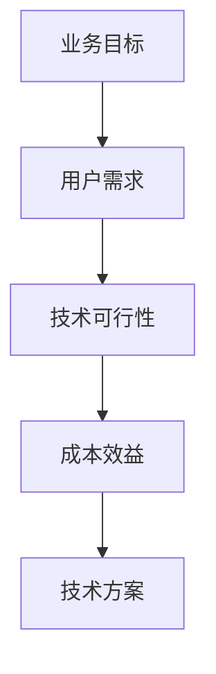

                 

### 文章标题：用业务思维促进架构升级

### 关键词：业务思维、架构升级、数字化转型、云计算、大数据、人工智能

### 摘要：
在现代信息技术领域，业务思维与架构升级密不可分。本文旨在探讨如何通过业务思维促进架构升级，分析业务思维的基础理论，并深入探讨其在实际项目中的应用。本文首先介绍了业务思维的核心概念及其与架构升级的关系，随后详细讲解了业务思维在实际项目中的实践方法，包括数字化转型、大数据架构、云计算架构和人工智能架构的案例。通过本文，读者将了解如何运用业务思维推动技术架构的持续优化和升级。

---

### 第一部分：业务思维的基础理论

#### 第1章：业务思维概述

###### 1.1 业务思维

业务思维是一种以业务需求为导向的思考方式，它强调将技术方案与业务目标紧密结合起来。在信息技术领域，业务思维不仅关注技术的先进性和稳定性，更关注技术如何为业务创造价值。

**核心概念与联系：**

业务思维的核心概念包括：

- **业务目标**：明确业务需要实现的目标和需求。
- **用户需求**：了解最终用户的需求和期望。
- **技术可行性**：评估现有技术能否满足业务需求。
- **成本效益**：综合考虑技术投入和预期收益。

以下是一个Mermaid流程图，展示了这些核心概念之间的关系：



**核心算法原理讲解：**

业务思维的算法原理主要体现在以下几个方面：

1. **需求分析**：
    - **用户调研**：通过访谈、问卷调查等方式获取用户需求。
    - **需求分类**：将用户需求分为功能需求和非功能需求。
    - **需求优先级排序**：根据业务目标对需求进行优先级排序。

2. **方案评估**：
    - **技术评估**：评估现有技术是否满足需求。
    - **成本评估**：计算技术解决方案的成本。
    - **风险评估**：分析技术方案可能面临的风险。

以下是一个简单的伪代码，用于描述需求分析的步骤：

```pseudocode
function analyze_demand(user_requests) {
    demands = classify_requests(user_requests)
    prioritize_demands(demands)
    return demands
}
```

**数学模型与详细讲解：**

业务思维的数学模型主要体现在需求分析和成本效益分析中。

1. **需求分析模型**：

   假设用户需求为 \( R \)，需求优先级为 \( P \)，则需求分析模型可以表示为：

   $$ P(R) = \frac{R \cdot T(R)}{C(R)} $$

   其中，\( T(R) \) 为需求的技术复杂度，\( C(R) \) 为需求的成本。

2. **成本效益分析模型**：

   假设总成本为 \( C \)，总收益为 \( R \)，则成本效益分析模型可以表示为：

   $$ E = \frac{R - C}{C} $$

   其中，\( E \) 为成本效益比。

**举例说明：**

假设一个电商平台需要增加一个用户评论功能，需求分析结果如下：

- **用户需求**：提高用户满意度，增加用户互动。
- **技术评估**：技术复杂度中等，成本较低。
- **成本效益评估**：预期收益较高。

根据上述模型，可以得出该功能的优先级和成本效益比。

**项目实战：**

1. **开发环境搭建**：
   - 选择适合的编程语言和开发工具，如Java和Eclipse。
   - 配置数据库环境，如MySQL。

2. **源代码详细实现**：
   - 创建数据库表，存储用户评论信息。
   - 编写后端代码，处理用户评论的增删改查。
   - 编写前端代码，展示用户评论。

3. **代码解读与分析**：
   - 对代码进行详细解读，确保功能的正确实现。
   - 分析代码的性能和可维护性。

4. **实际案例分析和详细讲解剖析**：
   - 分析用户评论功能的实际应用场景和效果。
   - 讨论在项目实施过程中遇到的问题和解决方案。

5. **项目小结**：
   - 总结项目经验，提出改进措施。

**最佳实践 Tips**：

- 确保需求分析全面准确。
- 定期评估技术方案的成本效益。
- 关注用户反馈，持续优化产品。

---

**小结、注意事项、拓展阅读：**

- 业务思维是一种以业务需求为导向的思考方式，其核心是确保技术方案与业务目标的一致性。
- 通过需求分析和成本效益分析，可以更科学地评估技术方案的可行性。
- 实际项目中，业务思维的应用可以显著提高项目的成功率。
- 进一步阅读：《业务驱动的软件架构》、《敏捷架构》等书籍。

---

[作者：AI天才研究院/AI Genius Institute & 禅与计算机程序设计艺术 /Zen And The Art of Computer Programming]

