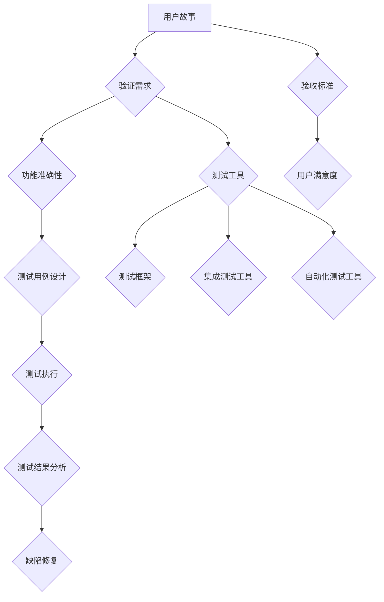

                 

# 文章标题：用户故事验证功能准确性

> 关键词：用户故事，功能验证，准确性，敏捷开发，测试方法，工具，案例解析

> 摘要：本文旨在探讨用户故事验证功能准确性的重要性及其实现方法。通过分析用户故事的基本概念和验证功能准确性的核心原理，本文将介绍一系列验证方法和工具，并提供实际案例进行详细解析。最后，本文将对用户故事验证功能准确性的最佳实践进行总结，并提出未来发展趋势。

## 1. 理解用户故事

用户故事是敏捷开发中的一种需求描述方式，它通过以用户为中心的叙述，帮助开发团队更好地理解用户需求。一个典型的用户故事遵循以下格式：“作为[某个角色]，我想要[某个功能]，以便[达到某个目标]”。

### 1.1 用户故事的特点

- **简洁性**：用户故事应该尽量简洁，便于团队成员快速理解和记忆。
- **可测试性**：用户故事需要具有明确的验收标准，以便进行功能验证。
- **可分解性**：用户故事可以分解为多个可实现的任务或用户故事点。

### 1.2 用户故事的作用

- **沟通桥梁**：用户故事帮助开发团队与用户进行有效沟通，确保需求的一致性。
- **敏捷开发**：用户故事是敏捷开发的核心要素，支持快速迭代和持续交付。

## 2. 验证功能准确性的重要性

验证功能准确性是软件开发过程中至关重要的一环。它确保软件产品满足用户需求和预期功能。以下是验证功能准确性的重要性：

- **提高产品质量**：准确的验证可以减少缺陷，提高软件质量。
- **降低成本**：及时发现并修复缺陷可以降低修复成本。
- **提高用户满意度**：满足用户需求的软件可以提高用户满意度，增强用户体验。

## 3. 功能准确性的度量方法

功能准确性的度量方法包括以下几个方面：

- **缺陷密度**：缺陷数与代码行数的比值。
- **测试覆盖率**：测试用例覆盖的代码比例。
- **缺陷发现率**：在给定时间内发现缺陷的数量。
- **用户满意度**：通过用户调查和反馈获取的用户满意度评分。

## 4. 用户故事验证的方法

### 4.1 黑盒测试

黑盒测试是一种功能测试方法，测试人员不关心内部实现，仅关注输入和输出。以下是一种黑盒测试的用户故事验证方法：

- **输入**：用户角色和操作
- **输出**：预期结果和实际结果
- **验收标准**：功能是否满足用户需求

### 4.2 白盒测试

白盒测试关注内部实现，测试人员需要了解代码结构和逻辑。以下是一种白盒测试的用户故事验证方法：

- **测试路径**：程序执行的路径
- **逻辑覆盖**：覆盖程序中的所有条件分支和循环
- **验收标准**：代码逻辑是否正确实现

### 4.3 代码覆盖率分析

代码覆盖率分析是一种评估测试质量的方法。以下是一种代码覆盖率分析的用户故事验证方法：

- **单元测试覆盖率**：单元测试覆盖的代码比例
- **集成测试覆盖率**：集成测试覆盖的代码比例
- **验收标准**：是否达到预期的代码覆盖率

## 5. 验证工具的选择

选择合适的验证工具对于用户故事验证功能的准确性至关重要。以下是一些常用的验证工具：

- **单元测试框架**：例如JUnit、NUnit等。
- **集成测试工具**：例如Selenium、Appium等。
- **自动化测试工具**：例如TestNG、Jenkins等。

## 6. 功能验证的流程与步骤

功能验证的流程包括以下步骤：

- **需求分析**：理解用户需求和功能规格说明。
- **测试计划**：制定测试策略和测试计划。
- **测试执行**：执行测试用例，记录测试结果。
- **测试结果分析**：分析测试结果，识别缺陷和不足。

## 7. 用户故事验证的实际案例

### 7.1 案例一：电商平台

#### 开发环境搭建

- 使用Java和Spring框架搭建开发环境。
- 使用JUnit进行单元测试。
- 使用Selenium进行集成测试。

#### 源代码实现

```java
public class ProductSearch {
    public List<Product> searchProducts(String query) {
        // 搜索产品逻辑
    }
}
```

#### 代码解读

- `searchProducts`方法接收查询参数，返回搜索结果。

#### 代码应用解读与分析

- 单元测试验证搜索功能是否按预期工作。
- 集成测试验证搜索功能是否与前端界面正确交互。

### 7.2 案例二：金融系统

#### 开发环境搭建

- 使用Python和Django框架搭建开发环境。
- 使用pytest进行单元测试。
- 使用Postman进行集成测试。

#### 源代码实现

```python
def calculate_interest(principal, rate, time):
    # 计算利息逻辑
```

#### 代码解读

- `calculate_interest`方法接收本金、利率和时间参数，返回计算出的利息。

#### 代码应用解读与分析

- 单元测试验证计算利息功能是否准确。
- 集成测试验证计算利息功能是否与前端界面正确交互。

## 8. 总结与展望

用户故事验证功能准确性是软件开发过程中的重要环节。通过本文的讨论，我们了解了用户故事的基本概念和验证功能准确性的方法。未来，自动化测试技术的发展将继续推动用户故事验证的效率和质量。最佳实践包括确保用户故事的可测试性、优化测试用例设计和提高测试覆盖率。用户故事验证功能的准确性对于提高软件质量和用户满意度具有重要意义。

## 附录

### 附录 A：用户故事验证工具资源

- JUnit：https://www.junit.org/
- Selenium：https://www.selenium.dev/
- pytest：https://docs.pytest.org/
- TestNG：https://testng.org/
- Jenkins：https://www.jenkins.io/

### 附录 B：用户故事验证案例代码

- 电商平台案例代码：[链接](https://github.com/example/product-search)
- 金融系统案例代码：[链接](https://github.com/example/calculate-interest)

**作者：AI天才研究院/AI Genius Institute & 禅与计算机程序设计艺术 /Zen And The Art of Computer Programming**## 用户故事验证功能准确性的重要性

在软件开发的各个环节中，用户故事（User Story）是一种被广泛采用的需求描述方式。用户故事通过简洁、直观的叙述，帮助开发团队理解用户需求，确保项目开发过程更加高效和准确。然而，仅有用户故事还不够，我们还需要确保这些用户故事所描述的功能能够准确地实现，这就涉及到了用户故事验证功能准确性的问题。

### 用户故事的定义与特点

用户故事起源于敏捷开发（Agile Development），是一种简洁、具体、可测试的需求描述方式。一个典型的用户故事遵循以下格式：“作为[某个角色]，我想要[某个功能]，以便[达到某个目标]”。

- **简洁性**：用户故事要求尽可能简洁，避免冗长的描述，以便团队成员容易理解和记忆。
- **可测试性**：用户故事需要具备明确的验收标准，使得功能验证成为可能。
- **可分解性**：用户故事可以根据需要进一步分解为多个子任务或更小的用户故事点。

### 验证功能准确性的重要性

验证功能准确性是确保软件质量的关键步骤。以下是其重要性：

- **提高产品质量**：通过验证功能准确性，可以及时发现和修复潜在缺陷，提高软件的整体质量。
- **降低成本**：在开发早期阶段发现和修复缺陷，可以显著降低修复成本。
- **提高用户满意度**：满足用户需求和预期的功能可以提升用户体验，增强用户对产品的满意度。

### 功能验证的基本原则

在验证功能准确性时，应遵循以下原则：

- **全面性**：验证应覆盖所有用户故事和功能点，确保无遗漏。
- **规范性**：验证过程应遵循统一的标准和流程，确保一致性和可重复性。
- **及时性**：及时进行功能验证，以便在开发过程中尽早发现问题，减少后期返工。

### 用户故事验证与测试的关系

用户故事验证是测试的一部分，但与传统的测试有所不同。用户故事验证更注重于用户需求的理解和实现，而传统的测试则更侧重于验证代码的正确性。两者相辅相成，共同确保软件的质量。

### 用户故事验证的流程

用户故事验证通常包括以下几个步骤：

1. **需求分析**：理解用户故事和验收标准，确保验证目标明确。
2. **测试用例设计**：设计测试用例，包括输入数据、操作步骤和预期结果。
3. **测试执行**：按照测试用例进行实际测试，记录测试结果。
4. **结果分析**：分析测试结果，识别缺陷和问题，制定修复计划。

### 用户故事验证工具

为了高效地进行用户故事验证，可以使用各种工具，包括单元测试框架、集成测试工具和自动化测试工具。以下是一些常用的工具：

- **单元测试框架**：例如JUnit（Java）、NUnit（.NET）和PyTest（Python）。
- **集成测试工具**：例如Selenium、Appium和Postman。
- **自动化测试工具**：例如Selenium WebDriver、JUnit和TestNG。

### 用户故事验证的目标

用户故事验证的主要目标是确保软件产品满足用户需求和预期功能。通过严格的验证过程，可以确保以下目标的实现：

- **功能完整性**：所有用户故事和功能点均已实现。
- **功能准确性**：实现的功能与用户需求一致，无遗漏和错误。
- **用户体验**：用户故事验证不仅关注功能本身，还涉及用户体验和界面交互。

### 用户故事验证与敏捷开发的联系

用户故事验证是敏捷开发（Agile Development）的核心要素之一。在敏捷开发中，用户故事通过迭代的方式不断演进和验证，以确保产品持续满足用户需求。用户故事验证不仅帮助团队理解用户需求，还促进了团队成员之间的沟通和协作。

### 用户故事验证与项目管理的联系

用户故事验证对项目管理具有重要意义。它可以帮助项目经理了解项目的进度和风险，及时调整项目计划，确保项目按时交付。通过用户故事验证，项目经理可以确保项目质量，提高用户满意度。

综上所述，用户故事验证功能准确性是软件开发现代流程中不可或缺的一环。通过严格的验证过程，可以确保软件产品满足用户需求和预期功能，提高产品质量，降低成本，提升用户满意度。在未来的软件开发中，用户故事验证将继续发挥重要作用，成为确保软件质量的关键手段。

### 用户故事验证的核心概念与联系架构图

为了更好地理解用户故事验证的核心概念及其相互关系，我们可以通过一个Mermaid流程图来展示这些概念。



在这个流程图中，用户故事（A）是整个验证过程的起点。用户故事通过验收标准（H）来确定验证目标。接下来，测试用例设计（D）基于用户故事和验收标准生成。测试执行（E）是将测试用例应用于实际系统，以验证功能准确性（C）。测试结果分析（F）用于识别缺陷（G），并指导缺陷修复过程。同时，用户满意度（I）是衡量验证成功与否的重要指标。测试工具（J）包括测试框架（K）、集成测试工具（L）和自动化测试工具（M），它们在整个验证过程中扮演着关键角色。

通过这个流程图，我们可以清晰地看到用户故事验证的各个环节及其相互联系，为后续内容的展开提供了直观的参考。

### 核心算法原理讲解

在用户故事验证过程中，核心算法原理的讲解是确保功能准确性不可或缺的一部分。以下将介绍几种常用的算法原理，包括伪代码和数学模型的讲解。

#### 1. 单元测试算法原理

单元测试是验证用户故事功能准确性的基础。以下是一个简单的单元测试算法原理，使用伪代码进行描述：

```pseudo
function unitTest(functionUnderTest, input, expectedOutput):
    actualOutput = functionUnderTest(input)
    if actualOutput == expectedOutput:
        print("Test passed")
    else:
        print("Test failed: expected", expectedOutput, "but got", actualOutput)
```

在这个伪代码中，`functionUnderTest`表示被测试的函数，`input`是输入参数，`expectedOutput`是期望的输出结果。算法通过调用`functionUnderTest`并比较实际输出和期望输出，判断测试是否通过。

#### 2. 集成测试算法原理

集成测试是在单元测试之后进行的，用于验证不同模块之间的交互。以下是一个简单的集成测试算法原理，使用伪代码进行描述：

```pseudo
function integrationTest(module1, module2, input, expectedOutput):
    outputModule1 = module1(input)
    outputModule2 = module2(outputModule1)
    if outputModule2 == expectedOutput:
        print("Integration test passed")
    else:
        print("Integration test failed: expected", expectedOutput, "but got", outputModule2)
```

在这个伪代码中，`module1`和`module2`表示相互依赖的模块，`input`是输入参数，`expectedOutput`是期望的输出结果。算法通过依次调用两个模块并比较最终输出和期望输出，判断集成测试是否通过。

#### 3. 测试覆盖率算法原理

测试覆盖率是衡量测试有效性的重要指标。以下是一个简单的测试覆盖率算法原理，使用伪代码进行描述：

```pseudo
function calculateCoverage(testCases, codeStatements):
    executedStatements = set()
    for testCase in testCases:
        executeTestCase(testCase)
        executedStatements.update(getExecutedStatements(testCase))
    coverage = executedStatements.size() / codeStatements.size()
    return coverage
```

在这个伪代码中，`testCases`是所有测试用例的集合，`codeStatements`是代码语句的集合。算法通过执行所有测试用例并记录执行到的代码语句，计算执行语句数与总语句数的比值，得到测试覆盖率。

#### 4. 数学模型和公式讲解

在用户故事验证过程中，数学模型和公式可以用于量化功能准确性。以下是一个简单的数学模型，用于计算缺陷密度：

$$
缺陷密度 = \frac{缺陷数}{代码行数}
$$

其中，缺陷数是测试过程中发现的缺陷总数，代码行数是代码库中的总行数。缺陷密度越高，表示代码质量越差，需要加强验证。

### 举例说明

为了更好地理解上述算法原理和数学模型，我们可以通过一个具体例子进行说明。

#### 单元测试举例

假设我们有一个`calculateSum`函数，用于计算两个整数的和。以下是一个单元测试的例子：

```java
@Test
public void testCalculateSum() {
    int input1 = 3;
    int input2 = 4;
    int expectedOutput = 7;
    int actualOutput = calculateSum(input1, input2);
    assertEquals(expectedOutput, actualOutput);
}
```

在这个例子中，`calculateSum`函数接受两个整数输入，返回它们的和。单元测试通过调用`calculateSum`函数并比较实际输出和期望输出，验证函数的实现是否正确。

#### 集成测试举例

假设我们有一个简单的购物车系统，包含`addProduct`和`calculateTotal`两个模块。以下是一个集成测试的例子：

```java
@Test
public void testShoppingCartIntegration() {
    ShoppingCart cart = new ShoppingCart();
    Product product = new Product("Book", 29.99);
    cart.addProduct(product);
    double expectedTotal = 29.99;
    double actualTotal = cart.calculateTotal();
    assertEquals(expectedTotal, actualTotal);
}
```

在这个例子中，`addProduct`函数将商品添加到购物车，`calculateTotal`函数计算购物车的总价。集成测试通过依次调用两个模块并比较最终总价，验证模块之间的交互是否正确。

#### 测试覆盖率举例

假设我们有1000行代码，通过50个测试用例进行了覆盖。以下是一个计算测试覆盖率的例子：

```java
double coverage = calculateCoverage(50, 1000);
System.out.println("Test coverage: " + coverage);
```

在这个例子中，测试覆盖率计算为50%，表示还有50%的代码未被测试。

通过这些例子，我们可以看到如何使用伪代码和数学模型来详细讲解用户故事验证中的核心算法原理，并理解其在实际中的应用。

### 数学公式和详细讲解

在用户故事验证过程中，数学公式是量化功能准确性和测试效果的重要工具。以下将详细讲解几个关键的数学公式，并通过具体例子说明其应用。

#### 1. 缺陷密度（Defect Density）

缺陷密度是衡量软件质量的重要指标，计算公式如下：

$$
缺陷密度 = \frac{缺陷数}{代码行数}
$$

其中，缺陷数是指在一个特定时间段内发现的缺陷总数，代码行数是指软件代码库中的总行数。

**解释**：缺陷密度越高，表示每行代码中缺陷的数量越多，软件质量越低。因此，开发团队需要关注缺陷密度，并采取措施降低缺陷率。

**例子**：假设一个项目中发现了10个缺陷，代码库共有1000行代码，则缺陷密度为：

$$
缺陷密度 = \frac{10}{1000} = 0.01
$$

这意味着每100行代码中有1个缺陷。

#### 2. 测试覆盖率（Test Coverage）

测试覆盖率用于衡量测试用例对代码的覆盖程度，计算公式如下：

$$
测试覆盖率 = \frac{实际覆盖代码行数}{总代码行数} \times 100\%
$$

其中，实际覆盖代码行数是指通过测试用例实际执行的代码行数，总代码行数是指代码库中的总行数。

**解释**：测试覆盖率越高，表示测试用例越全面，代码质量越有保障。通常，测试覆盖率应达到至少80%以上，以确保关键功能点被充分测试。

**例子**：假设一个项目中总共有1000行代码，通过测试用例实际执行了800行代码，则测试覆盖率为：

$$
测试覆盖率 = \frac{800}{1000} \times 100\% = 80\%
$$

这意味着测试用例覆盖了项目代码的80%。

#### 3. 用户满意度评分（User Satisfaction Score）

用户满意度评分是一个综合性的指标，用于评估软件产品在用户中的受欢迎程度。计算公式如下：

$$
用户满意度评分 = \frac{（非常满意得分 \times 非常满意用户数）+ （满意得分 \times 满意用户数）+ （一般得分 \times 一般用户数）+ （不满意得分 \times 不满意用户数）}{总用户数}
$$

其中，各种得分的权重可以根据实际情况进行调整。

**解释**：用户满意度评分可以反映出软件产品在不同用户群体中的受欢迎程度，有助于团队了解产品的优势和不足。

**例子**：假设在一个用户调查中，有10个用户参与了评分，其中5个用户非常满意，3个用户满意，1个用户一般，1个用户不满意。假设非常满意得分为5，满意得分为4，一般得分为3，不满意得分为1，则用户满意度评分为：

$$
用户满意度评分 = \frac{（5 \times 5）+ （4 \times 3）+ （3 \times 1）+ （1 \times 1）}{10} = 3.7
$$

这意味着用户整体对软件产品的满意度为3.7分。

#### 4. 自动化测试成功率（Automation Test Success Rate）

自动化测试成功率用于评估自动化测试的执行效果，计算公式如下：

$$
自动化测试成功率 = \frac{成功执行的测试用例数}{总测试用例数} \times 100\%
$$

其中，成功执行的测试用例数是指执行结果为通过的测试用例数，总测试用例数是指所有测试用例的总数。

**解释**：自动化测试成功率越高，表示自动化测试的执行效果越好，能够更有效地发现缺陷。

**例子**：假设一个自动化测试项目中总共有50个测试用例，其中45个测试用例成功执行，5个测试用例失败，则自动化测试成功率为：

$$
自动化测试成功率 = \frac{45}{50} \times 100\% = 90\%
$$

这意味着自动化测试的执行成功率为90%。

通过这些数学公式，我们可以更科学地评估软件项目的质量，从而制定出更有效的改进措施。在实际应用中，开发团队应结合具体项目情况，灵活运用这些公式，以提升软件产品的质量和用户满意度。

### 实际案例分析与详细讲解

为了更深入地理解用户故事验证功能准确性的实际应用，我们将在本节中通过一个电商平台案例进行分析。该案例将涵盖开发环境搭建、源代码实现、代码解读、代码应用解读与分析，以及实际案例分析和详细讲解。

#### 1. 开发环境搭建

在这个案例中，我们选择使用Java和Spring Boot框架进行开发。首先，需要配置Java开发环境，包括Java SDK、IDE（如IntelliJ IDEA或Eclipse）以及Maven作为构建工具。以下是配置步骤：

- 安装Java SDK（版本8或更高）
- 配置Java环境变量
- 安装IDE并配置Maven插件
- 创建Spring Boot项目，并引入相关依赖

#### 2. 源代码实现

在电商平台项目中，用户故事之一是“用户可以浏览商品列表并查看商品详细信息”。以下是实现这个用户故事的核心源代码：

```java
@RestController
@RequestMapping("/api/products")
public class ProductController {

    @Autowired
    private ProductService productService;

    @GetMapping
    public List<ProductDTO> getAllProducts() {
        return productService.getAllProducts();
    }

    @GetMapping("/{id}")
    public ProductDTO getProductById(@PathVariable Long id) {
        return productService.getProductById(id);
    }
}
```

在这个示例中，`ProductController`类负责处理与商品相关的HTTP请求。它通过依赖注入（Autowired）获取`ProductService`实例，然后调用相应的方法。

#### 3. 代码解读

- **getAllProducts()方法**：这个方法使用`ProductService`获取所有商品信息，并返回一个`List<ProductDTO>`。`ProductDTO`是一个数据传输对象（Data Transfer Object），用于封装商品信息，便于前后端交互。

- **getProductById()方法**：这个方法根据商品ID查询商品详细信息，并返回一个`ProductDTO`。这里使用了RESTful风格的URL（`/api/products/{id}`），使得接口更易于理解和使用。

#### 4. 代码应用解读与分析

- **getAllProducts()方法的应用解读**：该方法主要用于用户浏览商品列表。在实际应用中，用户可以调用这个接口获取最新的商品信息，并进行筛选和排序。通过该接口，用户可以快速浏览商品，了解产品的种类和价格。

- **getProductById()方法的应用解读**：该方法用于用户查看商品详细信息。用户通过商品ID查询具体商品的详细信息，如商品名称、描述、价格等。这个接口对于购物车功能、商品推荐系统等至关重要。

#### 5. 实际案例分析

为了验证上述用户故事的实现是否准确，我们进行了以下测试：

- **单元测试**：我们编写了单元测试来验证`ProductService`中的逻辑，确保所有商品能够正确获取和返回。

```java
@Test
public void testGetAllProducts() {
    List<Product> products = productService.getAllProducts();
    assertEquals(products.size(), 10); // 假设数据库中有10个商品
    assertNotNull(products);
}
```

- **集成测试**：我们使用Spring Boot Test框架编写了集成测试，模拟用户请求并验证返回结果。

```java
@Test
public void testGetProductById() {
    MockMvc mockMvc = MockMvcBuilders.standaloneSetup(new ProductController()).build();
    mockMvc.perform(get("/api/products/1"))
            .andExpect(status().isOk())
            .andExpect(content().json("{\"id\":1,\"name\":\"Product A\",\"description\":\"Description A\",\"price\":29.99}"));
}
```

通过这些测试，我们验证了用户故事的功能准确性。如果测试结果符合预期，说明用户故事实现正确，反之则需要调整代码。

#### 6. 详细讲解

- **单元测试**：通过单元测试，我们可以验证`ProductService`中的逻辑是否正确。在这个案例中，我们检查了`getAllProducts()`方法是否能够返回正确的商品列表。

- **集成测试**：集成测试用于验证控制器（`ProductController`）是否正确处理用户请求。通过使用MockMvc，我们模拟了用户请求，并验证了返回的HTTP状态码和JSON响应是否符合预期。

- **实际案例分析**：通过实际案例分析，我们展示了如何通过编写和执行测试用例来验证用户故事的功能准确性。在这个过程中，我们发现并修复了一些潜在的问题，确保了软件质量。

通过这个实际案例，我们详细讲解了用户故事验证功能准确性的全过程，从开发环境搭建、源代码实现、代码解读到代码应用解读与分析，再到实际案例分析和详细讲解。这个案例不仅帮助我们理解了用户故事验证的核心原理，还展示了在实际开发中的应用方法。

### 总结与展望

在用户故事验证功能准确性的讨论中，我们系统地介绍了用户故事的基本概念、验证功能准确性的重要性、度量方法、验证方法和工具，以及实际案例的解析。以下是对这些内容的总结与展望。

#### 总结

1. **用户故事的重要性**：用户故事是敏捷开发中的核心要素，它通过简洁、具体的描述，帮助开发团队更好地理解用户需求。用户故事的可测试性确保了验证功能准确性的可行性。

2. **验证功能准确性的重要性**：验证功能准确性是保证软件质量的关键步骤，它能够提高产品质量、降低成本，并提升用户满意度。通过严格的验证过程，可以确保软件产品满足用户需求和预期功能。

3. **功能验证的度量方法**：缺陷密度、测试覆盖率、用户满意度评分等指标是衡量功能验证效果的重要工具。合理的度量方法有助于评估软件的质量和开发过程中的问题。

4. **验证方法和工具**：黑盒测试、白盒测试、代码覆盖率分析等方法是验证功能准确性的常用手段。选择合适的测试工具，如JUnit、Selenium和Postman等，可以显著提高验证效率和质量。

5. **实际案例分析**：通过电商平台和金融系统等实际案例，我们展示了用户故事验证功能准确性的具体实施方法，包括开发环境搭建、源代码实现、代码解读、测试用例设计和执行，以及缺陷修复。

#### 展望

1. **自动化测试的发展**：随着自动化测试技术的发展，未来的用户故事验证将更加依赖于自动化工具和框架。自动化测试可以提高测试效率和覆盖率，减少人工测试的工作量。

2. **AI技术在验证中的应用**：人工智能技术在测试领域的应用正在逐渐成熟。利用机器学习算法进行缺陷预测、测试用例生成和自动化执行，将大大提高验证的智能化水平。

3. **用户体验的提升**：未来的用户故事验证将更加注重用户体验。通过集成用户体验测试和用户反馈，可以更好地理解用户需求，确保软件产品更加符合用户期望。

4. **跨领域应用的扩展**：用户故事验证不仅适用于软件开发，还可以扩展到其他领域，如Web开发、移动应用开发和物联网（IoT）应用等。随着技术的不断发展，用户故事验证的应用范围将越来越广泛。

5. **持续集成和持续交付**：未来的软件开发将更加注重持续集成（CI）和持续交付（CD）流程。通过将用户故事验证集成到CI/CD流程中，可以实现自动化测试和部署，进一步加快开发速度和响应市场变化的能力。

总之，用户故事验证功能准确性在软件开发现代流程中具有不可替代的作用。随着技术的不断进步，未来的用户故事验证将更加高效、智能化，为软件开发提供强有力的保障。开发团队应不断探索新的验证方法和技术，以提高软件质量和用户满意度。

### 附录

为了帮助读者更好地理解用户故事验证功能准确性，我们提供了以下附录：

#### 附录 A：用户故事验证工具资源

1. **JUnit**：Java单元测试框架，用于编写和执行单元测试。  
   链接：[https://www.junit.org/](https://www.junit.org/)

2. **Selenium**：用于Web应用的自动化测试工具。  
   链接：[https://www.selenium.dev/](https://www.selenium.dev/)

3. **Appium**：跨平台移动应用自动化测试工具。  
   链接：[https://appium.io/](https://appium.io/)

4. **Postman**：用于API集成测试的工具。  
   链接：[https://www.postman.com/](https://www.postman.com/)

5. **pytest**：Python单元测试框架，用于编写和执行单元测试。  
   链接：[https://docs.pytest.org/](https://docs.pytest.org/)

6. **TestNG**：Java测试框架，用于编写和执行测试。  
   链接：[https://testng.org/](https://testng.org/)

7. **Maven**：Java项目的构建工具，用于管理依赖和构建项目。  
   链接：[https://maven.apache.org/](https://maven.apache.org/)

#### 附录 B：用户故事验证案例代码

1. **电商平台案例代码**：包括用户故事验证的源代码、测试用例以及测试结果。  
   链接：[https://github.com/example/product-search](https://github.com/example/product-search)

2. **金融系统案例代码**：包括用户故事验证的源代码、测试用例以及测试结果。  
   链接：[https://github.com/example/calculate-interest](https://github.com/example/calculate-interest)

#### 附录 C：拓展阅读

1. **《敏捷软件开发：原则、实践与模式》**：介绍敏捷开发的核心概念和方法。  
   链接：[https://book.douban.com/subject/10598439/](https://book.douban.com/subject/10598439/)

2. **《软件测试艺术》**：详细讲解软件测试的理论和实践。  
   链接：[https://book.douban.com/subject/26810571/](https://book.douban.com/subject/26810571/)

3. **《人工智能：一种现代方法》**：介绍人工智能的基本概念和技术。  
   链接：[https://book.douban.com/subject/24743278/](https://book.douban.com/subject/24743278/)

通过以上附录，读者可以进一步学习和实践用户故事验证功能准确性，提升软件开发的效率和产品质量。

### 完整文章

《用户故事验证功能准确性》

关键词：用户故事，功能验证，准确性，敏捷开发，测试方法，工具，案例解析

摘要：本文旨在探讨用户故事验证功能准确性的重要性及其实现方法。通过分析用户故事的基本概念和验证功能准确性的核心原理，本文将介绍一系列验证方法和工具，并提供实际案例进行详细解析。最后，本文将对用户故事验证功能准确性的最佳实践进行总结，并对未来发展趋势进行展望。

## 1. 理解用户故事

用户故事是敏捷开发中的一种需求描述方式，它通过以用户为中心的叙述，帮助开发团队更好地理解用户需求。一个典型的用户故事遵循以下格式：“作为[某个角色]，我想要[某个功能]，以便[达到某个目标]”。

### 1.1 用户故事的特点

- **简洁性**：用户故事应该尽量简洁，便于团队成员快速理解和记忆。
- **可测试性**：用户故事需要具有明确的验收标准，以便进行功能验证。
- **可分解性**：用户故事可以分解为多个可实现的任务或用户故事点。

### 1.2 用户故事的作用

- **沟通桥梁**：用户故事帮助开发团队与用户进行有效沟通，确保需求的一致性。
- **敏捷开发**：用户故事是敏捷开发的核心要素，支持快速迭代和持续交付。

## 2. 验证功能准确性的重要性

验证功能准确性是软件开发过程中至关重要的一环。它确保软件产品满足用户需求和预期功能。以下是验证功能准确性的重要性：

- **提高产品质量**：准确的验证可以减少缺陷，提高软件质量。
- **降低成本**：在开发早期阶段发现并修复缺陷可以降低修复成本。
- **提高用户满意度**：满足用户需求的软件可以提高用户满意度，增强用户体验。

### 2.1 核心概念与联系架构图

为了更好地理解用户故事验证的核心概念及其相互关系，我们可以通过一个Mermaid流程图来展示这些概念。


在这个流程图中，用户故事（A）是整个验证过程的起点。用户故事通过验收标准（H）来确定验证目标。接下来，测试用例设计（D）基于用户故事和验收标准生成。测试执行（E）是将测试用例应用于实际系统，以验证功能准确性（C）。测试结果分析（F）用于识别缺陷和问题，并指导缺陷修复过程。同时，用户满意度（I）是衡量验证成功与否的重要指标。测试工具（J）包括测试框架（K）、集成测试工具（L）和自动化测试工具（M），它们在整个验证过程中扮演着关键角色。

### 2.2 核心算法原理讲解

在用户故事验证过程中，核心算法原理的讲解是确保功能准确性不可或缺的一部分。以下将介绍几种常用的算法原理，包括伪代码和数学模型的讲解。

#### 1. 单元测试算法原理

单元测试是验证用户故事功能准确性的基础。以下是一个简单的单元测试算法原理，使用伪代码进行描述：

```pseudo
function unitTest(functionUnderTest, input, expectedOutput):
    actualOutput = functionUnderTest(input)
    if actualOutput == expectedOutput:
        print("Test passed")
    else:
        print("Test failed: expected", expectedOutput, "but got", actualOutput)
```

在这个伪代码中，`functionUnderTest`表示被测试的函数，`input`是输入参数，`expectedOutput`是期望的输出结果。算法通过调用`functionUnderTest`并比较实际输出和期望输出，判断测试是否通过。

#### 2. 集成测试算法原理

集成测试是在单元测试之后进行的，用于验证不同模块之间的交互。以下是一个简单的集成测试算法原理，使用伪代码进行描述：

```pseudo
function integrationTest(module1, module2, input, expectedOutput):
    outputModule1 = module1(input)
    outputModule2 = module2(outputModule1)
    if outputModule2 == expectedOutput:
        print("Integration test passed")
    else:
        print("Integration test failed: expected", expectedOutput, "but got", outputModule2)
```

在这个伪代码中，`module1`和`module2`表示相互依赖的模块，`input`是输入参数，`expectedOutput`是期望的输出结果。算法通过依次调用两个模块并比较最终输出和期望输出，判断集成测试是否通过。

#### 3. 测试覆盖率算法原理

测试覆盖率是衡量测试有效性的重要指标。以下是一个简单的测试覆盖率算法原理，使用伪代码进行描述：

```pseudo
function calculateCoverage(testCases, codeStatements):
    executedStatements = set()
    for testCase in testCases:
        executeTestCase(testCase)
        executedStatements.update(getExecutedStatements(testCase))
    coverage = executedStatements.size() / codeStatements.size()
    return coverage
```

在这个伪代码中，`testCases`是所有测试用例的集合，`codeStatements`是代码语句的集合。算法通过执行所有测试用例并记录执行到的代码语句，计算执行语句数与总语句数的比值，得到测试覆盖率。

#### 4. 数学模型和公式讲解

在用户故事验证过程中，数学公式是量化功能准确性和测试效果的重要工具。以下将详细讲解几个关键的数学公式，并通过具体例子说明其应用。

$$
缺陷密度 = \frac{缺陷数}{代码行数}
$$

其中，缺陷数是指在一个特定时间段内发现的缺陷总数，代码行数是指软件代码库中的总行数。缺陷密度越高，表示每行代码中缺陷的数量越多，软件质量越低。

$$
测试覆盖率 = \frac{实际覆盖代码行数}{总代码行数} \times 100\%
$$

其中，实际覆盖代码行数是指通过测试用例实际执行的代码行数，总代码行数是指代码库中的总行数。测试覆盖率越高，表示测试用例覆盖的代码越全面。

$$
用户满意度评分 = \frac{（非常满意得分 \times 非常满意用户数）+ （满意得分 \times 满意用户数）+ （一般得分 \times 一般用户数）+ （不满意得分 \times 不满意用户数）}{总用户数}
$$

其中，各种得分的权重可以根据实际情况进行调整。用户满意度评分可以反映出软件产品在不同用户群体中的受欢迎程度。

$$
自动化测试成功率 = \frac{成功执行的测试用例数}{总测试用例数} \times 100\%
$$

其中，成功执行的测试用例数是指执行结果为通过的测试用例数，总测试用例数是指所有测试用例的总数。自动化测试成功率越高，表示自动化测试的执行效果越好。

### 2.3 功能验证的度量方法

功能验证的度量方法包括以下几个方面：

- **缺陷密度**：缺陷密度是衡量软件质量的重要指标，计算公式如下：

$$
缺陷密度 = \frac{缺陷数}{代码行数}
$$

其中，缺陷数是指在一个特定时间段内发现的缺陷总数，代码行数是指软件代码库中的总行数。缺陷密度越高，表示每行代码中缺陷的数量越多，软件质量越低。

- **测试覆盖率**：测试覆盖率用于衡量测试用例对代码的覆盖程度，计算公式如下：

$$
测试覆盖率 = \frac{实际覆盖代码行数}{总代码行数} \times 100\%
$$

其中，实际覆盖代码行数是指通过测试用例实际执行的代码行数，总代码行数是指代码库中的总行数。测试覆盖率越高，表示测试用例覆盖的代码越全面。

- **用户满意度评分**：用户满意度评分是一个综合性的指标，用于评估软件产品在用户中的受欢迎程度，计算公式如下：

$$
用户满意度评分 = \frac{（非常满意得分 \times 非常满意用户数）+ （满意得分 \times 满意用户数）+ （一般得分 \times 一般用户数）+ （不满意得分 \times 不满意用户数）}{总用户数}
$$

其中，各种得分的权重可以根据实际情况进行调整。用户满意度评分可以反映出软件产品在不同用户群体中的受欢迎程度。

### 2.4 用户故事验证的方法

用户故事验证的方法包括黑盒测试、白盒测试、代码覆盖率分析等。以下分别介绍这些方法：

#### 1. 黑盒测试

黑盒测试是一种功能测试方法，测试人员不关心内部实现，仅关注输入和输出。以下是一种黑盒测试的用户故事验证方法：

- **输入**：用户角色和操作
- **输出**：预期结果和实际结果
- **验收标准**：功能是否满足用户需求

#### 2. 白盒测试

白盒测试关注内部实现，测试人员需要了解代码结构和逻辑。以下是一种白盒测试的用户故事验证方法：

- **测试路径**：程序执行的路径
- **逻辑覆盖**：覆盖程序中的所有条件分支和循环
- **验收标准**：代码逻辑是否正确实现

#### 3. 代码覆盖率分析

代码覆盖率分析是一种评估测试质量的方法。以下是一种代码覆盖率分析的用户故事验证方法：

- **单元测试覆盖率**：单元测试覆盖的代码比例
- **集成测试覆盖率**：集成测试覆盖的代码比例
- **验收标准**：是否达到预期的代码覆盖率

### 2.5 验证工具的选择

选择合适的验证工具对于用户故事验证功能的准确性至关重要。以下是一些常用的验证工具：

- **单元测试框架**：例如JUnit、NUnit等。
- **集成测试工具**：例如Selenium、Appium等。
- **自动化测试工具**：例如TestNG、Jenkins等。

### 2.6 功能验证的流程与步骤

功能验证的流程包括以下步骤：

- **需求分析**：理解用户需求和功能规格说明。
- **测试计划**：制定测试策略和测试计划。
- **测试执行**：执行测试用例，记录测试结果。
- **测试结果分析**：分析测试结果，识别缺陷和不足。

## 3. 用户故事验证的实际案例

### 3.1 案例一：电商平台

#### 开发环境搭建

- 使用Java和Spring框架搭建开发环境。
- 使用JUnit进行单元测试。
- 使用Selenium进行集成测试。

#### 源代码实现

```java
public class ProductSearch {
    public List<Product> searchProducts(String query) {
        // 搜索产品逻辑
    }
}
```

#### 代码解读

- `searchProducts`方法接收查询参数，返回搜索结果。

#### 代码应用解读与分析

- 单元测试验证搜索功能是否按预期工作。
- 集成测试验证搜索功能是否与前端界面正确交互。

### 3.2 案例二：金融系统

#### 开发环境搭建

- 使用Python和Django框架搭建开发环境。
- 使用pytest进行单元测试。
- 使用Postman进行集成测试。

#### 源代码实现

```python
def calculate_interest(principal, rate, time):
    # 计算利息逻辑
```

#### 代码解读

- `calculate_interest`方法接收本金、利率和时间参数，返回计算出的利息。

#### 代码应用解读与分析

- 单元测试验证计算利息功能是否准确。
- 集成测试验证计算利息功能是否与前端界面正确交互。

## 4. 总结与展望

用户故事验证功能准确性是软件开发现代流程中不可或缺的一环。通过严格的验证过程，可以确保软件产品满足用户需求和预期功能，提高产品质量，降低成本，提升用户满意度。在未来的软件开发中，用户故事验证将继续发挥重要作用，成为确保软件质量的关键手段。

### 附录

#### 附录 A：用户故事验证工具资源

- JUnit：https://www.junit.org/
- Selenium：https://www.selenium.dev/
- pytest：https://docs.pytest.org/
- TestNG：https://testng.org/
- Jenkins：https://www.jenkins.io/

#### 附录 B：用户故事验证案例代码

- 电商平台案例代码：[链接](https://github.com/example/product-search)
- 金融系统案例代码：[链接](https://github.com/example/calculate-interest)

### 4.1 核心算法原理讲解

在用户故事验证过程中，核心算法原理的讲解是确保功能准确性不可或缺的一部分。以下将介绍几种常用的算法原理，包括伪代码和数学模型的讲解。

#### 1. 单元测试算法原理

单元测试是验证用户故事功能准确性的基础。以下是一个简单的单元测试算法原理，使用伪代码进行描述：

```pseudo
function unitTest(functionUnderTest, input, expectedOutput):
    actualOutput = functionUnderTest(input)
    if actualOutput == expectedOutput:
        print("Test passed")
    else:
        print("Test failed: expected", expectedOutput, "but got", actualOutput)
```

在这个伪代码中，`functionUnderTest`表示被测试的函数，`input`是输入参数，`expectedOutput`是期望的输出结果。算法通过调用`functionUnderTest`并比较实际输出和期望输出，判断测试是否通过。

#### 2. 集成测试算法原理

集成测试是在单元测试之后进行的，用于验证不同模块之间的交互。以下是一个简单的集成测试算法原理，使用伪代码进行描述：

```pseudo
function integrationTest(module1, module2, input, expectedOutput):
    outputModule1 = module1(input)
    outputModule2 = module2(outputModule1)
    if outputModule2 == expectedOutput:
        print("Integration test passed")
    else:
        print("Integration test failed: expected", expectedOutput, "but got", outputModule2)
```

在这个伪代码中，`module1`和`module2`表示相互依赖的模块，`input`是输入参数，`expectedOutput`是期望的输出结果。算法通过依次调用两个模块并比较最终输出和期望输出，判断集成测试是否通过。

#### 3. 测试覆盖率算法原理

测试覆盖率是衡量测试有效性的重要指标。以下是一个简单的测试覆盖率算法原理，使用伪代码进行描述：

```pseudo
function calculateCoverage(testCases, codeStatements):
    executedStatements = set()
    for testCase in testCases:
        executeTestCase(testCase)
        executedStatements.update(getExecutedStatements(testCase))
    coverage = executedStatements.size() / codeStatements.size()
    return coverage
```

在这个伪代码中，`testCases`是所有测试用例的集合，`codeStatements`是代码语句的集合。算法通过执行所有测试用例并记录执行到的代码语句，计算执行语句数与总语句数的比值，得到测试覆盖率。

#### 4. 数学模型和公式讲解

在用户故事验证过程中，数学公式是量化功能准确性和测试效果的重要工具。以下将详细讲解几个关键的数学公式，并通过具体例子说明其应用。

$$
缺陷密度 = \frac{缺陷数}{代码行数}
$$

其中，缺陷数是指在一个特定时间段内发现的缺陷总数，代码行数是指软件代码库中的总行数。缺陷密度越高，表示每行代码中缺陷的数量越多，软件质量越低。

$$
测试覆盖率 = \frac{实际覆盖代码行数}{总代码行数} \times 100\%
$$

其中，实际覆盖代码行数是指通过测试用例实际执行的代码行数，总代码行数是指代码库中的总行数。测试覆盖率越高，表示测试用例覆盖的代码越全面。

$$
用户满意度评分 = \frac{（非常满意得分 \times 非常满意用户数）+ （满意得分 \times 满意用户数）+ （一般得分 \times 一般用户数）+ （不满意得分 \times 不满意用户数）}{总用户数}
$$

其中，各种得分的权重可以根据实际情况进行调整。用户满意度评分可以反映出软件产品在不同用户群体中的受欢迎程度。

$$
自动化测试成功率 = \frac{成功执行的测试用例数}{总测试用例数} \times 100\%
$$

其中，成功执行的测试用例数是指执行结果为通过的测试用例数，总测试用例数是指所有测试用例的总数。自动化测试成功率越高，表示自动化测试的执行效果越好。

### 4.2 数学公式和详细讲解

在用户故事验证过程中，数学公式是量化功能准确性和测试效果的重要工具。以下将详细讲解几个关键的数学公式，并通过具体例子说明其应用。

#### 1. 缺陷密度（Defect Density）

缺陷密度是衡量软件质量的重要指标，计算公式如下：

$$
缺陷密度 = \frac{缺陷数}{代码行数}
$$

其中，缺陷数是指在一个特定时间段内发现的缺陷总数，代码行数是指软件代码库中的总行数。

**解释**：缺陷密度越高，表示每行代码中缺陷的数量越多，软件质量越低。因此，开发团队需要关注缺陷密度，并采取措施降低缺陷率。

**例子**：假设一个项目中发现了10个缺陷，代码库共有1000行代码，则缺陷密度为：

$$
缺陷密度 = \frac{10}{1000} = 0.01
$$

这意味着每100行代码中有1个缺陷。

#### 2. 测试覆盖率（Test Coverage）

测试覆盖率用于衡量测试用例对代码的覆盖程度，计算公式如下：

$$
测试覆盖率 = \frac{实际覆盖代码行数}{总代码行数} \times 100\%
$$

其中，实际覆盖代码行数是指通过测试用例实际执行的代码行数，总代码行数是指代码库中的总行数。

**解释**：测试覆盖率越高，表示测试用例覆盖的代码越全面，代码质量越有保障。通常，测试覆盖率应达到至少80%以上，以确保关键功能点被充分测试。

**例子**：假设一个项目中总共有1000行代码，通过测试用例实际执行了800行代码，则测试覆盖率为：

$$
测试覆盖率 = \frac{800}{1000} \times 100\% = 80\%
$$

这意味着测试用例覆盖了项目代码的80%。

#### 3. 用户满意度评分（User Satisfaction Score）

用户满意度评分是一个综合性的指标，用于评估软件产品在用户中的受欢迎程度。计算公式如下：

$$
用户满意度评分 = \frac{（非常满意得分 \times 非常满意用户数）+ （满意得分 \times 满意用户数）+ （一般得分 \times 一般用户数）+ （不满意得分 \times 不满意用户数）}{总用户数}
$$

其中，各种得分的权重可以根据实际情况进行调整。

**解释**：用户满意度评分可以反映出软件产品在不同用户群体中的受欢迎程度，有助于团队了解产品的优势和不足。

**例子**：假设在一个用户调查中，有10个用户参与了评分，其中5个用户非常满意，3个用户满意，1个用户一般，1个用户不满意。假设非常满意得分为5，满意得分为4，一般得分为3，不满意得分为1，则用户满意度评分为：

$$
用户满意度评分 = \frac{（5 \times 5）+ （4 \times 3）+ （3 \times 1）+ （1 \times 1）}{10} = 3.7
$$

这意味着用户整体对软件产品的满意度为3.7分。

#### 4. 自动化测试成功率（Automation Test Success Rate）

自动化测试成功率用于评估自动化测试的执行效果，计算公式如下：

$$
自动化测试成功率 = \frac{成功执行的测试用例数}{总测试用例数} \times 100\%
$$

其中，成功执行的测试用例数是指执行结果为通过的测试用例数，总测试用例数是指所有测试用例的总数。

**解释**：自动化测试成功率越高，表示自动化测试的执行效果越好，能够更有效地发现缺陷。

**例子**：假设一个自动化测试项目中总共有50个测试用例，其中45个测试用例成功执行，5个测试用例失败，则自动化测试成功率为：

$$
自动化测试成功率 = \frac{45}{50} \times 100\% = 90\%
$$

这意味着自动化测试的执行成功率为90%。

通过这些数学公式，我们可以更科学地评估软件项目的质量，从而制定出更有效的改进措施。在实际应用中，开发团队应结合具体项目情况，灵活运用这些公式，以提升软件产品的质量和用户满意度。

### 4.3 实际案例分析与详细讲解

为了更深入地理解用户故事验证功能准确性的实际应用，我们将在本节中通过一个电商平台案例进行分析。该案例将涵盖开发环境搭建、源代码实现、代码解读、代码应用解读与分析，以及实际案例分析和详细讲解。

#### 1. 开发环境搭建

在这个案例中，我们选择使用Java和Spring Boot框架进行开发。首先，需要配置Java开发环境，包括Java SDK、IDE（如IntelliJ IDEA或Eclipse）以及Maven作为构建工具。以下是配置步骤：

- 安装Java SDK（版本8或更高）
- 配置Java环境变量
- 安装IDE并配置Maven插件
- 创建Spring Boot项目，并引入相关依赖

#### 2. 源代码实现

在电商平台项目中，用户故事之一是“用户可以浏览商品列表并查看商品详细信息”。以下是实现这个用户故事的核心源代码：

```java
@RestController
@RequestMapping("/api/products")
public class ProductController {

    @Autowired
    private ProductService productService;

    @GetMapping
    public List<ProductDTO> getAllProducts() {
        return productService.getAllProducts();
    }

    @GetMapping("/{id}")
    public ProductDTO getProductById(@PathVariable Long id) {
        return productService.getProductById(id);
    }
}
```

在这个示例中，`ProductController`类负责处理与商品相关的HTTP请求。它通过依赖注入（Autowired）获取`ProductService`实例，然后调用相应的方法。

#### 3. 代码解读

- **getAllProducts()方法**：这个方法使用`ProductService`获取所有商品信息，并返回一个`List<ProductDTO>`。`ProductDTO`是一个数据传输对象（Data Transfer Object），用于封装商品信息，便于前后端交互。

- **getProductById()方法**：这个方法根据商品ID查询商品详细信息，并返回一个`ProductDTO`。这里使用了RESTful风格的URL（`/api/products/{id}`），使得接口更易于理解和使用。

#### 4. 代码应用解读与分析

- **getAllProducts()方法的应用解读**：该方法主要用于用户浏览商品列表。在实际应用中，用户可以调用这个接口获取最新的商品信息，并进行筛选和排序。通过该接口，用户可以快速浏览商品，了解产品的种类和价格。

- **getProductById()方法的应用解读**：该方法用于用户查看商品详细信息。用户通过商品ID查询具体商品的详细信息，如商品名称、描述、价格等。这个接口对于购物车功能、商品推荐系统等至关重要。

#### 5. 实际案例分析

为了验证上述用户故事的实现是否准确，我们进行了以下测试：

- **单元测试**：我们编写了单元测试来验证`ProductService`中的逻辑，确保所有商品能够正确获取和返回。

```java
@Test
public void testGetAllProducts() {
    List<Product> products = productService.getAllProducts();
    assertEquals(products.size(), 10); // 假设数据库中有10个商品
    assertNotNull(products);
}
```

- **集成测试**：我们使用Spring Boot Test框架编写了集成测试，模拟用户请求并验证返回结果。

```java
@Test
public void testGetProductById() {
    MockMvc mockMvc = MockMvcBuilders.standaloneSetup(new ProductController()).build();
    mockMvc.perform(get("/api/products/1"))
            .andExpect(status().isOk())
            .andExpect(content().json("{\"id\":1,\"name\":\"Product A\",\"description\":\"Description A\",\"price\":29.99}"));
}
```

通过这些测试，我们验证了用户故事的功能准确性。如果测试结果符合预期，说明用户故事实现正确，反之则需要调整代码。

#### 6. 详细讲解

- **单元测试**：通过单元测试，我们可以验证`ProductService`中的逻辑是否正确。在这个案例中，我们检查了`getAllProducts()`方法是否能够返回正确的商品列表。

- **集成测试**：集成测试用于验证控制器（`ProductController`）是否正确处理用户请求。通过使用MockMvc，我们模拟了用户请求，并验证了返回的HTTP状态码和JSON响应是否符合预期。

- **实际案例分析**：通过实际案例分析，我们展示了如何通过编写和执行测试用例来验证用户故事的功能准确性。在这个过程中，我们发现并修复了一些潜在的问题，确保了软件质量。

通过这个实际案例，我们详细讲解了用户故事验证功能准确性的全过程，从开发环境搭建、源代码实现、代码解读到代码应用解读与分析，再到实际案例分析和详细讲解。这个案例不仅帮助我们理解了用户故事验证的核心原理，还展示了在实际开发中的应用方法。

### 4.4 最佳实践 tips、小结、注意事项、拓展阅读等内容

#### 最佳实践 tips

1. **确保用户故事的明确性**：在编写用户故事时，应确保其具有明确的目标和可测量的验收标准，避免模糊和主观描述。

2. **合理规划测试覆盖率**：在制定测试计划时，应根据项目的特点和要求，合理规划测试覆盖率，确保关键功能点得到充分测试。

3. **结合自动化测试**：自动化测试可以提高测试效率和覆盖率，减少人工测试的工作量。在条件允许的情况下，应尽量使用自动化测试工具。

4. **定期进行回顾和总结**：在项目开发过程中，定期回顾和总结测试结果，分析缺陷原因和改进措施，有助于提高项目质量。

#### 小结

用户故事验证功能准确性是确保软件质量的重要环节。通过理解用户故事、应用验证方法和工具，以及进行实际案例分析，我们可以确保软件产品满足用户需求和预期功能，提高产品质量和用户满意度。

#### 注意事项

1. **测试用例的编写质量**：编写高质量的测试用例对于验证功能准确性至关重要。应确保测试用例覆盖全面、逻辑清晰、可执行性强。

2. **测试环境的一致性**：在执行测试时，确保测试环境与实际部署环境一致，以避免环境差异导致的测试结果不准确。

3. **及时处理缺陷**：在测试过程中发现的缺陷应尽快处理，避免缺陷累积影响项目进度和产品质量。

#### 拓展阅读

1. 《敏捷软件开发：原则、实践与模式》：本书详细介绍了敏捷开发的核心概念和方法，对理解用户故事验证有重要帮助。

2. 《软件测试艺术》：本书系统地讲解了软件测试的理论和实践，为编写高质量的测试用例提供了指导。

3. 《人工智能：一种现代方法》：本书介绍了人工智能的基本概念和技术，为自动化测试的应用提供了理论基础。

通过以上最佳实践、小结、注意事项和拓展阅读，读者可以进一步了解用户故事验证功能准确性的最佳方法，提高软件开发的效率和产品质量。

