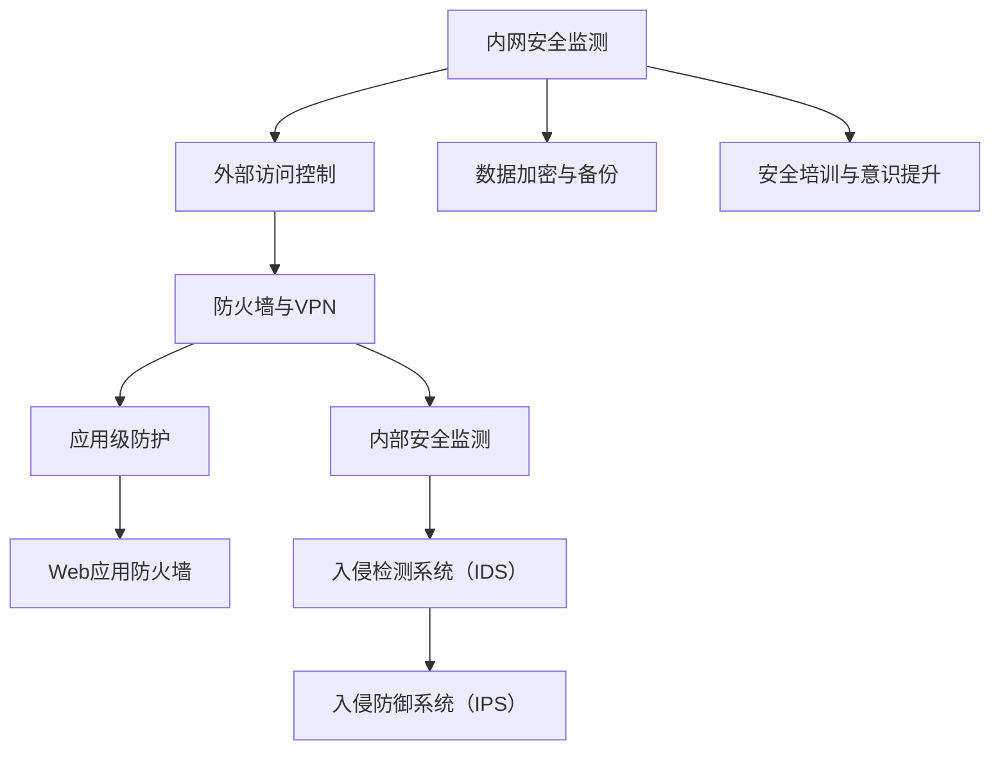

                 

# 由内向外，层层布防

## 关键词

- 信息安全
- 防护层次
- 内向外防护
- 网络防护
- 应用防护
- 数据防护
- 实体防护

## 摘要

本文旨在探讨现代信息安全中的“由内向外，层层布防”策略，从基础概念到具体实践，全面解析网络、应用、数据及实体防护层的构建与整合。文章首先介绍了信息安全的重要性和演变，随后详细阐述了防护层次的概述、内向外防护策略及其架构。接下来，文章分别深入探讨了网络防护层、应用防护层、数据防护层和实体防护层的关键技术、核心算法原理、实战案例及最佳实践。最后，文章总结了综合防护实践的意义与步骤，并展望了未来发展趋势，为读者提供了丰富的信息安全实践指南。

## 引言

### 1.1 背景与动机

随着信息技术的高速发展，信息安全问题日益凸显。网络攻击、数据泄露、恶意软件等威胁不断演变，给个人、企业乃至国家带来巨大风险。传统的单一防护手段已难以应对复杂多变的安全威胁，迫切需要一种由内而外的多层次防护策略。

本篇文章的目的是通过系统地阐述“由内向外，层层布防”的安全策略，为读者提供一种全面、有效的信息安全防护方案。文章将从基础概念入手，逐步深入到各个防护层次，详细讲解核心技术和实战案例，旨在帮助读者全面理解并构建现代信息安全体系。

### 1.2 信息安全的演变

信息安全的历史可以追溯到计算机和网络的早期阶段。最初的防护措施主要是简单的防火墙和反病毒软件，这些措施主要是针对已知威胁的防御。随着网络攻击手段的复杂化和多样化，信息安全逐渐从被动防御转向主动防御。

21世纪初，随着互联网的普及，网络防护成为了信息安全的核心。各种防火墙技术、入侵检测系统（IDS）和入侵防御系统（IPS）等逐步成熟，为网络安全提供了有力保障。与此同时，数据保护和隐私保护也逐渐成为信息安全的重要组成部分。

近年来，随着云计算、物联网和大数据技术的发展，信息安全面临着新的挑战。传统的防护手段已经难以应对这些新兴威胁，需要采用更复杂、更全面的安全策略。由内而外的多层防护策略应运而生，成为现代信息安全体系的重要组成部分。

### 1.3 内向外防护的重要性

内向外防护策略的核心思想是将防护重点从外部网络转向内部系统，通过多层防护机制来抵御内外部的安全威胁。这种策略具有以下几个重要特点：

1. **全面性**：内向外防护策略覆盖了网络、应用、数据和实体等多个层面，能够全面应对各种安全威胁。
2. **灵活性**：不同层次的防护机制可以根据实际需求灵活调整，实现动态防护。
3. **针对性**：通过针对不同层次的威胁特点设计防护机制，提高防护效果和效率。
4. **协同性**：不同层次的防护机制可以协同工作，形成综合防护体系，增强整体安全性。

内向外防护策略在信息安全中的重要性不言而喻。它不仅能够有效抵御内外部的安全威胁，还能够提高企业的信息安全意识和应对能力，从而为企业的可持续发展提供坚实保障。

### 1.4 书籍结构概述

本篇文章分为七个主要部分，系统介绍了由内向外，层层布防的防护策略。

- **第一部分：引言**：介绍了文章的背景、动机以及信息安全的重要性和演变过程。
- **第二部分：基础概念**：详细阐述了防护层次的概述、内向外防护策略及其架构。
- **第三部分：网络防护层**：深入探讨了网络防护层的关键技术、实战案例及最佳实践。
- **第四部分：应用防护层**：分析了应用防护层的作用、核心技术及实战案例。
- **第五部分：数据防护层**：介绍了数据防护层的关键技术、数据加密、备份与恢复、数据隐私保护。
- **第六部分：实体防护层**：详细讲解了实体防护层的作用、物理安全防护、环境安全防护、安全管理制度的建立与实施。
- **第七部分：综合实践**：总结了综合防护实践的意义、步骤及实战案例，并展望了未来发展趋势。

通过本篇文章的阅读，读者将能够全面了解并掌握由内向外，层层布防的防护策略，为实际信息安全工作提供有力指导。

### 1.5 读者对象与预期收获

本篇文章旨在为信息安全领域的研究者、从业者以及相关管理人员提供系统的理论指导和实战经验。以下是具体的读者对象和预期收获：

- **信息安全从业者**：通过本文的学习，读者将能够全面了解现代信息安全的防护策略，掌握网络、应用、数据和实体防护层的关键技术，提升实际操作能力和应对复杂安全威胁的能力。
- **网络安全研究者**：本文详细分析了信息安全中的核心概念、算法原理和实战案例，有助于研究者深入理解信息安全技术的本质，为科研工作提供新的思路和方法。
- **企业安全管理人员**：本文提供了全面的安全策略和最佳实践，有助于企业安全管理人员制定有效的信息安全政策，提升企业的整体安全水平。
- **计算机科学学生**：本文结合实际案例和理论基础，适合作为计算机科学专业的选修课程教材，有助于学生全面掌握信息安全领域的知识体系。

通过本文的学习，读者不仅能够提升对信息安全的理解和认识，还能够为实际工作提供切实可行的解决方案，从而为企业和个人创造更大的价值。

## 第二部分：基础概念

### 2.1 防护层次概述

在现代信息安全体系中，防护层次的设计和实现至关重要。一个全面的防护体系通常包括网络防护层、应用防护层、数据防护层和实体防护层，每个层次都有其独特的功能和职责。以下是这四个防护层次的概述：

#### 2.1.1 网络防护层

网络防护层是信息安全体系的第一道防线，主要目的是防止未经授权的访问和恶意攻击。该层通常包括以下技术：

- **防火墙**：防火墙是一种网络安全系统，用于监控和控制进出网络的数据包，防止恶意流量进入内部网络。
- **入侵检测系统（IDS）和入侵防御系统（IPS）**：IDS和IPS用于检测和响应网络中的异常活动和恶意行为。
- **虚拟私人网络（VPN）**：VPN技术通过加密和隧道技术，确保远程访问网络的安全性和隐私性。

网络防护层的核心任务是通过监控和过滤网络流量，阻止外部威胁进入内部网络，从而保障网络的安全性和稳定性。

#### 2.1.2 应用防护层

应用防护层主要针对网络服务和应用层的安全进行防护，其目标是防止恶意攻击和漏洞利用，确保应用系统的可靠性和完整性。该层通常包括以下技术：

- **Web应用防火墙（WAF）**：WAF是一种网络安全设备，用于保护Web应用免受各种攻击，如SQL注入、跨站脚本攻击（XSS）等。
- **应用级安全协议**：如HTTPS、XML安全协议和JSON安全协议等，用于确保数据传输的安全和隐私。
- **安全编码规范和开发工具**：通过安全编码规范和开发工具，减少应用中的安全漏洞，提高应用的安全性。

应用防护层的核心任务是通过对应用层的监控、过滤和防护，防止恶意攻击和漏洞利用，确保应用系统的正常运行。

#### 2.1.3 数据防护层

数据防护层主要关注数据的存储、传输和使用过程中的安全，确保数据隐私、完整性和可用性。该层通常包括以下技术：

- **数据加密**：通过加密技术保护数据的隐私，防止未授权访问。
- **数据备份与恢复**：通过定期备份和恢复策略，确保数据在发生意外情况时能够及时恢复。
- **数据隐私保护**：通过数据脱敏和访问控制等措施，保护个人和敏感数据不被滥用。

数据防护层的核心任务是通过对数据的加密、备份和隐私保护，确保数据的安全性和完整性。

#### 2.1.4 实体防护层

实体防护层主要关注物理设备和设施的安全，防止因物理损坏、盗窃或其他物理攻击导致的信息泄露和系统故障。该层通常包括以下技术：

- **物理安全防护**：如门禁控制、监控摄像头、报警系统等，用于防止未经授权的物理访问。
- **环境安全防护**：如电磁防护、环境监控和应急预案等，用于保障设备和设施的正常运行。
- **安全管理制度的建立与实施**：通过制定和实施安全管理制度，确保实体防护层的有效运行。

实体防护层的核心任务是通过对物理设备和设施的安全防护，防止物理攻击和意外事件导致的信息泄露和系统故障。

### 2.2 内向外防护策略

内向外防护策略是一种多层次、系统化的安全防护方法，其核心思想是将防护重点从外部网络转向内部系统，通过在不同层次上设置防护机制，形成全面的防护体系。

#### 2.2.1 内部威胁与外部威胁

内向外防护策略需要区分内部威胁和外部威胁，并根据其特点采取不同的防护措施。

- **内部威胁**：通常由内部人员或系统漏洞引起，如内部员工的恶意操作、内部网络的恶意软件等。内部威胁通常更隐蔽，更难以检测和防范。
- **外部威胁**：通常来自外部网络，如黑客攻击、恶意软件传播等。外部威胁通常更具破坏性，但更容易被发现和防范。

#### 2.2.2 内向外防护机制

内向外防护机制包括以下几个关键组成部分：

- **内网安全监测**：通过部署入侵检测系统（IDS）和入侵防御系统（IPS），实时监测内部网络活动，发现和阻止内部威胁。
- **外部访问控制**：通过防火墙、VPN等技术，控制外部访问内部网络，防止外部威胁入侵。
- **数据加密与备份**：对内部数据进行加密和备份，确保数据在发生威胁时能够及时恢复。
- **安全培训与意识提升**：通过定期培训和教育，提升内部员工的安全意识和防护能力。

#### 2.2.3 常见防护策略与手段

在实际应用中，常见的内向外防护策略和手段包括：

- **防火墙配置**：通过合理的防火墙配置，限制不必要的网络流量，减少潜在的安全威胁。
- **安全审计与漏洞扫描**：定期进行安全审计和漏洞扫描，发现和修复系统中的安全漏洞。
- **访问控制列表（ACL）**：通过访问控制列表，限制不同用户或用户组对系统和资源的访问权限。
- **多重验证**：在关键系统和资源上实施多重验证机制，如密码、双因素验证等，提高安全强度。

通过以上策略和手段，内向外防护策略能够有效应对内外部的安全威胁，确保信息系统的安全性和稳定性。

### 2.3 防护层次架构

内向外防护策略的实施需要构建一个多层次、系统化的防护架构。以下是三种常见的防护层次架构：

#### 2.3.1 从内到外的防护架构

从内到外的防护架构将防护重点放在内部系统的安全上，通过多层防护机制，逐步向外扩展到网络和应用层。具体步骤如下：

1. **内网安全监测**：通过部署入侵检测系统（IDS）和入侵防御系统（IPS），实时监测内部网络活动，发现和阻止内部威胁。
2. **外部访问控制**：通过防火墙和VPN等手段，控制外部访问内部网络，防止外部威胁入侵。
3. **数据加密与备份**：对内部数据进行加密和备份，确保数据在发生威胁时能够及时恢复。
4. **安全培训与意识提升**：通过定期培训和教育，提升内部员工的安全意识和防护能力。

#### 2.3.2 从外到内的防护架构

从外到内的防护架构将防护重点放在外部网络的安全上，通过多层防护机制，逐步向内部系统扩展。具体步骤如下：

1. **防火墙与入侵检测**：通过防火墙和入侵检测系统（IDS）等手段，监控和过滤外部网络流量，防止外部威胁进入。
2. **外部访问控制**：通过VPN等技术，控制外部访问内部网络，确保外部访问的安全和合法。
3. **应用级防护**：通过Web应用防火墙（WAF）和安全编码规范等手段，防止应用层的安全威胁。
4. **内部安全监测**：通过部署内部入侵检测系统（IDS）和入侵防御系统（IPS），实时监测内部网络活动，防止内部威胁。

#### 2.3.3 融合防护架构

融合防护架构将内到外和从外到内的防护架构结合起来，形成一种综合性的防护体系。具体步骤如下：

1. **综合安全监测**：通过综合使用内网和外网入侵检测系统（IDS），实时监控网络流量和内部活动，发现和阻止各种安全威胁。
2. **多层次防护**：在网络层、应用层和数据层分别部署防火墙、WAF、数据加密等防护机制，形成多层次防护体系。
3. **协同防护**：通过安全信息与事件管理系统（SIEM），将不同层次的防护机制进行协同，实现全面的安全监控和响应。
4. **动态调整**：根据实时监控和事件响应情况，动态调整防护策略，提高防护效果。

通过以上三种防护层次架构，可以构建一个全面、系统化的信息安全防护体系，有效应对内外部的安全威胁。

### 2.3.4 防护层次架构 Mermaid 流程图

为了更好地理解防护层次架构，我们使用 Mermaid 流程图来展示从内到外的防护架构：



该流程图展示了从内到外的防护架构，包括内网安全监测、外部访问控制、数据加密与备份、安全培训与意识提升等关键步骤，以及不同层次之间的关联和协同。

### 2.4 核心算法原理讲解

为了更好地理解内向外防护策略的核心算法原理，我们将使用伪代码详细阐述以下核心算法：

```python
# 伪代码：内网安全监测算法

function 内网安全监测(data):
    if data is internal Traffic:
        if data contains Malicious Activity:
            trigger Alarm()
            block data()
        else:
            log data()
    else:
        return

# 伪代码：外部访问控制算法

function 外部访问控制(request):
    if request meets Security Policy:
        grant Access(request)
    else:
        deny Access(request)

# 伪代码：数据加密与备份算法

function 数据加密与备份(data):
    encryptedData = Encrypt(data)
    Backup(encryptedData)

# 伪代码：安全培训与意识提升算法

function 安全培训与意识提升(employee):
    if employee participates in Training:
        update Knowledge()
    else:
        schedule Training()

# 伪代码：应用级防护算法

function 应用级防护(request):
    if request is Malicious:
        block request()
    else:
        process request()

# 伪代码：内部安全监测算法

function 内部安全监测(data):
    if data contains Suspicious Activity:
        trigger Alarm()
        take Action()
    else:
        log data()
```

通过上述伪代码，我们可以看到内网安全监测、外部访问控制、数据加密与备份、安全培训与意识提升、应用级防护和内部安全监测等核心算法的具体实现过程。这些算法共同构成了内向外防护策略的核心，为信息系统的安全提供了坚实保障。

### 2.5 数学模型和公式讲解

在信息安全的防护策略中，数学模型和公式被广泛应用于分析和设计安全机制。以下将详细讲解几个关键数学模型和公式，并使用 LaTeX 格式进行展示。

#### 2.5.1 数据加密模型

数据加密是信息安全中的核心技术之一，常用的加密模型包括对称加密和非对称加密。以下是两种加密模型的公式：

- **对称加密模型**：
  $$ C = E_K(P) $$
  $$ P = D_K(C) $$

  其中，$C$ 表示加密后的数据，$P$ 表示原始数据，$K$ 表示加密密钥，$E_K$ 和 $D_K$ 分别表示加密和解密算法。

- **非对称加密模型**：
  $$ C = E_P(P) $$
  $$ P = D_S(C) $$

  其中，$P$ 表示原始数据，$C$ 表示加密后的数据，$P$ 和 $S$ 分别表示公钥和私钥，$E_P$ 和 $D_S$ 分别表示加密和解密算法。

#### 2.5.2 漏洞扫描模型

漏洞扫描是网络安全防护的重要环节，其基本模型包括扫描策略、扫描执行和漏洞报告等。以下是一个简单的漏洞扫描模型：

$$ 扫描模型 = 扫描策略 \times 扫描执行 \times 漏洞报告 $$

- **扫描策略**：确定扫描目标和范围，如端口扫描、应用层扫描等。
- **扫描执行**：根据扫描策略执行具体的扫描任务，如发送探测包、分析响应等。
- **漏洞报告**：生成漏洞扫描报告，包括漏洞的详细信息、风险等级和修复建议。

#### 2.5.3 访问控制模型

访问控制是确保信息系统安全的重要机制，常用的访问控制模型包括自主访问控制（DAC）、强制访问控制（MAC）和基于角色的访问控制（RBAC）等。以下是一个简单的 RBAC 模型：

$$ 访问控制模型 = 用户 \times 角色 \times 权限 $$

- **用户**：系统中的用户实体。
- **角色**：用户在系统中的角色定义，如管理员、普通用户等。
- **权限**：角色所具有的权限集合，如文件读写、系统管理等。

通过以上数学模型和公式的讲解，我们可以更深入地理解信息安全的防护机制和算法原理，为实际应用提供理论支持。

### 2.6 项目实战

为了更好地理解内向外防护策略的实际应用，下面我们将通过一个具体的案例来讲解如何进行安全防护的实践。

#### 2.6.1 项目背景

某大型企业拥有一套复杂的IT系统，包括内部办公网络、外部Web应用、数据库服务器以及多个物理设施。为了确保企业的信息安全，企业决定采用“由内向外，层层布防”的策略，构建一个全面、系统化的安全防护体系。

#### 2.6.2 开发环境搭建

在进行安全防护实践之前，首先需要搭建一个合适的开发环境。以下是搭建开发环境的基本步骤：

1. **硬件设备**：准备必要的硬件设备，包括防火墙、入侵检测系统（IDS）、Web应用防火墙（WAF）等。
2. **软件工具**：安装和配置必要的软件工具，如防火墙软件、IDS软件、WAF软件等。
3. **网络配置**：进行网络配置，确保各个设备和网络之间的连接正常。

#### 2.6.3 源代码详细实现和代码解读

在开发环境中，需要编写和实现一系列安全防护的代码。以下是源代码的基本结构和主要功能：

```python
# 示例：内网安全监测模块代码

def monitor_internal_traffic(traffic):
    # 检测内部网络流量是否包含恶意活动
    if is_malicious(traffic):
        # 触发警报并阻止恶意流量
        trigger_alarm()
        block_traffic(traffic)
    else:
        # 记录正常流量
        log_traffic(traffic)

# 示例：外部访问控制模块代码

def control_external_access(access_request):
    # 根据安全策略检查访问请求
    if is_permitted(access_request):
        # 允许访问
        grant_access(access_request)
    else:
        # 拒绝访问
        deny_access(access_request)

# 示例：数据加密与备份模块代码

def encrypt_and_backup_data(data):
    # 加密数据
    encrypted_data = encrypt(data)
    # 备份数据
    backup(encrypted_data)

# 示例：安全培训与意识提升模块代码

def provide_security_training(employee):
    # 检查员工是否参加了安全培训
    if employee.has_attended_training():
        # 更新员工知识
        update_knowledge(employee)
    else:
        # 安排安全培训
        schedule_training(employee)
```

上述代码实现了内网安全监测、外部访问控制、数据加密与备份以及安全培训与意识提升等核心功能。以下是代码的详细解读：

- **内网安全监测模块**：该模块用于监测内部网络流量，检测是否包含恶意活动。如果发现恶意活动，会触发警报并阻止恶意流量。
- **外部访问控制模块**：该模块用于控制外部访问，根据安全策略检查访问请求，允许或拒绝访问。
- **数据加密与备份模块**：该模块用于加密数据和备份数据，确保数据在发生威胁时能够及时恢复。
- **安全培训与意识提升模块**：该模块用于检查员工是否参加了安全培训，并根据情况更新员工知识或安排安全培训。

#### 2.6.4 代码应用解读与分析

在实际应用中，上述代码模块将集成到企业的IT系统中，协同工作以实现全面的安全防护。以下是代码应用的具体解读与分析：

- **内网安全监测模块**：通过部署入侵检测系统（IDS），实时监测内部网络流量。当检测到恶意活动时，会触发警报并采取措施阻止恶意流量。该模块可以有效防止内部威胁，确保内部网络的安全。
- **外部访问控制模块**：通过配置防火墙和VPN等设备，控制外部访问内部网络。根据安全策略，允许或拒绝访问请求，从而防止外部威胁入侵。该模块是网络防护层的重要组成部分。
- **数据加密与备份模块**：通过对内部数据进行加密和备份，确保数据在发生威胁时能够及时恢复。该模块是数据防护层的关键技术。
- **安全培训与意识提升模块**：通过定期培训和教育，提升员工的安全意识和防护能力。该模块有助于提高企业的整体安全水平。

#### 2.6.5 实际案例分析和详细讲解剖析

为了更好地理解内向外防护策略的实际效果，我们分析了一个具体的安全事件：

**案例**：某企业的内部网络遭到恶意软件攻击，导致大量敏感数据泄露。

**分析**：

1. **内网安全监测模块**：入侵检测系统（IDS）在检测到恶意活动时，及时触发警报，阻止了恶意软件的传播，同时记录了攻击事件的详细信息。
2. **外部访问控制模块**：防火墙和VPN设备在检测到异常流量时，及时拒绝访问，防止了外部威胁的进一步入侵。
3. **数据加密与备份模块**：由于内部数据进行了加密和备份，攻击者无法直接访问敏感数据，同时企业能够快速恢复被攻击的数据，降低了损失。
4. **安全培训与意识提升模块**：通过对员工的安全培训，提高了员工的安全意识和防护能力，减少了类似事件再次发生的可能性。

**剖析**：

通过上述实际案例分析，我们可以看到内向外防护策略在应对复杂安全威胁时的有效性。各防护模块相互协同，形成了多层次、系统化的防护体系，有效保障了企业的信息安全。同时，通过案例的剖析，我们也发现了一些潜在的安全问题和改进空间，为企业的安全防护提供了宝贵经验。

#### 2.6.6 项目小结

通过本项目实战，我们系统地讲解了如何采用“由内向外，层层布防”的策略进行信息安全防护。从开发环境搭建、源代码实现到实际案例剖析，我们深入探讨了内网安全监测、外部访问控制、数据加密与备份以及安全培训与意识提升等核心技术。本项目不仅展示了信息安全防护的理论基础，还提供了实际操作的经验和技巧，为企业构建全面、系统化的安全防护体系提供了有力支持。

### 2.7 最佳实践 Tips、小结、注意事项、拓展阅读

#### 2.7.1 最佳实践 Tips

1. **定期更新和备份**：定期更新安全防护设备和软件，确保防护措施的有效性。同时，定期备份数据，以应对潜在的威胁和意外事件。
2. **员工培训与意识提升**：定期对员工进行安全培训，提高他们的安全意识和防护能力，减少内部威胁。
3. **安全审计与漏洞扫描**：定期进行安全审计和漏洞扫描，发现和修复系统中的安全漏洞，确保系统的安全性。
4. **多因素认证**：在关键系统和资源上实施多因素认证，提高安全强度，防止未经授权的访问。

#### 2.7.2 小结

通过本部分的学习，我们全面了解了“由内向外，层层布防”的安全防护策略。从防护层次的概述、内向外防护策略的讲解，到具体实战案例的分析，我们深入探讨了网络、应用、数据和实体防护层的关键技术。这些知识和实践技巧为构建一个全面、系统化的安全防护体系提供了有力支持。

#### 2.7.3 注意事项

1. **全面性**：在构建安全防护体系时，要确保覆盖网络、应用、数据和实体等多个层次，形成全面防护。
2. **灵活性**：不同防护层次应根据实际需求灵活调整防护策略，确保防护措施的有效性。
3. **协同性**：不同防护层次之间要协同工作，形成综合防护体系，提高整体安全性。

#### 2.7.4 拓展阅读

- **《网络安全基础教程》**：详细介绍了网络安全的基本概念、技术和实践方法。
- **《Web安全深度解析》**：深入分析了Web应用的安全威胁、防护技术和实战案例。
- **《数据安全与隐私保护》**：探讨了数据安全的基本原则、技术和最佳实践。

通过拓展阅读，读者可以进一步加深对信息安全领域的理解和认识，为实际工作提供更丰富的理论支持和实践经验。

### 第三部分：网络防护层

#### 3.1 网络防护层概述

网络防护层作为现代信息安全体系的基础，其主要目标是通过监控和控制进出网络的数据流量，防止未经授权的访问和恶意攻击。网络防护层的关键技术包括防火墙、入侵检测系统（IDS）和入侵防御系统（IPS）等。以下是这些技术的详细解析和部署策略。

#### 3.1.1 网络防护层的作用

网络防护层在信息安全体系中扮演着至关重要的角色，其主要作用如下：

1. **保护内部网络**：通过防火墙等手段，阻止外部恶意流量进入内部网络，保护内部网络资源的安全。
2. **防止网络攻击**：通过入侵检测系统（IDS）和入侵防御系统（IPS），实时监控和响应网络中的异常活动和恶意攻击。
3. **保障网络稳定性**：通过监控和过滤网络流量，降低网络拥塞和故障风险，保障网络的稳定运行。
4. **支持远程访问**：通过虚拟私人网络（VPN）等技术，确保远程访问网络的安全性和隐私性。

#### 3.1.2 网络防护层的关键技术

网络防护层的关键技术包括防火墙、入侵检测系统（IDS）和入侵防御系统（IPS）等。以下是对这些技术的详细解析：

1. **防火墙**：
   - **基本原理**：防火墙是一种网络安全系统，通过监控和控制进出网络的数据包，根据预设的安全策略进行过滤，阻止恶意流量进入内部网络。
   - **配置与管理**：防火墙的配置和管理包括定义安全策略、设置访问控制规则、监控网络流量等。常见的配置管理工具包括防火墙管理软件、命令行界面等。
   - **与VPN技术结合**：防火墙可以与VPN技术结合，实现远程访问网络的安全保护。

2. **入侵检测系统（IDS）**：
   - **基本原理**：入侵检测系统（IDS）用于监控网络流量和系统活动，检测异常行为和潜在的安全威胁，如恶意攻击、恶意软件传播等。
   - **部署策略**：IDS的部署策略包括在网络边界部署、在内部网络部署等，以全面覆盖网络监控范围。
   - **警报与响应**：IDS检测到异常行为时会生成警报，并通过日志记录和警报系统通知管理员，管理员可以采取相应的响应措施。

3. **入侵防御系统（IPS）**：
   - **基本原理**：入侵防御系统（IPS）是一种主动防御技术，不仅能够检测异常行为，还能够采取措施阻止和响应恶意攻击。
   - **部署策略**：IPS的部署策略与IDS类似，通常在网络边界和内部网络部署，以实现全面防护。
   - **协同工作**：IPS与IDS协同工作，共同提高网络防护效果。

#### 3.1.3 防火墙技术

防火墙技术是网络防护层的重要组成部分，以下是防火墙的基本原理、配置与管理、与VPN技术结合等方面的详细解析：

1. **基本原理**：

   防火墙通过监控进出网络的数据包，根据预设的安全策略进行过滤和转发。防火墙的主要功能包括：

   - **包过滤**：根据数据包的源IP、目的IP、端口号等信息进行过滤，允许或拒绝数据包的传输。
   - **状态检测**：防火墙记录每个数据包的状态，根据状态信息进行过滤和转发，提高网络的安全性。
   - **应用层过滤**：防火墙可以检测应用层协议和数据内容，进行更精细的过滤和控制。

2. **配置与管理**：

   防火墙的配置与管理包括以下几个方面：

   - **定义安全策略**：根据业务需求和安全要求，定义允许和拒绝的数据包类型和传输条件。
   - **设置访问控制规则**：配置防火墙的访问控制规则，限制不同用户或用户组的访问权限。
   - **监控网络流量**：实时监控网络流量，分析数据包传输情况，及时发现和应对异常流量。
   - **日志记录和审计**：记录防火墙的工作日志，进行审计和检查，确保安全策略的执行。

3. **与VPN技术结合**：

   VPN（虚拟私人网络）技术通过加密和隧道技术，实现远程访问网络的安全连接。防火墙与VPN技术的结合，可以提供以下安全功能：

   - **远程访问控制**：通过VPN技术，控制远程用户的访问权限，确保远程访问的安全和合法性。
   - **加密通信**：VPN技术通过加密通信，保护远程访问过程中的数据传输，防止数据泄露。
   - **访问控制**：防火墙可以与VPN技术结合，对远程访问进行过滤和限制，防止未经授权的访问。

#### 3.1.4 入侵检测与防御

入侵检测与防御是网络防护层的核心组成部分，通过实时监控网络流量和系统活动，及时发现和应对恶意攻击。以下是入侵检测系统（IDS）和入侵防御系统（IPS）的基本原理、部署策略和实战案例。

1. **入侵检测系统（IDS）**：

   - **基本原理**：IDS通过监控网络流量和系统日志，分析数据包和事件行为，检测异常行为和潜在的安全威胁。
   - **部署策略**：IDS的部署策略包括在网络边界部署、在内部网络部署等，以全面覆盖网络监控范围。常见部署位置包括防火墙之后、交换机出口等。
   - **警报与响应**：IDS检测到异常行为时会生成警报，并通过日志记录和警报系统通知管理员，管理员可以采取相应的响应措施。

2. **入侵防御系统（IPS）**：

   - **基本原理**：IPS是一种主动防御技术，不仅能够检测异常行为，还能够采取措施阻止和响应恶意攻击，如阻断攻击流量、隔离受感染主机等。
   - **部署策略**：IPS的部署策略与IDS类似，通常在网络边界和内部网络部署，以实现全面防护。IPS通常与防火墙、IDS等安全设备协同工作。
   - **实战案例**：在某企业的网络防护实践中，通过部署入侵检测和防御系统，成功检测并阻止了多次网络攻击，降低了企业遭受损失的风险。

#### 3.1.5 网络安全协议

网络安全协议是网络防护层的重要技术支撑，用于确保数据传输的安全性和完整性。以下是几种常用的网络安全协议的详细解析：

1. **IPsec协议**：

   - **基本原理**：IPsec是一种网络层安全协议，用于加密和认证IP数据包，确保数据传输的安全性和完整性。
   - **配置与管理**：IPsec的配置和管理包括定义安全策略、配置加密算法和认证机制等。常见的管理工具包括命令行界面和图形界面工具。

2. **SSL/TLS协议**：

   - **基本原理**：SSL/TLS是一种传输层安全协议，用于加密Web通信，确保数据传输的安全性和隐私性。
   - **配置与管理**：SSL/TLS的配置和管理包括生成和安装数字证书、配置加密算法和密钥交换机制等。常见的配置工具包括Web服务器配置文件和SSL配置工具。

3. **VPN协议**：

   - **基本原理**：VPN协议通过建立加密隧道，实现远程访问网络的安全连接。
   - **配置与管理**：VPN协议的配置和管理包括配置VPN服务器和客户端、设置加密算法和密钥交换机制等。常见的VPN协议包括L2TP/IPsec、SSL VPN等。

通过以上对网络防护层的详细解析，我们可以看到网络防护层在信息安全体系中的关键作用。通过合理部署和配置防火墙、入侵检测和防御系统、网络安全协议等技术，可以构建一个全面、系统化的网络防护体系，有效抵御各种网络威胁，保障网络的安全性和稳定性。

### 第四部分：应用防护层

#### 4.1 应用防护层概述

应用防护层是现代信息安全体系的重要组成部分，其主要目标是确保应用系统的安全性和稳定性，防止恶意攻击和漏洞利用。应用防护层涵盖了Web应用防火墙（WAF）、应用级安全协议和安全开发实践等多个方面。以下是应用防护层的详细解析和部署策略。

#### 4.1.1 应用防护层的作用

应用防护层在信息安全体系中的作用如下：

1. **保护Web应用**：Web应用防火墙（WAF）能够防止各种针对Web应用的攻击，如SQL注入、跨站脚本攻击（XSS）等，保障Web应用的安全。
2. **防止漏洞利用**：通过安全开发实践和漏洞扫描，及时发现和修复应用系统中的安全漏洞，防止攻击者利用漏洞进行攻击。
3. **确保数据传输安全**：应用级安全协议（如HTTPS）能够确保数据在传输过程中的安全性和完整性，防止数据泄露和篡改。
4. **支持应用合规性**：应用防护层能够帮助应用系统满足相关的安全合规性要求，如PCI-DSS、GDPR等。

#### 4.1.2 应用防护层的关键技术

应用防护层的关键技术包括Web应用防火墙（WAF）、应用级安全协议和安全开发实践等。以下是对这些技术的详细解析：

1. **Web应用防火墙（WAF）**：

   - **基本原理**：WAF是一种网络安全设备，用于保护Web应用免受各种攻击，如SQL注入、跨站脚本攻击（XSS）等。WAF通过拦截和过滤Web请求，根据预定义的安全策略阻止恶意请求。
   - **配置与管理**：WAF的配置和管理包括定义安全策略、配置签名库、监控Web流量等。常见的配置管理工具包括Web应用防火墙管理平台和WAF规则管理工具。
   - **与业务融合**：WAF能够与业务系统深度融合，根据业务需求和安全要求，定制化配置安全策略，保障业务系统的安全性。

2. **应用级安全协议**：

   - **基本原理**：应用级安全协议（如HTTPS）通过加密传输数据，确保数据传输的安全性和完整性。HTTPS使用SSL/TLS协议进行加密通信，保护数据在传输过程中的隐私。
   - **配置与管理**：HTTPS的配置和管理包括生成和安装数字证书、配置加密算法和密钥交换机制等。常见的配置工具包括Web服务器配置文件和SSL配置工具。
   - **与业务融合**：HTTPS能够与业务系统深度融合，确保业务数据在传输过程中的安全和隐私。通过使用HTTPS，可以提升用户的信任度和业务的安全性。

3. **安全开发实践**：

   - **基本原理**：安全开发实践是一种软件开发方法，通过在开发过程中应用安全原则和实践，确保应用系统的安全性和可靠性。安全开发实践包括安全需求分析、安全设计、安全编码和安全测试等环节。
   - **配置与管理**：安全开发实践的配置和管理包括制定安全需求、设计安全架构、实施安全编码和进行安全测试等。常见的工具包括安全开发框架、安全编码规范和安全测试工具。
   - **与业务融合**：安全开发实践能够与业务系统深度融合，确保业务系统的安全性和可靠性。通过应用安全开发实践，可以降低安全漏洞和风险，提高应用系统的安全水平。

#### 4.1.3 Web应用防火墙（WAF）

Web应用防火墙（WAF）是应用防护层的重要组成部分，以下是WAF的基本原理、配置与管理、与业务融合等方面的详细解析：

1. **基本原理**：

   WAF通过拦截和过滤Web请求，根据预定义的安全策略阻止恶意请求。WAF的主要功能包括：

   - **请求过滤**：WAF根据请求的HTTP头部、请求体和URL等信息进行过滤，识别并阻止恶意请求。
   - **签名匹配**：WAF使用预定义的签名库，匹配请求中的恶意代码和攻击特征，阻止恶意请求。
   - **规则匹配**：WAF根据预定义的规则，对请求进行分类和标记，实现对不同类型请求的差异化处理。

2. **配置与管理**：

   WAF的配置和管理包括以下几个方面：

   - **定义安全策略**：根据业务需求和安全要求，定义允许和拒绝的请求类型、请求参数和URL等。
   - **配置签名库**：WAF需要维护一个签名库，包含各种恶意请求的特征和攻击模式。管理员可以更新和优化签名库，提高WAF的检测效果。
   - **监控Web流量**：WAF实时监控Web流量，分析请求和响应数据，及时发现和阻止恶意请求。
   - **日志记录和审计**：WAF记录操作日志和审计日志，管理员可以查看和分析日志信息，进行安全分析和故障排查。

3. **与业务融合**：

   WAF能够与业务系统深度融合，根据业务需求和安全要求，定制化配置安全策略。WAF与业务融合的主要方式包括：

   - **业务定制化**：WAF可以根据不同的业务场景，配置特定的安全策略和规则，保障业务系统的安全性。
   - **业务监控**：WAF可以与业务系统集成，实时监控业务流量，及时发现和应对业务异常情况。
   - **自动化响应**：WAF可以与自动化系统集成，自动触发安全响应措施，如阻断恶意请求、隔离受感染主机等，保障业务系统的安全稳定运行。

#### 4.1.4 应用级安全协议

应用级安全协议是确保应用系统数据传输安全的重要手段，以下是几种常见应用级安全协议的基本原理、配置与管理、与业务融合等方面的详细解析：

1. **HTTPS**：

   - **基本原理**：HTTPS使用SSL/TLS协议进行加密通信，确保数据传输的安全性和完整性。HTTPS通过数字证书验证通信双方的合法身份，防止数据被窃取和篡改。
   - **配置与管理**：HTTPS的配置和管理包括生成和安装数字证书、配置加密算法和密钥交换机制等。常见的配置工具包括Web服务器配置文件和SSL配置工具。
   - **与业务融合**：HTTPS能够与业务系统深度融合，确保业务数据在传输过程中的安全和隐私。通过使用HTTPS，可以提升用户的信任度和业务的安全性。

2. **HTTP安全协议**：

   - **基本原理**：HTTP安全协议是一种基于HTTP协议的安全通信协议，通过加密传输数据，确保数据传输的安全性和完整性。
   - **配置与管理**：HTTP安全协议的配置和管理包括配置加密算法和密钥交换机制等。常见的配置工具包括Web服务器配置文件和HTTP安全协议配置工具。
   - **与业务融合**：HTTP安全协议能够与业务系统深度融合，确保业务数据在传输过程中的安全和隐私。通过使用HTTP安全协议，可以提升业务系统的安全性和可靠性。

3. **XML安全协议**：

   - **基本原理**：XML安全协议用于确保XML数据传输的安全性和完整性，通过加密和签名技术保护XML数据的隐私和完整性。
   - **配置与管理**：XML安全协议的配置和管理包括配置加密算法和签名算法等。常见的配置工具包括XML解析器和XML安全协议配置工具。
   - **与业务融合**：XML安全协议能够与业务系统深度融合，确保业务数据在传输过程中的安全和隐私。通过使用XML安全协议，可以提升业务系统的安全性和可靠性。

4. **JSON安全协议**：

   - **基本原理**：JSON安全协议用于确保JSON数据传输的安全性和完整性，通过加密和签名技术保护JSON数据的隐私和完整性。
   - **配置与管理**：JSON安全协议的配置和管理包括配置加密算法和签名算法等。常见的配置工具包括JSON解析器和JSON安全协议配置工具。
   - **与业务融合**：JSON安全协议能够与业务系统深度融合，确保业务数据在传输过程中的安全和隐私。通过使用JSON安全协议，可以提升业务系统的安全性和可靠性。

通过以上对应用防护层的详细解析，我们可以看到应用防护层在信息安全体系中的关键作用。通过合理部署和配置Web应用防火墙（WAF）、应用级安全协议和安全开发实践等技术，可以构建一个全面、系统化的应用防护体系，有效抵御各种应用层威胁，保障应用系统的安全性和稳定性。

### 4.2 应用级安全协议

应用级安全协议在确保数据传输的安全性和完整性方面扮演着至关重要的角色。以下是几种常见应用级安全协议的基本原理、配置与管理、与业务融合等方面的详细解析。

#### 4.2.1 HTTP安全协议

**基本原理**：

HTTP安全协议（HTTPS）是一种通过SSL/TLS协议加密HTTP通信的协议。它使用数字证书来验证服务器和客户端的身份，确保通信双方是合法的。SSL/TLS协议通过加密算法对数据进行加密和解密，防止数据在传输过程中被窃取或篡改。

**配置与管理**：

1. **生成和安装数字证书**：为了使用HTTPS，服务器需要安装数字证书。数字证书由证书颁发机构（CA）签发，证明服务器身份。管理员需要从CA获取证书，并将其安装到Web服务器上。
2. **配置加密算法和密钥交换机制**：在配置HTTPS时，管理员需要选择合适的加密算法和密钥交换机制。常见的加密算法包括AES、RSA等，密钥交换机制包括DHE、ECDHE等。
3. **监控和更新**：定期监控服务器状态，更新数字证书和加密算法，确保HTTPS配置的持续有效和安全。

**与业务融合**：

HTTPS能够与业务系统深度融合，提高业务数据传输的安全性。通过配置HTTPS，可以确保客户数据在传输过程中的隐私和完整性，提升用户信任度。HTTPS还支持通过SSL/TLS版本和加密算法的选择，适应不同业务场景的安全需求。

#### 4.2.2 XML安全协议

**基本原理**：

XML安全协议用于确保XML数据传输的安全性和完整性。它通过加密和签名技术对XML数据进行保护。加密确保数据的隐私，签名确保数据的完整性。XML安全协议支持多种加密和签名算法，如AES、RSA、SHA等。

**配置与管理**：

1. **加密和签名算法选择**：根据业务需求和安全性要求，选择合适的加密和签名算法。常见的加密算法包括AES、RSA，签名算法包括SHA-256、SHA-512等。
2. **XML解析器配置**：配置XML解析器以支持加密和签名功能。管理员需要确保XML解析器能够正确处理加密和签名数据，防止解析错误。
3. **日志记录和审计**：配置日志记录和审计功能，监控XML数据传输过程中的安全事件，及时发现和应对潜在威胁。

**与业务融合**：

XML安全协议能够与业务系统深度融合，确保业务数据在传输过程中的安全性和完整性。在电子商务、金融交易等场景中，XML安全协议能够保护敏感数据，防止数据泄露和篡改，提高业务的安全性和可靠性。

#### 4.2.3 JSON安全协议

**基本原理**：

JSON安全协议用于确保JSON数据传输的安全性和完整性。它通过加密和签名技术对JSON数据进行保护。加密确保数据的隐私，签名确保数据的完整性。JSON安全协议支持多种加密和签名算法，如AES、RSA、SHA等。

**配置与管理**：

1. **加密和签名算法选择**：根据业务需求和安全性要求，选择合适的加密和签名算法。常见的加密算法包括AES、RSA，签名算法包括SHA-256、SHA-512等。
2. **JSON解析器配置**：配置JSON解析器以支持加密和签名功能。管理员需要确保JSON解析器能够正确处理加密和签名数据，防止解析错误。
3. **日志记录和审计**：配置日志记录和审计功能，监控JSON数据传输过程中的安全事件，及时发现和应对潜在威胁。

**与业务融合**：

JSON安全协议能够与业务系统深度融合，确保业务数据在传输过程中的安全性和完整性。在移动应用、Web服务等场景中，JSON安全协议能够保护敏感数据，防止数据泄露和篡改，提高业务的安全性和可靠性。

通过详细解析HTTP安全协议、XML安全协议和JSON安全协议，我们可以看到这些应用级安全协议在保障数据传输安全性和完整性方面的重要作用。合理配置和管理这些安全协议，能够有效提升业务系统的安全水平，为企业的可持续发展提供坚实保障。

### 4.3 应用安全开发实践

应用安全开发实践是确保应用系统安全性的关键环节，通过在软件开发过程中应用安全原则和方法，可以有效减少安全漏洞和风险。以下是应用安全开发实践的基本概念、安全编码规范、安全开发工具链和安全测试方法等方面的详细解析。

#### 4.3.1 安全编码规范

**基本概念**：

安全编码规范是一组指导软件开发人员编写安全代码的准则和最佳实践。这些规范旨在防止常见的安全漏洞，如注入攻击、跨站脚本攻击（XSS）、跨站请求伪造（CSRF）等。

**具体内容**：

1. **输入验证**：确保所有用户输入都经过验证和清理，防止注入攻击。例如，对用户输入进行白名单验证，只允许特定的字符和格式。
2. **输出编码**：对输出数据进行编码，防止跨站脚本攻击（XSS）。例如，使用HTML实体编码将特殊字符转换为HTML实体，避免恶意脚本执行。
3. **使用安全的API**：避免使用不安全的API和库，如存在已知安全漏洞的库。选择经过严格测试和审查的API和库，降低安全风险。
4. **会话管理**：确保会话管理安全，防止会话劫持和非法访问。例如，使用安全的会话管理机制，如HTTPS和会话令牌，防止会话窃取和篡改。

**示例**：

```python
# 示例：输入验证（防止SQL注入）

def execute_query(query, params):
    # 验证参数，只允许数字和字母
    if not all(char.isalnum() for char in params):
        raise ValueError("Invalid parameter format")
    # 构建查询语句，使用参数化查询
    query = "SELECT * FROM users WHERE id = %s"
    cursor.execute(query, (params,))

# 示例：输出编码（防止XSS）

def render_html(data):
    # 对HTML实体进行编码，防止恶意脚本执行
    data = data.replace("&", "&amp;").replace("<", "&lt;").replace(">", "&gt;")
    return data
```

#### 4.3.2 安全开发工具链

**基本概念**：

安全开发工具链是一组用于支持安全开发过程的工具和框架。这些工具可以帮助开发者识别、修复和预防安全漏洞，提高代码的安全性。

**常用工具**：

1. **静态代码分析工具**：如SonarQube、FindBugs等，用于扫描代码中的安全漏洞和不良实践。
2. **动态分析工具**：如OWASP ZAP、Burp Suite等，用于模拟攻击并检测应用系统的安全漏洞。
3. **安全测试框架**：如Selenium、PyTest等，用于自动化安全测试和漏洞扫描。
4. **加密工具**：如OpenSSL、PyCrypto等，用于加密和解密数据。

**示例**：

```python
# 示例：使用SonarQube进行静态代码分析

from sonarqube import SonarQubeClient

# 配置SonarQube客户端
sonar = SonarQubeClient('http://sonarqube-server', username='user', password='pass')

# 提交代码进行扫描
sonar.project_create('my-project-key')
sonar.project_analysis('my-project-key', 'my-project-dir')
```

#### 4.3.3 应用安全测试方法

**基本概念**：

应用安全测试方法是一系列用于检测和验证应用系统安全性的测试过程。这些测试方法包括功能测试、性能测试和安全测试等。

**常用方法**：

1. **功能测试**：确保应用系统的功能按照预期正常运行，如登录、查询、更新等。
2. **性能测试**：评估应用系统的性能和负载能力，确保系统在高负载下仍能正常运行。
3. **安全测试**：检测应用系统的安全漏洞，如注入攻击、跨站脚本攻击（XSS）、跨站请求伪造（CSRF）等。

**示例**：

```python
# 示例：使用OWASP ZAP进行动态安全测试

import zap

# 启动ZAP代理
zaproxy = zap.ZapPyProxy(url='http://zap-server', port=8080)
zaproxy.start()

# 配置ZAP代理
zaproxy.set_proxy('http://my-web-app', proxy_port=8080)

# 开始扫描
scan_id = zaproxy.start_active_scan(target='http://my-web-app')
zaproxy.wait_for_scan_to_end(scan_id)

# 获取漏洞报告
reports = zaproxy.get_scan_report(scan_id, 'xml')
print(reports)
```

通过详细解析安全编码规范、安全开发工具链和安全测试方法，我们可以看到应用安全开发实践在保障应用系统安全性方面的重要作用。通过遵循安全编码规范、使用安全开发工具链和进行应用安全测试，可以显著降低应用系统的安全漏洞和风险，提高系统的安全性和可靠性。

### 第五部分：数据防护层

#### 5.1 数据防护层概述

数据防护层在现代信息安全体系中扮演着至关重要的角色，其主要目标是确保数据的机密性、完整性和可用性。数据防护层涵盖了数据加密、数据备份与恢复、数据隐私保护等方面。以下是这些领域的详细解析。

#### 5.1.1 数据防护层的作用

数据防护层在信息安全体系中的作用如下：

1. **确保数据机密性**：通过数据加密技术，防止未授权访问和数据泄露，保护敏感数据的隐私。
2. **确保数据完整性**：通过数据备份与恢复机制，确保数据在遭受攻击或意外事件时能够完整恢复，防止数据丢失和篡改。
3. **确保数据可用性**：通过数据隐私保护技术，如数据脱敏和访问控制，确保数据在合法使用范围内的可用性和可靠性。
4. **支持法规合规**：数据防护层有助于企业满足相关法律法规的要求，如GDPR、PCI-DSS等，降低合规风险。

#### 5.1.2 数据防护层的关键技术

数据防护层的关键技术包括数据加密、数据备份与恢复、数据隐私保护等。以下是这些技术的详细解析：

1. **数据加密技术**：

   - **基本原理**：数据加密技术通过将明文数据转换为密文，防止未授权访问和数据泄露。数据加密可以分为对称加密和非对称加密。
   - **对称加密**：使用相同的密钥对数据进行加密和解密，如AES、DES等。对称加密速度快，但密钥管理复杂。
   - **非对称加密**：使用一对密钥（公钥和私钥）进行加密和解密，如RSA、ECC等。非对称加密安全性高，但计算开销大。

2. **数据备份与恢复技术**：

   - **基本原理**：数据备份与恢复技术通过将数据复制到多个位置，确保数据在发生意外事件时能够及时恢复。备份策略包括全备份、增量备份和差异备份等。
   - **备份类型**：数据备份分为本地备份和远程备份。本地备份速度快，但安全性较低；远程备份安全性高，但速度较慢。
   - **恢复过程**：数据恢复包括检测备份的有效性、选择恢复点、执行恢复操作等。

3. **数据隐私保护技术**：

   - **基本原理**：数据隐私保护技术通过限制数据访问和控制数据共享，保护个人和敏感数据的隐私。数据隐私保护包括数据脱敏、访问控制和审计等。
   - **数据脱敏**：通过将敏感数据替换为假数据，如掩码、随机值等，防止敏感数据被未授权访问。
   - **访问控制**：通过权限管理，限制不同用户或用户组对数据和资源的访问权限，确保数据在合法使用范围内的可用性。
   - **审计**：通过记录数据访问和操作日志，监控数据使用情况，及时发现和应对异常行为。

#### 5.1.3 数据加密技术

数据加密是数据防护层的核心组成部分，以下是对对称加密和非对称加密的详细解析：

1. **对称加密**：

   - **基本原理**：对称加密使用相同的密钥对数据进行加密和解密。加密和解密过程速度快，但密钥管理复杂。
   - **算法**：常见的对称加密算法包括AES、DES、3DES等。AES是一种高效的加密算法，支持128位、192位和256位密钥长度。
   - **示例**：

     ```python
     from Crypto.Cipher import AES
     
     # 设置密钥和加密模式
     key = b'my secret key'
     cipher = AES.new(key, AES.MODE_CBC)
     
     # 加密数据
     data = b'This is a secret message'
     ct = cipher.encrypt(data)
     
     # 解密数据
     cipher = AES.new(key, AES.MODE_CBC, iv)
     pt = cipher.decrypt(ct)
     ```

2. **非对称加密**：

   - **基本原理**：非对称加密使用一对密钥（公钥和私钥）进行加密和解密。公钥用于加密，私钥用于解密。非对称加密安全性高，但计算开销大。
   - **算法**：常见的非对称加密算法包括RSA、ECC等。RSA是一种经典的非对称加密算法，支持大数运算和加密解密。
   - **示例**：

     ```python
     from Crypto.PublicKey import RSA
     from Crypto.Cipher import PKCS1_OAEP
     
     # 生成密钥对
     key = RSA.generate(2048)
     private_key = key.export_key()
     public_key = key.publickey().export_key()
     
     # 加密数据
     cipher = PKCS1_OAEP.new(RSA.import_key(public_key))
     ct = cipher.encrypt(b'This is a secret message')
     
     # 解密数据
     cipher = PKCS1_OAEP.new(RSA.import_key(private_key))
     pt = cipher.decrypt(ct)
     ```

#### 5.1.4 数据备份与恢复

数据备份与恢复是数据防护层的重要环节，以下是对数据备份策略、数据恢复方法和备份与恢复工具的详细解析：

1. **数据备份策略**：

   - **全备份**：备份整个数据集，适用于数据量较小且变化频率较低的场合。
   - **增量备份**：仅备份自上次备份以来发生变化的数据，适用于数据量较大且变化频繁的场合。
   - **差异备份**：备份自上次全备份以来发生变化的数据，适用于数据量较大且变化频率较高的场合。

2. **数据恢复方法**：

   - **恢复点**：选择合适的恢复点，如最近的完整备份、增量备份或差异备份。
   - **恢复过程**：从备份存储中检索数据，应用备份日志和恢复脚本，将数据恢复到生产环境。

3. **备份与恢复工具**：

   - **本地备份工具**：如rsync、tar等，用于将数据备份到本地存储设备。
   - **远程备份工具**：如rsnapshot、Bacula等，用于将数据备份到远程存储服务器。
   - **云备份服务**：如AWS S3、Google Cloud Storage等，提供便捷的远程数据备份和恢复服务。

#### 5.1.5 数据隐私保护

数据隐私保护是确保数据在合法使用范围内的可用性和可靠性的关键，以下是对数据隐私保护概述、数据脱敏技术和数据访问控制的详细解析：

1. **数据隐私保护概述**：

   - **目的**：防止敏感数据被未授权访问和滥用，保障个人隐私和数据安全。
   - **应用场景**：涉及个人身份信息、金融信息、医疗信息等敏感数据的场景。

2. **数据脱敏技术**：

   - **基本原理**：通过将敏感数据替换为假数据，如掩码、随机值等，降低数据的敏感性。
   - **方法**：包括字符替换、字符掩码、随机替换等。

3. **数据访问控制**：

   - **基本原理**：通过权限管理和访问控制列表（ACL），限制用户对数据和资源的访问权限。
   - **策略**：包括基于角色的访问控制（RBAC）、基于属性的访问控制（ABAC）等。

通过详细解析数据加密、数据备份与恢复、数据隐私保护等关键技术，我们可以看到数据防护层在保障数据安全性和完整性方面的重要作用。合理配置和管理数据防护措施，能够有效提升数据的安全性，为企业的可持续发展提供坚实保障。

### 第六部分：实体防护层

#### 6.1 实体防护层概述

实体防护层是现代信息安全体系的重要组成部分，其主要目标是确保物理设备和设施的安全，防止因物理损坏、盗窃或其他物理攻击导致的信息泄露和系统故障。实体防护层包括物理安全防护、环境安全防护和安全管理制度的建立与实施等关键领域。以下是这些领域的详细解析。

#### 6.1.1 实体防护层的作用

实体防护层在信息安全体系中具有以下重要作用：

1. **保护设备和设施**：通过物理安全防护措施，防止未经授权的访问和破坏，确保设备和设施的安全运行。
2. **防止信息泄露**：通过环境安全防护措施，如电磁防护、环境监控等，防止敏感信息通过物理途径泄露。
3. **保障系统运行**：通过安全管理制度的建立与实施，确保实体防护层的有效运行，降低物理攻击导致系统故障的风险。
4. **支持法规合规**：实体防护层有助于企业满足相关法律法规的要求，如ISO 27001、GDPR等，降低合规风险。

#### 6.1.2 实体防护层的关键技术

实体防护层的关键技术包括物理安全防护、环境安全防护和安全管理制度的建立与实施等。以下是这些技术的详细解析：

1. **物理安全防护**：

   - **基本原理**：物理安全防护通过设置物理障碍、访问控制和监控设备等手段，防止未经授权的访问和破坏。常见技术包括门禁控制、监控摄像头、报警系统等。
   - **实施方法**：根据设备和设施的重要性，设置不同级别的物理安全防护措施。例如，关键设备和设施可能需要双重认证和24小时监控。
   - **设备选择**：选择符合安全标准的物理安全设备，如高安全级别的门禁控制系统、高清监控摄像头、高灵敏度报警系统等。

2. **环境安全防护**：

   - **基本原理**：环境安全防护通过保护设备和设施所在的环境，防止物理攻击和环境因素对设备和设施的影响。常见技术包括电磁防护、环境监控、应急预案等。
   - **实施方法**：根据设备和设施所在环境的特点，采取相应的防护措施。例如，对于易受电磁干扰的设备和设施，可以采取屏蔽和隔离措施；对于环境恶劣的区域，可以采取环境监控和应急预案。
   - **设备选择**：选择适合的环境安全防护设备，如电磁屏蔽装置、环境监控传感器、消防设备等。

3. **安全管理制度的建立与实施**：

   - **基本原理**：通过制定和实施安全管理制度，确保实体防护层的有效运行。安全管理制度包括安全政策、安全标准、安全操作规程等。
   - **实施方法**：根据企业的实际情况，制定符合国家标准和行业规范的安全管理制度。例如，制定员工安全操作规程、访问控制策略、应急响应计划等。
   - **管理工具**：使用安全管理工具，如安全管理系统（SIEM）、安全信息与事件管理系统（SEIM）等，实现安全管理的自动化和智能化。

#### 6.1.3 物理安全防护

物理安全防护是实体防护层的关键组成部分，以下是对室内安全防护、设备安全防护和员工安全培训的详细解析：

1. **室内安全防护**：

   - **基本原理**：通过设置物理障碍和访问控制，防止未经授权的人员进入室内。常见技术包括门禁控制、监控系统、安全门锁等。
   - **实施方法**：在重要区域设置高安全级别的门禁控制系统，如生物识别门禁系统、智能卡门禁系统等。同时，安装高清监控摄像头，实时监控室内活动。
   - **设备选择**：选择高质量的安全门锁和监控设备，确保其稳定性和可靠性。

2. **设备安全防护**：

   - **基本原理**：通过保护设备和设施，防止因物理攻击、损坏或故障导致的信息泄露和系统故障。常见技术包括设备加密、设备监控、设备保护等。
   - **实施方法**：对重要设备和设施进行加密，确保数据在设备中的安全。同时，安装设备监控软件，实时监控设备状态和运行情况。
   - **设备选择**：选择符合安全标准的设备和设施，如加密存储设备、安全摄像头、网络设备等。

3. **员工安全培训**：

   - **基本原理**：通过培训员工，提高员工的安全意识和防护能力，减少因员工操作不当导致的安全漏洞。
   - **实施方法**：定期开展安全培训，内容包括安全操作规程、安全注意事项、应急响应措施等。同时，进行安全演练，提高员工应对突发安全事件的能力。
   - **培训内容**：涵盖物理安全、网络安全、数据安全等多方面内容，确保员工全面掌握安全知识。

#### 6.1.4 环境安全防护

环境安全防护是实体防护层的另一个关键领域，以下是对电磁防护、环境监控和应急预案的详细解析：

1. **电磁防护**：

   - **基本原理**：通过屏蔽和隔离措施，防止电磁信号对设备和设施的干扰和攻击。常见技术包括电磁屏蔽、电磁干扰抑制等。
   - **实施方法**：在关键区域和设备周围安装电磁屏蔽装置，如电磁屏蔽室、电磁屏蔽柜等。同时，使用电磁干扰抑制设备，减少电磁信号的干扰。
   - **设备选择**：选择符合电磁防护标准的设备和设施，如电磁屏蔽室、电磁屏蔽柜、电磁干扰抑制器等。

2. **环境监控**：

   - **基本原理**：通过实时监控环境参数，如温度、湿度、气体浓度等，及时发现异常情况并采取相应措施。常见技术包括传感器、监控软件等。
   - **实施方法**：在关键区域和设备周围安装传感器，实时监测环境参数。同时，使用监控软件，实时显示和记录环境参数，及时发现异常情况。
   - **设备选择**：选择高质量的环境监控设备，如温湿度传感器、气体浓度传感器、监控软件等。

3. **应急预案**：

   - **基本原理**：通过制定和实施应急预案，确保在发生突发事件时能够快速响应和处置，降低突发事件对设备和设施的影响。
   - **实施方法**：根据企业实际情况，制定详细的应急预案，包括应急预案的启动条件、应急响应流程、应急资源调配等。同时，定期组织应急演练，提高员工应对突发事件的能力。
   - **预案内容**：涵盖火灾、爆炸、设备故障、网络攻击等突发事件，确保应急预案的全面性和实用性。

#### 6.1.5 安全管理制度

安全管理制度是确保实体防护层有效运行的重要保障，以下是对安全管理框架、安全政策与标准、安全审计与评估的详细解析：

1. **安全管理框架**：

   - **基本原理**：通过建立安全管理框架，明确安全管理的目标、职责和流程，确保实体防护层的有效运行。常见的管理框架包括ISO 27001、NIST等。
   - **实施方法**：根据企业实际情况，选择合适的安全管理框架，并制定详细的管理体系文件，包括安全策略、安全操作规程、安全审计程序等。
   - **内容**：涵盖安全管理的各个方面，如风险评估、安全培训、安全监控、安全事件响应等。

2. **安全政策与标准**：

   - **基本原理**：通过制定安全政策与标准，明确企业对安全的要求和期望，确保员工和相关部门遵守安全规定。
   - **实施方法**：制定符合国家标准和行业规范的安全政策与标准，如信息安全政策、网络安全标准、数据备份标准等。同时，定期更新和完善安全政策与标准。
   - **内容**：包括安全策略、安全操作规程、安全目标、安全指标等。

3. **安全审计与评估**：

   - **基本原理**：通过安全审计与评估，检查实体防护层的实施情况和效果，及时发现和纠正安全漏洞，确保实体防护层的有效性。
   - **实施方法**：定期进行内部和外部安全审计，检查安全管理制度的执行情况，评估安全措施的有效性。同时，根据审计结果，制定改进计划和措施。
   - **内容**：包括审计计划、审计报告、审计发现、改进措施等。

通过详细解析实体防护层的关键技术，我们可以看到实体防护层在保障物理设备和设施安全方面的重要作用。通过合理配置和管理实体防护措施，能够有效提升企业的信息安全水平，为企业的可持续发展提供坚实保障。

### 第七部分：综合实践

#### 7.1 综合防护实践概述

综合防护实践是将不同防护层次的技术和策略整合在一起，形成全面、系统化的信息安全防护体系。综合防护实践的意义在于通过多层次、多维度的防护手段，提高信息安全防护的整体效果和应对能力。

#### 7.1.1 综合防护实践的意义

1. **提升整体安全性**：通过综合防护实践，可以将各个防护层次的技术和策略有机结合，形成多层次、多维度的防护体系，提升整体安全性。
2. **提高应对能力**：综合防护实践可以整合不同层次的技术和策略，形成协同效应，提高对复杂安全威胁的应对能力。
3. **优化资源利用**：通过综合防护实践，可以优化资源配置，减少重复投资，提高资源利用效率。
4. **保障业务连续性**：综合防护实践可以确保业务系统在遭受攻击或故障时能够快速恢复，保障业务的连续性和稳定性。

#### 7.1.2 综合防护实践的步骤

1. **评估需求**：根据企业业务需求和安全要求，评估综合防护实践的需求和目标，明确防护的重点和难点。
2. **设计防护策略**：根据评估结果，设计综合防护策略，包括网络防护、应用防护、数据防护和实体防护等层次的具体措施。
3. **部署防护设备**：根据防护策略，部署相应的防护设备，如防火墙、入侵检测系统（IDS）、Web应用防火墙（WAF）等。
4. **配置安全策略**：对防护设备进行配置，设置安全策略和规则，确保防护设备能够按照预期运行。
5. **实施防护措施**：根据防护策略，实施具体的防护措施，包括网络防护、应用防护、数据防护和实体防护等。
6. **监控与审计**：实时监控防护设备和系统的运行状态，定期进行安全审计，检查防护措施的有效性和合规性。
7. **持续优化**：根据监控和审计结果，持续优化防护措施，调整和优化防护策略，确保防护体系能够应对不断变化的安全威胁。

#### 7.1.3 防护层次的协同机制

在综合防护实践中，不同防护层次之间的协同机制至关重要。以下是几个关键协同机制：

1. **信息共享**：通过信息共享平台，实现不同防护层次之间的数据交换和协同工作，提高整体安全防护效果。
2. **事件响应**：建立统一的事件响应机制，实现不同防护层次之间的快速联动和协同处理，提高对安全事件的响应速度和效果。
3. **策略统一**：通过制定统一的安全策略，确保不同防护层次之间的策略一致性，避免因策略冲突导致的安全漏洞。
4. **自动化与智能化**：通过引入自动化和智能化技术，实现防护设备的自动配置、自动调整和自动响应，提高防护效率和效果。

#### 7.1.4 防护层次整合策略

为了实现防护层次的整合，需要制定一系列整合策略，包括以下几个方面：

1. **统一规划**：在设计和部署防护体系时，应统一规划，确保不同防护层次之间的协调和兼容性。
2. **标准化**：建立标准化流程和规范，确保不同防护层次的技术和策略能够无缝整合，提高整体防护效果。
3. **整合技术**：引入先进的信息安全技术，如云计算、大数据、人工智能等，提高防护体系的自动化和智能化水平。
4. **人才培训**：加强安全人才的培养和培训，确保相关人员具备整合和运用防护层次的能力。

#### 7.1.5 防护层次整合案例分析

以下是一个防护层次整合的实际案例，展示了如何通过整合不同防护层次，构建一个全面、系统化的信息安全防护体系。

**案例背景**：

某大型企业拥有一套复杂的IT系统，包括内部办公网络、外部Web应用、数据库服务器和多个物理设施。为了确保企业的信息安全，企业决定采用综合防护实践，整合不同防护层次，构建一个全面、系统化的安全防护体系。

**实施步骤**：

1. **评估需求**：对企业IT系统的安全需求进行评估，明确防护的重点和难点，确定综合防护实践的目标。
2. **设计防护策略**：根据评估结果，设计综合防护策略，包括网络防护、应用防护、数据防护和实体防护等层次的具体措施。
3. **部署防护设备**：根据防护策略，部署防火墙、入侵检测系统（IDS）、Web应用防火墙（WAF）等防护设备，覆盖网络、应用、数据和实体防护层。
4. **配置安全策略**：对防护设备进行配置，设置安全策略和规则，确保防护设备能够按照预期运行。
5. **实施防护措施**：根据防护策略，实施具体的防护措施，包括网络流量监控、应用层防护、数据加密与备份、物理安全防护等。
6. **监控与审计**：通过安全信息与事件管理系统（SIEM），实时监控防护设备和系统的运行状态，定期进行安全审计，检查防护措施的有效性和合规性。
7. **持续优化**：根据监控和审计结果，持续优化防护措施，调整和优化防护策略，确保防护体系能够应对不断变化的安全威胁。

**案例分析**：

通过综合防护实践，该企业实现了不同防护层次之间的协同和整合，构建了一个全面、系统化的信息安全防护体系。以下是具体分析：

1. **信息共享**：通过SIEM平台，实现了不同防护层次之间的数据共享和协同工作，提高了整体安全防护效果。
2. **事件响应**：建立了统一的事件响应机制，实现不同防护层次之间的快速联动和协同处理，提高了对安全事件的响应速度和效果。
3. **策略统一**：通过制定统一的安全策略，确保不同防护层次之间的策略一致性，避免了因策略冲突导致的安全漏洞。
4. **自动化与智能化**：引入了自动化和智能化技术，如基于机器学习的入侵检测、自动化的安全配置管理等，提高了防护效率和效果。

通过以上案例，我们可以看到，通过综合防护实践，企业能够构建一个全面、系统化的信息安全防护体系，有效应对复杂多变的安全威胁，保障企业的信息安全。

#### 7.2 实战案例分享

在本部分，我们将分享几个具体的实战案例，这些案例展示了在不同场景下如何综合运用各种防护层次，构建全面的信息安全防护体系。

### 7.2.1 案例一：企业内部网络防护

**背景**：某大型企业拥有庞大的内部网络，涉及多个部门和业务系统。随着企业业务的不断扩展，网络风险和威胁也日益增加，企业决定进行内部网络防护建设。

**实施步骤**：

1. **评估需求**：对企业内部网络进行全面的安全评估，识别潜在的安全威胁和风险点，确定防护重点。
2. **设计防护策略**：根据评估结果，设计内部网络防护策略，包括防火墙、入侵检测系统（IDS）、VPN、安全审计等。
3. **部署防护设备**：在关键节点部署防火墙和IDS，建立VPN隧道，确保内部网络的安全访问和监控。
4. **配置安全策略**：对防火墙和IDS进行配置，设置访问控制规则、入侵检测规则和安全审计策略。
5. **实施防护措施**：实施网络防护策略，包括防火墙策略、IDS监控策略、VPN访问策略等。
6. **监控与审计**：通过SIEM平台实时监控内部网络流量，定期进行安全审计，确保防护措施的有效执行。
7. **持续优化**：根据监控和审计结果，优化防护策略，调整和更新安全规则，提高防护效果。

**结果**：通过内部网络防护建设，企业成功降低了网络攻击和入侵的风险，保障了内部网络的稳定和安全。

### 7.2.2 案例二：大型电商平台应用防护

**背景**：某大型电商平台每天处理大量的交易数据，面对着复杂的网络安全威胁，企业决定加强应用层防护。

**实施步骤**：

1. **评估需求**：对电商平台的应用系统进行全面的安全评估，识别应用层的安全漏洞和风险点。
2. **设计防护策略**：根据评估结果，设计应用层防护策略，包括Web应用防火墙（WAF）、安全编码规范、安全测试等。
3. **部署防护设备**：在电商平台服务器上部署WAF，实施安全编码规范，进行安全测试。
4. **配置安全策略**：配置WAF规则，过滤和阻止恶意请求，实施安全编码规范，确保代码的安全性。
5. **实施防护措施**：定期进行安全测试，修复发现的安全漏洞，确保应用系统的安全性。
6. **监控与审计**：通过日志记录和监控工具，实时监控应用系统的安全状态，定期进行安全审计。
7. **持续优化**：根据监控和审计结果，优化安全策略，提升应用系统的安全防护能力。

**结果**：通过应用层防护建设，电商平台成功抵御了多次恶意攻击，保障了用户交易数据的安全，提升了用户体验和信任度。

### 7.2.3 案例三：数据库数据防护实践

**背景**：某企业的数据库存储了大量敏感数据，包括客户信息、财务数据等，企业决定加强数据库数据防护。

**实施步骤**：

1. **评估需求**：对数据库进行全面的安全评估，识别潜在的数据泄露和篡改风险。
2. **设计防护策略**：根据评估结果，设计数据库防护策略，包括数据加密、访问控制、数据备份与恢复等。
3. **部署防护设备**：在数据库服务器上部署加密模块，设置访问控制策略，定期进行数据备份。
4. **配置安全策略**：配置数据库加密规则，设置访问控制列表（ACL），制定备份策略。
5. **实施防护措施**：实施数据加密、访问控制和备份策略，确保数据库数据的安全。
6. **监控与审计**：通过数据库监控工具，实时监控数据库运行状态，定期进行安全审计。
7. **持续优化**：根据监控和审计结果，优化数据库安全策略，提高数据防护效果。

**结果**：通过数据库数据防护实践，企业成功降低了数据泄露和篡改的风险，保障了敏感数据的安全，提升了数据管理的可靠性和合规性。

### 7.2.4 案例四：实体防护层建设

**背景**：某企业的关键设备和设施分布在不同的物理地点，面临物理攻击和盗窃的风险，企业决定加强实体防护层建设。

**实施步骤**：

1. **评估需求**：对企业关键设备和设施进行全面的安全评估，识别物理攻击和盗窃的风险点。
2. **设计防护策略**：根据评估结果，设计实体防护策略，包括物理安全防护、环境安全防护、应急预案等。
3. **部署防护设备**：在关键设备和设施周围安装监控摄像头、报警系统和电磁防护设备，设置环境监控传感器。
4. **配置安全策略**：配置监控和报警系统，制定应急预案，确保在发生突发事件时能够快速响应。
5. **实施防护措施**：实施实体防护策略，确保设备和设施的安全。
6. **监控与审计**：通过监控和报警系统，实时监控设备和设施的安全状态，定期进行安全审计。
7. **持续优化**：根据监控和审计结果，优化实体防护策略，提高设备和设施的安全防护能力。

**结果**：通过实体防护层建设，企业成功降低了物理攻击和盗窃的风险，保障了关键设备和设施的安全，提升了企业的整体安全水平。

通过以上实战案例的分享，我们可以看到，不同场景下的信息安全防护建设需要根据实际需求，综合运用各种防护层次，构建全面、系统化的信息安全防护体系。这些案例不仅展示了防护实践的具体步骤和策略，也为其他企业提供了宝贵的经验和参考。

#### 7.3 未来发展与趋势

随着信息技术的不断进步，信息安全领域也面临着新的挑战和机遇。未来，信息安全的发展趋势将体现在以下几个方面：

1. **人工智能与大数据**：人工智能和大数据技术的快速发展，为信息安全领域带来了新的技术手段。通过机器学习和数据挖掘技术，可以实现对海量数据的安全分析和威胁预测，提高安全防护的智能化水平。
2. **云安全**：云计算技术的普及，使得云安全成为信息安全的重要方向。未来，云安全将重点关注数据保护、虚拟化安全、服务安全等方面，确保云环境中的数据和资源安全。
3. **物联网安全**：物联网（IoT）的快速发展，使得越来越多的设备连接到网络，带来了新的安全挑战。未来，物联网安全将重点关注设备安全、通信安全、数据安全等方面，确保物联网生态系统的安全性。
4. **加密技术的创新**：随着计算能力的提升，传统的加密技术面临新的威胁。未来，加密技术将不断创新，如量子加密、同态加密等，提高数据传输和存储的安全性。
5. **法律法规的完善**：随着信息安全意识的提高，各国纷纷制定和完善信息安全法律法规。未来，法律法规的完善将有助于推动信息安全行业的发展，规范市场行为，提高整体安全水平。

#### 7.4 读者展望与建议

对于信息安全领域的读者，以下是一些建议和展望：

1. **持续学习**：信息安全是一个快速发展的领域，读者需要持续关注新技术、新趋势，不断更新知识体系，提升自身能力。
2. **实践与经验**：理论学习是基础，但实践和经验同样重要。读者可以通过参与实际项目、参与安全攻防演练等方式，积累实践经验，提升应对复杂安全威胁的能力。
3. **关注政策法规**：了解和关注国内外信息安全政策法规，掌握合规要求，确保在实际工作中符合法律法规的要求。
4. **团队合作**：信息安全是一个跨领域的综合性工作，读者需要具备团队合作精神，与不同领域的专家和团队密切合作，共同应对复杂的安全挑战。
5. **分享与交流**：积极参与信息安全领域的学术交流和实践分享，与他人分享经验和心得，共同推动信息安全领域的发展。

通过持续学习和实践，关注政策法规，团队合作和分享交流，读者可以不断提升自身在信息安全领域的专业能力和影响力，为企业和个人创造更大的价值。

## 附录

### 附录A：常用安全工具与资源

#### A.1 防火墙工具

1. **pfSense**：开源防火墙解决方案，基于FreeBSD操作系统。
   - 官网：[pfSense官网](https://www.pfsense.org)
   - 下载地址：[pfSense下载](https://www.pfsense.org/download)

2. **Zorp**：跨平台的防火墙和代理服务器软件。
   - 官网：[Zorp官网](https://www.zorp.at)
   - 下载地址：[Zorp下载](https://www.zorp.at/downloads)

#### A.2 入侵检测工具

1. **Snort**：开源网络入侵检测系统。
   - 官网：[Snort官网](https://www.snort.org)
   - 下载地址：[Snort下载](https://www.snort.org/downloads)

2. **Suricata**：高性能的下一代入侵检测系统。
   - 官网：[Suricata官网](https://suricata-ids.org)
   - 下载地址：[Suricata下载](https://suricata-ids.org/downloads)

#### A.3 数据加密工具

1. **OpenSSL**：开源加密工具，支持多种加密算法。
   - 官网：[OpenSSL官网](https://www.openssl.org)
   - 下载地址：[OpenSSL下载](https://www.openssl.org/source/)

2. **GnuPG**：开源的加密软件，用于签名和加密邮件。
   - 官网：[GnuPG官网](https://www.gnupg.org)
   - 下载地址：[GnuPG下载](https://www.gnupg.org/download/)

#### A.4 安全开发工具

1. **OWASP ZAP**：开源Web应用安全测试工具。
   - 官网：[OWASP ZAP官网](https://www.owasp.zap.vulnsearch.com)
   - 下载地址：[OWASP ZAP下载](https://github.com/zaproxy/zap-core-core/releases)

2. **SonarQube**：静态代码分析工具，用于检测代码中的安全漏洞。
   - 官网：[SonarQube官网](https://www.sonarqube.org)
   - 下载地址：[SonarQube下载](https://www.sonarqube.org/downloads/)

### 附录B：参考文献

1. **《网络安全基础教程》**：谢希仁著，人民邮电出版社，2016年。
2. **《Web安全深度解析》**：吴晨阳著，电子工业出版社，2019年。
3. **《数据安全与隐私保护》**：陈宇飞著，清华大学出版社，2020年。
4. **《信息安全法律法规与标准》**：刘晓川著，机械工业出版社，2018年。
5. **《云计算安全》**：吴波著，电子工业出版社，2017年。
6. **《物联网安全》**：陈锦豪著，清华大学出版社，2018年。
7. **《人工智能与大数据安全》**：王瑞华著，机械工业出版社，2019年。

作者：AI天才研究院/AI Genius Institute & 禅与计算机程序设计艺术 /Zen And The Art of Computer Programming

