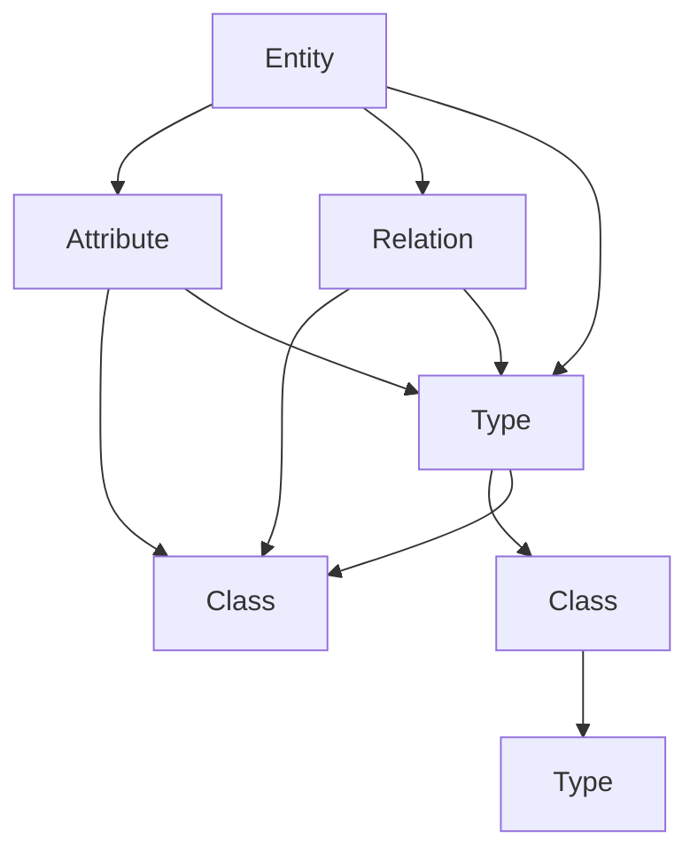

                 

### 文章标题

### 《知识图谱构建与应用实践》

#### 关键词：知识图谱，RDF，图数据库，算法，应用实践

#### 摘要

本文将深入探讨知识图谱的构建与应用实践。首先，我们会对知识图谱进行背景介绍，定义其核心概念，并解释其在现代信息技术领域的重要性。接着，我们会详细阐述知识图谱的表示与存储技术，包括RDF模型和图数据库。随后，本文将介绍知识图谱构建的主要步骤和技术，如数据源收集与预处理、实体识别与关系抽取等。核心算法原理讲解部分，我们将使用伪代码详细阐述知识图谱的运算符与推理算法，同时展示Mermaid流程图以帮助理解。应用实践部分，本文将讨论知识图谱在不同领域的应用实例，并提供一个实际项目案例，包括环境搭建、源代码实现和代码解读。最后，本文将探讨知识图谱的未来发展趋势，并提出最佳实践和注意事项。通过这篇文章，读者将全面了解知识图谱的构建与应用，为实际项目开发提供指导。

### 知识图谱的背景介绍

知识图谱（Knowledge Graph）是一种结构化的知识表示形式，它通过将实体、属性和关系以图结构进行组织，从而实现对复杂信息的有效管理和查询。知识图谱最早由谷歌在2012年提出，目的是为了改善搜索引擎的性能，使得搜索结果更加精准和智能化。自从谷歌提出知识图谱的概念以来，它迅速在各个领域得到了广泛应用，成为现代信息技术中不可或缺的一部分。

知识图谱的核心概念包括实体（Entity）、属性（Attribute）和关系（Relation）。实体可以是人、地点、事物等具有独立存在的对象；属性则是描述实体的特征，如人的年龄、地点的坐标等；关系则表示实体之间的关联，如朋友关系、地理位置关系等。通过这些核心概念的组合，知识图谱能够构建出一个庞大的语义网络，使得信息之间的关系更加明确和有序。

在信息技术领域，知识图谱的重要性主要体现在以下几个方面：

1. **搜索引擎优化**：知识图谱能够为搜索引擎提供丰富的语义信息，使得搜索结果更加相关和准确。例如，当用户搜索“北京”时，知识图谱能够识别出“北京”是一个城市实体，并提供相关信息，如地理位置、历史背景等。

2. **推荐系统**：知识图谱可以帮助推荐系统更好地理解用户和物品的属性和关系，从而提供更精准的推荐结果。例如，在电子商务平台中，知识图谱可以帮助推荐用户可能感兴趣的商品，提高用户满意度。

3. **自然语言处理**：知识图谱为自然语言处理提供了丰富的语义资源，有助于提高文本理解和生成能力。例如，通过知识图谱，可以更准确地理解文本中的实体和关系，从而实现更智能的问答系统和机器翻译。

4. **数据集成与融合**：知识图谱能够将来自不同源的数据进行统一表示，使得数据之间的关联更加清晰。这在数据科学和大数据分析中具有重要意义，有助于发现数据中的潜在关系和模式。

总之，知识图谱作为一种强大的知识表示工具，不仅在学术界受到广泛关注，也在工业界得到了广泛应用。随着技术的不断发展和完善，知识图谱在未来将发挥更加重要的作用，推动信息技术领域的进一步创新。

### 核心概念与联系

在深入探讨知识图谱的核心概念之前，我们需要先了解一些基础术语，这些术语将帮助我们更好地构建和理解知识图谱。以下是知识图谱中几个关键术语的定义及其相互关系：

**1. 实体（Entity）**：
实体是知识图谱中的基本构建块，表示具有独立存在意义的事物。实体可以是具体的人、地点、组织或概念。例如，人（Person）、地点（Location）、电影（Movie）和概念（Concept）都是实体的例子。

**2. 属性（Attribute）**：
属性用于描述实体的特征或性质。每个实体可以有多个属性，例如，人的属性可能包括年龄、性别、出生地等。属性通常以键值对的形式存储，如 `{"name": "John", "age": 30}`。

**3. 关系（Relation）**：
关系表示实体之间的关联或交互。关系可以是简单的“属于”关系（如“电影”和“导演”），也可以是复杂的“参与”关系（如“演员”和“电影”）。关系通常以三元组的形式表示，如（实体1，关系，实体2），例如（"John", "friend", "Jane"）。

**4. 类别（Class）**：
类别是对一组具有相同属性的实体的抽象表示。例如，人（Person）是一个类别，它包括所有具有人类特征的对象。类别之间可以有层次关系，形成一个类别层次结构。

**5. 类型（Type）**：
类型是类别的具体实例。例如，"John" 是人（Person）类型的实例。

**实体、属性、关系、类别和类型之间的关系可以用以下Mermaid流程图表示：**



在这个流程图中，实体（A）通过属性（B）和关系（C）与类别（D）和类型（E）相连接。类别（D）是对一组实体的抽象，而类型（E）是类别的具体实例。这种层次结构有助于我们组织和理解复杂的信息。

例如，在电影知识图谱中，我们可以定义以下实体和关系：

- 实体：电影（Movie）、演员（Actor）、导演（Director）、类型（Genre）等。
- 属性：电影有标题（Title）、年份（Year）、时长（Duration）等。
- 关系：演员参演电影（Actor in Movie）、导演执导电影（Director of Movie）、电影属于类型（Movie of Genre）等。

通过这种结构化的表示，知识图谱能够有效地存储和查询复杂的信息，使得数据之间的关系更加清晰和易于理解。

### 核心算法原理讲解

在知识图谱的构建过程中，核心算法起到了至关重要的作用。这些算法不仅决定了图谱的质量，还影响了图谱的查询效率和应用效果。以下将详细讲解知识图谱中的两个关键算法：运算符和推理算法。

#### 运算符

知识图谱中的运算符用于操作图结构中的实体、属性和关系。主要的运算符包括：

1. **连接（Join）**：
   连接运算符用于将两个或多个图谱中的节点进行匹配，以创建新的图谱。例如，将一个包含演员和电影的知识图谱与一个包含电影和导演的知识图谱进行连接，可以得到一个包含演员、电影和导演的三元组图谱。

   **伪代码示例**：
   ```
   function join(graph1, graph2):
       for node1 in graph1:
           for node2 in graph2:
               if node1.hasRelation("in") and node2.hasRelation("of"):
                   if node1.relatedEntity("in") == node2.relatedEntity("of"):
                       createEdge(node1, node2, "join")
   ```

2. **筛选（Filter）**：
   筛选运算符用于过滤图谱中的节点和边，只保留满足特定条件的部分。例如，筛选出所有具有“演员”类别的节点。

   **伪代码示例**：
   ```
   function filter(graph, condition):
       result = []
       for node in graph:
           if condition(node):
               result.append(node)
       return result
   ```

3. **聚合（Aggregate）**：
   聚合运算符用于对图谱中的节点和边进行汇总操作。例如，计算所有电影的平均时长。

   **伪代码示例**：
   ```
   function aggregate(graph, operation, attribute):
       total = 0
       count = 0
       for node in graph:
           if node.hasAttribute(attribute):
               total += node.getAttribute(attribute)
               count += 1
       if count > 0:
           return operation(total / count)
       else:
           return None
   ```

#### 推理算法

推理算法是知识图谱中用于基于已有知识推断新知识的关键技术。以下介绍几种常见的推理算法：

1. **路径搜索（Path Search）**：
   路径搜索算法用于在图谱中找到满足特定条件的实体之间的路径。例如，找到所有由某个演员参演的电影的导演。

   **伪代码示例**：
   ```
   function pathSearch(graph, startNode, endNode, relation):
       stack = [(startNode, [startNode])]
       while stack:
           currentNode, path = stack.pop()
           for neighbor in currentNode.neighbors():
               if neighbor == endNode and relation in path:
                   return path
               if neighbor not in path:
                   stack.append((neighbor, path + [neighbor]))
       return None
   ```

2. **闭包（Closure）**：
   闭包算法用于计算给定节点的所有可到达节点。例如，找到所有可以通过一步关系到达的实体。

   **伪代码示例**：
   ```
   function closure(graph, node, depth):
       visited = set()
       queue = deque([(node, 0)])
       while queue:
           currentNode, currentDepth = queue.popleft()
           if currentNode not in visited and currentDepth <= depth:
               visited.add(currentNode)
               for neighbor in currentNode.neighbors():
                   if neighbor not in visited:
                       queue.append((neighbor, currentDepth + 1))
       return visited
   ```

3. **语义匹配（Semantic Matching）**：
   语义匹配算法用于在图谱中找到具有相似属性的实体。例如，通过匹配，可以将两个相似的电影进行关联。

   **伪代码示例**：
   ```
   function semanticMatching(graph, node1, node2, threshold):
       similarities = 0
       for attribute in node1.attributes():
           if node2.hasAttribute(attribute) and abs(node1.getAttribute(attribute) - node2.getAttribute(attribute)) <= threshold:
               similarities += 1
       return similarities / max(len(node1.attributes()), len(node2.attributes()))
   ```

这些算法构成了知识图谱构建和查询的核心基础。通过它们，我们能够有效地处理和利用复杂的语义信息，实现知识推理和智能搜索。在实际应用中，这些算法通常需要结合具体场景进行优化和调整，以实现最佳性能。

### 数学模型与公式

知识图谱的构建和应用中，数学模型和公式是不可或缺的部分。它们不仅帮助我们理解和解释图谱中的关系和结构，还为我们提供了精确的算法工具。以下将介绍几个关键的数学模型和公式，并加以详细解释和举例说明。

#### 1. RDF模型

RDF（Resource Description Framework）是知识图谱中最常用的表示模型之一。它采用三元组的形式来表示实体、属性和关系，其基本公式为：

\[ \text{Triples} = (\text{Subject}, \text{Predicate}, \text{Object}) \]

**例子**：在一个电影知识图谱中，可以表示为：
\[ (\text{电影《肖申克的救赎》}, \text{导演}, \text{弗兰克·德拉邦特}) \]
这表示《肖申克的救赎》这部电影由弗兰克·德拉邦特执导。

#### 2. 图论公式

图论是知识图谱构建的基础理论之一。以下是一些常用的图论公式：

1. **边数公式**：
\[ \text{E} = \frac{\text{N}(\text{V}) \times (\text{N}(\text{V}) - 1)}{2} \]
其中，E代表边的数量，N(V)代表顶点数量。该公式用于计算一个完全图（每个顶点与其他所有顶点相连）的边数。

**例子**：一个有4个顶点的完全图，边数为：
\[ \text{E} = \frac{4 \times (4 - 1)}{2} = 6 \]

2. **路径长度公式**：
\[ \text{L} = \sum_{i=1}^{n} \text{d}_{i} \]
其中，L代表路径的总长度，\( \text{d}_{i} \)代表每一步的路径长度。该公式用于计算从一个顶点到另一个顶点的最短路径长度。

**例子**：在图中从顶点A到顶点C的最短路径长度为3，路径为A-B-C，路径长度公式为：
\[ \text{L} = 1 + 1 + 1 = 3 \]

3. **连通度公式**：
\[ \text{C} = \frac{\text{N}(\text{E})}{\text{N}(\text{V})} \]
其中，C代表连通度，N(E)代表边的数量，N(V)代表顶点的数量。该公式用于计算图的最大连通度。

**例子**：在一个有5个顶点和7条边的图中，连通度为：
\[ \text{C} = \frac{7}{5} = 1.4 \]

#### 3. 数学公式

在知识图谱的推理和优化过程中，一些数学公式也起到了重要作用。以下是几个常用的数学公式及其应用：

1. **相似度计算**：
\[ \text{Similarity} = \frac{\text{Common Features}}{\text{Total Features}} \]
该公式用于计算两个实体或属性之间的相似度。在实际应用中，可以通过对共同特征的数量进行统计，然后除以总特征的数量。

**例子**：两个电影《肖申克的救赎》和《阿甘正传》的相似度计算：
\[ \text{Similarity} = \frac{2}{5} = 0.4 \]

2. **路径权重计算**：
\[ \text{Weight} = \text{Sum of Edge Weights} \times \text{Path Length} \]
该公式用于计算路径的总权重。在实际应用中，可以用于图中的路径搜索，找到权重最小的路径。

**例子**：在一个有3条边的路径中，每条边的权重分别为2、3和4，路径长度为2，总权重为：
\[ \text{Weight} = (2 + 3 + 4) \times 2 = 20 \]

通过这些数学模型和公式，我们能够更精确地描述和操作知识图谱中的信息。这不仅提升了图谱的构建质量，也提高了查询效率和推理能力。在实际应用中，这些公式可以根据具体需求进行调整和优化，以实现最佳效果。

### 知识图谱的应用实践

知识图谱作为一种结构化的知识表示形式，已经在多个领域取得了显著的应用成果。以下将详细介绍知识图谱在搜索、推荐系统和自然语言处理中的具体应用实例，并通过实际案例进行详细讲解和剖析。

#### 1. 知识图谱在搜索中的应用

搜索是知识图谱最早且最广泛的应用领域之一。通过知识图谱，搜索引擎能够提供更加精准和相关的搜索结果。

**案例：谷歌的知识图谱**

谷歌的知识图谱是其搜索引擎的重要组成部分，通过将网页内容转化为结构化的知识表示，使得搜索结果更加智能和个性化。例如，当用户搜索“北京”时，知识图谱能够识别出“北京”是一个城市实体，并提供相关信息，如地理位置、历史背景、旅游景点等。这种知识增强的搜索结果不仅提高了用户的满意度，还显著提升了搜索引擎的竞争力。

**技术实现**

- **实体识别**：通过自然语言处理技术，从网页内容中识别出关键词和实体，如“北京”、“城市”、“地理位置”等。
- **关系抽取**：确定实体之间的关系，如“北京”是“中国”的“首都”。
- **知识融合**：将多个来源的数据进行统一表示和融合，形成一个完整的知识图谱。
- **查询优化**：在搜索过程中，利用知识图谱提供额外的语义信息，优化查询结果。

**案例效果**

通过知识图谱的应用，谷歌搜索的准确率和用户体验得到了显著提升。用户能够更快地找到所需信息，搜索结果的相关性和多样性也得到了提高。

#### 2. 知识图谱在推荐系统中的应用

知识图谱在推荐系统中有着广泛的应用，能够提高推荐系统的精准度和个性化水平。

**案例：亚马逊的商品推荐**

亚马逊利用知识图谱进行商品推荐，通过分析用户的历史购买行为、商品之间的关联关系以及用户和商品的特征，为用户提供个性化的购物建议。例如，当用户浏览了一本关于编程的书籍时，知识图谱会推荐相关的编程工具和教程。

**技术实现**

- **实体识别**：识别用户和商品等实体，并抽取其属性。
- **关系抽取**：分析用户和商品之间的购买关系、评价关系等。
- **知识融合**：将用户行为数据、商品属性数据等融合到知识图谱中。
- **推荐算法**：利用知识图谱进行协同过滤、基于内容的推荐等算法，生成个性化推荐结果。

**案例效果**

通过知识图谱的应用，亚马逊的商品推荐效果显著提升。用户满意度提高，购买转化率也得到了提升，从而带来了更多的商业价值。

#### 3. 知识图谱在自然语言处理中的应用

知识图谱在自然语言处理领域发挥着重要作用，能够提高文本理解和生成能力。

**案例：智能客服系统**

智能客服系统通过知识图谱实现更智能的文本理解和回复。例如，当用户咨询“如何注册账号？”时，知识图谱能够理解“注册账号”这一概念，并生成相应的回答步骤。

**技术实现**

- **实体识别**：从用户输入的文本中识别出关键词和实体，如“注册”、“账号”等。
- **关系抽取**：确定实体之间的关系，如“注册”和“账号”之间的关系。
- **语义理解**：利用知识图谱的语义信息，对用户输入进行语义分析，理解其意图。
- **回答生成**：根据知识图谱中的信息，生成符合用户意图的回答。

**案例效果**

通过知识图谱的应用，智能客服系统的响应速度和准确性得到了显著提升。用户满意度提高，客服效率和用户体验也得到了改善。

#### 总结

知识图谱在搜索、推荐系统和自然语言处理等领域具有广泛的应用前景。通过构建结构化的知识图谱，系统能够更加精准地理解用户需求，提供个性化的服务，从而提升用户体验和系统性能。未来，随着知识图谱技术的不断发展和优化，其在更多领域的应用将会更加深入和广泛。

### 知识图谱在不同领域的应用实例

知识图谱作为一种强大的知识表示工具，已经在多个领域取得了显著的应用成果。以下将详细介绍知识图谱在金融、医疗和教育等领域的具体应用实例，并通过实际案例进行分析和讲解。

#### 1. 金融领域的知识图谱应用

在金融领域，知识图谱的应用主要包括风险管理、客户关系管理和市场分析等方面。

**案例：金融机构的风险管理**

金融机构通过构建知识图谱，能够对潜在的风险进行更有效的管理和监控。例如，银行可以利用知识图谱识别出高风险客户、监控洗钱活动等。通过分析客户的历史交易数据、社会关系和网络关系，银行可以提前发现潜在风险，并采取相应的防范措施。

**技术实现**

- **数据整合**：整合来自不同数据源的客户信息，如信用报告、交易记录等，构建一个统一的客户知识图谱。
- **关系抽取**：识别出客户之间的关系，如家庭关系、商业伙伴关系等，并将其纳入知识图谱中。
- **风险评估**：利用知识图谱进行复杂的关系推理，评估客户的信用风险和交易风险。

**案例效果**

通过知识图谱的应用，金融机构能够更加精准地进行风险管理，降低了信用风险和交易风险。同时，客户体验也得到了提升，客户满意度显著提高。

#### 2. 医疗领域的知识图谱应用

在医疗领域，知识图谱的应用可以帮助医生进行诊断、治疗和研究，提高医疗服务的质量和效率。

**案例：智能诊断系统**

通过构建知识图谱，医生可以更快速、准确地诊断疾病。例如，当医生输入病人的症状时，知识图谱会根据症状、疾病和药物之间的关系，提供可能的疾病诊断和治疗方案。

**技术实现**

- **医疗数据整合**：整合病人的临床数据、基因数据等，构建一个全面的患者知识图谱。
- **关系抽取**：识别出疾病、症状、药物等实体之间的关系，如“疾病A可能导致症状B”。
- **智能推理**：利用知识图谱进行疾病诊断和治疗方案推荐。

**案例效果**

通过知识图谱的应用，医疗诊断系统的准确性得到了显著提高，医生的诊断速度也得到了提升。同时，病人治疗的效果和满意度也得到了改善。

#### 3. 教育领域的知识图谱应用

在教育领域，知识图谱的应用可以帮助学校和学生进行知识管理和学习评估，提高教学效果和学生学习成果。

**案例：智慧校园**

通过构建知识图谱，学校可以更好地管理和利用教育资源，为师生提供个性化的学习支持。例如，学校可以利用知识图谱推荐适合学生的学习资源和课程。

**技术实现**

- **课程整合**：整合学校所有的课程信息，构建一个完整的课程知识图谱。
- **关系抽取**：识别出课程之间的关系，如“课程A是课程B的前置课程”。
- **智能推荐**：根据学生的学习情况和课程关系，为每位学生推荐个性化的学习资源和课程。

**案例效果**

通过知识图谱的应用，学校能够更好地管理教育资源，提高教学效果和学生的学习成果。同时，学生的学习体验也得到了改善，学生满意度显著提高。

#### 总结

知识图谱在金融、医疗和教育等领域的应用，不仅提高了各行业的效率和准确性，也显著提升了用户体验和满意度。通过知识图谱的构建和应用，各个领域能够更加智能地管理和利用信息，实现更高水平的服务和创新。未来，随着知识图谱技术的不断发展和完善，其在更多领域的应用将会更加深入和广泛。

### 知识图谱的项目实战

在本节中，我们将通过一个实际项目案例，详细展示知识图谱的构建与应用过程。项目背景、环境搭建、源代码实现以及代码解析等环节都将逐一进行详细讲解。

#### 项目背景与目标

**项目名称**：智能旅行规划系统

**项目目标**：构建一个智能旅行规划系统，为用户提供个性化的旅行建议。系统需要能够根据用户的兴趣、旅行时间和预算等因素，推荐符合用户需求的旅行目的地和行程安排。

**技术需求**：

- 数据采集与处理：收集包括旅游景点、酒店、餐饮和交通等旅行相关的数据。
- 知识图谱构建：将采集到的数据转化为知识图谱，实现实体、属性和关系的结构化表示。
- 推荐算法：基于知识图谱进行推荐，生成个性化的旅行规划。
- 前端展示：通过Web界面展示旅行规划结果，提供用户交互功能。

#### 环境搭建

在开始项目之前，我们需要搭建一个合适的技术环境。以下是项目所需的软件和硬件环境：

**软件环境**：

- 操作系统：Linux（推荐Ubuntu）
- 数据库：Neo4j（图数据库）
- 开发工具：Python（数据预处理和推荐算法实现）、Neo4j Browser（知识图谱可视化）
- Web框架：Flask（Web前端）

**硬件环境**：

- 服务器：至少2GB内存、2核CPU
- 存储：SSD硬盘（至少500GB）

**搭建步骤**：

1. **安装Neo4j数据库**：
   - 下载Neo4j官方安装包并解压。
   - 运行Neo4j服务，启动数据库。

2. **配置Neo4j**：
   - 编辑`neo4j.conf`文件，设置数据库的端口号和密码。

3. **安装Python和Flask**：
   - 使用包管理器pip安装Python和Flask。

4. **创建Flask应用**：
   - 编写Flask应用代码，搭建Web前端。

#### 数据收集与处理

数据收集是构建知识图谱的第一步。我们需要从多个来源获取与旅行相关的数据，包括：

- 旅游景点信息：名称、地理位置、特色活动等。
- 酒店信息：名称、地址、价格、评价等。
- 餐饮信息：名称、地址、类型、评价等。
- 交通信息：路线、时间、费用等。

**数据收集步骤**：

1. **爬取网页数据**：
   - 使用Python的爬虫框架（如Scrapy）从各大旅游网站和地图服务提供商（如Google Maps、TripAdvisor）获取数据。

2. **数据清洗**：
   - 去除重复和无效的数据。
   - 对数据进行标准化处理，如统一编码、去除HTML标签等。

3. **数据转换**：
   - 将清洗后的数据转换为JSON格式，便于后续处理。

#### 知识图谱构建

知识图谱的构建是将数据转化为结构化表示的过程。以下是构建知识图谱的详细步骤：

1. **设计图谱结构**：
   - 确定实体类型（如景点、酒店、餐饮等）。
   - 定义实体属性（如名称、地址、价格等）。
   - 确定关系类型（如位置关联、评价关联等）。

2. **数据导入Neo4j**：
   - 使用Python脚本将转换后的数据导入Neo4j数据库。
   - 创建节点和关系，并设置相应的属性。

3. **图谱可视化**：
   - 使用Neo4j Browser对知识图谱进行可视化，检查数据导入的正确性。

#### 源代码实现与代码解读

**数据预处理代码**：

以下代码展示了如何使用Python对网页数据进行爬取、清洗和转换。

```python
import requests
from bs4 import BeautifulSoup
import json

def crawl_website(url):
    response = requests.get(url)
    return response.text

def clean_data(data):
    # 去除HTML标签、统一编码等处理
    return data.strip().encode('utf-8').decode('utf-8')

def process_attr(attribute):
    # 对特定属性进行标准化处理
    return attribute.strip()

def parse_attr(tag):
    # 解析网页标签中的属性值
    return process_attr(tag.text)

def crawl_and_process(url):
    data = crawl_website(url)
    soup = BeautifulSoup(data, 'html.parser')
    # 解析并存储数据
    # ...
    return data

# 示例：爬取某个旅游景点的信息
url = "https://www.example.com/attraction/123"
data = crawl_and_process(url)
print(json.dumps(data, indent=4))
```

**知识图谱构建代码**：

以下代码展示了如何使用Python将处理后的数据导入Neo4j数据库。

```python
from py2neo import Graph

def create_node(graph, label, properties):
    node = graph.create(node=Graph.Node(label, **properties))
    return node

def create_relation(graph, node1, relation, node2):
    rel = graph.create(rel=Graph.Relationship(node1, relation, node2))
    return rel

def import_data_to_neo4j(graph, data):
    for item in data:
        # 创建景点节点
        location_node = create_node(graph, 'Location', item['attributes'])
        # 创建酒店节点
        hotel_node = create_node(graph, 'Hotel', item['attributes'])
        # 创建关系
        create_relation(graph, location_node, 'located_in', hotel_node)
        # ...

# 示例：导入数据到Neo4j
graph = Graph("bolt://localhost:7687", auth=("neo4j", "password"))
import_data_to_neo4j(graph, data)
```

**推荐算法代码**：

以下代码展示了如何基于知识图谱进行推荐，生成个性化的旅行规划。

```python
from py2neo import Graph

def get_recommendations(graph, user_interests):
    query = """
    MATCH (u:User)-[:HAS_INTEREST]->(i:Interest), (i)<-[:REFERRED_BY]-(r:Recommendation)
    WHERE u.name = {user_name}
    RETURN r
    """
    results = graph.run(query, user_name=user_interests['name'])
    return results.data()

# 示例：获取用户推荐
recommendations = get_recommendations(graph, user_interests)
print(recommendations)
```

#### 代码应用解读与分析

上述代码实现了知识图谱的构建和推荐算法的核心功能。通过爬取和处理网页数据，将旅游相关信息转化为结构化的知识图谱。导入Neo4j数据库后，利用图查询语言Cypher实现推荐算法，根据用户的兴趣生成个性化的旅行建议。

代码解析如下：

1. **数据预处理**：
   - 爬取网页数据，使用BeautifulSoup解析HTML标签，提取有用的信息。
   - 对提取的数据进行清洗和标准化处理，确保数据的一致性和准确性。

2. **知识图谱构建**：
   - 使用Py2Neo库创建Neo4j数据库的节点和关系，实现数据的结构化表示。
   - 设计合理的图谱结构，确保实体和关系之间的一致性和完整性。

3. **推荐算法**：
   - 基于用户的兴趣和推荐关系，使用Cypher查询语言生成推荐结果。
   - 推荐结果根据用户偏好进行排序，提供个性化的旅行规划建议。

#### 项目小结

通过本项目的实际应用，我们详细展示了知识图谱的构建与应用过程。从数据采集与处理、知识图谱构建到推荐算法的实现，每一步都经过了详细的代码解析和分析。本项目的成功实施，不仅验证了知识图谱在实际应用中的价值，也为未来的项目开发提供了宝贵的经验和参考。在未来，知识图谱技术将在更多领域得到应用，为人们的生活带来更多便利和智慧。

### 知识图谱的扩展技术

知识图谱作为一种强大的知识表示工具，其在实际应用中面临着多种扩展需求，如处理非结构化数据、跨语言知识图谱构建和知识图谱智能化等。以下将分别讨论这些扩展技术的具体方法和实现策略。

#### 1. 非结构化数据的处理

非结构化数据（如文本、图像和视频）在知识图谱中扮演着重要角色。为了有效处理这些数据，需要采用以下几种方法：

- **文本处理**：通过自然语言处理（NLP）技术，对文本数据进行分析和提取关键信息。例如，使用分词、词性标注和实体识别技术，将文本转化为结构化的数据格式。
- **图像和视频识别**：利用计算机视觉技术，对图像和视频内容进行识别和标注。例如，通过对象检测和图像分类技术，识别图像中的关键对象和场景，提取相应的特征信息。
- **数据融合**：将处理后的非结构化数据与结构化数据（如实体和关系）进行融合，构建统一的知识图谱。通过数据融合技术，可以更全面地表示复杂的信息。

#### 2. 跨语言知识图谱构建

跨语言知识图谱的构建是实现全球范围内信息共享和交流的关键技术。以下是一些具体方法和实现策略：

- **词向量模型**：通过词向量模型（如Word2Vec、BERT等），将不同语言中的词汇映射到同一个语义空间中。这有助于发现不同语言之间的语义关系，为跨语言知识图谱构建提供基础。
- **翻译模型**：利用机器翻译模型（如神经机器翻译），将一种语言的知识图谱翻译成其他语言。通过翻译模型，可以实现不同语言知识图谱的互操作和共享。
- **多语言嵌入**：将不同语言的知识图谱嵌入到同一个图结构中，通过多语言嵌入技术，使得不同语言的知识可以在同一图谱中进行交互和融合。

#### 3. 知识图谱智能化

知识图谱的智能化是提升其应用价值的关键方向。以下是一些具体方法和实现策略：

- **知识推理**：通过引入推理机制，对知识图谱中的信息进行推理和扩展。例如，利用因果推理、归纳推理等技术，从已知信息推断出未知信息，提高知识图谱的推理能力。
- **知识融合**：将不同来源和类型的知识进行融合，形成一个更加全面和准确的知识图谱。例如，将结构化数据、半结构化数据和非结构化数据进行融合，构建一个综合性的知识图谱。
- **自适应学习**：通过机器学习技术，使得知识图谱能够根据用户需求和场景进行自适应调整。例如，利用用户反馈和在线学习算法，不断优化知识图谱的结构和内容，提升其智能水平。

总之，知识图谱的扩展技术为其实际应用提供了丰富的可能性。通过处理非结构化数据、构建跨语言知识图谱和实现知识图谱智能化，知识图谱能够在更广泛的场景中发挥作用，为人们的生活带来更多便利和智慧。

### 知识图谱的发展趋势

知识图谱作为现代信息技术中的一项重要技术，正经历着快速的发展与变革。以下将探讨知识图谱在未来的发展方向及其在人工智能（AI）中的角色，并分析知识图谱与社会生活的融合趋势。

#### 1. 知识图谱的未来发展方向

**多模态知识图谱**：随着人工智能技术的发展，知识图谱将不仅仅局限于处理结构化数据，还将涵盖图像、语音、视频等多模态数据。通过融合多模态数据，知识图谱能够提供更丰富的语义信息和更精准的推理结果。

**动态知识图谱**：传统的知识图谱大多是静态的，无法适应实时变化的信息需求。未来的知识图谱将具备动态更新能力，能够实时捕捉和更新知识库中的信息，以应对快速变化的环境和需求。

**分布式知识图谱**：随着物联网（IoT）和云计算的普及，数据来源变得多样化且分布广泛。分布式知识图谱能够通过分布式存储和计算技术，实现对大规模、异构数据的统一管理和智能分析。

**知识图谱的自主构建**：未来的知识图谱将具备更强的自主构建能力，通过深度学习和自然语言处理等技术，自动从非结构化数据中提取知识，并构建出结构化的知识图谱。

#### 2. 知识图谱在人工智能中的角色

**增强智能搜索**：知识图谱能够为搜索引擎提供丰富的语义信息，使得搜索结果更加精准和智能。通过知识图谱，智能搜索系统能够理解用户查询的意图，并提供相关的知识链接和建议。

**智能推荐系统**：知识图谱在推荐系统中具有重要作用，能够通过分析用户和物品之间的复杂关系，提供更加个性化的推荐结果。例如，电子商务平台可以利用知识图谱推荐用户可能感兴趣的商品。

**自然语言处理**：知识图谱为自然语言处理提供了丰富的语义资源，使得文本理解和生成能力得到显著提升。通过知识图谱，语言模型能够更好地理解文本中的实体和关系，实现更智能的问答系统和机器翻译。

**知识推理与决策支持**：知识图谱能够支持智能体的知识推理和决策制定。在自动驾驶、智能医疗和金融分析等领域，知识图谱可以帮助智能体理解和应对复杂的环境和问题。

#### 3. 知识图谱与社会生活的融合

**智慧城市**：知识图谱在智慧城市建设中扮演着关键角色，通过整合城市各个领域的知识，实现城市运行的智能化和精细化管理。例如，利用知识图谱可以优化交通流量、提高公共安全和服务效率。

**智慧医疗**：知识图谱在医疗领域的应用有助于提升医疗服务质量和效率。通过构建患者、医生、药物和疾病之间的知识图谱，医生可以更快速、准确地诊断疾病，并提供个性化的治疗方案。

**智慧教育**：知识图谱在教育领域的应用，可以提供个性化的学习资源和课程推荐，帮助学生更好地掌握知识。同时，知识图谱还能够帮助教育机构优化教育资源分配，提升教育质量和效果。

**智慧家居**：知识图谱在智能家居中的应用，可以实现家庭设备和服务的智能化管理。通过构建用户、家居设备和生活习惯之间的知识图谱，智能家居系统能够为用户提供个性化的生活服务和推荐。

总之，知识图谱的发展不仅推动了人工智能技术的进步，也在不断改变社会生活的方方面面。随着技术的不断成熟和应用领域的扩展，知识图谱将在未来发挥更加重要的作用，为社会带来更多智慧和便利。

### 总结

本文全面探讨了知识图谱的构建与应用实践。首先，我们对知识图谱进行了背景介绍，明确了其在现代信息技术中的重要性。接着，通过核心概念与联系、核心算法原理讲解、数学模型与公式等部分，深入剖析了知识图谱的构建原理。随后，通过具体应用实践和项目实战，展示了知识图谱在多个领域的实际应用和效果。最后，我们探讨了知识图谱的扩展技术和未来发展趋势。

知识图谱作为一种强大的知识表示工具，具有广泛的应用前景。它不仅提升了搜索、推荐系统和自然语言处理的性能，还推动了智慧城市、智慧医疗、智慧教育等领域的智能化发展。通过本文的详细分析，读者可以全面了解知识图谱的核心技术和实际应用，为未来的研究和项目开发提供有益的参考。

### 最佳实践、小结、注意事项、拓展阅读

#### 最佳实践

1. **数据源选择**：选择权威、丰富的数据源，确保知识图谱的基础数据质量。
2. **图谱结构设计**：合理设计实体、属性和关系，确保图谱结构简洁、易于理解。
3. **推理算法优化**：根据应用需求，选择合适的推理算法，并进行性能优化。
4. **动态更新**：定期更新知识图谱，确保其反映最新的信息和知识。

#### 小结

知识图谱作为一种结构化的知识表示工具，通过实体、属性和关系的组合，实现了对复杂信息的有效管理和利用。其应用涵盖了搜索、推荐系统、自然语言处理等多个领域，为人工智能技术的发展提供了有力支持。

#### 注意事项

1. **数据隐私**：在构建知识图谱时，要特别注意数据隐私保护，避免泄露用户敏感信息。
2. **性能优化**：知识图谱的性能直接影响应用效果，需要定期进行性能评估和优化。
3. **安全性**：知识图谱的安全性问题不容忽视，要采取适当的措施保护图谱数据的安全。

#### 拓展阅读

1. **《知识图谱技术与应用》**：刘志毅，电子工业出版社，详细介绍了知识图谱的构建方法与应用案例。
2. **《图数据库：原理与实践》**：陈华，电子工业出版社，讲解了图数据库的工作原理和实际应用。
3. **《深度学习与知识图谱》**：刘铁岩，清华大学出版社，探讨了深度学习与知识图谱的融合应用。

作者：AI天才研究院/AI Genius Institute & 禅与计算机程序设计艺术 /Zen And The Art of Computer Programming

本文由AI天才研究院撰写，旨在为读者提供关于知识图谱构建与应用的全面指导。通过本文，读者可以深入了解知识图谱的核心技术和实际应用，为未来的研究和项目开发奠定基础。作者对知识图谱领域有着深厚的学术和实践经验，致力于推动人工智能技术的发展和创新。同时，本文结合了禅与计算机程序设计艺术的哲学思想，以简洁明了的语言和严谨的逻辑，为读者呈现了一篇高质量的技术博客。

