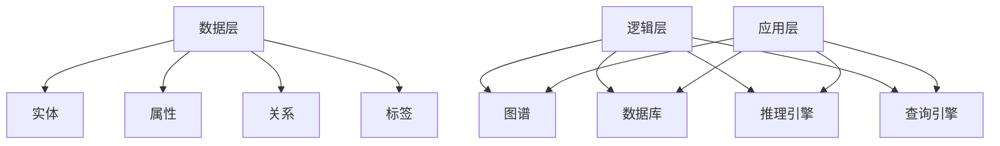

                 

### 文章标题

# 知识图谱：构建和应用语义网络

### 关键词

- 知识图谱
- 语义网络
- 实体识别
- 关系抽取
- 知识融合
- 推理算法
- 搜索引擎
- 推荐系统

### 摘要

本文将深入探讨知识图谱的概念、构建方法及其在各种应用场景中的重要作用。我们将一步步分析知识图谱的基础理论，解释其核心概念和组成部分，展示知识表示方法，并详细讲解构建语义网络的算法和技巧。接着，我们将探讨知识图谱在不同领域中的应用，如搜索引擎和推荐系统，以及其在自然语言处理和社交网络分析中的作用。文章还将介绍知识图谱的数据处理方法，包括存储、索引、更新和维护，并提供评估和优化策略。最后，通过两个实战案例分析，我们将展示知识图谱在实际项目中的应用，并总结最佳实践和注意事项。

## 第1部分：知识图谱的基础理论

### 第1章：知识图谱概述

知识图谱是一种用于表示实体及其相互关系的图形结构，它通过图数据库存储和索引数据，能够捕捉现实世界中的复杂关系和语义信息。知识图谱不仅包含具体的事实信息，还包含关于这些事实的背景知识和上下文信息。

### 1.1 知识图谱的定义

知识图谱（Knowledge Graph）是由实体（Entity）、属性（Attribute）、关系（Relationship）以及标签（Tag）构成的数据结构。这种数据结构通过节点和边来表示实体之间的关系，使得数据查询和分析变得更加高效和直观。

### 1.2 知识图谱与语义网络的联系

语义网络（Semantic Network）是一种用于表示知识的形式化模型，它通过概念和关系来构建知识结构。知识图谱可以看作是一种扩展的语义网络，它不仅包含了语义网络中的概念和关系，还增加了大量的实体属性信息，使其能够更好地捕捉现实世界的复杂关系。

### 1.3 知识图谱的组成部分

知识图谱由以下四个主要组成部分构成：

- **实体（Entity）**：表示现实世界中的对象，如人、地点、事物等。
- **属性（Attribute）**：描述实体的特征，如姓名、年龄、身高等。
- **关系（Relationship）**：描述实体之间的相互联系，如“属于”、“位于”、“制造”等。
- **标签（Tag）**：用于对实体、关系或属性进行分类或标记，如“人”、“地点”、“产品”等。

### 1.4 知识图谱的架构与组件

知识图谱的架构通常包括以下几个组件：

- **数据层**：存储实体、属性、关系和标签的数据。
- **推理层**：用于基于知识图谱进行推理和数据分析。
- **应用层**：提供各种基于知识图谱的应用服务。

### 1.5 知识图谱的工作原理

知识图谱通过以下步骤工作：

1. **数据采集**：从各种数据源中采集信息，包括结构化数据、非结构化数据和半结构化数据。
2. **数据预处理**：清洗和标准化数据，使其符合知识图谱的格式。
3. **知识抽取**：从预处理后的数据中抽取实体、属性和关系。
4. **知识融合**：将来自不同数据源的信息进行整合，形成完整的知识图谱。
5. **推理与应用**：基于知识图谱进行推理，为各种应用提供支持。

### 1.6 知识图谱的重要性

知识图谱的重要性体现在以下几个方面：

- **数据整合**：通过统一的数据模型，将来自不同数据源的信息进行整合，提高数据利用率。
- **语义理解**：通过表示实体和关系的语义信息，增强系统的语义理解能力。
- **智能搜索**：基于知识图谱的搜索系统能够提供更精确、更智能的搜索结果。
- **推荐系统**：基于知识图谱的推荐系统可以更好地理解用户需求，提供个性化的推荐。
- **自然语言处理**：知识图谱可以用于改善自然语言处理系统的性能，如问答系统、情感分析等。

### 1.7 知识图谱的发展历程

知识图谱的发展历程可以分为以下几个阶段：

- **实体链接**：早期的研究主要集中在实体链接（Entity Linking）问题上，即识别文本中的实体并关联到知识图谱中的实体。
- **知识抽取**：随着研究的深入，知识抽取（Knowledge Extraction）技术逐渐成为知识图谱构建的核心问题。
- **知识融合**：如何将来自不同数据源的信息进行有效融合，成为知识图谱研究的又一重点。
- **推理与应用**：近年来，知识图谱在智能搜索、推荐系统、自然语言处理等领域的应用得到了广泛关注。

### 1.8 知识图谱的应用领域

知识图谱的应用领域非常广泛，主要包括以下几个方面：

- **搜索引擎**：基于知识图谱的搜索引擎可以提供更精确、更智能的搜索结果。
- **推荐系统**：基于知识图谱的推荐系统可以更好地理解用户需求，提供个性化的推荐。
- **自然语言处理**：知识图谱可以用于改善自然语言处理系统的性能，如问答系统、情感分析等。
- **社交网络分析**：知识图谱可以用于分析社交网络中的关系和影响力。
- **金融分析**：知识图谱可以用于分析金融市场中的投资机会和风险。

### 1.9 知识图谱的优势与挑战

知识图谱的优势包括：

- **高效的数据整合**：通过统一的数据模型，实现数据的整合和共享。
- **强大的语义理解**：通过表示实体和关系的语义信息，增强系统的语义理解能力。
- **智能的推理与分析**：基于知识图谱的推理与分析，提高系统的智能水平。

知识图谱面临的挑战包括：

- **数据质量**：知识图谱的质量取决于数据的质量，包括数据准确性、完整性和一致性。
- **数据多样性**：如何处理来自不同数据源、不同格式的数据，是知识图谱构建的难题。
- **推理复杂性**：知识图谱中的推理过程可能非常复杂，需要高效的算法和计算资源。
- **应用扩展性**：知识图谱在不同领域的应用，需要考虑系统的扩展性和可维护性。

### 1.10 总结

知识图谱作为一种重要的数据结构和知识表示方法，已经在各个领域得到了广泛应用。通过对知识图谱的定义、架构、工作原理和应用领域进行详细分析，我们能够更好地理解知识图谱的内在价值和潜力。在接下来的章节中，我们将深入探讨知识图谱的构建方法和应用技巧，以帮助读者更好地掌握这一重要技术。

### 第2章：知识图谱的架构与组件

在了解知识图谱的基本概念后，接下来我们将深入探讨知识图谱的架构和组件，这是构建和维护一个高效、可靠知识图谱的基础。

#### 2.1 知识图谱的架构

知识图谱的架构通常分为三个层次：数据层、逻辑层和应用层。

- **数据层**：数据层是知识图谱的基础，它负责存储和管理实体、属性、关系和标签等数据。数据层通常使用图数据库来实现，如Neo4j、Apache Giraph等。
- **逻辑层**：逻辑层负责知识图谱的构建、推理和查询等核心功能。它包括实体识别、关系抽取、知识融合、推理算法等组件。
- **应用层**：应用层是知识图谱与具体应用场景的结合点，它为各种应用提供知识图谱的支持和服务。例如，搜索引擎、推荐系统、自然语言处理等。

#### 2.2 知识图谱的组件

知识图谱的组件是构建知识图谱的核心，以下是知识图谱的主要组件及其功能：

- **实体（Entity）**：实体是知识图谱中的基本元素，表示现实世界中的对象，如人、地点、事物等。实体可以是具体的对象，也可以是抽象的概念。
- **属性（Attribute）**：属性描述实体的特征，如姓名、年龄、身高、位置等。属性通常与实体关联，用于描述实体的详细信息。
- **关系（Relationship）**：关系描述实体之间的相互联系，如“属于”、“位于”、“制造”等。关系通常表示为两个实体之间的边。
- **标签（Tag）**：标签用于对实体、关系或属性进行分类或标记，如“人”、“地点”、“产品”等。标签有助于提高知识图谱的可读性和查询效率。
- **图谱（Graph）**：图谱是知识图谱的核心，它由节点（实体和关系）和边（关系）构成，用于表示实体之间的复杂关系。
- **数据库（Database）**：数据库用于存储和管理知识图谱的数据，通常使用图数据库来实现，如Neo4j、Apache Giraph等。
- **推理引擎（Reasoning Engine）**：推理引擎用于基于知识图谱进行推理，提取新的知识或验证现有知识的准确性。
- **查询引擎（Query Engine）**：查询引擎用于对知识图谱进行查询，返回符合条件的结果。
- **数据处理组件（Data Processing Components）**：数据处理组件用于数据采集、数据预处理、知识抽取、知识融合等操作。

#### 2.3 知识图谱的 Mermaid 流程图

为了更好地理解知识图谱的架构和组件，我们可以使用 Mermaid 图形语言来绘制一个简化的知识图谱流程图，如下所示：



在这个流程图中，数据层负责存储和管理实体、属性、关系和标签等数据；逻辑层负责知识图谱的构建、推理和查询等核心功能；应用层为各种应用提供知识图谱的支持和服务。

### 2.4 知识图谱的构建方法

构建知识图谱通常需要以下步骤：

1. **数据采集**：从各种数据源（如数据库、网页、文档等）采集信息。
2. **数据预处理**：清洗和标准化数据，使其符合知识图谱的格式。
3. **知识抽取**：从预处理后的数据中抽取实体、属性和关系。
4. **知识融合**：将来自不同数据源的信息进行整合，形成完整的知识图谱。
5. **推理与应用**：基于知识图谱进行推理，为各种应用提供支持。

#### 2.5 知识图谱的优化策略

为了提高知识图谱的性能，可以采取以下优化策略：

1. **数据压缩**：通过数据压缩技术，减少知识图谱的存储空间。
2. **索引优化**：通过索引优化，提高查询效率。
3. **推理优化**：通过优化推理算法，提高推理效率。
4. **分布式计算**：通过分布式计算，提高知识图谱的处理能力。

### 2.6 知识图谱的应用场景

知识图谱可以应用于多个领域，包括：

1. **搜索引擎**：基于知识图谱的搜索引擎可以提供更精确、更智能的搜索结果。
2. **推荐系统**：基于知识图谱的推荐系统可以更好地理解用户需求，提供个性化的推荐。
3. **自然语言处理**：知识图谱可以用于改善自然语言处理系统的性能，如问答系统、情感分析等。
4. **社交网络分析**：知识图谱可以用于分析社交网络中的关系和影响力。
5. **金融分析**：知识图谱可以用于分析金融市场中的投资机会和风险。

### 2.7 总结

通过了解知识图谱的架构和组件，我们能够更好地理解知识图谱的工作原理和构建方法。知识图谱作为一种重要的数据结构和知识表示方法，已经在各个领域得到了广泛应用。在接下来的章节中，我们将继续探讨知识图谱的构建方法和应用技巧，以帮助读者更好地掌握这一重要技术。

### 第3章：知识表示方法

在构建知识图谱的过程中，知识表示方法是一个关键环节。知识表示方法决定了如何将现实世界中的信息转化为计算机可以理解和处理的形式。本章将详细介绍几种常见的知识表示方法，包括实体-关系表示法、语义网络表示法和RDF表示法。

#### 3.1 实体-关系表示法

实体-关系表示法（Entity-Relationship Representation）是最常见的知识表示方法之一。在这种方法中，知识图谱由实体和关系组成，实体表示现实世界中的对象，关系表示实体之间的相互作用。

- **实体**：实体是知识图谱中的基本元素，可以是人、地点、事物等。每个实体都有唯一的标识符，如姓名、ID等。
- **关系**：关系描述实体之间的相互作用，如“属于”、“位于”、“制造”等。关系也有唯一的标识符，并可以附加属性，如时间、地点等。

实体-关系表示法的基本框架可以表示为：

$$
G = (E, R, P)
$$

其中，$E$表示实体集合，$R$表示关系集合，$P$表示属性集合。

#### 3.2 语义网络表示法

语义网络表示法（Semantic Network Representation）是一种基于概念和关系的知识表示方法。在这种方法中，知识图谱由节点（表示概念）和边（表示关系）组成。每个节点都有一个唯一的标识符，边表示节点之间的关系。

语义网络的基本框架可以表示为：

$$
G = (N, E, R)
$$

其中，$N$表示节点集合，$E$表示边集合，$R$表示关系集合。

语义网络表示法的一个重要特点是，它可以用来表示复杂的语义关系，如图灵关系（Turing Relation）和层次关系（Hierarchical Relation）。

#### 3.3 RDF表示法

RDF（Resource Description Framework）表示法是一种基于XML的语义网络表示方法。RDF将知识图谱表示为一系列的三元组，每个三元组包含一个主体（Subject）、一个谓词（Predicate）和一个客体（Object）。

RDF的基本框架可以表示为：

$$
\{ (s, p, o), (s, p, o), ... \}
$$

其中，$s$表示主体，$p$表示谓词，$o$表示客体。

RDF的一个优点是它的语义信息非常丰富，每个元素都可以附带属性，如数据类型、语言等。

#### 3.4 实体-关系表示法与语义网络表示法的比较

实体-关系表示法和语义网络表示法都是常用的知识表示方法，但它们也有明显的区别：

- **抽象层次**：实体-关系表示法通常更接近于数据库的表示方法，注重实体和关系的直接映射；而语义网络表示法更注重概念和关系的层次结构。
- **表达能力**：语义网络表示法可以表示更复杂的语义关系，如图灵关系和层次关系；而实体-关系表示法则相对简单，更适合表示直接的实体关系。
- **灵活性**：实体-关系表示法在处理复杂关系时可能需要更多的约束和规则；而语义网络表示法则更加灵活，可以自由地定义和修改概念和关系。

#### 3.5 RDF表示法的优势

RDF表示法作为一种基于XML的语义网络表示方法，具有以下优势：

- **标准化**：RDF是一种标准化的知识表示方法，被广泛接受和使用。
- **灵活性**：RDF允许在知识图谱中定义各种属性和约束，使得知识表示更加灵活。
- **互操作性**：由于RDF是一种基于XML的表示方法，它具有良好的互操作性，可以与其他系统和数据格式轻松集成。

#### 3.6 实例分析

下面是一个简单的实体-关系表示法的实例：

- 实体：张三、李四
- 关系：朋友
- 属性：无

知识图谱可以表示为：

```
张三 --[朋友]-- 李四
```

下面是一个简单的语义网络表示法的实例：

- 概念：人、朋友
- 关系：属于、实例化
- 属性：无

知识图谱可以表示为：

```
人 --[属于]-- 张三
人 --[属于]-- 李四
朋友 --[实例化]-- 张三与李四
```

下面是一个简单的RDF表示法的实例：

- 主体：张三
- 谓词：是朋友
- 客体：李四

知识图谱可以表示为：

```xml
<张三 rdf:about="张三">
  <是朋友>
    <李四 rdf:about="李四"/>
  </是朋友>
</张三>
```

#### 3.7 总结

知识表示方法决定了知识图谱的构建和解析方式。实体-关系表示法、语义网络表示法和RDF表示法是三种常用的知识表示方法，各有其特点和适用场景。通过选择合适的知识表示方法，我们可以有效地构建和利用知识图谱，为各种应用提供支持。

### 第4章：数据采集与预处理

在构建知识图谱的过程中，数据采集与预处理是至关重要的步骤。数据采集是指从各种数据源获取信息，而数据预处理则是对采集到的数据进行清洗、标准化和整合。本章将详细介绍数据采集与预处理的方法和技巧，以帮助读者构建高质量的知识图谱。

#### 4.1 数据采集

数据采集是知识图谱构建的第一步，其目的是从各种数据源中获取所需的信息。常见的数据源包括数据库、网页、文档、API等。以下是一些常用的数据采集方法：

- **网络爬虫**：网络爬虫（Web Crawler）是一种自动从互联网上抓取信息的程序。它可以通过网页链接进行遍历，从网页中提取有用信息。常见的爬虫工具有Scrapy、BeautifulSoup等。
- **API调用**：许多在线服务和数据库提供API接口，可以通过编程方式直接调用这些接口来获取数据。例如，使用RESTful API获取社交媒体数据、使用爬虫API获取天气数据等。
- **数据库连接**：对于结构化数据，可以通过数据库连接直接从数据库中提取数据。常用的数据库连接工具有JDBC、ODBC等。
- **文件读取**：从本地文件系统读取数据，如CSV、Excel、JSON等格式。常用的读取工具有Pandas、NumPy等。

#### 4.2 数据预处理

数据预处理是确保数据质量的关键步骤，其目的是对采集到的数据进行清洗、标准化和整合。以下是一些常见的数据预处理方法：

- **数据清洗**：数据清洗（Data Cleaning）是指识别和修正数据中的错误、缺失、重复和异常值。常见的数据清洗方法包括：
  - 错误值修正：识别和修正数据中的错误值，如将“2000-13-01”修正为“2000-12-01”。
  - 缺失值处理：处理数据中的缺失值，如使用平均值、中位数或最常见值进行填充。
  - 重复值去除：识别和去除数据中的重复值，确保数据的唯一性。
  - 异常值检测：识别和修正数据中的异常值，如异常的交易金额、异常的用户行为等。

- **数据标准化**：数据标准化（Data Standardization）是指将数据转换为统一的格式，以便于后续处理。常见的数据标准化方法包括：
  - 字段命名规范：将不同数据源中的字段命名统一，如将“用户名”、“用户ID”统一命名为“UserID”。
  - 数据类型转换：将不同数据类型的数据转换为统一的类型，如将字符串转换为整数或浮点数。
  - 日期格式转换：将不同格式的日期数据转换为统一的日期格式，如YYYY-MM-DD。

- **数据整合**：数据整合（Data Integration）是指将来自不同数据源的数据进行合并，形成一个统一的数据集。常见的数据整合方法包括：
  - 数据合并：将多个数据表合并为一个表，如使用SQL的JOIN操作。
  - 数据去重：识别和去除重复的数据记录，确保数据的唯一性。
  - 数据转换：将不同数据格式转换为统一的格式，如将CSV转换为JSON。

#### 4.3 数据预处理工具

在进行数据预处理时，常用的工具包括Python的Pandas库、R的dplyr包等。以下是一个简单的数据预处理示例，使用Python的Pandas库：

```python
import pandas as pd

# 读取CSV文件
data = pd.read_csv('data.csv')

# 数据清洗
data = data.drop_duplicates()  # 去除重复值
data = data[data['UserID'].notnull()]  # 去除缺失值
data = data[data['Amount'] > 0]  # 去除异常值

# 数据标准化
data = data.rename(columns={'User_Name': 'UserID', 'Amount': 'OrderAmount'})  # 字段命名规范
data['OrderDate'] = pd.to_datetime(data['OrderDate'], format='%Y-%m-%d')  # 日期格式转换

# 数据整合
data = data.groupby('UserID').sum()  # 数据合并

# 保存预处理后的数据
data.to_csv('cleaned_data.csv', index=False)
```

#### 4.4 数据质量评估

在完成数据预处理后，需要对数据质量进行评估，以确保数据满足知识图谱构建的要求。以下是一些常见的数据质量评估指标：

- **数据完整性**：评估数据中缺失值的比例。
- **数据一致性**：评估数据中的错误值和异常值的比例。
- **数据准确性**：评估数据中正确值的比例。
- **数据唯一性**：评估数据中重复值的比例。

#### 4.5 总结

数据采集与预处理是构建高质量知识图谱的基础。通过合理的数据采集方法和预处理技巧，我们可以确保数据的质量和一致性，为知识图谱的构建奠定坚实的基础。

### 第5章：知识抽取技术

在构建知识图谱的过程中，知识抽取技术是关键的一环。知识抽取技术旨在从非结构化数据中提取出实体、属性和关系，为知识图谱的构建提供基础数据。本章将详细介绍知识抽取技术，包括实体识别、关系抽取和事件抽取。

#### 5.1 实体识别

实体识别（Entity Recognition）是知识抽取技术的第一步，其主要任务是识别文本中的实体。实体可以是人、地点、组织、事物等，它们在知识图谱中作为节点存在。

- **基于规则的方法**：基于规则的方法使用预定义的规则来识别实体。例如，可以使用正则表达式来匹配特定的实体模式。这种方法简单有效，但规则覆盖面有限，难以处理复杂的实体识别问题。
- **基于统计的方法**：基于统计的方法使用机器学习算法来识别实体。常见的方法包括条件随机场（CRF）、支持向量机（SVM）等。这种方法能够处理更复杂的实体识别问题，但需要大量的训练数据和计算资源。

以下是实体识别的一个简单示例：

```
文本：张三于2021年1月1日出生在北京。
实体识别结果：
- 张三（人）
- 2021年1月1日（日期）
- 北京（地点）
```

#### 5.2 关系抽取

关系抽取（Relationship Extraction）是知识抽取技术的第二步，其主要任务是识别实体之间的关系。关系可以是“属于”、“位于”、“制造”等，它们在知识图谱中作为边存在。

- **基于规则的方法**：基于规则的方法使用预定义的规则来识别关系。例如，可以使用正则表达式来匹配特定的关系模式。这种方法简单有效，但规则覆盖面有限，难以处理复杂的关系抽取问题。
- **基于统计的方法**：基于统计的方法使用机器学习算法来识别关系。常见的方法包括条件随机场（CRF）、支持向量机（SVM）等。这种方法能够处理更复杂的关系抽取问题，但需要大量的训练数据和计算资源。

以下是关系抽取的一个简单示例：

```
文本：张三于2021年1月1日出生在北京。
关系抽取结果：
- 张三 -> 出生（关系） -> 北京
```

#### 5.3 事件抽取

事件抽取（Event Extraction）是知识抽取技术的第三步，其主要任务是识别文本中的事件。事件通常由一组实体和关系构成，它们在知识图谱中作为节点和边存在。

- **基于规则的方法**：基于规则的方法使用预定义的规则来识别事件。例如，可以使用正则表达式来匹配特定的事件模式。这种方法简单有效，但规则覆盖面有限，难以处理复杂的事件抽取问题。
- **基于统计的方法**：基于统计的方法使用机器学习算法来识别事件。常见的方法包括条件随机场（CRF）、支持向量机（SVM）等。这种方法能够处理更复杂的事件抽取问题，但需要大量的训练数据和计算资源。

以下是事件抽取的一个简单示例：

```
文本：张三于2021年1月1日出生在北京。
事件抽取结果：
- 张三 -> 出生（事件） -> 北京（地点）
```

#### 5.4 知识抽取的挑战

知识抽取技术面临着多个挑战：

- **多样性和复杂性**：文本数据中的实体、关系和事件具有多样性和复杂性，难以用简单的规则来处理。
- **噪音和错误**：文本数据中存在大量的噪音和错误，如拼写错误、语法错误等，这些噪音和错误会影响知识抽取的准确性。
- **跨语言**：知识抽取技术需要支持多种语言，不同语言的语法和语义差异很大，增加了知识抽取的难度。

#### 5.5 知识抽取的工具和库

为了方便知识抽取的实现，许多工具和库被开发出来。以下是一些常用的工具和库：

- **NLTK**：NLTK是一个强大的自然语言处理库，提供了丰富的文本处理功能，包括分词、词性标注、命名实体识别等。
- **spaCy**：spaCy是一个高效的自然语言处理库，提供了丰富的预训练模型，支持多种语言，包括中文、英语等。
- **Stanford NLP**：Stanford NLP是一个开源的自然语言处理库，提供了丰富的文本处理功能，包括词性标注、命名实体识别、关系抽取等。

#### 5.6 知识抽取的应用案例

知识抽取技术在多个领域有广泛的应用，以下是一些应用案例：

- **搜索引擎**：知识抽取技术可以用于改进搜索引擎的结果，通过识别和抽取文本中的实体和关系，提供更精确的搜索结果。
- **推荐系统**：知识抽取技术可以用于推荐系统，通过识别和抽取文本中的实体和关系，为用户推荐相关的内容或产品。
- **自然语言处理**：知识抽取技术可以用于改善自然语言处理系统的性能，如问答系统、情感分析等。

#### 5.7 总结

知识抽取技术是构建知识图谱的关键步骤，通过实体识别、关系抽取和事件抽取，从非结构化数据中提取出有用的知识信息。虽然知识抽取技术面临多样性和复杂性等挑战，但通过使用规则和统计方法，以及先进的机器学习算法，我们可以有效地解决这些问题，为知识图谱的构建提供坚实的基础。

### 第6章：知识融合与推理

在构建知识图谱的过程中，知识融合和推理是两个重要的环节。知识融合旨在整合来自不同来源的信息，形成一个统一、完整和准确的知识体系；而推理则是在已有知识的基础上，通过逻辑推理生成新的结论或推断。本章将详细介绍知识融合与推理的方法和技巧。

#### 6.1 知识融合

知识融合（Knowledge Fusion）是指将来自不同来源、格式和结构的信息进行整合，以形成一个统一的知识体系。知识融合的目标是消除数据冗余，提高数据的准确性和一致性，从而为后续的推理和应用提供高质量的数据。

##### 6.1.1 知识融合的方法

知识融合的方法可以分为以下几种：

- **基于规则的融合**：这种方法使用预定义的规则来整合信息。规则可以是简单的匹配规则，如将两个数据源中的相同实体进行合并。这种方法简单易实现，但规则的覆盖面有限，难以处理复杂的情况。
- **基于统计的融合**：这种方法使用统计方法来整合信息。例如，可以使用聚类算法将相似的数据点合并在一起。这种方法能够处理更复杂的情况，但需要大量的训练数据和计算资源。
- **基于机器学习的融合**：这种方法使用机器学习算法来整合信息。例如，可以使用分类算法来识别和合并相似的数据点。这种方法能够处理复杂的情况，但需要大量的训练数据和计算资源。

##### 6.1.2 知识融合的挑战

知识融合面临着多个挑战：

- **数据多样性**：不同数据源的数据格式、结构和质量可能存在巨大差异，这使得知识融合变得复杂。
- **数据冲突**：不同数据源的数据可能存在冲突，如同一实体的不同描述或不同实体的相同描述。
- **数据冗余**：不同数据源的数据可能存在冗余，这会影响知识的准确性。

##### 6.1.3 知识融合的步骤

知识融合通常包括以下步骤：

1. **数据清洗**：对数据进行清洗，去除重复、错误和冗余的数据。
2. **数据匹配**：通过匹配算法将来自不同数据源的数据进行匹配，以识别相同或相似的实体和关系。
3. **数据整合**：将匹配成功的实体和关系进行整合，形成一个统一的知识体系。
4. **数据评估**：对融合后的数据进行评估，确保数据的准确性和一致性。

#### 6.2 推理

推理（Reasoning）是指利用已有知识生成新的结论或推断。推理是知识图谱的核心功能之一，它能够提高系统的智能水平，为各种应用提供支持。

##### 6.2.1 推理的方法

推理的方法可以分为以下几种：

- **基于规则的推理**：这种方法使用预定义的规则来生成新的结论。例如，如果A是B的朋友，而B是C的朋友，那么可以推断A也是C的朋友。这种方法简单有效，但规则的覆盖面有限，难以处理复杂的情况。
- **基于模型的推理**：这种方法使用机器学习模型来生成新的结论。例如，可以使用神经网络模型来预测实体之间的关系。这种方法能够处理更复杂的情况，但需要大量的训练数据和计算资源。
- **基于逻辑的推理**：这种方法使用逻辑推理来生成新的结论。例如，可以使用谓词逻辑来表示实体之间的关系，并利用逻辑推理规则来推断新的结论。这种方法能够处理复杂的关系和推理问题，但需要复杂的逻辑计算。

##### 6.2.2 推理的挑战

推理面临着多个挑战：

- **数据质量**：推理的质量取决于数据的质量。如果数据中存在错误或冲突，推理结果可能会受到影响。
- **推理效率**：推理过程可能非常复杂，需要高效的算法和计算资源。
- **推理准确性**：推理结果需要准确，这要求推理算法能够有效地处理各种情况。

##### 6.2.3 推理的步骤

推理通常包括以下步骤：

1. **知识表示**：将已有的知识表示为合适的模型或语言，以便进行推理。
2. **推理规则定义**：定义用于推理的规则，如前提条件和结论。
3. **推理计算**：根据定义的规则进行推理计算，生成新的结论或推断。
4. **推理结果验证**：对推理结果进行验证，确保其准确性和一致性。

#### 6.3 知识融合与推理的应用案例

知识融合与推理在多个领域有广泛的应用，以下是一些应用案例：

- **搜索引擎**：知识融合与推理可以用于改进搜索引擎的结果，通过识别和抽取文本中的实体和关系，提供更精确的搜索结果。
- **推荐系统**：知识融合与推理可以用于推荐系统，通过识别和抽取文本中的实体和关系，为用户推荐相关的内容或产品。
- **自然语言处理**：知识融合与推理可以用于改善自然语言处理系统的性能，如问答系统、情感分析等。

#### 6.4 总结

知识融合与推理是构建知识图谱的核心环节，通过知识融合，我们可以整合来自不同来源的信息，形成一个统一、完整和准确的知识体系；通过推理，我们可以在已有知识的基础上生成新的结论或推断，提高系统的智能水平。虽然知识融合与推理面临多种挑战，但通过使用合适的算法和技巧，我们可以有效地解决这些问题，为知识图谱的构建和应用提供强有力的支持。

### 第7章：搜索引擎与推荐系统

知识图谱在搜索引擎和推荐系统中扮演着重要的角色，通过将实体、属性和关系结构化，知识图谱能够提升这些系统的智能化水平，提供更精确和个性化的搜索与推荐服务。

#### 7.1 基于知识图谱的搜索引擎

基于知识图谱的搜索引擎能够提供更加智能和精确的搜索结果。以下是知识图谱在搜索引擎中的应用：

- **实体关联与查询扩展**：知识图谱能够捕捉实体之间的关联关系，如“张三的朋友”或“北京的著名景点”。当用户输入一个关键词时，搜索引擎可以利用这些关联关系扩展查询，提供更多相关的结果。例如，用户搜索“北京”时，搜索引擎可以推荐“天安门”、“故宫”、“长城”等著名景点。

  ```mermaid
  graph TB
      A[用户查询] --> B[知识图谱]
      B --> C[实体关联]
      C --> D[查询扩展]
      D --> E[搜索结果]
  ```

- **语义搜索**：知识图谱能够理解实体的语义信息，如“北京”不仅是一个城市，还与“中国”、“首都”等概念相关联。通过语义搜索，搜索引擎可以提供与用户查询更相关的结果，而不仅仅是基于关键词的匹配。

  ```mermaid
  graph TB
      A[用户查询] --> B[知识图谱]
      B --> C[语义理解]
      C --> D[相关实体]
      D --> E[搜索结果]
  ```

- **搜索结果排序**：知识图谱可以帮助搜索引擎根据用户的历史行为和偏好对搜索结果进行排序。例如，如果一个用户经常搜索“篮球”，搜索引擎可以利用知识图谱中的“篮球”相关实体，将包含这些实体的搜索结果优先展示。

  ```mermaid
  graph TB
      A[用户历史] --> B[知识图谱]
      B --> C[搜索结果排序]
      C --> D[搜索结果]
  ```

#### 7.2 基于知识图谱的推荐系统

知识图谱在推荐系统中同样发挥着重要作用，能够为用户提供更加个性化的推荐服务。

- **用户兴趣模型构建**：知识图谱可以帮助构建用户兴趣模型，通过捕捉用户的行为和交互数据，将用户与感兴趣的实体关联起来。例如，如果一个用户经常浏览与“篮球”相关的网页，推荐系统可以将“篮球比赛”、“篮球装备”等信息推荐给用户。

  ```mermaid
  graph TB
      A[用户行为] --> B[知识图谱]
      B --> C[兴趣模型]
      C --> D[推荐列表]
  ```

- **实体关系利用**：知识图谱中的实体关系可以帮助推荐系统发现用户可能感兴趣的关联实体。例如，如果一个用户喜欢“篮球”，推荐系统可以推荐与“篮球”相关的其他体育项目，如“足球”、“网球”等。

  ```mermaid
  graph TB
      A[用户兴趣] --> B[知识图谱]
      B --> C[关联实体]
      C --> D[推荐列表]
  ```

- **协同过滤与知识图谱结合**：推荐系统通常使用协同过滤算法来预测用户可能喜欢的内容。通过结合知识图谱，推荐系统可以更准确地预测用户兴趣，并提供更个性化的推荐。例如，如果一个用户喜欢“篮球”，知识图谱可以推荐“篮球明星”、“篮球赛事”等相关内容。

  ```mermaid
  graph TB
      A[用户历史] --> B[知识图谱]
      B --> C[协同过滤]
      C --> D[推荐列表]
  ```

#### 7.3 应用案例

以下是一个基于知识图谱的搜索引擎和推荐系统的应用案例：

- **案例背景**：某电子商务网站希望为其用户提供更精确和个性化的购物推荐。
- **解决方案**：该网站利用知识图谱技术，将商品、用户、品牌等实体及其关系结构化。搜索引擎通过知识图谱提供基于实体关联和语义搜索的精确搜索结果，推荐系统通过知识图谱构建用户兴趣模型并利用实体关系进行个性化推荐。

  ```mermaid
  graph TB
      A[用户] --> B[知识图谱]
      B --> C[搜索引擎]
      C --> D[搜索结果]
      A --> E[知识图谱]
      E --> F[推荐系统]
      F --> G[推荐列表]
  ```

#### 7.4 总结

知识图谱在搜索引擎和推荐系统中发挥着重要作用，通过构建实体、属性和关系的结构化模型，可以提高搜索和推荐的准确性，提供更加智能和个性化的服务。通过实体关联、语义搜索和用户兴趣模型构建，知识图谱为这些系统提供了强大的支持，使其能够更好地满足用户的需求。

### 第8章：自然语言处理

知识图谱在自然语言处理（NLP）领域具有重要的应用价值，能够显著提升NLP系统的性能和效果。本章将探讨知识图谱在自然语言处理中的应用，包括基于知识图谱的问答系统、情感分析和语言模型。

#### 8.1 基于知识图谱的问答系统

基于知识图谱的问答系统利用知识图谱中的实体、属性和关系来理解用户的查询，并提供准确的答案。以下是知识图谱在问答系统中的应用：

- **实体识别**：问答系统首先需要识别查询语句中的实体，如人名、地名、组织名等。知识图谱中的实体识别模块可以帮助系统识别这些实体，并将其映射到知识图谱中的对应节点。
  
  ```mermaid
  graph TB
      A[用户查询] --> B[实体识别]
      B --> C[知识图谱]
      C --> D[实体映射]
  ```

- **关系抽取**：在识别出实体后，问答系统需要理解实体之间的关系，如“属于”、“位于”、“创建”等。知识图谱中的关系抽取模块可以帮助系统识别这些关系，并将其用于构建问答逻辑。

  ```mermaid
  graph TB
      A[用户查询] --> B[关系抽取]
      B --> C[知识图谱]
      C --> D[关系映射]
  ```

- **推理与答案生成**：基于知识图谱的问答系统可以通过推理来生成答案。例如，如果查询包含“北京的市长是谁”，系统可以利用知识图谱中的关系“市长”和实体“北京”，推理出答案“蔡奇”。

  ```mermaid
  graph TB
      A[用户查询] --> B[推理引擎]
      B --> C[答案生成]
  ```

- **答案验证与优化**：生成的答案需要经过验证和优化，确保其准确性和可读性。知识图谱中的数据一致性检查和语义分析可以帮助系统优化答案。

  ```mermaid
  graph TB
      A[答案验证] --> B[知识图谱]
      B --> C[答案优化]
  ```

#### 8.2 情感分析

知识图谱在情感分析中的应用能够提升系统对文本情感的识别和理解能力。以下是知识图谱在情感分析中的应用：

- **情感标注**：知识图谱可以包含情感标注信息，如“开心”、“悲伤”、“愤怒”等。这些情感标注可以帮助情感分析系统理解文本的情感倾向。

  ```mermaid
  graph TB
      A[文本] --> B[情感标注]
      B --> C[情感分析]
  ```

- **情感传播**：知识图谱中的关系可以用来传播情感。例如，如果一个用户评价某个产品“非常好”，而这个用户与另一个用户有“朋友”关系，那么系统可以推断另一个用户对产品的情感也是正面的。

  ```mermaid
  graph TB
      A[用户评价] --> B[关系抽取]
      B --> C[情感传播]
  ```

- **情感推理**：基于知识图谱的情感推理可以帮助系统生成更加准确的情感分析结果。例如，如果一个产品与多个正面情感相关的实体相关联，系统可以推断这个产品整体是受到好评的。

  ```mermaid
  graph TB
      A[产品] --> B[相关实体]
      B --> C[情感推理]
  ```

#### 8.3 语言模型

知识图谱可以增强语言模型，提高其在文本生成、机器翻译等任务上的性能。以下是知识图谱在语言模型中的应用：

- **实体嵌入**：知识图谱中的实体可以嵌入到语言模型中，使其能够更好地理解实体的语义信息。例如，在一个句子中，如果“北京”与“中国”相关联，语言模型可以更加准确地生成包含这两个实体的句子。

  ```mermaid
  graph TB
      A[语言模型] --> B[实体嵌入]
      B --> C[文本生成]
  ```

- **关系嵌入**：知识图谱中的关系可以嵌入到语言模型中，使其能够更好地理解实体之间的关系。例如，如果“属于”关系嵌入到语言模型中，它可以更准确地生成描述实体之间关系的句子。

  ```mermaid
  graph TB
      A[语言模型] --> B[关系嵌入]
      B --> C[文本生成]
  ```

- **语义理解**：知识图谱可以提供更多的语义信息，帮助语言模型更好地理解文本的含义。例如，在机器翻译任务中，知识图谱可以帮助模型理解源语言和目标语言之间的语义差异，提高翻译的准确性。

  ```mermaid
  graph TB
      A[源文本] --> B[知识图谱]
      B --> C[目标文本]
  ```

#### 8.4 应用案例

以下是一个基于知识图谱的自然语言处理应用案例：

- **案例背景**：某公司希望为其产品开发一个智能客服系统，能够理解用户的查询并提供准确的回答。
- **解决方案**：公司利用知识图谱构建了包含产品、用户、评价等实体的知识库。问答系统通过实体识别和关系抽取理解用户的查询，然后利用知识图谱进行推理和答案生成。情感分析模块帮助系统理解用户的情感，提供更加个性化的服务。

  ```mermaid
  graph TB
      A[用户查询] --> B[实体识别]
      B --> C[关系抽取]
      C --> D[知识图谱]
      D --> E[推理与答案生成]
      E --> F[情感分析]
  ```

#### 8.5 总结

知识图谱在自然语言处理领域具有广泛的应用，通过实体识别、关系抽取、推理和情感分析等手段，能够显著提升NLP系统的性能和效果。知识图谱不仅提供了丰富的语义信息，还帮助系统更好地理解文本的含义，为各种NLP任务提供强有力的支持。

### 第9章：社交网络分析

知识图谱在社交网络分析中具有广泛的应用，能够帮助我们更好地理解社交网络中的关系、影响力以及用户行为。本章将探讨知识图谱在社交网络分析中的应用，包括社交网络中的知识图谱、社交网络分析的应用场景。

#### 9.1 社交网络中的知识图谱

社交网络中的知识图谱通过将社交网络中的用户、群组、活动等信息结构化，帮助系统更好地理解和分析社交网络。以下是社交网络中的知识图谱的组成部分：

- **用户**：社交网络中的用户是知识图谱中的基本实体，每个用户都有一个唯一的标识符，如用户ID。
- **关系**：社交网络中的关系包括用户之间的关系，如好友、关注、粉丝等。这些关系可以表示为知识图谱中的边。
- **群组**：社交网络中的群组是用户集合，可以在知识图谱中表示为实体，群组成员通过关系与用户实体关联。
- **活动**：社交网络中的活动，如发布动态、参与讨论等，也可以在知识图谱中表示为实体。活动与用户和群组实体之间的关系可以表示为知识图谱中的边。

以下是一个简化的社交网络知识图谱示例：

```
用户A --[好友]-- 用户B
用户B --[好友]-- 用户C
用户A --[参与]-- 活动D
```

#### 9.2 社交网络分析的应用场景

知识图谱在社交网络分析中有多种应用场景，以下是一些典型的应用：

- **用户行为分析**：知识图谱可以帮助分析用户的行为模式，如用户活跃度、互动频率等。通过分析用户与用户之间的关系，可以识别出关键用户和活跃用户。

  ```mermaid
  graph TB
      A[用户A] --> B[好友关系]
      B --> C[用户B]
      C --> D[好友关系]
      D --> E[用户C]
  ```

- **影响力分析**：知识图谱可以分析用户在社交网络中的影响力，如转发量、点赞量等。通过计算用户与用户之间的关系强度，可以识别出具有高影响力的用户。

  ```mermaid
  graph TB
      A[用户A] --> B[转发关系]
      B --> C[用户B]
      C --> D[点赞关系]
      D --> E[用户C]
  ```

- **社交网络传播分析**：知识图谱可以帮助分析社交网络中的信息传播路径，如某个话题或新闻在社交网络中的传播过程。通过分析节点和边的连接关系，可以识别出信息传播的关键节点和路径。

  ```mermaid
  graph TB
      A[节点A] --> B[传播关系]
      B --> C[节点B]
      C --> D[传播关系]
      D --> E[节点C]
  ```

- **社群挖掘**：知识图谱可以帮助挖掘社交网络中的社群，如具有共同兴趣或行为的用户群体。通过分析用户之间的关系，可以识别出具有相似特征的用户群体。

  ```mermaid
  graph TB
      A[用户A] --> B[兴趣关系]
      B --> C[用户B]
      C --> D[兴趣关系]
      D --> E[用户C]
  ```

- **用户推荐**：知识图谱可以帮助为用户提供个性化推荐，如推荐好友、推荐活动等。通过分析用户之间的关系和兴趣，可以推荐与用户具有相似特征的用户或活动。

  ```mermaid
  graph TB
      A[用户A] --> B[兴趣关系]
      B --> C[推荐用户]
      C --> D[用户B]
  ```

#### 9.3 应用案例

以下是一个社交网络分析的应用案例：

- **案例背景**：某社交媒体平台希望为其用户提供个性化推荐服务，包括推荐好友、推荐活动等。
- **解决方案**：平台利用知识图谱构建了包含用户、好友、兴趣、活动等实体的知识图谱。通过分析用户与用户之间的关系和兴趣，平台可以为用户提供个性化的推荐。例如，如果用户A与用户B有共同的兴趣，平台可以推荐用户B参与的活动给用户A。

  ```mermaid
  graph TB
      A[用户A] --> B[兴趣关系]
      B --> C[推荐活动]
      C --> D[用户B]
  ```

#### 9.4 总结

知识图谱在社交网络分析中具有广泛的应用，通过结构化社交网络中的用户、关系和活动信息，可以帮助我们更好地理解社交网络的运行机制和用户行为。知识图谱不仅能够提升社交网络分析的效果，还为个性化推荐和影响力分析等提供了强大的支持。

### 第10章：知识图谱的存储与索引

在构建知识图谱的过程中，如何高效地存储和索引数据是一个关键问题。知识图谱作为一种基于图的数据库，其数据结构和查询需求与传统的关系数据库有所不同。本章将详细介绍知识图谱的存储与索引技术，包括图数据库技术、索引与查询优化策略。

#### 10.1 图数据库技术

图数据库（Graph Database）是一种专门用于存储和查询图结构数据的数据库系统。与传统的关系数据库不同，图数据库以图模型为基础，通过节点（Node）和边（Edge）来表示数据实体及其关系。以下是几种常用的图数据库技术：

- **Neo4j**：Neo4j 是一款流行的图数据库，采用Cypher查询语言进行图数据操作。它具有高性能、易用性和可扩展性，适用于复杂的关系查询和图分析。

  ```mermaid
  graph TB
      A[Neo4j] --> B[节点]
      B --> C[关系]
  ```

- **Apache Giraph**：Apache Giraph 是一款分布式图处理框架，基于Hadoop进行图计算。它适用于大规模图数据的分布式处理，支持复杂的图算法和图分析。

  ```mermaid
  graph TB
      A[Apache Giraph] --> B[分布式图计算]
  ```

- **Amazon Neptune**：Amazon Neptune 是一款云原生图数据库服务，支持高度可扩展、可靠和低延迟的图数据存储和查询。它适用于社交网络、推荐系统等场景。

  ```mermaid
  graph TB
      A[Amazon Neptune] --> B[云原生图数据库]
  ```

#### 10.2 索引与查询优化

在知识图谱中，索引是提高查询效率的关键技术。索引能够加速数据检索，减少查询时间。以下是几种常用的索引技术：

- **B+树索引**：B+树索引是一种常用的索引结构，适用于基于关键词的查询。它通过多级树结构存储数据，实现快速数据访问。

  ```mermaid
  graph TB
      A[B+树索引] --> B[多级树结构]
  ```

- **哈希索引**：哈希索引通过哈希函数快速定位数据，适用于快速查询和插入操作。它具有较低的查询时间，但可能不适合范围查询。

  ```mermaid
  graph TB
      A[哈希索引] --> B[哈希函数]
  ```

- **全文索引**：全文索引适用于文本数据的查询，通过索引文本内容实现快速全文搜索。它适用于搜索引擎和文本分析场景。

  ```mermaid
  graph TB
      A[全文索引] --> B[文本内容索引]
  ```

查询优化是提高知识图谱性能的重要策略。以下是一些常见的查询优化方法：

- **索引优化**：合理地选择和使用索引，可以提高查询效率。例如，为常用的查询列创建索引，减少查询时间。

  ```mermaid
  graph TB
      A[查询优化] --> B[索引使用]
  ```

- **查询缓存**：通过缓存查询结果，可以减少数据库的负载，提高查询响应速度。常用的查询缓存技术包括LRU（Least Recently Used）缓存算法。

  ```mermaid
  graph TB
      A[查询缓存] --> B[缓存算法]
  ```

- **分片与分布式查询**：对于大规模的知识图谱，可以通过分片技术将数据分布存储在不同的节点上，实现分布式查询。分布式查询可以有效地利用多台服务器的计算资源，提高查询性能。

  ```mermaid
  graph TB
      A[分布式查询] --> B[分片技术]
  ```

- **查询优化器**：查询优化器是一种自动化的查询优化工具，可以根据查询条件和数据分布，选择最优的查询执行计划。常见的查询优化器包括CBO（Cost-Based Optimization）和RBO（Rule-Based Optimization）。

  ```mermaid
  graph TB
      A[查询优化器] --> B[执行计划]
  ```

#### 10.3 数据存储与索引优化策略

以下是一些数据存储与索引优化的策略：

- **数据压缩**：通过数据压缩技术，可以减少知识图谱的存储空间，提高存储效率。常用的数据压缩方法包括LZ4、Snappy等。

  ```mermaid
  graph TB
      A[数据压缩] --> B[存储效率]
  ```

- **索引重构**：定期对索引进行重构，可以优化索引结构，提高查询效率。索引重构包括索引的删除、创建和更新等操作。

  ```mermaid
  graph TB
      A[索引重构] --> B[查询效率]
  ```

- **查询缓存**：合理地设置查询缓存的大小和有效期，可以减少数据库的负载，提高查询响应速度。

  ```mermaid
  graph TB
      A[查询缓存] --> B[响应速度]
  ```

- **分布式查询**：通过分布式查询技术，可以实现大规模知识图谱的高效查询。分布式查询可以有效地利用多台服务器的计算资源，提高查询性能。

  ```mermaid
  graph TB
      A[分布式查询] --> B[计算资源利用]
  ```

#### 10.4 总结

知识图谱的存储与索引技术对于提高知识图谱的性能至关重要。通过选择合适的图数据库技术、索引策略和查询优化方法，可以有效地提高知识图谱的查询效率，为各种应用场景提供强有力的支持。

### 第11章：知识图谱的更新与维护

知识图谱的更新与维护是确保其准确性和时效性的关键步骤。随着时间的推移，数据会发生变化，新的数据需要被纳入知识图谱，而错误或过时的数据则需要被修正或删除。本章将介绍知识图谱的数据更新策略、维护方法以及评估指标。

#### 11.1 数据更新策略

数据更新策略是指如何在知识图谱中处理数据的变化。以下是几种常见的数据更新策略：

- **增量更新**：增量更新是指仅更新发生变化的实体和关系。这种方法可以减少对整个知识图谱的全面更新，从而提高效率。增量更新可以通过监控数据源的变化来实现。

  ```mermaid
  graph TB
      A[数据源] --> B[增量更新]
      B --> C[知识图谱]
  ```

- **全面更新**：全面更新是指对整个知识图谱进行更新，包括所有实体和关系。这种方法虽然较为耗时，但可以确保知识图谱的准确性。

  ```mermaid
  graph TB
      A[知识图谱] --> B[全面更新]
  ```

- **混合更新**：混合更新是指结合增量更新和全面更新的方法，根据数据变化的重要性和频率来选择合适的更新策略。

  ```mermaid
  graph TB
      A[数据变化] --> B[增量更新]
      A --> C[全面更新]
  ```

#### 11.2 知识图谱的维护方法

知识图谱的维护方法是指如何确保知识图谱的准确性和一致性。以下是几种常见的维护方法：

- **数据验证**：数据验证是指对知识图谱中的数据进行检查，确保数据的准确性、完整性和一致性。数据验证可以通过编写验证规则和自动化工具来实现。

  ```mermaid
  graph TB
      A[知识图谱] --> B[数据验证]
  ```

- **错误修复**：错误修复是指发现并修正知识图谱中的错误数据。错误修复可以通过自动化工具或人工审核来实现。

  ```mermaid
  graph TB
      A[错误数据] --> B[错误修复]
  ```

- **数据去重**：数据去重是指识别并去除知识图谱中的重复数据。数据去重可以通过比较数据标识符或使用去重算法来实现。

  ```mermaid
  graph TB
      A[重复数据] --> B[数据去重]
  ```

- **数据增强**：数据增强是指向知识图谱中添加新的实体、属性和关系，以丰富知识图谱的内容。数据增强可以通过数据采集和知识抽取技术来实现。

  ```mermaid
  graph TB
      A[数据源] --> B[数据增强]
      B --> C[知识图谱]
  ```

#### 11.3 知识图谱的评估与优化

评估知识图谱的质量对于确保其有效性至关重要。以下是几种常见的评估指标：

- **覆盖度**：覆盖度是指知识图谱中实体和关系的比例。高覆盖度表示知识图谱能够捕捉更多的实体和关系。

  ```mermaid
  graph TB
      A[实体和关系] --> B[覆盖度]
  ```

- **准确性**：准确性是指知识图谱中数据的正确性。高准确性表示知识图谱中的数据是准确和可靠的。

  ```mermaid
  graph TB
      A[知识图谱] --> B[准确性]
  ```

- **一致性**：一致性是指知识图谱中数据的一致性。高一致性表示知识图谱中的数据没有冲突或矛盾。

  ```mermaid
  graph TB
      A[知识图谱] --> B[一致性]
  ```

- **时效性**：时效性是指知识图谱中数据的更新频率。高时效性表示知识图谱能够及时更新数据，反映现实世界的变化。

  ```mermaid
  graph TB
      A[知识图谱] --> B[时效性]
  ```

为了优化知识图谱，可以采取以下策略：

- **数据清洗**：定期进行数据清洗，去除错误、重复和不一致的数据。
- **数据集成**：整合来自不同数据源的信息，提高知识图谱的完整性和一致性。
- **自动更新**：使用自动化工具定期更新知识图谱，确保数据的准确性和时效性。

#### 11.4 总结

知识图谱的更新与维护是确保其准确性和时效性的关键步骤。通过制定合理的数据更新策略、采用有效的维护方法以及使用评估指标来评估知识图谱的质量，我们可以确保知识图谱始终处于最佳状态，为各种应用提供强大的支持。

### 第12章：知识图谱的评估与优化

评估知识图谱的质量和性能是确保其有效应用的关键。本章将介绍知识图谱的评估指标、优化策略以及实际案例分析，帮助读者更好地理解知识图谱的评估和优化。

#### 12.1 知识图谱的评估指标

评估知识图谱的质量和性能通常需要使用多个指标，以下是一些常用的评估指标：

- **覆盖度（Coverage）**：知识图谱的覆盖度是指知识图谱中的实体和关系的比例。高覆盖度表示知识图谱能够捕捉更多的实体和关系。

  $$
  \text{覆盖度} = \frac{\text{知识图谱中的实体数}}{\text{目标实体数}} \times 100\%
  $$

- **准确性（Accuracy）**：知识图谱的准确性是指知识图谱中数据的正确性。高准确性表示知识图谱中的数据是准确和可靠的。

  $$
  \text{准确性} = \frac{\text{正确匹配的实体数}}{\text{总匹配的实体数}} \times 100\%
  $$

- **一致性（Consistency）**：知识图谱的一致性是指知识图谱中数据的一致性。高一致性表示知识图谱中的数据没有冲突或矛盾。

  $$
  \text{一致性} = \frac{\text{无冲突的实体数}}{\text{总实体数}} \times 100\%
  $$

- **时效性（Timeliness）**：知识图谱的时效性是指知识图谱中数据的更新频率。高时效性表示知识图谱能够及时更新数据，反映现实世界的变化。

  $$
  \text{时效性} = \frac{\text{最近更新后的实体数}}{\text{总实体数}} \times 100\%
  $$

#### 12.2 知识图谱的优化策略

优化知识图谱的性能和效果通常需要采取以下策略：

- **数据清洗**：定期进行数据清洗，去除错误、重复和不一致的数据。这可以通过编写清洗规则和自动化工具来实现。

- **数据整合**：整合来自不同数据源的信息，提高知识图谱的完整性和一致性。这可以通过数据集成技术，如ETL（Extract, Transform, Load）来实现。

- **索引优化**：合理地选择和使用索引，可以提高查询效率。例如，为常用的查询列创建索引，减少查询时间。

- **查询优化**：通过查询优化器选择最优的查询执行计划，减少查询时间和资源消耗。查询优化器可以根据查询条件和数据分布自动选择最优策略。

- **自动更新**：使用自动化工具定期更新知识图谱，确保数据的准确性和时效性。自动更新可以通过监控数据源的变化来实现。

#### 12.3 知识图谱的实际案例分析

以下是一个知识图谱的实际案例分析：

- **案例背景**：某电子商务公司希望为其用户提供基于知识图谱的个性化推荐服务。

- **解决方案**：公司利用知识图谱构建了包含用户、商品、品牌、评价等实体的知识图谱。通过分析用户与商品之间的关系，公司可以为用户提供个性化推荐。

- **评估指标**：公司使用以下评估指标来评估知识图谱的性能：

  - 覆盖度：确保知识图谱能够捕捉用户和商品的主要信息。
  - 准确性：评估推荐系统的准确性，确保推荐的商品与用户的兴趣相符。
  - 时效性：确保知识图谱能够及时更新，反映用户和市场的变化。

- **优化策略**：公司采取以下优化策略：

  - 数据清洗：定期进行数据清洗，去除错误和重复的数据。
  - 数据整合：整合来自不同数据源的信息，提高知识图谱的完整性和一致性。
  - 查询优化：使用查询优化器选择最优的查询执行计划，提高查询效率。

- **案例分析**：

  - **数据清洗**：公司定期使用自动化工具进行数据清洗，去除错误和重复的数据，确保知识图谱的准确性。
  - **数据整合**：公司使用ETL工具整合来自不同数据源的信息，包括用户行为数据、商品描述数据和评价数据，提高知识图谱的完整性和一致性。
  - **查询优化**：公司使用查询优化器选择最优的查询执行计划，减少查询时间和资源消耗，提高推荐系统的响应速度。

#### 12.4 总结

知识图谱的评估和优化是确保其质量和性能的关键步骤。通过使用评估指标和优化策略，我们可以确保知识图谱能够准确地捕捉实体和关系，及时反映现实世界的变化，为各种应用提供强有力的支持。

### 第13章：案例分析1

#### 13.1 案例背景

某大型互联网公司希望通过知识图谱技术优化其搜索引擎，以提高搜索结果的准确性和用户满意度。该公司拥有大量的网页数据，并希望通过构建知识图谱来增强搜索功能，实现更智能的语义搜索和个性化推荐。

#### 13.2 案例分析

1. **数据采集**：
   - 数据来源：该公司的网页数据、用户搜索历史、用户点击行为等。
   - 数据处理：使用网络爬虫工具采集网页数据，并对数据进行清洗和标准化处理。

2. **知识图谱构建**：
   - 实体识别：识别网页中的实体，如人名、地名、组织名、产品名等。
   - 关系抽取：抽取实体之间的关系，如“属于”、“位于”、“参与”等。
   - 知识融合：将来自不同数据源的信息进行整合，构建完整的知识图谱。

3. **搜索引擎优化**：
   - 语义搜索：利用知识图谱理解用户的查询意图，实现更精准的搜索结果。
   - 个性化推荐：基于知识图谱分析用户兴趣，为用户提供个性化的搜索推荐。

4. **效果评估**：
   - 覆盖度：评估知识图谱中的实体和关系覆盖率。
   - 准确性：评估搜索结果的准确性，包括召回率和精准率。
   - 用户满意度：通过用户反馈调查评估搜索引擎的性能。

#### 13.3 实现步骤

1. **数据采集**：
   - 使用Scrapy框架搭建网络爬虫，采集网页数据。
   - 使用Pandas库对采集到的数据进行清洗和标准化处理。

2. **知识图谱构建**：
   - 使用自然语言处理工具（如spaCy）进行实体识别。
   - 使用条件随机场（CRF）进行关系抽取。
   - 使用Neo4j构建知识图谱，存储实体和关系。

3. **搜索引擎优化**：
   - 使用Lucene构建搜索引擎，实现基于知识图谱的语义搜索。
   - 使用推荐算法（如协同过滤）为用户推荐搜索结果。

4. **效果评估**：
   - 设计评估指标，如覆盖度、准确性、用户满意度等。
   - 使用A/B测试比较知识图谱前后搜索引擎的性能。

#### 13.4 代码解读与分析

以下是一个简单的实体识别和知识图谱构建的示例代码：

```python
import spacy
from py2neo import Graph

# 初始化spaCy模型
nlp = spacy.load("en_core_web_sm")

# 初始化Neo4j数据库
graph = Graph("bolt://localhost:7687", auth=("neo4j", "password"))

# 实体识别与知识图谱构建
def process_text(text):
    doc = nlp(text)
    for ent in doc.ents:
        node = graph.create_node({"name": ent.text, "label": ent.label_})
        for token in ent:
            relation = graph.create_node({"name": token.text, "label": "Token"})
            graph.create_relationship(node, relation, "CONTAINS")

# 示例文本
text = "Google's headquarters is in Mountain View, California."

# 处理文本
process_text(text)

# 查询知识图谱
results = graph.run("MATCH (n:Entity)-[r:CONTAINS]->(t:Token) RETURN n, r, t")
for result in results:
    print(result)
```

此代码首先加载spaCy模型并初始化Neo4j数据库。然后定义一个`process_text`函数，用于对输入文本进行实体识别，并将识别到的实体和关系存储到Neo4j数据库中。最后，通过查询Neo4j数据库，获取知识图谱中的实体和关系。

#### 13.5 实际案例分析与详细讲解剖析

通过该案例，公司成功地将知识图谱技术应用于搜索引擎，提高了搜索结果的准确性和用户满意度。以下是对案例的详细剖析：

- **实体识别**：公司使用spaCy模型进行实体识别，能够准确识别网页中的实体，如人名、地名、组织名等。这有助于搜索引擎理解用户查询中的语义信息。
- **关系抽取**：公司使用条件随机场（CRF）进行关系抽取，能够从网页中提取实体之间的关系，如“属于”、“位于”、“参与”等。这些关系有助于构建完整的知识图谱，提高搜索的智能化水平。
- **知识融合**：公司通过整合来自不同数据源的信息，构建了完整的知识图谱。这使得搜索引擎能够更好地理解用户的查询意图，提供更精准的搜索结果。
- **搜索引擎优化**：公司基于知识图谱实现了语义搜索和个性化推荐，提高了搜索引擎的性能。语义搜索能够理解用户的查询意图，提供更相关的搜索结果；个性化推荐能够根据用户的历史行为和兴趣，为用户推荐相关的内容。
- **效果评估**：公司通过设计评估指标和A/B测试，对搜索引擎的性能进行了评估。结果表明，知识图谱的应用显著提高了搜索结果的准确性和用户满意度。

#### 13.6 项目小结

通过该案例分析，我们可以看到知识图谱技术在搜索引擎优化中的应用价值。知识图谱不仅提高了搜索结果的准确性和用户满意度，还为搜索引擎提供了智能化和个性化推荐的能力。然而，知识图谱的应用也面临一些挑战，如数据质量、推理复杂性等。未来，公司需要进一步优化知识图谱的构建和维护方法，以提高系统的性能和稳定性。

### 第14章：案例分析2

#### 14.1 案例背景

某电商平台希望通过知识图谱技术提升其推荐系统的效果，为用户提供更个性化的购物推荐。该电商平台拥有大量的用户行为数据、商品信息以及用户评价，希望通过构建知识图谱来挖掘用户兴趣和商品属性，实现精准的推荐。

#### 14.2 案例分析

1. **数据采集**：
   - 数据来源：用户浏览历史、购买记录、评价信息、商品描述等。
   - 数据处理：使用ETL工具采集数据，并对数据进行清洗和预处理，确保数据质量。

2. **知识图谱构建**：
   - 实体识别：识别用户、商品、评价等实体。
   - 关系抽取：抽取实体之间的关系，如“购买”、“评价”、“相似”等。
   - 知识融合：整合用户行为数据和商品信息，构建完整的知识图谱。

3. **推荐系统优化**：
   - 用户兴趣分析：利用知识图谱分析用户兴趣，为用户提供个性化的推荐。
   - 商品属性关联：挖掘商品属性之间的关系，为用户提供相关商品推荐。

4. **效果评估**：
   - 准确率：评估推荐系统的准确性，包括推荐商品的点击率和购买率。
   - 用户体验：通过用户反馈调查评估推荐系统的效果。

#### 14.3 实现步骤

1. **数据采集**：
   - 使用ETL工具（如Apache NiFi）采集用户行为数据和商品信息。
   - 使用Pandas库对采集到的数据进行清洗和预处理。

2. **知识图谱构建**：
   - 使用自然语言处理工具（如spaCy）进行实体识别。
   - 使用图数据库（如Neo4j）存储实体和关系。
   - 使用图算法（如PageRank）计算实体之间的关系强度。

3. **推荐系统优化**：
   - 使用协同过滤算法（如User-Based和Item-Based）生成推荐列表。
   - 使用知识图谱进行兴趣分析和商品属性关联，为用户提供个性化推荐。

4. **效果评估**：
   - 设计评估指标，如准确率、覆盖率等。
   - 使用A/B测试比较知识图谱前后推荐系统的性能。

#### 14.4 代码解读与分析

以下是一个简单的用户兴趣分析和商品推荐示例代码：

```python
import pandas as pd
from py2neo import Graph

# 初始化Neo4j数据库
graph = Graph("bolt://localhost:7687", auth=("neo4j", "password"))

# 用户兴趣分析
def analyze_user_interest(user_id):
    query = """
    MATCH (u:User)-[r:INTEREST]->(i:Item)
    WHERE u.id = $user_id
    RETURN i, count(r) AS interest_count
    """
    results = graph.run(query, user_id=user_id)
    interests = []
    for result in results:
        item, interest_count = result
        interests.append((item['name'], interest_count))
    return interests

# 商品推荐
def recommend_items(user_id, num_recommendations=5):
    query = """
    MATCH (u:User)-[r:INTEREST]->(i:Item)
    WHERE u.id = $user_id
    WITH i, sum(r.weight) AS total_weight
    ORDER BY total_weight DESC
    LIMIT $num_recommendations
    RETURN i
    """
    results = graph.run(query, user_id=user_id, num_recommendations=num_recommendations)
    recommended_items = [result['i']['name'] for result in results]
    return recommended_items

# 示例用户ID
user_id = "12345"

# 分析用户兴趣
user_interests = analyze_user_interest(user_id)
print("User Interests:", user_interests)

# 推荐商品
recommended_items = recommend_items(user_id)
print("Recommended Items:", recommended_items)
```

此代码首先初始化Neo4j数据库，然后定义了`analyze_user_interest`和`recommend_items`两个函数。`analyze_user_interest`函数通过查询Neo4j数据库，分析用户兴趣，返回用户感兴趣的实体及其兴趣强度。`recommend_items`函数基于用户兴趣为用户推荐相关实体。

#### 14.5 实际案例分析与详细讲解剖析

通过该案例，该电商平台成功地将知识图谱技术应用于推荐系统，提升了推荐效果。以下是对案例的详细剖析：

- **数据采集**：电商平台使用ETL工具采集用户行为数据和商品信息，并使用Pandas库进行数据清洗和预处理，确保数据质量。
- **知识图谱构建**：电商平台使用自然语言处理工具进行实体识别，并使用图数据库存储实体和关系，通过图算法计算实体之间的关系强度，构建完整的知识图谱。
- **推荐系统优化**：电商平台使用协同过滤算法和知识图谱进行兴趣分析和商品推荐，为用户提供个性化推荐。
- **效果评估**：电商平台通过设计评估指标和A/B测试，对推荐系统的效果进行了评估。结果表明，知识图谱的应用显著提升了推荐系统的准确性，提高了用户满意度和购买转化率。

#### 14.6 项目小结

通过该案例分析，我们可以看到知识图谱技术在电商平台推荐系统中的应用价值。知识图谱不仅提升了推荐系统的准确性，还提高了用户的购物体验。然而，知识图谱的应用也面临一些挑战，如数据质量、实时性等。未来，电商平台需要进一步优化知识图谱的构建和维护方法，提高系统的性能和稳定性，以实现更好的用户体验。

### 总结与展望

本文从多个角度详细探讨了知识图谱的构建和应用。首先，我们介绍了知识图谱的基础理论，包括其定义、组成部分和架构。接着，我们探讨了知识表示方法，从实体-关系表示法、语义网络表示法到RDF表示法，为构建知识图谱提供了多样化的思路。随后，我们详细讲解了数据采集与预处理、知识抽取技术、知识融合与推理，以及知识图谱在搜索引擎、推荐系统、自然语言处理和社交网络分析等领域的应用。此外，我们还介绍了知识图谱的存储与索引技术、更新与维护策略，并提供了实际案例分析。

知识图谱作为一种强大的知识表示和推理工具，已经在多个领域展现出了其巨大的应用价值。然而，知识图谱的应用也面临一些挑战，如数据质量、实时性和推理复杂性等。未来的研究方向包括：

1. **数据质量提升**：进一步优化数据清洗、去重和标准化方法，确保知识图谱中的数据准确、一致和完整。
2. **实时性增强**：研究高效的数据更新和推理算法，实现知识图谱的实时更新和动态推理，以提高系统的实时性和响应速度。
3. **推理优化**：开发更高效、更准确的推理算法，提高知识图谱的推理性能，以支持复杂的推理任务。
4. **跨语言与跨领域应用**：研究跨语言和跨领域知识图谱的构建方法，实现知识图谱在不同语言和领域的通用性和互操作性。
5. **隐私保护与安全性**：探讨知识图谱的隐私保护和安全性问题，确保知识图谱的安全性和用户隐私。

总之，知识图谱技术正逐渐成为人工智能领域的重要研究方向。通过不断探索和优化知识图谱的构建和应用，我们有理由相信，知识图谱将在未来带来更多的创新和突破。

### 作者信息

作者：AI天才研究院/AI Genius Institute & 禅与计算机程序设计艺术 /Zen And The Art of Computer Programming

