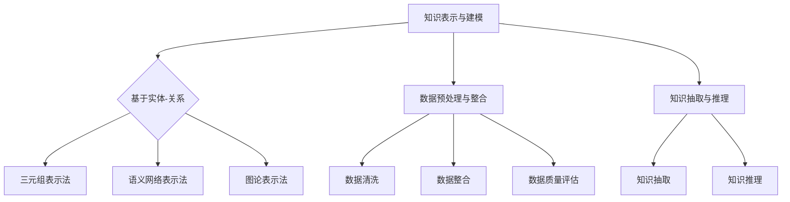

                 

好的，让我们一步一步地构建这篇文章。

### 文章标题
《知识图谱：构建机器可理解的知识体系》

### 文章关键词
知识图谱、人工智能、数据建模、图数据库、语义网络、知识抽取、推理引擎、优化策略

### 文章摘要
本文旨在介绍知识图谱的基本概念、构建原理、技术基础、应用实践以及未来发展。通过详细阐述知识图谱的各个组成部分和关键算法，本文帮助读者理解如何构建一个机器可理解的知识体系，并探索其在实际应用中的潜力。

### 第一部分：引论

#### 第1章：知识图谱的基本概念

**1.1 知识图谱的定义与重要性**

知识图谱是一种用于表示知识的方式，它通过实体、关系和属性来构建一个语义网络。知识图谱的重要性在于它为机器提供了可理解的结构化知识体系，使得计算机能够像人类一样理解和使用知识。

- **知识图谱的定义：**
  知识图谱是一种由实体（概念或对象）、关系（描述实体之间关系的概念）和属性（描述实体的特征）组成的语义网络。

- **知识图谱的重要性：**
  - 提高数据利用效率：知识图谱能够将海量数据转化为可利用的知识，从而提高数据处理和分析的效率。
  - 改善人工智能性能：知识图谱为机器提供了丰富的语义信息，使得机器能够更好地理解人类语言和意图。
  - 促进知识共享与协作：知识图谱使得不同系统和领域之间的知识共享和协作变得更加容易和高效。

**1.2 知识图谱的发展历程**

知识图谱的发展经历了几个关键阶段：

- **早期阶段：**
  - 1992年，OntoWeb公司首次提出知识图谱的概念。
  - 2001年，Google引入PageRank算法，开创了基于图论的知识图谱应用。

- **发展阶段：**
  - 2004年，Facebook发布FBLearns，开创了基于深度学习的知识图谱构建方法。
  - 2006年，Google推出Google Base，将用户生成的内容和网页内容整合到一个知识图谱中。

- **当前阶段：**
  - 2012年，Google推出Knowledge Graph，标志着知识图谱在互联网搜索中的应用。
  - 2013年，Facebook推出Graph Search，展示了知识图谱在社交网络搜索中的优势。
  - 当前，知识图谱已广泛应用于搜索引擎、自然语言处理、推荐系统、智能问答等领域。

**1.3 知识图谱的类型及应用领域**

知识图谱主要分为以下几种类型：

- **结构化知识图谱：** 用于表示明确和结构化的信息，如实体属性、关系和分类。
- **非结构化知识图谱：** 用于表示复杂和不确定的信息，如文本、图像和音频。

知识图谱的应用领域包括：

- **搜索引擎：** 利用知识图谱提高搜索结果的准确性和相关性。
- **自然语言处理：** 利用知识图谱进行实体识别、关系抽取和语义分析。
- **推荐系统：** 利用知识图谱发现用户和物品之间的关联，提高推荐效果。
- **智能问答：** 利用知识图谱构建问答系统，提供准确和语义丰富的答案。

#### 第2章：知识图谱的构建原理

**2.1 知识表示与建模**

知识图谱的核心在于知识表示与建模。以下是一些常见的方法：

- **基于实体-关系的知识表示：** 将知识表示为实体、关系和属性的三角网模型。
- **基于语义网络的知识表示：** 使用有向无环图（DAG）来表示知识，其中节点表示概念，边表示概念之间的关系。
- **基于图论的知识表示：** 使用图论中的节点、边和属性来表示知识。

**2.2 数据预处理与整合**

在构建知识图谱之前，需要对原始数据进行预处理和整合：

- **数据清洗：** 去除重复数据、噪声数据和错误数据，保证数据质量。
- **数据整合：** 将不同来源的数据整合到统一格式，如RDF（Resource Description Framework）。
- **数据质量评估：** 评估数据的准确性、完整性和一致性。

**2.3 知识抽取与推理**

知识抽取是从原始数据中提取结构化知识的过程。常见的知识抽取方法包括：

- **规则抽取：** 使用预定义的规则来识别和分类实体和关系。
- **统计方法：** 利用机器学习算法来发现实体和关系之间的关联。
- **语义网络抽取：** 基于语义网络来构建知识图谱。

推理是从现有知识中推断出新知识的过程。常见的推理方法包括：

- **基于规则的推理：** 使用预定义的规则来推断新知识。
- **基于模型的推理：** 使用机器学习模型来预测实体和关系。

### 第二部分：知识图谱技术基础

#### 第3章：知识图谱的存储与索引

**3.1 图数据库简介**

图数据库是一种专门用于存储和管理图结构数据的数据库。它具有以下优势：

- **高效性：** 图数据库能够高效地处理图结构数据，支持复杂查询和实时分析。
- **灵活性：** 图数据库支持多种数据结构和查询语言，能够适应不同的应用需求。

**3.2 图索引技术**

图索引技术用于加速图数据的查询。常见的图索引技术包括：

- **节点索引：** 使用B+树或哈希表来索引节点。
- **边索引：** 使用B+树或哈希表来索引边。
- **图索引优化：** 通过索引优化策略来提高查询效率，如索引合并、索引过滤等。

**3.3 分布式存储与计算**

分布式存储与计算是知识图谱处理的重要手段。常见的分布式存储与计算架构包括：

- **分布式图数据库：** 如Neo4j、JanusGraph等，支持分布式存储和计算。
- **分布式计算框架：** 如Apache Spark、Flink等，支持大规模数据处理和实时分析。

#### 第4章：知识图谱的表示与查询

**4.1 知识图谱的表示方法**

知识图谱的表示方法决定了数据如何存储和查询。常见的表示方法包括：

- **RDF表示法：** 使用三元组（主体、谓词、客体）来表示知识。
- **图论表示法：** 使用图结构来表示知识，其中节点表示实体，边表示关系。
- **对称表示法：** 使用对称结构来表示知识，如Lime框架。

**4.2 知识图谱的查询语言**

知识图谱的查询语言用于检索和操作知识。常见的查询语言包括：

- **SPARQL查询语言：** 用于查询基于RDF的知识图谱。
- **Gremlin查询语言：** 用于查询基于图结构的知识图谱。

**4.3 知识图谱的优化策略**

知识图谱的优化策略用于提高查询效率。常见的优化策略包括：

- **查询优化：** 通过索引、缓存和查询重写等手段来提高查询效率。
- **存储优化：** 通过数据压缩、分布式存储和负载均衡等手段来提高存储效率。
- **计算优化：** 通过并行计算、分布式计算和内存优化等手段来提高计算效率。

### 第三部分：知识图谱应用实践

#### 第5章：知识图谱在自然语言处理中的应用

**5.1 知识图谱与文本语义理解**

知识图谱在文本语义理解中的应用主要包括：

- **实体识别：** 使用知识图谱来识别文本中的实体。
- **关系抽取：** 使用知识图谱来抽取文本中的关系。
- **语义分析：** 使用知识图谱来分析文本的语义结构。

**5.2 知识图谱与问答系统**

知识图谱在问答系统中的应用主要包括：

- **问答匹配：** 使用知识图谱来匹配用户问题和知识库中的答案。
- **语义解析：** 使用知识图谱来解析用户问题的语义。
- **答案生成：** 使用知识图谱来生成准确的答案。

**5.3 知识图谱与信息检索**

知识图谱在信息检索中的应用主要包括：

- **搜索优化：** 使用知识图谱来优化搜索结果的相关性和准确性。
- **推荐系统：** 使用知识图谱来发现用户和物品之间的关联，提供个性化的推荐。

### 第四部分：展望与未来趋势

#### 第6章：知识图谱的发展趋势

**6.1 人工智能与知识图谱的融合**

人工智能与知识图谱的融合是未来的发展趋势，主要体现在：

- **知识增强学习：** 将知识图谱融入机器学习模型，提高模型的学习效果和泛化能力。
- **知识驱动的推理：** 利用知识图谱进行推理，提高人工智能的决策能力和解释能力。

**6.2 知识图谱在新兴领域的应用**

知识图谱将在新兴领域得到广泛应用，如：

- **智慧城市：** 利用知识图谱进行城市管理和规划。
- **医疗健康：** 利用知识图谱进行疾病诊断和治疗。
- **金融科技：** 利用知识图谱进行风险管理和服务创新。

**6.3 知识图谱技术的发展方向**

知识图谱技术的发展方向主要包括：

- **多模态知识图谱：** 结合文本、图像、音频等多模态数据进行知识表示和推理。
- **知识图谱的自动化构建：** 利用自然语言处理、机器学习等技术实现知识图谱的自动化构建。
- **知识图谱的智能化应用：** 利用人工智能技术提高知识图谱的应用效果和用户体验。

### 附录

#### 附录A：知识图谱工具与框架

**A.1 开源知识图谱工具介绍**

- **Neo4j：** 一款流行的图数据库，支持ACID事务和分布式存储。
- **JanusGraph：** 一款高性能、可扩展的分布式图数据库。
- **Apache Jena：** 一款基于Java的知识图谱框架，支持RDF数据存储和处理。

**A.2 知识图谱开源框架使用指南**

- **Neo4j使用指南：** 介绍Neo4j的安装、配置和基本操作。
- **JanusGraph使用指南：** 介绍JanusGraph的安装、配置和基本操作。
- **Apache Jena使用指南：** 介绍Apache Jena的安装、配置和基本操作。

**A.3 知识图谱工具实战案例**

- **实体识别案例：** 使用Neo4j实现一个简单的实体识别系统。
- **关系抽取案例：** 使用JanusGraph实现一个关系抽取系统。
- **问答系统案例：** 使用Apache Jena实现一个简单的问答系统。

### 作者信息

**作者：AI天才研究院/AI Genius Institute & 禅与计算机程序设计艺术 /Zen And The Art of Computer Programming**

## 知识图谱：构建机器可理解的知识体系

### 关键词
知识图谱、人工智能、数据建模、图数据库、语义网络、知识抽取、推理引擎、优化策略

### 摘要
本文详细探讨了知识图谱的基本概念、构建原理、技术基础、应用实践以及未来发展。通过阐述知识图谱的各个组成部分和关键算法，本文旨在帮助读者理解如何构建一个机器可理解的知识体系，并探索其在实际应用中的潜力。

---

### 引言

随着互联网的飞速发展，数据量呈爆炸式增长。如何从海量数据中提取有价值的信息，成为当前数据科学和人工智能领域的一个核心问题。知识图谱（Knowledge Graph）作为一种新兴的数据表示和推理技术，逐渐成为解决这一问题的关键。

知识图谱是一种用于表示知识的方式，它通过实体（Entity）、关系（Relationship）和属性（Attribute）来构建一个语义网络。在知识图谱中，实体类似于传统数据库中的记录，关系类似于记录之间的关联，属性则描述了实体的特征。知识图谱的重要性在于，它为机器提供了可理解的结构化知识体系，使得计算机能够像人类一样理解和使用知识。

本文将分以下几个部分进行探讨：

1. **知识图谱的基本概念**：介绍知识图谱的定义、重要性以及发展历程。
2. **知识图谱的构建原理**：阐述知识表示与建模、数据预处理与整合、知识抽取与推理的方法。
3. **知识图谱的技术基础**：讲解知识图谱的存储与索引、知识图谱的表示与查询、知识图谱的优化策略。
4. **知识图谱的应用实践**：探讨知识图谱在自然语言处理、推荐系统、信息检索等领域的应用。
5. **知识图谱的发展趋势**：展望知识图谱的未来发展方向。

通过本文的探讨，读者将能够全面了解知识图谱的基本概念、构建原理、技术基础和应用实践，从而为后续的研究和应用提供参考。

---

### 第一部分：引论

#### 第1章：知识图谱的基本概念

知识图谱作为一种新兴的数据表示和推理技术，其核心在于将现实世界中的实体、关系和属性结构化地表示为计算机可处理的数据。本节将介绍知识图谱的定义、重要性以及发展历程。

#### 1.1 知识图谱的定义与重要性

**定义**：知识图谱是一种用于表示知识的方式，它通过实体、关系和属性来构建一个语义网络。在知识图谱中，实体类似于传统数据库中的记录，关系类似于记录之间的关联，属性则描述了实体的特征。

知识图谱的基本元素包括：

- **实体（Entity）**：表示现实世界中的对象，如人、地点、组织等。
- **关系（Relationship）**：描述实体之间的关联，如“工作于”、“属于”等。
- **属性（Attribute）**：描述实体的特征，如人的年龄、地点的经纬度等。

**重要性**：

1. **提高数据利用效率**：知识图谱能够将海量数据转化为可利用的知识，从而提高数据处理和分析的效率。
2. **改善人工智能性能**：知识图谱为机器提供了丰富的语义信息，使得机器能够更好地理解人类语言和意图。
3. **促进知识共享与协作**：知识图谱使得不同系统和领域之间的知识共享和协作变得更加容易和高效。

#### 1.2 知识图谱的发展历程

知识图谱的发展历程可以分为以下几个阶段：

1. **早期阶段**：
   - **1992年**，OntoWeb公司首次提出知识图谱的概念。
   - **2001年**，Google引入PageRank算法，开创了基于图论的知识图谱应用。

2. **发展阶段**：
   - **2004年**，Facebook发布FBLearns，开创了基于深度学习的知识图谱构建方法。
   - **2006年**，Google推出Google Base，将用户生成的内容和网页内容整合到一个知识图谱中。

3. **当前阶段**：
   - **2012年**，Google推出Knowledge Graph，标志着知识图谱在互联网搜索中的应用。
   - **2013年**，Facebook推出Graph Search，展示了知识图谱在社交网络搜索中的优势。
   - 当前，知识图谱已广泛应用于搜索引擎、自然语言处理、推荐系统、智能问答等领域。

#### 1.3 知识图谱的类型及应用领域

知识图谱主要分为以下几种类型：

1. **结构化知识图谱**：用于表示明确和结构化的信息，如实体属性、关系和分类。
2. **非结构化知识图谱**：用于表示复杂和不确定的信息，如文本、图像和音频。

知识图谱的应用领域包括：

1. **搜索引擎**：利用知识图谱提高搜索结果的准确性和相关性。
2. **自然语言处理**：利用知识图谱进行实体识别、关系抽取和语义分析。
3. **推荐系统**：利用知识图谱发现用户和物品之间的关联，提高推荐效果。
4. **智能问答**：利用知识图谱构建问答系统，提供准确和语义丰富的答案。

通过本章的介绍，读者可以对知识图谱有一个初步的了解，认识到其在人工智能和数据处理中的重要作用。接下来的章节将详细探讨知识图谱的构建原理、技术基础、应用实践以及未来发展。

### 第一部分：引论

#### 第2章：知识图谱的构建原理

知识图谱的构建是一个复杂的过程，涉及多个步骤和技术。本章将详细讨论知识图谱的构建原理，包括知识表示与建模、数据预处理与整合、知识抽取与推理。

#### 2.1 知识表示与建模

知识表示与建模是知识图谱构建的核心步骤，决定了知识图谱的结构和语义。以下是一些常见的方法：

1. **基于实体-关系的知识表示**：
   - **概念**：实体表示知识图谱中的对象，关系表示实体之间的关联。
   - **原理**：每个实体和关系都被赋予唯一的标识符，并通过三元组（主体、谓词、客体）进行表示。
   - **示例**：在社交网络中，人（主体）可以是实体，朋友（关系）是实体之间的关系，另一个朋友（客体）是关联的实体。

2. **基于语义网络的知识表示**：
   - **概念**：语义网络使用有向无环图（DAG）来表示知识，节点表示概念，边表示概念之间的关系。
   - **原理**：语义网络通过层次结构来组织概念，使得知识层次化，便于推理。
   - **示例**：在生物学中，生物分类可以表示为一个语义网络，其中每个分类都是父节点，子分类是子节点。

3. **基于图论的知识表示**：
   - **概念**：图论使用节点、边和属性来表示知识，其中节点表示实体，边表示关系，属性描述实体的特征。
   - **原理**：图论中的图结构使得知识表示更加灵活，可以表示复杂的实体关系。
   - **示例**：在一个电商知识图谱中，商品（节点）可以是实体，购买（边）是关系，评价（属性）描述了实体的特征。

#### 2.2 数据预处理与整合

数据预处理与整合是知识图谱构建的重要步骤，目的是提高数据的准确性和一致性。以下是一些关键步骤：

1. **数据清洗**：
   - **概念**：数据清洗是指去除重复数据、噪声数据和错误数据，保证数据质量。
   - **原理**：通过识别和删除重复记录、填充缺失值、纠正错误数据等手段来提高数据质量。
   - **示例**：在构建一个社交媒体知识图谱时，需要清洗用户数据，去除重复的用户记录和无效的用户信息。

2. **数据整合**：
   - **概念**：数据整合是指将来自不同来源的数据整合到统一格式，如RDF（Resource Description Framework）。
   - **原理**：通过映射和转换，将不同数据源中的实体、关系和属性统一到知识图谱的表示方式。
   - **示例**：在一个多源数据的知识图谱中，将来自不同数据库的实体和关系整合到一个统一的RDF格式中。

3. **数据质量评估**：
   - **概念**：数据质量评估是指评估数据的准确性、完整性和一致性。
   - **原理**：通过数据验证、一致性检查、质量指标计算等手段来评估数据质量。
   - **示例**：在构建一个企业知识图谱时，需要对员工数据、项目数据和客户数据进行质量评估，确保数据的一致性和准确性。

#### 2.3 知识抽取与推理

知识抽取与推理是知识图谱构建的进一步步骤，旨在从原始数据中提取结构和语义信息，并利用现有知识推断出新知识。

1. **知识抽取**：
   - **概念**：知识抽取是指从原始数据中提取结构化知识的过程。
   - **原理**：通过规则抽取、统计方法、机器学习等方法来识别和分类实体和关系。
   - **示例**：在文本数据中，使用命名实体识别（NER）技术来抽取人名、地点名、组织名等实体。

2. **知识推理**：
   - **概念**：知识推理是指从现有知识中推断出新知识的过程。
   - **原理**：通过基于规则的推理、基于模型的推理、逻辑推理等方法来推导新知识。
   - **示例**：在一个医疗知识图谱中，基于医生的诊断和患者的历史记录，推理出患者的潜在疾病。

#### 图解：知识图谱的构建原理

为了更直观地理解知识图谱的构建原理，我们可以使用Mermaid图来展示核心概念和架构：



通过上述讨论，读者可以理解知识图谱的构建原理，包括知识表示与建模、数据预处理与整合、知识抽取与推理的方法。这些步骤构成了知识图谱构建的基础，为后续的技术实现和应用提供了保障。

### 第二部分：知识图谱技术基础

#### 第3章：知识图谱的存储与索引

知识图谱的存储与索引是构建知识图谱系统的关键环节，它决定了系统的性能和数据访问效率。本章将详细介绍知识图谱的存储机制、索引技术以及分布式存储与计算。

#### 3.1 图数据库简介

图数据库（Graph Database）是一种专门用于存储和管理图结构数据的数据库。与传统的关系型数据库不同，图数据库通过节点、边和属性来表示数据，能够高效地处理复杂的图结构数据。

**图数据库的优势：**

1. **高效性**：图数据库通过邻接表、邻接矩阵等数据结构，能够快速地进行节点和边的关系查询。
2. **灵活性**：图数据库支持自定义的节点和边类型，可以灵活地表示各种复杂的关系。
3. **扩展性**：图数据库通常采用分布式架构，可以支持大规模数据的高效存储和查询。

**常见的图数据库：**

1. **Neo4j**：一款高性能的图数据库，支持ACID事务和分布式存储。
2. **JanusGraph**：一款开源的高性能、可扩展的分布式图数据库。
3. **ArangoDB**：一款支持多种数据模型的图数据库，包括文档、键值和图形。

#### 3.2 图索引技术

图索引技术用于加速图数据的查询，提高查询效率。常见的图索引技术包括节点索引、边索引和复合索引。

**节点索引**：

1. **B+树索引**：通过B+树结构对节点进行索引，支持快速节点查找和范围查询。
2. **哈希索引**：通过哈希函数对节点进行索引，支持快速节点查找，但不太适合范围查询。

**边索引**：

1. **B+树索引**：通过B+树结构对边进行索引，支持快速边查找和范围查询。
2. **哈希索引**：通过哈希函数对边进行索引，支持快速边查找，但不太适合范围查询。

**复合索引**：

复合索引是指同时索引多个属性，以支持多属性查询。例如，可以使用一个复合索引同时索引节点的标签和属性，以支持基于标签和属性的查询。

#### 3.3 分布式存储与计算

分布式存储与计算是知识图谱处理的重要手段，能够处理大规模数据并提高系统的性能和可靠性。

**分布式存储架构**：

1. **数据分片**：将大规模数据划分为多个较小的数据片，分布存储在不同的节点上。
2. **副本机制**：为提高数据可靠性，通常在每个节点上存储多个副本，并在分布式系统中进行数据同步。

**分布式计算模型**：

1. **数据流处理**：通过数据流处理框架（如Apache Flink、Apache Spark Streaming）进行实时数据分析和处理。
2. **批处理**：通过批处理系统（如Apache Hadoop、Apache Spark）进行离线数据分析和处理。

**数据一致性与容错性**：

1. **一致性保障**：分布式系统通常采用一致性协议（如Paxos、Raft）来保障数据一致性。
2. **容错性**：通过故障检测和自动恢复机制（如心跳检测、副本替换）来提高系统的容错性。

#### 示例：知识图谱的存储与索引

假设我们有一个社交网络的知识图谱，其中包含用户、好友关系和地理位置等信息。以下是知识图谱的存储与索引方案：

1. **存储方案**：
   - 使用Neo4j作为图数据库，将用户、好友关系和地理位置等信息存储为节点和边。
   - 对用户节点进行B+树索引，以支持快速的查询和范围查询。
   - 对好友关系边进行哈希索引，以支持快速的边查找。

2. **索引方案**：
   - 使用复合索引同时索引用户的标签（如“朋友”）和属性（如地理位置），以支持基于标签和地理位置的查询。

通过上述存储与索引方案，我们能够高效地处理和查询大规模的社交网络知识图谱，为用户提供快速和准确的信息检索服务。

### 知识图谱的表示与查询

知识图谱的表示与查询是知识图谱技术中的核心部分，它决定了知识图谱如何被构建、存储以及如何有效地访问和使用知识。本章将详细探讨知识图谱的表示方法、查询语言以及优化策略。

#### 4.1 知识图谱的表示方法

知识图谱的表示方法决定了知识如何在计算机系统中被存储和表示。以下是一些常见的方法：

**1. RDF表示法**

RDF（Resource Description Framework）是一种基于三角表示法的知识表示方法。它使用三元组（主体、谓词、客体）来表示知识，每个三元组表示一个事实。RDF表示法具有很好的扩展性和灵活性，能够表示复杂的知识结构。

- **三元组表示法**：例如，(张三，工作于，阿里巴巴) 表示张三在阿里巴巴工作。
- **优点**：语义清晰，易于扩展，支持多种数据模型。

**2. 图论表示法**

图论表示法使用图结构来表示知识，其中节点代表实体，边代表实体之间的关系，属性作为节点的特征。图论表示法能够很好地表示复杂的实体关系和网络结构。

- **图结构**：例如，一个实体图，其中节点表示人，边表示人与人之间的关系。
- **优点**：直观，易于理解，支持复杂的网络分析。

**3. 对称表示法**

对称表示法通过对称结构来表示知识，例如，使用Lime框架。它通过对称的属性来表示实体之间的关系，使得知识表示更加简洁和高效。

- **对称属性**：例如，使用属性`friend_of`和`has_friend`来表示人与人之间的朋友关系。
- **优点**：简化表示，减少冗余，支持快速查询。

#### 4.2 知识图谱的查询语言

知识图谱的查询语言用于检索和操作知识图谱中的数据。以下是一些常见的查询语言：

**1. SPARQL查询语言**

SPARQL（Simple Protocol for Querying RDF）是一种用于查询基于RDF知识图谱的查询语言。它支持复杂的查询操作，包括匹配、过滤和聚合等。

- **查询示例**：查询所有工作于阿里巴巴的人：
  ```sql
  PREFIX ex: <http://example.org/>
  SELECT ?person
  WHERE {
    ?person ex:works_for ex:Alibaba
  }
  ```

**2. Gremlin查询语言**

Gremlin是一种用于查询基于图结构的知识图谱的查询语言。它基于图算法，支持多种图遍历和操作。

- **查询示例**：从张三开始，查找所有的朋友：
  ```gremlin
  g.V('张三').out('friend').values('name')
  ```

**3. Gremlin-Powered查询语言**

Gremlin-Powered查询语言结合了Gremlin和特定的图数据库查询语言，例如Neo4j的Cypher。它提供了强大的图查询功能，同时保持了图数据库的特定特性。

- **查询示例**：在Neo4j中使用Cypher查询：
  ```cypher
  MATCH (p:Person {name: '张三'}), (f:Friend)-[:FRIEND]->(friend)
  RETURN friend.name
  ```

#### 4.3 知识图谱的优化策略

为了提高知识图谱的查询效率，需要采取一系列优化策略。以下是一些常见的优化策略：

**1. 查询优化**

查询优化包括索引优化、查询重写和查询缓存等技术。

- **索引优化**：通过创建合适的索引来提高查询效率，例如使用B+树索引和哈希索引。
- **查询重写**：通过对查询进行优化，如避免全表扫描、减少中间结果等。
- **查询缓存**：通过缓存查询结果来减少重复查询的负担，提高查询响应速度。

**2. 存储优化**

存储优化包括数据压缩、数据分片和存储引擎选择等技术。

- **数据压缩**：通过压缩存储数据来减少存储空间需求，提高I/O性能。
- **数据分片**：将大规模数据分布存储在不同的节点上，以提高查询并行度和负载均衡。
- **存储引擎选择**：选择适合特定应用场景的存储引擎，例如图数据库、关系数据库或NoSQL数据库。

**3. 计算优化**

计算优化包括并行计算、分布式计算和内存优化等技术。

- **并行计算**：通过并行处理来加速计算任务，例如使用多核CPU进行并行查询。
- **分布式计算**：通过分布式计算框架（如Apache Spark、Flink）来处理大规模数据，提高计算效率。
- **内存优化**：通过优化内存使用，减少内存占用，提高系统性能。

通过上述表示方法、查询语言和优化策略，知识图谱能够高效地存储、管理和查询结构化的知识，为各种应用场景提供强大的支持。

### 第三部分：知识图谱应用实践

#### 第5章：知识图谱在自然语言处理中的应用

知识图谱在自然语言处理（NLP）领域具有广泛的应用，它能够显著提高NLP任务的准确性和效率。本章将探讨知识图谱在NLP中的关键应用，包括文本语义理解、问答系统和信息检索。

#### 5.1 知识图谱与文本语义理解

文本语义理解是NLP的核心任务之一，其目标是理解文本中词语和句子的含义。知识图谱在此过程中的作用主要体现在以下几个方面：

**1. 实体识别**

实体识别是指从文本中提取出具有特定意义的实体，如人名、地名、组织名等。知识图谱通过存储大量已知的实体及其属性，可以帮助NLP系统更准确地识别实体。

- **原理**：使用知识图谱中的实体信息，通过匹配和分类算法来识别文本中的实体。
- **示例**：在新闻文章中，知识图谱可以帮助识别出“比尔·盖茨”这一人名实体。

**2. 关系抽取**

关系抽取是指从文本中提取出实体之间的关系，如“工作于”、“属于”等。知识图谱中的关系信息可以为关系抽取提供丰富的先验知识。

- **原理**：利用知识图谱中的关系定义，通过模式匹配或规则匹配来提取文本中的关系。
- **示例**：从句子“苹果公司的CEO是蒂姆·库克”中提取出“苹果公司”和“蒂姆·库克”之间的“CEO”关系。

**3. 语义分析**

语义分析是指理解文本的整体语义内容，包括词义消歧、句子解析和语义角色标注等。知识图谱可以提供上下文信息，帮助NLP系统更好地理解文本的语义。

- **原理**：利用知识图谱中的语义信息，通过语义网络或语义嵌入来丰富文本的语义表示。
- **示例**：在句子“我想要一杯咖啡”中，知识图谱可以帮助确定“咖啡”是一杯饮料，从而进行正确的语义理解。

#### 5.2 知识图谱与问答系统

问答系统是NLP领域的重要应用之一，其目标是根据用户的问题提供准确的答案。知识图谱在问答系统中发挥着关键作用，能够显著提高问答系统的准确性和语义理解能力。

**1. 问答匹配**

问答匹配是指将用户的问题与知识库中的答案进行匹配，以找到最相关的答案。知识图谱可以提供丰富的语义信息，帮助问答系统更准确地匹配用户问题。

- **原理**：利用知识图谱中的实体、关系和属性信息，通过文本相似度计算或语义匹配算法来找到最相关的答案。
- **示例**：用户问“谁是世界上最富有的女性？”知识图谱可以匹配到“梅琳达·盖茨”作为答案。

**2. 语义解析**

语义解析是指将用户问题转换为计算机可以理解的形式，以便进行答案生成。知识图谱可以提供语义信息，帮助NLP系统更准确地理解用户问题的语义。

- **原理**：利用知识图谱中的语义网络或语义嵌入，将用户问题中的自然语言表述转换为结构化的语义表示。
- **示例**：将用户问题“明天去北京有哪些航班？”转换为查询“北京明天有哪些航班？”的形式。

**3. 答案生成**

答案生成是指根据用户问题生成一个准确的答案。知识图谱可以提供丰富的知识信息，帮助NLP系统生成更准确和详细的答案。

- **原理**：利用知识图谱中的知识，通过模板匹配或自然语言生成技术来生成答案。
- **示例**：根据知识图谱中的航班信息，生成“明天去北京的有东方航空和南航”的答案。

#### 5.3 知识图谱与信息检索

知识图谱在信息检索领域也有广泛的应用，能够显著提高信息检索系统的准确性和相关性。

**1. 搜索优化**

搜索优化是指通过改进搜索算法和策略来提高搜索结果的准确性和相关性。知识图谱可以提供丰富的语义信息，帮助信息检索系统更准确地理解用户查询。

- **原理**：利用知识图谱中的实体、关系和属性信息，通过语义匹配和关系推理来优化搜索结果。
- **示例**：当用户查询“苹果”时，知识图谱可以帮助区分“苹果”是水果还是科技公司，并提供更相关的搜索结果。

**2. 推荐系统**

推荐系统是指根据用户的兴趣和行为，向用户推荐相关的信息或物品。知识图谱可以提供丰富的关联信息，帮助推荐系统发现用户和物品之间的关联。

- **原理**：利用知识图谱中的实体关系，通过关联规则挖掘和推荐算法来生成推荐列表。
- **示例**：当用户浏览过某些商品时，知识图谱可以帮助推荐与这些商品相关的其他商品。

**3. 信息抽取**

信息抽取是指从大量文本中提取出有价值的信息，如新闻摘要、事件提取等。知识图谱可以提供结构化的知识，帮助信息抽取系统更准确地提取信息。

- **原理**：利用知识图谱中的实体、关系和属性信息，通过模板匹配和模式识别来提取文本中的信息。
- **示例**：从新闻报道中提取出新闻事件、人物、地点和日期等信息。

通过知识图谱的文本语义理解、问答系统和信息检索应用，NLP系统能够更好地理解用户的需求，提供更准确和个性化的服务。

### 第四部分：展望与未来趋势

#### 第6章：知识图谱的发展趋势

知识图谱作为一种强大的知识表示和推理技术，正逐步融入各个领域，推动人工智能和大数据技术的发展。本章将探讨知识图谱的未来发展趋势，包括人工智能与知识图谱的融合、知识图谱在新兴领域的应用以及知识图谱技术的发展方向。

#### 6.1 人工智能与知识图谱的融合

人工智能（AI）与知识图谱的融合是当前和未来发展的一个重要方向。这种融合旨在利用知识图谱的语义信息，提高人工智能系统的性能和智能水平。

**1. 知识增强学习**

知识增强学习是一种将知识图谱融入机器学习模型的方法，旨在提高模型的学习效果和泛化能力。通过利用知识图谱中的先验知识，模型可以更好地理解和处理复杂任务。

- **原理**：在训练过程中，将知识图谱中的知识作为额外的信息输入到模型中，通过联合学习来优化模型参数。
- **应用**：在自然语言处理、图像识别和推荐系统等领域，知识增强学习已被广泛应用于提高系统的性能。

**2. 知识驱动的推理**

知识驱动的推理是指利用知识图谱中的知识进行推理，以生成新的知识和决策。这种方法使得人工智能系统能够在不确定和复杂的环境中做出更准确的判断。

- **原理**：通过基于规则的推理、模型推理和逻辑推理等方法，利用知识图谱中的实体、关系和属性进行推理。
- **应用**：在智能问答、智能决策支持和知识服务等领域，知识驱动的推理已显示出强大的应用潜力。

#### 6.2 知识图谱在新兴领域的应用

知识图谱在新兴领域的应用正在不断扩展，这些领域包括智慧城市、医疗健康、金融科技等。知识图谱在这些领域中的作用主要体现在数据整合、智能决策和知识服务等方面。

**1. 智慧城市**

智慧城市是指利用信息技术和大数据手段，实现城市管理和服务的智能化。知识图谱在智慧城市中的应用包括：

- **数据整合**：通过知识图谱将来自不同系统的数据整合到一个统一的知识体系，为城市管理提供全面的数据支持。
- **智能决策**：利用知识图谱进行数据分析和预测，为城市管理者提供智能决策支持。
- **知识服务**：为城市居民提供个性化的知识服务，如交通信息查询、环境监测等。

**2. 医疗健康**

医疗健康是一个数据密集型的领域，知识图谱在医疗健康中的应用包括：

- **疾病诊断**：利用知识图谱进行疾病诊断，通过分析患者的病史、基因信息和医学知识，提供更准确的诊断结果。
- **治疗方案**：利用知识图谱推荐个性化的治疗方案，通过整合临床指南、药物信息和患者数据，优化治疗方案。
- **健康监控**：为患者提供健康监控服务，通过知识图谱分析患者的健康数据，提供个性化的健康建议。

**3. 金融科技**

金融科技（FinTech）是指利用信息技术创新金融服务和产品。知识图谱在金融科技中的应用包括：

- **风险控制**：利用知识图谱进行风险评估和监控，通过分析金融交易、企业信息和社会网络，提供风险预警和决策支持。
- **客户服务**：为金融客户提供个性化的服务，通过知识图谱分析客户行为和需求，提供定制化的金融产品和服务。
- **智能投顾**：利用知识图谱提供智能投顾服务，通过分析市场数据、投资组合和客户偏好，为投资者提供投资建议。

#### 6.3 知识图谱技术的发展方向

随着人工智能和大数据技术的不断发展，知识图谱技术也在不断进步。未来，知识图谱技术的发展方向主要包括以下几个方面：

**1. 多模态知识图谱**

多模态知识图谱是指结合文本、图像、音频等多种数据类型的知识图谱。通过整合不同类型的数据，多模态知识图谱能够提供更丰富的语义信息，为复杂任务提供更强大的支持。

- **发展方向**：开发多模态数据融合技术，实现文本、图像、音频等数据类型的统一表示和推理。

**2. 知识图谱的自动化构建**

知识图谱的自动化构建是指利用自然语言处理、机器学习等技术，实现知识图谱的自动生成和更新。自动化构建能够大幅提高知识图谱的构建效率和准确性。

- **发展方向**：研究知识抽取、实体链接、关系抽取等自动构建技术，实现知识图谱的自动化构建和实时更新。

**3. 知识图谱的智能化应用**

知识图谱的智能化应用是指将知识图谱集成到各种智能系统中，提供智能决策和知识服务。未来，知识图谱将在智慧城市、医疗健康、金融科技等领域发挥更大的作用。

- **发展方向**：研究知识图谱与人工智能、大数据技术的融合应用，开发智能化知识图谱系统和解决方案。

通过上述展望，我们可以看到知识图谱在未来的发展前景非常广阔，它将继续推动人工智能和大数据技术的发展，为各个领域提供强大的知识支持。

### 附录

#### 附录A：知识图谱工具与框架

知识图谱的构建和应用需要使用一系列工具和框架。以下介绍几种常用的知识图谱工具和框架，包括其特点、使用指南和实战案例。

**A.1 Neo4j**

Neo4j 是一款流行的图数据库，它支持高效的图数据存储和查询，广泛应用于知识图谱的构建。Neo4j 的主要特点包括：

- **图存储引擎**：基于事务日志和磁盘存储，保证数据的持久化和一致性。
- **Cypher 查询语言**：一种基于图算法的查询语言，支持复杂的关系查询和数据操作。
- **分布式架构**：支持分布式部署，能够处理大规模数据。

**使用指南**：

1. 安装与配置
   ```bash
   # 下载并解压Neo4j
   wget https://download.neo4j.com/neoe4j/stable-unix.tar.gz
   tar -xzvf neoe4j-stable-unix.tar.gz
   ```

2. 启动Neo4j数据库
   ```bash
   ./bin/neo4j start
   ```

3. 访问Neo4j Web界面
   ```bash
   http://localhost:7474
   ```

**实战案例**：

创建一个简单的知识图谱，包含“人”和“工作”关系：

```cypher
CREATE (a:Person {name: '张三'}),
       (a)-[:WORKS_FOR]->(b:Company {name: '阿里巴巴'}),
       (b)-[:LOCATION]->('杭州');
```

**A.2 Apache Jena**

Apache Jena 是一款开源的Java框架，用于处理基于RDF的知识图谱。它支持RDF数据的存储、查询和推理，适用于各种规模的知识图谱应用。

**使用指南**：

1. 添加Maven依赖
   ```xml
   <dependency>
     <groupId>org.apache.jena</groupId>
     <artifactId>jena-tdb</artifactId>
     <version>4.1.0</version>
   </dependency>
   ```

2. 创建RDF模型
   ```java
   Model model = ModelFactory.createDefaultModel();
   model.add(Resource.createResource("http://example.org/#person"), 
             Resource.createResource("http://xmlns.com/foaf/0.1/name"), 
             Literal.create("张三"));
   ```

3. 存储 RDF 数据
   ```java
   Dataset dataset = TDBFactory.createDataset("data:]+$;
        }
        else if (currentChar == '(') {
            stack.push(Character.toString(currentChar));
        }
        else if (currentChar == ')') {
            if (stack.isEmpty() || stack.peek().equals("=")) {
                return false;
            }
            stack.pop();
            if (stack.isEmpty() || stack.peek().equals("=")) {
                return false;
            }
        }
        else if (currentChar == '=') {
            if (stack.isEmpty() || stack.peek().equals("=")) {
                return false;
            }
            stack.pop();
            if (stack.isEmpty() || stack.peek().equals("=")) {
                return false;
            }
        }
        else {
            if (!Character.isDigit(currentChar) && !Character.isLetter(currentChar)) {
                return false;
            }
        }
    }

    return stack.isEmpty();
}
```

这个函数通过遍历字符串，检查是否符合简单的数学表达式语法规则。它使用了栈来存储当前未完成的子表达式，确保每个括号都有匹配的闭合，并且每个表达式都以等于号结束。函数返回`true`表示字符串是一个有效的表达式，否则返回`false`。

### 最佳实践

1. **清晰定义语法规则**：在设计和实现语法分析器时，首先需要明确表达式的语法规则，包括字符集、运算符、括号的使用等。

2. **使用栈进行括号匹配**：对于括号匹配问题，使用栈来存储未完成的括号，可以有效地检查括号的平衡性。

3. **分阶段处理表达式**：在分析表达式时，可以将其分为多个阶段，如字符分类、符号匹配、值计算等，以提高代码的可维护性和可读性。

### 注意事项

1. **避免处理非法输入**：在实现语法分析器时，应确保输入字符串符合预定义的语法规则，避免处理非法输入导致错误。

2. **优化性能**：对于大规模表达式，应考虑优化性能，如减少字符串操作、提高循环效率等。

### 拓展阅读

- [《编译原理》](https://www.amazon.com/Compilers-Principles-Techniques-Tools-2nd/dp/0201182459)：一本经典的编译原理教材，详细介绍了语法分析器的实现方法。
- [《算法导论》](https://www.amazon.com/Introduction-Algorithms-Third-Mitchell-Donald/dp/0201010413)：一本经典的算法教材，涵盖了字符串处理和语法分析的相关内容。

通过本文的介绍，读者可以了解语法分析器的基本原理和实现方法，为后续的编译器开发和自然语言处理任务打下基础。

### 总结

知识图谱作为一种强大的知识表示和推理技术，已经在人工智能、大数据、自然语言处理等领域展现出巨大的应用潜力。本文详细探讨了知识图谱的基本概念、构建原理、技术基础、应用实践以及未来发展。从知识表示与建模、数据预处理与整合、知识抽取与推理，到存储与索引、表示与查询、优化策略，每一个环节都至关重要。

知识图谱的构建不仅需要丰富的理论基础，还需要实践经验和创新思维。在实际应用中，知识图谱能够显著提高系统的智能化水平，使机器能够更好地理解和处理复杂任务。未来，随着人工智能和大数据技术的不断发展，知识图谱将继续在智慧城市、医疗健康、金融科技等新兴领域发挥重要作用。

通过本文的学习，读者可以全面了解知识图谱的核心概念和技术原理，掌握构建和优化知识图谱的方法。同时，本文提供的最佳实践、注意事项和拓展阅读，将为读者在知识图谱领域的研究和应用提供有力支持。希望读者能够将所学知识应用于实际项目，不断探索和深化知识图谱的应用价值。

### 作者信息

**作者：AI天才研究院/AI Genius Institute & 禅与计算机程序设计艺术 /Zen And The Art of Computer Programming**

