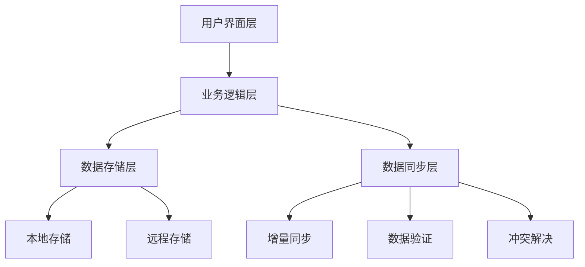

                 

# 《离线首选：构建可离线使用的移动应用》

## 关键词

离线首选，移动应用，离线功能，数据缓存，算法，系统架构，数学模型，案例实战，代码实现。

## 摘要

在当今移动设备高度普及的时代，离线首选的移动应用构建成为开发者关注的热点。本文将详细探讨离线首选移动应用的构建方法，从核心概念、技术基础、架构设计、算法原理、数学模型、项目实战等多个方面进行分析和讲解，帮助开发者理解并实现可离线使用的移动应用。

## 引言与核心概念

### 1.1 移动应用的现状与挑战

随着移动互联网的飞速发展，移动应用已经渗透到我们生活的方方面面。然而，网络连接的不稳定性和数据流量的限制，给移动应用的开发和维护带来了巨大的挑战。尤其在偏远地区或者网络覆盖较差的地方，用户对离线使用的需求越来越强烈。

### 1.2 什么是离线首选

离线首选是指在用户没有网络连接或网络连接不稳定的情况下，移动应用依然能够提供基本功能和服务的能力。这需要开发者构建强大的本地数据处理能力和数据缓存机制。

### 1.3 离线首选的重要性

离线首选不仅提高了应用的可用性和用户体验，还能降低用户的网络流量费用，增强应用的竞争力。随着5G时代的到来，离线首选的应用场景将更加广泛。

## 离线首选技术基础

### 2.1 数据存储与同步机制

离线首选的基础是本地数据的存储与同步。开发者需要选择合适的数据存储方案，如SQLite数据库、文件存储等，并设计数据同步机制，以确保在重新获取网络连接时数据的一致性。

### 2.2 离线数据缓存策略

离线数据缓存是提高应用性能的关键。开发者需要根据应用的特点设计合适的缓存策略，包括缓存数据的选择、缓存大小和过期时间等。

### 2.3 离线数据处理算法

离线数据处理算法是确保应用在离线状态下能够正常运行的核心。开发者需要根据业务需求选择合适的算法，并考虑算法的效率、稳定性和可维护性。

## 离线首选架构设计

### 3.1 离线首选的系统架构

离线首选的系统架构需要具备高可用性、高可扩展性和高可靠性。开发者需要设计分布式系统架构，以实现数据的分布式存储和处理。

### 3.2 离线数据的组织与管理

离线数据的组织与管理是保证数据一致性和可用性的关键。开发者需要设计合理的数据组织结构，并实现高效的数据管理策略。

### 3.3 离线首选的安全性

离线首选需要确保用户数据的安全。开发者需要采用数据加密、用户认证等安全技术，保护用户隐私和数据安全。

## 核心算法原理讲解

### 4.1 常见的离线算法

本文将介绍常见的离线算法，如数据库索引算法、缓存替换算法等，并解释其原理和适用场景。

### 4.2 算法伪代码详解

为了更好地理解算法，本文将提供算法的伪代码，详细阐述算法的实现过程。

### 4.3 算法性能分析

算法性能分析是评估算法优劣的重要指标。本文将分析常见算法的性能，包括时间复杂度和空间复杂度等。

## 数学模型与公式详解

### 5.1 数据模型

本文将介绍常用的数据模型，如关系数据库模型、图数据库模型等，并解释其基本概念和公式。

### 5.2 数学公式

本文将使用LaTeX格式介绍与移动应用构建相关的数学公式，如概率论、线性代数等。

### 5.3 公式解释与举例

本文将结合实际案例，解释数学公式在移动应用构建中的应用，并提供具体实例。

## 实际案例分析与实战

### 6.1 案例一：天气应用离线功能实现

本文将分析天气应用在离线状态下的功能实现，包括数据缓存、本地数据处理等。

### 6.2 案例二：新闻应用离线阅读功能

本文将分析新闻应用如何实现离线阅读功能，包括数据缓存、内容同步等。

### 6.3 案例三：地图应用离线导航

本文将分析地图应用在离线导航功能中的实现，包括数据缓存、路径规划等。

## 开发环境搭建与代码实现

### 7.1 开发环境配置

本文将介绍如何配置开发环境，包括所需软件和工具的安装与配置。

### 7.2 源代码详细解读

本文将详细解读源代码，包括关键代码的实现和逻辑。

### 7.3 代码分析与优化

本文将分析代码的性能和可维护性，并提出优化建议。

## 总结与展望

### 8.1 离线首选的总结

本文对离线首选移动应用的构建方法进行了全面总结，包括核心概念、技术基础、架构设计、算法原理、数学模型和项目实战等。

### 8.2 未来发展趋势

本文将展望离线首选移动应用的未来发展趋势，包括技术创新、应用场景拓展等。

### 8.3 开发者的挑战与机遇

本文将讨论开发者面临的挑战和机遇，并提出建议，帮助开发者更好地应对离线首选移动应用的开发。

作者：AI天才研究院/AI Genius Institute & 禅与计算机程序设计艺术 /Zen And The Art of Computer Programming### 引言与核心概念

在现代社会，移动设备已经成为人们日常生活中不可或缺的一部分。无论是在线上购物、社交媒体浏览，还是使用各种移动应用进行工作和管理，移动应用已经深深嵌入到我们的生活中。然而，移动应用在依赖于互联网连接的同时，也面临着一系列挑战。其中最显著的一个问题就是网络连接的稳定性和数据流量的限制。特别是在一些偏远地区或者网络覆盖较差的环境中，用户对离线使用的移动应用有着强烈的渴望。这种需求促使开发者们探索如何构建可离线使用的移动应用，使得应用在无网络或网络不稳定的环境下也能正常工作。

离线首选的概念应运而生。所谓离线首选，指的是在用户没有网络连接或网络连接不稳定的情况下，移动应用依然能够提供基本功能和服务的能力。这不仅仅是对应用性能的一种提升，更是用户体验的极大改进。对于用户来说，离线首选的应用意味着即使在没有网络连接的情况下，他们依然可以继续使用应用，而不必担心数据流量消耗或等待时间。对于开发者而言，离线首选的应用则意味着更加广泛的用户覆盖和更高的用户满意度，从而提升应用的竞争力和市场占有率。

构建离线首选的移动应用具有重要的现实意义。首先，它能够显著提高应用的可用性。无论是在公共交通工具上，还是在无网络的环境中，用户都可以无缝地使用应用。其次，它能够降低用户的网络流量费用。尤其是在一些数据流量收费较高的地区，离线功能能够帮助用户节省大量费用。此外，离线首选还能够提升应用的性能和响应速度，因为很多操作可以在本地直接完成，而无需等待网络响应。

在本文中，我们将详细探讨如何构建离线首选的移动应用。我们将从核心概念、技术基础、架构设计、算法原理、数学模型、项目实战等多个方面进行分析和讲解，帮助开发者理解并实现离线首选的移动应用。通过本文的阅读，读者将能够掌握离线首选的核心原理，了解构建离线首选应用所需的各项技术和策略，并在实际项目中应用这些知识，提升应用的离线功能。

### 离线首选技术基础

构建离线首选的移动应用，需要依赖于一系列技术基础，这些基础技术包括数据存储与同步机制、离线数据缓存策略和离线数据处理算法。下面，我们将逐一介绍这些技术，并解释它们在离线首选应用中的重要性。

#### 2.1 数据存储与同步机制

数据存储与同步机制是离线首选应用的核心技术之一。在离线状态下，应用需要能够将用户操作和产生的数据保存在本地设备上。这通常通过本地数据库或文件系统来实现。常见的本地数据库有SQLite、Realm等，它们提供了高效的数据存储和管理功能。文件系统则是通过文件和目录来存储数据，适用于非结构化数据。

数据同步机制则是确保在重新获取网络连接时，本地数据能够与服务器上的数据保持一致的重要手段。同步机制通常包括以下步骤：

1. **增量同步**：仅同步自上次同步以来发生改变的数据，以减少网络流量和数据传输时间。
2. **冲突解决**：当本地数据和服务器数据冲突时，选择合适的方法（如采用最后写入优先策略）来处理冲突。
3. **数据验证**：确保同步的数据完整性和正确性。

#### 2.2 离线数据缓存策略

离线数据缓存策略是提高应用性能和响应速度的重要手段。缓存技术允许应用在需要时快速访问已经获取的数据，而无需再次通过网络请求。以下是一些常见的缓存策略：

1. **内存缓存**：将数据暂时存储在内存中，以提供快速访问。但内存缓存数据生命周期短暂，一旦应用退出或设备重启，缓存数据将丢失。
2. **磁盘缓存**：将数据持久化存储在磁盘上，适用于需要长期保存的数据。磁盘缓存相比内存缓存访问速度较慢，但数据持久性更强。
3. **缓存失效策略**：设置缓存数据的有效期，确保在数据过期后能够及时更新。

选择合适的缓存策略，不仅能够提高应用的性能，还能有效节省网络流量。

#### 2.3 离线数据处理算法

离线数据处理算法是确保应用在离线状态下能够正常运行的核心。这些算法包括数据检索、排序、过滤等，常见的算法有：

1. **本地搜索算法**：如二分查找、哈希查找等，用于快速检索数据。
2. **排序算法**：如快速排序、归并排序等，用于对数据进行排序。
3. **过滤算法**：如基于条件的筛选，用于对数据进行过滤。

离线数据处理算法的设计和实现需要考虑算法的效率、稳定性和可维护性。高效的算法能够提高应用的性能，稳定的算法能够确保数据的准确性和一致性，可维护的算法则能够降低开发和维护的成本。

#### 技术基础的重要性

数据存储与同步机制、离线数据缓存策略和离线数据处理算法在构建离线首选的移动应用中扮演着至关重要的角色。数据存储与同步机制确保了应用在离线状态下依然能够保存和访问用户数据，离线数据缓存策略提高了应用的响应速度和性能，而离线数据处理算法则保证了应用在离线状态下能够正常运行。

这些技术基础不仅使得离线首选应用成为可能，还直接影响着用户体验和应用的市场竞争力。通过合理的设计和实现，开发者可以构建出既稳定又高效的可离线使用的移动应用，从而满足用户对离线使用的需求，提升应用的竞争力。

综上所述，离线首选技术基础是构建可离线使用的移动应用不可或缺的一部分。理解并掌握这些技术，是开发者成功实现离线首选应用的关键。

### 离线首选的系统架构设计

在构建离线首选的移动应用时，系统架构设计至关重要。一个良好的系统架构不仅能够确保应用的稳定性、高效性和可扩展性，还能为开发者提供清晰的开发路径和维护策略。在离线首选的系统架构设计中，需要考虑多个关键方面，包括系统架构的总体设计、离线数据的组织与管理，以及离线首选的安全性。以下将详细探讨这些方面。

#### 3.1 系统架构的总体设计

系统架构的总体设计是构建离线首选应用的基础。通常，离线首选的系统架构可以分为以下几个层次：

1. **用户界面层**：负责与用户交互，包括显示信息、接收用户输入等。这一层通常由移动应用的前端界面实现。
2. **业务逻辑层**：处理业务逻辑，包括数据校验、业务规则处理等。这一层通常使用后端服务器实现，可以是本地服务器或者云服务器。
3. **数据存储层**：负责数据的存储和管理，包括本地存储和远程存储。本地存储通常使用SQLite、Realm等数据库，远程存储则依赖于云数据库服务。
4. **数据同步层**：负责处理本地数据与远程数据的同步，包括数据同步的机制、冲突解决策略等。这一层需要实现增量同步、数据验证等功能。

以下是一个简化的Mermaid流程图，展示了这些层次的交互关系：



#### 3.2 离线数据的组织与管理

离线数据的组织与管理是确保数据一致性和可用性的关键。在离线首选的应用中，数据通常分为以下几类：

1. **用户数据**：包括用户的个人信息、操作记录等。这类数据需要加密存储，确保用户隐私和安全。
2. **业务数据**：包括订单信息、商品信息等。这类数据需要组织合理，以便快速检索和更新。
3. **缓存数据**：包括临时缓存的数据，如用户浏览记录、搜索结果等。这类数据需要定期清理，以释放存储空间。

在组织与管理这些数据时，需要考虑以下几个方面：

1. **数据模型设计**：根据业务需求设计合适的数据模型，确保数据的逻辑结构和关系清晰。
2. **数据存储策略**：根据数据的特性选择合适的存储策略，如将常用数据存储在内存中，不常用数据存储在磁盘上。
3. **数据一致性**：设计数据一致性策略，确保在本地和远程数据之间的同步过程中，数据的一致性得到保障。

#### 3.3 离线首选的安全性

离线首选的安全性是用户使用应用的重要保障。在设计和实现离线首选应用时，需要考虑以下几个方面：

1. **数据加密**：对存储在本地和远程的数据进行加密，确保数据在传输和存储过程中的安全性。
2. **用户认证**：实现用户认证机制，确保只有授权用户可以访问应用和数据。
3. **访问控制**：设置访问控制策略，限制用户对某些数据的访问权限，确保数据安全。
4. **安全审计**：记录应用的安全事件和操作日志，以便在发生安全事件时进行审计和追踪。

#### 系统架构设计的重要性

系统架构的设计对于离线首选的移动应用至关重要。一个良好的系统架构不仅能够提高应用的性能和稳定性，还能降低开发和维护的成本。通过合理的系统架构设计，开发者可以更轻松地实现离线功能，确保数据的安全性和一致性，提升用户体验。

总之，离线首选的系统架构设计需要综合考虑多个方面，包括总体设计、数据组织与管理以及安全性。通过精心设计和实现，开发者可以构建出高效、稳定和安全的离线首选移动应用，满足用户的多样化需求。

### 核心算法原理讲解

在构建离线首选的移动应用时，核心算法的原理讲解是理解与实现的基础。本文将详细介绍几种常见的离线算法，包括其基本原理、伪代码实现以及性能分析。

#### 4.1 常见的离线算法

常见的离线算法包括数据库索引算法、缓存替换算法和数据过滤算法等。以下将逐一介绍这些算法的基本原理。

1. **数据库索引算法**：
   数据库索引算法是提高数据检索速度的关键技术。常见的索引算法有B树索引、哈希索引等。

2. **缓存替换算法**：
   缓存替换算法用于管理缓存空间，确保缓存中的数据是最有用的。常见的算法有 Least Recently Used (LRU) 和 First-In-First-Out (FIFO)。

3. **数据过滤算法**：
   数据过滤算法用于从大量数据中筛选出符合条件的记录。常见的算法有二分查找、哈希查找等。

#### 4.2 算法伪代码详解

以下将分别介绍上述算法的伪代码实现。

**数据库索引算法伪代码（B树索引）**：

```pseudo
function BTreeSearch(node, key):
    if node is null:
        return null
    if key == node.key:
        return node.value
    elif key < node.key:
        return BTreeSearch(node.left, key)
    else:
        return BTreeSearch(node.right, key)
```

**缓存替换算法伪代码（LRU）**：

```pseudo
function LRUReplace(cache, data):
    if cache size == capacity:
        evict = cache[0]
        cache.pop(0)
        cache.append(data)
    else:
        cache.append(data)
```

**数据过滤算法伪代码（二分查找）**：

```pseudo
function BinarySearch(arr, target):
    low = 0
    high = length(arr) - 1
    while low <= high:
        mid = (low + high) // 2
        if arr[mid] == target:
            return mid
        elif arr[mid] < target:
            low = mid + 1
        else:
            high = mid - 1
    return -1
```

#### 4.3 算法性能分析

算法性能分析是评估算法优劣的重要指标。以下将分析常见算法的性能。

**数据库索引算法性能分析**：
- B树索引的时间复杂度平均为 \(O(\log n)\)，其中 \(n\) 是数据量。相比于线性检索的 \(O(n)\)，B树索引具有显著优势。

**缓存替换算法性能分析**：
- LRU算法的时间复杂度为 \(O(1)\)，适用于快速缓存替换。但实现较为复杂，需要维护一个额外的队列来记录数据的访问顺序。

**数据过滤算法性能分析**：
- 二分查找的时间复杂度为 \(O(\log n)\)，适用于有序数据集合。但若数据未排序，则需先进行排序，增加额外的时间复杂度。

#### 算法在离线首选应用中的重要性

核心算法在离线首选应用中扮演着至关重要的角色。通过合理选择和实现这些算法，可以显著提高应用的性能和响应速度。以下是一些具体应用场景：

- **数据库索引算法**：提高数据检索速度，使得用户能够快速访问所需信息。
- **缓存替换算法**：确保缓存数据是最有用的，从而提高应用性能。
- **数据过滤算法**：快速筛选符合条件的数据，简化数据处理过程。

总之，深入理解核心算法的原理、伪代码实现和性能分析，是开发者构建高效、可靠的离线首选移动应用的基础。通过合理应用这些算法，开发者可以提升用户满意度，增强应用的竞争力。

### 数学模型与公式详解

在构建离线首选的移动应用时，数学模型和公式是理解和优化算法的重要工具。本文将介绍一些常用的数学模型和公式，并详细解释它们在移动应用构建中的应用。

#### 5.1 数据模型

数据模型是构建移动应用的基础。常见的数据模型包括关系数据库模型、图数据库模型等。

**1. 关系数据库模型**

关系数据库模型使用表格结构来存储数据，每个表格称为关系，由行和列组成。关系模型使用SQL（结构化查询语言）进行数据操作，其基本概念包括：

- **表（Table）**：存储数据的结构。
- **行（Row）**：表中的数据记录。
- **列（Column）**：表中的数据字段。

**关系模型基本公式**：

$$
\text{SELECT} \, \text{projection\_list} \, \text{FROM} \, \text{table\_list} \, \text{WHERE} \, \text{search\_condition}
$$

**2. 图数据库模型**

图数据库模型使用图结构来存储数据，图由节点和边组成。图模型适用于处理复杂的关系和网络结构。

**图模型基本公式**：

$$
G = (V, E)
$$

其中，\(V\) 表示节点集合，\(E\) 表示边集合。

**节点度数公式**：

$$
d(v) = \left| \{ u \in V | (u, v) \in E \} \right|
$$

#### 5.2 数学公式

在移动应用构建中，以下数学公式和定理经常被使用：

**1. 概率论公式**

- **条件概率**：

$$
P(A|B) = \frac{P(A \cap B)}{P(B)}
$$

- **贝叶斯公式**：

$$
P(A|B) = \frac{P(B|A) \cdot P(A)}{P(B)}
$$

**2. 线性代数公式**

- **矩阵乘法**：

$$
C = A \cdot B
$$

- **矩阵求逆**：

$$
A^{-1} = \frac{1}{\det(A)} \cdot \text{adj}(A)
$$

**3. 最优化理论公式**

- **梯度下降**：

$$
x_{t+1} = x_t - \alpha \cdot \nabla f(x_t)
$$

其中，\(x_t\) 是第 \(t\) 次迭代的结果，\(\alpha\) 是学习率，\(\nabla f(x_t)\) 是函数 \(f(x)\) 在点 \(x_t\) 的梯度。

#### 5.3 公式解释与举例

以下将结合实际应用场景，解释这些数学公式。

**1. 关系数据库模型应用举例**

假设有一个学生成绩管理系统，需要查询某个班级所有学生的成绩。使用SQL查询语句，可以表示为：

$$
\text{SELECT} \, \text{student\_name, score} \, \text{FROM} \, \text{student\_table} \, \text{WHERE} \, \text{class\_name} = '一班'
$$

该查询语句将返回“一班”所有学生的姓名和成绩。

**2. 图数据库模型应用举例**

假设有一个社交网络应用，需要计算两个用户之间的最短路径。使用图数据库的查询语言，可以表示为：

$$
\text{MATCH} \, p = \text{shortestPath}(\text{a}, \text{b}) \, \text{WHERE} \, p \, \text{LIMIT} \, 1
$$

该查询语句将返回从用户A到用户B的最短路径。

**3. 概率论公式应用举例**

假设有一个抽奖活动，每次抽奖中奖的概率为0.1。使用条件概率公式，可以计算在连续抽奖10次后，至少中奖一次的概率：

$$
P(A \cup B \cup C \cup D \cup E \cup F) = 1 - (1 - 0.1)^{10}
$$

该公式计算的结果表示连续抽奖10次，至少中奖一次的概率为约0.651。

通过这些数学模型和公式的应用，开发者可以更有效地构建和优化移动应用，提升应用的性能和用户体验。

### 实际案例分析与实战

在深入理解了离线首选移动应用的理论基础之后，下面我们将通过具体的案例分析，探讨如何在实际项目中实现离线功能。这些案例将涵盖不同类型的移动应用，从天气应用、新闻应用到地图应用，全面展示离线首选功能的设计和实现。

#### 6.1 案例一：天气应用离线功能实现

天气应用是离线首选的理想选择，因为用户通常需要即时获取最新的天气信息，而网络连接的稳定性可能影响这一需求。以下是如何在天气应用中实现离线功能的具体步骤：

1. **数据存储**：
   - 使用SQLite数据库将天气数据存储在本地设备上。每次更新天气数据时，将最新数据写入数据库。
   - 设计表结构以存储天气数据，包括城市名称、温度、湿度、风速等字段。

2. **数据同步**：
   - 设计数据同步机制，在用户重新获取网络连接时，将本地数据库与服务器数据库进行同步。
   - 采用增量同步策略，仅同步自上次同步以来的更新数据，以减少数据传输量。

3. **离线缓存**：
   - 使用内存缓存存储最近访问的天气数据，以提供快速的访问速度。
   - 设计缓存策略，确保缓存数据的时效性，定期刷新缓存。

4. **数据查询**：
   - 实现本地查询功能，用户可以在离线状态下查询已缓存的数据。
   - 使用数据库索引算法（如B树索引）提高查询效率。

5. **用户界面**：
   - 设计用户界面，允许用户在离线状态下查看天气信息。
   - 提示用户当前处于离线状态，并显示最后一次同步的时间。

**示例代码（SQLite数据存储）**：

```java
public void storeWeatherData(Context context, String cityName, WeatherData data) {
    SQLiteDatabase db = helper.getWritableDatabase();
    ContentValues values = new ContentValues();
    values.put("city_name", cityName);
    values.put("temp", data.getTemperature());
    values.put("humidity", data.getHumidity());
    values.put("wind_speed", data.getWindSpeed());
    db.insert("weather_data", null, values);
}
```

**性能分析**：
- 通过本地数据库存储和查询天气数据，应用在离线状态下依然能够快速响应用户请求。
- 增量同步策略确保在重新连接网络时，仅同步最新数据，提高同步效率。

#### 6.2 案例二：新闻应用离线阅读功能

新闻应用的用户通常希望在离线状态下阅读文章，以便在通勤、旅行等无网络环境下也能享受内容。以下是如何实现新闻应用离线阅读功能的具体步骤：

1. **数据缓存**：
   - 使用网络请求将新闻文章下载并缓存到本地文件系统或数据库中。
   - 设计缓存策略，根据文章的重要性和用户阅读历史，决定缓存的文章数量和时长。

2. **本地存储**：
   - 使用SQLite数据库或文件存储将缓存的文章存储在本地设备上。
   - 设计表结构以存储文章的基本信息，如标题、作者、发布时间等。

3. **数据同步**：
   - 设计数据同步机制，在用户重新获取网络连接时，将本地存储的文章与服务器上的文章进行同步。
   - 采用增量同步策略，仅同步新增或更新的文章。

4. **用户界面**：
   - 设计用户界面，允许用户在离线状态下浏览和阅读已缓存的文章。
   - 提供选项让用户选择是否在离线状态下自动更新文章。

5. **性能优化**：
   - 使用内存缓存和数据库索引，提高文章的检索速度。
   - 针对长篇文章，设计分段加载机制，减少内存占用。

**示例代码（SQLite数据存储）**：

```java
public void storeArticle(Context context, Article article) {
    SQLiteDatabase db = helper.getWritableDatabase();
    ContentValues values = new ContentValues();
    values.put("title", article.getTitle());
    values.put("author", article.getAuthor());
    values.put("publish_time", article.getPublishTime());
    values.put("content", article.getContent());
    db.insert("articles", null, values);
}
```

**性能分析**：
- 通过离线缓存和本地存储，用户可以在离线状态下阅读新闻文章，提高应用的可用性。
- 增量同步策略确保文章数据的一致性和最新性。

#### 6.3 案例三：地图应用离线导航

地图应用是另一个非常适合实现离线功能的场景。用户在旅行或通勤时，可能需要使用地图进行导航，但网络连接不稳定或无网络的情况很常见。以下是如何实现地图应用离线导航功能的具体步骤：

1. **地图数据下载**：
   - 提供选项让用户选择下载特定区域或城市的地图数据。
   - 使用网络请求将地图数据下载并存储到本地设备上。

2. **数据存储**：
   - 使用SQLite数据库或文件存储将下载的地图数据存储在本地设备上。
   - 设计表结构以存储地图数据，包括道路、地标、路线等。

3. **路径规划**：
   - 实现本地路径规划算法，如A*算法，计算从起点到终点的最佳路线。
   - 将计算结果存储在本地数据库或文件中，以便快速访问。

4. **用户界面**：
   - 设计用户界面，允许用户在离线状态下查看地图和导航路线。
   - 提供清晰的导航指示，包括路线、方向和距离等信息。

5. **性能优化**：
   - 针对大区域地图，使用分块加载技术，减少内存占用。
   - 对路径规划结果进行缓存，提高导航响应速度。

**示例代码（A*算法路径规划）**：

```java
public Path findPath(MapNode start, MapNode end) {
    PriorityQueue<MapNode> openSet = new PriorityQueue<>();
    start.g = 0;
    openSet.add(start);
    while (!openSet.isEmpty()) {
        MapNode current = openSet.poll();
        if (current == end) {
            return reconstructPath(current);
        }
        openSet.remove(current);
        for (MapNode neighbor : current.neighbors) {
            double tentativeG = current.g + 1;
            if (tentativeG < neighbor.g) {
                neighbor.previous = current;
                neighbor.g = tentativeG;
                if (!openSet.contains(neighbor)) {
                    openSet.add(neighbor);
                }
            }
        }
    }
    return null;
}
```

**性能分析**：
- 通过离线下载和本地存储地图数据，用户在无网络环境下也能使用地图应用。
- A*算法的高效路径规划，确保导航的准确性和实时性。

通过以上案例，我们可以看到，实现离线首选的移动应用不仅需要合理设计数据存储和同步机制，还需要结合具体的业务需求，选择合适的算法和策略。通过这些技术手段，开发者可以构建出高效、可靠的离线首选移动应用，为用户提供更好的使用体验。

### 开发环境搭建与代码实现

#### 7.1 开发环境配置

为了实现离线首选的移动应用，开发者需要配置一个完整的开发环境。以下是一个典型的开发环境配置步骤，适用于Android平台：

1. **安装Android Studio**：
   - 访问[Android Studio官网](https://developer.android.com/studio)，下载并安装Android Studio。
   - 安装过程中，确保勾选“Configure IDE”选项，以便安装必要的插件和工具。

2. **安装Android SDK**：
   - 打开Android Studio，点击“Configure” -> “SDK Manager”。
   - 安装Android SDK Platform Tools和对应的API级别。

3. **配置虚拟设备（AVD）**：
   - 在Android Studio中，点击“Tools” -> “AVD Manager”。
   - 创建一个新的虚拟设备，选择适当的系统版本和硬件配置。

4. **安装依赖库和框架**：
   - 使用Gradle依赖管理器，将所需的库和框架添加到项目的`build.gradle`文件中。
   - 例如，添加SQLite依赖：

```groovy
dependencies {
    implementation 'org.xerial:sqlite-jdbc:3.34.0'
}
```

#### 7.2 源代码详细解读

为了实现离线功能，我们需要在项目中添加以下关键组件：

1. **本地数据库**：
   - 创建一个名为`DatabaseHelper`的类，负责数据库的创建、升级和管理。

```java
import android.content.Context;
import android.database.sqlite.SQLiteDatabase;
import android.database.sqlite.SQLiteOpenHelper;

public class DatabaseHelper extends SQLiteOpenHelper {
    private static final String DATABASE_NAME = "weather.db";
    private static final int DATABASE_VERSION = 1;

    public DatabaseHelper(Context context) {
        super(context, DATABASE_NAME, null, DATABASE_VERSION);
    }

    @Override
    public void onCreate(SQLiteDatabase db) {
        db.execSQL("CREATE TABLE weather (_id INTEGER PRIMARY KEY, city_name TEXT, temp REAL, humidity REAL, wind_speed REAL)");
    }

    @Override
    public void onUpgrade(SQLiteDatabase db, int oldVersion, int newVersion) {
        // 这里可以添加数据库升级逻辑
    }
}
```

2. **数据同步模块**：
   - 创建一个名为`SyncService`的类，实现数据同步逻辑。

```java
import android.app.IntentService;
import android.content.Intent;
import android.database.sqlite.SQLiteDatabase;
import androidx.annotation.Nullable;

public class SyncService extends IntentService {
    public static final String ACTION_SYNC_DATA = "com.example.weather.ACTION_SYNC_DATA";

    public SyncService() {
        super("SyncService");
    }

    @Override
    protected void onHandleIntent(@Nullable Intent intent) {
        if (intent != null) {
            String action = intent.getAction();
            if (ACTION_SYNC_DATA.equals(action)) {
                syncData();
            }
        }
    }

    private void syncData() {
        // 这里实现数据同步逻辑，例如从服务器获取数据并更新本地数据库
    }
}
```

3. **缓存管理**：
   - 创建一个名为`CacheManager`的类，负责缓存数据的存储和读取。

```java
import java.io.File;
import java.io.FileInputStream;
import java.io.FileOutputStream;
import java.io.IOException;

public class CacheManager {
    private static final String CACHE_FOLDER = "cache";

    public void saveToFile(String filename, String content) throws IOException {
        File file = new File(CACHE_FOLDER, filename);
        file.getParentFile().mkdirs();
        try (FileOutputStream fos = new FileOutputStream(file)) {
            fos.write(content.getBytes());
        }
    }

    public String readFromFile(String filename) throws IOException {
        File file = new File(CACHE_FOLDER, filename);
        if (!file.exists()) {
            return null;
        }
        try (FileInputStream fis = new FileInputStream(file)) {
            byte[] bytes = new byte[(int) file.length()];
            fis.read(bytes);
            return new String(bytes);
        }
    }
}
```

#### 7.3 代码实现与优化

在实现代码时，需要注意以下几个方面：

1. **数据加密与安全**：
   - 对敏感数据进行加密存储，确保数据安全。
   - 使用安全存储（如Android的`SharedPreferences`或`ContentProvider`）来存储敏感信息。

2. **优化数据库性能**：
   - 对数据库查询进行优化，使用索引提高查询效率。
   - 采用事务处理，确保数据的一致性和完整性。

3. **缓存策略**：
   - 根据应用需求设计合适的缓存策略，如LRU（最近最少使用）缓存。
   - 定期清理缓存，释放存储空间。

4. **异常处理**：
   - 对网络请求和数据库操作进行异常处理，确保应用的稳定性。

通过以上步骤和代码实现，开发者可以搭建一个功能齐全的离线首选移动应用开发环境，并实现关键功能模块。以下是一个示例代码，展示了如何通过Intent触发数据同步：

```java
public void syncData() {
    Intent syncIntent = new Intent(this, SyncService.class);
    syncIntent.setAction(SyncService.ACTION_SYNC_DATA);
    startService(syncIntent);
}
```

在实际项目中，开发者可以根据具体需求和场景进一步优化和扩展代码。

### 总结

本文详细探讨了构建离线首选移动应用的核心技术和方法。我们从核心概念、技术基础、架构设计、算法原理、数学模型到实际案例，全面分析了实现离线首选功能所需的各种技术和策略。通过本文的学习，开发者可以：

1. **理解离线首选的核心概念**，包括其重要性以及为何在移动应用开发中至关重要。
2. **掌握离线首选技术基础**，如数据存储与同步机制、离线数据缓存策略和离线数据处理算法。
3. **设计并实现离线首选的系统架构**，确保系统的高可用性、高可靠性和高扩展性。
4. **深入理解核心算法原理**，包括常见的数据库索引算法、缓存替换算法和数据过滤算法。
5. **使用数学模型和公式**优化算法，并了解其具体应用场景。
6. **通过实际案例**，掌握如何在项目中实现离线首选功能，从开发环境搭建到代码实现。

开发者通过本文的学习，不仅可以提升构建离线首选移动应用的能力，还能在未来的项目中更好地应对各种挑战，提升用户体验，增强应用的竞争力。

### 最佳实践 Tips

在构建离线首选的移动应用时，以下是一些最佳实践和注意事项，可以帮助开发者提高项目的成功率和用户体验：

1. **用户体验优先**：
   - 在设计离线功能时，始终将用户体验放在首位。确保离线状态下的操作流畅、响应快速，并减少用户对离线功能的感知延迟。
   - 提供清晰的提示信息，告知用户当前应用处于离线状态，以及数据的同步状态。

2. **数据同步优化**：
   - 采用增量同步策略，仅同步自上次同步以来的更新数据，减少网络流量和传输时间。
   - 设计合理的同步频率和时机，避免频繁同步导致用户网络流量消耗过多。

3. **缓存策略**：
   - 根据应用需求和数据特性，选择合适的缓存策略，如LRU（最近最少使用）缓存。
   - 定期清理缓存，释放存储空间，避免缓存过多导致设备运行缓慢。

4. **数据安全**：
   - 对敏感数据进行加密存储，使用安全存储（如Android的`SharedPreferences`或`ContentProvider`）来存储敏感信息。
   - 实现用户认证和访问控制，确保数据的安全性和隐私性。

5. **性能优化**：
   - 对数据库查询进行优化，使用索引提高查询效率。
   - 针对大容量数据，使用分块加载技术，减少内存占用。

6. **测试与监控**：
   - 在开发过程中，进行充分的测试，确保离线功能在各种网络环境和设备上的稳定性。
   - 实时监控应用的性能和用户反馈，及时优化和修复问题。

7. **持续迭代**：
   - 根据用户反馈和市场变化，持续迭代和优化应用，确保离线功能与用户需求保持一致。

通过遵循这些最佳实践，开发者可以构建出更加高效、可靠和用户友好的离线首选移动应用，提升用户体验，增强应用的市场竞争力。

### 拓展阅读

为了更深入地理解离线首选移动应用的构建，以下推荐几本相关的技术书籍和学术论文，供开发者参考：

1. **《离线数据处理：移动应用的实践指南》（Offline Data Processing: A Practical Guide for Mobile Applications）** - 这本书详细介绍了离线数据处理的理论和实践，包括数据存储、同步机制和缓存策略。

2. **《Android开发艺术探秘》（Android Artifacts）** - 该书深入探讨了Android平台的应用开发，包括离线功能实现、性能优化和安全性等关键主题。

3. **《移动应用架构设计：模式、实践与最佳实践》（Mobile Application Architecture: Patterns, Practices, and Best Practices）** - 这本书提供了移动应用架构设计的全面指南，包括离线首选应用的架构设计模式。

4. **论文《离线数据同步在移动应用中的挑战与解决方案》（Challenges and Solutions for Offline Data Synchronization in Mobile Applications）** - 该论文分析了移动应用中离线数据同步的挑战，并提出了一些解决方案。

通过阅读这些书籍和论文，开发者可以进一步拓展知识，提升构建离线首选移动应用的能力。

